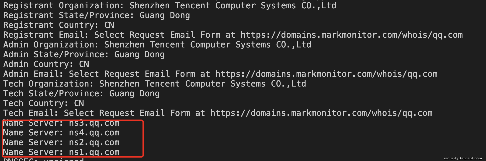

# 实战：浅谈信息搜集中的自动化数据分析

作者｜ 腾讯安全平台部 彦修

  
**一、WHAT**

> 现今很多信息搜集类工具或者文章基本停留在信息搜集的前期阶段，很多文章或者工具都在着重于拓宽信息搜集的渠道，从搜索引擎、被动DNS到爆破字典的丰富性等等，少有提到在获得这些信息之后是否需要处理以及如何处理。此外，也存在部分渗透测试人员每次信息搜集的时候把结果放到文本文件中，更有甚者每次渗透测试几乎都要进行一次全新的信息搜集过程。这种方式弊端非常明显，一是造成了比较大的时间消耗，二是搜集信息的二次利用非常繁琐，不够自动化，后期还需要大量的人工介入分析。

>   
> 为了解决以上两个问题，自然而然就存在了信息搜集的后期阶段，也就是本文题目所要讨论的 —— 信息搜集中的自动化数据分析。

  

  
提到信息搜集其实大家都不陌生，但是或许有人会有疑问信息搜集中的数据分析是什么？在讲数据分析之前我们思考一个比较常见的问题，有哪些方式来确定两个域名是同一个公司的资产，读者在公布答案之前可以先思考下这个问题，下面说下笔者的思考：

  
1、 ICP备案信息  
2、 WHOIS联系信息  
3、 证书信息  
4、 DNS解析信息  
5、 WHOIS-NAMESERVER信息  
6、 网页响应信息

  
1-4相对比较好理解，这里具体说下5和6，由于很多大公司采用自建DNS，所以其域名基本都会指向自建DNS NAMESERVER，这个特征可以作为是否为同公司资产的标准之一，具体可以看下图qq.com的whois；网页响应信息这里则可以通过CSP的头，网页相似度、引入静态资源的域名、网站的配置文件等。通过上述这6种方式来确定是否同公司的过程就是一个数据分析的过程，我们同时也可以发现这个确认方式是可逆的，也就是说当我们知道其中一个域名，想要知道该公司其他域名的时候，那么以上方式仍然奏效。

  
  

**二、WHY**

  
要问为什么要做自动化数据分析，那么首先要知道自动化数据分析的目的。我理解的数据分析主要包括两个目的，一是扩而充之，二是去伪存真。这两个其实都是比较好理解的，扩而充之和信息搜集的原则基本一致，主要是尽可能多而全的搜集到目标信息，而去伪存真则是确认目标信息，去除无关噪音信息，以免伤及无辜的同时也避免给自己带来一些不必要的麻烦。

  
我们先来聊聊扩而充之的问题，针对外部测试人员来说，渗透测试目标的资产主要包括域名、IP。当然严格意义上来说也可以包含安装包之类的客户端等。不过如果是针对的线上系统的测试，那么最主要的资产其实就是域名和IP，获得了更多的域名和IP，那么则相当于获得了更多的资产。

  
假如小A要向TSRC提交漏洞，如何搜集更多腾讯相关的资产呢？很多文章都会讲到子域名爆破、端口扫描等，但是爆破哪些域名？这些域名是否足够完整？获取端口信息的IP是否足够完整呢？回答这些疑问就是数据分析要做的。所以回到刚才上文提到的是否同资产的问题，如果小A在确认qq.com的域名隶属于腾讯之后，通过上述的模型关系则可以发现qq.com之外的更多兄弟域名，当然这只是数据分析的一小部分，数据分析的功能还包括获取更多的子域名、确定哪些域名是未启用状态、确定哪些域名是公共服务域名等，这也就是去伪存真的过程。  
简单来说，信息搜集中的数据分析就是发现更多诸如上述的关联关系，并且在信息搜集中去通过自动化方式去构建它从而提升我们信息搜集的广度和质量。

  
**三、HOW**

刚才讲到了信息搜集中的数据分析是什么以及为什么要使用数据分析，但是我们忽略了一个很关键的问题，那就是数据分析的数据是什么？这里提供一份表格，罗列了一些常见的可以用来分析的数据，以及他们之间的对应关系：

  
  
  
**注：DOMAIN表示域名，SUBDOMAIN表示子域名，BRODOMAIN表示兄弟域名，ORG表示组织，NAMESERVER表示DNS地址,CNAME表示DNS解析的CNAME字段；url forward表示访问IP跳转到域名；**

  
根据笔者的实践，这里的数据一部分可以通过公开的第三方获得，比如Censys（https://scans.io/）提供全球CERTFICATE数据，主要是443端口和8443端口的证书数据，早先这些数据也都公网可以直接下载的，现在做了部分限制，但是仍然可以通过申请得到，如果认为申请比较麻烦而自己有资源的话也可以自己扫描；而像WHOIS、DNS来说，Python有比较完整的包可以直接调用，不过随着对隐私的重视，当前DNS联系人信息基本都被屏蔽了，但是仍然有一些ORG或者NAMESERVER字段得以保留，这些仍然可以被使用；URL FORWARD信息和CSP的信息在进行爬虫扫描或者目录爆破时候额外增加一小部分代码即可完成这个需求；至于ICP这些数据其实也有一些接口，但是不是数据更新太慢，就是需要收费，所以得想办法自己解决。至于一些系统的验证码，目前AI识别传统的字符型验证码的成功率是比较高的，实测基本90%+，而且识别时间也是毫秒级，如下图。  
  
  
  
刚才讲了很多理论，相信大家看的云里雾里，接下来进入到实战阶段，我们具体以CERTFICATE数据为例讲下这些数据如何获取、存储和关联。值得一提的是扫描获取证书信息是有一些比较成熟的项目的，像刚才提到的Censys使用就是跟Zmap同属一个家族的zgrab（https://github.com/zmap/zgrab），其优势在于速度相对比较快，但是缺点也和Zmap差不多，会有较大的扫描流量出现。由于目前大家用的比较多的Python语言，为了方便各位读者，这里也贴下Python获取证书信息的关键代码：  
  
  
  
此外，CERTFICATE自身信息其实很多，像加密方式等等，倘若只是用于关联的场景，我们只需要关注组织、常用名称和备用名称即可：  
  
  
  
至于数据存储，笔者选取了常见的MySQL，要问为什么，最最最最主要的原因其实是便宜，当然MongoDB其实特别适合存储这些比较散乱的信息，但不是很适合关联，所以最终还是选择了MySQL。这里仍然以证书信息的存储为例，这里分别设计以下以下两个表：

  
**表1 证书信息表**  
  
  
**表2 组织信息表**  
  
  
接下来可以把数据解析之后导入，或者自由扫描，值得注意的是，如果自行扫描，建议Zmap先过下端口，之后再去获取证书，这样事半功倍。等数据已落入到自己一亩三分地，就可以为所欲为了，回到小A刚才的需求，他已经知道腾讯是拥有qq.com域名的，想获得其他兄弟根域名，应该怎么做呢，其实非常简单，一条SQL语句即可:  
  
  
  
这里有一个地方让\[.\]等于1是不规范的，没有考虑com.cn这种情况，但是，这里为了演示进行了简化，实际处理会稍微复杂一点，需要关联dns数据看下域名的基本信息做下二次确认。执行之后可以获得部分结果如下，全量差不多有100多个：  
  
  
  
至于获取qq.com的子域名则更不在话下，部分结果截图如下：  
  
  
  
还有很多其他实践，这里不再一一举例了，总之数据在手，可以挖掘出很多东西。此外，就像上文举证书例子的那样，表格里其他数据也有很多可以挖掘的点，举一反三，获取这些数据并进行存储，通过代码固化这些关联关系，那么我们的自动化数据分析平台就基本建设完成了。此刻我们再次针对信息搜集过程，进行一次重新复盘，信息搜集经过了自动化数据分析之后，将会演变为一个怎样的过程：

  

> *关联CERTFICAE信息找到所有同组织的兄弟域名，同时递归关联找到同组织兄弟域名的兄弟域名和子域名；  
> 关联WHOIS信息找到所有同公司、同组织、同邮箱的兄弟域名；  
> 关联CSP信息找到所有兄弟域名和子域名；  
> 关联ICP信息找到同公司域名的兄弟域名以及部分备案IP；  
> 关联DNS信息找到同IP(非CDN)对应的域名；找到同DNS NAMESERVER的域名；  
> 关联FORWARD信息获得IP对应的域名；  
> ......*

  

其实这些过程是递归进行的，直到找到所有的域名信息和IP信息，这些完成之后，接下来就可以进行其他的工作，比如爆破子域名等。

  
刚才提到了信息搜集中获取兄弟域名和子域名的自动化分析，那么还有其他哪些应用实践呢？笔者根据自身实践随意罗列两个：  
  

**案例一：**

我们以域名中经常出现的CDN为例，如何判定一个域名是否使用了CDN？当前一般有两种方式，一种是通过IP属性聚集，一种是通过CNAME后缀串进行判定。针对第二种来说，可以直接通过聚合不同ORG的域名对应的相同CNAME的后缀来进行筛选，通过ip聚合属性也可以做，只是相对麻烦一些。  
  

**案例二：**

在搜集目标具有的IP信息的时候，可以检查爆破之后的目标C段IP请求响应信息，可以确认是否为目标ip。与此同时，通过获取TitTitle和状态码之后的聚合也可以发现垃圾页面，  
  

当然，这类的关系属性还有很多，在此不再赘述，各位读者可以自行探索。笔者认为自动化数据分析其实并非单单只是方便了信息搜集，更重要的是思路和视野上的变化，以前的信息搜集就像是去菜市场买菜，现在则是有了自家园子，在需要菜的时候摘下即可。

  
最后本篇文章行文仓促，很多地方说的不是细致，权当是是抛砖引玉。  
  

最后的最后，如果你有志于安全领域深入发展，想见识更多的场景，欢迎投递简历至Security at tencent.com，在这里你可以打磨安全产品、分析和对抗先进的黑客攻击、为互联网用户保驾护航、深度参与威胁情报的建设运营等工作，更可以深度参与内外渗透测试、红蓝对抗等项目。
