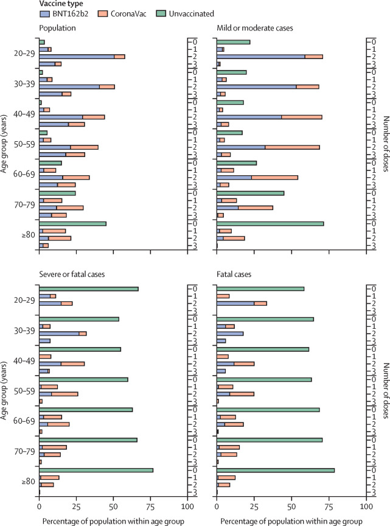
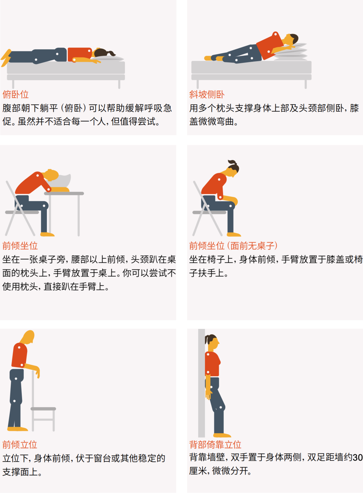
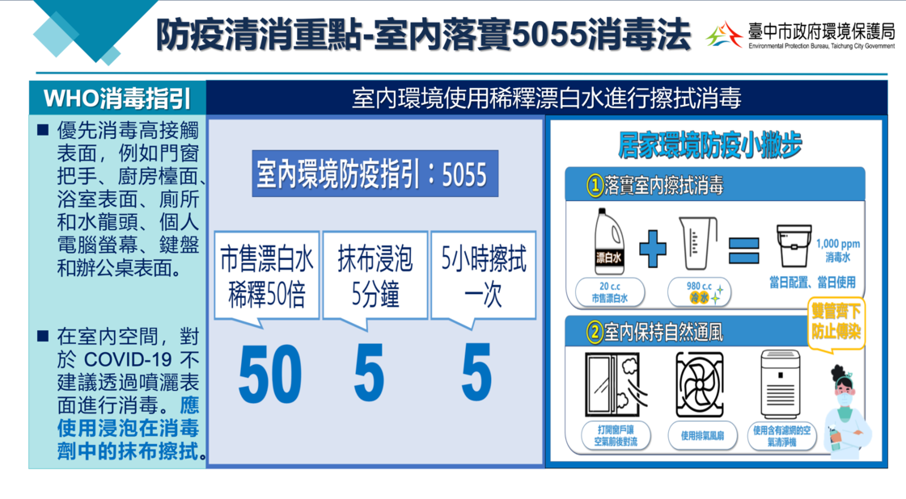

# 寒冷的新冠流行季，这些家庭备药与照护方法帮你度过 - 少数派

[04 月 30 日更新：2023 年 4 月修改](#update-0)

新冠病毒在这三年的变异中已经削弱了不少，医学界对它的了解也有所加深，和当初武汉的状况不可同日而语。但「变温和了」不等于完全「变得温和」1，随着国内新冠疫情政策逐渐放宽，有不少人开始担心感染后该如何在家自我治疗，尤其家中有老人小孩，或是尚未接种疫苗的朋友。除了做好防护、尽量让自己不被感染之外，还有什么能做的呢？

本文就将介绍一些在家中应对新冠的方法，包括能用来**缓解症状**的非处方药，和无需使用药物的**自我照护**方法。由于国内暂时没有发布统一的自我治疗指导手册，因此大部分内容借鉴自 [CDC](https://sspai.com/link?target=https%3A%2F%2Fwww.cdc.gov%2F)、[NHS](https://sspai.com/link?target=https%3A%2F%2Fwww.nhs.uk%2F) 及 [WHO](https://sspai.com/link?target=https%3A%2F%2Fwww.who.int%2Femergencies%2Fdiseases%2Fnovel-coronavirus-2019) 发布的相关治疗建议，具体的参考资料在文中链接、注释处可以查阅，**文末有总结表格与其他相关文章**以供参考。

## 2023 年 4 月疫情状况

在经历了 2022 年底到 2023 年初的疫情高峰后，到了 4 月，之前形成的抗体水平已经开始逐渐下降，各地也出现了新的疫情。在 2023 年 4 月 26 日的[国家卫生健康委员会新闻发布会](http://www.nhc.gov.cn/xcs/yqfkdt/202304/2a7d547fb3174a6f8ce6814d5c56bb0c.shtml)上，国家疾控局传防司一级巡视员贺青华对目前的情况进行了简要介绍。据他所说，整体看来，我国目前的疫情还是处在相对平稳的零星散发状态的，个别地区出现了小幅度上升迹象，但短期内出现规模性疫情的可能性仍然较小。

同场发布会上，中国疾控中心病毒病所研究员陈操也表示，虽然目前民众的关注点在 XBB 变异株上，但总体上看，本土病例仍以 BA.5.2 和 BF.7 及其亚分支为主。XBB 变异株占比有明显增长，但 WTO 认为，目前热议的 XBB.1.16 及其亚分支的全球流行风险低于 XBB.1.5 和其他正在流行的变异株，也没有因感染 XBB.1.16 而导致重症入院和死亡增加的报道。与其他奥密克戎亚分支相比，也没有看到疾病严重程度增加的报道。

所以，大家也不必太过惊慌。如果发生了地方性的聚集病例，注意自身防护即可。

### 公众佩戴口罩指引

在 2023 年 4 月 12 日，国务院联防联控机制疫情防控组发布了《[预防新型冠状病毒感染公众佩戴口罩指引（2023 年 4 月版）](http://www.gov.cn/lianbo/2023-04/12/content_5751073.htm)》。在这版正式指引中，明确了科学佩戴口罩的场景要求与口罩的选择方式。

**应佩戴**口罩的情形或场景有以下六项：

-   新型冠状病毒抗原或核酸检测**阳性**期间。
-   出现发热、咽痛、咳嗽、流涕、肌肉酸痛、乏力等**疑似**新型冠状病毒感染症状期间。
-   生活、工作或学习的社区、学校发生**聚集性疫情**时。
-   前往**医疗机构**就诊、陪诊、陪护、探视时。
-   外来人员进入**养老机构、社会福利机构**等脆弱人群集中场所时。
-   养老机构、社会福利机构及托幼机构、学校、校外培训机构等重点机构医护、餐饮、保洁、保安等**公共服务人员工作期间**。

总结起来，指引明确了戴口罩是为了「防止传染」和「保护弱势」，且指出，新型冠状病毒感染者和疑似感染者建议佩戴 N95 或 KN95 颗粒物防护口罩或以上级别的口罩（无呼吸阀），其他人员建议佩戴一次性使用医用口罩或医用外科口罩。

至于**建议佩戴**口罩的情形或场景，则总结为以下四项：

-   乘坐飞机、火车、长途车、轮船、地铁、公交车等**公共交通工具**时。
-   进入超市、影剧院、客运场站等**环境密闭、人员密集场所**时。
-   **老年人、慢性基础疾病患者、孕妇**等前往室内公共场所时。
-   参加人员来源较广、流动性较强且没有核酸检测或抗原检测、健康监测等防控要求的**大型会议或活动**举办时。

这也明确了在这些场所中，如果不满足应佩戴口罩的条件，不必强制佩戴口罩。类似地，指引中还写明了可不佩戴口罩的常见情形或场景，除了常规的生活场景外，特别指出：

-   进行运动的人员，佩戴口罩可能导致呼吸困难时。
-   3 岁及以下婴幼儿。

这也是过往的实践中常常出现的问题，明确避免了不科学的口罩佩戴可能造成的危险，且在注意事项中额外提及：除以上情形或场景外，个人可根据自身健康状况和需求自主选择是否佩戴口罩；心肺功能障碍人员应在医生指导下佩戴口罩。口罩指引在未来也将根据需要动态优化调整。

而如果你还是不幸感染了新冠，并已经感受到了明显的症状，可以参考下面的方法应对。

## 值得警惕的症状

在开始之前，先说一下「**不能在家里自行治疗等痊愈的情况**」。如果出现了以下这些症状，请尽早去医院检查并接受治疗：2

-   喘不过气来，甚至连说短句也费劲；
-   胸口出现持续的疼痛、挤压感；
-   咳血；
-   皮肤、嘴唇和甲床苍白、发灰，皮肤出现斑点；
-   有皮疹，且用玻璃杯压在皮疹上时，皮疹不会褪色；
-   发烧持续高于 38.5℃，超过 3 天；3
-   困惑、晕倒、持续昏睡，无法或很难醒来；
-   说话困难，或理解他人讲话困难；
-   出现面部、手臂和腿部的无力，尤其是在一侧身体上出现。

对儿童来说，在上述症状之外，还有这些情况同样值得注意：4

-   脖子僵硬；
-   出现了无法停止的抽搐；
-   对光线感到困扰；
-   哭声相比平时更弱；或无法停止啼哭；
-   不像平时那样积极地对外界事物作出反应，或对平时的活动（如进食）不感兴趣。

这些症状往往说明：一，此时状况已经**脱离了轻症范畴**；或者二，这些症状本身不具有特异性，容易**与其他严重疾病混淆**（比如比较常被提及的病毒感染并发症心肌炎），需要去医院做进一步的检查，防止病情恶化或误诊。

图源：[https://www.edh.tw/article/27868](https://sspai.com/link?target=https%3A%2F%2Fwww.edh.tw%2Farticle%2F27868)

### 可能影响症状严重程度的因素

对**孕妇**、50 岁以上的**老人**、5 岁以下的**儿童**、**自身有慢性基础疾病**，以及因为种种原因**免疫系统较弱**的人群来说，感染后出现重症的几率也更大。相反，如果有疫苗保护，或者过往的感染经历已经在体内建立了抗体，就可以有效地保护自己和身边人，少被病毒侵扰。疫苗的效果会随着时间过去慢慢减弱，因此及时补种加强针也十分有必要。

无论如何，**疫苗仍是防护自身的最佳途径**。香港的团队对比了接种疫苗和未接种疫苗者的新冠重症率和死亡率，发现在各个年龄段中，未接种疫苗者（下图中绿色）的重症率和死亡率都要远远高于已经接种疫苗的人群。

McMenamin, M.E. *et al.* (2022) “Vaccine effectiveness of one, two, and three doses of BNT162B2 and Coronavac against covid-19 in Hong Kong: A population-based observational study,” *The Lancet Infectious Diseases*, 22(10), pp. 1435–1443. Available at: https://doi.org/10.1016/s1473-3099(22)00345-0.

而即使科兴疫苗（上图中橙色）的有效率不如复必泰（Pfizer-BioNTech，上图中紫色），但在接种过加强针后，两种疫苗有效率的差异已经非常微小，并且都能为新冠病毒提供不错的防护。

左图：M. E. McMenamin et al., 2022；右图：How China’s Sinovac compares with BioNTech’s mRNA vaccine – The Economist

## 应对种种症状的非处方药物

本节将会介绍可以用来缓解新冠症状的非处方药，可以直接跳到相应的段落查看。

非处方药就是无需医生处方即可在药店买到的药品。它们通常是上市许久的处方药，经过了大量的评估，确保个人使用时不会造成严重的副作用，才会下放为非处方药。和处方药相比，它们更安全、副作用更小，适用的症状也更轻微。

不过，尽管非处方药已经相对安全，但药物都有其适用人群、安全剂量，并且可能与其他非处方或处方药物或食物发生相互作用。因此，在服用前，**请务必检查随盒附赠的说明书**，确认适用后，再按照推荐的剂量服用。**老人、儿童、孕妇、哺乳期女性、慢性病患者，和肝肾功能受损者需要格外注意。**

文中介绍的将是药物的**活性成分**，即某种成分的「通用名」。同一种药物可能以不同的商品名发售，在购买时认准包装上的介绍即可。有些药物是多种有效成分的**复方制剂**，与单个药品没有高下之分，主要区别在于每次要吃几片药，因此**看清有什么有效成分**然后按需选购即可。

⚠️️ 复方制剂很适合家中备药，但务必认清有效成分，谨慎与其他药物联用，以防单种药物过量。

### 退烧止痛

**对乙酰氨基酚（扑热息痛）**和**布洛芬**是最常用的两种非处方镇痛药，它们也有退烧的功效。目前尚**没有证据**说明布洛芬会让新冠症状加重，因此服用任意一种都是安全的。

扑热息痛相对而言是更安全的退烧药，无论是小孩子还是孕妇都可以服用。通常情况下，它唯一的不安全因素就来自于过量服用导致的急性肝损伤。健康的成年人只要 24 小时内服用不超过总计 4g，并且两次服药的间隔超过了四小时，就无需担心服药过量。如果肝肾功能受损、长期饮酒、体重过低（<50 kg）以及未成年人，扑热息痛的安全上限就会更低一点。另外，正在服用的其他药物也有可能影响扑热息痛的代谢，因此在服用前，最好仔细阅读说明书，确保服用的是安全剂量。

布洛芬属于非甾体抗炎药，也是公认最安全的非甾体抗炎药。它的效果比扑热息痛更强一点，不过有更多相互作用，也可能影响胃肠道黏膜，出现腹部不适的症状（不过这个在服用前吃点东西垫垫就行）。布洛芬在 24 小时内的服用上限是 2.4 g，未成年人中更低，需要参考说明书中的剂量服用。

不过，布洛芬和同族的其他非甾体抗炎药都不适合孕妇、心脏衰竭、哮喘和慢性阻塞性肺病（COPD）、胃肠道溃疡患者，以及肝肾功能受损者服用。如果你是此类患者，扑热息痛或许是更合适的选择，但在购买前最好还应该咨询一下医生的意见。

另外，在发烧时很有可能大量出汗，这就会让身体一直处于一个缺水的状态中。当人体缺乏水分，可能会感到口渴、头晕、少尿等等，无法顺畅表达自己感受的婴幼儿还会频繁舔嘴唇、哭泣时泪水减少、眼睛凹陷5。这些症状可以通过**多喝水**缓解，或者购买**口服补液盐**6补充失去的电解质。

### 咳嗽

⚠️️ 镇咳药与化痰药**即使归为非处方药也不要轻易擅自使用**，务必咨询具有资格的医/药从业者。

最新流行的新冠变异株奥密克戎（Omicron）和最初代的病毒不同，感染后症状主要出现在咽喉，最常见的两个症状就是咳嗽与喉咙痛。咳嗽又分为痰咳和不会分泌痰液的干咳，前者出现是因为身体试图把产生的有害分泌物（痰）清除出体内，后者则是因为感染后喉部变得更敏感了，平时习以为常的气流和小颗粒都有可能激发咳嗽反射。

非处方的止咳化痰药有**愈创甘油醚**和**羧甲司坦**，前者不适合 12 岁以下的儿童服用，12 岁以上的未成年儿童需要在专业人士指导下使用。愈创甘油醚会引起支气管分泌增加，使痰液稀释，从而缓解症状。它的常见副作用包括了恶心、头晕、嗜睡和过敏，同时因为作用于血管平滑肌，因此不建议高血压患者服用。愈创甘油醚还可能与某些药物发生相互作用，因此服用前请参阅产品说明书。

**羧甲司坦**的作用原理是降低痰液的浓稠性，使其更容易从身体内排出。它的的副作用与愈创甘油醚类似，只不过胃肠道不适症状可能更常见。在服用时，**应避免同时服用强镇咳药**，以免痰液堵塞气道。有肝脏疾病、胃溃疡者和孕妇请在医生指导下服用。使用羧甲司坦后如果出现了呕吐，应及时就医。它不适合与某些处方药及非处方药共同服用（如非甾体抗炎药、皮质类固醇与某些抗凝血剂），服用前请参阅产品说明书。7

同样常见的还有**氨溴索、溴己新**等降低痰液黏稠度的药物，副作用相对较小，但使用前同样务必详细咨询从业人员。

适用于干咳的药物有**福尔可定**和**右美沙芬**，它们的作用原理都是抑制大脑中的咳嗽中枢，并且都不适合用于 12 岁以下的儿童、慢性呼吸道疾病患者、孕妇。右美沙芬不适合正在服用精神类药物的人使用，且与有些药物可能产生相互作用，在服用前请参阅说明书。8

需要注意的是，**治疗干咳的和痰咳的药物不能混用**。这两种咳嗽的起因不同，因此药物也是通过不同方式起效。在出现痰咳时使用应对干咳的药物，可能会使咳嗽的频率降低，但也会导致痰液聚集在气管中，出现更严重的后果；相反，痰咳的药物对干咳没有效果，而如果想要让药物起效就多吃一些，更容易出现药物过量反应。因此，无论什么情况，都不要使用不对症的咳嗽药！

对无法服用止咳药却不停干咳的 1 岁以上儿童来说，可以考虑尝试**蜂蜜水**。蜂蜜中的糖分会促进唾液和呼吸道粘液的分泌，让喉咙没那么敏感，因而减少咳嗽的频率。同时蜂蜜还有一定的消炎、抗菌功效，对持续干咳导致的喉部不适也有缓解作用。9

### 喉咙痛

感染奥密克戎后另一个常见的症状是喉咙痛。这和细菌感染导致的喉咙痛毫无关系，因此**服用抗生素是没有用的**。推荐的非处方药有两类，一种是局部麻醉剂，另一种是各种润喉糖。前面提到过的退烧止痛药和蜂蜜水也能对缓解喉咙痛有所帮助。

和蜂蜜水相似，**润喉糖**中的糖分可以促进唾液分泌以帮助喉咙湿润、减少刺激。部分药用润喉糖中还会加入局部麻醉剂、抗菌药物和止痛药，使其效果更佳10。

像**利多卡因**喷剂就是一种局部麻醉剂，它的作用是阻断痛觉在神经中的传播，简单来说，就是让那块区域「麻了」、没感觉了，自然就感觉不到不适。不过等到药效过去，被药物掩盖的痛觉还是会重新显现，一般情况不必要。

一种药用润喉糖，图源 TravelPharm

### 流鼻涕

治疗流鼻涕最有用的是各种抗组胺药物，比如**氯苯那敏**、**氯雷他定**和**西替利嗪**，它们通常用来治疗各种过敏。这类药物分成一代和二代，氯苯那敏（扑尔敏）是一代药物，服用后可能导致昏睡，适合睡前服用，即使没有相关症状也可以用来助眠；氯雷他定和西替利嗪是二代药物，不会造成困倦。

擤鼻涕次数过多可能导致鼻腔内部又干又痛，有时鼻孔下方也会被纸巾蹭得得通红——我想春夏之交的鼻炎患者应该清楚这是种什么感受。使用更柔软的纸巾可以有效减弱鼻下摩擦；将温热的生理盐水喷剂用于鼻腔，或者把鼻子放在热水杯上感受水蒸气，都能够缓解鼻腔内部的不适。

### 鼻塞

市面上可以买到的药物中，**塞洛唑啉**和**伪麻黄碱**可以有效缓解鼻塞的症状，前者的常见形式是滴鼻剂，后者常见于感冒合剂中，直接购买合剂即可。常见的副作用包括感到不适、头痛和口干，使用时间越短副作用越小，通常不建议超过使用 7 天。它们可能会升高血压和心率，因此有心脏病和高血压者慎用。在服用这些药物时，尽量减少咖啡因（如咖啡、茶、可乐和巧克力）的摄入量，咖啡因可以增加心率，与药物共同作用会出现如发抖这样的副作用。另外，12 岁以下的儿童、孕妇、哺乳期妇女及青光眼患者需要在医生指导下服用。可能与其他药物产生相互作用，服用前请参阅产品说明书11。

### 胃酸返流

感染后还有一定几率出现胃酸返流的症状，像是胸部中间出现的烧灼感，和嘴里不愉快的酸味，症状往往在进食后、躺下时和弯腰时加重——这些都是胃酸返流导致的结果。

共有两类非处方药可以用来缓解胃酸返流：**抗酸剂**和**抑酸药**12。前者采用酸碱中和的方式降低胃酸的浓度，它的主要成分多为弱碱性无机盐，包括氢氧化铝、碳酸氢钠、铝碳酸镁（达喜）等，目前大家比较熟悉和常用的是铝碳酸镁。抑酸药的主要成分有药名以「替丁」结尾的 H2 受体拮抗剂，如西咪替丁、法莫替丁；还有药名常以「拉唑」结尾的质子泵抑制剂，主要有雷贝拉唑、奥美拉唑、泮托拉唑。

抗酸剂起效更快，但它们只能在出现症状时短暂缓解，长期使用会导致种种副作用；抑酸药的效果更持久，更适用于长期的胃肠道不适，但长期服用可能导致缺乏维生素。这两种药物都需要在饭后服用效果最好，进食后也是最容易出现胃酸返流的时候。有些药物可能会与其他药物有相互作用，在服用前请参阅产品说明书。

### 服用时有特定顺序吗？

最近几天，网络上流传着一张「[新冠吃药顺序图](https://weibo.com/7548639008/Mik3YvUu7)」，大意是说在感染后应该按照某个特定的顺序服药。市售的非处方药中没有可以「治疗」新冠的药物，更多地是起「缓解症状」的作用。因此，**完全无需按照这个图片中的顺序吃药**，出现什么症状就吃对应的药物，出现了值得警惕的症状及时就医，才是对身体更好的方式。

## 自我照护

在上一节中介绍了用来应对新冠症状的一些非处方药物。但这些药物并不能缓解感染后的所有症状，也不适用于所有人。所以这一节里，就将介绍如何在不使用药物的情况下，减少病痛的折磨。

### 呼吸急促

新冠是呼吸道疾病，并且疾病本身十分消耗体力，因此呼吸急促出现的几率非常高，在进行一些耗费体力的活动后更可能出现——这些也不代表新冠病毒已经对肺部造成了损伤。

通常，体力消耗导致的呼吸急促在一段时间后就可以自行改善。你还可以采用这些方法减轻症状：13

-   降低室内温度，比如关掉暖气、打开窗户，但不要使用风扇，它们会把病毒传到室内的其他地方；
-   深呼吸，吸气时用鼻子，并从嘴里缓慢吐出气流，就像轻柔地吹蜡烛那样；
-   采用体力消耗更小的姿势，比如俯卧、侧卧；前倾坐位（身体前倾或趴在桌子上）；直立时身体稍微前倾，可以在面前放一把椅子，或者背靠墙壁，如下图所示。

### 持续咳嗽

在前文已经介绍过，对一岁以上、无法服用药物的儿童，可以用温热的蜂蜜水缓解症状，这一点对于成年人来说也同样适用。

干咳的主要原因就是气道对外界的刺激更敏感了，因此用鼻子而不是嘴呼吸，能减少喉部接收到的刺激源。同样地，如果有吸烟的习惯，也建议暂停，在此期间可以用尼古丁贴剂等过渡。

**成年人**还可以试试「[停止咳嗽练习](https://sspai.com/link?target=https%3A%2F%2Fapps.who.int%2Firis%2Fbitstream%2Fhandle%2F10665%2F349695%2FWHO-EURO-2021-855-40590-62244-chi.pdf)」，即在出现咳嗽冲动时就闭上嘴，用手捂嘴、闷住咳嗽，同时做吞咽动作；屏住呼吸一小会儿。再次开始呼吸时，用鼻子轻柔地吸气和呼气。几次下来应该就能有所改善。

如果是因为夜间胃酸返流导致的咳嗽，比如躺下就想咳嗽，可以适当抬高枕头，或者转为侧卧，看看是否有改善。

### 吞咽困难

新冠导致的喉咙肿痛可能导致吞咽困难，甚至在进食时让食物误入气管。如果出现了这个问题，首先可以做的是尝试不同质地的食物，看是否有一些能让你吞咽得更舒服，比如软的、光滑的、湿润的小块食物，通常更好吞下。

吃东西时，也要尽可能身体坐直、保持注意力集中，避免在吃饭或喝水时说话——这么做可能导致气道开放，致使食物和饮料误入气道。咀嚼时细嚼慢咽，确保口腔内没有食物后再吃/喝下一口。14

如果吃完一餐就让你精疲力尽，那就可以把一顿饭的量分成多份，少食多餐。另外也要注意保持口腔清洁，一天刷两次牙。

### 丧失味觉和嗅觉

味觉和嗅觉丧失往往在其他症状后出现，往往有 5 天左右的延迟。大部分的新冠症状会在感染后一周消失，但味觉和嗅觉往往需要两周甚至更久才能恢复。15

目前没有药物可以加速味觉和嗅觉修复。可以试着进行嗅觉训练看看是否能有改善，比如闻不同的气味，试着辨识它们之间的区别。饮食也会显得淡而无味，一个方法是在食物中添加不同的香草和香料（有可能加重胃反流），另一个则是尝试 [以质感而非味道搭配食物](https://www.douban.com/group/topic/273218231/)。

或者干脆放弃享受食物，用代餐确保每日能补充足够的营养。需要注意，代餐本身也有不少讨论，它是否能完全替代普通食物还没有定论，因此在大量尝试前请咨询医生意见再开始。

另外，嗅觉缺失可能导致对生活中常见的一些危险因素缺乏警觉性。比如在做菜时一不小心烧糊锅、或者无法及时感知到煤气泄露的臭味。如果独居在家，就更要注意这些问题，远离高危行为，保障自身安全。16

虽然说刺激性味道可以作为测试……我们仍然不建议你舔这个。

### 保持健康、均衡的饮食

在吞咽困难和丧失味觉和嗅觉的双重 BUFF 加持下，维持一个营养、均衡的饮食就没那么容易了。但得病期间身体消耗加大，除了多休息之外，最重要的就是给身体提供足够的能量抗击病毒，因此健康的饮食还是十分有必要的。

世卫组织推荐每日饮食包括以下内容：17

-   水果、蔬菜、各种豆类（如扁豆等豆类）、坚果和全谷物类（如未加工的玉米、小米、燕 麦、小麦和糙米）；
-   每天至少吃五份（1 份 = 80 克）各种水果和蔬菜，每餐都应有蔬菜；
-   选择全谷物食品，包括全麦面包、米和面；
-   选择富含蛋白质的食物，如各种豆类、鱼、蛋和瘦肉；
-   每天吃一些乳制品或乳制替代品（如豆制品）；
-   限制盐、脂肪和糖的摄入量：
-   每天盐的摄入量应少于 5 克，大约一茶匙
-   每天的糖摄入量应少于 50 克，大约 12 茶匙
-   脂肪摄入量应低于摄入总能量的30%，选择鱼、牛油果、坚果和植物油中的不饱和脂 肪，而不是饱和脂肪和反式脂肪。
-   多喝水，目标是每天喝 6-8 杯水——并且因为发烧时总是无可避免地出汗，所以补充水分就更重要了。

### 注意卫生

大多数感染新冠病毒的患者病情轻微，只需居家治疗即可自行康复。在恢复期间，无论是独居还是与他人同住，卫生问题也需要注意，以防康复后再次感染病毒，或将病毒传播给其他人。

感染新冠病毒后，在打喷嚏或咳嗽时，携带病毒的呼吸道飞沫会释放到空气中。落在物体表面的病毒可以存活数小时至数天，大多数表面在 3 天之后就很难因为接触而传染了。18

尽管如此，仍然建议应及时清洗、消毒家中经常接触的表面，比如桌子、门把手、电灯开关、马桶、水龙头等，以及日常经常使用的电子设备，如手机、电脑、键盘和鼠标等，最好可以做到「一日一清洁」。

日常消毒可以以 1:49 的比例稀释家用漂白水（即混合 10 毫升含 5.25% 次氯酸的家用漂白水与 490 毫升清水混合），待 15-30 分钟后，用清水清洗并抹干。19金属表面可用浓度为 70% 的酒精，电子设备请参考厂商的说明清洁，如 [Apple 产品的清洁指南](https://support.apple.com/zh-cn/HT204172#:~:text=%E4%BD%A0%E5%8F%AF%E4%BB%A5%E4%BD%BF%E7%94%A870%25%20%E5%BC%82,%E6%B5%B8%E5%85%A5%E4%BB%BB%E4%BD%95%E6%B8%85%E6%B4%81%E5%89%82%E4%B8%AD%E3%80%82)。

与患者同住时，要注意分开使用餐具和床上用品等私人物品。洗涤时，最好以最高温度烘干，接触过感染者衣物后要及时清理双手和衣物篮。清洗餐具时最好带上手套，用肥皂和热水、或洗碗机清洗。20

图源：[https://www.epb.taichung.gov.tw/2056661/post](https://sspai.com/link?target=https%3A%2F%2Fwww.epb.taichung.gov.tw%2F2056661%2Fpost)

## 总结

建议家中准备这些非处方药物清单总结如下。再次提醒，无论使用什么药物，哪怕是非处方药物，在用药前也一定参阅产品说明书，确保安全后按指示服用。

|     |     |     |
| --- | --- | --- |
| **适应症** | 药物通用名 | 注意事项 |
| **发烧、疼痛** | 对乙酰氨基酚 | 不要吃过量 |
| 布洛芬 | 胃肠道副作用；某些人群慎用 |
| **干咳（\*询问专业人员）** | 福尔可定 | 12 岁以下的儿童、慢性呼吸道疾病患者、孕妇慎用 |
| 右美沙芬 | 服用精神类药物者、12 岁以下的儿童、慢性呼吸道疾病患者、孕妇慎用 |
| **袪痰（\*询问专业人员）** | 愈创甘油醚 | 12 岁以下儿童、高血压患者慎用 |
| 羧甲司坦 | 肝脏疾病、胃溃疡者和孕妇慎用 |
| 氨溴索、溴己新 | –   |
| **喉咙痛** | 润喉糖 | –   |
| **流鼻涕** | 氯苯那敏 | 可能导致疲倦、昏睡 |
| 氯雷他定、西替利嗪 | –   |
| **鼻塞** | 塞洛唑啉、伪麻黄碱（一般购买合剂即可） | 不建议使用超过 7 天；  服药时应减少咖啡因摄入；  12 岁以下的儿童、孕妇、哺乳期妇女及青光眼患者需要在医生指导下服用 |
| **胃酸返流** | 氢氧化铝、碳酸氢钠、铝碳酸镁 | 饭后服用效果最佳 |
| 西咪替丁、法莫替丁 | 饭后服用效果最佳；  长期服用可能导致缺乏维生素 |
| 雷贝拉唑、奥美拉唑、泮托拉唑 |
| **缺水** | 口服补液盐 | 可以将 6 茶勺糖和半茶勺盐溶解在 1 升干净的饮用水中自制 |

对于感染新冠后可能出现的这些问题，推荐采取这些措施自我照护：

|     |     |
| --- | --- |
| **症状/情况** | 解决方案 |
| **呼吸急促** | -   降低室内温度 -   用鼻子吸气、嘴巴吐气 -   采用体力消耗更小的姿势（躺下或身体微微前倾） |
| **持续咳嗽** | -   温热的蜂蜜水 -   停止咳嗽练习 -   停止吸烟 -   如果受胃酸返流影响，抬高枕头或选择侧睡 |
| **吞咽困难** | -   找到让你吞咽得更舒服的食物 -   吃东西时尽量坐直身体、保持注意力集中，避免在进食时讲话 -   少食多餐 -   保持口腔清洁，一天刷两次牙 |
| **丧失味觉和嗅觉** | -   进行嗅觉训练 -   在食物中添加香草和香料 -   尝试搭配不同质感的食物 -   避免高危行为 |
| **保持健康、均衡饮食** | -   选择蛋白质更高的食物 -   每天至少吃 400 克不同种类的蔬菜水果 -   选择全谷物食品 -   每天吃一些乳制品或乳制替代品 -   限制盐、糖、脂肪摄入 -   多喝水，至少 6-8 杯 |
| **家居卫生与防护** | -   每日消毒家中经常接触的表面 -   与患者分开房间居住，分开使用床单、餐具等私人物品 |

对身体健康、打过疫苗的年轻人来说，新冠的症状通常不会太过严重，但也不要掉以轻心。日常生活中做好防护，尽早接种三针疫苗，定期做新冠检测，确诊后做好自我隔离、及早治疗。如果出现了严重的症状，或者拿不准病情如何，请尽快就医，或向专业人士请教。希望本文对你有所帮助，也希望大家能少受新冠病毒困扰，身体健康。

#### 关联文章

-   [关于新冠疫苗，我们整理了这些问题，希望有你想知道的](https://sspai.com/post/66902)
-   [药不能停，但也不能乱吃：为什么医嘱里要教你如何吃药？](https://sspai.com/post/71025)
-   [药片、颗粒还是胶囊：聊聊你或许从未关注过的药物剂型](https://sspai.com/post/68691)
-   [吃了我就不疼了？服用止痛药前，你最好了解这些](https://sspai.com/post/74125)
-   [你的家庭小药箱，从这 8 种非处方药开始](https://sspai.com/post/66590)
-   [核酸、抗原、抗体检测，三种新冠检测方式有何差别？](https://sspai.com/post/72950)
-   [药不能停的方法有几种：9 款服药 app 横评](https://sspai.com/post/75293)

\> 少数派请你做地图：城市声音收藏夹[火热征集中](https://sspai.com/post/76807)，期待你创作的城市之声 🎧

\> 下载[少数派 2.0 客户端](https://sspai.com/page/client) 、关注[少数派公众号](https://sspai.com/s/J71e)，解锁全新阅读体验 📰

\> 实用、好用的[正版软件](https://sspai.com/mall)，少数派为你呈现 🚀

以下内容于 04 月 30 日更新

2023 年 4 月修改

文章在 2023 年 4 月 30 日根据新发疫情状况有所修改，增加了 2023 年 4 月散发疫情的相关信息与口罩防护方案。

-   1语出《柳叶刀》最新研究，https://www.thelancet.com/journals/lancet/article/PIIS0140-6736(22)00056-3/fulltext
-   2https://www.cdc.gov/coronavirus/2019-ncov/symptoms-testing/symptoms.html ； https://www.nhs.uk/conditions/coronavirus-covid-19/self-care-and-treatments-for-coronavirus/how-to-treat-symptoms-at-home/ ； https://apps.who.int/iris/bitstream/handle/10665/349695/WHO-EURO-2021-855-40590-62244-chi.pdf
-   3http://www.nhc.gov.cn/cms-search/xxgk/getManuscriptXxgk.htm?id=2b6c16cc176b4806b399ea5588353b3c
-   4https://www.nhs.uk/conditions/coronavirus-covid-19/symptoms/coronavirus-in-children/
-   5https://www.nhs.uk/conditions/dehydration/
-   6自制方法：将 6 茶勺糖和半茶勺盐溶解在 1 升干净的饮用水中，搅拌均匀，大人小孩都可以使用。如购买成品，请参阅说明书。https://rehydrate.org/solutions/homemade.htm
-   7https://www.nhs.uk/medicines/carbocisteine/
-   8https://www.medicines.org.uk/emc/product/1523/smpc；https://www.medicines.org.uk/emc/product/1523/smpc
-   9Oduwole, O. et al. (2018) “Honey for acute cough in children,” Cochrane Database of Systematic Reviews, 2018(12). Available at: https://doi.org/10.1002/14651858.cd007094.pub5.
-   10Majekodunmi (2015). A review on Lozenges. American Journal of Medicine and Medical Sciences. Vol. 5 No. 2, pp. 99-104. doi: 10.5923/j.ajmms.20150502.07.
-   11https://www.nhs.uk/medicines/pseudoephedrine/about-pseudoephedrine/；https://bnf.nice.org.uk/drugs/xylometazoline-hydrochloride/
-   12关于如何区分：http://lxjk.people.cn/n1/2018/0726/c404177-30171883.html
-   13https://www.nhs.uk/conditions/coronavirus-covid-19/self-care-and-treatments-for-coronavirus/how-to-treat-symptoms-at-home/；https://apps.who.int/iris/bitstream/handle/10665/349695/WHO-EURO-2021-855-40590-62244-chi.pdf
-   14https://apps.who.int/iris/bitstream/handle/10665/349695/WHO-EURO-2021-855-40590-62244-chi.pdf
-   15Santos, R. E. A., da Silva, M. G., do Monte Silva, M. C. B., Barbosa, D. A. M., Gomes, A. L. D. V., Galindo, L. C. M., da Silva Aragão, R., & Ferraz-Pereira, K. N. (2021). Onset and duration of symptoms of loss of smell/taste in patients with COVID-19: A systematic review. American journal of otolaryngology, 42(2), 102889. https://doi.org/10.1016/j.amjoto.2020.102889
-   16https://www.bda.uk.com/uploads/assets/6a95644d-f8a1-4103-b934da36a7d2c9e8/Homerton-COVID19-Eating-drinking-on-recovery.pdf
-   17https://www.who.int/zh/campaigns/connecting-the-world-to-combat-coronavirus/healthyathome/healthyathome---healthy-diet
-   18https://www.aber.ac.uk/en/media/departmental/humanresources/supportingstaff/healthandwell-being/Friday---COVID-19---What-you-should-do-if-you-live-with-someone-with-coronavirus.pdf；https://www.mayoclinic.org/zh-hans/diseases-conditions/coronavirus/in-depth/coronavirus-transmission/art-20482397
-   19https://www.mayoclinic.org/zh-hans/diseases-conditions/coronavirus/in-depth/coronavirus-transmission/art-20482397；https://www.coronavirus.gov.hk/pdf/tips\_booklet.pdf
-   20https://www.mayoclinic.org/zh-hans/diseases-conditions/coronavirus/in-depth/treating-covid-19-at-home/art-20483273?continueFlag=92417f1ef9d9c5707d1256979cbac441
