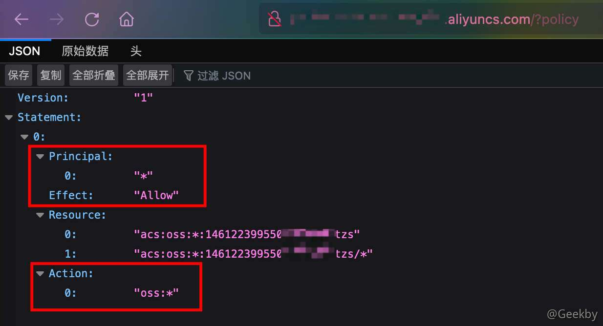
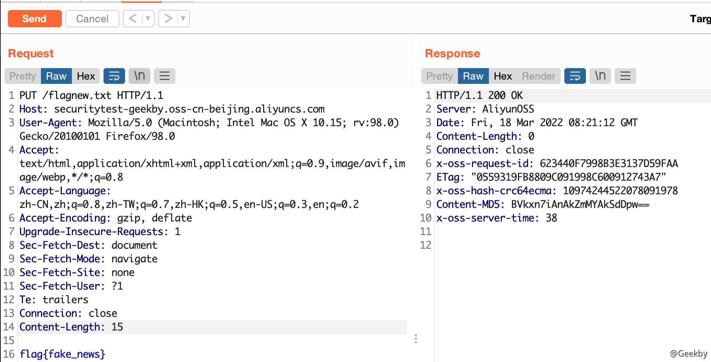
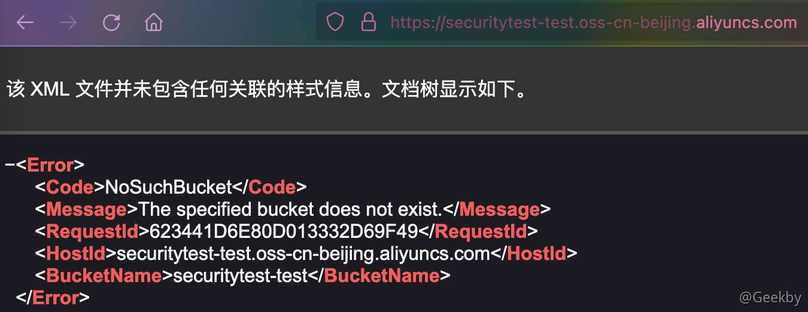

# [](#%E5%AF%B9%E8%B1%A1%E5%AD%98%E5%82%A8%E6%94%BB%E9%98%B2%E6%A1%88%E4%BE%8B)对象存储攻防案例

云上存储己经是企业中常见的一款云上产品，伴随着云上业务的发展，对象存储作为云原生一项重要的能力，暴露出一系列的安全问题，其中的权限配置是管理人员不可忽视的，从攻击者的视角来看几大云存储的攻击方法与利用。

## [](#1-%E5%AF%B9%E8%B1%A1%E5%AD%98%E5%82%A8)1 对象存储

对象存储中可以有多个桶（Bucket），然后把对象（Object）放在桶里，对象又包含了三个部分：Key、Data 和 Metadata。


### [](#11-bucket)1.1 Bucket

存储空间（Bucket）是用户用于存储对象（Object）的容器，所有的对象都必须隶属于某个存储空间。存储空间具有各种配置属性，包括地域、访问权限、存储类型等。用户可以根据实际需求，创建不同类型的存储空间来存储不同的数据。

-   同一个存储空间的内部是扁平的，没有文件系统的目录等概念，所有的对象都直接隶属于其对应的存储空间。
-   每个用户可以拥有多个存储空间。
-   存储空间的名称在 OSS 范围内必须是全局唯一的，一旦创建之后无法修改名称。
-   存储空间内部的对象数目没有限制。

### [](#12-object)1.2 Object

对象（Object）是 OSS 存储数据的基本单元，也被称为 OSS 的文件。和传统的文件系统不同，对象没有文件目录层级结构的关系。对象由元信息（Object Meta），用户数据（Data）和文件名（Key）组成，并且由存储空间内部唯一的 Key 来标识。

Key 是指存储桶中的唯一标识符，例如一个 URL 为：`https://geekby.oss-cn-beijing.aliyuncs.com/MarkDown/202203171716980.png`，这里的 `geekby` 是存储桶 Bucket 的名称，`/MarkDown/202203171716980.png` 就是 Key。

对象元信息是一组键值对，表示了对象的一些属性，比如最后修改时间、大小等信息，同时用户也可以在元信息中存储一些自定义的信息。可以简单的理解成数据的标签、描述之类的信息，这点不同于传统的文件存储，在传统的文件存储中这类信息是直接封装在文件里的，有了元数据的存在，可以大大的加快对象的排序、分类和查找。

Data 就是存储的数据本体。

## [](#2-%E5%AF%B9%E8%B1%A1%E5%AD%98%E5%82%A8%E7%9A%84%E5%88%A9%E7%94%A8%E6%96%B9%E5%BC%8F)2 对象存储的利用方式

### [](#21-object-%E9%81%8D%E5%8E%86)2.1 Object 遍历

在创建 Bucket 时，可以选择是否公开，默认是 private 的权限，如果在错误的配置下，给了 `Listobject` 权限，就会导致可遍历存储桶。

#### [](#211-%E9%98%BF%E9%87%8C%E4%BA%91)2.1.1 阿里云


在此时如果选择公有读的话，会出现两种情况：

-   在只配置读写权限设置为公有读或公共读写的情况下，无法列出对象，但能够直接读取对应的文件（正常情况）
-   如果想列出 Object 对象，需要在 Bucket 授权策略中设置 ListObject 即可


### [](#22-bucket-%E6%A1%B6%E7%88%86%E7%A0%B4)2.2 Bucket 桶爆破

当不知道 Bucket 名称的时候，可以通过爆破获得 Bucket 名称，这有些类似于目录爆破，只不过目录爆破一般通过状态码判断，而这个通过页面的内容判断。

#### [](#221-%E9%98%BF%E9%87%8C%E4%BA%91)2.2.1 阿里云

-   AccessDenied：存在存储桶，但无权限访问


-   InvalidBucketName：表示存储桶的名称不符合规范，属于无效的存储桶名称


-   NoSuchBucket：表示不存在这个存储桶


### [](#23-%E7%89%B9%E5%AE%9A%E7%9A%84-bucket-%E7%AD%96%E7%95%A5%E9%85%8D%E7%BD%AE)2.3 特定的 Bucket 策略配置

特定的策略配置的指的是，如果管理员设置了某些 IP，UA 才可以请求该存储桶的话，此时如果错误的配置了 `GetBucketPolicy`，可导致攻击者获取策略配置

#### [](#231-%E9%98%BF%E9%87%8C%E4%BA%91)2.3.1 阿里云

通过直接访问：`http(s)://url/?policy` 来确定是否对 Bucket 具有读取权限



可以看到，管理员配置了对于任意认证主主体开放了所有 Action 的权限。

### [](#24-%E4%BB%BB%E6%84%8F%E6%96%87%E4%BB%B6%E4%B8%8A%E4%BC%A0%E4%B8%8E%E8%A6%86%E7%9B%96)2.4 任意文件上传与覆盖

如果在配置存储桶时，管理员错误的将存储桶权限，配置为可写，这将会导致攻击者可上传任意文件到存储桶中，或覆盖已经存在的文件

#### [](#241-%E9%98%BF%E9%87%8C%E4%BA%91)2.4.1 阿里云




如果目标的对象存储支持 html 解析，那就可以利用任意文件上传进行 XSS 钓鱼、挂暗链、挂黑页、供应链投毒等操作。

### [](#26-bucket-%E6%8E%A5%E7%AE%A1)2.6 Bucket 接管

假设管理员通过域名解析并绑定了一个存储桶，但是管理员将存储桶删除后，没有将域名解析的 CNAME 删除，这时会访问域名就会出现 **NoSuchBucket**。因此可以登录自己的阿里云账号，创建同样的 Bucket 即可。

#### [](#261-%E9%98%BF%E9%87%8C%E4%BA%91)2.6.1 阿里云

在阿里云下，当 Bucket 显示 NoSuchBucket 说明是可以接管的，如果显示 AccessDenied 则不行。



### [](#27-bucket-%E5%8F%AF%E4%BF%AE%E6%94%B9)2.7 Bucket 可修改

如果拥有 Bucket Policy 的编辑权限，可以通过上传或修改一个新的配置，进而实现攻击（拒绝服务或者修改访问策略）

#### [](#271-%E9%98%BF%E9%87%8C%E4%BA%91)2.7.1 阿里云

可以通过直接 PUT 一个配置，达到攻击的目的。

|     |     |     |
| --- | --- | --- |
| ```plain<br>1<br>``` | ```bash<br>aliyun oss bucket-policy oss://securitytest-geekby --method put ./oss.json<br>``` |

# [](#%E5%8F%82%E8%80%83)参考

-   [火线沙龙——浅析云存储的攻击利用方式](https://www.bilibili.com/video/BV1Z44y1J7Rs)
