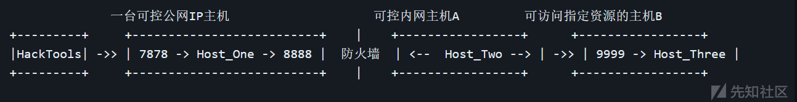

# [工具分享] yuze - 一款纯C实现的基于socks5协议的轻量内网穿透工具 - 先知社区

\[工具分享\] yuze - 一款纯C实现的基于socks5协议的轻量内网穿透工具

- - -

# Part1 工具简介

yuze是我学习socket网络编程后产出的工具，它帮助我深入了解了内网渗透中常见基于socks协议的隧道代理，流量转发的原理。最初用go语言实现了正向、反向代理。由于编译后体积问题，改用纯C实现，支持ew的全部数据转发方式。

它的很多的灵感来自于对EarthWorm（ew）的逆向，向前辈致敬。

特点

-   支持正向、反向代理
    
-   支持多种数据转发方式，穿透复杂的网络环境
    
-   支持任意以tcp协议为基础的服务
    
-   体积小, 极轻量的内网穿透工具 （仅有25kb）
    

# Part2 使用简介

下面是对具体功能的使用场景和演示，为了方便使用，工具的部分功能承袭了ew，lcx的命名

1.  yuze提供的正向代理

使用场景

```plain
可控主机有公网IP且可开启任意监听端口
```

示意图  
[](https://xzfile.aliyuncs.com/media/upload/picture/20240122155317-4deb90d2-b8fb-1.png)

```plain
a) ./yuze -m s_server -l 7878

b) HackTools可使用Host_One主机的7878端口提供的socks5代理
```

[](https://xzfile.aliyuncs.com/media/upload/picture/20240121183645-f9361664-b848-1.gif)

1.  yuze提供的反向代理

使用场景

```plain
可控主机不存在公网IP，但是可出网，通过主动连接的方式建立反向socks代理。类似frp
```

示意图  
[](https://xzfile.aliyuncs.com/media/upload/picture/20240122155335-58254fac-b8fb-1.png)

```plain
a) ./yuze -m yuze_listen -s 7878 -e 9999
              // 在具有公网IP的主机上添加转接隧道，将7878端口收到的代理请求转交给反连9999端口的主机

b) ./yuze -m r_server -r 127.0.0.1 -s 9999
              // 将目标主机反向连接公网转接主机

c) HackTools可使用Host_One主机的7878端口提供的socks5代理
```

[](https://xzfile.aliyuncs.com/media/upload/picture/20240121200326-15184062-b855-1.gif)

同时支持了ew的几种二重网络环境的数据转发方式

1.  yuze\_tran 使用场景

```plain
1.  获得目标网络内两台主机 A、B 的权限，情况描述如下：

    A 主机：存在公网 IP，且自由监听任意端口，无法访问特定资源
    B 主机：目标网络内部主机，可访问特定资源，但无法访问公网
    A 主机可直连 B 主机
```

示意图

[](https://xzfile.aliyuncs.com/media/upload/picture/20240122155400-6733a03e-b8fb-1.png)

```plain
a)  ./yuze -m s_server -l 9999
                // 在 Host_Two 主机上利用 s_server 模式启动 9999 端口的正向 socks 代理

b)  ./yuze -m yuze_tran -s 7878 -d 127.0.0.1 -e 9999 
                // 在Host_One上将 7878 端口收到的 socks 代理请求转交给 Host_Two 主机。

c)  HackTools可使用Host_One主机的7878端口提供的socks5代理
```

[](https://xzfile.aliyuncs.com/media/upload/picture/20240121201450-acc4fba2-b856-1.gif)

1.  yuze\_slave 使用场景

```plain
2.  获得目标网络内两台主机 A、B 的权限，情况描述如下：

    A 主机：目标网络的边界主机，无公网 IP，无法访问特定资源。
    B 主机：目标网络内部主机，可访问特定资源，却无法回连公网。
    A 主机可直连 B 主机
```

[](https://xzfile.aliyuncs.com/media/upload/picture/20240122155418-71e5d344-b8fb-1.png)

```plain
a)  ./yuze -m yuze_listen -s 7878 -e 8888
                    // 在 Host_One 公网主机添加转接隧道，将 7878 收到的代理请求
                    // 转交给反连 8888 端口的主机

b)  ./yuze -m s_server -l 9999
                    // 在 Host_Three 主机上利用 s_server 模式启动 9999 端口的正向 socks 代理

c)  ./yuze -m yuze_slave -r 127.0.0.1 -s 8888 -d 127.0.0.1 -e 9999
                    // 在 Host_Two 上，通过工具的 yuze_slave 模式，
                    // 打通Host_One:8888 和 Host_Three:9999 之间的通讯隧道

d)  HackTools可使用Host_One主机的7878端口提供的socks5代理
```

# TODO

-   跨平台的功能支持（主要是API的替换，所以很快）
-   通信流量加密  
    欢迎pr提供更多功能的想法  
    更新的动力全靠社区的反馈，帮助到宁或者对您有所启发，请多多star ：）

# 致谢

[https://rootkiter.com/EarthWorm/](https://rootkiter.com/EarthWorm/)

# 项目地址：

[https://github.com/P001water/yuze](https://github.com/P001water/yuze)
