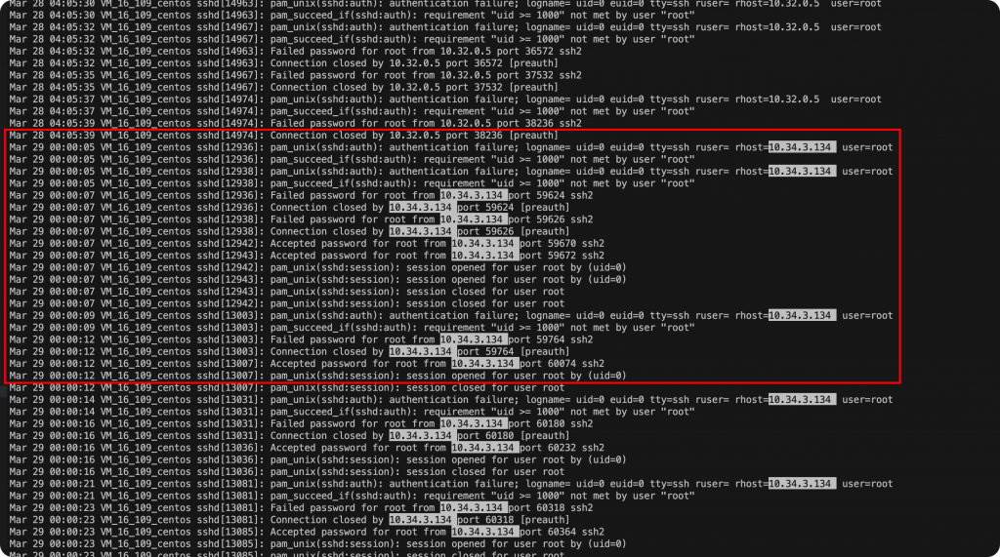

# 应急响应-K8s异常ssh登录排查 – Zgao's blog

### 应急响应-K8s异常ssh登录排查

作者 [Zgao](https://zgao.top/author/zgao/)

> 某内网k8s集群主机安全告警存在ssh爆破成功的记录，上机排查发现该主机存在长达几个月的异常ssh登录，每天固定凌晨0点-4点出现ssh登录记录，并且同一个ip的ssh登录失败和成功的记录交叉出现。

初步判定这是一起非入侵导致的应急事件，但是该如何定位k8s容器出现异常ssh登录的原因呢？

## 定位异常记录最早出现时间



通过查询日志找到最早的异常ip的ssh登录失败的记录，定位到第一次出现时间为3月29日0点。对应的ip是一台k8s集群的node节点，上面运行全部的是容器服务。因此排查的方向从 主机 –> 容器 。

## 查找对应时间新创建的容器和文件变动

查找3月29号k8s主机上的文件变动。

```plain
find / -newermt "2023-03-28" ! -newermt "2023-03-30" -type f -exec ls -lh {} \;
```


可以看到确实是有文件变动，很有可能是在3月29号这天，新起的容器服务导致ssh登录异常。查找3月29号创建的容器。

```plain
 docker ps -a --no-trunc -q | xargs docker inspect --format '{{ .Name }}: Created {{ .Created }}' | grep "2023-03"
```


需要注意，docker的时间通常是utc时间转换cst时间还需要+8小时。

这里与猜测不符，所以并非是在3月29号附近的新创建的容器导致的异常。

## auditd审计网络请求和命令


k8s的容器数量众多，一台主机运行几百个容器，逐个排查效率太低。既然确定异常ssh的登录记录在每天凌晨会固定出现。所以直接开启auditd进行网络请求和命令的审计。命令如下：

```plain
auditctl -a always,exit -F arch=b64 -S connect,execve -F key=MYCONNECT
```

然后就是等第二天收审计的结果。


但正常情况下，audit必定能抓取到网络请求的进程，但是在audit审计的日志中未能发现在0点-4点之间异常的ssh网络请求信息。

因此，推测在0点前必定有容器异常退出或者容器服务挂掉了。


查看所有退出的容器，从异常退出的容器信息可推断只有k8s\_ocloud-osppro-remote-executor\_ocloud-osppro-remote-executor 容器符合时间要求。

从容器的命令可判断是一台远程执行命令的容器，重新启动该容器并进入查看容器的日志信息。


进入该容器查找服务器日志，发现下发命令的时间与ssh报错的时间和次数完全一致，确实是该容器的服务下发命令导致ssh登录异常。

Post Views: 254
