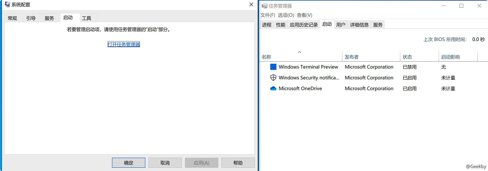
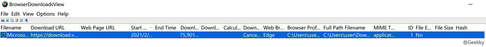
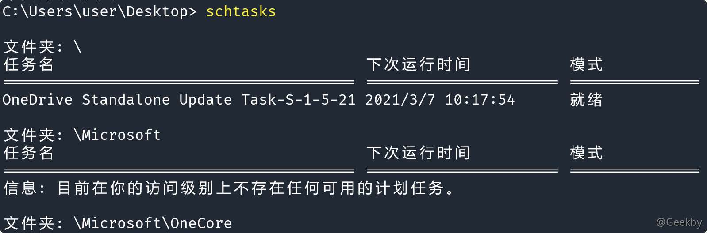
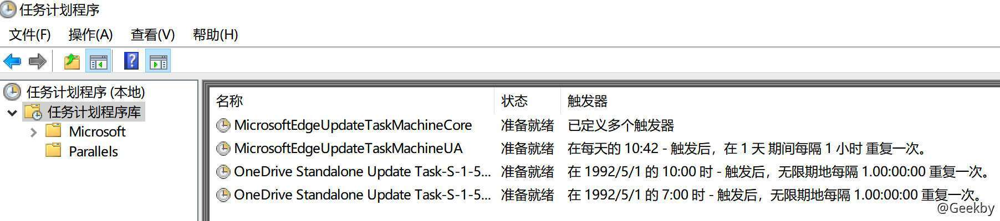
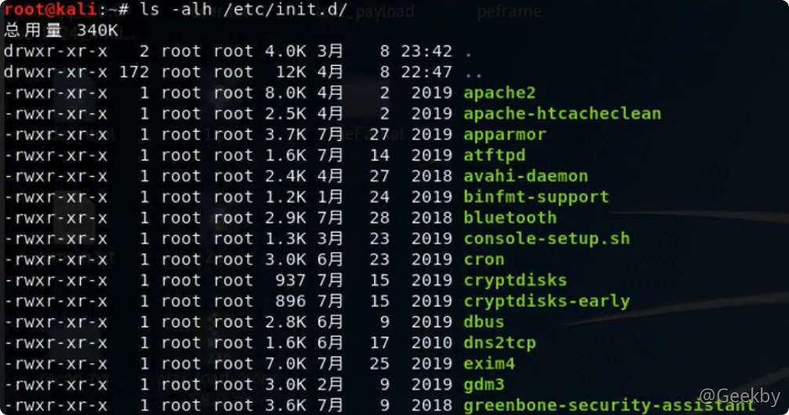

# [](#%E5%BA%94%E6%80%A5%E5%93%8D%E5%BA%94)应急响应

## [](#1-windows-%E5%BA%94%E6%80%A5%E5%93%8D%E5%BA%94)1 Windows 应急响应

### [](#11-%E6%96%87%E4%BB%B6%E5%88%86%E6%9E%90)1.1 文件分析

#### [](#111-%E5%BC%80%E6%9C%BA%E5%90%AF%E5%8A%A8%E9%A1%B9)1.1.1 开机启动项

利用操作系统中的启动菜单：

|     |     |     |
| --- | --- | --- |
| ```plain<br>1<br>``` | ```fallback<br>C:\Users\Administrator\AppData\Roaming\Microsoft\Windows\Start Menu\Programs\Startup<br>``` |


利用系统配置 msconfig：



利用注册表：

|     |     |     |
| --- | --- | --- |
| ```plain<br>1<br>2<br>``` | ```fallback<br>HKCU\software\Microsoft\Windows\CurrentVersion\Run<br>HKLM\software\Microsoft\Windows\CurrentVersion\Run<br>``` |


#### [](#112-tmp-%E4%B8%B4%E6%97%B6%E6%96%87%E4%BB%B6%E5%A4%B9)1.1.2 tmp 临时文件夹

使用 cmd，输入 `%tmp%`，直接打开临时文件夹

查看该文件夹下是否有可疑文件（exe、dll、sys）

#### [](#113-%E6%B5%8F%E8%A7%88%E5%99%A8%E5%8E%86%E5%8F%B2%E8%AE%B0%E5%BD%95)1.1.3 浏览器历史记录

工具地址：[https://launcher.nirsoft.net/downloads/index.html](https://launcher.nirsoft.net/downloads/index.html)

**browsinghistoryview**


**browserdownloadsview**



#### [](#114-%E6%96%87%E4%BB%B6%E5%B1%9E%E6%80%A7%E5%88%86%E6%9E%90)1.1.4 文件属性分析

在 Windows 系统下，文件属性的时间属性具有：创建时间、修改时间、访问时间（默认情况下禁用）默认情况下，计算机是以修改时间作为展示。

如果修改时间要早于创建时间那么这个文件存在很大可疑。使用中国菜刀等工具修改的修改时间，通过文件属性可以查看到创建时间、修改时间、访问时间。

#### [](#115-%E6%9C%80%E8%BF%91%E6%89%93%E5%BC%80%E6%96%87%E4%BB%B6%E5%88%86%E6%9E%90)1.1.5 最近打开文件分析

Windows 系统中默认记录系统中最近打开使用的文件信息。

可以在目录 `C:\Documents and Settings\Administrator\Recent` 下查看，也可以使用 win+R 打开运行，输入 %UserProfile%\\Recent 查看。然后利用 Windows 中的筛选条件查看具体时间范围的文件


### [](#12-%E8%BF%9B%E7%A8%8B%E5%88%86%E6%9E%90)1.2 进程分析

#### [](#121-%E5%8F%AF%E7%96%91%E8%BF%9B%E7%A8%8B%E5%8F%91%E7%8E%B0%E4%B8%8E%E5%85%B3%E9%97%AD)1.2.1 可疑进程发现与关闭

计算机与外部网络通信是建立在 TCP 或 UDP 协议上的，并且每一次通信都是具有不同的端口（0~65535）。如果计算机被木马后，肯定会与外部网络通信，那么此时就可以通过查看网络连接状态，找到对应的进程 ID，然后关闭进程 ID 就可以关闭连接状态。

|     |     |     |
| --- | --- | --- |
| ```plain<br>1<br>2<br>3<br>4<br>5<br>``` | ```bash<br># 查看网络建立连接状态<br>netstat -ano \| find "ESTABLISHED"<br># 查看具体 PID 进程对应的程序<br>tasklist /svc \| find "PID"<br>taskill /PID pid值 /T 关闭进程<br>``` |

#### [](#122-window-%E8%AE%A1%E5%88%92%E4%BB%BB%E5%8A%A1)1.2.2 Window 计划任务

在计算机中可以通过设定计划任务，在固定时间执行固定操作。一般情况下，恶意代码也有可能在固定的时间设置执行。

使用 at 或 schtasks 命令可以对计划任务进行管理，直接输入 at 可以查看当前计算机中保存的计划任务。



也可以在计划任务程序中打开：



#### [](#123-%E9%9A%90%E8%97%8F%E8%B4%A6%E6%88%B7%E5%8F%91%E7%8E%B0%E4%B8%8E%E5%88%A0%E9%99%A4)1.2.3 隐藏账户发现与删除

隐藏账号，是指“黑客”入侵之后为了能够持久保持对计算机访问，而在计算机系统中建立的不轻易被发现的计算机账户。

最为简单的隐藏账户建立：

`net user test$ test /add && net localgroup administrator test$ /add` 其中 `$` 符号可以导致系统管理员在使用 net user 时无法查看到 `test$` 用户。

### [](#13-%E7%B3%BB%E7%BB%9F%E4%BF%A1%E6%81%AF)1.3 系统信息

#### [](#131-%E8%A1%A5%E4%B8%81%E6%9F%A5%E7%9C%8B%E4%B8%8E%E6%9B%B4%E6%96%B0)1.3.1 补丁查看与更新

Windows 系统支持补丁以修补漏洞。可以使用 systeminfo 查看系统信息，并展示对应的系统补丁信息编号。 也可以在卸载软件中查看系统补丁和第三方软件补丁。

### [](#14-webshell-%E6%9F%A5%E6%9D%80)1.4 webshell 查杀

常见工具：D 盾

## [](#2-linux-%E5%88%86%E6%9E%90%E6%8E%92%E6%9F%A5)2 linux 分析排查

### [](#21-%E6%96%87%E4%BB%B6%E5%88%86%E6%9E%90)2.1 文件分析

#### [](#211-tmp-%E7%9B%AE%E5%BD%95)2.1.1 tmp 目录

在 Linux 系统下一切都是文件。其中 /tmp 是一个特别的临时目录文件。每个用户都可以对它进行读写操作。因此一个普通用户可以对 /tmp目录执行读写操作。


#### [](#212-%E5%BC%80%E6%9C%BA%E5%90%AF%E5%8A%A8%E9%A1%B9)2.1.2 开机启动项

查看开机启动项内容 `/etc/init.d/`，恶意代码很有可能设置在开机自启动的位置。



查看指定目录下文件时间顺序的排序：`Is-alt| head -n 10`

查看文件时间属性：`stat 文件名`

使用 `update-rc.d 程序名称 enable` 设置开机自启

使用 `update-rc.d 程序名称 disable` 禁止开机自启

#### [](#213-%E6%96%87%E4%BB%B6%E4%BF%AE%E6%94%B9%E6%97%B6%E9%97%B4%E6%90%9C%E7%B4%A2)2.1.3 文件修改时间搜索

新增文件分析：

-   查找 24 小时内被修改的文件
    
    -   `find ./ -mtime 0 -name "*.php"`
-   查找 72 小时内新增的文件
    
    -   `find ./ -ctime -2 -name "*.php"`
-   权限查找
    
    -   `find ./ -iname "*.php" -perm 777`
    -   `-iname` 忽略大小写，`-perm` 筛选文件权限

### [](#22-%E8%BF%9B%E7%A8%8B%E5%88%86%E6%9E%90)2.2 进程分析

#### [](#221-%E7%BD%91%E7%BB%9C%E8%BF%9E%E6%8E%A5%E5%88%86%E6%9E%90)2.2.1 网络连接分析

在 Linux 中可以使用 netstat 进行网络连接查看。

|     |     |     |
| --- | --- | --- |
| ```plain<br>1<br>``` | ```bash<br>netstat -Print network connections, routing tables, interface statistics, masquerade connections, and multicast memberships<br>``` |

常用命令 `netstat -pantl` 查看处于 tcp 网络套接字相关信息。

关闭未知连接 `kill -9 PID` 即可。

#### [](#222-%E8%BF%9B%E7%A8%8B%E5%AF%B9%E5%BA%94%E7%9A%84%E6%96%87%E4%BB%B6)2.2.2 进程对应的文件

在 linux 中可以使用 ps 查看进程相关信息

使用 `ps aux` 查看所有进程信息

使用 `ps -aux| grep PID` 筛选出具体 PID 的进程信息，`lsof -i：端口号`也可以实现类似功能

### [](#23-%E7%99%BB%E5%BD%95%E5%88%86%E6%9E%90)2.3 登录分析

在 Linux 做的操作都会被记录到系统日志中，对于登录也可以查看日志信息查看是否有异常登录。last 命令 `last -i | grep -v 0.0.0.0` 查看登录日志，筛选非本地登录。

`w` 命令实时查看登录用户

### [](#24-%E5%BC%82%E5%B8%B8%E7%94%A8%E6%88%B7%E7%9A%84%E5%88%86%E6%9E%90%E6%8E%92%E6%9F%A5)2.4 异常用户的分析排查

在 Linux 中 root 用户是一个无敌的存在，可以在 Linux 上做任何事情。

新建用户 `useradd username`

设置密码 `passwd username 输出密码`

设置用户 uid 和 gid 都为 0。（root 用户 uid 为 0 gid 为 0）修改文件即可 /etc/passwd

|     |     |     |
| --- | --- | --- |
| ```plain<br>1<br>2<br>3<br>4<br>5<br>6<br>``` | ```bash<br>cat /etc/passwd<br>grep "0:0" /etc/passwd<br>ls -l /etc/passwd<br>awk -F: '$3==0 {print $1}' /etc/passwd<br>awk -F：'$2=="！”{print $1}' /etc/shadow 或 <br>awk -F：'length（$2）==0 {print $1}' /etc/shadow<br>``` |

### [](#25-%E5%8E%86%E5%8F%B2%E5%91%BD%E4%BB%A4%E5%88%86%E6%9E%90)2.5 历史命令分析

在 Linux 系统中默认会记录之前执行的命令 /root/bash history 文件中。

用户可以使用 cat /root/.bash\_history 进行查看或者使用 history 命令进行查看

### [](#26-%E8%AE%A1%E5%88%92%E4%BB%BB%E5%8A%A1%E6%8E%92%E6%9F%A5)2.6 计划任务排查

在 Linux 系统中可以使用命令 crontab 进行计划任务的设定

其中 -e 可以用来编辑设定计划任务，-l 可以用来查看当前计划任务，-d 用来删除计划任务。特别注意计划任务中未知内容

### [](#27-%E5%BC%82%E5%B8%B8-paht-%E7%8E%AF%E5%A2%83%E5%8F%98%E9%87%8F%E7%9A%84%E6%8E%92%E6%9F%A5)2.7 异常 $PAHT 环境变量的排查

环境变量决定了 shell 将到哪些目录中寻找命令或程序，PATH 的值是一系列目录，当您运行一个程序时，Linux 在这些目录下进行搜寻编译链接。

修改 PATH ：

|     |     |     |
| --- | --- | --- |
| ```plain<br>1<br>2<br>3<br>``` | ```bash<br>export PATH=$PATH:/usr/locar/new/bin <br># 本次终端中有效，重启后无效。<br># 在 /etc/profile或/home/.bashrc（source ~/.bashrc）才能永久生效。<br>``` |

### [](#28-%E5%90%8E%E9%97%A8%E8%87%AA%E5%8A%A8%E6%8E%92%E6%9F%A5---rkhunter)2.8 后门自动排查 - rkhunter

Rkhunter 具有以下功能：

1.  系统命令检测，MD5 校验
    
2.  Rookit 检测
    
3.  本机敏感目录、系统配置异常检测
    

安装：`apt install rkhunter`

基本使用：

|     |     |     |
| --- | --- | --- |
| ```plain<br>1<br>2<br>3<br>``` | ```bash<br>rkhunter -check-sk<br>-c,--check # Check the local system<br>-sk --skip-keypress # Don't wait for a keypress after each test<br>``` |
