# 开学季 | 这些软件和服务的教育优惠，能帮你省下不少钱 - 少数派

[10 月 12 日更新：更新了 Apple 教育优惠的认证方式](#update-0)

#### **开学季**

少数派的读者中有不少学生朋友，而对这个暑假之后即将进入大学的读者来说，接下来摆在眼前的可能是新的城市、新的生活环境和新朋友，以及更多可以自由安排的时间用来学习、探索。

因此和往年一样，少数派也将整理一系列围绕开学季这个话题的内容与资源，不管你是打算为自己挑选一台好设备、好工具，还是投身知识与书本、发展一门新爱好、充实自己的大学生活，这些文章都能为你提供一些参考和帮助。

- - -

马上学生党的暑假即将结束。对于那些不久前刚刚接到大学录取通知书的同学们来说，他们也将进入到新的环境中求学。为了更好助力学生党的求学之路，我派之前就为学生党们梳理过专属的优惠方案。

往期内容参见：

-   [这些优秀工具的教育优惠，让你的暑假更快乐充实](https://sspai.com/post/61391)
-   [5 折价格入手 Sketch，这些专业软件的教育优惠能帮你省下上百元](https://sspai.com/post/43767#!)
-   [学生专属福利，你可能还不知道这些常用服务其实可以更便宜](https://sspai.com/post/43533)
-   [在校师生福利：Apple、微软、Adobe 等产品如何通过教育优惠购买](https://sspai.com/post/39430)

时过境迁，这些文章中提到的优惠方案已经或多或少发生了变化，部分公司调整甚至取消了教育优惠。但整体上越来越多的公司推出了学生优惠计划。这里我们为大家再次梳理了并丰富了专属优惠信息。希望能为同学们的学业乃至后续的事业再添一把劲。

这些专属福利一共由学生包、云服务优惠、吃喝玩乐和软件/订阅四部分组成。你可以通过目录直接跳转至相应部分，了解优惠信息。

## 学生包

### GitHub 学生包

-   权益：高质量的开发工具包，比如我们熟知的微软 Azure、JetBrains、PopSQL 等等，真的是一屏装不下。除了开发工具集合，GitHub Student Developer Pack 还提供 Digitalocean 的 100 美元代金券，以及免费域名一枚。
-   认证方式：要求具有 GitHub 账户，学校域名的邮件账户或者提供学生身份的证明文件。

GitHub 是世界上最大的代码托管平台。作为开发者，没有 GitHub 账号都不好意思出门。无论对于开发者还是对于普通用户来讲，GitHub 上面有不少优质开源项目可以借鉴和学习。

访问 [链接](https://sspai.com/link?target=https%3A%2F%2Feducation.github.com%2Fdiscount_requests%2Fstudent_application) 直达申请页面，填表进行申请即可。[GitHub 学生开发工具包](https://sspai.com/link?target=https%3A%2F%2Feducation.github.com%2Fpack) 包含 N 多福利，本文后续也会提到 AWS 亚马逊云 Educate 以及 Digital Ocean 云服务，更多福利内容可以移步至工具包页面进行探索。

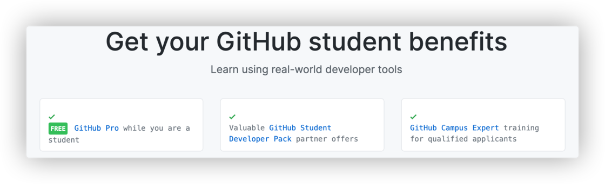

### Azure **Dev Tools for Teaching**

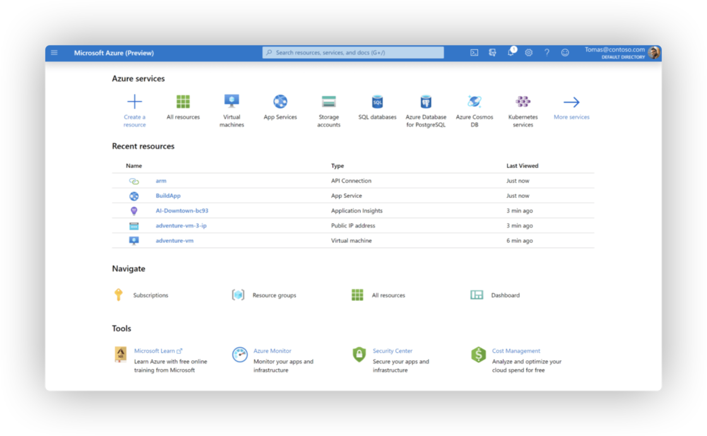

-   权益：免费使用微软的开发软件，这些软件当中包括 Windows Server 系统以及 Azure 学生订阅等。微软为此整理了一个 [软件列表](https://sspai.com/link?target=https%3A%2F%2Fazure.microsoft.com%2Fzh-cn%2Ffree%2Fstudents%2F)，感兴趣的可以在里面中查找一下；Visual Studio Code、SQL Server 2019 Developer 版本、Microsoft IoT 中心等都在列表之中。
-   认证方式：通过电邮地址验证学业状态；如果学校或者教育机构支持，也可以使用 Shibboleth。美国境内，需要年满 13 岁；其他国家/地区，需年满 16 岁。
-   [链接直达申请页面](https://sspai.com/link?target=https%3A%2F%2Fazure.microsoft.com%2Fzh-cn%2Ffree%2Fstudents%2F)

之前提到过 Microsoft Imagine 学生包，如今变成了Azure Dev Tools for Teaching。Microsoft Imagine 与一年一度的微软「创新杯（ Imagine Cup）」齐名。它由微软在 2008 年 2 月 19 日发布的 Dream Spark 计划更名而来。Dream Spark 计划面向的对象是所有涉及技术、设计、数学、科学和工程专业的学生，当然非上述专业的同学也可以申请。

### AWS 学生包

-   权益：获得至少 $40 的优惠和教育培训
-   认证方式：教育邮箱验证，国内学生需年满16周岁

AWS 即 Amazon Web Services ，即俗称的亚马逊云计算。它是亚马逊 （ Amazon ）公司云计算 IaaS 和 PaaS 平台服务。AWS 可提供包括弹性计算、存储、数据库、应用程序在内的一整套云计算服务。

[AWS Educate](https://sspai.com/link?target=https%3A%2F%2Faws.amazon.com%2Fcn%2Feducation%2Fawseducate%2Fstudents%2F) 是 Amazon 的一项全球计划，旨在为学生提供全面的资源，培养他们在云方面的技能。学生可以通过 AWS Educate 云职业发展途径和专业徽章享受在家免费学习的机会。目前，AWS Educate 的用户覆盖 200 多个国家和地区。

访问 [链接](https://sspai.com/link?target=https%3A%2F%2Faws.amazon.com%2Fcn%2Feducation%2Fawseducate%2F) 直达申请页面，点击「加入 AWS Educate 」开始相应的申请流程。

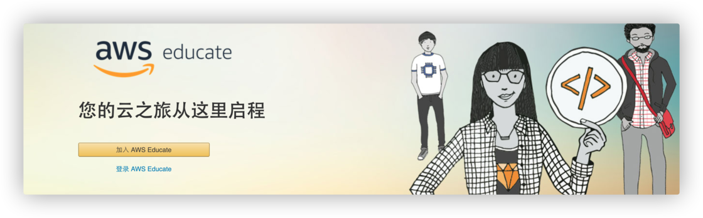

### Autodesk 学生包

-   权益：Autodesk 旗下的 AutoCAD 、Revit 、3DMAX 、Maya 等软件，其（教育版）免费试用期可延长至三年。具体的产品目录可参考 [官网页面](https://sspai.com/link?target=https%3A%2F%2Fwww.autodesk.com.cn%2Feducation%2Fedu-software%2Foverview)。
-   认证方式：Autodesk 学生资格的认证方式比较严格，除了一个账户之外，还需要提供其他证明文件。官网明确提到教育机构的电邮地址「不足以确认资格，也不需要它」。对于学生来讲，需要提交的正面文件必须包括：「全名（必须与学校注册中显示的名称匹配）、教育机构的全名、当前学期内的日期」。官网给出的 [示例证明文件](https://sspai.com/link?target=https%3A%2F%2Fknowledge.autodesk.com%2Fzh-hans%2Fcustomer-service%2Faccount-management%2Fautodesk-for-education%2Fstudents-and-educators%2Fget-started-for-students-and-educators%23submit-docs) 中，提到这样的一些证明文件，如「来自教育机构的官方信函」、「报名费收据」、「学费收据」、「学生或员工 ID（不需要照片）」、「成绩单」等。

对于每一个建筑口的同学们来讲，Autodesk 旗下的产品再也熟悉不过了，这是日常谋生必备的工具。不管是平面还是三维，Autodesk 旗下的产品是一个绕不过去的坎儿。对于有能力能够获取到优惠的同学，建议是去尝试一下。

访问 [Autodesk 教育社区](https://sspai.com/link?target=https%3A%2F%2Fwww.autodesk.com.cn%2Feducation%2Fedu-software%2Foverview%3Fsorting%3Dfeatured%26page%3D1)，点击「开始」创建账户，并确认自己否有资格使用 Autodesk 教育版的软件和服务。

**2023 年更新：**Autodesk 今年的权益与申请认证方式没有太大变化，只是现在的权益更加优惠了。官网介绍说，只要「仍然符合条件，就可以继续续展」。

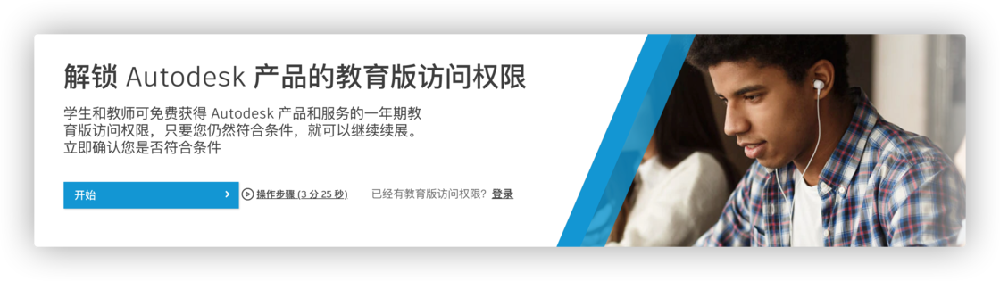

### JetBrains 学生包

-   权益：免费使用各类开发工具和集成工具，这些开发与集成工具在学生包的 [页面](https://sspai.com/link?target=https%3A%2F%2Fwww.jetbrains.com%2Fzh-cn%2Fcommunity%2Feducation%2F%23students) 上就能看到。
-   认证方式：[官网要求](https://sspai.com/link?target=https%3A%2F%2Fwww.jetbrains.com%2Fzh-cn%2Fcommunity%2Feducation%2F%23students)申请人必须是正规全日制的教育机构（高中、学院和大学）的学生。申请人需要提供最近 6 个月的注册信息或成绩单。证明文件必须包含姓名、学生证号、日期等信息。也可以使用 [学信网](https://sspai.com/link?target=https%3A%2F%2Fwww.chsi.com.cn%2F) 的学校状态验证报告。

JetBrains 是一家捷克的软件开发公司，成立于 2000 年。在成立以来，一直致力于打造「世界上最强大、最高效的开发者工具」。其最为人所熟知的产品是 Java 集成开发环境：IntelliJ IDEA。

访问 [免费许可证计划](https://sspai.com/link?target=https%3A%2F%2Fwww.jetbrains.com%2Fshop%2Feform%2Fstudents)页面，点击「适用于学生和教师」，然后点击「立即申请」，填写如下所示的表单。

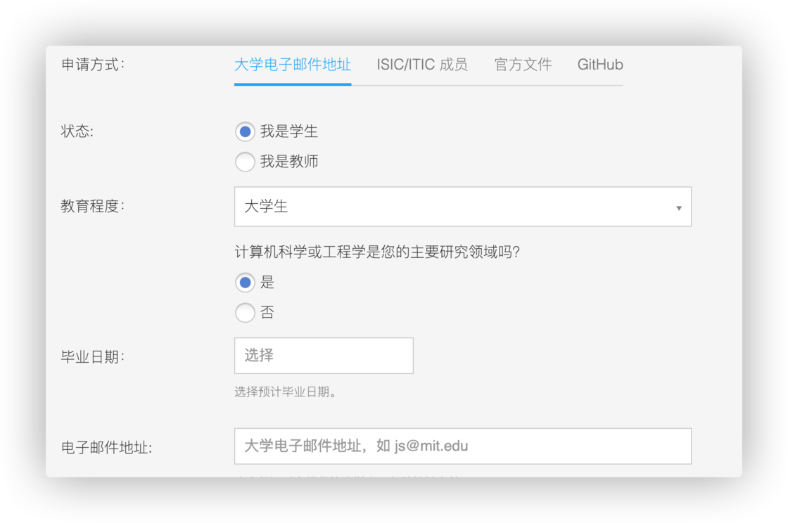

### Google Workspace for Education

-   权益：为教育用户提供的谷歌生产力工具套件（大陆不在申请区之内）。
-   认证方式：全球符合特定条件的幼儿园到高中 ( K-12 ) 学校、高等教育机构以及美国境内的家庭学校合作机构有资格使用。K-12 学校和高等教育机构必须是政府认可并获得了正式认证的教育机构，可提供国内或国际认可的初级、二级或三级证书。具体使用资格可参见 [官方页面](https://sspai.com/link?target=https%3A%2F%2Fsupport.google.com%2Fa%2Fanswer%2F134628) 。

Google Workspace （原 G Suite）可以为公司 / 机构提供自定义电子邮件地址以及各类协作工具，这些工具中包括我们熟知的 Gmail、日历与 office 三件套对应的文档、表格、幻灯片以及云端硬盘等等。

点击 [链接](https://sspai.com/link?target=https%3A%2F%2Fedu.google.com%2Fproducts%2Fproductivity-tools%2F) 进入 Education Fundamentals 页面，点击「 Get started for free 」开始相应的申请流程。

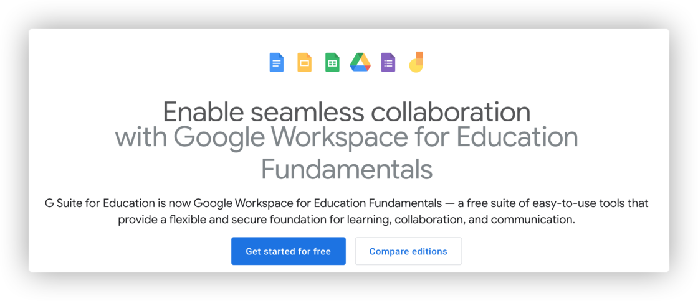

### LINGO Educational Research License

-   权益：六个月并且可以续期的教育许可。
-   认证方式：教育邮箱。

LINGO 是 Lindo System Inc. 推出的求解最优化问题的专业软件包。它是一个著名的线性与非线性求解器，是求解优化模型的最佳选择，数学建模人的必备。根据官网上的 [介绍](https://sspai.com/link?target=http%3A%2F%2Fwww.lindochina.com%2Fgsjj.html)，目前国内有相当多的高校在使用该工具。同时网站上也指出，「[凡使用正版授权的LINGO软件工具在国际刊物上发表论文、期刊或者试验结果无须二次检测](https://sspai.com/link?target=http%3A%2F%2Fwww.lindochina.com%2Flg01.html)」，所以其产品不可错过。

通过官网 [链接](https://sspai.com/link?target=http%3A%2F%2Fwww.lindo.com%2Findex.php%3Foption%3Dcom_content%26view%3Darticle%26id%3D120%26Itemid%3D45) 下载软件之后，在 [链接](https://sspai.com/link?target=http%3A%2F%2Fwww.lindo.com%2Findex.php%3Foption%3Dcom_content%26view%3Darticle%26id%3D120%26Itemid%3D45) 的底部有一个申请流程说明。安装完毕之后会弹出相应的对话框，选择 「 Demo 」，然后选择「 Create User ID File 」，这一步会在 LINGO 的主文件夹下创建一个名为「 userinfo.txt 」的文件。接下来使用自己的教育邮箱给 sales@lindo.com 发邮件，并附加上该「 userinfo.txt 」的文件，然后等着收 key 就好了。

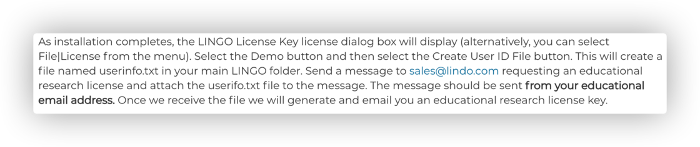

### Navicat 学术伙伴计划

-   权益：一年免费不得转售的 Navicat Premium、Navicat Data Modeler、 Navicat Monitor 非商业版许可证及 Navicat Cloud 专业方案 。
-   认证方式：官网要求高中及以上，同时所在教育机构为「认可的非盈利学术机构」，具有教育邮箱。每位符合资格的学生只能申请一次。

Navicat 是一款图形化数据库管理及发展软件，也是一款强大的可视化数据库管理工具。目前国内外不少知名的大学都在使用其旗下的产品。

通过链接（[中文](https://sspai.com/link?target=https%3A%2F%2Fwww.navicat.com.cn%2Fsponsorship%2Feducation%2Fstudent)、[英文](https://sspai.com/link?target=https%3A%2F%2Fwww.navicat.com%2Fen%2Fsponsorship%2Feducation%2Fstudent)）直达申请，填写表格进行申请即可。

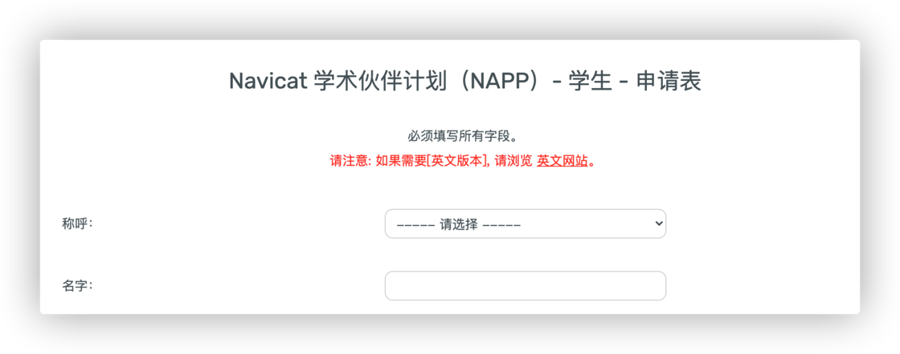

## 云服务优惠

### **Office in Education**

-   权益：合格机构的学生以及教育工作者可以免费使用 Office 365 教育版。这当中包括 Word、Excel、PowerPoint、OneNote、Microsoft Teams 和更多课堂工具。
-   认证方式：教育邮箱认证。

微软的 Office 全家桶是一个几乎人人皆知的工具，具体的内容及作用这里不多解释。通过链接（[中文](https://sspai.com/link?target=https%3A%2F%2Fwww.microsoft.com%2Fzh-cn%2Feducation%2Fproducts%2Foffice)、[英文](https://sspai.com/link?target=https%3A%2F%2Fwww.microsoft.com%2Fen-us%2Feducation%2Fproducts%2Foffice%3Ftab%3Dstudents%3Ftab%3Dstudents)）直达申请页面，输入自己的教育邮箱进行申请即可。

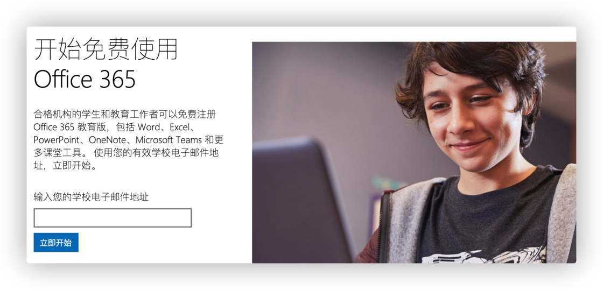

### 腾讯云 + 校园计划

腾讯云+校园计划提供的校园云服务器与校园云数据库优惠。建议买之前先看一下活动规则。注意变更配置容易失去资格。通过 [链接](https://sspai.com/link?target=https%3A%2F%2Fcloud.tencent.com%2Fact%2Fcps%2Fredirect%3Fredirect%3D10004%26cps_key%3D6df162ea83f16c8735081aa3200eef38) 直达申请页面，点击相应的「学生认证」进行申请即可。

-   权益：云服务器 1 核 2G 1M 带宽、轻量服务器 1 核 2G 峰值带宽5M、云服务器 2 核 4G 3M 带宽；学生用户可从中三选一，不支持同时购买多款；活动内三种规格的云服务器，每日各限量 300台；此外还有云数据库和域名等优惠。
-   认证方式：25 岁以下免学生认证。仅限腾讯云官网通过个人认证的 12-35 岁之间的学生用户，25 岁以下免学生认证。截止 2021 年 10 月 31 日。

### AWS 亚马逊云 Educate 与 Digital Ocean 云服务

在本文开始的时候，在 GitHub 学生包中提到过 AWS 亚马逊云 Educate 与 Digital Ocean 云服务。这里稍微展开一下。

在注册完成了 [Github 学生包](https://sspai.com/link?target=https%3A%2F%2Feducation.github.com%2Fpack) 之后，将会获得如下的福利，更多的福利可至 [GitHub 学生开发者工具包](https://sspai.com/link?target=https%3A%2F%2Feducation.github.com%2Fpack) 探索。

-   获得 $150 服务抵扣金额，可用于 AWS 亚马逊云 Educate ，然后再注册 [AWS Educate](https://sspai.com/link?target=https%3A%2F%2Fwww.awseducate.com%2FRegistration) 项目，不定期收到优惠邮件，并获得 $100~$150 服务抵扣金额。
-   获得 $100 服务抵扣金额，可用于抵扣 Digital Ocean 云服务的费

### 阿里云飞天加速计划 3.0

阿里云之前的「飞天加速计划 2.0 」已经升级为「飞天加速计划 3.0 」。阿里云高校计划每天 8 点开放固定领取名额，完成学生认证之后还有测试等流程，详见 [阿里云高校计划](https://sspai.com/link?target=https%3A%2F%2Fdeveloper.aliyun.com%2Fadc%2Fstudent%2F%3Fspm%3Da2c6h.19776329.J_4403085560.5.742b3d805yS5vh%23J_5144437010) 页面。访问 [链接](https://sspai.com/link?target=https%3A%2F%2Fdeveloper.aliyun.com%2Fplan%2Fgrow-up%3Fsource%3D5176.11533457%26userCode%3Doitiwrd3) 直达申请页面，按照页面所示的流程进行申请认证即可。申请时，注意阅读「活动规则」。

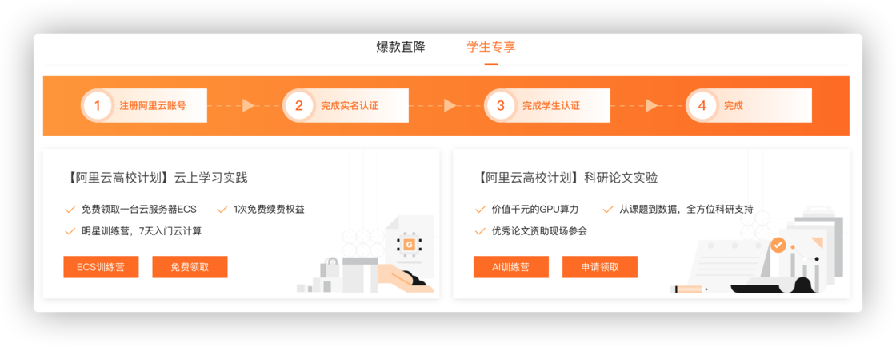

-   权益：免费领取 1 台云服务器 ECS，① 固定机型 t6 CPU 2 核，内存 2G，②带宽 1M，③高效云盘 40G，④无数据盘，⑤指定优惠地域（河源，乌兰察布）同一用户只可参与 1 次，限购 1 台，购买时长为 1 个月，购买后不得变更配置。
-   认证方式：完成阿里云个人实名认证、学生认证的全日制在校大学生。

### Pantheon 学生版

-   权益：免费试用Pantheon 提供的专业高性能网站托管服务

访问 [链接](https://sspai.com/link?target=https%3A%2F%2Fpantheon.io%2Fedu) 直达页面，点击 「 Start a Free Trial 」，然后填写页面右侧的表单，申请即可。

### ~天翼云 + 云创校园~（已经取消或无法找到入口）

~中国电信提供的云服务优惠。需要注意该校园套餐为特价产品，不能使用代金券。~

-   ~权益：云主机 1 核心、2G 内存、40G 存储 + 1M 带宽，优惠价￥118.8 / 年。~
-   ~认证方式：中国大陆专科至博士阶段全日制在校学生，需完成天翼云实名认证、学生认证，且两者需信息一致；对于求学时间段有要求。~

~访问~

[↓↓↓](https://sspai.com/link?target=https%3A%2F%2Fwww.ctyun.cn%2Factivity%2F%23%2Fcampus)  
  
~链接~  
  
[↑↑↑](https://sspai.com/link?target=https%3A%2F%2Fwww.ctyun.cn%2Factivity%2F%23%2Fcampus)

~直达申请页面，根据所示流程，点击相应链接进行申请即可。~ 

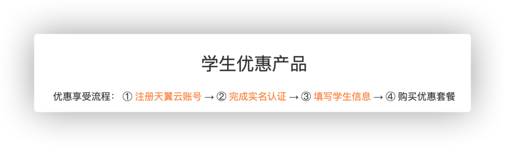

### ~华为云 + 云创校园计划~（已经取消或无法找到入口）

~华为云的云创校园计划。需要注意的是优惠套餐需要抢购，购买前一定要注意阅读注意事项。比如其中提到，「用户首次购买时长选择 1-6 个月，优惠续订时长只能选择 1-6 个月」；「用户购买套餐后，不允许进行降配操作」。访问~

[↓↓↓](https://sspai.com/link?target=https%3A%2F%2Fdeveloper.huaweicloud.com%2Fcampus)  
  
~链接~  
  
[↑↑↑](https://sspai.com/link?target=https%3A%2F%2Fdeveloper.huaweicloud.com%2Fcampus)

~直达申请页面，根据所示流程，点击相应链接进行申请即可。~

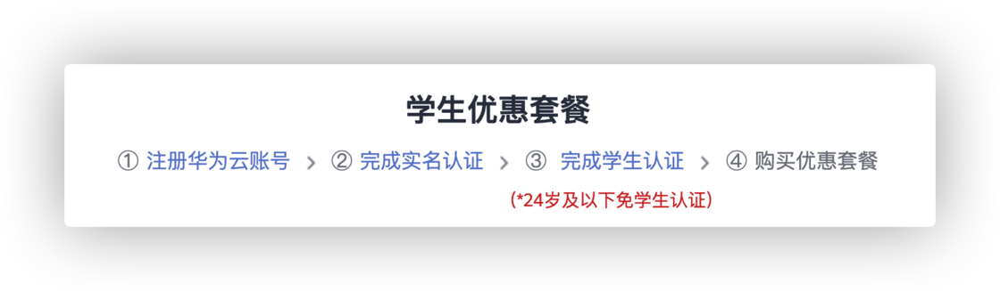

-   ~权益：鲲鹏云服务器、云建站、域名、分布式缓存服务 Redis 以及 ModelArts 等套餐优惠。以鲲鹏云服务器套餐为例，优惠后的价格为￥9 / 月。~
-   ~认证方式：24 岁及以下免学生认证，实名认证即可购买。~

### ~百度云启航校园计划~（已经取消或无法找到入口）

~百度云的启航校园计划的截止时间为 2021 年 12月 31 日。相关优惠需要抢购。用户在参与活动时，需向百度智能云提供学校名称、校区等能够证明用户学生身份的信息，用于核验身份及提供服务。访问~

[↓↓↓](https://sspai.com/link?target=https%3A%2F%2Fcloud.baidu.com%2Fcampaign%2Fcampus-2018%2Findex.html)  
  
~链接~  
  
[↑↑↑](https://sspai.com/link?target=https%3A%2F%2Fcloud.baidu.com%2Fcampaign%2Fcampus-2018%2Findex.html)

~直达申请页面，按照页面所示的流程进行申请认证即可。申请时，注意阅读「活动规则」。~

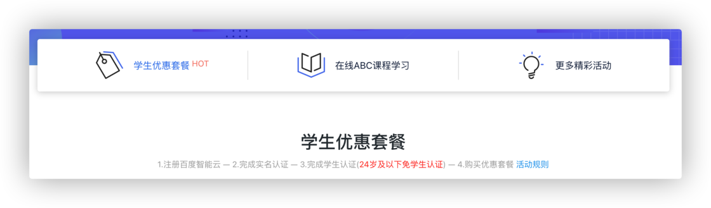

-   ~权益：云服务器、云数据库、百度机器学习 BML 等套餐优惠。以云服务器套餐为例，入门型云服务器（1 核、2G、1M 带宽、40G 高性能云磁盘）的优惠价格为￥74 / 6 个月，普及型云服务器（2 核、4G、1M 带宽、40G 高性能云磁盘）的优惠价格为￥143 / 6 个月。~
-   ~认证方式：24 岁及以下免学生认证。~

## 吃喝玩乐

### 淘宝 / 支付宝

-   权益：学生价专区内的价格优惠，涉及品牌包括海底捞、汉堡王、星巴克、Apple 、爱彼迎等。
-   认证方式：通过学生证、录取通知书、个人校园邮箱三种方式中的任意一种进行学生身份验证。

淘宝 / 支付宝学生优惠的内容根据市场进行了调整。其认证方式已经由此前的「校园派」变为在支付宝 App 中搜索「学生认证」->「支付宝学生验证」->填写信息进行验证。

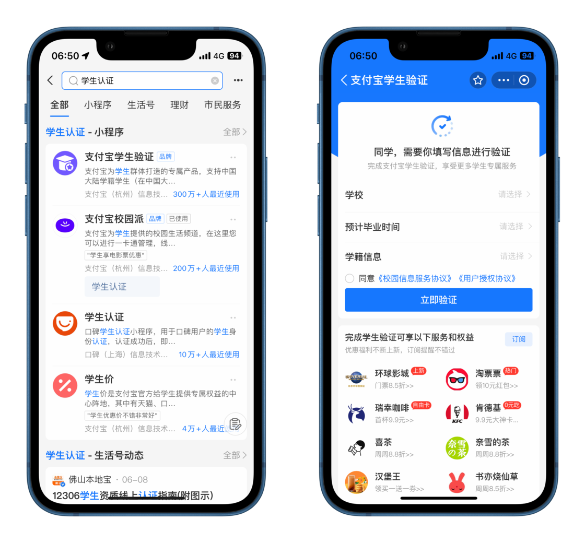

### 海底捞

-   权益：全单 6.9 折，每月可享两次， 8.8 折折扣券调整至营业时间可用。（工作日周一至周五 14:00 - 17:00，22:00 - 次日 7:00）
-   认证方式：需通过上述提到的学生认证，同时规则提到「门店有权要求学生本人出示学生证」。

通过上面提到的支付宝「学生价」->「大牌学生价」，进入海底捞的「海底捞高校学生专享」。

### 爱奇艺

-   权益：学生 VIP 会员优惠，连续包月￥12 / 月，可开通 24 个月；￥123 的年卡套餐可以购买两张
-   认证方式：对 22 周岁（含）以下的用户开放。姓名、身份证号、学校、入学年份信息核验。

作为优腾爱的一员，爱奇艺上面有不少吸引人的资源，这里就不过多介绍了。下载爱奇艺 App 之后，点击右下角「我的」，参照下图所示流程，依次完成申请。

### 美团学生专享

-   权益：不同的折扣和优惠活动。
-   认证方式：学信网认证。

美团 App 右下角，点击「我的」->「学生专享」-> 「免费认证」，跳转学信网进行验证。

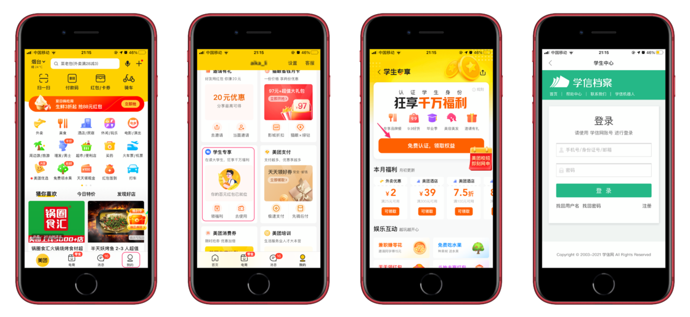

### 滴滴快车

-   权益：每个月会领取 4 张 92 折的快车券

目前滴滴快车的学生优惠隐藏的比较深，在 App 中已经很难发现入口了。访问 [链接](https://sspai.com/link?target=https%3A%2F%2Fdpubstatic.udache.com%2Fstatic%2Fdpubimg%2Fdpub2_project_79883%2Findex_79883.html%3Fdchn%3Dgqq7lO%26toggleext%3Dbtol1k4qf2pn1mgr55f0) 直达滴滴「学生认证」页面，点击页面底部「立即领取学生卡」，按照后续提示完成申请认证即可。

**2023 年更新：**滴滴出行优化了学生认证的入口。同时支持支付宝、微信等多种验证方式。权益也有所调整。

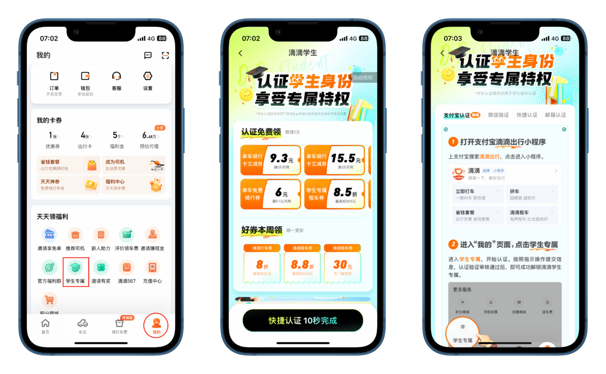

### 京东校园

-   权益：学生特价、专属优惠券等
-   认证方式：基于学信网认证。

每年的 618 购物季，京东上都有不少实惠的电子产品。在平常，京东上也有不少的品类值得看一下。对于学生党而言，京东校园权益一定不可以错过。

京东学生认证可以通过访问 [链接](https://prodev.m.jd.com/mall/active/3Q5H8xmBy4GyPT8xUgqwYYnAa2ns/index.html?utm_user=plusmember&_ts=1608720101293&ad_od=share&gx=RnFky2BfOz3RntRG9cMlD3VPJg&cu=true#/) 直达页面，进行申请。也可以在京东 App 中搜索「学生认证」，然后按照下图所示步骤进行操作。

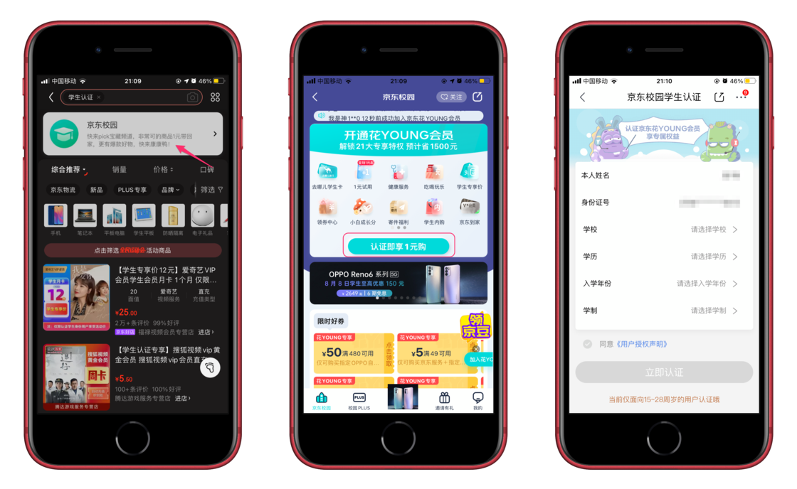

### 迪士尼

-   权益：在完成京东校园认证的基础之上，可以享受相应学生折扣。

通过 [链接](https://m3-ptrip.jd.com/productDetail?skuId=200126946796&utm_source=iosapp&utm_medium=appshare&utm_campaign=t_335139774&utm_term=CopyURL&ad_od=share&utm_user=plusmember&gx=RnE2kjUIbGKLmtRW98x2XFLKpOzh) 直达优惠界面，进行购买即可。购买时需要注意有时间限制。

### 网易严选

-   权益：全场 95 折优惠
-   认证方式：需提交身份证号、学校、当前学籍、入学时间、预计毕业时间等信息进行认证。

2016 年 4 月正式上线的网易严选覆盖居家生活、服饰鞋包、美食酒水、个护清洁、母婴亲子、运动户外、数码家电、严选全球 8 大品类。作为一个生活方式品牌，网易严选也有不少拥趸。

下载网易严选 App 并登录后， 点击右下角「个人」进入个人页面，然后右上角 -> 设置 ->「在校大学生认证」选项，申请认证即可。

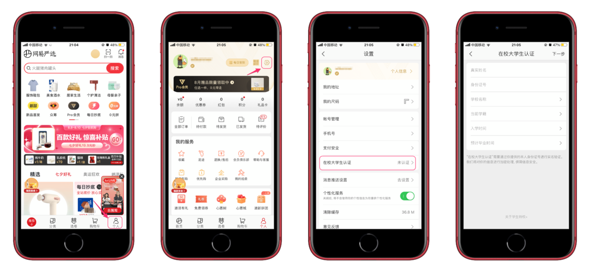

### 顺丰学生会员

-   权益：享受每年最高 2836 元的寄件福利。在校期间完成顺丰学生会员认证的用户，毕业后还可以延长学生会员身份两年。
-   认证方式：17-24 岁学生。需提交身份证号、学校、学历、入学年份、学制等信息进行认证。

顺丰速运的学生会员需要在微信小程序中申请。小程序中搜索「顺丰速运+」，然后在小程序底部「我」-> 其他服务-学生专区，进而完成学生认证即可。

**2023 年更新：**与前文相比，认证方式更为方便，既可在微信小程序中申请，也可利用顺丰速运 App 中提供的入口。相比之前权益有所调整，其他没有太大出入。顺丰的服务没得说。可能在有些地方存在一些不足，但整体上来讲顺丰的口碑还是不错的。在顺丰速运的 App 中申请时，可参照下图所示进行操作。在认证的过程中 App 会自动拉起微信小程序。

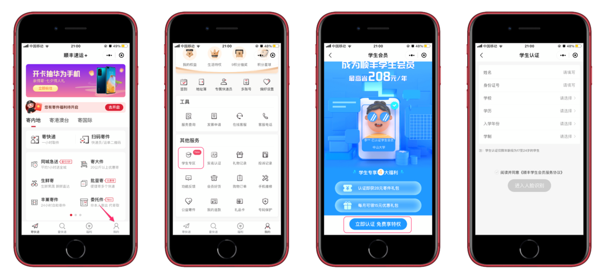

## 软件 / 订阅

### Apple 教育优惠

-   权益：通常硬件、AppleCare+ 会提供大约 10% 左右的学生折扣，在软件方面可以购买单独的 Pro App 教育套装，也可以享受 Apple Music 学生方案。开学季教育优惠更有诱惑力，比如买 Macbook 会送 AirPods 、八折加购 AppleCare+ 服务计划等。
-   认证方式：官网购买通过[支付宝](https://www.apple.com.cn/cn-edu/shop)进行认证；Apple Music 学生方案仍需通过 UNIDays 进行认证。

Apple 的教育优惠面向在读及新录取的高校学生以及各年级教师和教职员工。Apple 产品与服务不必多说，感兴趣的同学可以通过[新学期优惠活动：教育优惠](https://www.apple.com.cn/cn-edu/shop/education-pricing)访问并进行认证。

### OnTheHub 教育商店

-   权益：软件折扣优惠，比如我们熟悉的 PD 和 VMware 虚拟机优惠、SPSS 以及更多的软件优惠。
-   认证方式：教育邮箱认证或者提供资格证明（如学生证等）。

OnTheHub 致力于通过为师生提供来自世界领先厂商的免费/折扣软件来消除教育障碍。OnTheHub 与包括微软、Adobe、IBM、赛门铁克等大型厂商达成合作关系，藉此为全世界的学校提供折扣。尽管主站界面为英语，但其 [eStore](https://sspai.com/link?target=https%3A%2F%2Festore.onthehub.com%2FWebStore%2FProductsByMajorVersionList.aspx%3Fcmi_cs%3D1%26cmi_mnuMain%3Ded6ad73c-7bc7-e011-ae14-f04da23e67f6) 界面为中文。此外，网站还与很多学校有合作设有相应的 WebSore，具体可至 [Find Your School](https://sspai.com/link?target=https%3A%2F%2Fonthehub.com%2Fsearch) 页面输入学校英文名字进行查找。

访问 [链接](https://sspai.com/link?target=https%3A%2F%2Fonthehub.com%2Fsearchhttps%3A%2F%2Fonthehub.com%2F) 直达申请页面，在页面底部找到图片所示表格，填写相应内容进行申请认证。

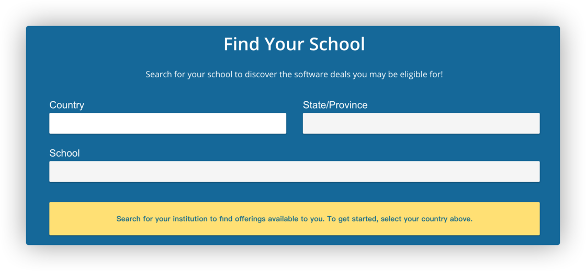

### Student App Centre

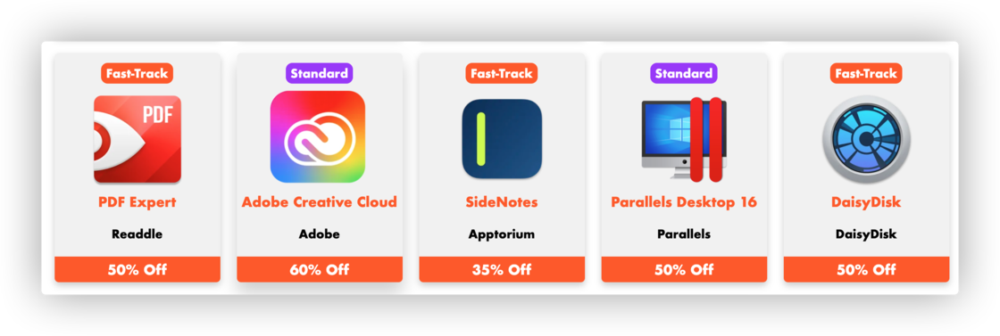

-   权益：提供软件的优惠折扣
-   认证方式：教育邮箱和学生证

Student App Centre 可以看做是一个软件折扣店，它提供和收集了 PDF Expert、Boom2、Downie、CleanShot X 等几十款欧美软件的教育优惠，部分软件甚至低至两折。

访问 [链接](https://sspai.com/link?target=https%3A%2F%2Fwww.studentappcentre.com%2F) 直达 Student App Centre 页面，点击相应软件之后会进行页面跳转，输入教育邮箱后，提交即可。如果没有教育邮箱，点击下方小字跳转至提交学生证的页面。

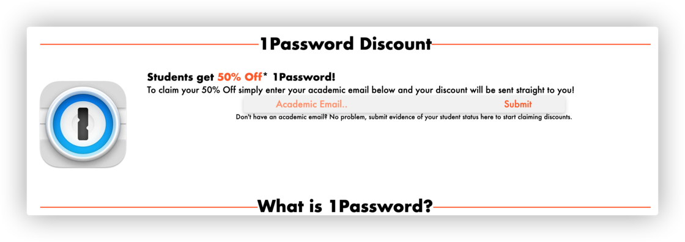

### Axure

-   权益：免费授权
-   认证方式：学生证 / 教师证明

Axure RP 是一款专业的原型设计软件。Axure RP 支持 macOS 和 Windows 平台。它功能足够、操作却又极其简单，受到不少产品经理的青睐。在某种程度上来讲，Axure 是产品、运营的必备。

访问 [链接](https://sspai.com/link?target=https%3A%2F%2Fwww.axure.com%2Fedu) 直达申请页面，按照页面提示流程进行操作。耐心等待 Axure 团队审核结果就可以了。整个申请流程需要填写页面下方的表单内容，并上传学生证的扫描件。

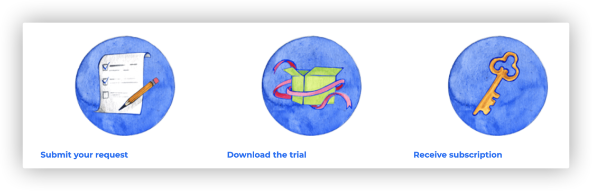

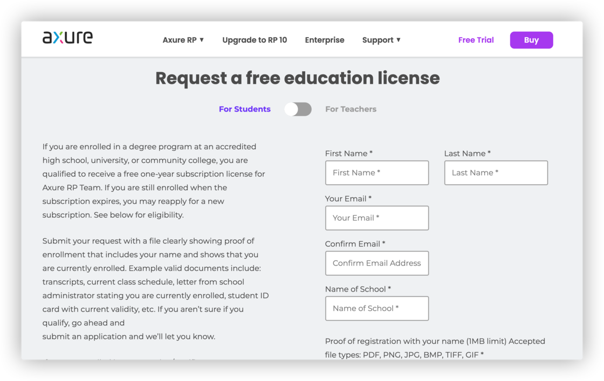

### Adobe

-   权益：学生及教师可享 4 折以下优惠
-   认证方式：教育邮箱/学生证或相关文件

Adobe 产品涉及的图文、音视频处理的方方面面，这当中既包括大名鼎鼎的 PS、AI，也包括处理视频的PR、AE。Adobe 全家桶之间具有比较好的协同性，比如在 PR 中就可以直接调用 PSD 文件。

到目前为止，尽管在某些领域/方面，部分软件能够取代 Adobe 旗下的部分产品，但是目前没有能够完全取代 Adobe 全家桶的竞品出现，即便是像 PS 也并没有一款能完全取代。

访问 [链接](https://sspai.com/link?target=https%3A%2F%2Fwww.adobe.com%2Fhk_zh%2Fcreativecloud%2Fplans.html) 直达页面，具体的操作可参照官方的 [指引](https://sspai.com/link?target=https%3A%2F%2Fhelpx.adobe.com%2Fcn%2Fx-productkb%2Fglobal%2Fgraduation-education-discount-expiry.html) ，填写相应的内容设进行申请认证。

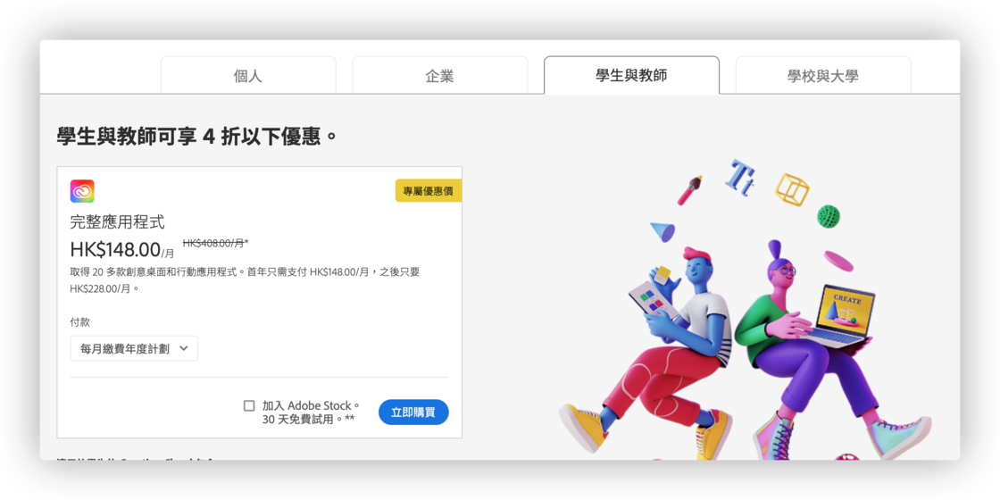

### Affinity

-   权益：[Affinity V2 通用许可证 30 天免费试用](https://sspai.com/link?target=https%3A%2F%2Faffinity.serif.com%2F)
-   认证方式：填写邮箱即可申请，我试的时候普通邮箱也可以。

Affinity 打造了一个小型全家桶，目前包括 Photo、Designer、Publisher 三款软件，分别对应 Adobe 旗下的 PS、AI、ID。如果非要给 PS、AI、ID 找一个替代软件的话，非 Affinity 不可；而且就主体功能来讲，Affinity Photo 与 PS 的功能很接近了。 如果对于细部功能没有那么执着，Affinity 全家桶还是非常具有性价比的。在跨平台上，Affinity 也做的有声有色，支持 Windows 与 macOS，而且还有 iPad 版本。这一点也是非常的友好。目前已经更新到了 V2 版本。

访问 [链接](https://sspai.com/link?target=https%3A%2F%2Fstore.serif.com%2Fen-gb%2Fcheckout%2F%3Fbasket%3D0abf7a6c67662a128183e008967b8b3064f9bcd6fbb3d3b0) 直达申请页面，按照页面所示的流程填写申请认证即可。

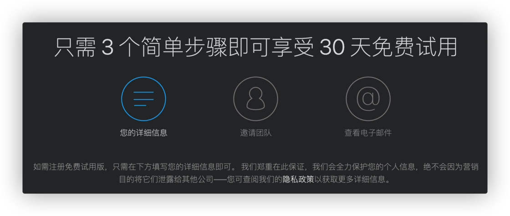

### Spotify 学生优惠

-   权益：一个月 Premium 优惠，需费时 HK$38.00/月
-   认证方式：教育邮箱/学生证

访问 [链接](https://sspai.com/link?target=https%3A%2F%2Fwww.spotify.com%2Fhk-zh%2Fstudent%2F) 直达申请页面，具体申请操作可参照我派上的文章《 [一步一步教你开启 Spotify 学生折扣](https://sspai.com/post/38870) 》。

Spotify 是目前全球订阅用户数最多的音乐流媒体服务，风头正劲。目前 Spotify 尚未进入大陆市场。Spotify 尚无官方中文译名，国内网友多称其为声田、声破天。Spotify 提供免费和付费两种服务，并且得到了全球一些大唱片公司的支持。精准推荐机制、海量的曲库、在操作上比苹果的 iTunes 方便；这些优点使得声田收获了不少用户的芳心。

### Sketch

-   权益：一年免费使用计划，包括 5GB 免费空间，和一个编辑者席位（editor seat）的工作区
-   认证方式：提交学生证扫描件

访问 [链接](https://sspai.com/link?target=https%3A%2F%2Fwww.sketch.com%2Fstore%2Feducation%2F) 直达申请页面，按照表格要求进行填写申请认证。

Sketch 是一款 macOS 下著名的原型设计工具，其官网上介绍说目前已经有超过一百万以上的用户。Sketch 轻量、易用、高颜值，但功能同样很强大。对于很多设计人员来讲，Sketch 是一款朝夕相伴的工具。

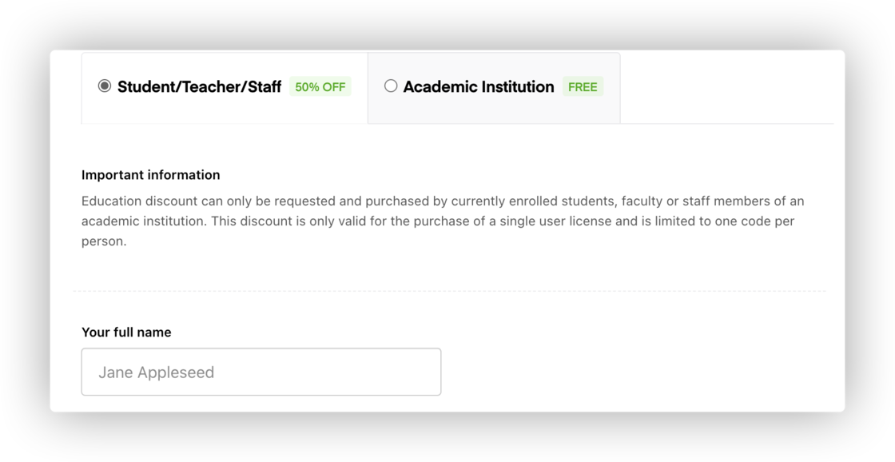

### Setapp

-   权益：5 折优惠，每月 4.99 刀
-   认证方式：教育邮箱

访问 [链接](https://sspai.com/link?target=https%3A%2F%2Fsetapp.com%2Feducational-discount) 直达申请页面，点击「TRY SETAPP FREE」，在页面底部找到图片所示表格，填写相应内容进行申请认证。如果没有教育邮箱也可以走人工审核通道，「[drop us a line](https://sspai.com/link?target=https%3A%2F%2Fsupport.setapp.com%2F)」发起工单。

Setapp 是「一个订阅版的 Mac App Store 」。用户可以通过按月付费的形式，畅想几十甚至更多macOS 收费软件。这软件当中（查看 [可用软件列表](https://sspai.com/link?target=https%3A%2F%2Fsetapp.com%2Fapps) ）不乏像 Ulysses、2Do、CleanMyMac 等优秀软件。对于那些单独订阅价格比较昂贵的软件来讲，Setapp提供的价格很有吸引力的。

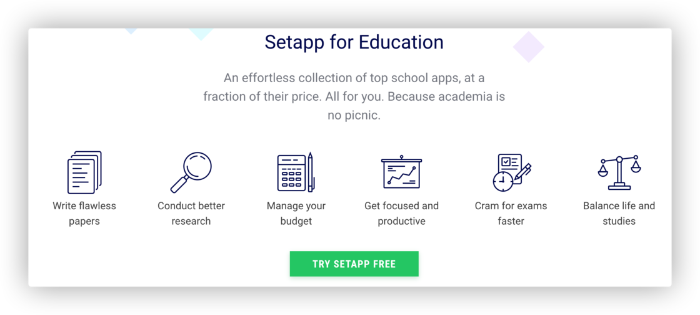

### Mathematica

-   权益：3 折优惠 50 刀，添加购物车后显示
-   认证方式：学生证 / 学信网截图 / 录取通知书等

Mathematica是一款现代科学计算软件，功能非常强大。在数学计算等领域有着非常广泛的应用。

访问 [链接](https://sspai.com/link?target=https%3A%2F%2Fwww.wolfram.com%2Fmathematica%2Fpricing%2Fstudents%2F%23individual) 直达申请页面，按照页面所示的流程进行申请认证即可。注意选择国家为「中国」。

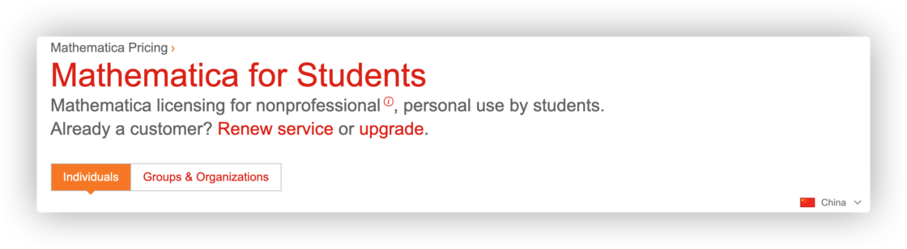

### Tableau

-   权益：免费使用 Tableau
-   认证方式：学生证 / 校园卡

[Tableau](https://sspai.com/link?target=https%3A%2F%2Fwww.tableau.com%2Fzh-cn%2Facademic) 是一个可视化分析软件。它通过交互式的可视化分析，可以让数据分析变得更快速、更轻松同时也更美观、更实用。学生、教师以及教育组织可以申请免费使用。

访问 [链接](https://sspai.com/link?target=https%3A%2F%2Fwww.tableau.com%2Fzh-cn%2Facademic%2Fstudents) 直达申请页面，点击「免费获取 Tableau 」，按照要求填写右侧出现的表格进行申请即可。

### Origin

-   权益：（对中国学生）6 个月的免费使用
-   认证方式：教育邮箱。如果所在学校不在范围内，可以联系官方。

Origin 是一款专业的绘图软件，理工科学生尤为常用。它可以用来进行数据分析，绘制各种曲线。官网介绍说，目前已经有来自公司、大学、政府机关等超过 500,000 注册用户在使用。

访问 [链接](https://sspai.com/link?target=https%3A%2F%2Fwww.originlab.com%2FOriginProLearning.aspx) 直达申请页面，填写页面下方的表格，提交申请，审核通过即可。

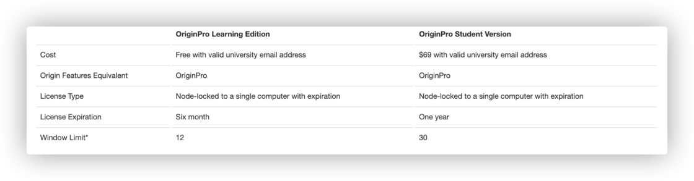

### Notion

-   权益：付费个人版的功能
-   认证方式：教育邮箱验证

Notion是一款将笔记、知识库和任务管理无缝整合的协作平台。它玩法多样，有不少用户把它当成一款重新定义的笔记软件，也有用户用它来建站；其类型丰富的 Block 特性更是俘获不少用户的心。

访问 [链接](https://sspai.com/link?target=https%3A%2F%2Fwww.notion.so%2Fstudent) 直达申请页面，也可参照我派之前的文章《 [Notion 教育优惠上线，学生与教师可以免费使用 Notion 啦](https://sspai.com/post/56685) 》进行申请。

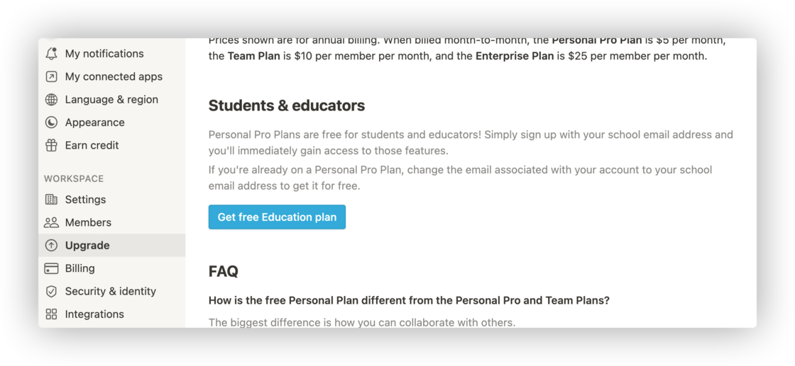

### Eagle 教育优惠

-   权益：价格优惠至￥139
-   认证方式：学生证 / 学信网学历认证文件

将信息或证明文件发送至邮箱 [edu@eagle.cool](https://sspai.com/link?target=mailto%3Aedu%40eagle.cool)，申请审核通过后发放优惠码。具体可访问 [链接](https://sspai.com/link?target=https%3A%2F%2Fdocs-cn.eagle.cool%2Farticle%2F4-do-i-get-a-discount-if-i-am-a-student-or-teacher) 直达官方指引页面，按照页面所示的流程进行申请认证即可。

Eagle 是一款素材收集和管理工具，它可以收集、整理设计项目中的「案例、灵感、截图、图片、视频、音频、情绪板」等各种素材，并可以通过标签、文件夹等方式对素材进行整理。 对于对于那些电脑中有「海量」照片的同学来讲，Eagle 可以看一下。

### XShell + XFTP

-   权益：免费使用 XShell 与 XFTP

XShell 与 XFTP 都是 NetSarang 公司出品的软件。二者可能是 Windows 下最好用的 SSH 和 FTP 管理工具。其免费许可涵盖任何认证教育机构的学生、教师和员工，并允许相关人员使用 Xshell 和 Xftp 进行教学、学习和管理。

访问 [链接](https://sspai.com/link?target=https%3A%2F%2Fwww.netsarang.com%2Fzh%2Ffree-for-home-school%2F) 直达申请页面，填写姓名、邮箱，然后下载即可免费使用 XShel l与 XFTP。

此外 XShel 与 XFTP 个人只要是非商业用途也是免费的。

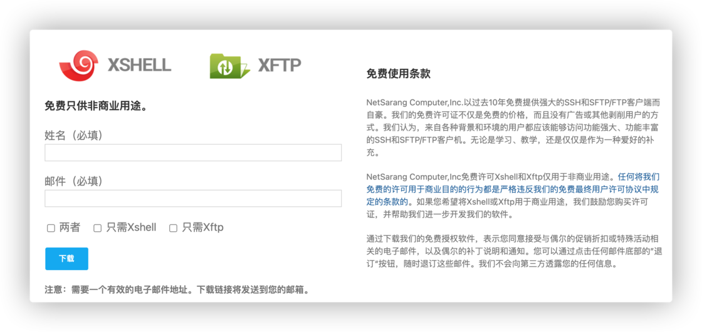

### Shapr3D

-   权益：针对高校学生（大专及以上）、教师或教职工免费教育许可、一年的商务版使用权限。在一年的免费教育许可到期后，只要申请人还在读或在职，只需再次申请即可。
-   认证方式：教育邮箱、学生证 / 学信网

关于 CAD 其实在前文中已经有所提到那就是 Autodesk 的 AutoCAD。同为专业 CAD 工具，Shapr3D 是一款为 iPad 和 Apple Pencil 的移动性和精度而创造。

访问 [链接](https://sspai.com/link?target=https%3A%2F%2Fwww.shapr3d.com%2Feducation) 直达申请页面，点击「 here 」按照相应指引进行申请即可。此外官方在知乎上发布了中文版的应用内 [教育许可申请攻略](https://sspai.com/link?target=https%3A%2F%2Fzhuanlan.zhihu.com%2Fp%2F363626840)，申请时可以参考。

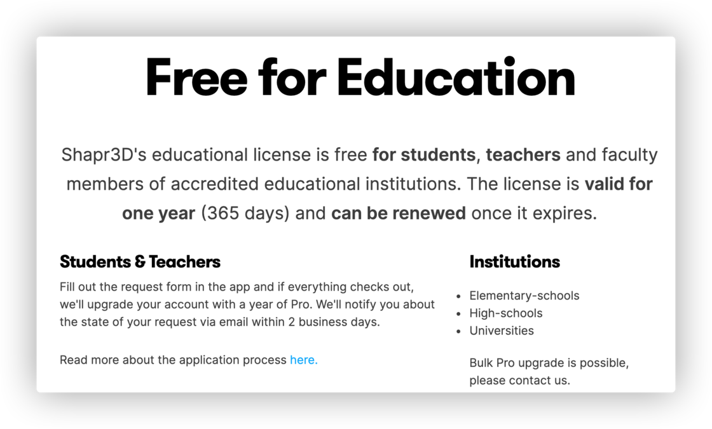

### Altium Designer

-   权益：免费使用 Altium Designer
-   认证方式：教育邮箱

Altium Designer 是一款为功能强大的 PCB 设计软件。使用该软件，用户可以连接到印刷电路板设计过程的方方面面。目前，Altium Designer 是市场面上应用最为广泛的印刷电路板设计解决方案之一。

访问 [链接](https://sspai.com/link?target=https%3A%2F%2Fwww.altium.com.cn%2Fsolutions%2Facademic-programs%2Fstudent-licenses) 直达申请页面，填写「获得您的免费许可证」表格，提交等待审核即可。

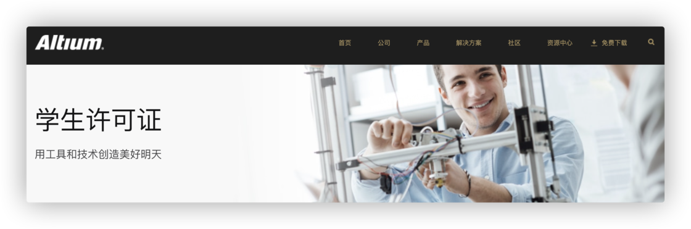

### 滴答清单

-   权益：75 折优惠。原价 139 元/年，优惠价格 99 元/年
-   认证方式：教育邮箱注册验证

滴答清单是一款优秀的 GTD ( *Getting Things Done* )应用，它能够帮助你高效完成任务和规划时间。相比其他同类应用，滴答清单在本土化上做的比较出色，比如支持微信、农历与节假日调休、中文自然语义等。

访问 [链接](https://sspai.com/link?target=https%3A%2F%2Fwww.dida365.com%2Feducation) 直达「教育优惠」页面，点击「申请教育优惠」申请即可。该页面同时也有教育优惠使用与申请的说明。

与滴答清单相对的，Todoist 也有很多用户。不过在 2021 年 3 月，[Todoist 取消了与教育机构优惠项目](https://sspai.com/link?target=https%3A%2F%2Ftodoist.com%2Fzh-CN%2Fhelp%2Farticles%2Ftodoist-for-education) 。尽管官方说希望在不久的未来推出更好的方案，但目前并未见到。

### SQLPro Studio

-   权益：SQLPro Studio 1 年教育许可证
-   认证方式：教育邮箱

SQLPro Studio 是一款在 macOS / iOS平台上的简洁、强大、多用途的数据库管理客户端。当然，可视化也是其特色之一。SQLPro支持许多数据库类型，这当中包括 MySQL 、Postgres / PostgreSQL、 Redshift、 Microsoft SQL Server、Oracle、 SQLite 和 SnowflakeDB 等。

访问 [链接](https://sspai.com/link?target=https%3A%2F%2Fwww.sqlprostudio.com%2Fedu%2F) 直达教育优惠申请页面，提交相应的信息，审核通过申请认证即可。

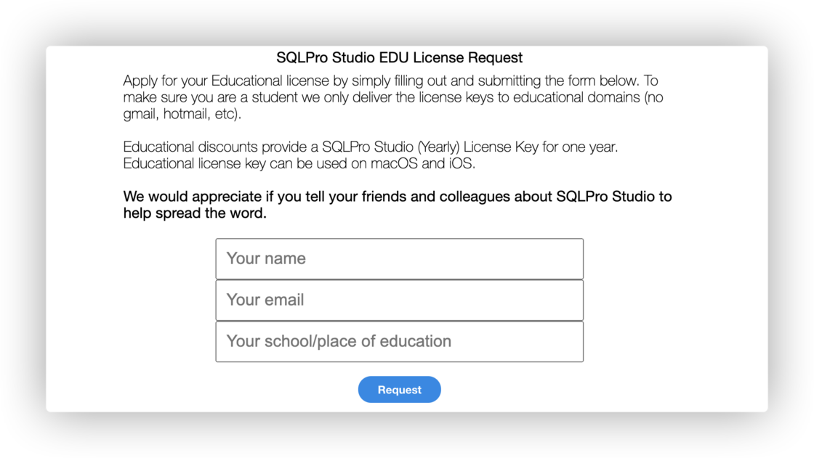

### 知乎·盐选会员青春卡

-   权益：原价 238 元会员优惠至 98 元。
-   认证方式：学生用户默认为小于或等于 24 周岁的用户，或提供有效学生身份证明。

知乎·盐选会员可以免费看知乎高质量的内容、杂志、Live 讲座、精选电子书、盐选杂志、使用评论区发图等功能。

访问 [链接](https://sspai.com/link?target=https%3A%2F%2Fwww.zhihu.com%2Fxen%2Fmarket%2Fstudent-vip-privileges) 直达「开通盐选会员·青春卡」页面，点击下方「立即开通」付费购买，然后后续提交相应证明即可。需要注意的是：知乎·盐选会员青春卡目前1 年限购 1 次；购买后可得半年权益，提供学生证明后才能解锁下半年。

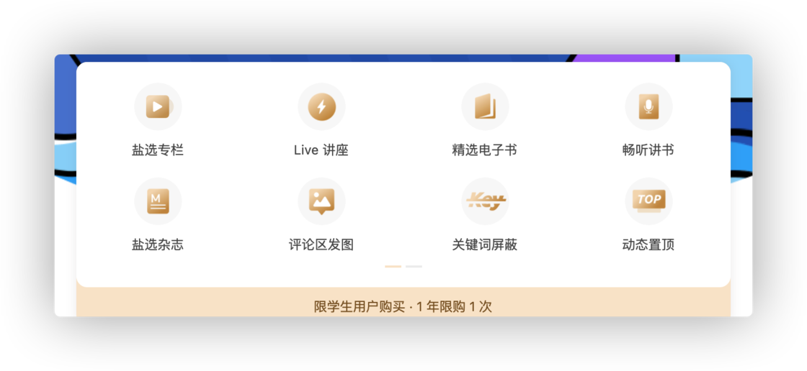

### Amazing Marvin

-   权益：学生半价
-   认证方式：需要发邮件给官方

Amazing Marvin 是一款任务管理软件。它覆盖多个平台，用户可以用其搭建一个适合自己的习惯与工作流，从而提升自己的效率。具体的用法可以参考我派上的文章《[认识一下任务管理工具中的瑞士军刀：Amazing Marvin](https://sspai.com/post/62318)》。

访问 [链接](https://sspai.com/link?target=https%3A%2F%2Famazingmarvin.com%2Fpricing%2F) 直达官方购买页面，按照页面所示内容申请认证即可。

### YNAB

-   权益：学生第一年免费
-   认证方式：学生证或其他证明材料

YNAB，即「you need a budget」。从这里就可以猜出 YNAB 是一款记账软件。从「Stop living paycheck-to-paycheck, get out of debt, and save more money」的 slogan，我们能够看出它基于预算的影子。

访问 [链接](https://sspai.com/link?target=https%3A%2F%2Fwww.youneedabudget.com%2Fcollege%2F) 直达申请页面，页面中部有申请流程。YNAB 需要先注册，然后电邮官方学生证或其他证明材料，然后按照官方指引进行操作。

### Flomo 浮墨

-   权益：学生 Pro 69 元 / 年
-   认证方式：需要提供任意能证明身份的材料。

Flomo 是一款轻量的笔记工具，主打卡片功能，强调「卡片」、「标签」、「连接」，让知识增长。Flomo 的会员权益可参考 [会员介绍（ PRO ）](https://sspai.com/link?target=https%3A%2F%2Fhelp.flomoapp.com%2Fmembership%2Fpro)。

学生版具体申请步骤：网页版会员中心位置 ->（拖到页面底部）其他 ->「教育版 ￥69 / 年，功能同 PRO，供学生和教师们选择」 [点此申请教育优惠](https://sspai.com/link?target=http%3A%2F%2Fflomoapp.mikecrm.com%2FLKHv1K6)，点击跳转，然后提交身份证明材料。

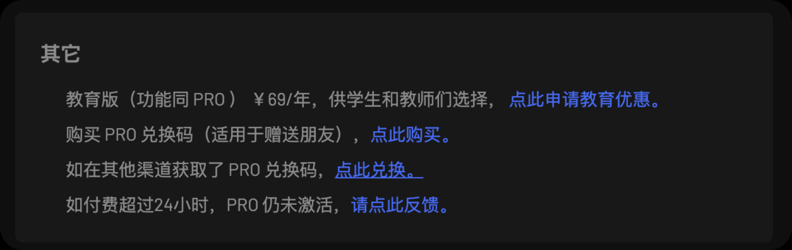

### Omni Education

-   权益：给予学生一定折扣
-   认证方式：学生 / 教师有效身份证明

对于绝大部分使用 macOS / iOS平台的人来讲，Omnigroup 旗下的软件可能没用过，但肯定听说过。Omni 旗下的 OmniFocus、 OmniOutliner、 OmniGraffle 和 OmniPlan 分别对应任务管理、知识管理、图形绘制、项目管理，在各自的领域都表现不俗，是知名的生产力工具。

通过 [链接](https://sspai.com/link?target=https%3A%2F%2Flegacy.store.omnigroup.com%2Fedu) 直达 Omni Education Store，将拟购买的软件加入购物车，在结算的时候会跳转至身份验证页面。在该页面内，需要提供学校名称、位置、官网、学生证号码等信息，点击继续，验证通过后就可以付款了。

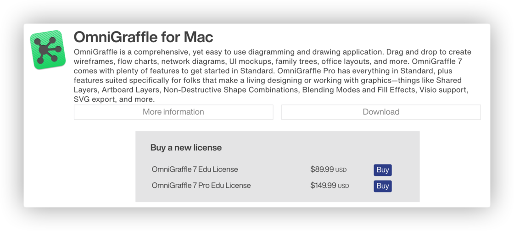

### Prezi

-   权益：立减 $12 。每月收费 $3 或 $4 。
-   认证方式：教育邮箱

Prezi 是一款新型的演示文稿软件，比较接近的同类产品有我们所熟知的 PowerPoint。它拥有非线性的界面，可以与Zoom、Microsoft Teams、 Webex 等知名应用集成。整款软件的界面为英语，有一定的上手成本。访问[链接](https://sspai.com/link?target=https%3A%2F%2Fprezi.com%2Fpricing%2Fedu%2F)直达官网，参照官网说明进行购买申请即可。

### Ulysses

-   权益：￥73/半年
-   认证方式：学生 / 教师有效身份证明，如学生证等

Ulysses是一款 Mac/iOS 平台上功能强大的写作和文本编辑应用。它具有令人愉悦与专注的写作体验、高效的文稿管理、无缝同步以及灵活导出等特点，赢得了无数文字工作者的芳心。

通过 [链接](https://sspai.com/link?target=https%3A%2F%2Fulysses.app%2Fzh%2Fstudents%2F) 直达官方网站，可以参照官网上的说明进行申请，也可参照下图所示进行申请。

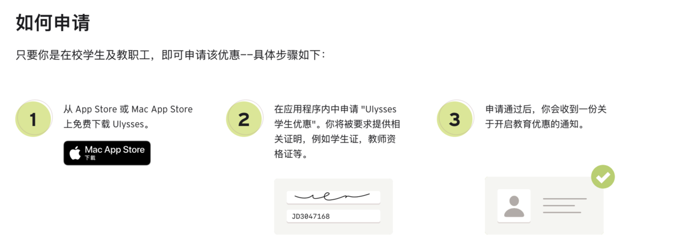

### Craft

-   权益：免费 5 年 Pro 版使用，
-   认证方式：教育邮箱与学生证或其他证明材料

Craft 是一款小众的笔记软件，我派之前的文章《 [设计精美、功能强大，Apple 用户的文档工具新选择：Craft](https://sspai.com/post/61784) 》详细地介绍过这款软件。Craft 比较依赖于苹果系设备，与 Notion、Evernote 相比，Craft 以本地客户端为主、支持 Block 级别的双向链接、支持实时协作，这些都是它的魅力所在。

通过 [链接](https://sspai.com/link?target=https%3A%2F%2Fcommunity.craft.do%2Fc%2Fcraft-for-students) 直达 Craft for Students 相关界面，点击「As a student, you can get Craft Pro **For Free -** [Click here](https://sspai.com/link?target=https%3A%2F%2Fforms.gle%2FEVaiV4gRMgg9zHbcA) to register. 」进行申请。

### ~多译~（已经取消或无法找到入口）

-   ~权益：多译年版订阅优惠至 96 元，多译 Pro 优惠至 188 元~
-   ~认证方式：学生证~

~多译是一款高效的翻译工具，支持 Mac 与 Windows 系统。从文件、文本、图片 OCR 翻译，乃至简单的字典查单词，多译统统支持。此外，多译还对论文翻译、字幕翻译、外文阅读进行了优化，以提升翻译体验。~

~访问~

[↓↓↓](https://sspai.com/link?target=https%3A%2F%2Fsupport.duoyiapp.com%2Fdocs%2Fapply-discount%2F)  
  
~链接~  
  
[↑↑↑](https://sspai.com/link?target=https%3A%2F%2Fsupport.duoyiapp.com%2Fdocs%2Fapply-discount%2F)

~直达「申请教育或公益优惠」页面，填写表单，提交相应的信息，审核通过即可。~

[多译](https://sspai.com/link?target=https%3A%2F%2Fduoyiapp.com%2F)目前似乎已经失去了维护，官网上的[更新日志](https://sspai.com/link?target=https%3A%2F%2Fduoyiapp.com%2Fchangelog)停留在2021年。具体的教育优惠[链接](https://sspai.com/link?target=https%3A%2F%2Fsupport.duoyiapp.com%2Fdocs%2Fapply-discount%2F)，点击之后直接出现 404 页面。

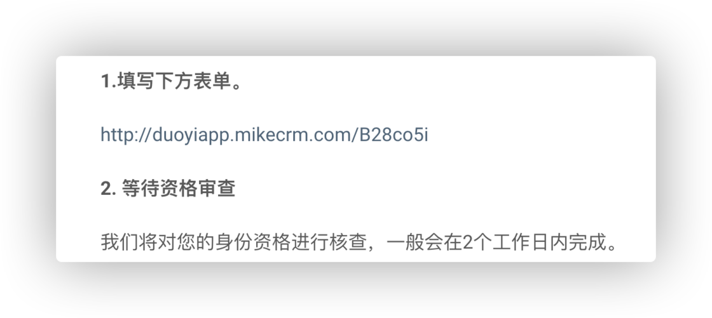

## 写在最后

本文在梳理相关优惠时，我尽可能的进行了测试。但是考虑到软件官网表述可能会发生调整，大家申请时注意查阅官网表述，尤其是那些需要抢购的优惠。

目前，包括我所在的地区在内，部分地区疫情反复。对于那些即将踏上新征程的同学，这里友情提醒请做好旅途中的防护；对于那些可能会延迟开学的同学，则可以利用推延的这段时间利用各种资源充实自己。

文章中优惠就介绍到这里，然而优惠并不止这么多。欢迎大家在评论区补充自己最心水的安利。

\> 下载少数派 [客户端](https://sspai.com/page/client)、关注 [少数派公众号](https://sspai.com/s/J71e)，不再错过任何一款好用的 App 💡

\> 实用、好用的 [正版软件](https://sspai.com/mall)，少数派为你呈现 🚀

以下内容于 10 月 12 日更新

更新了 Apple 教育优惠的认证方式

更新了 Apple 教育优惠的认证方式，官网教育商店的认证方式从「通过 UNIDays 进行认证」变为了「通过支付宝进行认证」。
