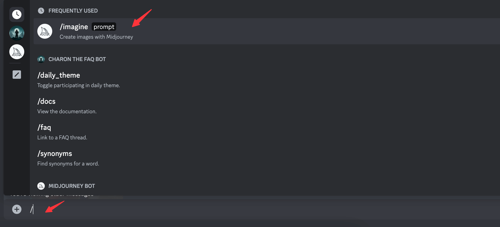
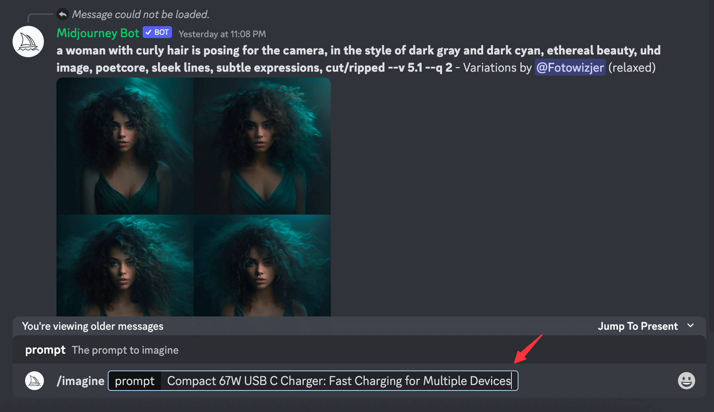
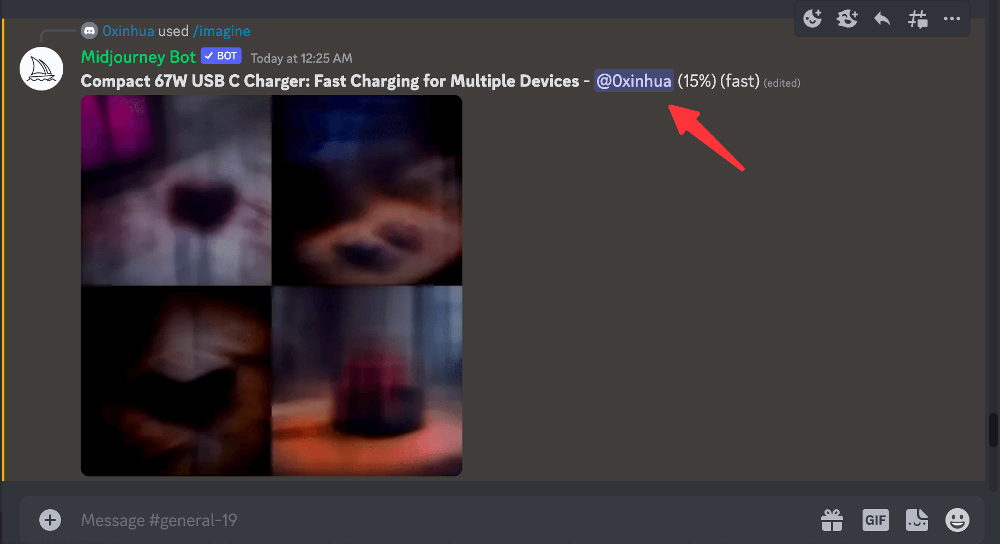
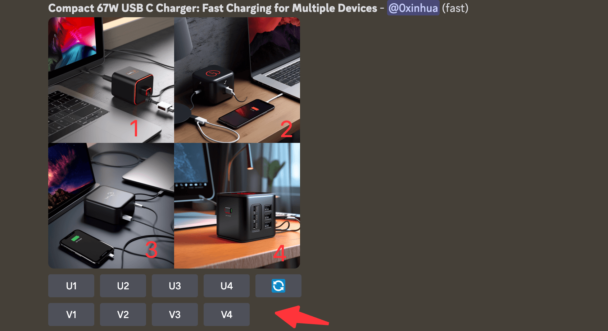
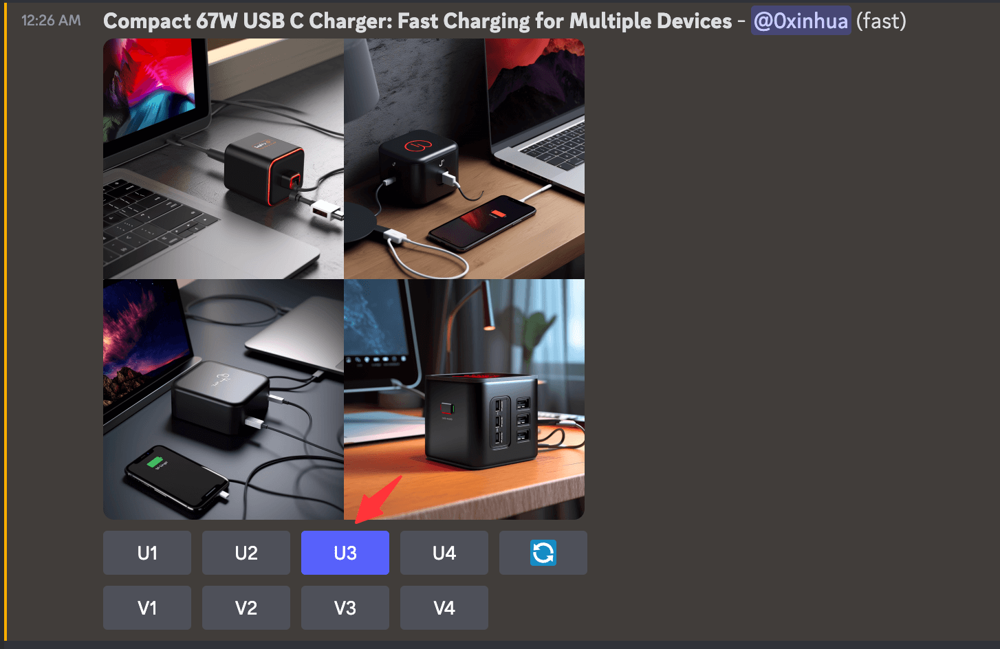
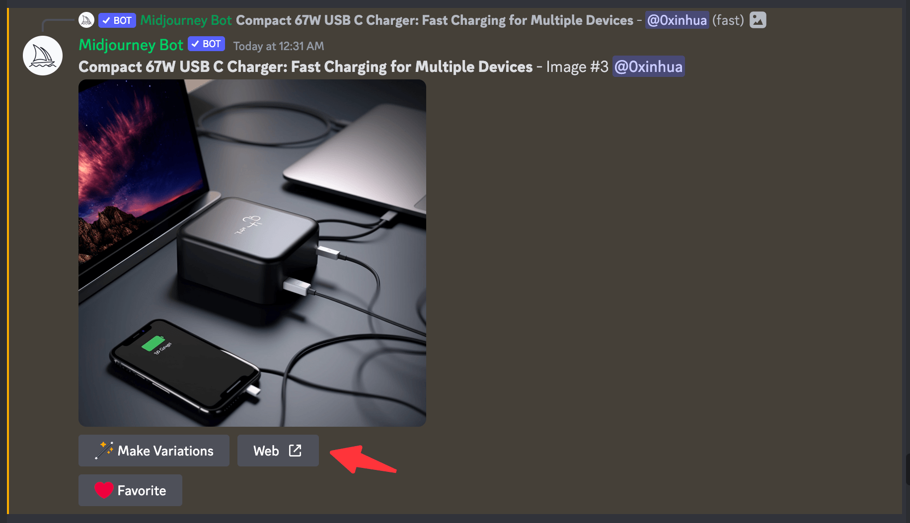
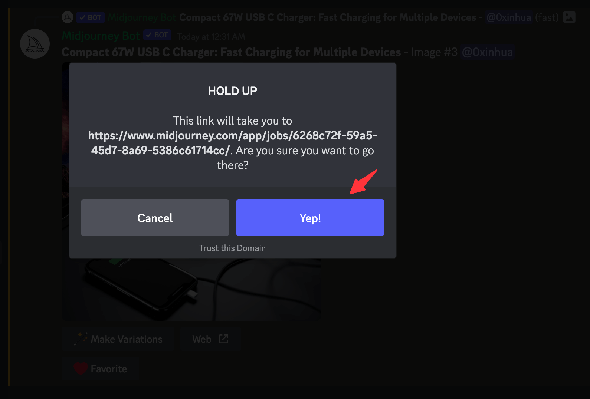
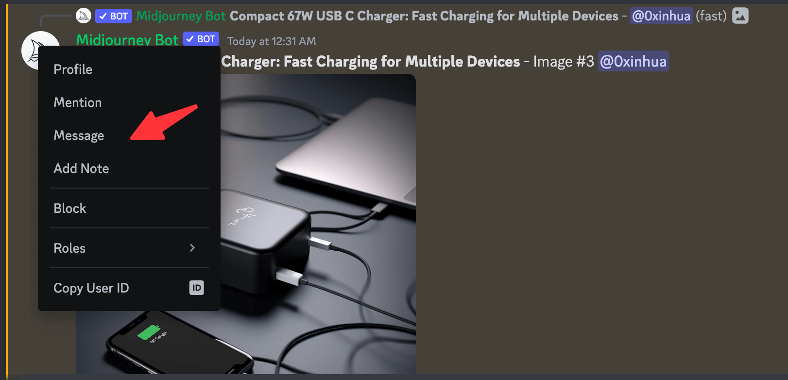
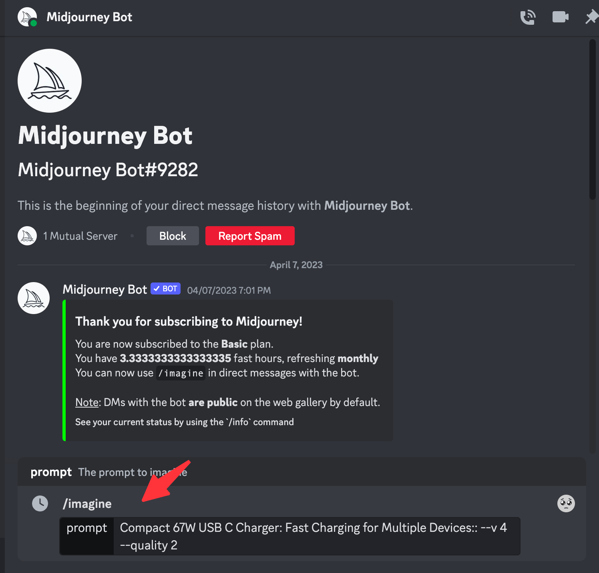
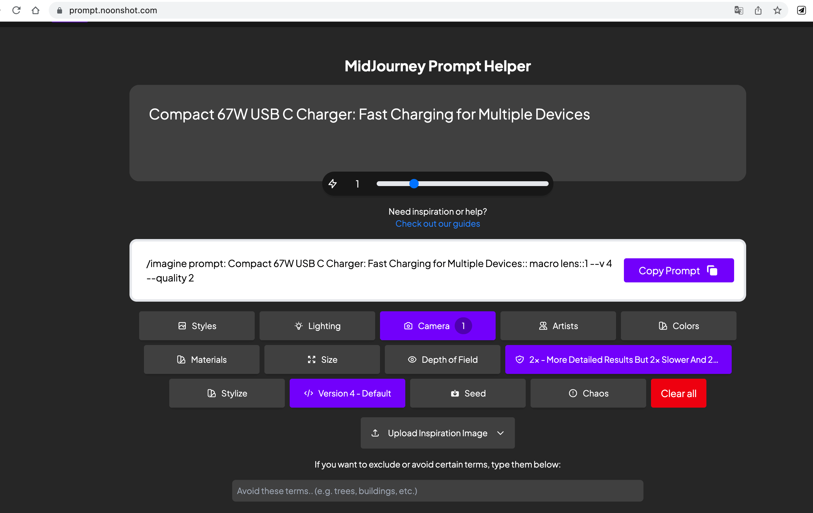

# 快速上手 Midjourney AI 做图

@0xinhua 发布于 2023年05月25日

通过本文，你将学习到使用利用AI通过几行简单的命令制造精美的图片。

1.  访问 [Midjourney 官网](https://www.midjourney.com/home/)，这里登陆注册步骤省略
2.  进入 [Midjourney Discord 频道](https://discord.gg/midjourney)，随机选择一个 general-\* 频道输入 / 唤出 imagine 命令



3.  输入你要所需图片素材的 prompt， 并按 Enter 键开始 AI 做图



4.  频道内消息比较多，找到机器人@你的那条信息，并且等待图片完成



5.  图片完成后，底部 U 是 Upscale 的缩写，代表放大像素提升细节， U1 - 4 指针对图中位置的图片进行细节加强；V 是 Variant 的缩写，指根据对应图片创建变体，将生成一个新的图片，该图片类似于所选图像的整体风格和组成



6.  例如这里我比较喜欢第三张图片，我点击选择 U3，bot 会重新给你生成这张图片，可以选择 Web 按钮在新的页面打开，在个人中心会重新看到这张图片







7.  频道内消息比较多，也可以单独使用 Bot 做图，选择 Bot 头像右键点击 “Message” 选项



进入bot聊天框后，步骤如上第 2 步一致：



8.  另外优化你的 Prompt，后面可以带上对应的参数，例如下面的 --v 4 代表使用 Version 4 版本，--quality 2 代表更多的细节和质量 x 2 ，--ar 16:9 代表图片比例。信息越多并且越精准，做图效果更佳

```unknown
Compact 67W USB C Charger: Fast Charging for Multiple Devices:: --v 4 --quality 2 --ar 16:9
```

可以考虑使用这个工具 [MidJourney Prompt Helper](https://prompt.noonshot.com/) 进行 Prompt 调优



Enjoy and have fun~
