# 恶意代码分析技术 - 先知社区

恶意代码分析技术

- - -

# 一、恶意代码分析技术

**恶意代码**也称为恶意软件:任何以某种方式对用户、计算机或网络造成破坏的软件，包括计算机病毒木马、蠕虫、内核套件、勒索软件、间谍软件，等等。在大多数情况下，进行恶意代码分析时，你将只有恶意代码的可执行文件本身，而这些文件并不是人类可读的。为了了解这些文件的意义，你需要使用各种工具和技巧，而每种只能揭露出少量的信息。因此你需要综合使用各种工具，才能看到一个全貌。恶意代码分析有两类基本的方法:静态分析与动态分析。静态分析方法是在没有运行恶意代码时对其进行分析的技术，而动态分析方法则需要运行恶意代码，而这两类技术又进一步分为基础技术和高级技术。

## 静态分析

静态分析基础技术包括检查可执行文件但不查看具体指令的一些技术。静态分析基础技术可以确认一个文件是否是恶意的，提供有关其功能的信息，有时还会提供一些信息让你能够生成简单的网络特征码。静态分析基础技术是非常简单，同时也可以非常快速应用的，但它在针对复杂的恶意代码时很大程度上是无效的，而且它可能会错过一些重要的行为。

### PE文件信息

A.工具：**StduyPE+x64**

[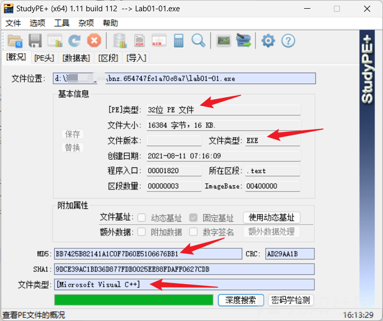](https://xzfile.aliyuncs.com/media/upload/picture/20231105161429-57bd521a-7bb3-1.png)

-   打开StudyPE将病毒样本拉进去即可自动分析出
-   文件类型（EXE)、大小
-   md5 ：通常用作验证文件完整性（md5特性-抗修改性：原数据的任意变动都会使最终的MD5值完全不一）
-   由C++编写而成
-   加了壳也能被检测出来 如下图（upx壳）  
    [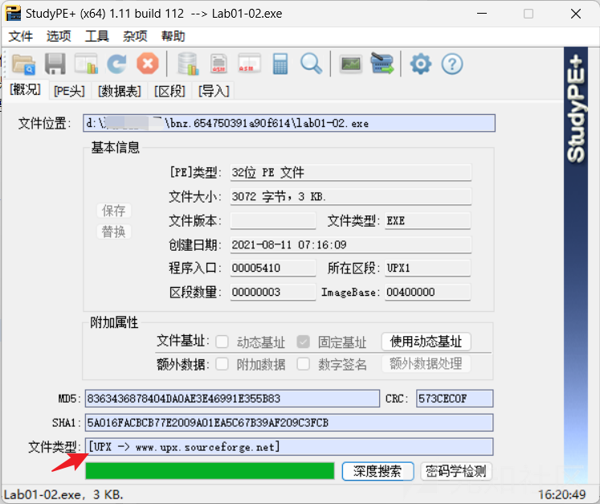](https://xzfile.aliyuncs.com/media/upload/picture/20231105162107-44ef6992-7bb4-1.png)

在导入板块可以清晰的看见该文件进行了何种操作（调用了什么函数）

[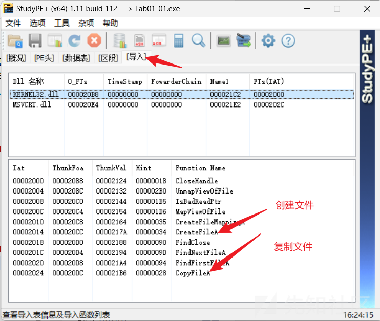](https://xzfile.aliyuncs.com/media/upload/picture/20231105162635-084c4798-7bb5-1.png)

B.工具：**String.exe**  
Strings是微软官方的一个命令行工具，主要用来查看程序中的所有字符串信息，平时我们通过敏感的字符串来定位分析一个程序是极好的选择

[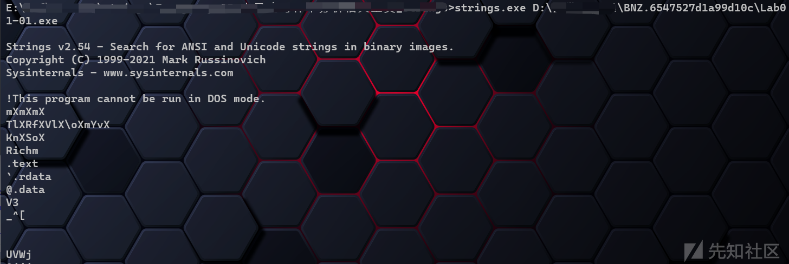](https://xzfile.aliyuncs.com/media/upload/picture/20231105163203-cc0e6af8-7bb5-1.png)

[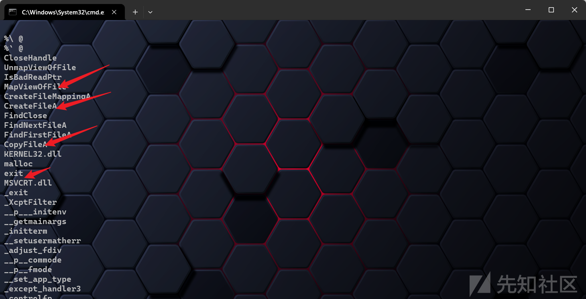](https://xzfile.aliyuncs.com/media/upload/picture/20231105163246-e592f1ba-7bb5-1.png)

该工具可以将程序中的字符串提取出来，我们可以以此收集信息  
tip:在ctf中利用该工具可能也可以提取出flag噢

### 脱壳工具

A.upx脱壳-freeupx  
将加了upx壳的程序丢进 freeupx工具 Action-->Decompress checked files  
[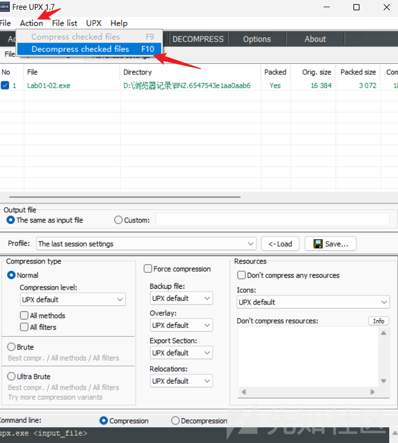](https://xzfile.aliyuncs.com/media/upload/picture/20231105163813-a858fb68-7bb6-1.png)

[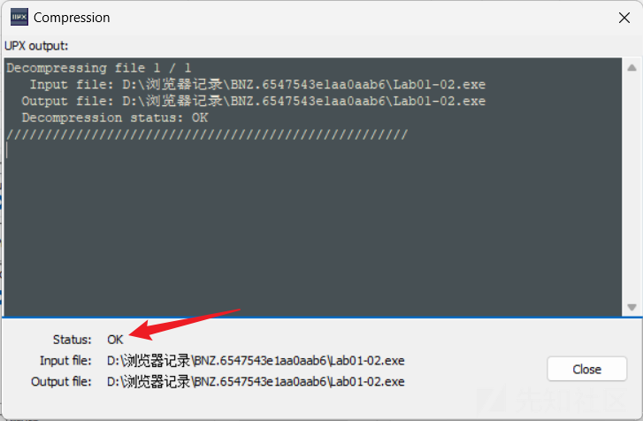](https://xzfile.aliyuncs.com/media/upload/picture/20231105163835-b5791f1c-7bb6-1.png)

B.通用脱壳-linxerUnpacker  
可自动识别多数常见壳，并进行脱壳

[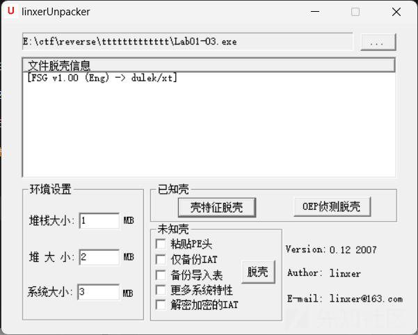](https://xzfile.aliyuncs.com/media/upload/picture/20231105164619-c9f99c90-7bb7-1.png)

[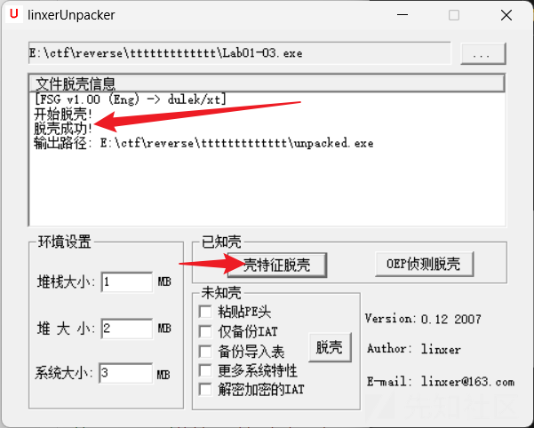](https://xzfile.aliyuncs.com/media/upload/picture/20231105164749-ffd376f6-7bb7-1.png)

### 资源查看器

Restorator  
对于某些恶意木马病毒是不会单纯的将一个裸漏的exe文件发送给你，而是会进行一些加壳以及捆版的操作，那么我们就可以将其丢进Restorator中进行分析，在下面这个样本中的就是在一个exe的文件中还藏着另一个exe文件，当我们用的stduype去分析时是看不出如何异常的，因此我们应该借用这个工具分析，如图，点开101文件我们可以看得到其中包含的信息，很关键的一点是“MZ”、“This is program cannot be run in DOS...."这实际上就是metasploit的一个特征，因此我们可以判定该程序大概率为恶意程序  
[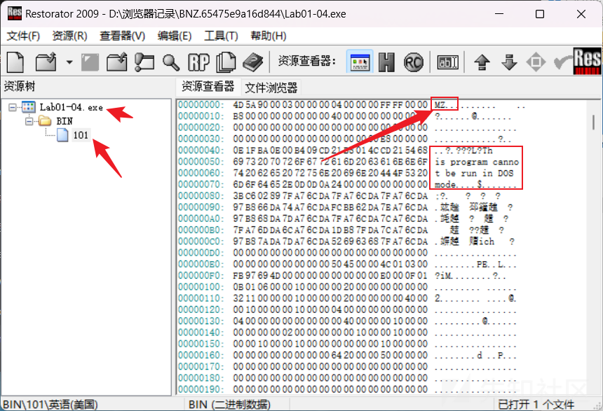](https://xzfile.aliyuncs.com/media/upload/picture/20231105172217-d045e5a4-7bbc-1.png)  
或者我们可以利用Restorator的导出功能将隐含文件导出再放进StudyPE中分析  
[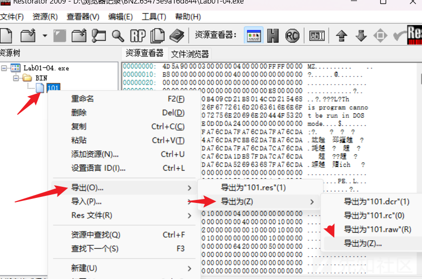](https://xzfile.aliyuncs.com/media/upload/picture/20231105173004-e6ce481a-7bbd-1.png)

## 动态分析

动态分析基础技术涉及**运行**恶意代码并观察系统上的行为，以移除感染，产生有效的检测特征码，或者两者。然而，在你可以安全运行恶意代码之前，你必须建立一个安全环境，能够让你在避免对你的系统与网络带来风险的前提下，研究运行的恶意代码。像静态分析基础技术一样，动态分析基础技术可以被大多数没有深厚编程知识的人所使用，但是它们并非对所有恶意代码都是有效的，也会错过一些重要功能。

实际上动态分析既是监控内存，所有的程序无论如何混淆，只要程序运行起来，它都是在内存里面，在内存里面所有东西都是“裸奔”的，实践运行的地方都是不会有任何加密的

### process explorer

注意：要以管理员身份运行  
可通过process explorer查看程序的子进程，看它们调用哪些DLL、启动参数和位置来区分是否是一个病毒

在这里可以设置你想看到的数据（可通过程序的签名进行判断，但也可能会有伪造的签名，需自己稍加辨别）  
[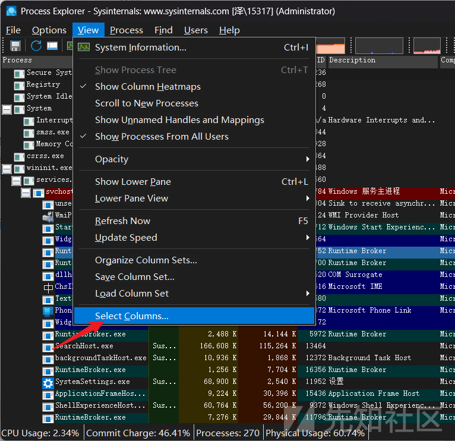](https://xzfile.aliyuncs.com/media/upload/picture/20231105174701-4532f03e-7bc0-1.png)  
想要看哪些数据就将其勾选  
[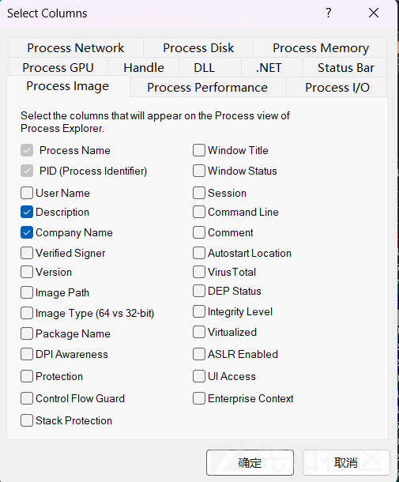](https://xzfile.aliyuncs.com/media/upload/picture/20231105174847-83de9360-7bc0-1.png)  
[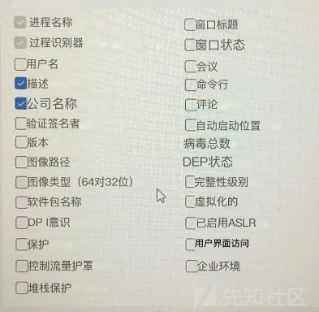](https://xzfile.aliyuncs.com/media/upload/picture/20231105174837-7deb35a8-7bc0-1.png)

### process Monitor

[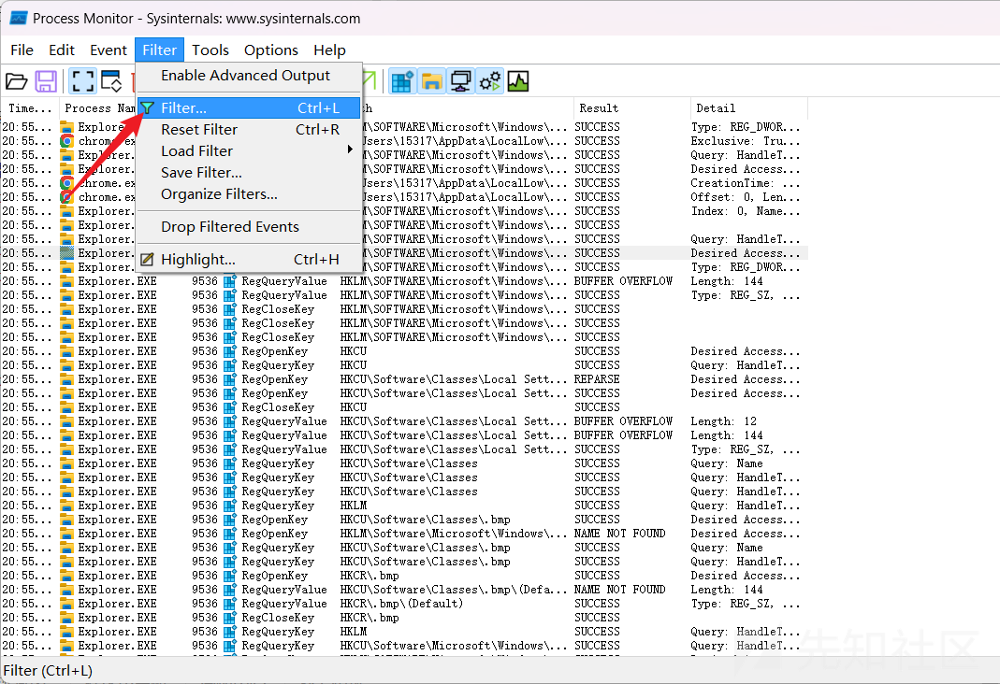](https://xzfile.aliyuncs.com/media/upload/picture/20231105210049-57fac6ea-7bdb-1.png)

[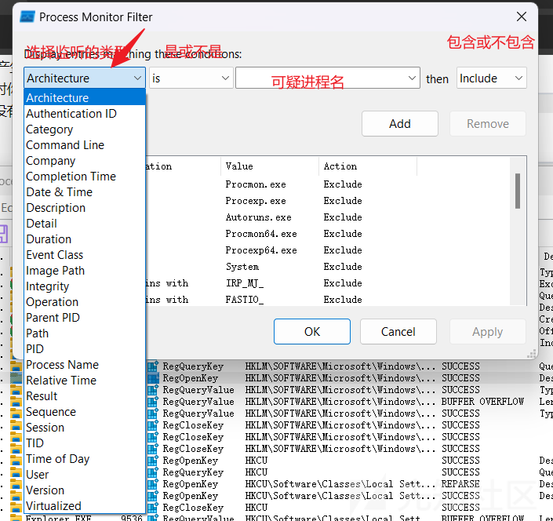](https://xzfile.aliyuncs.com/media/upload/picture/20231105210155-7ece5084-7bdb-1.png)

[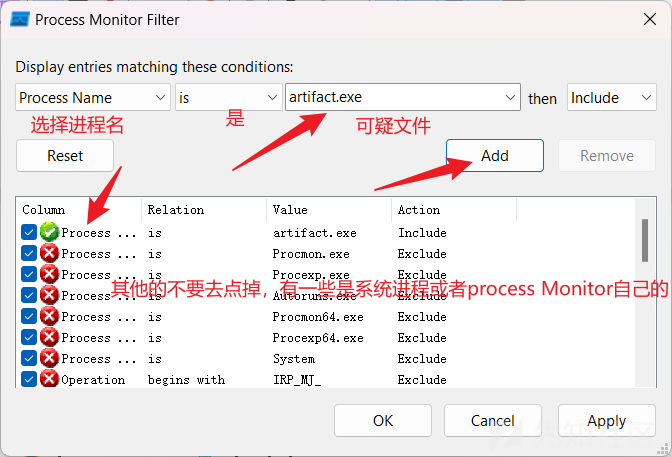](https://xzfile.aliyuncs.com/media/upload/picture/20231105210019-4613fdac-7bdb-1.png)  
点击apply后开始监听--我们点开样本试试

[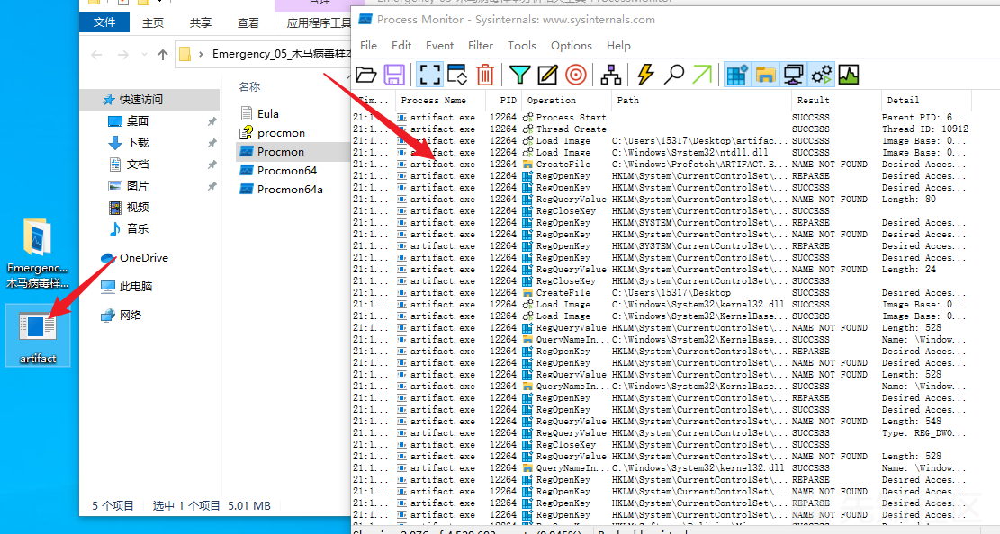](https://xzfile.aliyuncs.com/media/upload/picture/20231105211808-c2d343dc-7bdd-1.png)  
当然单纯这样一行一行看还是很费劲的，因此我们要懂得利用filter 再给它加一个 例如 对操作进行监听（网络连接）

[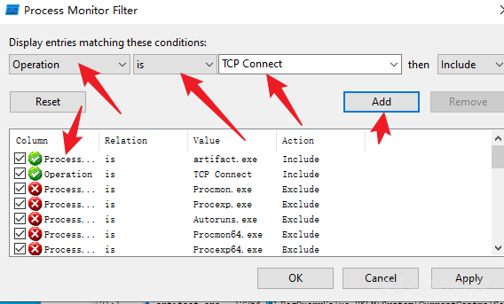](https://xzfile.aliyuncs.com/media/upload/picture/20231105212520-c45d51c4-7bde-1.png)

### IDA pro

IDA Pro（Interactive Disassembler Professional）是一款由Hex-Rays公司出品的交互式反汇编工具，也是目前最棒的一个静态反编译软件，它为众多0day世界的成员和ShellCode安全分析人士不可缺少的利器。

[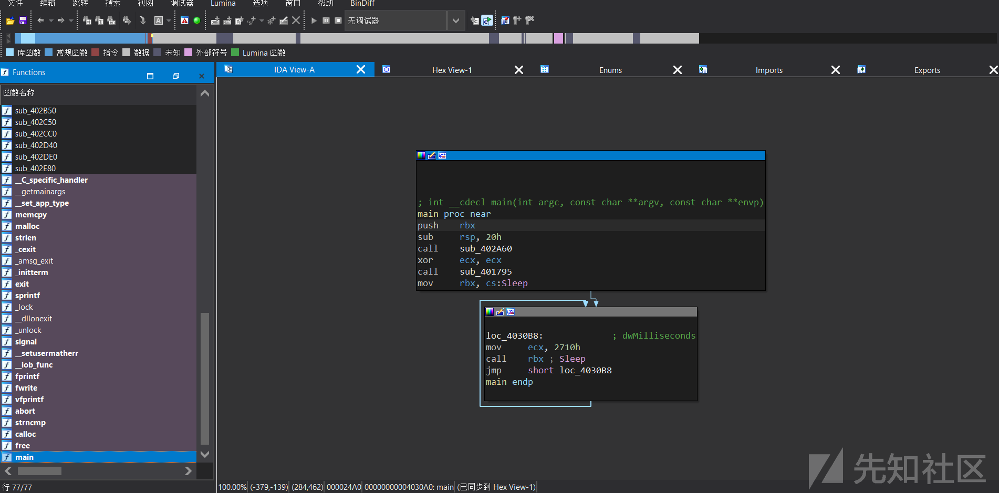](https://xzfile.aliyuncs.com/media/upload/picture/20231105215717-3b1f4516-7be3-1.png)  
可将可疑程序丢进ida 进行分析，在ida中可以按F5宣示伪代码进行分析（上图是未转换成伪代码，下图是已转换）

[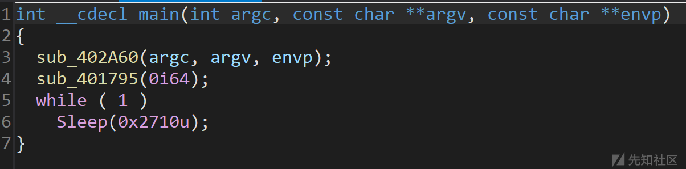](https://xzfile.aliyuncs.com/media/upload/picture/20231105215844-6ef64862-7be3-1.png)

## 恶意代码分析举例

[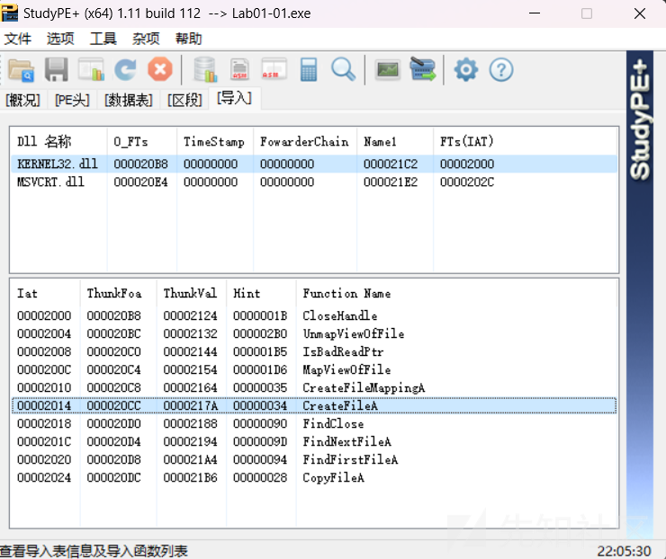](https://xzfile.aliyuncs.com/media/upload/picture/20231105220542-67ef64f8-7be4-1.png)  
lab01-01.exe（样本）导入函数有FindFirstFile、FindNextFile和CopyFile。这些导入函数告诉我们，这个程序在  
搜索文件系统和复制文件

[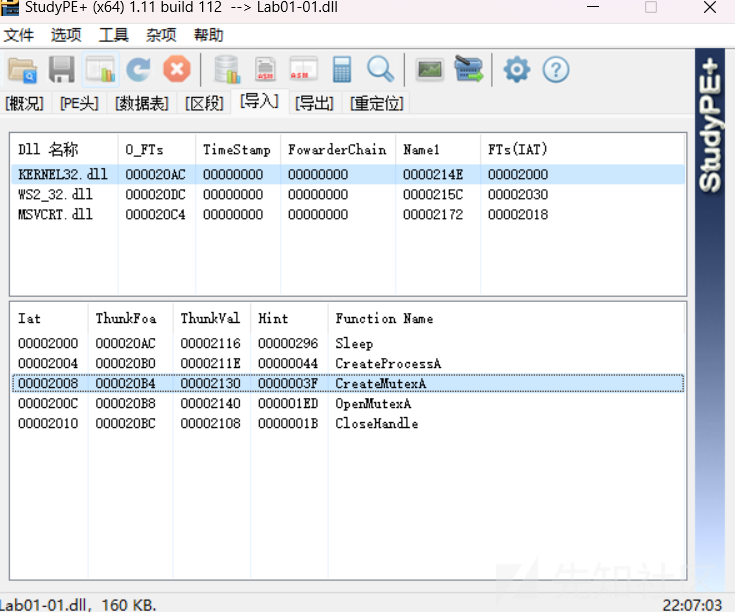](https://xzfile.aliyuncs.com/media/upload/picture/20231105220713-9e2b87d6-7be4-1.png)  
lab01-01dll导入函数有  
CreateMutex //创建互斥量 OpenMutex //打开互斥量恶意程序往往喜欢创建或打开一个互斥量，因为创建了互斥量后再同一时间只允许一个程序访问其资源，避免重复感染  
WS2\_32dll是一个网络通讯的动态库，说明该文件运行后存在网络连接

Strings查看lab01-01.exe敏感字符串信息发现 kerne132.dll再结合我们上面分析的导入表，分析出他有个CopyFile的api函数，所以可以得出结论这个exe程序想把Lab01-01.dll文件拷贝到系统目录并且伪装成系统文件"kernel32.dll"  
[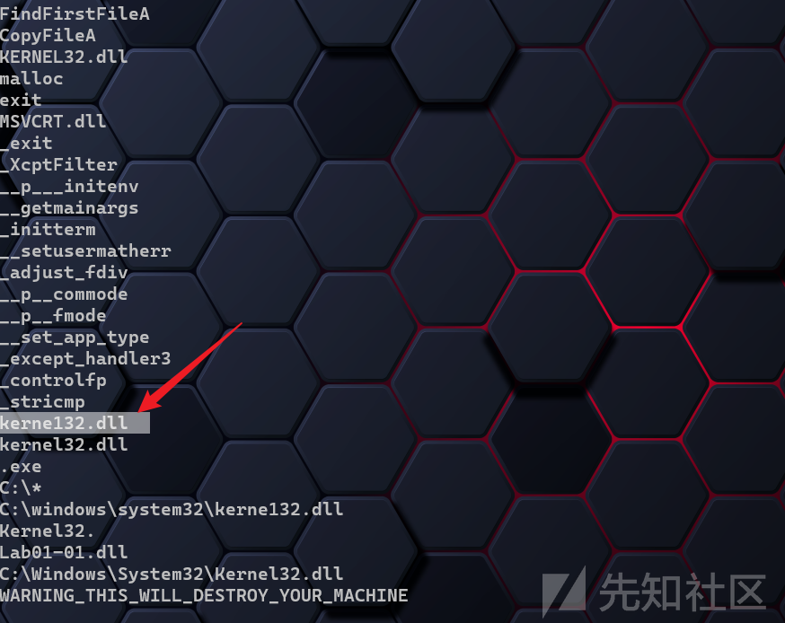](https://xzfile.aliyuncs.com/media/upload/picture/20231105221259-6cbfbfe0-7be5-1.png)

strings查看lab01—01.dll,发现有一个ip地址，"127.26.152.13”并且结合之前dll的导入函数有网络通讯的动态库。故此ip可能是黑客用来控制的主控端ip。可继续通过ida分析  
[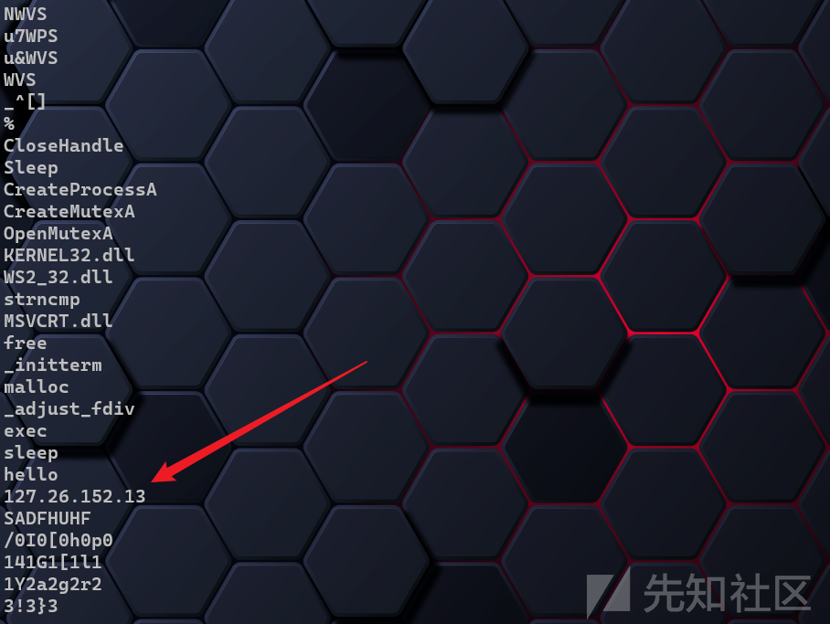](https://xzfile.aliyuncs.com/media/upload/picture/20231105221557-d6c54a86-7be5-1.png)

[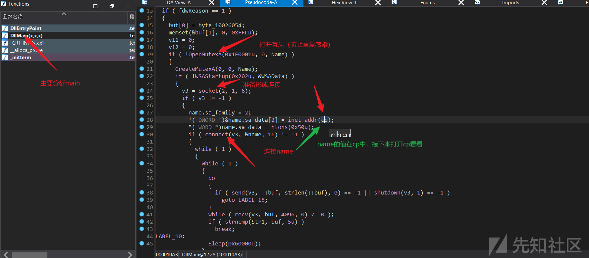](https://xzfile.aliyuncs.com/media/upload/picture/20231105222746-7d0334fc-7be7-1.png)

[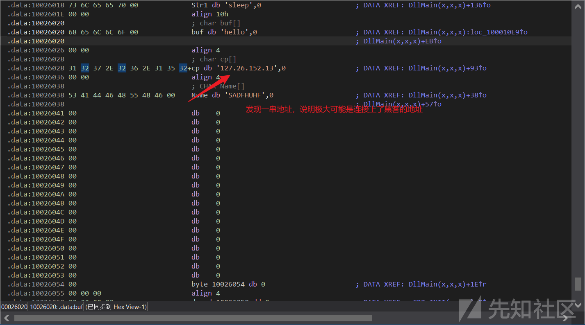](https://xzfile.aliyuncs.com/media/upload/picture/20231105222917-b3c504ac-7be7-1.png)

[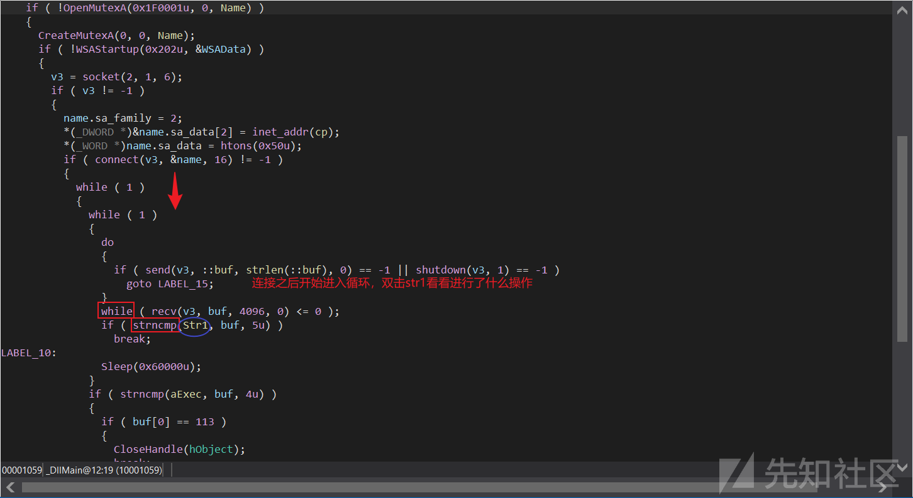](https://xzfile.aliyuncs.com/media/upload/picture/20231105223152-0fc4a654-7be8-1.png)

[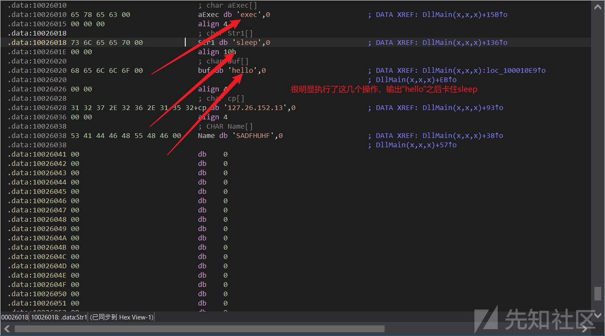](https://xzfile.aliyuncs.com/media/upload/picture/20231105223257-36b2a194-7be8-1.png)

## 在线沙盒

微步云沙箱[https://s.threatbook.com/](https://s.threatbook.com/)

微步云沙箱是一个安全解决方案，它提供完整的多维检测服务，通过模拟文件执行环境来分析和收集文件的静态和动态行为数据，结合微步威胁情报云，分钟级发现未知威胁。它具有以下机制和用途：

1.  提供多维检测：微步云沙箱通过模拟文件执行环境来收集文件的静态和动态行为数据，结合微步威胁情报云，可以快速发现未知威胁。
2.  优化综合判定逻辑：微步云沙箱优化了综合判定逻辑，提高检测判定能力，更好地解决文件安全角度最基本的问题：是黑还是白。
3.  权限体系升级：微步云沙箱支持上传样本时指定“隔离样本”，保护用户及样本隐私。
4.  URL网址分析：微步云沙箱集成了钓鱼模型识别，增强了关联分析能力，解决了URL安全性识别和URL同样本等关联分析问题。  
    总的来说，微步云沙箱的机制是模拟文件执行环境来收集文件的静态和动态行为数据，结合威胁情报云来发现未知威胁。它能够优化综合判定逻辑，保护用户隐私，并具有URL网址分析功能。这些机制和功能使得微步云沙箱在网络安全领域具有重要的作用和用途。

[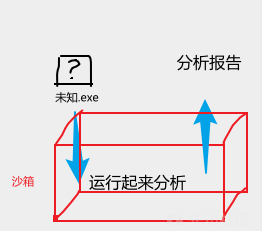](https://xzfile.aliyuncs.com/media/upload/picture/20231105224310-a3c1de3e-7be9-1.png)

[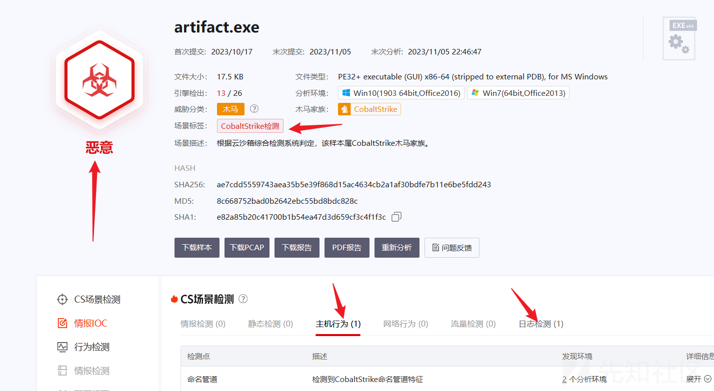](https://xzfile.aliyuncs.com/media/upload/picture/20231105224753-4cd7d816-7bea-1.png)

## 勒索病毒

勒索病毒是一种新型电脑病毒，它会锁定被感染者的计算机系统或文件，并施以敲诈勒索。这种病毒利用各种加密算法对文件进行加密，被感染者一般无法解密，必须拿到解密的私钥才有可能破解。勒索病毒传播途径广泛，包括邮件、程序木马、网页挂马等形式。一旦感染，磁盘上几乎所有格式的文件都会被加密，造成企业、学校和个人用户大量重要文件无法使用甚至外泄，严重影响日常工作和生活。为了指引被感染者缴纳赎金，勒索病毒还会在桌面等明显位置生成勒索提示文件，被感染者需要通过缴纳高额赎金才能获取解密密钥恢复计算机系统和数据文件的正常使用，多数情况即使缴纳了高额的赎金也未必能正常恢复数据。因此，勒索病毒具有数据恢复代价大和数据恢复可能性极低的特点

2016年发现一款名为Locky的勒索软件，主要通过钓鱼邮件传播。钓鱼邮件通常伪造成付款记录或发票等，并携带包含恶意宏的Microsoft Word文档附件。当用户打开文档时，直接下载并运行勒索软件程序，并加密与特定扩展名匹配的所有文件。加密完成后，通过修改桌面壁纸，网页和图片弹窗等方式向用户勒索赎金，并指示用户下载Tor浏览器并访问特定的网站，以获取更多的支付信息。当受感染用户支付赎金后，攻击者使用私钥帮助用户恢复文件。

下面我用虚拟机模拟打开勒索病毒

一、开启Wireshark，观察网络流量状况  
[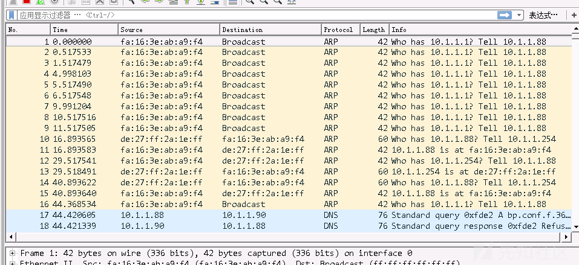](https://xzfile.aliyuncs.com/media/upload/picture/20231105230140-39f00fd2-7bec-1.png)  
二、打开钓鱼邮件，保存并运行附件  
[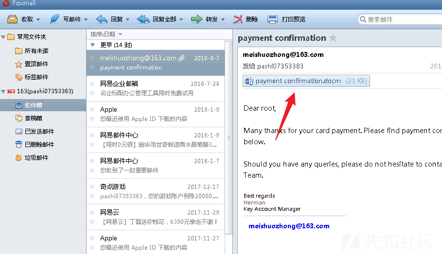](https://xzfile.aliyuncs.com/media/upload/picture/20231105230242-5e79c7b2-7bec-1.png)  
三、观察Wireshark抓包情况，寻找勒索软件C&C服务器地址  
1.打开邮件附件后，可以观察到附件打开后从远端服务器下载勒索软件的过程  
[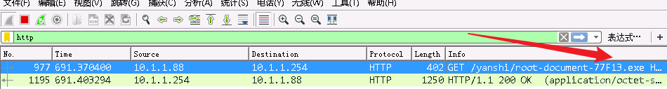](https://xzfile.aliyuncs.com/media/upload/picture/20231105230602-d61fdde2-7bec-1.png)  
四、观察本地文件、桌面的变化及勒索信息的显示  
打开恶意文档后约2-3分钟，可观察到实验机弹出网页和图片查看器，显示locky的勒索信息。要求用户下载Tor浏览器，进入攻击者提供的暗网地址进行下一步支付。  
[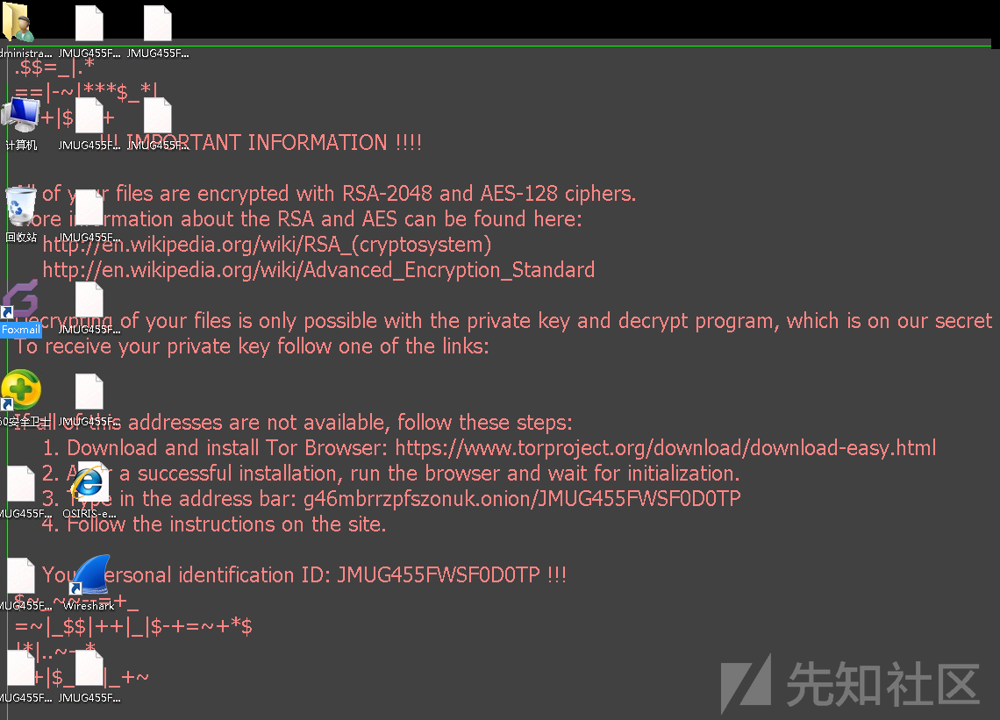](https://xzfile.aliyuncs.com/media/upload/picture/20231105230725-0774de92-7bed-1.png)

tips：一般勒索病毒是几乎无法解开的，因为它们利用的都是一些加密工具进行加密，可以理解为 加密就是一把锁，锁本身是好的，但是黑客将你的电脑锁住却不给你钥匙一样，只要你得不到钥匙是无法解开锁的。

## 总结：

在我们进行恶意程序分析的过程中一定要确保运行的环境的安全性，最好在虚拟环境下运行，避免对物理机造成不可修复的危害，另外对于恶意程序的分析还是需要我们多去了解各种病毒原理，才能及时的分析出其特征和危害。  
\---4个程序样本已打包在附件中（均无危害，仅用于学习分析，但还请置于虚拟机中进行分析）

木马病毒样本.zip (0.164 MB) [下载附件](https://xzfile.aliyuncs.com/upload/affix/20231105232542-951210ba-7bef-1.zip)

打赏
