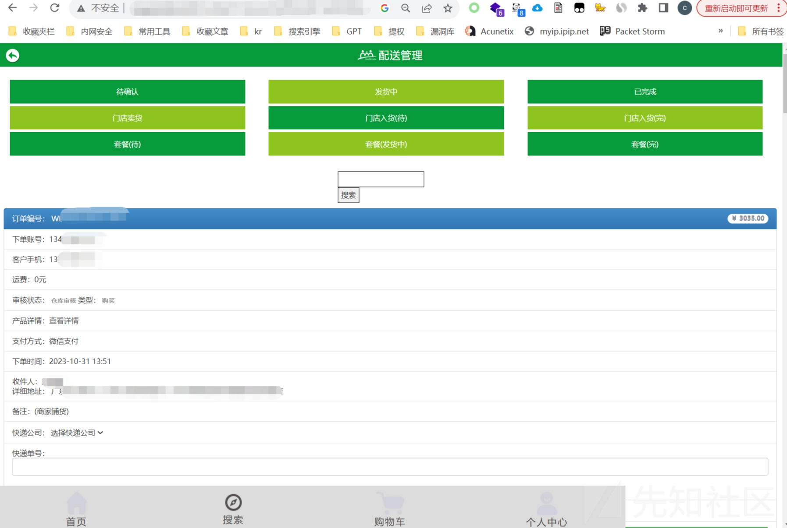
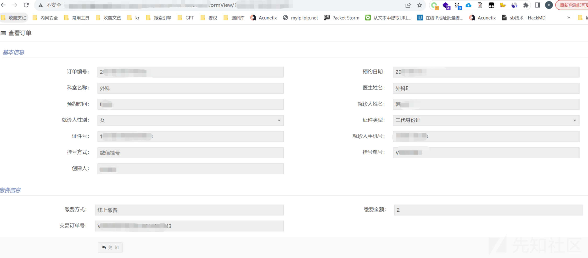
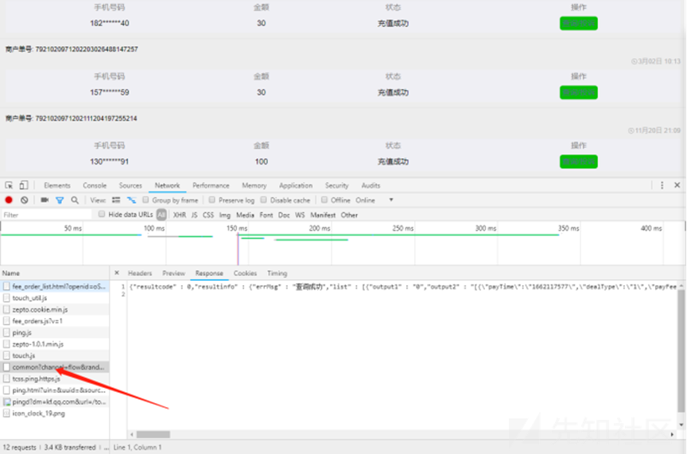
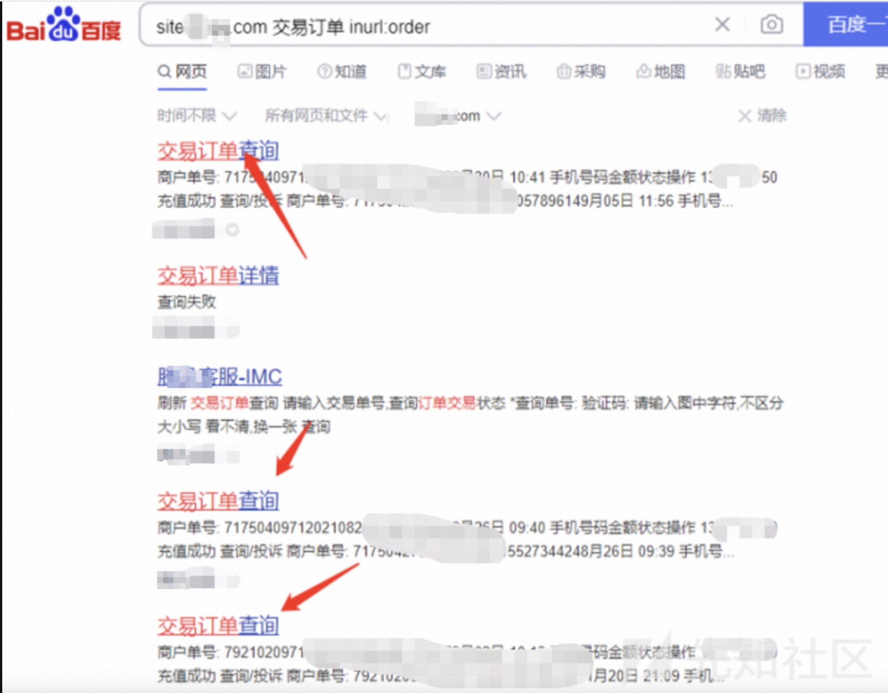

# 我与逻辑漏洞的爱恨情仇 - 先知社区

我与逻辑漏洞的爱恨情仇

- - -

# 前言：

逻辑漏洞自始至终一直是一个永恒的话题，逻辑漏洞是一种设计缺陷，通常表现为设计者或开发者在思考过程中做出的特殊假设存在明显或隐含的错误，也是目前大环境下比例比较高的漏洞，在以前挖逻辑也是id换着测，但随着时间的推移，人员安全意识的增高，也逐渐出现更多新奇的手段，比如敏感字符加密处理，让你抓不到包各种验证等等，可以尝试全局代理抓包，js前端解密等绕过。

# 总结下逻辑漏洞相关的类型

-   撞库，爆破账号/密码
-   登陆处验证码可绕过，登录注册等
-   无限制的短信轰炸/突破限制的短信轰炸
-   任意用户登录/任意用户注册
-   任意用户密码找回
-   支付漏洞/零元购/并发/优惠券/签约/占用商品/溢出等
-   条件竞争/并发突破限制
-   验证码可控/DDos
-   水平越权/垂直越权
-   越权删除/评论/登录/点赞/修改资料
-   非会员使用会员功能
-   前端js某些限制绕过/解密
-   其他突破限制或影响业务的功能

# 正文

相信各位师傅都看过很多逻辑漏洞的文章，本文也不重复叙述那些文章，只讲一些技巧型的思路，批量挖掘逻辑漏洞，希望各位师傅看完能有所收获举一反三，为了不产生不必要麻烦，故很多地方打码处理。

在2019年时，利用搜索引擎发现了大量逻辑漏洞，可以说刷分很强，但是至今在网上也没看到过这种的文章，思路其实很简单，挖洞就是脑子要灵活  
[](https://xzfile.aliyuncs.com/media/upload/picture/20231031230524-eadc33da-77fe-1.png)  
先来一张图冲击一下视野  
[](https://xzfile.aliyuncs.com/media/upload/picture/20231031230642-1966e07e-77ff-1.png)  
Ps：2019年7月的图  
[](https://xzfile.aliyuncs.com/media/upload/picture/20231031230739-3b70ea84-77ff-1.png)  
Ps：现在的图

当时没有刷，相对更喜欢做一些研究然后放起来，然后当兵去了，  
时隔两三年，发现被刷掉了一部分，但还是有思路的，先来看个案例  
[](https://xzfile.aliyuncs.com/media/upload/picture/20231031231049-acf180ec-77ff-1.png)

仅举例一些关键词，自行发挥：

```plain
inurl:m intitle:订单详情 inurl:id=
我的订单 订单详情
inurl:order 订单详情
inurl:wap intitle:订单详情
inurl:m intitle:订单详情
inurl:php intitle:订单详情
title:订单详情 手机号
site:.com title:订单详情
title:订单详情 身份证
```

当然不止这些，你还可以根据规律去构造关键词，用google搜索结果如下（ps:你也可以使用其他搜索引擎）：  
[](https://xzfile.aliyuncs.com/media/upload/picture/20231101183633-86f9dfc6-78a2-1.png)

部分案例：  
[](https://xzfile.aliyuncs.com/media/upload/picture/20231031231605-691e7676-7800-1.png)  
[](https://xzfile.aliyuncs.com/media/upload/picture/20231031232145-338f36b6-7801-1.png)  
[](https://xzfile.aliyuncs.com/media/upload/picture/20231031232540-bfa2abf6-7801-1.png)  
[](https://xzfile.aliyuncs.com/media/upload/picture/20231101183848-d76625e6-78a2-1.png)

其实细心的师傅看到这里就已经可以构造自己的关键词了 比如上面第一张图 orderdetail.ac/?id=1

首先id 是一个参数，orderdetai 也可以当一个参数，可得到关键词 inurl:orderdetail 订单详情

这个思路其实可以一直刷，为什么这么说，因为Google会不断收录网址，即使部分厂商修复了，但互联网一直存在，不断有产商开发web程序，各种web功能上线，再收录！

我们利用url中的参数去构造，当你找到了第一个，你就可以找到N个，多去观察url地址以及网站标题和网站内容特征。

## 扩展思路1

当然，这些根据市场已经不能满足于我们的需求，我们需要寻找相同的系统  
例如：[http://domain/wechat/orderDetail.ac?id=887](http://domain/wechat/orderDetail.ac?id=887)  
可以构造关键词：inurl:orderDetail intitle:订单　　inurl:wechat intitle:订单  
[](https://xzfile.aliyuncs.com/media/upload/picture/20231101184839-376e877a-78a4-1.png)

## 扩展思路2

我们同样可以利用关键词，例如参数中为order 翻译为订单  
我们就可以继续构造相似关键词，例如：inurl:orders intitle:订单

## 扩展思路3

我们还可以利用网站标题继续构造关键词，例如标题：管理系统  
inurl:order intitle:管理系统

## 扩展思路4

发现存在越权漏洞的网址，我们利用fofa等搜索引擎搜索网站特定指纹去寻找相同系统实现批量越权  
然后同理google搜索 inurl:domain intitle:订单详情，思维跳跃一点

# 其他案例

部分垂直越权直接进入管理员账户  
[](https://xzfile.aliyuncs.com/media/upload/picture/20231101143136-4e689160-7880-1.png)  
[](https://xzfile.aliyuncs.com/media/upload/picture/20231101143641-04858d36-7881-1.png)  
[](https://xzfile.aliyuncs.com/media/upload/picture/20231101143745-2a5dbba0-7881-1.png)

# 某SRC经典案例

通过搜索引擎得到漏洞url：  
[https://domain/xxxxxxxx?openid=xxxx&sign=xxxxx](https://domain/xxxxxxxx?openid=xxxx&sign=xxxxx)

访问后可发现手机号关键位置都有\*  
[](https://xzfile.aliyuncs.com/media/upload/picture/20231101144138-b534550e-7881-1.png)

刷新看请求数据包，common接口可以看到原手机号，导致信息泄露

数据包信息如下（下面泄露的手机号均为修改后的手机号）：

```plain
{"resultcode" : 0,"resultinfo" : {"errMsg" : "查询成功","list" : [{"output1" : "0","output2" : "[{\"payTime\":\"1622222277\",\"payFee\":\"3000\",\"paydateformat\":\"08月02日 00:00\",\"itemName\":\"河南中国移动30元-秒充\",\"dealType\":\"1\",\"moblileNum\":\"175*******6\",\"dealId\":\"7921022761202209021872368048\",\"sellerName\":\"\",\"dealState\":\"5\"},{\"payTime\":\"1661919758\",\"payFee\":\"3000\",\"paydateformat\":\"08月02日 00:00\",\"itemName\":\"河南中国移动30元-秒充\",\"dealType\":\"1\",\"moblileNum\":\"157*******1\",\"dealId\":\"7921022741202208310771116347\",\"sellerName\":\"\",\"dealState\":\"5\"},{\"payTime\":\"1653019410\",\"payFee\":\"3000\",\"paydateformat\":\"08月02日 00:00\",\"itemName\":\"河南中国移动30元-秒充\",\"dealType\":\"1\",\"moblileNum\":\"157*******9\",\"dealId\":\"7921020951202205208438499741\",\"sellerName\":\"\",\"dealState\":\"5\"},{\"payTime\":\"1650012506\",\"payFee\":\"5000\",\"paydateformat\":\"08月03日 00:00\",\"itemName\":\"河南中国联通50元-秒充\",\"dealType\":\"1\",\"moblileNum\":\"131*******1\",\"dealId\":\"7921022741202204157844385151\",\"sellerName\":\"\",\"dealState\":\"5\"},{\"payTime\":\"1647566320\",\"payFee\":\"3000\",\"paydateformat\":\"08月03日 00:00\",\"itemName\":\"河南中国移动30元-秒充}
{\"payTime\":\"1650012506\",\"payFee\":\"5000\",\"paydateformat\":\"08月04日 00:00\",\"itemName\":\"河南中国联通50元-秒充\",\"dealType\":\"1\",\"moblileNum\":\"131*******2\",\"dealId\":\"7921022741202204157844385545\",\"sellerName\":\"\",\"dealState\":\"5\"},{\"payTime\":\"1687566320\",\"payFee\":\"3000\",\"paydateformat\":\"08月04日 00:00\",\"itemName\":\"河南中国移动30元-秒充}
{\"payTime\":\"1690012506\",\"payFee\":\"5000\",\"paydateformat\":\"08月05日 00:00\",\"itemName\":\"河南中国联通50元-秒充\",\"dealType\":\"1\",\"moblileNum\":\"131*******1\",\"dealId\":\"7921022741202204157844385987\",\"sellerName\":\"\",\"dealState\":\"5\"},{\"payTime\":\"1727566320\",\"payFee\":\"3000\",\"paydateformat\":\"08月05日 00:00\",\"itemName\":\"河南中国移动30元-秒充}
```

构造相关语法，得到更多的订单：  
[](https://xzfile.aliyuncs.com/media/upload/picture/20231102095204-6c3a9f2e-7922-1.jpg)

# 结束语

如上仅为百度的展示结果，google还有更多结果，希望师傅们看完可以举一反三，吸取经验的技巧，利用此思路挖SRC挣了5k，当然不止于上面的案例，上面仅举例，具体操作还要看实际情况再去利用。
