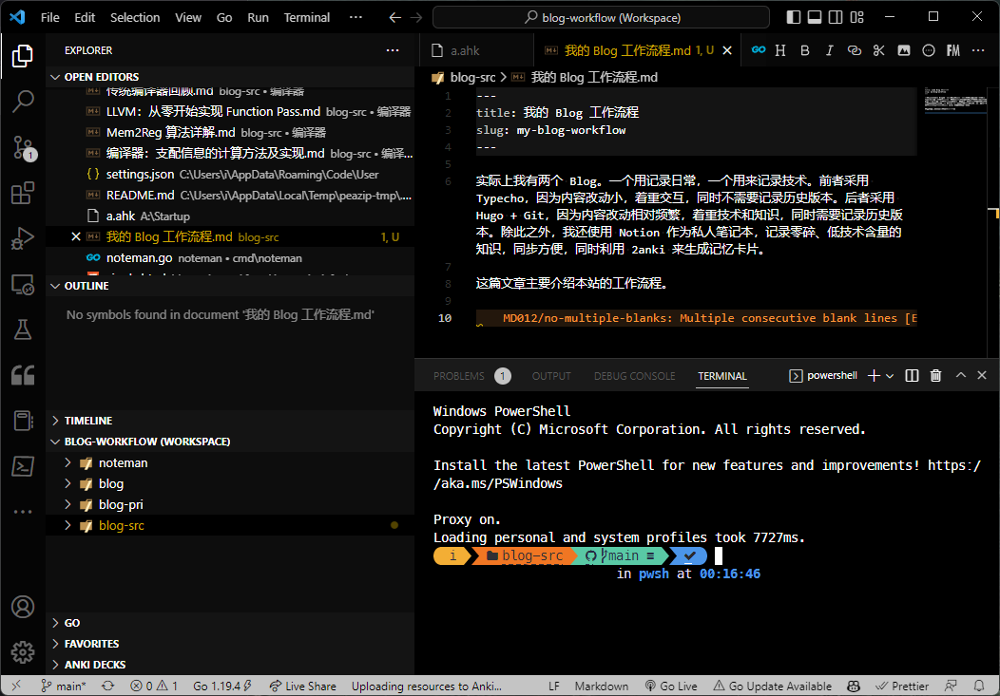
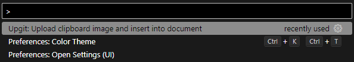
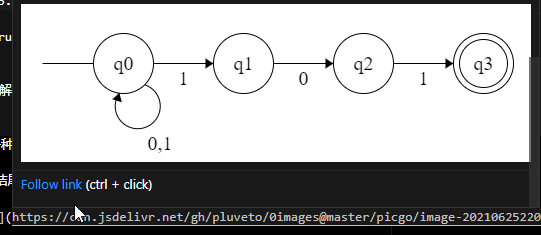

# 我的 Blog 工作流程

Published at 2023/1/26 00:17 , ... Views

## 目录

-   [编辑器](#%E7%BC%96%E8%BE%91%E5%99%A8)
-   [工作空间布局和发布流程](#%E5%B7%A5%E4%BD%9C%E7%A9%BA%E9%97%B4%E5%B8%83%E5%B1%80%E5%92%8C%E5%8F%91%E5%B8%83%E6%B5%81%E7%A8%8B)
    -   [工作空间布局](#%E5%B7%A5%E4%BD%9C%E7%A9%BA%E9%97%B4%E5%B8%83%E5%B1%80)
    -   [从编写到发布](#%E4%BB%8E%E7%BC%96%E5%86%99%E5%88%B0%E5%8F%91%E5%B8%83)
    -   [为什么不适用 Github Pages](#%E4%B8%BA%E4%BB%80%E4%B9%88%E4%B8%8D%E9%80%82%E7%94%A8-github-pages)
-   [解决影响体验的小问题](#%E8%A7%A3%E5%86%B3%E5%BD%B1%E5%93%8D%E4%BD%93%E9%AA%8C%E7%9A%84%E5%B0%8F%E9%97%AE%E9%A2%98)
    -   [图片上传问题](#%E5%9B%BE%E7%89%87%E4%B8%8A%E4%BC%A0%E9%97%AE%E9%A2%98)
    -   [图片预览问题](#%E5%9B%BE%E7%89%87%E9%A2%84%E8%A7%88%E9%97%AE%E9%A2%98)
-   [编辑主题](#%E7%BC%96%E8%BE%91%E4%B8%BB%E9%A2%98)
-   [复刻流程](#%E5%A4%8D%E5%88%BB%E6%B5%81%E7%A8%8B)
-   [总结](#%E6%80%BB%E7%BB%93)

实际上我有两个 Blog。一个用记录日常，一个用来记录技术。前者采用 Typecho，因为内容改动小，着重交互，同时不需要记录历史版本。后者采用 Hugo + Git，因为内容改动相对频繁，着重技术和知识，同时需要记录历史版本。除此之外，我还使用 Notion 作为私人笔记本，记录零碎、低技术含量的知识，同步方便，同时利用 2anki 来生成记忆卡片。

这篇文章主要介绍本站的工作流程。



## 编辑器

我使用过 Typora、VSCode、Obsidian 等等，但最终我选择的是 VSCode。主要原因是：

1.  **效率**。VSCode 可以自定义 Snippets，从而加速输入，尤其是公式的输入（甚至可以和手写相差无几）；同时多光标操作等功能，对于技术文章而言非常重要；以及内嵌的终端。
    
2.  **规范**。我使用 Markdown Lint 来规范 Markdown 语法，可以保证文章的格式统一，同时也有自动格式化功能，批量纠正格式问题。
    
3.  **工作空间**。我可以将多个目录放在同一个工作空间，切换方便。
    
4.  **与 Git 集成**。文章的版本管理，无需多言。
    

当然，缺点也有。我也购买了 Typora 的付费版，在技术无关文章写作时通常会使用。VSCode 主要问题在于：

1.  丑陋的界面。
    
2.  不能预览公式、图片。
    
3.  没有所见即所得的排版。
    
4.  不能粘贴图片、HTML 等。
    

这些问题除了 1，其它的都可以解决。后面会详细介绍。至于文章预览，虽然我安装了有关插件，但其实只有 1% 的情况需要预览。

## 工作空间布局和发布流程

### 工作空间布局

从上面的截图可以看到，工作空间是 VSCode 内置的功能。我的场景下，包括如下四个部分：

1.  `noteman`: 自己写的笔记管理程序。提供构建、同步、预览、发布等功能。
    
2.  `blog`: 博客源码目录。包括 Hugo 源码、主题、插件等。
    
3.  `blog-pri`: 私有笔记目录，这个是排除在工作流外的，本文不会涉及。
    
4.  `blog-src`: 博客文章源码目录。
    

### 从编写到发布

简单而言的流程是：

1.  执行 `code blog-src/标题.md` 命令，打开 VSCode Tab，开始写作。
    
2.  执行 `noteman sync` 命令，将文章同步到 `blog/content` 目录。
    
3.  执行 `noteman build` 命令，将文章编译到 `blog/public` 目录。
    
4.  执行 `noteman publish` 命令，将文章发布到网上。
    
5.  执行 `git` 相关命令，将文章同步到 GitHub 个人仓库。
    

具体而言则是

当需要写文章时，我会在 `blog-src` 目录下新建一个 Markdown 文件。一般来说，我不需要关注元数据等（当然，非要写也可以，同样是兼容的，很多时候是需要的，比如打标签、标记 draft），直接开写就行。比如下面这个例子：

```markdown
1# 一个标题
2一些罗里吧嗦的话。
3
4## 一个二级标题
5一些罗里吧嗦的话。
```

然后执行 `noteman sync` 命令。这个命令会提取 Markdown 源文件的信息，生成 slug、title、date 等元数据，写回到源文件，并同步到 Hugo 的 content 目录下。写回后的源文件大概是这样：

```markdown
 1---
 2title: 一个标题
 3slug: a-title
 4date: "2021-06-25T22:28:55.819842+08:00"
 5---
 6# 一个标题
 7一些罗里吧嗦的话。
 8
 9## 一个二级标题
10一些罗里吧嗦的话。
```

而传送到 Hugo 的 content 目录下的文件则是这样：

```markdown
1---
2title: 一个标题
3slug: a-title
4date: "2021-06-25T22:28:55.819842+08:00"
5---
6一些罗里吧嗦的话。
7
8## 一个二级标题
9一些罗里吧嗦的话。
```

这里会发生一些神奇的事情，比如一级标题消失了。我是故意这么生成的。不然最后博客里面会看到两个一模一样的标题。

> 之所以不直接用 Hugo，是因为：
> 
> 1.  Hugo 不会帮我生成元数据。尤其是 slug，如果我的标题是中文，那么 Hugo 生成的 slug 也是中文。但使用 Noteman，可以帮我自动翻译成英文 Slug。
>     
> 2.  我很懒，我希望打开一个文件就能写，不需要关心 Hugo 的目录结构等。其实源文件我甚至可以不写标题，这样会自动从文件名提取标题。
>     

然后我会使用 `noteman build` 命令来构建，构建完毕后可以使用 `noteman preview` 来本地预览整个博客。

没问题的话，就可以执行 `noteman publish` 来发布了。这个命令会把 Hugo 生成的静态文件发布到我的网站上。网站上同样跑了一个程序，监听在 1818 端口，使用一个非常长的令牌作为密钥。Noteman 会将网站打包成一个 `zip` 文件，上传到 1818 端口，服务器上的程序会自动解压，检查，然后替换掉原来的文件。从而完成一次部署。

### 为什么不适用 Github Pages

诸如 Github Pages、Vercel 等静态网站托管服务，都是很好的选择。不过我还是更喜欢使用自己的程序完成部署。主要问题在于时效性。比如 Github Pages 的部署是异步的，而且部署时间不可控，有时候等了几个小时还在看到旧的内容。使用我的流程的话，在 5 秒以内，可以在浏览器看到最新的内容。

## 解决影响体验的小问题

### 图片上传问题

在以前使用 Typora 的时候，直接粘贴，然后选中图片右键上传，即可调用程序将图片上传。

对于 VSCode，我开发了一个 Upgit 插件，当我需要上传剪贴板的图片时，只需要按 F1，执行命令上传即可。图片的 Markdown 会直接插入到光标处。相比于 Typora，这个方式更快。



此时可以顺便一提，截图我用的是 Snipaste，绑定到 Ctrl F12 作为全局截图快捷键。

另外还有一种上传方式，适用于批量上传。我开发的 Upgit 工具支持复制多个文件到剪贴板，然后执行 `upgit :clipboard-files` 即可上传。

### 图片预览问题

我使用的是一个叫做 Image Preview 的插件，只要将鼠标悬停到图片的链接上，就可以预览图片。



## 编辑主题

作为一个开发者，很多时候想要顺手修一下主题 Bug，或者加个新功能。这时候由于有 workspace，可以直接修改，实时预览，也很方便。

修改完成后，利用 Workspace 的多 Repo 管理，可以直接同步到 Github 上。

## 复刻流程

我追求一切从简，但前提是高效。目前我在公司电脑（Mac OS）和家里电脑（Manjaro + Windows）上都部署了这套流程，可以在任何一台电脑上写博客。部署也很容易：

1.  直接 `clone` 四个仓库
    
2.  安装 Hugo、Noteman、Upgit。
    
3.  安装 VSCode 插件。通常直接同步就行。
    
4.  配置 Noteman 和 Upgit。由于基本可以重用，我把配置放到了 Private Gist 里，直接 `curl` 下来即可。
    

基本上十分钟之内就可以在一台新机器上部署好。公司写到一半，回家继续写，也不用担心环境问题。或者公司和家里各开新篇，利用 Git 的分支管理，也可以很方便地合并。

另外我的笔记源文件和 Noteman 都不强依赖于 Hugo，所以哪天又想折腾了，迁移起来也没有成本——改一下 Noteman 的配置即可。

## 总结

总的来说，经过差不多四五年的折腾，现在为止这套流程已经平稳运行了两年，工具也迭代完善，已经达到比较成熟的地步。我是一个写笔记比较多的人，笔记成熟之后，就会选取有意思的部分整理发布。

这套流程让我可以在任何一台电脑快速部署起熟悉的环境，而且不用担心成本问题，也不用担心数据丢失。而且写博客的过程也很顺手，哪怕是有很多复杂公式、图片、代码的情形。

- - -

This work is licensed under [CC BY 4.0](http://creativecommons.org/licenses/by/4.0/?ref=chooser-v1) except those created with the assistance of AI.

  

表情图片预览

发送评论

0 条评论

Powered By [Artalk](https://artalk.js.org/ "Artalk v2.4.4")

Artalk ErrorTypeError: NetworkError when attempting to fetch resource.，无法获取评论列表数据  
点击重新获取
