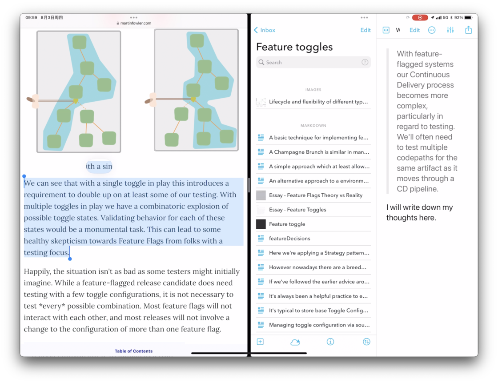
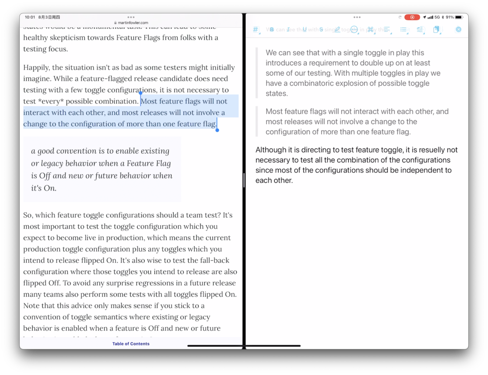
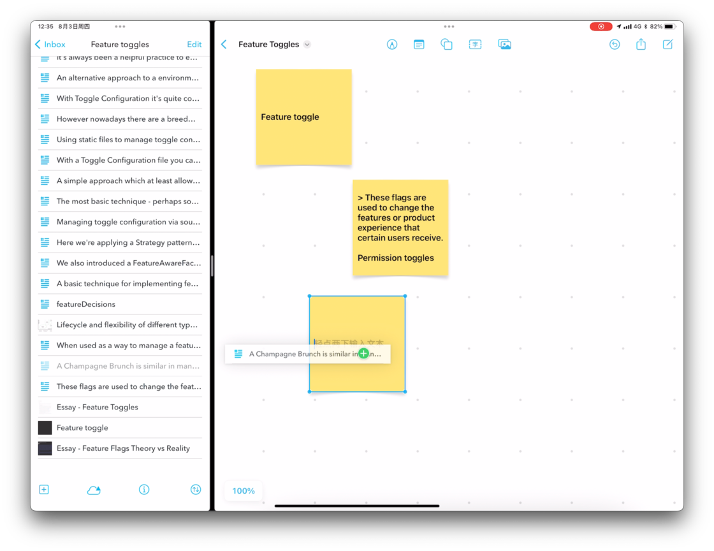
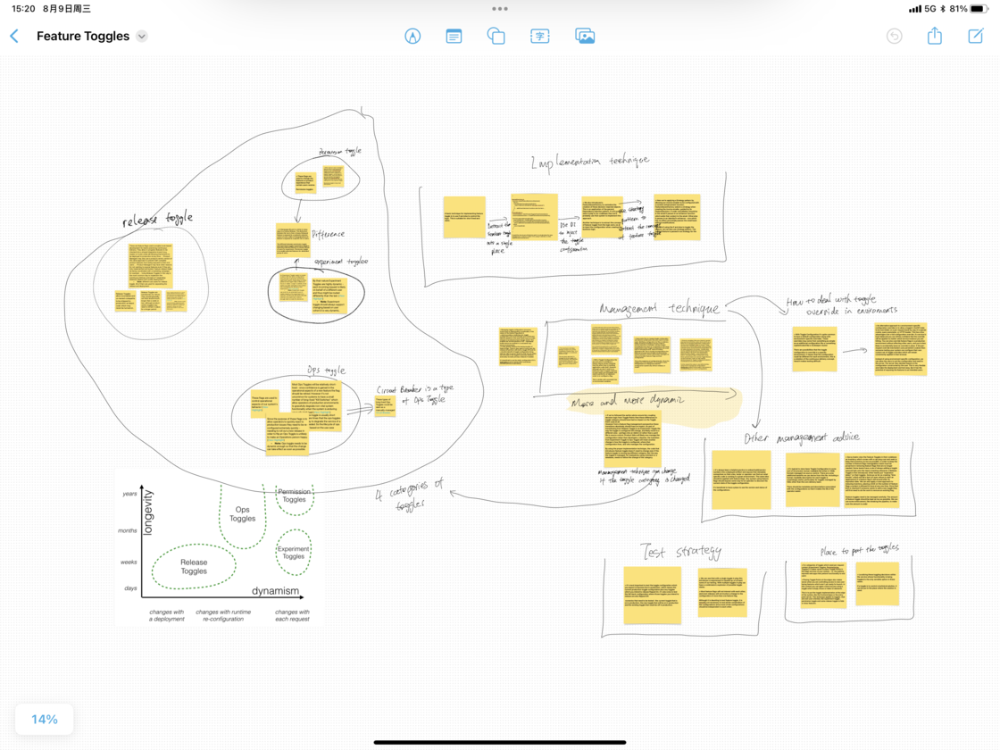
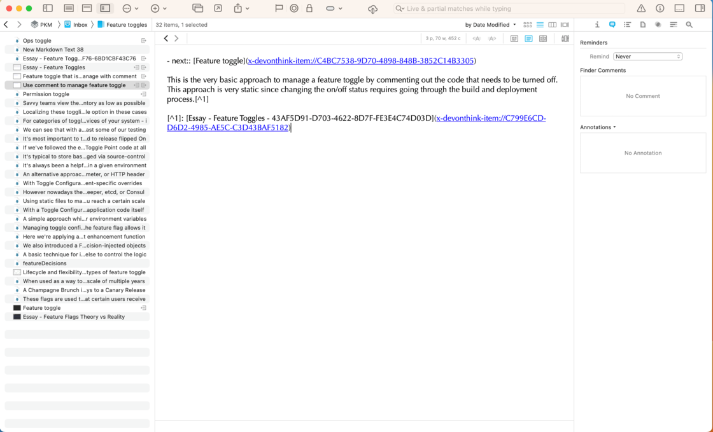

# 我的阅读方法 - 少数派

## 写在前面的话

作为一名知识工作者的基本特征就是能够利用知识和信息来创造价值，但这些能够帮助他创造价值的知识不是他与生俱来的，他需要在工作的过程中持续的吸收外部的信息和知识，将这些知识转换为他自身的一部分，然后才能利用这些知识去创造价值。因此，高效的吸收新的信息和知识是一个知识工作者的核心竞争力。

但相信读者对于高效学习的难度都深有体会。我们经常听到类似这样的论述：这次培训的内容不错，但我不知道日常工作要怎么用；这本书我之前读过，但我现在已经不记得它在说什么了；这个函数的用法我每次到都要去Google搜一下，我永远记不住。也就是说，要真正把新的知识内化成我们的一部分并且在一个新的时间和空间中自如的运用这些知识是非常有难度的一件事情。

知识的载体有很多种（视频，音频或者文本等），而不同的载体又需要不同的工具和方法来与之进行互动。因此这篇文章会从最常见的数字媒体上的文本为对象，来介绍我是如何学习新知识的。这篇文章中提到的工具和App有以下几个：

-   iPad + Mac
-   Safari
-   Freeform
-   DEVONThink

尽管我本人使用这些App来进行阅读，但文章中介绍的方法只使用了这些App的基础功能，读者可以根据自己的实际情况选择适合自己的App。下面就开始本文的主题。

## 阅读的三个步骤

我的阅读方法可以分为以下三个步骤：

-   标记并摘录重要内容
-   针对摘录的内容建立思维导图
-   将思维导图转换为笔记

下面针对每一个步骤进行详细的介绍。

### 标记并摘录重要内容

如上图所示，左侧是Safari，其中已经打开了我想要阅读的文本，这里使用的是来自Martin Fowler的一篇介绍Feature Toggle的文章（读者并不需要对这个概念有所了解，接下来介绍的方法并不需要了解这个概念本身）；右侧是DEVONThink，可以让我记录在阅读过程中想要摘录的文本或者图片。

在阅读的过程中，如果在左侧的文本中遇到了觉得重要的内容，那么我会通过复制黏贴的方式将信息记录到DEVONThink之中。在复制黏贴原本的信息之后，我会用自己的语言来重新描述这段信息的内容或者阐述一下自己对于这段信息的理解。相信很多读者在阅读的时候都有标记重要内容的习惯，但除了标记之外，这里还要求读者用自己的话对标记的内容进行论述。这么做有什么样的好处呢？

首先它可以帮助我们专注于正在阅读的内容。也就是说，我们不是机械的接受信息，我们采取的是一种主动的姿态。当我们发现标记了一段内容却没办法用自己的话进行复述的时候，大概率是我们已经走神了。

其次它可以帮助我们抓住一闪而过的灵感。一段内容之所以重要到需要进行标记，很有可能是因为它激发了我们全新的看待世界的方式或者对于过往某一件事情新的看法。如果我们没有一种熟练的记录方法，那么我们很有可能是没有办法及时的抓住这些想法的。因此，这里的方法可以帮助我们建立一种稳定的在阅读过程中记录灵感的方式。我们不是在灵感来临的时候再匆忙寻找记录它的方式，而是提前准备好了方法。当灵感出现的时候，我们只要遵循我们熟练的方式进行记录就可以了。

最后它可以帮助我们对于正在阅读的内容有更充分的理解。在面对面沟通的过程中，有一种提高沟通效率的技巧是在对方完成论述之后用自己的话对对方的论述进行总结。这种技巧一方面可以和对方确认自己对于对方发言的理解是正确的，另一方面也可以帮助自己真正理解对方说的话。阅读也是一种沟通，只是这种沟通是单向的，是从作者向读者单方面的传递。在这个场景里，我们没有办法和作者确认我们对于文本的理解是否正确，但用自己的话对作者的文字进行复述，依然可以帮助我们更充分的理解文本。

### 针对摘录的内容建立思维导图

在阅读的过程中，大部分时候我都只会执行第一个步骤持续的摘录重要的内容。直到阅读完成了之后，我才会执行第二个步骤，即针对摘录的内容建立思维导图。

我会将所有摘录的内容都转移到Freeform中来建立思维导图，下图就是整理后的结果。

这样做主要有两个好处。

首先它可以帮助我将新知识和已有的知识进行整合。以上图为例，我会根据我对摘录内容的理解对知识点进行分类。这些分类和文章本身的分类以及组织结构是不同的。换句话说，我并不是根据文章**全部的内容**以及文章**本身的目录**来构建思维导图；而是根据对于我来说**重要的内容**以及**我对于知识的理解**来构建思维导图。因此，在这里我带入了我自己对于feature toggle这个概念的理解，相当于我把新知识和我已经拥有的看待世界的方式进行了整合。

其次它可以帮助我在知识与知识之间构建关联关系。还是以上图为例，我会在在不同的知识点之间进行连线和说明。这其实是在不同的知识点之间建立了关联关系。这些关联关系可以帮助我把所有的知识串接起来，形成属于自己的知识体系。

### 将思维导图转换为笔记

到此为止，我已经从文本中摘录了重要内容并且通过思维导图对摘录的知识点有了比较好的理解，接下来就可以开始第三个步骤，即将思维导图中的知识点转换成笔记。

我们大脑的长时记忆是有限的，虽然通过练习可以增加它的容量，但其终究是有限度的，这时候就需要外部的工具来帮助我们记忆。在我们对一则知识有一些印象但是又不太确定细节的时候，我们可以通过外部的工具快速的回忆起这则知识的具体内容。以上面的截图为例，这则笔记是用Markdown写成的。Markdown最大的优势就是它是纯粹的文本，在任意类型的设备上都可以打开阅读，并且大小也很小，可以很方便的在不同的设备之间传输和同步，并且就现阶段来说，对搜索支持最好的还是纯文本。满足这三个条件，这则笔记就可以成为帮助我们记忆的很好的外部工具。这就是我们需要思维导图转换成笔记的原因。

以上就是我所使用的阅读方法。
