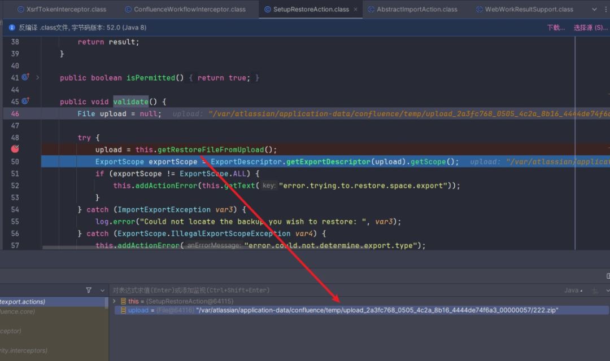

# 技术说｜Confluence远程代码执行漏洞(setup-restore)分析 CVE-2023-22518

原创 A.R.

[↓↓↓](javascript:)  
  
长亭安全观察  
  
[↑↑↑](javascript:)

*2023-11-21 11:00* *发表于北京*

收录于合集 #长亭技术说 1个

  

**目录**

  

**一、环境搭建  
**

**二、漏洞分析**

**1\. Confluence鉴权逻辑**

**2\. 请求头X-Atlassian-Token**

**3\. holderAware.validate验证**

**4\. SetupRestoreAction处理逻辑**

**三、漏洞利用**

  

**引言**

  

未经身份验证的远程攻击者通过构造恶意请求可在一定程度绕过目标系统身份验证，并通过后台接口获得接管服务器的权限，最终可实现远程代码执行，由于攻击者无法泄露任何系统数据，因此不会影响机密性；但该漏洞利用会导致Confluence数据清空，对数据完整性产生不可逆的影响。

  

**受影响版本**

-   Atlassianconfluence<7.19.16
    
-   Atlassianconfluence<8.3.4
    
-   Atlassianconfluence<8.4.4
    
-   Atlassianconfluence<8.5.3
    
-   Atlassianconfluence<8.6.1
    

  

**不受影响版本**

-   Atlassianconfluence>=7.19.16
    
-   Atlassianconfluence>=<8.3.4
    
-   Atlassianconfluence>=8.4.4
    
-   Atlassianconfluence>=8.5.3
    
-   Atlassianconfluence>=8.6.1
    

  

**一、环境搭建**

  

这里使用docker搭建，环境变量添加调试idea调试端口，这里的版本是7.13.6。

  

安装时需要去官网生成license。

  

**二、漏洞分析**

  

后台管理中存在一个备份与恢复功能。

  

  

允许上传文件，并从文件中导入Confluence数据。  

  

对应的路由是/admin/restore.action，需要进行鉴权。

  

本次漏洞的入口就是namespace为json的一系列接口，可以绕过鉴权，同样可以进入restore.action，这里给出poc。

  

  

  

  

****1\. Confluence鉴权逻辑****

  

  

  

这是Struts框架的处理流程，confluence的鉴权主要是用两个Interceptor实现的  

WebSudoInterceptor、PermissionCheckInterceptor。

首先触发的是PermissionCheckInterceptor。

  

  

通过调用confluenceAction.isPermitted方法来进行鉴权，这里我们传入的是SetupRestoreAction。

  

  

此处重写了isPermitted方法，返回始终为true。  

  

对于没有重写这个方法的action，会进入其父类

com.atlassian.confluence.core.ConfluenceActionSupport#isPermitted。

  

  

这里可以通过设置skipAccessCheck=true来绕过鉴权。

  

后续再继续跟进PermissionCheckInterceptor。

  

  

在WebSudoInterceptor#intercept中会对请求的uri，类名，方法名进行校验，matches方法的实现逻辑如下，如果请求的namespace为admin则需要二次认证。

  

  

原本初始化的恢复安装请求的uri是/setup/setup-restore.action，这个uri会在 com.atlassian.confluence.setup.actions.SetupCheckInterceptor#intercept被拦住，可以参考CVE- 2023-22515。  

  

我们如果在后台中恢复安装则会请求/admin/restore.action，但admin这个namespace明显会在WebSudoInterceptor#intercept被拦截。

  

那我们利用json这个namespace是如何进行绕过的呢？可以在xwork.xml中找到答案。

  

  

json这个namespace是继承admin的，而admin又是继承setup的，所以使用json这个命名空间既可以访问到setup-restore.action，又可以绕过WebSudoInterceptor中的二次认证，这也是本次漏洞的核心所在。  

  

  

****2\. 请求头X-Atlassian-Token****

  

  

设置X-Atlassian-Token: no-check，关键逻辑位于  

com.atlassian.xwork.interceptors.XsrfTokenInterceptor#isOverrideHeaderPresent。

  

在一堆Interceptor中，走到

com.atlassian.confluence.xwork.ConfluenceXsrfTokenInterceptor#intercept时，会继续调用他的父类com.atlassian.xwork.interceptors.XsrfTokenInterceptor#intercept。

  

  

这里会调用methodRequiresProtection来得到isProtected，我们获取到的validToken为空，如果isProtected为True，则会返回input。

  

只有isProtected取到false，才能继续调用invoke，走入下一个intercept，最终走进com.atlassian.confluence.importexport.actions.SetupRestoreAction#execute。

  

  

这里继续跟进isOverrideHeaderPresent。

  

  

只要设置请求头X-Atlassian-Token: no-check即可。

  

  

  

  

****3\. holderAware.validate验证****

  

  

在进入SetupRestoreAction#execute之前，会有一个Interceptor调用对应Action类的validate方法，以验证请求是否正常。

  

对应的位置com.atlassian.confluence.core.ConfluenceWorkflowInterceptor#intercept

之后会进入com.atlassian.confluence.importexport.actions.SetupRestoreAction#validate方法。

  

  

这里会先把表单中的文件存到一个临时目录下，接着会判断他的内容是否是一个备份文件，只有检查都通过才会最后进入execute。

  

  

可以看一下上传临时文件的代码。

  

  

FileUploadUtils.getSingleUploadedFile会获取文件名，并生成一个随机的目录名，此时文件还没上传。

  

  

然后进入moveUploadedFile开始写文件。

  

  

这里上传的路径是用File构造的，无法进行目录穿越

下一步的ExportDescriptor.getExportDescriptor(upload).getScope()的操作应该是用来解压压缩包，并获取某些数据。

  

  

继续跟进。

  

  

继续跟进readExportDescriptor。

  

  

这里unzipper.unzipFileInArchive("exportDescriptor.properties")只会解压出来

exportDescriptor.properties这个文件，最后再删除临时目录。

  

  

在解压的时候，这里会判断解压的目录是不是原先规定目录的子集，其实在这里无法进行目录穿越。

  

  

  

****4\. SetupRestoreAction处理逻辑****

  

  

这里只接受POST请求，RequireSecurityToken为True。

  

  

先调用父类的execute，如果返回的值为True，就会进入恢复安装步骤，拿到管理员权限。  

  

我们先跟进super.execute，位于

com.atlassian.confluence.importexport.actions.RestoreAction#execute。

  

  

里面继续调用super.execute，再进入

com.atlassian.confluence.importexport.actions.AbstractImportAction#execute。

  

  

如果允许导入，就开始执行doRestore，跟进看看。

  

  

我们传参的时候需要传入Synchronous=true，否则他会放入队列中，返回一个taskId，之后再异步执行。

  

  

如果异步执行，返回包会进行302跳转。

  

  

在第一个Interceptor就会被拦

com.atlassian.confluence.setup.actions.SetupCheckInterceptor#intercept。

  

  

参考CVE-2023-22515，最新版本中无法设置这几个和安装有关的属性，无法绕过。

  

**三、漏洞利用**

  

  

上传备份文件后，覆盖目标数据，从而拿到后台权限。  

  

后续可以在管理应用的地方上传恶意jar包插件来进行rce。

  

可以参考：

https://github.com/youcannotseemeagain/CVE-2023-22515\_RCE

  

