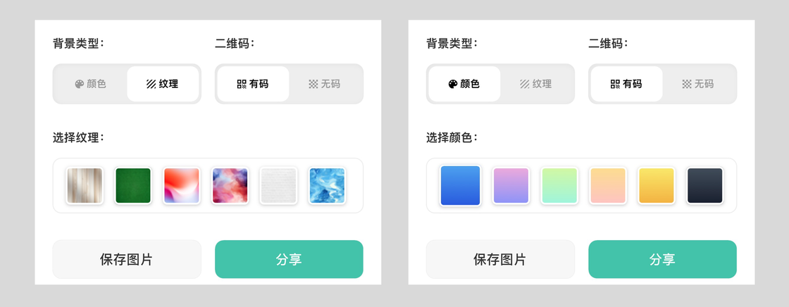

# 把图文生成漂亮的分享卡片，哪个软件强？ - 少数派

我和身边的一些朋友，总需要在不同平台分享图像格式的卡片，比如在微信群分享一张知识卡，或者把文字变成图片发到小红书等平台。

虽说用 Powerpoint、Photoshop 等工具都能干这个活儿，但还是希望能懒一点，最好能在笔记软件里输入文字、插入图像，就直接生成一张分享卡，省去纠结样式、排版和美化的时间。

于是，我把市面上能找到的工具都找了个遍，一共找到 23 个软件，逐个测试了一下笔记支持的格式、生成图片的样式等，放到一起做个大对比。如果你也有类似的需求，可以直接看这篇文章，不需要自己一个个去试了。

需要说明一下，这次测试的软件，选择的范围仅限于：**能够自己通过输入图文，来控制卡片内容的工具。**

以下两种软件不在测试范围内：

-   只能摘抄划线文字的软件（比如微信读书）。
-   不能输入内容，只能美化已有图片的软件（比如 VOUN）。

具体来说，我会手动输入下面的内容用来测试：

-   有一个笔记大标题，两个笔记内的小标题，用于测试卡片分享是否支持不同标题格式。
-   有两段正文，分别带有中英文混排、局部高亮格式、局部加粗格式，用于测试软件是否支持这些格式的显示。
-   有三张图片，分别是开头一张（用于测试封面图的效果）、中部一张（用于测试是否支持图文混排）、底部一张（背景透明，测试是否支持自定义的二维码）。

也就是说，上面图中的一个大标题、两个小标题、两张图片、两段文字、一张模拟二维码的图片，都是我手动输入，下文中出现的一切额外元素，都是各种 app 自动生成的。

当然要强调一下：**是否支持标题、是否支持图文混排，并不代表软件功能的优劣，对于不需要插入图片的纯文字分享者，图文混排就是无用的功能。**

此外，所有 app 能设置用户名的情况下，统一设置成「孙彬的小罐笔记」，用于测试自动生成作者的效果。

那么我们开测，以下各种软件生成的卡片样式，全部是截止这篇文章发布的样子，后续都可能会有功能更新。

## flomo

flomo 是可以多端同步使用的笔记软件，在这里我测试的是 Mac 端和 iOS 端，生成的图片有所区别。

flomo 的单条笔记没有大标题，笔记内也没有小标题，不过可以通过加粗的格式来表示小标题。正文部分局部的高亮和加粗都可以显示出来。

flomo 不支持图文混排，无论上传多少张图片，都是把图片依次显示在所有文字的最后。

导出的样子，首先看 Mac 端，顶部是固定格式的日期，可调的选项有两个：

-   是否显示统计信息，显示的话，卡片底部会增加一个区域，显示用户名、已注册时间、所有笔记的数量，以及一张热力图。
-   显示亮色或者深色，是跟着软件 UI 一起改变的。

下面左图是亮色带统计信息的图，右图是深色不带统计信息的图。

接下来是 iOS 手机端，一共有 7 个主题，其中 4 个是免费主题，3 个是付费版专享的主题。生成图片的颜色只和主题有关，与当前软件是否开启了深色模式无关。同样笔记内的图片不能混排，只能放到文字的最后。

先看 4 个免费主题，打开了「显示个人相关信息」的开关，会在不同位置显示用户名、笔记数量、加入时长等信息。

关闭「显示个人相关信息」的开关，则是只在顶部额外生成一行日期。

接下来是三个付费专业版主题，打开「显示个人相关信息」开关的样子。

## 语雀小记

语雀的「小记」功能可以快速记录笔记，也可以生成分享图，输入内容可以在电脑或手机上进行且保持同步，不过生成图片的操作只能在手机端进行。

语雀的图文支持混排和大标题，笔记内支持多级标题，高亮、加粗等操作没问题，对排版的支持还是比较全面的。生成图片时在固定的内容之外，会自动生成日期和用户名。

生成图片一共有 11 个主题可选，其中只有第一个默认主题受到 app 是否开启了深色模式的影响，下面的第一张和第二张分别是浅色和深色模式生成的图片。

其余的 8 个主题，效果如下面两张图，差异化还是比较大的，不止是换个背景颜色，不同主题下的文字颜色、生成的日期样式也是不同的。另外需要注意，只有上图中前两个默认主题支持显示局部高亮，其他主题保留了加粗，但高亮格式都消失了。

值得注意的是，语雀在生成用户名的时候，会在前面加上一个英文手写体的「from」，有种落款的感觉，还不错。

## 即刻

经常看到互联网圈一些大佬用即刻平台发动态，然后生成图片转发到其他平台，鲜黄色的卡片背景算是即刻的一大特色了。

图片会自动生成用户头像、用户名、即刻 logo 和日期，同时会强制生成一张二维码，指向笔记的地址，如果不想要只能后期裁切掉。

注意：二维码我后期用表情做的遮挡，后续同样处理。

## 少数派

在少数派平台发布的内容，也可以在手机 app 操作生成分享图，可以选择生成「分享海报」或者「长截图」，二者的总体样式是一致的，区别在于，如果文章比较长，那么「分享海报」只会显示前边的一部分，而「长截图」则会完整显示文章。

少数派的图片是截止目前第一个能显示主标题的，也就是文章本身的标题，文章内也支持显示小标题格式。加粗可以显示，不支持局部高亮（我尝试用代码格式来高亮`「如果有人动辄...谈论的东西」`这句话，但最终导出的图片中未显示出高亮效果）。

除了固定内容，卡片还会额外强制生成：少数派 logo 和水印，作者的头像信息和签名，热门评论和文章二维码。

需要注意的是，少数派支持单独设置文章的封面图，但最终生成的卡片里不会显示封面图，而只会显示文章内部的图片，所以如果需要的话，需要自己把头图插入到文章最前面。下面的左图是把图片放到封面图（未显示）的效果，右图是把封面图放到了正文里的效果。

## 墨问便签

墨问便签目前没有 app，测试的是微信小程序，笔记支持图文混排，小标题可以通过文字加粗来表达，无高亮格式。

导出设置比较简单，一共有四种背景颜色、还有黑体和宋体两种字体可选。

如果懒得折腾 app，这个小程序倒是不错的选择。用户头像、用户名和日期强制在上方生成，原文地址的小程序码强制在下方生成。下面左边两张图是黑体字风格，右边两张是宋体字风格。

## mysc

这个笔记 app 相对比较小众，是个 iOS 独占的软件，UI 风格和生成的图片风格都比较独特。

笔记支持上传图片，但不支持图文混排，所有图片会以小图的形式放在文本之后。同时，纯文本也不支持标题、高亮、加粗等格式。

生成的卡片是白色的底，上面是一张带圆角的灰棕色小卡片，里面显示笔记的内容。下方则会生成用户名、日期和软件 logo，整体审美是比较在线的。

## Monolog

这个软件是 iOS 和 Mac 独占的卡片笔记工具，Mac 端和手机端都能生成分享图，格式也基本一致。

软件支持笔记大标题，笔记内不支持小标题，但可以加粗显示文字，也可以显示文本高亮，图文支持混排。目前没有深色模式，只能生成白底图片，整体风格比较理科范儿。

生成的图片，上方是头像、用户名、日期，最下显示一行简单的「Monolog」字样。可选的样式只有字体。下图中从左到右分别是黑体、圆体和霞鹜文楷字体的效果。

## DoMemo

这又是一款 iOS 独占的卡片笔记软件，在 Mac 上也可以安装运行。它支持图文混排，支持笔记大标题，但不支持笔记内的小标题或加粗。

生成卡片的格式比较固定，上方会自动生成一个引号，下方会生成笔记的标题、二维码，最底部是用户名。

比较特别的是，签名信息和二维码内容可以在 app 内自定义设置，如果这样做的话，那么这张卡片上所有关于 DoMemo 软件的信息就都被抹去了。

其他软件都是在生成的时候选择卡片的样式模板，但 DoMemo 不能这么做，相反，它是在软件内定制各种笔记的样式，比如 UI 的深浅、卡片的字体、文字的大小间距，导出时就按照笔记的样式来。

下面两张图，左边是浅色画面、默认字体、未设置底部签名的效果，右边是深色画面、宋体字、设置了签名的效果。

## CatNote

这是个独立开发者的作品，算是比较新的卡片笔记工具。格式方面，支持文本加粗和高亮，但不支持笔记标题和小标题，图文支持混排。

在导出分享图这一块，目前还做的比较简单，尚未支持深色模式，也不支持多种主题和字体，「是否显示底部信息」是目前唯一的可选项，相面两张图分别是关闭和打开这个选项的效果。

## 熊掌记

熊掌记这款老牌的笔记软件，在排版方面很强，支持大标题、多级小标题，支持局部加粗和高亮等格式，图文混排也不在话下。

值得一提的是，熊掌记本身带了很多漂亮的主题，深色浅色都有，有些还是付费专属主题。

但很遗憾，无论使用哪种主题，导出的图片都是白底黑字的固定样式。

只是 Mac 端（下方左图）比手机端（下方右图）生成的图片稍微胖一些、文字小一些。也没有额外生成任何元素，基本上就和软件内截图差不太多。

## 好事发生

这款 app 很有意思，风格鲜明，主要就是用来记录生活中的「好事」的，可以设置的 5 种主题都洋溢着喜气洋洋的情绪，属于看一眼就能记住的样子。

在排版方面功能比较简单，字体是固定的，不支持大标题和小标题格式，也不支持加粗和高亮。图文不可混排（图片会被放在最下面），而且单条笔记最多只能插入两张图片。

导出卡片时，会根据选好的主题，生成对应的图片，顶部是公历和农历日期，底部会强制生成「好事发生」的 logo。

注意，下面第四张图并不是生成的字体不清晰，而是特地做成了复古的短信风格，大图还是挺漂亮的。

## 写点啥

这个软件支持在 Mac 和 iOS 上使用，不过只能在手机端才能导出图片。作为一个纯文本写作工具，「写点啥」支持大标题，但不支持小标题，不支持任何文本格式，也不支持插入图片。

生成分享图的时候，主要能做出的选择，是很多不同的背景图，包括纹理和渐变。

生成的分享图，上方会固定显示用户名、日期时间和文章标题，下方会显示软件名称和小狐狸 logo。

软件给出了「是否显示二维码」的选项，如果打开，则会在图片右下角生成一个二维码，引向 app 的下载地址。

## 简书

作为一款老牌的写作分享平台，简书的手机版也支持导出图片。

简单来说，它支持大小标题、支持图文混排，支持加粗但不支持高亮。

导出文章会强制加上二维码。免费的风格有 6 种，不过我个人感觉，除了默认的第一种，其余风格感觉是有点上个世代的味道了。不多说直接看图。

还有三个付费的主题，解锁之后才能正式生成，否则只能预览。原谅我没有解锁测试，因为觉得吧，好像还不如免费主题好看。预览图如下：

## Zine

同样是老牌的软件，图文编辑和分享应用 Zine 的审美还是比较简洁的。

这款 app 最大的不同，在于手机端良好的格式编辑体验，光标移到某个段落，可以通过左右滑动的交互，来修改这个段落的格式、字体、颜色、大小等等；同时软件也支持加载一些模板来改变笔记的样子。编辑过程中，大标题、小标题、加粗都是支持的，不过高亮格式不支持。

导出图片时不再有其他选项，和当前笔记样式保持一致。值得一提的是，在已测试的软件里，Zine 是少数支持单独设置封面图、且可以导出的。下面几张图是不同模板、不同字体和颜色搭配出的卡片样式。

## 一言

「一言」是个很小众的文字轻社区，走的是文艺路线。它擅长的就是把一张图、一段话制作成一张精美的卡片，分享给别人，所以每张卡片只能放一张封面图，并不支持多张图片，也不支持小标题、加粗、高亮等格式。

不过在版式这一块，一言的可选项很多，包括头图的样式、文本字体、文本对齐方式、颜色主题，文字的横排与竖排等等。部分排版与字体是付费会员专属，好在会员费不贵，终身版也只要 30 块钱。

导出的时候，可以选择是否在页面最下方显示作者、日期和一言的 logo。

因为排版选项太多，下面的图片无法涵盖所有的组合，我随机组合生成了一些版面，可以大概感受一下它的文艺气息。

## 墨记

和上面的「一言」类似，墨记也是用来制作文艺风格卡片的工具。二者相比，墨记不支持笔记大标题和封面图，但可以通过加粗和调整字号来代替小标题，支持多张图片的自由插入，也更加灵活一些。

这个工具也是通过字体大小、字体颜色的不同组合来实现不同的样式，注意字体的变化是以整段为单位的，所以无法实现局部句子的加粗。

导出时的图片背景只有深色和浅色两种选项。自动生成的部分，可以选择的项目包括：顶部比较有特色的日期时间，以及底部的 app 信息和二维码。

下面三张图，是随意的颜色字体组合而成，生成信息方面，从左往右分别是：深色模式+宋体、浅色模式+楷体+顶部日期、浅色模式+黑体+顶部日期+下方 app 信息。

## 锤子便签

也是某位老师留下的一代经典了，当年无数人用它来制作微博图片，今天重新用起来，交互还是非常的流畅舒适。

编辑过程中，不支持笔记大标题，笔记内支持多级标题和图文混排，也支持局部加粗，算是很标准的便签应用。导出的样式也只有一种经典的样子，唯一能设置的，就是左下角的信息。

下面的两张图只有一个区别：左下角是显示「由锤子便签发送」，还是显示「由某便签发送」。

## 幕布

作为一款大纲笔记，幕布（居然）也可以生成分享卡片，功能还挺全，大小标题都支持，局部高亮和加粗都支持，图文混排也支持，还支持修改文字的颜色。

分享卡片的样式只能有浅色和深色两种，会在底部自动生成用户名。因为是大纲笔记，所以文字左侧会强制保留圆点和竖线，这个是否喜欢就见仁见智了。

下面两张图是通过修改深浅色主题和文字颜色，实现的两种不同效果。

## Writeathon

国内独立开发者做的卡片写作软件，我曾经在[这篇文章](https://sspai.com/post/79373)中探讨过它的功能。

Writeathon 的笔记支持大标题和图文混排，但不支持小标题、加粗和高亮。分享的卡片样式固定，无论 app 主题是否深色，导出的都是白底黑字。

样式的可选项基本上只有文字的字体和大小，底部强制生成 Writeathon 的产品 Slogan。另外导出时可以选择是否显示大标题、作者信息和统计信息。

下面三张图从左往右分别是：宋体+大标题、楷体+大标题+作者信息、黑体+作者信息+统计信息。

## 小作卡片

它也是一位国内开发者的作品，「小作」并不是笔记工具，而是一款纯粹的卡片生成器。目前来看唯一的功能，就是输入文字+一张图，自动生成一张渐变色的卡片。

所以，大小标题均不支持，只能插入一张图片（会生成在文字后面），导出的时候有 12 种预设渐变色可以选择，下面展示其中四种。

另外，唯一的选项就是底部是否显示「小作卡片」四个字，下图是打开这个选项之后的几个样式。

## Cubox

很多人了解 Cubox 主要用于稍后读和阅读内容的高亮，不过它还带了一个「速记」功能，可以把它当做一个多端同步使用的便签，也可以生成分享卡片。

相比收藏和阅读功能，Cubox 的速记功能做得就比较简单了，不支持小标题，不支持加粗高亮等格式，也不支持插入图片，基本就是个文本编辑器。

生成图片的时候，可选的项目有几种字体和 15 个颜色主题，默认会自动生成 Cubox 的产品信息，下面展示其中 4 种主题和字体的组合。

另外可以选择是否显示二维码，和其他软件不同，二维码并不指向软件的下载页，而是指向这条笔记的地址，别人扫码能跳转到笔记，这看起来不错，不过呢，这条笔记只能在 Cubox 软件里才能阅读。

下面是打开二维码之后的几种主题效果。

## 微信收藏

这算是个冷知识了，微信收藏里的笔记也可以导出图片，主要方便在 PC 端输入内容，然后在手机端生成图片，不仅如此，连聊天记录之类的东西都算上，只要进了微信收藏，都能生成分享卡。

笔记不支持大标题，但可以通过局部加粗来表示小标题，高亮显示是支持的，也支持图文混排。导出时可选项目包括三种字体（黑体、细体和中体）、三种颜色（浅色、深色和黄色），以及两种对齐方式（左对齐和居中对齐）。右下角强制显示「微信收藏」字样。

下面几张图从左到右分别是：默认字体+浅色背景+左对齐、细体字+深色背景+左对齐、中体字+黄色背景+居中对齐。注意只有浅色背景能显示文字高亮。

另外值得特别夸夸的是，微信收藏是可以自动切图的，生成图片时如果不选择长图，而是选择「正方形图片」，则会自动把长图切成一系列的方图，然后批量导出。

当你需要把长文章发到小红书等平台的时候，就很方便了。

另一款支持这个功能的，也是今天最后要聊的软件，就是下面这款。

## Craft

Craft 是目前我个人认为颜值最高的文档软件，在生成图片这件事上，也数它做得最认真，值得好好说说。

首先，上述所有的软件，都只能在手机操作生成长图，或者电脑端和手机端生成的样式不一样。而 Craft 可以在手机和电脑上分别操作生成图片，逻辑也是完全一致的，通过调整生成文字的大小，就能控制图片更适合在手机阅读、还是在电脑上阅读。

下面几张是调整为适合手机阅读的版本，在 11 个主题中选出四个不同主题的结果，每个主题都单独设计了不同的字体和色彩搭配。

其次，从上面的图也能看出来了，在排版方面，无论是大标题、小标题、局部高亮、局部加粗，还是封面图和图文混排都完美支持，而且不会在卡片里额外生成广告信息。

另外 Craft 本身可以给标题或者文字加上漂亮的渐变色，在做成卡片的时候也会很好看。下面几张是加入渐变文字的效果。

还有很多小细节用起来都很舒服。

比如有时候我们生成图片不需要导出到本地硬盘，它可以调好样式之后，一键复制到剪切板，再到聊天界面粘贴就可以发送出去了。

再比如，前面的软件都需要自己插入图片，而 Craft 内置了 Unsplash，无论是头图还是笔记内的图片，都可以通过这个高质量的图片网站一键搜索插入。

最后，Craft 也支持把长图切成短图，并且比微信收藏的选项要多，可以选择正方形、横向、竖向三种切法，下面的图中，就是按照不同长宽比切图的样子。批量导出之后，发各种短图片平台很好用，我甚至想到用它来生成 PPT 了呢。

好了，以上就是这段时间我测试过的、可以把图文生成卡片的工具，如果能帮到你，我会很开心。

最后放上一张对比表用来备忘。

如果你还知道其他能实现这个功能的软件，也欢迎在留言区告诉我，顺便说说它用起来怎么样。

\> 下载少数派 [客户端](https://sspai.com/page/client)、关注 [少数派小红书](https://sspai.com/link?target=https%3A%2F%2Fwww.xiaohongshu.com%2Fuser%2Fprofile%2F63f5d65d000000001001d8d4)，感受精彩数字生活 🍃

\> 实用、好用的[正版软件](https://sspai.com/mall)，少数派为你呈现🚀
