# 探究SpringWeb对于请求的处理过程 - 先知社区

探究SpringWeb对于请求的处理过程

* * *

## 探究目的

在路径归一化被提出后，越来越多的未授权漏洞被爆出，而这些未授权多半跟spring自身对路由分发的处理机制有关。今天就来探究一下到底spring处理了什么导致了才导致鉴权被绕过这样严重的问题。

## DispatcherServlet介绍

首先在分析spring对请求处理之前之前，首先需要了解DispatcherServlet，它是Spring MVC的核心，负责接收HTTP请求，并根据请求信息分发到相应的Controller进行处理。DispatcherServlet重要特性如下：

*   前端控制器模式：在Spring MVC框架中，DispatcherServlet实现了前端控制器设计模式。这个模式的主要思想是提供一个中心点，所有的请求将先到达这个中心点，然后由它进行分发。这样可以帮助我们将请求处理流程中的公共逻辑集中处理，从而提高了代码的可维护性。
*   请求分发：当DispatcherServlet接收到一个HTTP请求后，它会把请求分发给相应的处理器。这个分发的过程主要依赖HandlerMapping组件。HandlerMapping根据请求的URL找到对应的Controller。
*   处理器适配：找到了正确的处理器之后，DispatcherServlet需要调用这个处理器的方法来处理请求。这个过程由HandlerAdapter负责。HandlerAdapter会调用处理器的适当方法，并将返回值包装成ModelAndView对象。
*   视图解析：DispatcherServlet还负责将处理器返回的ModelAndView对象解析为实际的视图。这个过程由ViewResolver完成。视图解析器根据ModelAndView中的视图名和已配置的视图解析器来选择一个合适的视图。

## Spring对于请求的处理顺序

在具体了解DispatcherServlet如何工作之前需要先了解java项目中各个组件对于url的处理顺序。  
[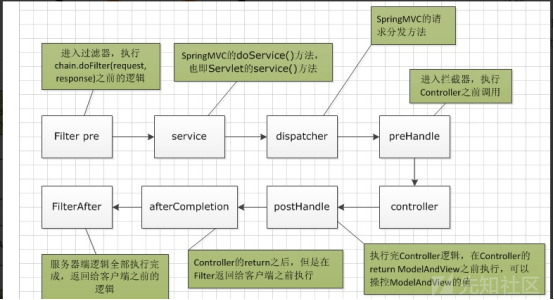](https://xzfile.aliyuncs.com/media/upload/picture/20230705113721-3ff08ad2-1ae5-1.png)  
看懂该图后，可以清晰地知道大多的路径归一化问题是因为鉴权的过滤器或者拦截器对于url的处理与spring最后对路由分发时的处理不一致，导致鉴权失败，从而可以未授权访问系统。  
下面就来看看springweb对url究竟是如何解析的

## SpringWeb对于请求的处理过程

以springboot2.2x为例自己搭建一个springboot环境，创建好controller后在controller内部打断点。在调用链中可以清晰地看到，spring对于url的分发确实是在filter之后，接下来  
[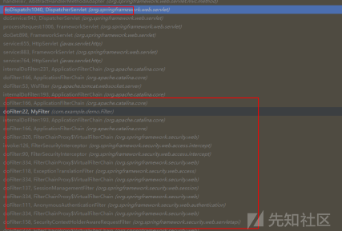](https://xzfile.aliyuncs.com/media/upload/picture/20230705113807-5b5de170-1ae5-1.png)  
从调用链可以看出在过完Filterchain链上所有的Filter后最后调用了DispatcherServlet的servlet方法。  
这里牵扯到一个java的机制，（不想深入了解java的可以略过这段）首先servlet在ApplicationFilterChain.java的225行被反射赋值为DispatcherServlet对象。所以231行调用的是DispatcherServlet的service方法且传入的参数是ServletRequest，ServletResponse类型。但是在DispatcherServlet中并没有service方法，在DispatcherServlet的父类FrameworkServlet中也没有重写接收ServletRequest和ServletResponse的对象service方法，所以调用链到了上一级父类Httpservlet这个抽象类的service方法。Httpservlet中的service方法又调用了接收HttpServletRequest对象的service方法，该方法又被FrameworkServlet重写。故最后调用了FrameworkServlet中的service。完全符合上面的调用链顺序。这里比较绕，大家可以自己跟一下就明白了。网上有很多对于这里的介绍都是错误的，学安全嘛还是要刨根问底一下。源码如下  
[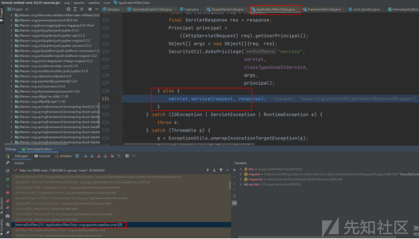](https://xzfile.aliyuncs.com/media/upload/picture/20230705113901-7b911138-1ae5-1.png)  
[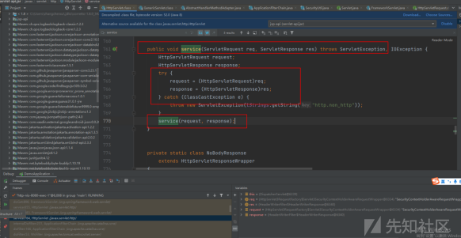](https://xzfile.aliyuncs.com/media/upload/picture/20230705114052-bd52c51c-1ae5-1.png)  
[](https://xzfile.aliyuncs.com/media/upload/picture/20230705114059-c17252c0-1ae5-1.png)  
[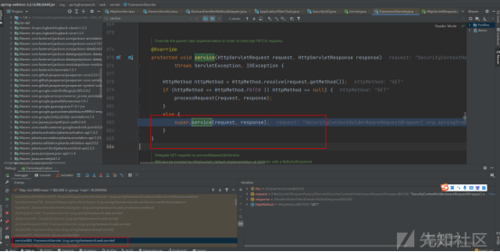](https://xzfile.aliyuncs.com/media/upload/picture/20230705114107-c69137a8-1ae5-1.png)  
接着可以看到FrameworkServlet的service方法中super调用了Httpservlet的service方法，值得注意的是在该方法中调用的doGet方法并不是Httpservlet的doGet方法，而是FrameworkServlet的doGet方法。  
[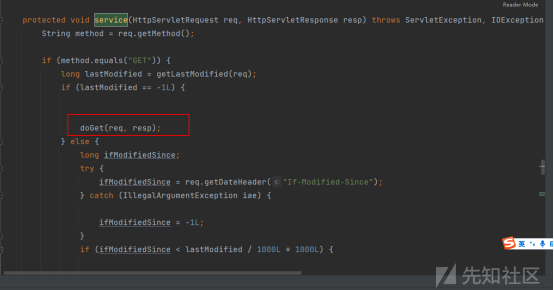](https://xzfile.aliyuncs.com/media/upload/picture/20230705114136-d7e179b4-1ae5-1.png)  
[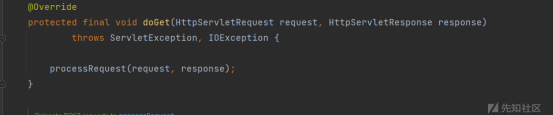](https://xzfile.aliyuncs.com/media/upload/picture/20230705114145-dd1b2d1c-1ae5-1.png)  
后面一直跟着调用链走，一直跟进到doDispatch方法。  
在该方法中做了很多比较关键的处理。  
首先处理了content-type为multipart的请求，后根据mappedHandler = getHandler(processedRequest);这行代码获取了已注册的handlerMappings。  
[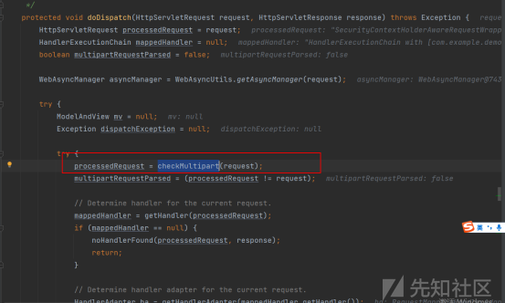](https://xzfile.aliyuncs.com/media/upload/picture/20230705114232-f9553054-1ae5-1.png)  
HandlerMapping是一个接口，负责将客户端的HTTP请求映射到对应的Controller。具体来说，它决定哪个Controller应该处理一个给定的请求。其中RequestMappingHandlerMapping用的最多，它支持@RequestMapping注解，并且通常与@Controller注解一起使用。  
[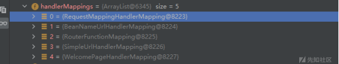](https://xzfile.aliyuncs.com/media/upload/picture/20230705114334-1e0f6810-1ae6-1.png)  
所以具体处理的逻辑也就在getHandler方法中  
[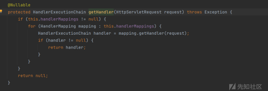](https://xzfile.aliyuncs.com/media/upload/picture/20230705114347-25d20aa8-1ae6-1.png)  
这段代码是从已注册的handlerMappings中获取一个HandlerExecutionChain对象，这个对象是对请求要执行的处理器以及其所有相关的拦截器的封装。跟进循环中的getHandler  
[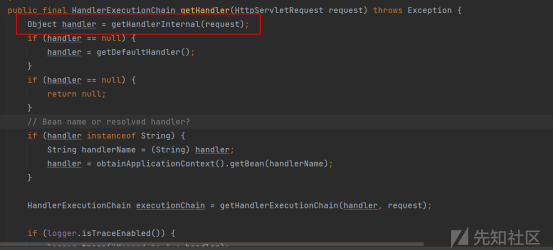](https://xzfile.aliyuncs.com/media/upload/picture/20230705114738-afa9128a-1ae6-1.png)  
getHandlerInternal方法是将HTTP请求找到处理这个请求的Handler，然后将其包装到HandlerExecutionChain对象中，以便后续的处理流程。  
到了这一步可以确定了，springweb对url的匹配是在getHandlerInternal之中，跟进getHandlerInternal看看其具体实现。  
[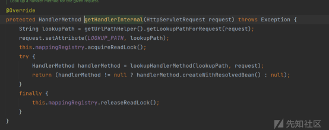](https://xzfile.aliyuncs.com/media/upload/picture/20230705114804-bf05048c-1ae6-1.png)  
看过路径归一化的师傅们应该到这里就很熟悉了，这个版本的函数叫getLookupPathForRequest，新版本叫initLookupPath。而这行代码也就是为了获得请求路径（通俗说就是我们请求的url）。看看他是怎么处理的  
[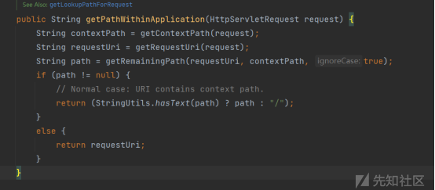](https://xzfile.aliyuncs.com/media/upload/picture/20230705114817-c707b22e-1ae6-1.png)  
很明显获取url的是 getRequestUri(request)  
[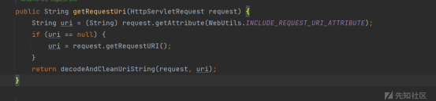](https://xzfile.aliyuncs.com/media/upload/picture/20230705114837-d2a02648-1ae6-1.png)  
跟入  
[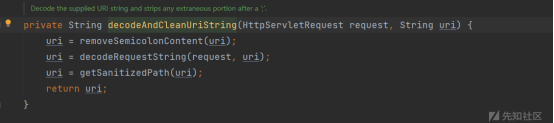](https://xzfile.aliyuncs.com/media/upload/picture/20230705114851-db17ccd6-1ae6-1.png)  
decodeAndCleanUriString这个函数可以说是大部分路径归一化问题的罪魁祸首，包括shiro 2020-1937也是因此而起。这三个函数我们挨个看看他到底干了什么  
[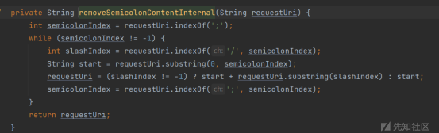](https://xzfile.aliyuncs.com/media/upload/picture/20230705114923-edfafbac-1ae6-1.png)  
removeSemicolonContentInternal主要做了两件事  
**1、移除所有的分号  
2、移除分号后面直到下一个斜杠”/”之间的所有字符**  
[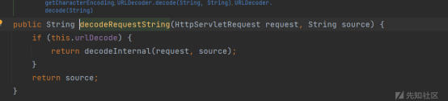](https://xzfile.aliyuncs.com/media/upload/picture/20230705114946-fbc8d9c0-1ae6-1.png)  
**decodeRequestString函数是对url进行url解码**，在这里也要强调一下，经常会看到有师傅用url编码进行鉴权绕过的情况也是由于此处的原因，在过滤器中其实并没有对编码过url进行处理，而到了spring分发路由的时候，却对他进行了解码从而绕过了认证。  
顺便提一句，实战过程中可能会碰到Nginx的情况，Nginx也会对url进行一层解码。  
[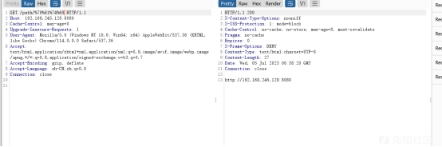](https://xzfile.aliyuncs.com/media/upload/picture/20230705143837-92a8ded2-1afe-1.png)  
[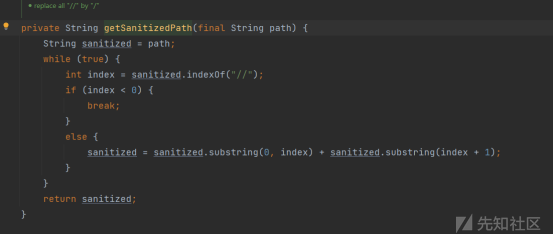](https://xzfile.aliyuncs.com/media/upload/picture/20230705114959-039a4d32-1ae7-1.png)  
getSanitizedPath把双/替换成单/  
在此之中removeSemicolonContentInternal问题最大，由于前文处理的模型可以看到url先经过过滤器，如果过滤器中逻辑稍有不当，便有可能存在绕过鉴权的情况。  
举个简单的例子

```plain
String requestUri =  request.getRequestURI();
If(requestUri.endsWith(“js”)){
   filterChain.doFilter(servletRequest, servletResponse);
}else{
return ;
}
```

这是一个常见的对静态文件不进行鉴权的过滤器，然而此时则可以通过**/api/xxxxxx;js\*\***对该鉴权进行绕过。因为filter处理url时if是通过了if的逻辑，而到了spring的doDispatch中则由刚刚所述的处理，将其分发到了/api/xxxxxx正确对应的接口。\*\*  
由此产生了很多鉴权问题，在filter之中对url处理稍有不慎变会导致该问题的产生。  
再回到springweb对请求的处理，除了刚刚介绍的三个函数对请求的处理之外，还有个地方需要注意，在getLookupPathForRequest之中可以看到this.alwayUseFullPath。这个地方也是一个出现漏洞的点，在springboot2.3.0RELEASE之前spring是可以解析/api/a/../xxxx为/api/xxxx的，是因为this.alwayUseFullPath默认为false，而在springboot2.3.0RELEASE之后，this.alwayUseFullPath默认为true。将无法再解析/api/a/../xxxx，会直接认为该url是个路径，去匹配相应的controller。

[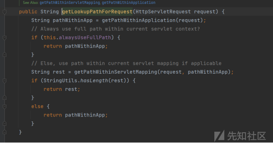](https://xzfile.aliyuncs.com/media/upload/picture/20230705115203-4d8708b8-1ae7-1.png)  
有始有终，刚刚只是解析获得了lookuppath也就是请求中的路径，之后再通过前文提到过的getHandlerInternal函数的lookupHandlerMethod对spring获取的url与controller中的url进行匹配。  
放几张跟踪的图  
[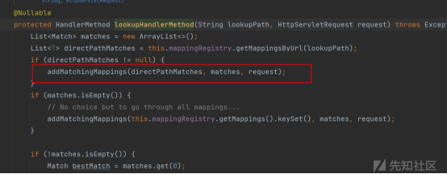](https://xzfile.aliyuncs.com/media/upload/picture/20230705115225-5a704d00-1ae7-1.png)  
[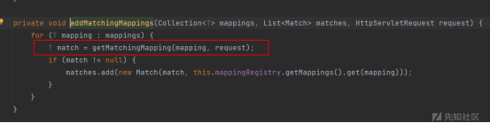](https://xzfile.aliyuncs.com/media/upload/picture/20230705115228-5c358c9a-1ae7-1.png)  
[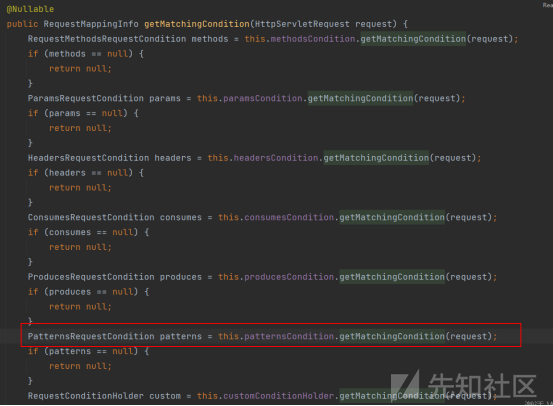](https://xzfile.aliyuncs.com/media/upload/picture/20230705115234-5fc09b84-1ae7-1.png)  
[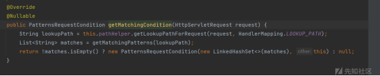](https://xzfile.aliyuncs.com/media/upload/picture/20230705115238-62681394-1ae7-1.png)  
[](https://xzfile.aliyuncs.com/media/upload/picture/20230705115244-65a33ba6-1ae7-1.png)  
跟踪到最后还有个要注意的点，是关于后缀的匹配模式  
[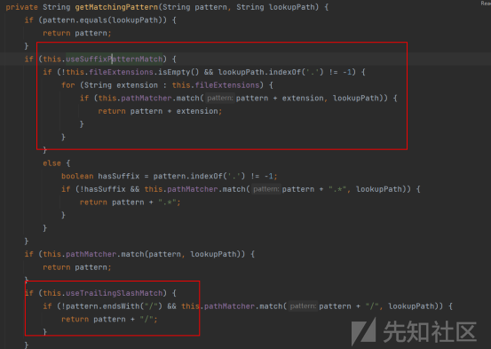](https://xzfile.aliyuncs.com/media/upload/picture/20230705115259-6e994bba-1ae7-1.png)  
如果useSuffixPatternMatch为true，且spring配置文件中spring.mvc.pathmatch.use-suffix-pattern的值也为true（我的环境是springweb5.2图中为false）  
[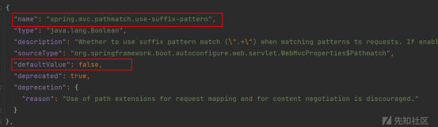](https://xzfile.aliyuncs.com/media/upload/picture/20230705115344-89f24920-1ae7-1.png)  
环境版本高，但是想实验的师傅可以自己配置一下  
[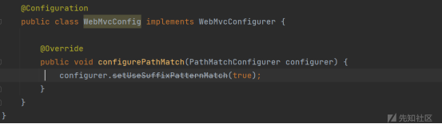](https://xzfile.aliyuncs.com/media/upload/picture/20230705115401-939c64b0-1ae7-1.png)  
Spring这时能解析/path/path.js  
[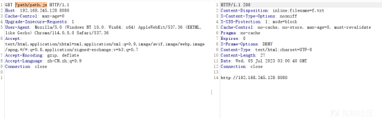](https://xzfile.aliyuncs.com/media/upload/picture/20230705115409-98cb5b6c-1ae7-1.png)  
在1.x版本的springboot和4.x版本的springweb中存在该情况。  
该情况也会绕过很多鉴权过滤器，使过滤器误以为用户请求的是静态资源。

## 总结

常出现漏洞的点  
1、removeSemicolonContentInternal函数对分号进行了相关处理导致绕过过滤器鉴权  
2、decodeRequestString对url进行解码，此处也可能存在问题  
3、在springboot2.3.0RELEASE之前alwayUseFullPath默认值为false，所以可能会导致"../","..;/"绕过鉴权的情况  
4、springboot 1.x版本可以解析/path/path.js这类带有后缀的请求，可能造成鉴权绕过

第一次写文章，可能条理有点混乱。希望大家多多包涵，有问题可以评论区跟我讨论，也可以直接加我好友跟我一起探讨，共同维护国家网络安全！

## 参考连接

[https://github.com/spring-projects/spring-framework/](https://github.com/spring-projects/spring-framework/)  
[https://forum.butian.net/share/2214](https://forum.butian.net/share/2214)
