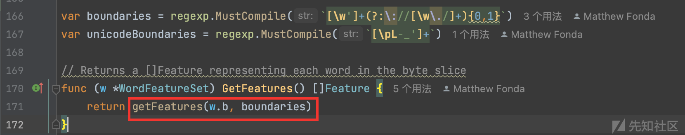
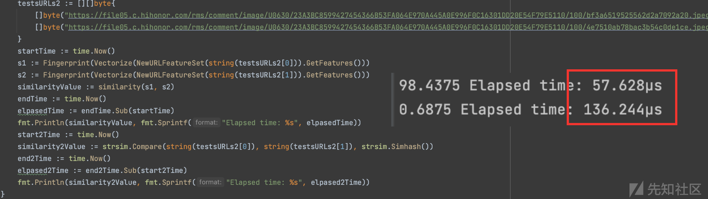

# 探索URL相似去重的可落地实践 (一) - 先知社区

探索URL相似去重的可落地实践 (一)

- - -

## 前言

  URL相似去重是作者多年前就已经遇到的难题，甚至一直到今还是悬而未决的状态，不过随着MoreFind的一点点地更新，重新让我拾起了尝试解决这类问题的勇气。本系列文章旨在探讨URL相似去重的可落地实践，深入了解该技术的原理、实现方式以及在实际项目中的应用，系列行文将主要从算法选择、性能优化、系统框架等多个方面展开。

## URL相似去重概念

**URL相似去重**是一种在处理大规模URL数据时的技术，旨在识别和删除相似或重复的URL，从而减少存储和处理的冗余。在Web爬虫、搜索引擎、大规模数据处理和网页分析等应用中，URL相似去重通常是一个关键的步骤。

[](https://xzfile.aliyuncs.com/media/upload/picture/20231127151855-395e975e-8cf5-1.png)

## 浅谈 SimHash

simhash是locality sensitive hash（局部敏感哈希）的一种，最早由Moses Charikar在《similarity estimation techniques from rounding algorithms》一文中提出

> 论文在这里:
> 
> [https://www.cs.princeton.edu/courses/archive/spr04/cos598B/bib/CharikarEstim.pdf](https://www.cs.princeton.edu/courses/archive/spr04/cos598B/bib/CharikarEstim.pdf)

而Google 在 2007 年《Detecting Near-Duplicates for Web Crawling》 正式将这种算法公开应用到网页相似性比较中，并取得不错的效果，SimHash算法开始逐渐变得平易近人，在实际应用中开始流行。

> 论文在这里:
> 
> [https://static.googleusercontent.com/media/research.google.com/zh-CN//pubs/archive/33026.pd](https://static.googleusercontent.com/media/research.google.com/zh-CN//pubs/archive/33026.pd)

论文中提到SimHash是一种降维技术，将高维向量映射成小尺寸的指纹。

在文章开头贡献部分作者提到通过试验统计发现在80亿的样本下，Simhash指纹长度取64位和取距离比较k = 3作为相似临界值的时候，检出效果比较好，这是一个有意义的相对参考。不过，论文后面，则主要讲在重点介绍如何在庞大数据量，将搜索Simhash的过程优化，降低搜索所需的时间，单看论文其实还是比较晦涩，本文重点还是放在实现和优化调整的部分。

[](https://xzfile.aliyuncs.com/media/upload/picture/20231127152110-89b376e8-8cf5-1.png)

SimHash 执行的过程如下图图示，后面章节会以代码和案例结合的方式逐步拆解分析每个步骤。

[](https://xzfile.aliyuncs.com/media/upload/picture/20231127152124-9285dc20-8cf5-1.png)

## 已有算法实现

学习一样东西最好的办法就是在前人的基础上实现自己的想法，下面是收集的一些基于GoLang实现SimHash的仓库。

1）[https://github.com/mfonda/simhash](https://github.com/mfonda/simhash)

2）[https://github.com/go-dedup/simhash](https://github.com/go-dedup/simhash)

3）[https://github.com/hengfeiyang/simhash](https://github.com/hengfeiyang/simhash)

4）[https://github.com/yanyiwu/gosimhash](https://github.com/yanyiwu/gosimhash)

先以最早最简单的 [https://github.com/mfonda/simhash](https://github.com/mfonda/simhash) 项目的Example 示例代码进行分析。

### SimHash 生成过程

[](https://xzfile.aliyuncs.com/media/upload/picture/20231127152141-9c657a34-8cf5-1.png)

关键的算法是这一段: `simhash.Simhash(simhash.NewWordFeatureSet(d))`

**1）数据预处理**

NewWordFeatureSet() 将每个字节统一转换为小写，存储一个WordFeatureSet类型指针fs的b字段并作为返回值。

[](https://xzfile.aliyuncs.com/media/upload/picture/20231127152154-a467eec4-8cf5-1.png)

**2）为每一个分词生成其对应的64位指纹哈希**

生成过程一共嵌套3个函数，这里考虑从里到外依次展开

[](https://xzfile.aliyuncs.com/media/upload/picture/20231127152204-aa494928-8cf5-1.png)

2.1）首先将整个句子根据正则表达式进行分词

`fs.GetFeatures()`分词的正则有一定借鉴意义,因为它这里做了一个非捕获分组出现0,1次，从而将URL的情况给考虑进去。

[](https://xzfile.aliyuncs.com/media/upload/picture/20231127152225-b6696a3a-8cf5-1.png)

有捕获分组的情况下，保留URL特征,不过有些特殊情况会导致URL失去意义，这个是正则表达式设计问题。

[](https://xzfile.aliyuncs.com/media/upload/picture/20231127152333-df55b1ba-8cf5-1.png)

在没有的情况下，普通且明显URL特征都失去意义，这样子分词的效果确实不好。

[](https://xzfile.aliyuncs.com/media/upload/picture/20231127152342-e499a1d6-8cf5-1.png)

`getFeatures`的具体接口实现是将分词后的列表传递给NewFeature函数并存储在 `[]Feature`列表结构作为返回值。

[](https://xzfile.aliyuncs.com/media/upload/picture/20231127152413-f6e5f114-8cf5-1.png)

Feature的接口定义决定了`NewFeature`函数的返回值类型，里面有两个有趣的函数分别是 `Sum`和 `Weight`

[](https://xzfile.aliyuncs.com/media/upload/picture/20231127152441-07f7ba3c-8cf6-1.png)

2.2）`Sum()`函数的作用通过传递分词列表的每一个item项计算出Hash值(Sum值，也可以理解为64位指纹）

> 64位是8字节，如果分词长度少于8的话，降维已经不成立，而是升维，但这个过程不会丢失精度，不过间接说明SimHash在大文本相似度比较上会有更强的实际应用效果。

可以看到这里的权重选取默认全是1,feature是Feature接口的实现，`fnv.New64()`初始化哈希实例，通过调用`Sum64()`得到一个具有良好分布特性的64位Hash值

> FNV（Fowler-Noll-Vo）是一种快速的哈希算法，常用于哈希表、数据校验和等领域。
> 
> `fnv.New64()` 函数调用返回的是一个实现了 `hash.Hash64` 接口的哈希函数对象。`hash.Hash64` 接口定义了计算 64 位哈希值的方法。

[](https://xzfile.aliyuncs.com/media/upload/picture/20231127152458-11b0c6f4-8cf6-1.png)

**3.调整每个分词Hash的权重然后逐位累加**

通过上述的第2步，得到一个`[]Feature` 数组(index:value)，每个item就是每个分词的64位指纹Hash

[](https://xzfile.aliyuncs.com/media/upload/picture/20231127152511-19bf1b8e-8cf6-1.png)

通过`Vectorize`向量化`[]Feature`为64维的向量表示`v`即一个大小为64位的int整形数组，通过`for range`循环遍历得到每个分词对应的64位hash值及其相应的权重之后，就开始通过`for`64次，依次填充`v`的值，从0-63开始。

`bit := ((sum >> i) & 1)` 将64位指纹右移i位然后做与运算，操作就是依次将hash(uint 64位)的对应的二进制位依次赋予给bit，将值的二进制向量化的思想。

然后通过判断Hash的每一位值是否为1，为1的话和权重相加，不为1的话则减去权重，有可能会得到负数，最终返回累加后的最终向量数组 `v`作为函数返回值。

[](https://xzfile.aliyuncs.com/media/upload/picture/20231127152523-20d0b608-8cf6-1.png)

为了方便更好地理解，我举一个8位的指纹从反向来解释这个过程，8位那就是2^8-1=0-255， 我们随机选一个数 178作为8位数指纹，对应二进制10110010，你可能会想指纹怎么是二进制格式，字符串格式对应的是chr(178) 转换为ASCII就是字符串表示,是不可见字符,计算机的本质就是二进制，其他都是**映射的结果**,假设指纹二进制的每一位权重都是2，那么经过`Vectorize`函数处理会变成 2 -2 2 2 -2 -2 2 -2，也就是 1 对应 2，0 对应 -2， v\[0\]=2,v\[1\]=-2,v\[2\]=2...以此类推，然后还有第二个指纹，比三个指纹，v\[0\]+=2或者v\[0\]+=-2最终得到v\[0\]是所有分词Hash第0位加权后的累加结果。

[](https://xzfile.aliyuncs.com/media/upload/picture/20231127152535-281170e2-8cf6-1.png)

**4\. 向量二值化得到最终加权后的结果**

从第3步获取到 hash 64维向量`v`传递进`Fingerprint`

[](https://xzfile.aliyuncs.com/media/upload/picture/20231127152548-2fdea4d4-8cf6-1.png)

代码注释写的很明白，作的是一个二值化操作，有意思的是里面的移位运算，`f |= (1 << i)`通过左移与运算实现相加最终将向量转换为`uin64`，体现了非常有趣的数学运算技巧，使算法的效率非常高。

[](https://xzfile.aliyuncs.com/media/upload/picture/20231127152615-3fac3d7c-8cf6-1.png)

### SimHash 相似比较

前面我们提到SimHash是属于 局部敏感哈希 的，即意味着哈希的每个值跟内容存在一定的关联，所以两个待比较的内容相似程度越高它们的SimHash值就会越相似，那么如何衡量两个SimHash值的相似程度呢？

首先我们了解一下汉明距离(Hamming distance)

> 在[信息论](https://zh.wikipedia.org/wiki/%E4%BF%A1%E6%81%AF%E8%AE%BA)中，两个等长[字符串](https://zh.wikipedia.org/wiki/%E5%AD%97%E7%AC%A6%E4%B8%B2)之间的**汉明距离**（英语：Hamming distance(距离)）是两个字符串对应位置的不同字符的个数。换句话说，它就是将一个字符串变换成另外一个字符串所需要*替换*的字符个数。
> 
> **[汉明重量](https://zh.wikipedia.org/wiki/%E6%B1%89%E6%98%8E%E9%87%8D%E9%87%8F)**是字符串相对于同样长度的零字符串的汉明距离，也就是说，它是字符串中非零的元素个数：对于[二进制](https://zh.wikipedia.org/wiki/%E4%BA%8C%E8%BF%9B%E5%88%B6)[字符串](https://zh.wikipedia.org/wiki/%E5%AD%97%E7%AC%A6%E4%B8%B2)来说，就是1的个数，所以11101的汉明重量是4。
> 
> Reference: [https://zh.wikipedia.org/zh-hans/%E6%B1%89%E6%98%8E%E8%B7%9D%E7%A6%BB](https://zh.wikipedia.org/zh-hans/%E6%B1%89%E6%98%8E%E8%B7%9D%E7%A6%BB)

一些例子；

-   **1011101**与**1001001**之间的汉明距离是2。
-   **2143896**与**2233796**之间的汉明距离是3。
-   "**toned**"与"**roses**"之间的汉明距离是3。

除了这种直接表示的特点，汉明距离在几何上面也存在一些特性，这些特性本文仅作拓展延伸展开，并不打算做深入关联探讨，读者重点关注实现和优化上即可。

[](https://xzfile.aliyuncs.com/media/upload/picture/20231127152808-83241e58-8cf6-1.png)

下面看看已有项目的代码是如何开展计算两个 SimHash 之间的汉明距离。

[](https://xzfile.aliyuncs.com/media/upload/picture/20231127152827-8e9c77da-8cf6-1.png)

一开始在看一些参考资料的时候，就觉得这个算法非常有意思，甚至还有名字叫做 the Kernighan method， 它计算汉明距离是一种非常高效非常trick的一种办法了。

将两个64位Hash局部hash：a 和 b 进行异或运算，最终结果对应的二进制数值为1的个数就是两个a和b的汉明距离，那么你会如何计算这种距离呢？

一开始如果想法并没有考虑很多情况，会觉得之前向量的表示方式本质就是一个一维数组，那么直接`for`64次不就可以计算出来了么，或者直接一点右移计算再&1，不过后来我看到项目的实现通过逻辑运算来实现的，我就知道前面的的想法从计算机角度来看是多么低效了，单从运算通过CPU最常见的与和加法运算支持，效率是很高这个点来看，其他方面的优势自然就不言而喻了。

```plain
var c uint8
    for c = 0; v != 0; c++ {
        v &= v - 1
    }
```

我举一个最简单的极端例子 1000 0001 计算这个值存在多少个1，首先按照算法依次执行,

1000 0001 != 0 c++: c= 1

1000 0001 & 1000 0000 = 1000 0000 c++: c=2

1000 0000 & 0111 1111 = 0000 0000 0

可以看到真正的运算次数是两次，8 Bit的数比较只用了3次，这个算法的高效率的地方就在于其跳0能力是非常快的，可以理解为另类剪枝的手段，那么换个思路想一下如何计算0的个数,思想是想办法把0的部分转换为1，并且拥有跳跃能力，这个点仅作拓展延伸即可，反向思考补集也是一种办法，不过在这里就不继续深入探讨了。

```plain
v := 124
    var c uint8
    for c = 0; v != 0xff; c++ {
        v |= v + 1
    }
```

当然，此算法由来也很有意思和争议，算是一种比较巧的办法，有关更多BIT运算的技巧可以看下[http://graphics.stanford.edu/~seander/bithacks.html#ZeroInWord](http://graphics.stanford.edu/~seander/bithacks.html#ZeroInWord)

[](https://xzfile.aliyuncs.com/media/upload/picture/20231127152847-9a2c9c6a-8cf6-1.png)

## 相似度标准化

前面在 【已有算法实现】章节，我们了解SimHash的产生过程及其相似度比较衡量的标准，但是一般我们相似度比较更应该是一个百分比表示，这样才能将数值比较控制在相同的维度。

对数学有一定了解的人可能会知道这个过程有专门的术语即"标准化"

[https://zh.wikipedia.org/wiki/%E6%A0%87%E5%87%86%E5%8C%96\_(%E7%BB%9F%E8%AE%A1%E5%AD%A6](https://zh.wikipedia.org/wiki/%E6%A0%87%E5%87%86%E5%8C%96_(%E7%BB%9F%E8%AE%A1%E5%AD%A6))

首先明确的是上述的汉明距离最大值为64，即所有的Hash位都不相同，根据googled数据，汉明距离小于等于3则可以认为两者相似，那么可以简单得到一个概率公式，当相似度在95%之上，两个比较文本的Hash指纹相对应的汉明距离应该小于等于3。

接着，继续考虑怎么计算相似度的百分比

[](https://xzfile.aliyuncs.com/media/upload/picture/20231127152938-b88bfaa2-8cf6-1.png)

上图，是一开始作者利用自身有限的数学知识想到的做法，不过为了集思广益，避免单点故障，继续考虑分析其他仓库的 SimHash 相似度计算的方法。

查阅网上的一些文章，发现大部分的计算规则其实和上图提到的是一样的，不过看到一些这样说法说计算出来的相似度不是线性的，严格线性是不容易做到的，至少在数学证明领域上作者目前没有能力去自证的，不过这个上图的计算法则近似线性我倒是自认为是没有问题的，因为x的取值范围0-64，出现非线性的结论只能说明每个位置出现的概率也是非线性的。

同时在查阅相关文章的时候，看到一些很有趣的代码，前面可知道相似度由汉明距离决定，但是这个情况没有考虑Hash位置的影响，给出三个Hash，自行比较下

1111 1100 与1111 1010

1111 1100 与 0011 1111

单单从第一眼印象，你会认为1111 1100 与谁最相似呢，如果考虑这个问题的话，那么下面这种做除法的比较就会有一定的参考意义，当然凡事没有绝对的，如果片面地采用这种相除的情况，很容易举出汉明距离很大但是相似度很高的反例。

[](https://xzfile.aliyuncs.com/media/upload/picture/20231127152952-c11e5390-8cf6-1.png)

另一个[https://github.com/hengfeiyang/simhash/blob/master/simhash.go](https://github.com/hengfeiyang/simhash/blob/master/simhash.go) 则和本文思路是一样的，HashSize 的长度可以不同，取决于Hash指纹的是多少位的。

[](https://xzfile.aliyuncs.com/media/upload/picture/20231127153007-c9d7f7b6-8cf6-1.png)

**简单小结一下:**

**应该选用什么标准化法则，除了严格的数学证明之外，从哲学角度来说，实践是检验真理的唯一标准,通过暴力美学拟合实际最佳效果未尝不可**

## Demo 初步实现

上面的分析针对的是一般的情况，实际情况会有一些非常规的问题待解决，下面开始一步步通过写代码来实现 SimHash 到计算相似度百分比的完整过程。

明确Demo。

### URL结构权重

如: [https://datatracker.ietf.org/doc/html/rfc3986](https://datatracker.ietf.org/doc/html/rfc3986) 所示一个URI组成部分

[](https://xzfile.aliyuncs.com/media/upload/picture/20231127153021-d254c6b2-8cf6-1.png)

那么一个URL结构我们可以考虑划分为五大部分，2N小分，其中2N小份指的是路径和参数可以存在多个，所以需要这样来划分成小N等分，每个小N等分平均分配父权重。

[](https://xzfile.aliyuncs.com/media/upload/picture/20231127153036-db1232bc-8cf6-1.png)

> URI（Uniform Resource Identifier）是一个标识资源的字符串的通用术语
> 
> URL（Uniform Resource Locator）是URI的一种特定类型。因此，URL是URI的子集
> 
> 特别说明: 下面所描述不严格区分URI与URL的区别，并将 hostname 等价 host:port

根据URL特征区块的主观明显程度，权重分配考虑步骤如下:

1）首先为了更好细化，先从10开始分

2) hostname 最为重要 ,其次是paths路径，再到参数params，fragment&schema锚点&协议最小，如此设计可以让相似度对应URL结构成明显梯度区间

3) 从最小开始，即 frament: 0.5 schema: 0.5 params: 2 paths:3 hostname: 4 total = 1 + 2 + 3 + 4 = 10

正常来说，直接调用`url.Parse` 依赖就可以解析URL得到上述的结果。

```plain
parse, err := url.Parse(uri)
    if err != nil {
        fmt.Println(err)
        return nil, err
    }
    fmt.Println("Host:"+parse.Host, " Scheme:"+parse.Scheme, " Path:"+parse.Path, " ," RawPath:"+parse.RawPath, " RawQuery"+parse.RawQuery, " Fragment:"+parse.Fragment)
```

但是这个办法通用性不是很强，比如当没有`schema`的时候，很多参数都没办法解析出来，为了更好地了解`url.Prase`的局限性和最大程度地记录与之相关的出错可能，有必要去深究一下其具体解析url的处理实现流程。下面按照解析顺序依次分六步进行简要说明。

1.锚点通过`string.Cut`切分

[](https://xzfile.aliyuncs.com/media/upload/picture/20231127153056-e761d004-8cf6-1.png)

2.`b[i]<0x20 || =b[i] ==0x7f` URL不能出现控制字符要不然会报错

[](https://xzfile.aliyuncs.com/media/upload/picture/20231127153110-ef694e44-8cf6-1.png)

3.协议的获取，通过`switch case`实现`[a-zA-Z][a-zA-Z0-9+.-]*:`正则表达式的效果,同时有变向移除`:`的效果。

[](https://xzfile.aliyuncs.com/media/upload/picture/20231127153137-fff1b18e-8cf6-1.png)

4.提取params的逻辑，如果url以`?`结尾则在url去掉`?`,反之以`?`作`cut`,右半部分的值赋予`url.RawQuery`

[](https://xzfile.aliyuncs.com/media/upload/picture/20231127153152-08f0e354-8cf7-1.png)

5.处理不以`\`开头的特殊情况，如 http:baidu.com/index.php 会简单划分赋值给`Opaque`属性，其中`viaRequest`这个值是恒假的，并且判断以`/`切割的第一个`path`不能包含`:`,比如`*:baidu.com`协议为空的就是不被允许的,解析会报错。

[](https://xzfile.aliyuncs.com/media/upload/picture/20231127153209-12fea16a-8cf7-1.png)

6.通过判断提取协议之后的字符串是否以`//`开头，是的话，则通过切片操作移除`//`,然后以`/`切割两部分，分别得到`authority`和`rest`,之后再将`authorigy`传递给`parseAuthority`进行细分出`url.User`和`url.Host`

[](https://xzfile.aliyuncs.com/media/upload/picture/20231127153232-2085e8e8-8cf7-1.png)

跟进`parseAuthorify`，真正的host是取最后`@`开始的部分，然后传递给`parseHost`,针对ipv6和ipv4做了区分，如果以`[`开头`]`结尾，则以ipv6进行解析，反之ipv4,目的都是进行`unescape`操作，也就是解码，这是很有意思的一个点。

[](https://xzfile.aliyuncs.com/media/upload/picture/20231127153244-27655306-8cf7-1.png)

仔细跟进 `unescape` ,它是做了两个`for`循环来URL解码的，第一个for循环根据RFC标准过滤不合法的主机名，其中

不能编码非ASCII字符，除了`%25`特殊，因为IPv6定义网卡需要，超过0x80的字符即非ASCII字符集范围则进行解码作为host值。

[](https://xzfile.aliyuncs.com/media/upload/picture/20231127153301-31d25ac8-8cf7-1.png)

7.如果不以`//`开头，而是以`/`开头，则标记为`OmitHost`即代表没有主机名只有路径，跟进`setPath`,可以看到路径解析存在两种可能，首先如果`escape`重新编码解码后的内容等同于`RawPath`则`RawPath`设置为空，否则不为空，即如果把不应该编码的字符如ASCII字符和`ShouldEscape`(不展开提这个，里面判断很多需要编码的特殊字符)函数定义字符进行编码了，那么`setPath`则会保留原始的路径赋值给`RawPath`。

[](https://xzfile.aliyuncs.com/media/upload/picture/20231127153326-40e4bdb2-8cf7-1.png)

### 关键代码实现

基于上述提到的URL结构分配权重的步骤，可以得到如下的代码

[](https://xzfile.aliyuncs.com/media/upload/picture/20231127153350-4eb616a2-8cf7-1.png)

计算2N小分的权重则根据均分原则，按照路径和参数的分隔符划分从而得到每小分的平均权重。

```plain
func calculateWeight(totalWeight float64, partsCount int) float64 {
    if partsCount > 0 {
        return totalWeight / float64(partsCount)
    }
    return totalWeight
}
```

相似度比较则是通过量化汉明距离为百分比形式，相关代码实现如下，需要注意地是，做除法运算需要将整形转换为浮点数进行运算。

```plain
func similarity(a uint64, b uint64) float64 {
    percent := Compare(a, b)
    return 100 - (float64(percent)/64.0)*100
}
```

### 初步评估效果

设计一部分常见用例

```plain
testURLs := [][]byte{
        []byte("http://baidu.com:8080/1/2/3/4.php?a=1&b=2#123"),
        []byte("http://baidu.com:8080/1/2/3/4.php?a=1&b=2"),
        []byte("http://baidu.com:8080/1/2/3/4.php?a=1"),
        []byte("http://baidu.com:8080/1/2/3/4.php"),
        []byte("http://baidu.com:8080/1/2/3/5.php"),
        []byte("http://baidu.com:8080/1/2/3.php"),
        []byte("http://baidu.com:8080/1.php"),
        []byte("http://qq.com/1/2/3/4.php?a=1&b=2#123"),
    }
```

重点关注 80% 以下的的例子，可以发现这个区分度还是很明显的，出现这个结果并不意外，因为SimHash提取特征和降维原理共同决定必然会出现如下图的结果。

[](https://xzfile.aliyuncs.com/media/upload/picture/20231127153500-78de1c9a-8cf7-1.png)

## 个例效果反馈

一开始打算进行随机Fuzz测试，但由于实际效果和时间成本综合考量，生成大量的随机URL进行模糊测试的意义其实并不突出，经过一番思考，打算先从一小部分真实的爬虫数据进行测试，期待目标能有以小见大的最终效果

### 采集爬虫数据

数据集来源:

1) 首先通过 [https://beian.miit.gov.cn/](https://beian.miit.gov.cn/) 查询出多个荣耀旗下备案的域名

```plain
hihonor.com
honorfile.com
hihonorcdn.com
hihonor.cn
honor.cn
```

2) 通过subfinder收集子域名，然后利用 waybackurls 采集相关的URL，最终数据量有5280条

```plain
subfinder -dL icp.txt|httpx -t 100|waybackurls > all_waybackurls.txt
```

[](https://xzfile.aliyuncs.com/media/upload/picture/20231127153517-82a88422-8cf7-1.png)

3) 对数据进行预处理,排除一些非常明显的URL,让测试数据量保持在500以下，目的是保证测试数据的高质且使结果直观。

```plain
cat all_waybackurls.txt|Morefind --filter="js,css,json,png,jpg,html,xml,zip,rar,gif" |MoreFind dedu --smart -t 5|MoreFInd -l 50-2000|shuf
```

[](https://xzfile.aliyuncs.com/media/upload/picture/20231127153526-87f8c090-8cf7-1.png)

4) 随机选取100条进行相似度比较

```plain
cat all_waybackurls.txt|Morefind --filter="js,css,json,png,jpg,html,xml,zip,rar,gif" |MoreFind dedu --smart -t 5|MoreFInd -l 50-2000|shuf|head -n 100
```

### 纵向效果对比

分为两个梯度，自身纵向主要是比较相似度80%和90%的过滤效果，横向则是其他实现SimHash算法对URL结构SImHash的对比

```plain
// 计算每个URL的指纹
    for _, value := range testURLs {
        fs := NewURLFeatureSet(value)
        fingerUint64 := Fingerprint(Vectorize(fs.GetFeatures()))
        compareStr = append(compareStr, fingerUint64)
    }
    thresold := 90.0
    // 遍历比较URL的相似度
    for i := 0; i < len(compareStr); i++ {
        foundUniq := true
        if len(belows) <= 0 {
            belows = append(belows, i)
        }
        for _, idx := range belows {
            similarityValue := similarity(compareStr[i], compareStr[idx])
            if similarityValue >= thresold {
                foundUniq = false
            }
        }

        if foundUniq {
            belows = append(belows, i)
        } else {
            aboves = append(aboves, i)
        }
    }
```

[](https://xzfile.aliyuncs.com/media/upload/picture/20231127153759-e33e666c-8cf7-1.png)

为了更加方便比较，我们将结果输出成两个不同的文本文件

[](https://xzfile.aliyuncs.com/media/upload/picture/20231127153809-e96eabc8-8cf7-1.png)

可以很直观地看到，当相似度低于90的时候，则认为不相似，这个条件相对80宽松很多，故最终结果是多了7条可能不相似的URL。

[](https://xzfile.aliyuncs.com/media/upload/picture/20231127153819-ef4fe1e2-8cf7-1.png)

通过比较共有的URLs，可以发现阈值在80的时候确实可能丢失一些第一眼感觉不那么相似URL，即产生数据URL明显丢失的问题。

[](https://xzfile.aliyuncs.com/media/upload/picture/20231127153833-f774d4c2-8cf7-1.png)

不过，相似一旦被赋予梯度之后，对URL进行定向过滤就有一个明确的"度"，可以看到当阈值去到95的时候，会出现如下图比较典型的URL相似特征。

[](https://xzfile.aliyuncs.com/media/upload/picture/20231127153931-1a582a34-8cf8-1.png)

### 横向效果对比

URL 结构相似度的权重分配规则从常理角度来说是比较合理的，那么如果是一般分词规则，比如基于词频(Term Frequency, TF)来划分权重，又会怎么样呢？

选取: [https://github.com/antlabs/strsim](https://github.com/antlabs/strsim) 做实验的简单对照，strsim 项目实现了多种相似度的算法，根据项目作者给出的文档，通过如下代码可以实现调用。

```plain
import "github.com/antlabs/strsim"
fmt.Println(strsim.Compare("a", "ab", strsim.Simhash()))
```

在正式进行对比之前，还是有必要了解该项目Simhash算法具体实现逻辑:

1.预处理，将比较的字符串进行base64编码。

[](https://xzfile.aliyuncs.com/media/upload/picture/20231127154016-352bb9c0-8cf8-1.png)

2.根据四字节然后分割，不过base64编码本身就是3字节转换为4字节的过程，近似于每3个字节切割的效果。

[](https://xzfile.aliyuncs.com/media/upload/picture/20231127154035-40642958-8cf8-1.png)

3.加权根据词频划分为5个登记，选取的hash函数为 crc32 检验和哈希长度为32bit

[](https://xzfile.aliyuncs.com/media/upload/picture/20231127154046-4707ee0c-8cf8-1.png)

3.相似度取值范围映射到 0-1

[](https://xzfile.aliyuncs.com/media/upload/picture/20231127154059-4e972b92-8cf8-1.png)

同样的测试数据集:

```plain
var aboves []string
    var belows []string
    thresold := 0.8
    for _, value := range testURLs {
        foundUniq := true
        if len(belows) <= 0 {
            belows = append(belows, value)
        }
        for _, idx := range belows {
            similarityValue := strsim.Compare(value, idx, strsim.Simhash()))
            if similarityValue >= thresold {
                foundUniq = false
                break
            }
            fmt.Printf("between %s and %s  similarity: %.2f\n", value, idx, similarityValue)
        }

        if foundUniq {
            belows = append(belows, value)
        } else {
            aboves = append(aboves, value)
        }
    }
```

相差10%，然后数量下降一半，这个特征和URL结构权重分配有一定的相似性。

[](https://xzfile.aliyuncs.com/media/upload/picture/20231127154113-56ca6e50-8cf8-1.png)

看下相似去重的效果,表现的效果并不是很令人满意，其中有很多非常明显的相似URL并没有得到去重。

[](https://xzfile.aliyuncs.com/media/upload/picture/20231127154126-5ec45f1c-8cf8-1.png)

[](https://xzfile.aliyuncs.com/media/upload/picture/20231127154136-65007cee-8cf8-1.png)

为了更好的测试这种算法的相似能力，尝试将阈值逐步下调，观察URL数量出现的特征，看看是否能确定梯度，从而实现定向过滤URL的效果。

[](https://xzfile.aliyuncs.com/media/upload/picture/20231127154212-7a607a3a-8cf8-1.png)

基于上述的结果，很难找到一个合理的梯度出来，平均减少10%就会URL就会减半，但是聚类后的URL特征并没有呈现出明显的梯度效应。

[](https://xzfile.aliyuncs.com/media/upload/picture/20231127154239-8a083554-8cf8-1.png)

直观地从试验整体效果上来看，这种低结构化分词权重的SimHash算法是不适合直接套用在有特定结构的URL文本相似比较上应用的。

比如如下相似的URL，基于低结构化分词权重的SimHash算法相似度只去到0.69，这很明显不符合人的第一直觉。

```plain
between https://file05.c.hihonor.com/rms/comment/image/U0630/23A3BC8599427454366B53FA064E970A445A0E996F0C16301DD20E54F79E5110/100/bf3a6519525562d2a7092a20.jpeg and https://file05.c.hihonor.com/rms/comment/image/U0630/23A3BC8599427454366B53FA064E970A445A0E996F0C16301DD20E54F79E5110/100/4e7510ab78bac3b54c0de1ce.jpeg  similarity: 0.69
```

另外，通过对比这两个算法对上述两个URL的处理代码执行时间，在性能方面可以粗略估计基于URL结构的重分配的SimHash算法在Demo无任何优化的情况下(64位哈希 VS 32位哈希)，时间表现的性能依然差不多接近2倍半多差不多3倍的差异，如果面向处理常见大量URL场景性能量级会被迅速放大，从而决定整个系统的效率。

[](https://xzfile.aliyuncs.com/media/upload/picture/20231127154256-9469f668-8cf8-1.png)

## 本文结语

  本文主要探索SimHash算法原理及其应用的实际性，结合其自身特点，通过优化分词的权重分配结构，取得了一定的成果。值得一提的是，URL相似去重在作者自身接触有限领域目前还没有出现能达到通用识别的效果即单一万金油通杀开源案例，但如果从系统框架层面上看，通过设定好归一化原则，将阈值和权重合理分配，结合并采用相似度量的高效算法，控制整个运算的复杂度从而闭环形成一个通用的系统处理框架，最后，只需要聚焦于每层模块的**性能优化**，提升处理输入和比较结果效率，那么一个性能不错，效果可以，自由度高的URL相似去重系统模块离现实似乎也不是那么遥远。

## 参考链接

[开发常见的Hash函数(三)-Minhash\_Simhash](https://thomaslau.xyz/2020/06/13/2020-06-13-on_hash_3/)

[相似度算法调研](https://sumsec.me/2022/%E7%9B%B8%E4%BC%BC%E5%BA%A6%E7%AE%97%E6%B3%95%E8%B0%83%E7%A0%94.html)

[SimHash 算法 笔记](https://weikeqin.com/2017/05/01/simhash/)

[海量数据相似度计算之simhash短文本查找](http://mp.weixin.qq.com/mp/appmsg/show?__biz=MjM5NjEyNDc1Mw==&appmsgid=10000052&itemidx=1&sign=1888bf315ceda6dca2899207bbffed82&mpshare=1&scene=1&srcid=1109vQflJUN6pq1VknmU7zXP&sharer_shareinfo=c2225a7bb36948cce59aa9a2edf33cca&sharer_shareinfo_first=c2225a7bb36948cce59aa9a2edf33cca#wechat_redirect)

[LSH算法（SimHash、MinHash）在安全领域的应用](https://mp.weixin.qq.com/s/7gJZgqU17ISX3pYUBzxNBw)

[一种基于Simhash算法的重复域名数据去重方法](https://mp.weixin.qq.com/s/qb2ThyOjqoTavU9I3TsCCQ)

[短文本相似度校验算法](https://www.gitsu.cn/article96)
