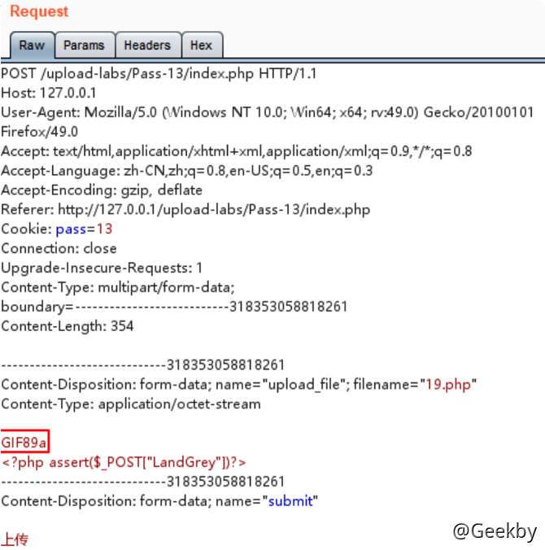

# [](#%E6%96%87%E4%BB%B6%E4%B8%8A%E4%BC%A0%E6%BC%8F%E6%B4%9E)文件上传漏洞

## [](#1-%E5%89%8D%E8%A8%80)1 前言

靶场环境：[https://github.com/c0ny1/upload-labs](https://github.com/c0ny1/upload-labs)

环境搭建：

|     |     |     |
| --- | --- | --- |
| ```plain<br>1<br>2<br>``` | ```bash<br>docker pull c0ny1/upload-labs<br>docker run -d -p 80:80 upload-labs<br>``` |

判断上传漏洞的类型：


文件上传漏洞主要存在以下几个方面：

1.  可解析的后缀，也就是该语言有多个可解析的后缀，比如 php 语言可解析的后缀为php，php2，php3 等等
    
2.  大小写混合，如果系统过滤不严，可能大小写可以绕过。
    
3.  中间件，每款中间件基本都解析漏洞，比如 iis 就可以把 xxx.asp;.jpg 当 asp 来执行。
    
4.  系统特性，特别是 Windows 的后缀加点，加空格，加 ::$DATA 可以绕过目标系统。
    
5.  语言漏洞，流行的三种脚本语言基本都存在 00 截断漏洞。
    
6.  双后缀，这个与系统和中间件无关，偶尔会存在于代码逻辑之中。
    

### [](#11-%E5%8F%AF%E8%A7%A3%E6%9E%90%E7%9A%84%E5%90%8E%E7%BC%80)1.1 可解析的后缀

很多语言都有多个可以解析后缀。当目标站点采用黑名单时，往往包含不全。

| **语言** | **可解析后缀** |
| --- | --- |
| asp/aspx | asp、aspx、asa、asax、ascx、ashx、asmx、cer |
| php | php、php5、php4、php3、php2、phtml、pht |
| jsp | jsp、jspa、jspx、jsw、jsv、jspf、jhtml |

### [](#12-%E4%B8%AD%E9%97%B4%E4%BB%B6%E6%BC%8F%E6%B4%9E)1.2 中间件漏洞

#### [](#121-iis)1.2.1 IIS

IIS 一共有三个解析漏洞：

1.  IIS 6.0 文件解析 `xx.asp;.jpg`
2.  IIS 6.0 目录解析 `xx.asp/1.jpg`
3.  IIS 7.5 畸形解析 `xxx.jpg/x.php`

#### [](#122-apahce)1.2.2 Apahce

apache 相关的解析漏洞有两个：

1.  %0a (CVE-2017-15715)
2.  未知后缀 test.php.xxx

#### [](#123-nginx)1.2.3 nginx

nginx 解析漏洞有三个：

1.  访问链接加 `/xxx.php`，即 `test.jpg/xxx.php`
2.  畸形解析漏洞 `test.jpg%00xxx.php`
3.  CVE-2013-4547 `test.jpg(非编码空格)\0x.php`

#### [](#124-tomcat)1.2.4 tomcat

tomcat 用于上传绕过的有三种，部分限制在 windows 操作系统下。

1.  xxx.jsp/
2.  xxx.jsp%20
3.  xxx.jsp::$DATA

### [](#13-%E7%B3%BB%E7%BB%9F%E7%89%B9%E6%80%A7)1.3 系统特性

经过查资料，目前发现在系统层面，有以下特性可以被上传漏洞所利用。

-   Windows 下文件名不区分大小写，Linux下文件名区分大写
-   Windows 下 ADS 流特性，导致上传文件 xxx.php::$DATA = xxx.php
-   Windows 下文件名结尾加入`.`、`空格`、`<`、`>`、`>>>`、`0x81-0xff`等字符，最终生成的文件均被 windows 忽略。

## [](#2-writeup)2 WriteUP

### [](#21-pass---01)2.1 PASS - 01

|     |     |     |
| --- | --- | --- |
| ```plain<br> 1<br> 2<br> 3<br> 4<br> 5<br> 6<br> 7<br> 8<br> 9<br>10<br>11<br>12<br>13<br>14<br>15<br>16<br>17<br>18<br>19<br>``` | ```javascript<br><script type="text/javascript"><br>    function checkFile() {<br>        var file = document.getElementsByName('upload_file')[0].value;<br>        if (file == null \| file == "") {<br>            alert("请选择要上传的文件!");<br>            return false;<br>        }<br>        //定义允许上传的文件类型<br>        var allow_ext = ".jpg\|.png\|.gif";<br>        //提取上传文件的类型<br>        var ext_name = file.substring(file.lastIndexOf("."));<br>        //判断上传文件类型是否允许上传<br>        if (allow_ext.indexOf(ext_name) == -1) {<br>            var errMsg = "该文件不允许上传，请上传" + allow_ext + "类型的文件,当前文件类型为：" + ext_name;<br>            alert(errMsg);<br>            return false;<br>        }<br>    }<br></script><br>``` |

前端禁用JS，直接上传 Webshell

### [](#22-pass---02)2.2 PASS - 02

绕过 MIME 检测，通过 BurpSuite 修改 Content-Type 即可


### [](#23-pass---03)2.3 PASS - 03

|     |     |     |
| --- | --- | --- |
| ```plain<br>1<br>2<br>3<br>4<br>5<br>6<br>7<br>``` | ```php<br>$deny_ext = array('.asp','.aspx','.php','.jsp');<br>$file_name = trim($_FILES['upload_file']['name']);<br>$file_name = deldot($file_name);//删除文件名末尾的点<br>$file_ext = strrchr($file_name, '.');<br>$file_ext = strtolower($file_ext); //转换为小写<br>$file_ext = str_ireplace('::$DATA', '', $file_ext);//去除字符串::$DATA<br>$file_ext = trim($file_ext); //收尾去空<br>``` |

后端过滤了 `.php`，通过使用 `.php3`、`php5`、`php7`、`phtml`、`pht` 等后缀绕过检测


### [](#24-pass---04)2.4 PASS - 04

重写文件解析规则绕过。上传先上传一个名为 `.htaccess` 文件，内容如下

|     |     |     |
| --- | --- | --- |
| ```plain<br>1<br>2<br>3<br>``` | ```xml<br><FiileMatch "04.jpg"><br>SetHandler application/x-httpd-php<br></FiileMatch><br>``` |

再上传一个 `03.jpg` ，访问 03.jpg，即以 PHP 文件进行解析。


### [](#25-pass---05)2.5 PASS - 05

还是黑名单，加上了 `.htaccess`，但是没有将后缀进行大小写统一，于是可以通过大小写绕过.


### [](#26-pass---06)2.6 PASS - 06

利用 Windows 系统的文件名特性。文件名最后增加点和空格，写成06.php\[空格\] ，

上传后保存在 Windows 系统上的文件名最后的一个 `.` 会被去掉，实际上保存的文件名就是 06.php


### [](#27-pass---07)2.7 PASS - 07

原理同 Pass-06，文件名后加点，改成 `07.php.`


### [](#28-pass---08)2.8 PASS - 08

Windows 文件流特性绕过，文件名改成 `08.php::$DATA`，上传成功后保存的文件名其实是 `08.php`

php 在 window 环境下，如果文件名 + `::$DATA` 会把 `::$DATA` 之后的数据当成文件流处理，不会检测后缀名，且保持 `::$DATA` 之前的文件名


### [](#29-pass---09)2.9 PASS - 09

原理同 Pass-06，上传文件名后加上点 + 空格+ 点，改为 09.php. .


### [](#210-pass---10)2.10 PASS - 10

双写文件名绕过，文件名改成 10.pphphp


### [](#211-pass---11)2.11 PASS - 11

上传路径名 %00 截断绕过。上传的文件名写成 11.jpg，save\_path 改成 `../upload/11.php%00`，最后保存下来的文件就是 11.php


### [](#212-pass---12)2.12 PASS - 12

原理同 Pass-11，上传路径 0x00 绕过。这次的 save\_path 是通过 post 传进来的，还是利用 00 截断，但这次需要在二进制中进行修改，因为 post 不会像 get 对 %00 进行自动解码

利用 Burpsuite 的 Hex 功能将 save\_path 改成 `../upload/12.php[二进制00]`形式


### [](#213-pass---13)2.13 PASS - 13

绕过文件头检查，添加 GIF 图片的文件头 GIF89a，绕过 GIF 图片检查。



### [](#214-pass---14)2.14 PASS - 14

这里用 getimagesize 获取文件类型，还是直接就可以利用图片马就可进行绕过

### [](#215-pass---15)2.15 PASS - 15

这里用到 php\_exif 模块来判断文件类型，还是直接就可以利用图片马就可进行绕过

### [](#216-pass---16)2.16 PASS - 16

原理：将一个正常显示的图片，上传到服务器。寻找图片被渲染后与原始图片部分对比仍然相同的数据块部分，

将 Webshell 代码插在该部分，然后上传。具体实现需要自己编写 Python 程序，人工尝试基本是不可能构造出能绕过渲染函数的图片 webshell 的。

参考：

-   [https://xz.aliyun.com/t/2657#toc-12](https://xz.aliyun.com/t/2657#toc-12)
    
-   [https://www.idontplaydarts.com/2012/06/encoding-web-shells-in-png-idat-chunks/](https://www.idontplaydarts.com/2012/06/encoding-web-shells-in-png-idat-chunks/)
    

### [](#217-pass---17)2.17 PASS - 17

-   利用条件竞争删除文件时间差绕过。
-   在脚本运行的时候，访问 Webshell

### [](#218-pass---18)2.18 PASS - 18

-   利用上传重命名竞争 + Apache解析漏洞，成功绕过。
-   上传名字为 18.php.7Z 的文件，快速重复提交该数据包，会提示文件已经被上传，但没有被重命名。


### [](#219-pass---19)2.19 PASS - 19

本关考察 CVE-2015-2348 move\_uploaded\_file() 00 截断，原理同 Pass-11，上传的文件名用 0x00 绕过。改成 19.php\[二进制00\].1.jpg


### [](#220-pass---20)2.20 PASS - 20

|     |     |     |
| --- | --- | --- |
| ```plain<br> 1<br> 2<br> 3<br> 4<br> 5<br> 6<br> 7<br> 8<br> 9<br>10<br>11<br>12<br>13<br>14<br>15<br>16<br>17<br>18<br>``` | ```php<br>$file = empty($_POST['save_name']) ? $_FILES['upload_file']['name'] : $_POST['save_name'];<br>if (!is_array($file)) {<br>    $file = explode('.', strtolower($file));<br>}<br>$ext = end($file);<br>$allow_suffix = array('jpg','png','gif');<br>if (!in_array($ext, $allow_suffix)) {<br>    $msg = "禁止上传该后缀文件!";<br>}else{<br>    $file_name = reset($file) . '.' . $file[count($file) - 1];<br>    $temp_file = $_FILES['upload_file']['tmp_name'];<br>    $img_path = UPLOAD_PATH . '/' .$file_name;<br>    if (move_uploaded_file($temp_file, $img_path)) {<br>        $msg = "文件上传成功！";<br>        $is_upload = true;<br>} else {<br>        $msg = "文件上传失败！";<br>}<br>``` |

首先 end 函数取所 post 参数数组中的最后一个值，`$file_name = reset($file) . '.' . $file[count($file) - 1]`。我们可以 post 一个参数名为一个 \[0\]一个 \[2\]，然后 $file\[count($file) - 1\] 就为空，$file\_name 最终就为reset($file) 即 $file\[0\]，就可以绕过判断


