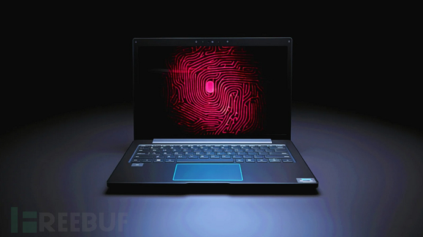

# 新的指纹传感器漏洞可绕过 Windows Hello 登录 - FreeBuf网络安全行业门户

新的指纹传感器漏洞可绕过 Windows Hello 登录

一项新的研究发现，戴尔 Inspiron 15、联想 ThinkPad T14 和微软 Surface Pro X 笔记本电脑上的多个漏洞可以绕过 Windows Hello 身份验证。

这些漏洞是由硬件和软件产品安全研究公司 Blackwing Intelligence 的研究人员发现的，他们从这些设备中嵌入的 Goodix、Synaptics 和 ELAN 的指纹传感器中发现了这些漏洞。

利用指纹读取器漏洞的前提条件是目标笔记本电脑的用户已经设置了指纹验证。

这三种指纹传感器都是一种称为 "芯片匹配"（MoC）的传感器，它将匹配和其他生物识别管理功能直接集成到传感器的集成电路中。

研究人员 Jesse D'Aguanno 和 Timo Teräs 说：虽然 MoC 可以防止将存储的指纹数据重放给主机进行匹配，但它本身并不能防止恶意传感器欺骗合法传感器与主机的通信，谎称授权用户已成功通过身份验证。

MoC也无法阻止重放主机与传感器之间先前记录的通信。

尽管微软创建的安全设备连接协议（SDCP）旨在通过创建端到端安全通道来缓解其中的一些问题，但研究人员发现了一种新方法，可用于规避这些保护措施和发动AitM攻击。

在Synaptics公司的案例中，不仅发现SDCP在默认情况下是关闭的，而且在实施过程中还选择依赖有漏洞的自定义传输层安全（TLS）协议栈来确保主机驱动程序和传感器之间的USB通信安全，而这种安全协议栈可以被用来规避生物识别身份验证。

另一方面，对 Goodix 传感器的利用，利用了在加载了 Windows 和 Linux 的机器上执行的注册操作的根本差异，利用后者不支持 SDCP 来执行以下操作：

-   启动到 Linux
-   枚举有效 ID
-   使用与合法 Windows 用户相同的 ID 注册攻击者的指纹
-   利用明文 USB 通信对主机和传感器之间的连接进行 MitM
-   启动到 Windows
-   拦截并重写配置数据包，以便使用我们的米特米技术指向 Linux DB
-   使用攻击者的指纹以合法用户身份登录

值得指出的是，虽然 Goodix 传感器为 Windows 和非 Windows 系统分别提供了不同的指纹模板数据库，但由于主机驱动程序会向传感器发送未经验证的配置数据包，以指定在传感器初始化过程中使用哪个数据库，因此攻击才有可能发生。

为减少此类攻击，建议原始设备制造商（OEM）启用 SDCP，并确保指纹传感器的实施由独立的专家进行审核。

研究人员说：微软在设计 SDCP 以在主机和生物识别设备之间提供安全通道方面做得很好，但不幸的是，设备制造商似乎误解了其中的一些目标。

此外，SDCP 只覆盖了典型设备非常狭窄的操作范围，而大多数设备都暴露了相当大的攻击面，SDCP 根本没有覆盖这些攻击面。

> 参考链接：https://thehackernews.com/2023/11/new-flaws-in-fingerprint-sensors-let.html
