# 既要吃好也要健康，你可以从几件小事开始改变饮食习惯 - 少数派

民以食为天，吃的重要性不言而喻。当我们不必再为吃饱担忧，就要考虑如何吃得更健康。

市面上的营养学知识可谓汗牛充栋，但是我们还是难以做到健康饮食。问题不是信息太少，而是信息太多。营养基础知识众说纷纭，就连饮食方式也让人眼花缭乱：间歇性禁食、生酮饮食、原始饮食、地中海饮食、斯金纳饮食等不胜枚举。我们常对新的饮食法抱有极大的信心，但是在尝试之后又回到原点。

那不妨让我们从原点出发，了解最基本的营养知识，在生活中践行「最小行动」。在保证践行基本的膳食原则后，再一步步进阶尝试更复杂、新颖的饮食方式。

我们首先从《中国居民膳食指南》出发，如果我们能够避免指南中指出的错误，就成功了一半。之后再对个人饮食情况进行一段时间的记录，就能够发现自己的问题。

为了便于大家记忆《中国居民膳食指南》中提到的问题，我借鉴瑞典的膳食交通信号灯，用灯的三种颜色将食物划分为三类。绿色代表多吃，包括谷物、蔬菜、水果、浆果、鱼、贝类、坚果、种子以及多加锻炼，黄色代表该吃健康脂肪，红色代表盐、糖和酒精。

## 红绿灯食物

### 红灯食物

#### 盐

盐为百味之首，要想饭菜香，盐必不可少。在没有冰箱的年代，用盐腌制食物是保存食物很常见的方法，比如酸菜、泡菜、甚至于咸鸡蛋、咸鸭蛋。现如今有了冰箱，我们不再需要用盐保存食物，但重口味却保留在了我们的饮食习惯中，尤其是北方，吃盐更多。目前世界卫生组织（WHO）和《中国居民膳食指南（2022）》推荐普通人每天钠摄入量为 5g，而我国居民平均每天钠盐摄入量为 8～15g，是推荐标准的 **3 倍**。

与其他影响因素相比，高钠对疾病的贡献可谓一骑绝尘。以 2012 年数量为例，高钠摄入所占的比例占 17.3%。高盐（钠）不仅会增加高血压的发病风险、脑卒中（俗称中风）以及胃癌的风险，高钠摄入更是排在心血管代谢疾病死亡风险的首位。1

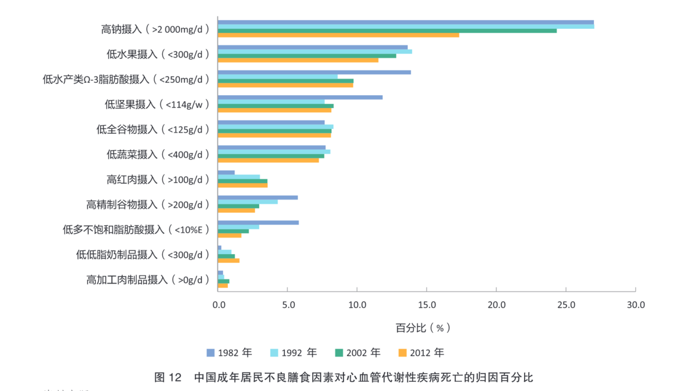

中国营养学会中国居民膳食指南科学报告工作组. 《〈中国居民膳食指南科学研究报告（2021）〉简介》. 营养学报 43, 期 01 (2021年): 1–2.

这里需要区分下概念，我们平常说的盐主要是指氯化钠（NaCl），但是并不是只有食盐含有 Na（+） 离子，我们常见的小苏打，其化学成分为 NaHCO（3），也含有 Na（+） 离子。**钠常常以隐身的形式伪装在饼干、面包当中，**所以我们在生活中就不能单纯地从口感咸淡来评价含钠量。一些苏打饼干虽然吃起来不咸，但含盐量可不低。

但也并不是所有的「盐」都对身体有危害，**比如钾盐就对身体有益。**世界卫生组织推荐每人每天钾的摄入量为 3.51g，而我国人群每天钾的摄入量只有 1.89g。钾离子有降低血压的作用，「钠钾平衡」可以帮助血压保持平稳，预防心脑血管疾病的发生。补充钾除了吃香蕉，食用低钠含钾盐也是不错的选择，补充钾的同时，降低钠的摄入，一举两得。

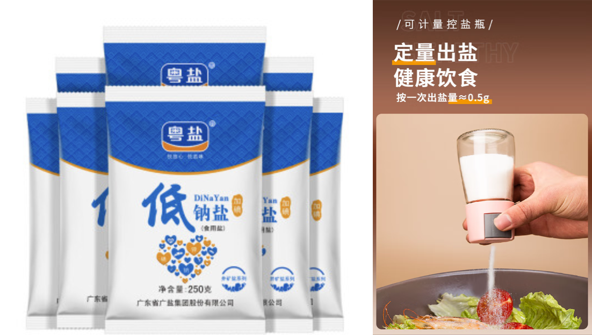

正是因为钠盐危害多多，包装食物上才会强制标注钠盐的含量。但需要注意的是，食品包装上的含钠量也不完全等同于盐含量，1g 钠 = 2.5g 盐。

有一个形象的比喻可以帮助我们形象的记忆每天要吃多少盐：现在是 5G 时代了，每天要吃 5g 盐。一小勺盐大约为 2g，一啤酒瓶盖大约为 6g。如果自己做饭也可以使用可计量控盐瓶，可以更好掌控出盐量。如果生活在南方，上图这类小瓶子可能就不适用，空气潮湿，盐也容易板结成块，无法从瓶口倒出。

#### 糖

糖其实是一个宽泛的概念，既包括白砂糖这些游离糖、也包括水果里面的内源性糖，以及大米中包含的碳水化合物质。目前没有证据证明内源性糖对健康有什么副作用，因而我们更应该注意的是游离糖。

游离糖是指生产商、厨师或消费者在食品中添加的单糖和双糖以及天然存在于蜂蜜、糖浆、果汁和浓缩果汁中的糖分。对于成年人和儿童游离糖摄入量应减少至摄入总能量的 10% 以内。如果能进一步降低至摄入总能量的 5%，会对健康更好。

**为什么要限制游离糖？**

游离糖能量密度高，但是营养密度低。过多摄入游离糖，很容易让人能量摄入超标，同时饮食摄入失衡，发胖与营养不良共存。即便我们摄入的游离糖的总量比较少，热量不超标，没有发胖。那也要小心游离糖导致蛀牙——龋齿。

龋齿不是儿童的专属，大人也会龋齿。相较于儿童，大人的龋齿率更高，龋齿率随着年龄增加而增加。下图显示了随着年龄增加，牙齿疾病（龋齿、掉牙和坏牙）的风险也越来越大。2

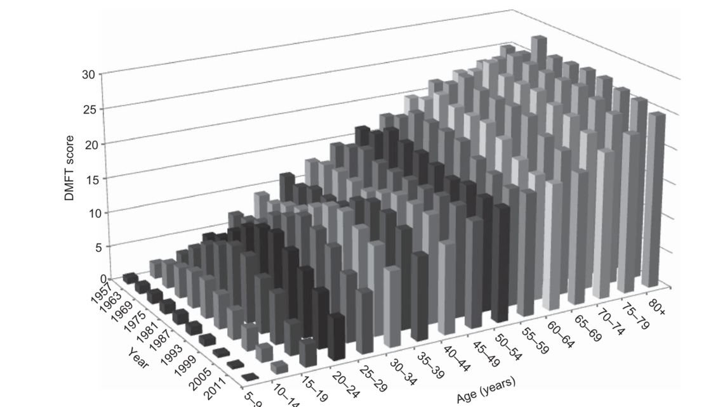

Sheiham, Aubrey, 和W Philip T James. 《A New Understanding of the Relationship between Sugars, Dental Caries and Fluoride Use: Implications for Limits on Sugars Consumption》.

你可能说，我吃完糖刷牙不就行了？事实没那么简单。世界卫生组织发现，刷牙无法完全预防龋齿，只能够延缓龋齿。在那些持续刷牙的人群当中，龋齿率仍然上升。3

如何能够更好的保持牙齿健康？为了牙齿健康，游离糖摄入水平不要高于摄入总能量的 10% 以上。生活中一不小心，我们游离糖摄入量就超标。以瓶装可口可乐为例，一瓶可乐容量为 500 ml，每 100 ml 含糖量为 10.2g，每克糖对应的热量为 4kcal，则每罐可口可乐糖对应的热量即为 204kcal，约占比健康男性基础代谢的 10%（以基础代谢 1800kcal 进行计算）。对于瘦小的男生来讲，可能一瓶可口可乐下肚，单日糖摄入量就超标。

**代糖的争议**

为了减少糖的摄入，各式各样的人工甜味剂 （也叫代糖，属于食品添加剂） 应运而生，「无糖」「低卡路里」或「零卡路里」的饮料和食品也成了满足肥胖、心血管疾病风险人群口福的必须。

然而在 2023 年的一项研究发现4，作为食品人工甜味剂主力军的赤藓糖醇（erythritol）与血液凝固、中风、心脏病发作和死亡有关。研究人员分析 1157 心脏病患者的血液指标，发现患有糖尿病等同样的心脏病风险因素，血液中赤藓糖醇含量高的人群比低的人群患有心脏病或中风的可能性增加了一倍。

为了进一步验证猜测，研究人员进行了干预实验。科研人员将 30g 的赤藓糖醇放在 300ml 的水中，让 8 名受试者服用，根据美国营养和健康调查的结果，很多人每天赤藓糖醇的摄入量 >30g。在接下来三天的做血液测试来追踪他们体内赤藓糖醇水平和凝血风险，结果发现 30g 的赤藓糖醇足以使血液中的赤藓糖醇水平上升 1000 倍。在接下来的两到三天里，它仍然高于触发和增加凝血风险所需的阈值。

虽然现有的证据尚不能完全证明赤藓糖醇的危害，但可以让我们在选择食用代糖时更加谨慎。我们常喝的饮料中都含有什么甜味剂？可以参见澎湃新闻整理的内容：

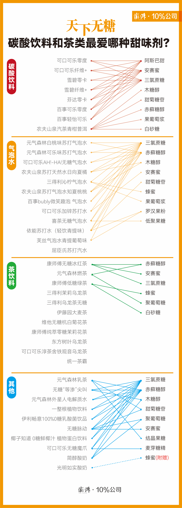

[澎湃新闻](https://sspai.com/link?target=https%3A%2F%2Fwww.thepaper.cn%2FnewsDetail_forward_22291699)

-   关联阅读：[阿斯巴甜「致癌」了，但你其实（暂时）没必要担心](https://sspai.com/post/80856)

#### 禁止吃：酒

每天喝多少酒合适？这件事在坊间争论不休，有人说「小酌怡情，大饮伤身」，每天一口小酒，「软化血管，身体更健康」，有人说沾酒就伤身，但到底孰是孰非呢？

关于饮酒量，学术界给出的答案也在不断演化。先是在 2018 年，医学顶刊《柳叶刀》一项 60 万样本研究报告指出5，成年男女饮酒的安全上限为每周酒精摄入量不超过 100 克。4 个月之后，全球疾病负担研究（以下简称为「2019-GBD 研究」）论断「酒精安全剂量为 0」6。

而就在去年（2022 年）全球疾病负担研究给出了新的建议7：40 岁以上无基础病的人群，每天喝酒半杯到 1 杯，可能有益于降低糖尿病、心血管疾病、中风等风险。对于 15-39 岁的年轻人而言，喝酒无益，1 杯酒就可能带来健康隐患。

总的来看，还是不建议饮酒。尽管 40 岁以上适当饮酒有利健康，可前提条件是没有基础病。人过中年，身体状态会大打折扣，对于饮酒还是小心为妙。

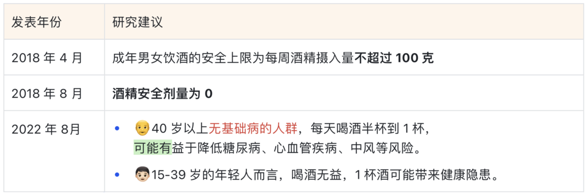

### 绿灯食物

盐、糖吃得多会影响身体健康，而有些食物吃少了也会影响健康。

《中国居民膳食指南科学研究报告》中汇总了与主要健康结局风险降低相关联的膳食因素主要有：全谷物、蔬菜、水果、大豆及其制品、奶类及其制品、鱼肉、坚果、饮水（饮茶）等。

#### 全谷物

全谷物可以降低全因死亡风险；增加全谷物的摄入量可以降低心血管疾病，2 型糖尿病、结肠直癌发病风险；全谷物的摄入也有助于维持正常体重、延缓体重增长。

我国居民膳食结构以谷物为主，**但谷物以精致米面为主，全谷物及杂粮摄入不足**，只有 20% 左右的成人能达到日均 50g 以上；品种多为小米和玉米，还需要更为丰富。

什么是全谷物？全谷物包含谷皮、糊粉层、胚乳和谷胚四个部分。全谷物全谷物含有胚乳、胚芽和皮层的谷物。与精制谷物相对应，精制谷物只含有胚乳。糙米、全麦、燕麦、小米、玉米都是全谷物，而我们常吃的大米、白面都是精制谷物。

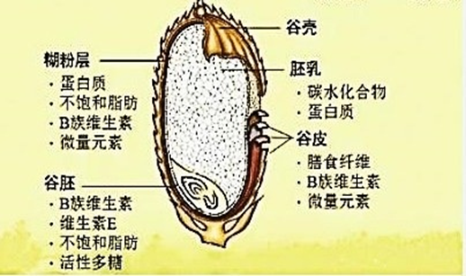

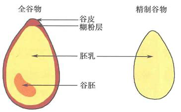

**是不是全麦要看配料表**，配料表中的配料是按照配料所占的比例进行排列。如果配料表中的第一位不是全麦粉或者黑全麦粉，那就要小心购买。根据中国营养学会发布的团体标准《全谷物及全谷物食品判定及标识通则》（T/CNSS 008-2021），全谷物食品配方中含有全谷物原料，且其质量占成品质量的比例不少于 51%的食品（以干基计）。有些食物名称听起来营养丰富，看配料表才能发现其庐山真面目。比如我们熟知的八宝粥，糖的含量大于谷物的含量。

下面是某品牌的配料表，配料表的第一名是水，第二名就是白砂糖。

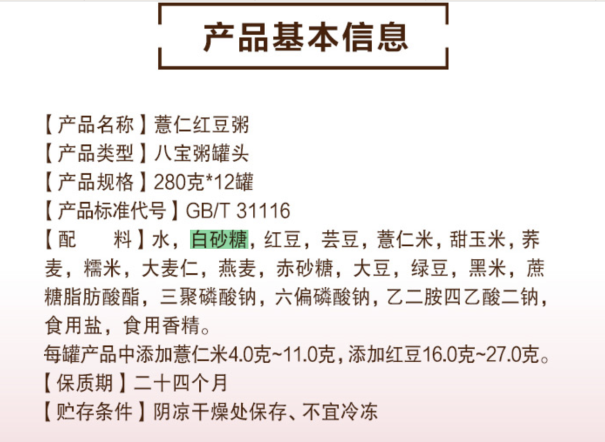

**预制糙米省时便利**。

糙米属于全谷物，在做饭时，我们可以在大米中掺入些糙米，保证全谷物的摄入量。糙米虽然营养丰富，但是需要提前浸泡一夜才能够方便成熟，做饭用并不方便。现在，市面上出现了预制糙米，根据一篇专利显示的内容8，预制糙米帮我们完成了糙米浸泡的过程，对浸泡过的糙米进行加热烘干，待蛋白质变性之后，再将米烘干制成糙米。

我就曾购买食用过糙米，口感上和正常糙米没有异样，操作流程上精简太多，不需要提前泡制，煮制过程和正常米饭一样。如果你不想购买糙米，也可以提前多做点糙米饭，分小包装冷冻在冰箱，等需要时拿出来在微波炉加热解冻即可。

### 黄灯食物

黄灯食物主要是指脂肪。脂肪并非是洪水猛兽，脂肪是身体重要的组成部分。初中的生物课本上就提到，细胞膜的主要组成是磷脂双分子层，里面就包含脂肪。脂肪是一个大家族，其中有些成员我们成员常见，有些成员少见，而那些陌生的成员，反而是更有益的。

化学上把不含 C=C 双键的脂肪酸称为饱和脂肪酸（所有的动物油除鱼油外都是饱和脂肪酸）；把含有 C=C 双键的脂肪酸称为不饱和脂肪酸。根据 C=C 双键的数量，我们又可以把脂肪酸分为单不饱和脂肪酸和多不饱和脂肪酸。就健康价值来讲，不饱和脂肪酸尤其是多不饱和脂肪酸，更为重要。

比如我们经常听到的 EPA 和 DHA 就都属于多不饱和脂肪酸。DHA是视网膜的重要组成部分，也是大脑细胞形成发育及运动不可缺少的物质基础。EPA 和 DHA 也能够调控身体内的炎症，因而对我们的健康大有裨益。EPA 和 DHA 主要存在深海鱼油当中，并不便于获取。生活中除食用三文鱼深海鱼之外，还可以通过鱼油进行补充。

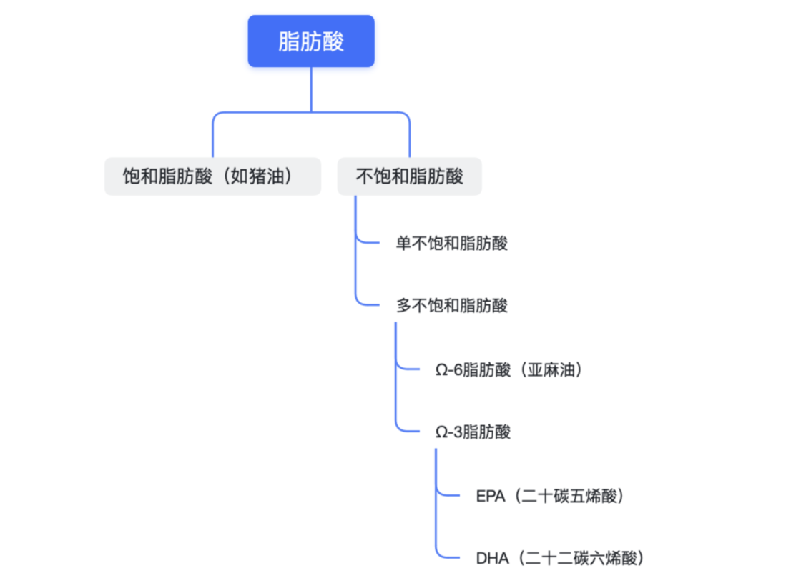

### 善用补剂

如果在生活中增加绿灯和优质黄灯食物的摄入，减少红灯食物，我们健康饮食就上了一个大台阶。单从日常饮食中也能够获得每日必须的营养元素。但对于上班一族来讲，没时间做饭，饮食摄入又常常受外卖限制，营养元素摄入不充分，便可以考虑借助补剂，增加营养摄入。

市面上的营养元素繁多，我们主要关注复合维生素和鱼油即可。因为就前面的分析，维生素和多不饱和脂肪酸国人容易缺乏。至于其他种类的补剂，我们需要具体问题具体分析。但总的来讲，保健品不是药品，无法治疗疾病。

### 小结

红灯食物有盐、酒、糖，绿灯食物有谷物、蔬菜和水果，黄灯食物是脂肪。那如何将红绿灯食物融入到食谱中，真正做到健康饮食呢？我们接着往下看。

|     |     |     |
| --- | --- | --- |
| 🔴 **红灯食物** | 🟢 **绿灯食物** | **🟡 黄灯食物** |
| 盐 酒 糖 | 谷物 蔬菜 水果 | 脂肪  |

## 中国版「地中海饮食」

说起健康饮食，人们常常提及地中海饮食。地中海饮食主要是以意大利南部、希腊的大部分地区，尤其是克利特岛的居民膳食结构为基础形成的一种特点鲜明的饮食模式。该膳食模式的特点是食物多样、清淡和加工简单，营养素丰富，单不饱和脂肪酸（橄榄油）和膳食纤维（全谷物）的摄入量很高。

尽管地中海饮食健康，但其中的食物（如原材料）在国内并不方便获取，且烹调方式以生冷凉拌为主，不适合中国胃。因而，地中海饮食在国内知名度高，但推广程度并不高。

那是否有适合中国人的健康饮食呢？当然有，那就是「中国心脏健康饮食」。「中国心脏健康膳食」是由北京大学北京大学临床研究所自主研发的符合中国饮食文化特点的一种健康膳食模式。研究团队通过对日常食材的科学搭配和对传统中餐烹饪方法的改进，为中国人及喜好中餐的国际友人提供了一种好吃不贵、又健康的膳食选择。在严格随机对照试验中，经过 1 个月的饮食干预，与接受当地常规膳食的对照组相比，接受「中国心脏健康膳食」的干预组收缩压平均净下降 10mmHg，舒张压平均净下降 3.8mmHg。

「中国心脏健康」包含鲁菜、淮扬菜、粤菜、川菜四个「版本」，能够满足不同口味人的需求。下面是研究中提供的鲁菜一天食谱示例。我们发现其食谱安排正好符合我们前面所述：减少了红灯食物的摄入，增加了绿灯食物和优质的黄灯食物。

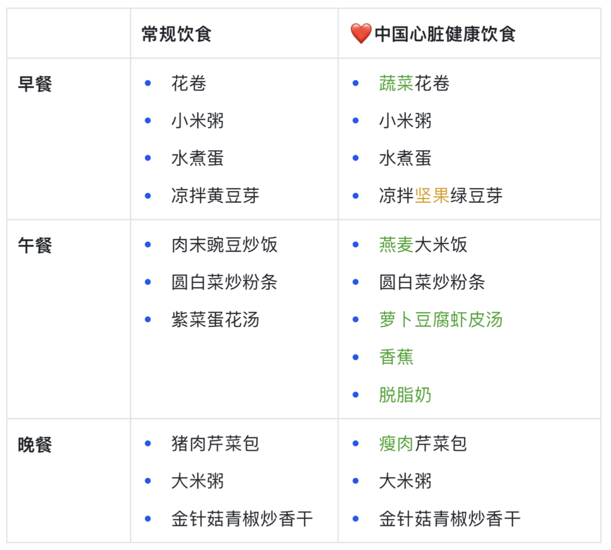

「中国心脏健康饮食」让我们看到了本土的中国菜也能吃出健康来。遗憾的是，研究团队并未呈现四大菜系的全部菜谱。但论文中给出了「中国心脏健康食谱」的设计原则和策略，大家可以根据下面的设计原则自行设计健康食谱。

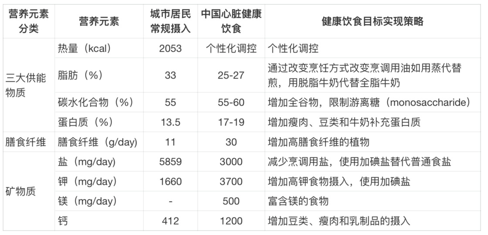

## 记录饮食

当我们想要更好地了解自己的饮食情况时，便会寻找软件记录饮食。市面上的饮食记录软件不在少数，有包含丰富食物库的薄荷健康，有可以在网页端进行食物记录的 [MyFitnessPal](https://sspai.com/link?target=https%3A%2F%2Fwww.myfitnesspal.com%2Fzh-CN)，还有智能手表中支持饮食记录的运动健康 App。

记录饮食的 App 很多，可我们记录饮食仍然困难重重：时常忘记打卡记录饮食；记录饮食不知道重量；中国传统食物多包含很多材料，成分复杂。正是如此，主打饮食记录的**薄荷健康**，人均月度使用天数不足一周，仅为 5.33 天。

那应该如何解决这些问题呢？一条路是发展技术，赋能工具，发展更好的图像识别技术，自动识别食物种类；丰富食物库，便捷查找食物内容；建立饮食套餐便于一键记录吃的多种食物。这是目前主流的路，更多的人做食物记录的入口，成为撒手掌柜。但这条路收效甚微，难以长期坚持。

另一条路，是善假于物，成为更好的自己。我们不需要每天都记录我们的饮食，只需要记录一段时间的饮食，并能够对我们的饮食情况能够有大体的了解。记录时，我们可以先不管食物的重量、热量，先从食物的种类入手；相较于从 7 种营养元素（水、蛋白质、碳水、脂肪、矿物质、维生素、膳食纤维）分析我们的饮食情况，通过「我的餐盘」能够更方便的对我们的饮食进行监控。

### 记录方式

了解了通用的饮食理念和健康食谱，那么如何发现我们个人的饮食问题，并进行改善呢？记录是改善的第一步。

#### 我的餐盘

提到膳食指南，我们最先想到的是膳食金字塔。膳食金字塔是美国于 1992 年推出。2011 年美国政府最近推出了最新的饮食指南，将已使用了几十年的「食物金字塔」作废，代之以「**我的餐盘**」，这个改变受到很多学者的赞同，因为餐盘图比金字塔图更易懂，普通民众一看就能明白每天所需摄取的各类食物比例。

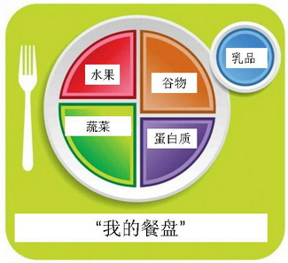

我们在每天吃饭的食物，也可以用「我的餐盘」检验自己吃的是否合格。但是有时候我们很难在一餐当中同时摄入水果、谷物、蔬菜以及蛋白质。此时，我们可以退而求其次，保证一天当中能够摄入 4 种类型的食物。比如中午吃米饭+鸡腿，摄入了谷物和蛋白质，那么可以在下午补充水果，在晚上吃个清淡麻辣烫补充蔬菜。

#### 抽样记录

即便饮食记录是一种便捷的记录方式，但要长年累月的记录，仍然比较麻烦，我们可以采用抽样记录方式。一周只挑选 3 天进行严格的饮食记录，来了解一周的摄入。为了保证饮食记录的代表性，需要在工作日挑选 2 天进行记录、周末挑选 1 天进行记录。

在进行 3 天的抽样饮食记录之后，我们就可以使用红绿灯食物卡尺，对我们的饮食进行分析、改善。

#### 饮食日记

谈到记录饮食，我们会想到使用薄荷健康类的饮食记录软件，严格地记录每天摄入的食物、重量来准确的了解自己每天的饮食摄入。想要准确地记录每天的食物摄入并不容易，一是食物成分复杂，二是食物重量难以确定，那么如何更好的了解个人的饮食情况？不妨尝试下饮食日记。

发表在《营养与饮食学会杂志》（Journal of the Academy of Nutrition and Dietetics）针对 123 人长期一年的研究显示9，与只进行低卡路里饮食结合运动训练控制组相比，勤于记录饮食日志的研究对象减重最多。饮食日记的内容简单，却十分有效。

> 亲爱的日记，今天早餐我喝了一杯草莓香蕉奶昔，零食吃了点樱桃和杏仁，午餐我吃了一个鸡肉牛油果卷。

比起逐个记录下我们今天的食物种类、克数，饮食日记的方法更加方便。通过记录，我们可以审视自己一天的饮食情况，进而在第二天能够更好的调整饮食。

为了更加方便的记录饮食，我制作了[一日三餐](https://sspai.com/link?target=https%3A%2F%2Fwww.icloud.com%2Fshortcuts%2F0498e97d36354baaac4c94883fd947b7)快捷指令，便于记录饮食。使用此快捷指令需要在备忘录中新建名称为一日三餐的备忘录。之后就可以正常调用此快捷指令，会以对话框的形式弹出早餐、午餐以及晚餐的内容记录。

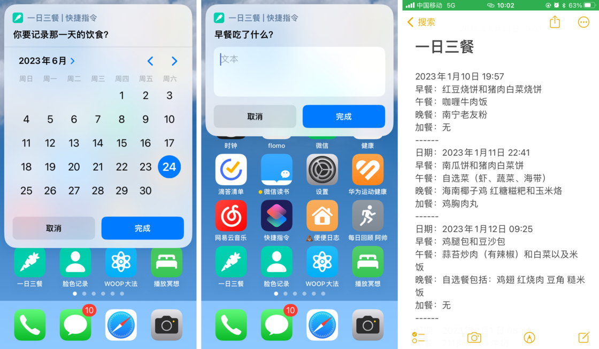

### 放过自己

最好是变好的敌人，我们不需要一开始就做到最好，而是包容我们在营养学知识中的不足，一点点迭代、优化，养成更好的饮食习惯。

严格的按照膳食餐盘饮食，有些强人所难。需要坚持才能执行膳食餐盘，而需要坚持的膳食指南，多半也会放弃。考虑到人非圣贤，总会嘴馋。考虑到这一点，美国膳食指南10中提出 15% 的「自由空间」：每天我们可以有 15% 的「自由空间」吃点油盐糖酒精等不太健康的食物。

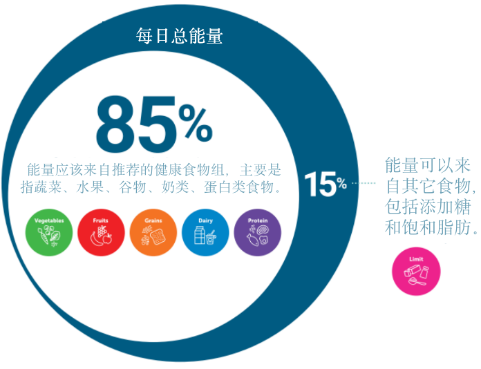

## 总结

饮食知识浩如烟海，借助红绿灯食物加减法，我们可以找到好好吃饭的入口。先将现有的食物分为红、绿、黄三类，对不同类别的采取不同的策略。对红灯食物做减法，减盐、减糖、禁酒；对绿灯食物做加法，除了我们熟知的多吃蔬菜水果，还要增加全谷物的摄入，如糙米和小米。对于黄灯食物的中间派，我们要找到适合优质的黄灯食物增加摄入，比如富含多不饱和脂肪酸的鱼油。

以上的建议是通用、粗放的建议，如果想要拥有更个性的饮食方案，记录饮食是第一步。为了方便记录，我们可以采取抽样记录的方式，挑选周一到周五中的两天和周末中的一天进行记录。如果你是苹果手机用户，还可以借助我制作的一日三餐快捷指令，格式化记录饮食。

改变饮食无法一蹴而就，其是个渐变的过程。改善饮食的过程中，我们需要保持耐心，日躬一足。这周开始吃更多的水果，下周开始摄入坚果。改变饮食需要花些精力，耗些时间，但我们因此有了慢慢和身体与生活打交道的机会，能够好好认识自己，品味生活。

\> 下载少数派 [客户端](https://sspai.com/page/client)、关注 [少数派小红书](https://sspai.com/link?target=https%3A%2F%2Fwww.xiaohongshu.com%2Fuser%2Fprofile%2F63f5d65d000000001001d8d4)，感受精彩数字生活 🍃

\> 实用、好用的 [正版软件](https://sspai.com/mall)，少数派为你呈现 🚀

-   1中国营养学会中国居民膳食指南科学报告工作组. 《〈中国居民膳食指南科学研究报告（2021）〉简介》. 营养学报 43, 期 01 (2021年): 1–2.
-   2Sheiham, Aubrey, 和W Philip T James. 《A New Understanding of the Relationship between Sugars, Dental Caries and Fluoride Use: Implications for Limits on Sugars Consumption》. Public Health Nutrition 17, 期 10 (2014年10月): 2176–84.
-   3世界卫生组织. 《WHO 成人和儿童糖摄入量》. 日内瓦, 2015年.
-   4Witkowski, Marco, Ina Nemet, Hassan Alamri, Jennifer Wilcox, Nilaksh Gupta, Nisreen Nimer, Arash Haghikia, 等. 《The Artificial Sweetener Erythritol and Cardiovascular Event Risk》. Nature Medicine 29, 期 3 (2023年3月): 710–18.
-   5Wood, Angela M., Stephen Kaptoge, Adam S. Butterworth, Peter Willeit, Samantha Warnakula, Thomas Bolton, Ellie Paige, 等. 《Risk Thresholds for Alcohol Consumption: Combined Analysis of Individual-Participant Data for 599 912 Current Drinkers in 83 Prospective Studies》. Lancet (London, England) 391, 期 10129 (2018年4月14日): 1513–23.
-   6GBD 2016 Alcohol Collaborators. 《Alcohol Use and Burden for 195 Countries and Territories, 1990-2016: A Systematic Analysis for the Global Burden of Disease Study 2016》. Lancet (London, England) 392, 期 10152 (2018年9月22日): 1015–35.
-   7Bryazka, Dana, Marissa B. Reitsma, Max G. Griswold, Kalkidan Hassen Abate, Cristiana Abbafati, Mohsen Abbasi-Kangevari, Zeinab Abbasi-Kangevari, 等. 《Population-Level Risks of Alcohol Consumption by Amount, Geography, Age, Sex, and Year: A Systematic Analysis for the Global Burden of Disease Study 2020》. The Lancet400, 期 10347 (2022年7月16日): 185–235.
-   8郭玉宝, 魏秦, 许子鑫和刘昕煜. 一种预制糙米的制备方法及糙米饭的蒸煮方法, issued 2021年.
-   9Kong, Angela, Shirley A.A. Beresford, Catherine M. Alfano, Karen E. Foster-Schubert, Marian L. Neuhouser, Donna B. Johnson, Catherine Duggan, 等. 《Self-Monitoring and Eating-Related Behaviors Are Associated with 12-Month Weight Loss in Postmenopausal Overweight-to-Obese Women》. Journal of the Academy of Nutrition and Dietetics112, 期 9 (2012年9月): 1428–35.
-   10Snetselaar, Linda G., Janet M. de Jesus, Dana M. DeSilva和Eve E. Stoody. 《Dietary Guidelines for Americans, 2020–2025》. Nutrition Today 56, 期 6 (2021年): 287–95.
