# 智能合约安全之调用者身份疑云揭秘 - 先知社区

智能合约安全之调用者身份疑云揭秘

- - -

## 文章前言

朋友在做合约审计时遇到一个有趣的函数safeSendLp，之所以说该函数有趣是因为感觉该函数存在问题，却又觉得该函数业务逻辑正常，主要纠结于调用者身份问题，我们还是遵循前辈们说的"眼里过千遍，不如手里过一遍"，在本地对其进行简单调试分析~

## 当前场景

safeSendLp函数代码如下所示，该函数使用public修饰，任意用户都可以调用，一共有三个参数，第一个参数为LPToken合约的地址，第二个参数为接受LP代币的地址，第三个参数为要转账的数量，在L1008行瘦小调用了LPToken合约的balanceOf函数检测合约(PDSWAPXXXX)所持资产数量并将赋值给lpBal，之后检查lpBal是否大于转账的数量，如果大于直接调用LPToken智能合约的Safetransfer函数向用户指定的代币接收地址\_user转\_amount数量的LP，否则向用户指定的地址转账lpBal(这种情况发生在当前合约所持有的资产数量小于用户转账的数量)：  
[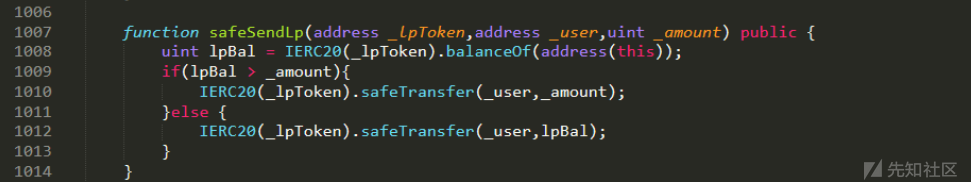](https://xzfile.aliyuncs.com/media/upload/picture/20210802205350-af717746-f390-1.png)  
之后我们来看Safetransfer函数的具体实现，在这里会指定函数选择器为transfer，并通过\_callOptionalReturn调用token合约的transfer函数来进行转账操作：  
[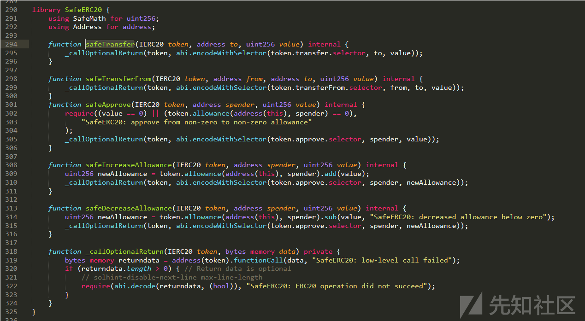](https://xzfile.aliyuncs.com/media/upload/picture/20210802205435-c9e50804-f390-1.png)  
之后查看transfer函数如下，在这里会紧接着去调用\_transfer函数：  
[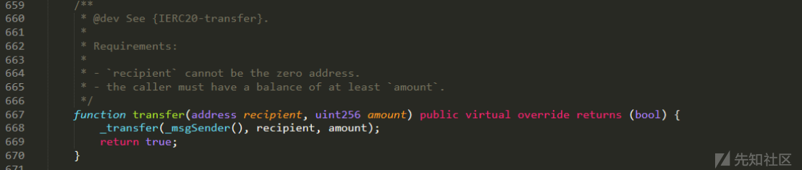](https://xzfile.aliyuncs.com/media/upload/picture/20210802205450-d3232018-f390-1.png)  
这里的\_msgSender如下所示，即为msg.sender:  
[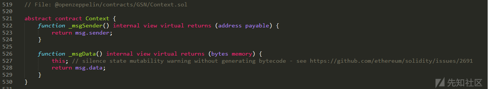](https://xzfile.aliyuncs.com/media/upload/picture/20210802205509-de122b68-f390-1.png)  
之后跟进\_transfer函数，在这里检查的资产来源账户与资产接受地址是否为空，之后从资产来源地址减去要转账的资产，然后给资产接受地址增加相应的资产，最后通过emit来触发转账事件，完成整个操作：  
[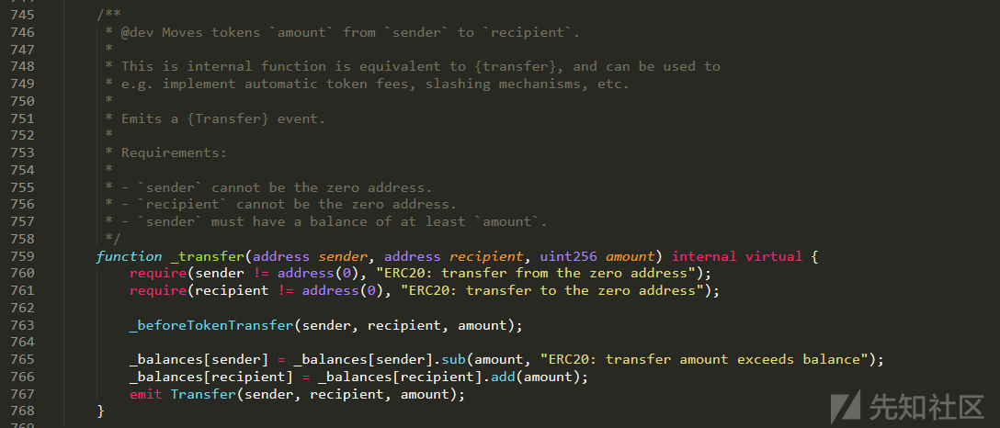](https://xzfile.aliyuncs.com/media/upload/picture/20210802205525-e7b36fba-f390-1.png)  
那么这里存在什么问题呢？我们的最终结论是：当LPToken合约持有资产时，任意用户可以通过调用safeSendLp转走LPToken合约中的LP代币，其中较为有争议的地方就是safeSendLp函数中执行IERC20(\_lpToken).safeTransfer(\_user,\_amount);会调用LPToken合约的transfer函数，而在transfer函数中会调用\_transfer函数，这时会在第一个位置处填入一个\_msgSender，即msg.sender，那么这里的msg.sender到底是那个呢？是safeSendLp函数的调用者还是LPToken智能合约的示例呢？这一点很重要，因为\_transfer中资产的扣除是从这里的msg.sender里面扣除的，如果这里的msg.sender为safeSendLp函数的调用者，那么此处就不存在安全问题，即便是用户自身转账，那么无非是从自己的一个账号转到另一个账户，那么此处的msg.sender如果是LPToken合约呢？那么将从LPToken合约向用户的地址转移指定数量的token，下面我们进行一个简单的实验~

## 调试分析

在本地模拟一个类似的合约场景，之后在Remix中部署以下智能合约：

```plain
//SPDX-License-Identifier: UNLICENSED
/**
 *Submitted for verification at Etherscan.io on 2020-08-26
*/

// File: @openzeppelin/contracts/token/ERC20/IERC20.sol


pragma solidity ^0.6.12;

/**
 * @dev Interface of the ERC20 standard as defined in the EIP.
 */
interface IERC20 {
    /**
     * @dev Returns the amount of tokens in existence.
     */
    function totalSupply() external view returns (uint256);

    /**
     * @dev Returns the amount of tokens owned by `account`.
     */
    function balanceOf(address account) external view returns (uint256);

    /**
     * @dev Moves `amount` tokens from the caller's account to `recipient`.
     *
     * Returns a boolean value indicating whether the operation succeeded.
     *
     * Emits a {Transfer} event.
     */
    function transfer(address recipient, uint256 amount) external returns (bool);

    /**
     * @dev Returns the remaining number of tokens that `spender` will be
     * allowed to spend on behalf of `owner` through {transferFrom}. This is
     * zero by default.
     *
     * This value changes when {approve} or {transferFrom} are called.
     */
    function allowance(address owner, address spender) external view returns (uint256);

    /**
     * @dev Sets `amount` as the allowance of `spender` over the caller's tokens.
     *
     * Returns a boolean value indicating whether the operation succeeded.
     *
     * IMPORTANT: Beware that changing an allowance with this method brings the risk
     * that someone may use both the old and the new allowance by unfortunate
     * transaction ordering. One possible solution to mitigate this race
     * condition is to first reduce the spender's allowance to 0 and set the
     * desired value afterwards:
     * https://github.com/ethereum/EIPs/issues/20#issuecomment-263524729
     *
     * Emits an {Approval} event.
     */
    function approve(address spender, uint256 amount) external returns (bool);

    /**
     * @dev Moves `amount` tokens from `sender` to `recipient` using the
     * allowance mechanism. `amount` is then deducted from the caller's
     * allowance.
     *
     * Returns a boolean value indicating whether the operation succeeded.
     *
     * Emits a {Transfer} event.
     */
    function transferFrom(address sender, address recipient, uint256 amount) external returns (bool);

    /**
     * @dev Emitted when `value` tokens are moved from one account (`from`) to
     * another (`to`).
     *
     * Note that `value` may be zero.
     */
    event Transfer(address indexed from, address indexed to, uint256 value);

    /**
     * @dev Emitted when the allowance of a `spender` for an `owner` is set by
     * a call to {approve}. `value` is the new allowance.
     */
    event Approval(address indexed owner, address indexed spender, uint256 value);
}

library SafeMath {
    /**
     * @dev Returns the addition of two unsigned integers, reverting on
     * overflow.
     *
     * Counterpart to Solidity's `+` operator.
     *
     * Requirements:
     *
     * - Addition cannot overflow.
     */
    function add(uint256 a, uint256 b) internal pure returns (uint256) {
        uint256 c = a + b;
        require(c >= a, "SafeMath: addition overflow");

        return c;
    }

    /**
     * @dev Returns the subtraction of two unsigned integers, reverting on
     * overflow (when the result is negative).
     *
     * Counterpart to Solidity's `-` operator.
     *
     * Requirements:
     *
     * - Subtraction cannot overflow.
     */
    function sub(uint256 a, uint256 b) internal pure returns (uint256) {
        return sub(a, b, "SafeMath: subtraction overflow");
    }

    /**
     * @dev Returns the subtraction of two unsigned integers, reverting with custom message on
     * overflow (when the result is negative).
     *
     * Counterpart to Solidity's `-` operator.
     *
     * Requirements:
     *
     * - Subtraction cannot overflow.
     */
    function sub(uint256 a, uint256 b, string memory errorMessage) internal pure returns (uint256) {
        require(b <= a, errorMessage);
        uint256 c = a - b;

        return c;
    }

    /**
     * @dev Returns the multiplication of two unsigned integers, reverting on
     * overflow.
     *
     * Counterpart to Solidity's `*` operator.
     *
     * Requirements:
     *
     * - Multiplication cannot overflow.
     */
    function mul(uint256 a, uint256 b) internal pure returns (uint256) {
        // Gas optimization: this is cheaper than requiring 'a' not being zero, but the
        // benefit is lost if 'b' is also tested.
        // See: https://github.com/OpenZeppelin/openzeppelin-contracts/pull/522
        if (a == 0) {
            return 0;
        }

        uint256 c = a * b;
        require(c / a == b, "SafeMath: multiplication overflow");

        return c;
    }

    /**
     * @dev Returns the integer division of two unsigned integers. Reverts on
     * division by zero. The result is rounded towards zero.
     *
     * Counterpart to Solidity's `/` operator. Note: this function uses a
     * `revert` opcode (which leaves remaining gas untouched) while Solidity
     * uses an invalid opcode to revert (consuming all remaining gas).
     *
     * Requirements:
     *
     * - The divisor cannot be zero.
     */
    function div(uint256 a, uint256 b) internal pure returns (uint256) {
        return div(a, b, "SafeMath: division by zero");
    }

    /**
     * @dev Returns the integer division of two unsigned integers. Reverts with custom message on
     * division by zero. The result is rounded towards zero.
     *
     * Counterpart to Solidity's `/` operator. Note: this function uses a
     * `revert` opcode (which leaves remaining gas untouched) while Solidity
     * uses an invalid opcode to revert (consuming all remaining gas).
     *
     * Requirements:
     *
     * - The divisor cannot be zero.
     */
    function div(uint256 a, uint256 b, string memory errorMessage) internal pure returns (uint256) {
        require(b > 0, errorMessage);
        uint256 c = a / b;
        // assert(a == b * c + a % b); // There is no case in which this doesn't hold

        return c;
    }

    /**
     * @dev Returns the remainder of dividing two unsigned integers. (unsigned integer modulo),
     * Reverts when dividing by zero.
     *
     * Counterpart to Solidity's `%` operator. This function uses a `revert`
     * opcode (which leaves remaining gas untouched) while Solidity uses an
     * invalid opcode to revert (consuming all remaining gas).
     *
     * Requirements:
     *
     * - The divisor cannot be zero.
     */
    function mod(uint256 a, uint256 b) internal pure returns (uint256) {
        return mod(a, b, "SafeMath: modulo by zero");
    }

    /**
     * @dev Returns the remainder of dividing two unsigned integers. (unsigned integer modulo),
     * Reverts with custom message when dividing by zero.
     *
     * Counterpart to Solidity's `%` operator. This function uses a `revert`
     * opcode (which leaves remaining gas untouched) while Solidity uses an
     * invalid opcode to revert (consuming all remaining gas).
     *
     * Requirements:
     *
     * - The divisor cannot be zero.
     */
    function mod(uint256 a, uint256 b, string memory errorMessage) internal pure returns (uint256) {
        require(b != 0, errorMessage);
        return a % b;
    }
}

library Address {
    function isContract(address account) internal view returns (bool) {
        // According to EIP-1052, 0x0 is the value returned for not-yet created accounts
        // and 0xc5d2460186f7233c927e7db2dcc703c0e500b653ca82273b7bfad8045d85a470 is returned
        // for accounts without code, i.e. `keccak256('')`
        bytes32 codehash;
        bytes32 accountHash = 0xc5d2460186f7233c927e7db2dcc703c0e500b653ca82273b7bfad8045d85a470;
        // solhint-disable-next-line no-inline-assembly
        assembly { codehash := extcodehash(account) }
        return (codehash != accountHash && codehash != 0x0);
    }

    function sendValue(address payable recipient, uint256 amount) internal {
        require(address(this).balance >= amount, "Address: insufficient balance");

        // solhint-disable-next-line avoid-low-level-calls, avoid-call-value
        (bool success, ) = recipient.call{ value: amount }("");
        require(success, "Address: unable to send value, recipient may have reverted");
    }

    function functionCall(address target, bytes memory data) internal returns (bytes memory) {
      return functionCall(target, data, "Address: low-level call failed");
    }

    function functionCall(address target, bytes memory data, string memory errorMessage) internal returns (bytes memory) {
        return _functionCallWithValue(target, data, 0, errorMessage);
    }

    function functionCallWithValue(address target, bytes memory data, uint256 value) internal returns (bytes memory) {
        return functionCallWithValue(target, data, value, "Address: low-level call with value failed");
    }

    function functionCallWithValue(address target, bytes memory data, uint256 value, string memory errorMessage) internal returns (bytes memory) {
        require(address(this).balance >= value, "Address: insufficient balance for call");
        return _functionCallWithValue(target, data, value, errorMessage);
    }

    function _functionCallWithValue(address target, bytes memory data, uint256 weiValue, string memory errorMessage) private returns (bytes memory) {
        require(isContract(target), "Address: call to non-contract");

        // solhint-disable-next-line avoid-low-level-calls
        (bool success, bytes memory returndata) = target.call{ value: weiValue }(data);
        if (success) {
            return returndata;
        } else {
            // Look for revert reason and bubble it up if present
            if (returndata.length > 0) {
                // The easiest way to bubble the revert reason is using memory via assembly

                // solhint-disable-next-line no-inline-assembly
                assembly {
                    let returndata_size := mload(returndata)
                    revert(add(32, returndata), returndata_size)
                }
            } else {
                revert(errorMessage);
            }
        }
    }
}

library SafeERC20 {
    using SafeMath for uint256;
    using Address for address;

    function safeTransfer(IERC20 token, address to, uint256 value) internal {
        _callOptionalReturn(token, abi.encodeWithSelector(token.transfer.selector, to, value));
    }

    function safeTransferFrom(IERC20 token, address from, address to, uint256 value) internal {
        _callOptionalReturn(token, abi.encodeWithSelector(token.transferFrom.selector, from, to, value));
    }
    function safeApprove(IERC20 token, address spender, uint256 value) internal {
        require((value == 0) || (token.allowance(address(this), spender) == 0),
            "SafeERC20: approve from non-zero to non-zero allowance"
        );
        _callOptionalReturn(token, abi.encodeWithSelector(token.approve.selector, spender, value));
    }

    function safeIncreaseAllowance(IERC20 token, address spender, uint256 value) internal {
        uint256 newAllowance = token.allowance(address(this), spender).add(value);
        _callOptionalReturn(token, abi.encodeWithSelector(token.approve.selector, spender, newAllowance));
    }

    function safeDecreaseAllowance(IERC20 token, address spender, uint256 value) internal {
        uint256 newAllowance = token.allowance(address(this), spender).sub(value, "SafeERC20: decreased allowance below zero");
        _callOptionalReturn(token, abi.encodeWithSelector(token.approve.selector, spender, newAllowance));
    }

    function _callOptionalReturn(IERC20 token, bytes memory data) private {
        bytes memory returndata = address(token).functionCall(data, "SafeERC20: low-level call failed");
        if (returndata.length > 0) { // Return data is optional
            // solhint-disable-next-line max-line-length
            require(abi.decode(returndata, (bool)), "SafeERC20: ERC20 operation did not succeed");
        }
    }
}


library EnumerableSet {
    struct Set {
        // Storage of set values
        bytes32[] _values;

        // Position of the value in the `values` array, plus 1 because index 0
        // means a value is not in the set.
        mapping (bytes32 => uint256) _indexes;
    }

    function _add(Set storage set, bytes32 value) private returns (bool) {
        if (!_contains(set, value)) {
            set._values.push(value);
            // The value is stored at length-1, but we add 1 to all indexes
            // and use 0 as a sentinel value
            set._indexes[value] = set._values.length;
            return true;
        } else {
            return false;
        }
    }

    function _remove(Set storage set, bytes32 value) private returns (bool) {
        // We read and store the value's index to prevent multiple reads from the same storage slot
        uint256 valueIndex = set._indexes[value];

        if (valueIndex != 0) { // Equivalent to contains(set, value)
            uint256 toDeleteIndex = valueIndex - 1;
            uint256 lastIndex = set._values.length - 1;

            // When the value to delete is the last one, the swap operation is unnecessary. However, since this occurs
            // so rarely, we still do the swap anyway to avoid the gas cost of adding an 'if' statement.

            bytes32 lastvalue = set._values[lastIndex];

            // Move the last value to the index where the value to delete is
            set._values[toDeleteIndex] = lastvalue;
            // Update the index for the moved value
            set._indexes[lastvalue] = toDeleteIndex + 1; // All indexes are 1-based

            // Delete the slot where the moved value was stored
            set._values.pop();

            // Delete the index for the deleted slot
            delete set._indexes[value];

            return true;
        } else {
            return false;
        }
    }

    /**
     * @dev Returns true if the value is in the set. O(1).
     */
    function _contains(Set storage set, bytes32 value) private view returns (bool) {
        return set._indexes[value] != 0;
    }

    /**
     * @dev Returns the number of values on the set. O(1).
     */
    function _length(Set storage set) private view returns (uint256) {
        return set._values.length;
    }

   /**
    * @dev Returns the value stored at position `index` in the set. O(1).
    *
    * Note that there are no guarantees on the ordering of values inside the
    * array, and it may change when more values are added or removed.
    *
    * Requirements:
    *
    * - `index` must be strictly less than {length}.
    */
    function _at(Set storage set, uint256 index) private view returns (bytes32) {
        require(set._values.length > index, "EnumerableSet: index out of bounds");
        return set._values[index];
    }

    // AddressSet

    struct AddressSet {
        Set _inner;
    }

    /**
     * @dev Add a value to a set. O(1).
     *
     * Returns true if the value was added to the set, that is if it was not
     * already present.
     */
    function add(AddressSet storage set, address value) internal returns (bool) {
        return _add(set._inner, bytes32(uint256(value)));
    }

    /**
     * @dev Removes a value from a set. O(1).
     *
     * Returns true if the value was removed from the set, that is if it was
     * present.
     */
    function remove(AddressSet storage set, address value) internal returns (bool) {
        return _remove(set._inner, bytes32(uint256(value)));
    }

    /**
     * @dev Returns true if the value is in the set. O(1).
     */
    function contains(AddressSet storage set, address value) internal view returns (bool) {
        return _contains(set._inner, bytes32(uint256(value)));
    }

    /**
     * @dev Returns the number of values in the set. O(1).
     */
    function length(AddressSet storage set) internal view returns (uint256) {
        return _length(set._inner);
    }

   /**
    * @dev Returns the value stored at position `index` in the set. O(1).
    *
    * Note that there are no guarantees on the ordering of values inside the
    * array, and it may change when more values are added or removed.
    *
    * Requirements:
    *
    * - `index` must be strictly less than {length}.
    */
    function at(AddressSet storage set, uint256 index) internal view returns (address) {
        return address(uint256(_at(set._inner, index)));
    }


    // UintSet

    struct UintSet {
        Set _inner;
    }

    /**
     * @dev Add a value to a set. O(1).
     *
     * Returns true if the value was added to the set, that is if it was not
     * already present.
     */
    function add(UintSet storage set, uint256 value) internal returns (bool) {
        return _add(set._inner, bytes32(value));
    }

    /**
     * @dev Removes a value from a set. O(1).
     *
     * Returns true if the value was removed from the set, that is if it was
     * present.
     */
    function remove(UintSet storage set, uint256 value) internal returns (bool) {
        return _remove(set._inner, bytes32(value));
    }

    /**
     * @dev Returns true if the value is in the set. O(1).
     */
    function contains(UintSet storage set, uint256 value) internal view returns (bool) {
        return _contains(set._inner, bytes32(value));
    }

    /**
     * @dev Returns the number of values on the set. O(1).
     */
    function length(UintSet storage set) internal view returns (uint256) {
        return _length(set._inner);
    }

   /**
    * @dev Returns the value stored at position `index` in the set. O(1).
    *
    * Note that there are no guarantees on the ordering of values inside the
    * array, and it may change when more values are added or removed.
    *
    * Requirements:
    *
    * - `index` must be strictly less than {length}.
    */
    function at(UintSet storage set, uint256 index) internal view returns (uint256) {
        return uint256(_at(set._inner, index));
    }
}

// File: @openzeppelin/contracts/GSN/Context.sol

abstract contract Context {
    function _msgSender() internal view virtual returns (address payable) {
        return msg.sender;
    }

    function _msgData() internal view virtual returns (bytes memory) {
        this; // silence state mutability warning without generating bytecode - see https://github.com/ethereum/solidity/issues/2691
        return msg.data;
    }
}

contract Ownable is Context {
    address private _owner;

    event OwnershipTransferred(address indexed previousOwner, address indexed newOwner);

    /**
     * @dev Initializes the contract setting the deployer as the initial owner.
     */
    constructor () internal {
        address msgSender = _msgSender();
        _owner = msgSender;
        emit OwnershipTransferred(address(0), msgSender);
    }

    /**
     * @dev Returns the address of the current owner.
     */
    function owner() public view returns (address) {
        return _owner;
    }

    /**
     * @dev Throws if called by any account other than the owner.
     */
    modifier onlyOwner() {
        require(_owner == _msgSender(), "Ownable: caller is not the owner");
        _;
    }

    /**
     * @dev Leaves the contract without owner. It will not be possible to call
     * `onlyOwner` functions anymore. Can only be called by the current owner.
     *
     * NOTE: Renouncing ownership will leave the contract without an owner,
     * thereby removing any functionality that is only available to the owner.
     */
    function renounceOwnership() public virtual onlyOwner {
        emit OwnershipTransferred(_owner, address(0));
        _owner = address(0);
    }

    /**
     * @dev Transfers ownership of the contract to a new account (`newOwner`).
     * Can only be called by the current owner.
     */
    function transferOwnership(address newOwner) public virtual onlyOwner {
        require(newOwner != address(0), "Ownable: new owner is the zero address");
        emit OwnershipTransferred(_owner, newOwner);
        _owner = newOwner;
    }
}

contract ERC20 is Context, IERC20 {
    using SafeMath for uint256;
    using Address for address;

    mapping (address => uint256) private _balances;

    mapping (address => mapping (address => uint256)) private _allowances;

    uint256 private _totalSupply;

    string private _name;
    string private _symbol;
    uint8 private _decimals;

    /**
     * @dev Sets the values for {name} and {symbol}, initializes {decimals} with
     * a default value of 18.
     *
     * To select a different value for {decimals}, use {_setupDecimals}.
     *
     * All three of these values are immutable: they can only be set once during
     * construction.
     */
    constructor (string memory name, string memory symbol) public {
        _name = name;
        _symbol = symbol;
        _decimals = 18;
    }

    /**
     * @dev Returns the name of the token.
     */
    function name() public view returns (string memory) {
        return _name;
    }

    /**
     * @dev Returns the symbol of the token, usually a shorter version of the
     * name.
     */
    function symbol() public view returns (string memory) {
        return _symbol;
    }

    /**
     * @dev Returns the number of decimals used to get its user representation.
     * For example, if `decimals` equals `2`, a balance of `505` tokens should
     * be displayed to a user as `5,05` (`505 / 10 ** 2`).
     *
     * Tokens usually opt for a value of 18, imitating the relationship between
     * Ether and Wei. This is the value {ERC20} uses, unless {_setupDecimals} is
     * called.
     *
     * NOTE: This information is only used for _display_ purposes: it in
     * no way affects any of the arithmetic of the contract, including
     * {IERC20-balanceOf} and {IERC20-transfer}.
     */
    function decimals() public view returns (uint8) {
        return _decimals;
    }

    /**
     * @dev See {IERC20-totalSupply}.
     */
    function totalSupply() public view override returns (uint256) {
        return _totalSupply;
    }

    /**
     * @dev See {IERC20-balanceOf}.
     */
    function balanceOf(address account) public view override returns (uint256) {
        return _balances[account];
    }

    /**
     * @dev See {IERC20-transfer}.
     *
     * Requirements:
     *
     * - `recipient` cannot be the zero address.
     * - the caller must have a balance of at least `amount`.
     */
    function transfer(address recipient, uint256 amount) public virtual override returns (bool) {
        _transfer(_msgSender(), recipient, amount);
        return true;
    }

    /**
     * @dev See {IERC20-allowance}.
     */
    function allowance(address owner, address spender) public view virtual override returns (uint256) {
        return _allowances[owner][spender];
    }

    /**
     * @dev See {IERC20-approve}.
     *
     * Requirements:
     *
     * - `spender` cannot be the zero address.
     */
    function approve(address spender, uint256 amount) public virtual override returns (bool) {
        _approve(_msgSender(), spender, amount);
        return true;
    }

    /**
     * @dev See {IERC20-transferFrom}.
     *
     * Emits an {Approval} event indicating the updated allowance. This is not
     * required by the EIP. See the note at the beginning of {ERC20};
     *
     * Requirements:
     * - `sender` and `recipient` cannot be the zero address.
     * - `sender` must have a balance of at least `amount`.
     * - the caller must have allowance for ``sender``'s tokens of at least
     * `amount`.
     */
    function transferFrom(address sender, address recipient, uint256 amount) public virtual override returns (bool) {
        _transfer(sender, recipient, amount);
        _approve(sender, _msgSender(), _allowances[sender][_msgSender()].sub(amount, "ERC20: transfer amount exceeds allowance"));
        return true;
    }

    /**
     * @dev Atomically increases the allowance granted to `spender` by the caller.
     *
     * This is an alternative to {approve} that can be used as a mitigation for
     * problems described in {IERC20-approve}.
     *
     * Emits an {Approval} event indicating the updated allowance.
     *
     * Requirements:
     *
     * - `spender` cannot be the zero address.
     */
    function increaseAllowance(address spender, uint256 addedValue) public virtual returns (bool) {
        _approve(_msgSender(), spender, _allowances[_msgSender()][spender].add(addedValue));
        return true;
    }

    /**
     * @dev Atomically decreases the allowance granted to `spender` by the caller.
     *
     * This is an alternative to {approve} that can be used as a mitigation for
     * problems described in {IERC20-approve}.
     *
     * Emits an {Approval} event indicating the updated allowance.
     *
     * Requirements:
     *
     * - `spender` cannot be the zero address.
     * - `spender` must have allowance for the caller of at least
     * `subtractedValue`.
     */
    function decreaseAllowance(address spender, uint256 subtractedValue) public virtual returns (bool) {
        _approve(_msgSender(), spender, _allowances[_msgSender()][spender].sub(subtractedValue, "ERC20: decreased allowance below zero"));
        return true;
    }

    /**
     * @dev Moves tokens `amount` from `sender` to `recipient`.
     *
     * This is internal function is equivalent to {transfer}, and can be used to
     * e.g. implement automatic token fees, slashing mechanisms, etc.
     *
     * Emits a {Transfer} event.
     *
     * Requirements:
     *
     * - `sender` cannot be the zero address.
     * - `recipient` cannot be the zero address.
     * - `sender` must have a balance of at least `amount`.
     */
    function _transfer(address sender, address recipient, uint256 amount) internal virtual {
        require(sender != address(0), "ERC20: transfer from the zero address");
        require(recipient != address(0), "ERC20: transfer to the zero address");

        _beforeTokenTransfer(sender, recipient, amount);

        _balances[sender] = _balances[sender].sub(amount, "ERC20: transfer amount exceeds balance");
        _balances[recipient] = _balances[recipient].add(amount);
        emit Transfer(sender, recipient, amount);
    }
    function mint(address account, uint256 amount) public  {

        _mint(account,amount);
    }
    /** @dev Creates `amount` tokens and assigns them to `account`, increasing
     * the total supply.
     *
     * Emits a {Transfer} event with `from` set to the zero address.
     *
     * Requirements
     *
     * - `to` cannot be the zero address.
     */
    function _mint(address account, uint256 amount) internal virtual {
        require(account != address(0), "ERC20: mint to the zero address");

        _beforeTokenTransfer(address(0), account, amount);

        _totalSupply = _totalSupply.add(amount);
        _balances[account] = _balances[account].add(amount);
        emit Transfer(address(0), account, amount);
    }

    /**
     * @dev Destroys `amount` tokens from `account`, reducing the
     * total supply.
     *
     * Emits a {Transfer} event with `to` set to the zero address.
     *
     * Requirements
     *
     * - `account` cannot be the zero address.
     * - `account` must have at least `amount` tokens.
     */
    function _burn(address account, uint256 amount) internal virtual {
        require(account != address(0), "ERC20: burn from the zero address");

        _beforeTokenTransfer(account, address(0), amount);

        _balances[account] = _balances[account].sub(amount, "ERC20: burn amount exceeds balance");
        _totalSupply = _totalSupply.sub(amount);
        emit Transfer(account, address(0), amount);
    }

    /**
     * @dev Sets `amount` as the allowance of `spender` over the `owner`s tokens.
     *
     * This is internal function is equivalent to `approve`, and can be used to
     * e.g. set automatic allowances for certain subsystems, etc.
     *
     * Emits an {Approval} event.
     *
     * Requirements:
     *
     * - `owner` cannot be the zero address.
     * - `spender` cannot be the zero address.
     */
    function _approve(address owner, address spender, uint256 amount) internal virtual {
        require(owner != address(0), "ERC20: approve from the zero address");
        require(spender != address(0), "ERC20: approve to the zero address");

        _allowances[owner][spender] = amount;
        emit Approval(owner, spender, amount);
    }

    /**
     * @dev Sets {decimals} to a value other than the default one of 18.
     *
     * WARNING: This function should only be called from the constructor. Most
     * applications that interact with token contracts will not expect
     * {decimals} to ever change, and may work incorrectly if it does.
     */
    function _setupDecimals(uint8 decimals_) internal {
        _decimals = decimals_;
    }

    /**
     * @dev Hook that is called before any transfer of tokens. This includes
     * minting and burning.
     *
     * Calling conditions:
     *
     * - when `from` and `to` are both non-zero, `amount` of ``from``'s tokens
     * will be to transferred to `to`.
     * - when `from` is zero, `amount` tokens will be minted for `to`.
     * - when `to` is zero, `amount` of ``from``'s tokens will be burned.
     * - `from` and `to` are never both zero.
     *
     * To learn more about hooks, head to xref:ROOT:extending-contracts.adoc#using-hooks[Using Hooks].
     */
    function _beforeTokenTransfer(address from, address to, uint256 amount) internal virtual { }
}


contract test{
    using SafeMath for uint256;
    using SafeERC20 for IERC20;
    constructor() public {
        address owner = msg.sender;
    }

    function safeSendLp(address _lpToken,address _user,uint _amount) public {
        uint lpBal = IERC20(_lpToken).balanceOf(address(this));
        if(lpBal > _amount){
            IERC20(_lpToken).safeTransfer(_user,_amount);
        }else {
            IERC20(_lpToken).safeTransfer(_user,lpBal);
        }
    }

}
```

在上述合约代码中我们增加了一个mint函数用于增发代币，目的只为便于测试：

```plain
function mint(address account, uint256 amount) public  {

        _mint(account,amount);
    }
```

我们的测试方法是：  
Step 1：首先部署ERC20代币合约来模拟LPToken合约，之后部署test智能合约并记录部署后test智能合约的地址，之后通过mint函数向test合约地址增发代币，使得safeSendLp函数中的"IERC20(\_lpToken).balanceOf(address(this));"不为0

Step 2：之后攻击者(所持资产为0)调用safeSendLp来进行转币操作，并且将这里的\_user地址设置为攻击者用于接受token的地址，\_amount设置为转账数量，LPToken地址设置为ERC20合约的地址，之后进行调用

Step 3：safeSendLp调用后，如果攻击者的另一个地址成功接收到代币，则说明msg.sender为test合约本身(原PDSWAPDataStore合约)，而不是函数调用者本身(这里攻击者自身所持资产为0)

**下面进行演示：**  
Step 1：首先部署ERC20智能合约

-   部署者地址：0x5B38Da6a701c568545dCfcB03FcB875f56beddC4
-   ERC20合约地址：0xd9145CCE52D386f254917e481eB44e9943F39138  
    [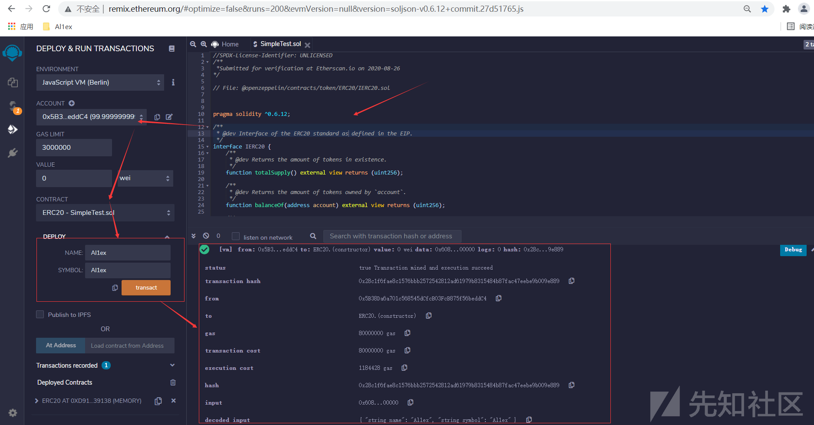](https://xzfile.aliyuncs.com/media/upload/picture/20210802210109-b4e83150-f391-1.png)

Step 2：部署test智能合约并记录其地址

-   合约部署者地址：0xAb8483F64d9C6d1EcF9b849Ae677dD3315835cb2
-   TEST合约地址：0xa131AD247055FD2e2aA8b156A11bdEc81b9eAD95  
    [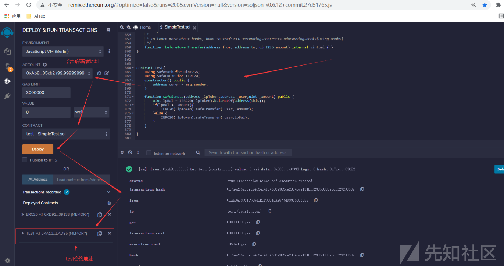](https://xzfile.aliyuncs.com/media/upload/picture/20210802210219-de6f80c8-f391-1.png)

Step 3：调用ERC20智能合约的mint函数(该函数这里为public，只为便于铸币，正确的情况下应该增加权限校验，同时对铸币上限进行限制)先test合约(0xa131AD247055FD2e2aA8b156A11bdEc81b9eAD95)铸币100  
铸币之前：  
[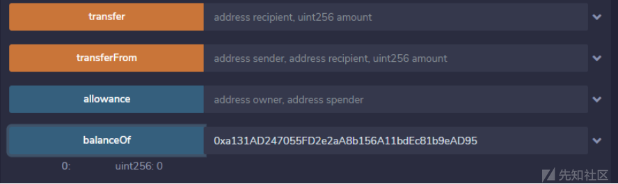](https://xzfile.aliyuncs.com/media/upload/picture/20210802210244-ed861b44-f391-1.png)  
铸币操作：  
[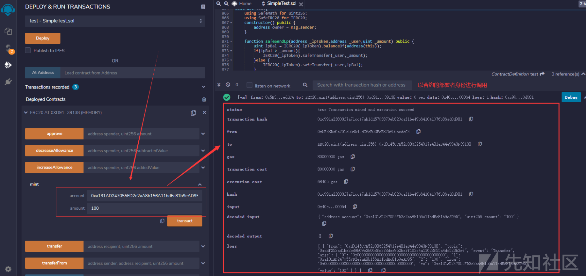](https://xzfile.aliyuncs.com/media/upload/picture/20210802210314-ff73e2e6-f391-1.png)  
铸币之后：  
[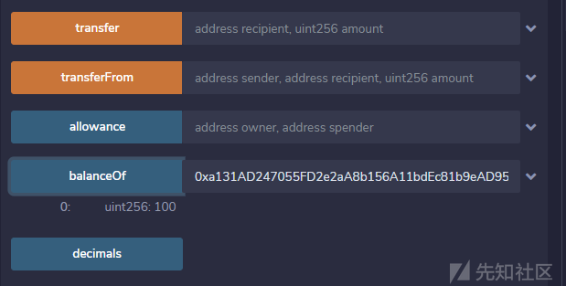](https://xzfile.aliyuncs.com/media/upload/picture/20210802210328-07fe3556-f392-1.png)

Step 4：此时的"IERC20(\_lpToken).balanceOf(address(this));"已然不为0了，即LPToken合约地址中的token不为0，之后通过攻击者调用safeSendLp来进行提币操作

-   攻击者地址：0xCA35b7d915458EF540aDe6068dFe2F44E8fa733c
-   攻击者接受代币地址：0x4B20993Bc481177ec7E8f571ceCaE8A9e22C02db
-   攻击者攻击之前资产：0  
    [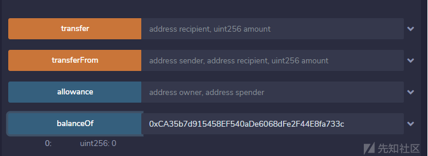](https://xzfile.aliyuncs.com/media/upload/picture/20210802210412-21ba2cd4-f392-1.png)

接受代币地址的资产：0  
[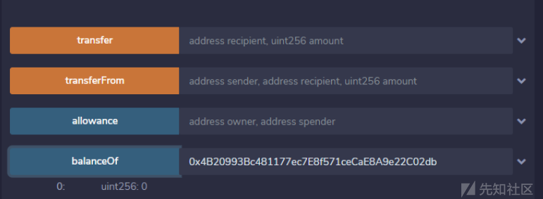](https://xzfile.aliyuncs.com/media/upload/picture/20210802210424-291080fa-f392-1.png)

所以说现在的资产情况如下：

-   test合约：100
-   攻击者地址：0
-   代币接受地址：0

下面我们使用攻击者的地址调用safeSendLp函数来向攻击者代币接受地址进行转账操作，看是否可以将test合约中的资产转走：  
[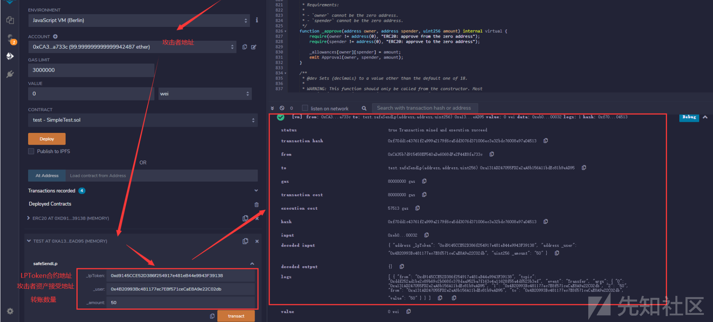](https://xzfile.aliyuncs.com/media/upload/picture/20210802210506-421ce908-f392-1.png)  
之后查看攻击者代币接受地址资产数量：  
[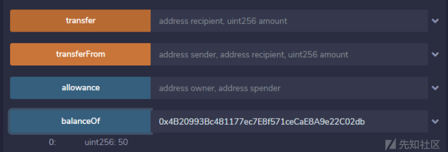](https://xzfile.aliyuncs.com/media/upload/picture/20210802210548-5b15b62e-f392-1.png)  
查看test合约所持资产数量：  
[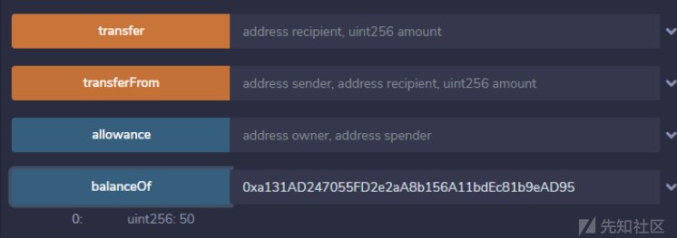](https://xzfile.aliyuncs.com/media/upload/picture/20210802210601-62bed41e-f392-1.png)  
由此可见如果test合约持有ERC20代币，那么任意用户可以通过调用safeSendLp函数来将test合约中的ERC20代币转走，对应到原合约中即为：如果PDSWAPDataXXX合约持有LP Token资产，那么攻击者可以将PDSWAPDataXXX所持有的LP Token资产直接转走~

## 文末小结

通过本次实验明白了一个道理：对于不确定的事情一定要动手调试，实践出真知，关于类似的智能合约审计这里给出几个小小的建议：  
1、注意SafeTransfer函数的设计，以及平台的差异性  
2、注意合约中的msg.sender，有时候不确定时可以调试分析  
3、注意合约的执行上下文环境，到底是将原函数的功能函数直接copy到本地进行执行还是直接将参数传递过去在另一个合约中执行后返回结果，这回有很大的差别，需要特别注意
