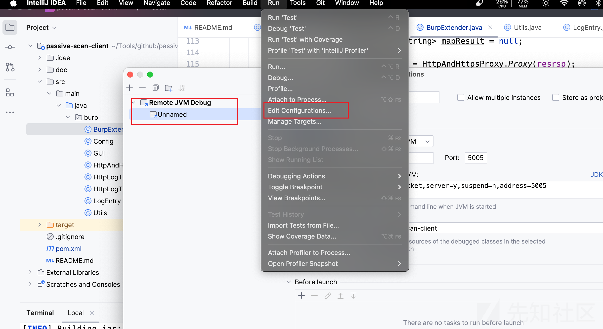
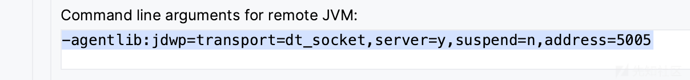
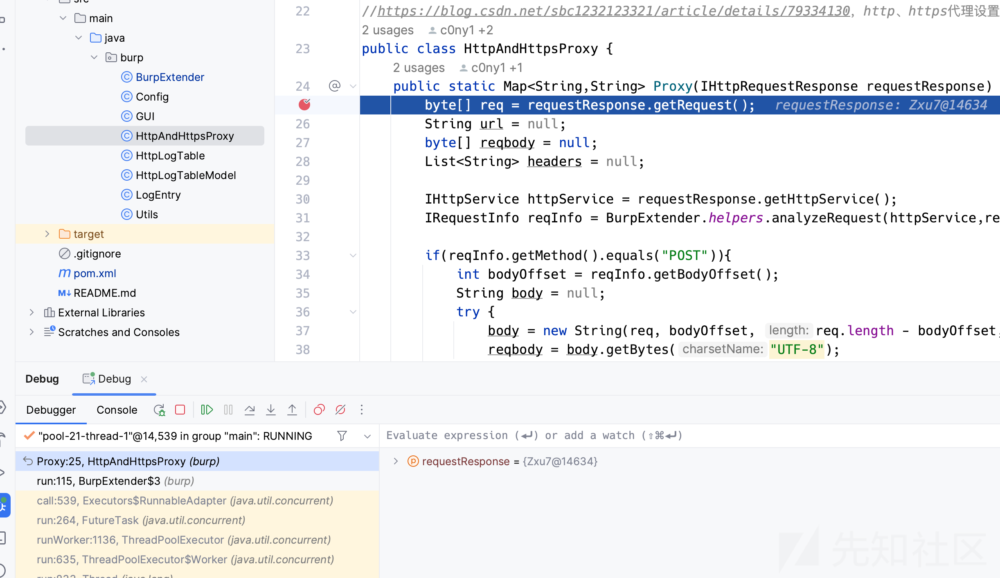
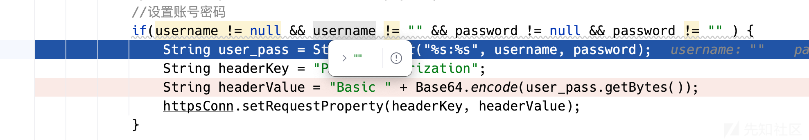
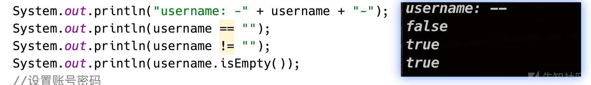
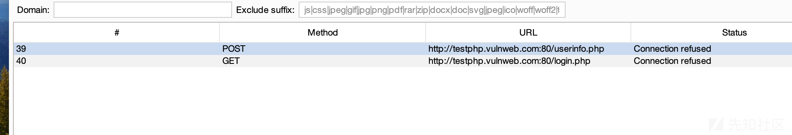
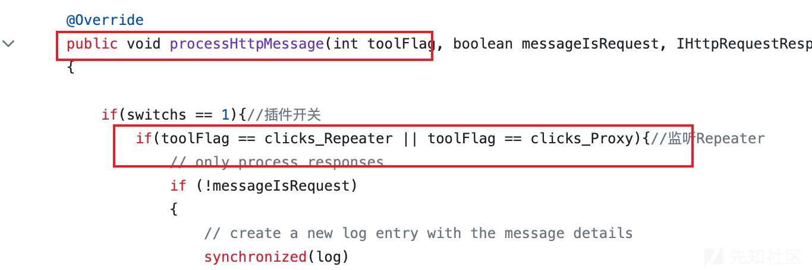
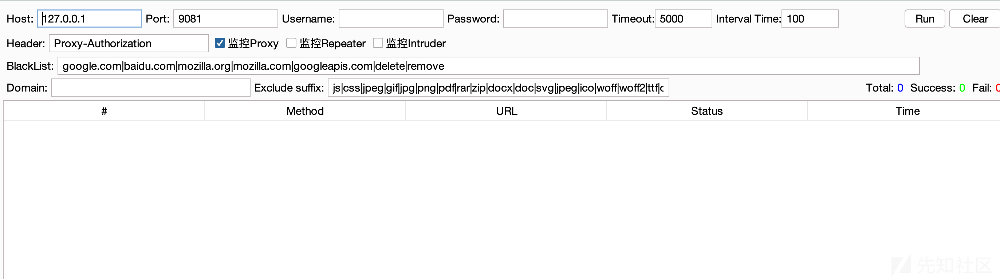

# 更优雅的BurpSuite被动扫描流量转发插件实现 - 先知社区

更优雅的BurpSuite被动扫描流量转发插件实现

- - -

## 背景

最近在为扫描器添加被动扫描模式，发现在 BurpSuite 中设置上游代理，`Intruder`、`Repeater` 模块也会走上游代理，这对于设置上游搞内网很合适，但对于被动扫描器来说有点不适合了，一般这两个模块都是手动测试时才会用到，这时流量都被转发到被动扫描器就不是很好了，会增加很多无用扫描（即使被动扫描器存在流量去重功能）。

找了一圈没发现 Burp 中可以设置这一块，想到[@c0ny1](https://github.com/c0ny1)师傅写过一个插件 [passive-scan-client](https://github.com/c0ny1/passive-scan-client) ，测试时发现，插件根本没有工作，[issues](https://github.com/c0ny1/passive-scan-client/issues)中也有这种情况反馈，修复之后测试发现和`Burp`中设置上游没什么两样。

## 排错

### IDEA 调试

在IDEA 配置远程调试  
[](https://xzfile.aliyuncs.com/media/upload/picture/20231109004533-3c3a3684-7e56-1.png)  
[](https://xzfile.aliyuncs.com/media/upload/picture/20231109004543-422281b4-7e56-1.png)  
简单起见，这里直接使用社区版作为调试, 命令行启动 Burp 社区版

```plain
java -agentlib:jdwp=transport=dt_socket,server=y,suspend=n,address=5005 -jar burpsuite_community_v2023.10.2.4.jar
```

生成 jar 文件

```plain
mvn package
```

BurpSuite中加载该插件，启动

然后IDEA 点击 Debug 启动刚才的配置 ，找个代码位置下个断点

访问测试网站，比如 [http://testphp.vulnweb.com/](http://testphp.vulnweb.com/) ，ok，IDEA 中已经可以看到拦截了。

[](https://xzfile.aliyuncs.com/media/upload/picture/20231109004832-a68c586e-7e56-1.png)

debug 时发现程序在`String headerValue = "Basic " + Base64.encode(user_pass.getBytes());` 这一行就直接结束了。

[](https://xzfile.aliyuncs.com/media/upload/picture/20231109005016-e4f30b0c-7e56-1.png)

神奇的一幕就发生了，明明是空，怎么就进来的？

老方法输出一下看看

[](https://xzfile.aliyuncs.com/media/upload/picture/20231109005133-12a63aba-7e57-1.png)  
所以不设置用户名、密码时这里会出错，这类应该使用`isEmpty()`函数进行判断。但是为什么debug 看到的也明明是空，`username`又不是 `null`，为什么会发生这种情况？

所有的这个判断都修改一下，先结束排错。

[](https://xzfile.aliyuncs.com/media/upload/picture/20231109005253-4276d326-7e57-1.png)

## 改造

该插件通过继承实现了`IProxyListener`中的`processProxyMessage`方法来实现获取请求信息，这个方法翻了一下官方 api，没有找到可以控制相关模块的地方。

官方 API 太难看了，不太友好，找了一会，各种搜索还是没发现，想到[@算命縖子](https://github.com/smxiazi)师傅有个[插件](https://github.com/smxiazi/xia_sql)，我用过类似功能

[](https://xzfile.aliyuncs.com/media/upload/picture/20231109005347-6296cd82-7e57-1.png)  
通过继承`IHttpListener`实现`processHttpMessage` 方法，该方法有个`int`参数,就是用来判断各种模块的，接下来就很简单了，通过 `toolFlag` 的值来进行判断是`Proxy`、`Intruder` 还是`Repeater` 模块。逻辑改好了。

```plain
@Override
public void processHttpMessage(int toolFlag, boolean messageIsRequest, IHttpRequestResponse messageInfo) {
        // 插件开启
        if (Config.IS_RUNNING && !messageIsRequest) {
            // 开启监控 Proxy，并且该消息是 Proxy 模块的
            if(Config.PROXY && toolFlag == IBurpExtenderCallbacks.TOOL_PROXY) {
            ......
```

`BurpExtender.this.callbacks.registerProxyListener(BurpExtender.this);`

修改为

`BurpExtender.this.callbacks.registerHttpListener(BurpExtender.this);`

剩下就是依葫芦画瓢增加 GUI 控制。具体的看代码这里就不贴了,地址: [https://github.com/yhy0/passive-scan-client](https://github.com/yhy0/passive-scan-client)

效果图：

[](https://xzfile.aliyuncs.com/media/upload/picture/20231109005405-6d3818b8-7e57-1.png)  
默认只会监控 `Proxy`模块，另外两个看情况开启，比如前端收集到一堆 api，这时通过`Intruder`模块进行 Fuzz，配合被动扫描器的比如 403 绕过，进行一起测试，非常巴适。

这里还将被动扫描器的Basic认证请求头单独拎出来了，可以自主设置，不然不看代码都不清楚这一块内容，还有就是[@c0ny1](https://github.com/c0ny1)师傅不知道基于怎样的考虑，将转发流量这一操作，每个流量间隔 5 秒钟，时间太长了，之前我都不知道这个时间是用来干嘛的，这里修改了一下默认 100 毫秒 。

整体下来没什么难度，修改后的插件也算是解决一个小痛点了，师傅们使用被动扫描器时可以使用该工具选择需要转发的数据。

相关代码已提交 pr，项目原地址：[https://github.com/c0ny1/passive-scan-client](https://github.com/c0ny1/passive-scan-client)

等不及的可以去这里拿：[https://github.com/yhy0/passive-scan-client](https://github.com/yhy0/passive-scan-client)

本人才疏学浅，如有疏漏之处，不吝赐教。

## 参考

[https://github.com/c0ny1/passive-scan-client](https://github.com/c0ny1/passive-scan-client)

[https://github.com/smxiazi/xia\_sql](https://github.com/smxiazi/xia_sql)
