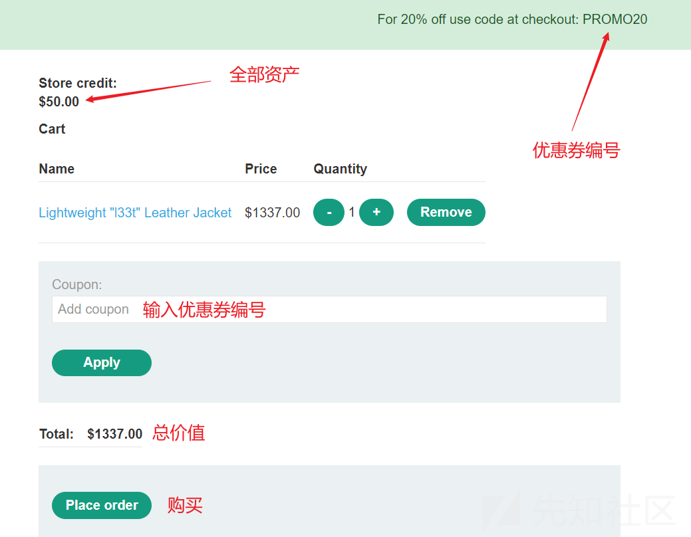

# 条件竞争的骚操作(一) - 先知社区

条件竞争的骚操作(一)

- - -

前言: 该篇文章会介绍多种关于条件竞争（也称并发）漏洞的利用，所用靶场为burpsuite靶场（[https://portswigger.net/web-security/race-conditions#limit-overrun-race-conditions](https://portswigger.net/web-security/race-conditions#limit-overrun-race-conditions) ）

# 什么是条件竞争

当网站在没有足够保护措施的情况下同时处理多个请求时，就会发生条件竞争，也就是说网站服务器来不及处理多余的请求，导致多个不同的线程同时与相同的数据交互，从而导致“冲突”，从而导致应用程序中出现意外行为。竞争条件攻击使用精心定时的请求来造成故意冲突，并利用这种意外行为来达到恶意目的。简单来讲即是，服务器没有能力同时处理那么多请求，导致某个请求“偷偷溜走”，进而导致多个请求成功。  
下图假设后端工作流程：

[](https://xzfile.aliyuncs.com/media/upload/picture/20240120184622-26b0a118-b781-1.png)  
那么可以思考当同时并发请求使用折扣券呢？（带着问题往下看）

# 哪里容易出现条件竞争漏洞

-   签到
-   积分领取
-   点赞
-   评论
-   优惠券  
    提取超过账户余额的钱  
    重复使用单个图形验证码  
    诸如此类限制单个用户只能领取一次或操作一次的功能点即可利用条件竞争让原本只能领取一份的礼品转而可以领取多次进而造成危害

# 利用手法

## 限制性条件竞争

入口：[https://portswigger.net/web-security/race-conditions/lab-race-conditions-limit-overrun](https://portswigger.net/web-security/race-conditions/lab-race-conditions-limit-overrun)  
通关要求：利用仅有的一张少额优惠券和50￥去购买一个价值1337￥的帅气夹克  
开始操作：

[](https://xzfile.aliyuncs.com/media/upload/picture/20240120101924-5454b4d4-b73a-1.png)

通过账号：wiener:peter 登录  
[](https://xzfile.aliyuncs.com/media/upload/picture/20240120101810-282893c6-b73a-1.png)  
在home页面点击夹克下方的view details 然后加入购物车

[](https://xzfile.aliyuncs.com/media/upload/picture/20240120102257-d2f61544-b73a-1.png)  
然后再回到购物车查看

[](https://xzfile.aliyuncs.com/media/upload/picture/20240120102328-e5fd9946-b73a-1.png)

[](https://xzfile.aliyuncs.com/media/upload/picture/20240120102511-22ed2a92-b73b-1.png)  
如果我们要用远低于物品价格的money去购买它那就必须要利用到优惠券了，但是优惠券这里限制了只能使用一次，很明显这里的解题思路是利用条件竞争让原本只能利用一次的优惠券利用多次，以至于其价格降到最低。  
这里有两种解法：  
①turbo intruder插件  
首先将优惠券编号填入，然后打开burpsuite开始抓包，然后点击apply

[](https://xzfile.aliyuncs.com/media/upload/picture/20240120103035-e47e088e-b73b-1.png)

[](https://xzfile.aliyuncs.com/media/upload/picture/20240120103048-ebd903ae-b73b-1.png)  
将抓到的数据包发送到turbo intruder（该插件在bp中的Bapp store中可直接搜索下载）

[](https://xzfile.aliyuncs.com/media/upload/picture/20240120103829-fe9f4150-b73c-1.png)

[](https://xzfile.aliyuncs.com/media/upload/picture/20240120103635-baf0052a-b73c-1.png)  
选择race-singe，将下方代码中的20改为100，这里的20表示发送20个包，因为我们需要得到更多的优惠券，并且是否成功也与运气相挂钩，因此可选择把默认20改大，那么成功的机率就会上升。最后点击attack

[](https://xzfile.aliyuncs.com/media/upload/picture/20240120104037-4b1822ae-b73d-1.png)  
通过回显判断请求成功了很多个

[](https://xzfile.aliyuncs.com/media/upload/picture/20240120104608-102d4830-b73e-1.png)  
然后将刚才抓到的数据包forward出去，把拦截也关了，再回到结算页面

[](https://xzfile.aliyuncs.com/media/upload/picture/20240120104730-40ebb808-b73e-1.png)  
可以看到只要24.07￥就可以购买了说明已经成功拿下  
②repeater  
同理抓取兑换优惠券的数据包之后发送到repeater，之后利用crtl R复制出多个同样的数据包，并将它们拉入同一个分组中，利用send group 同时发包也可以达到同样的效果，并且此方法成功率略高于方法一但是操作稍微麻烦一点

[](https://xzfile.aliyuncs.com/media/upload/picture/20240120105249-ff5cb148-b73e-1.png)

[](https://xzfile.aliyuncs.com/media/upload/picture/20240120105623-7ef247ce-b73f-1.png)

## 条件竞争绕过爆破频率限制

入口：[https://portswigger.net/web-security/race-conditions/lab-race-conditions-bypassing-rate-limits](https://portswigger.net/web-security/race-conditions/lab-race-conditions-bypassing-rate-limits)  
通关要求：登录calos用户删除carlos用户（限制了每个用户3次登录尝试）  
进入个人中心登录

[](https://xzfile.aliyuncs.com/media/upload/picture/20240120154846-57845dfc-b768-1.png)  
输入用户名calos 和密码 开始抓包，同样选中password发送到turbo intruder

[](https://xzfile.aliyuncs.com/media/upload/picture/20240120154825-4aea5042-b768-1.png)

因为我们要首先并发的同时又要实现每一个包对于的passwd都不一样的话就得稍微修改一下脚本

```plain
def queueRequests(target, wordlists):

    # as the target supports HTTP/2, use engine=Engine.BURP2 and concurrentConnections=1 for a single-packet attack
    engine = RequestEngine(endpoint=target.endpoint,
                           concurrentConnections=1,
                           engine=Engine.BURP2
                           )

    # 接收剪切板的内容
    passwords = wordlists.clipboard

    # queue a login request using each password from the wordlist
    # the 'gate' argument withholds the final part of each request until engine.openGate() is invoked
    for password in passwords:
        engine.queue(target.req, password, gate='1')

    # once every request has been queued
    # invoke engine.openGate() to send all requests in the given gate simultaneously
    engine.openGate('1')


def handleResponse(req, interesting):
    table.add(req)
```

[](https://xzfile.aliyuncs.com/media/upload/picture/20240120154457-cf0f7ed4-b767-1.png)  
选择examples然后将密码本复制完之后点击attack即可  
密码本：

```plain
123123
abc123
football
monkey
letmein
shadow
master
666666
qwertyuiop
123321
mustang
123456
password
12345678
qwerty
123456789
12345
1234
111111
1234567
dragon
1234567890
michael
x654321
superman
1qaz2wsx
baseball
7777777
121212
000000
```

观察响应码302为成功，同时我们可以观察到响应包中发出了不止3条不会被ban的数据回显  
[](https://xzfile.aliyuncs.com/media/upload/picture/20240120155127-b783a546-b768-1.png)

不过个人感受是：成功的机率较低，需多次尝试才可能成功

## 多端点条件竞争

入口：[https://portswigger.net/web-security/race-conditions/lab-race-conditions-multi-endpoint](https://portswigger.net/web-security/race-conditions/lab-race-conditions-multi-endpoint)  
通关要求：与第一个类似，但是优惠券需要自行购买，并且要买下夹克  
至于为什么叫多端点条件竞争，这里我们可以先尝试购买优惠券

[](https://xzfile.aliyuncs.com/media/upload/picture/20240120163654-10cd2072-b76f-1.png)

[](https://xzfile.aliyuncs.com/media/upload/picture/20240120163954-7c258544-b76f-1.png)  
可以发现提交订单和接收已付款成功的订单是在一个页面内完成，这说明确认订单和接收订单成功通知，是在一个请求/响应周期内完成的。 也就是说，购物车提交订单后，服务器会先验证订单是否合法(比如是否有足够的余额支付等)，因为服务器在后台调用了多个接口。又或者说攻击者同时向多个接口发送请求所以叫多端点条件竞争，这个漏洞的重点就是在于利用服务器校验订单的空隙对原有订单的商品进行修改，达到一个竞争的效果，简单来说就是生成支付订单过程中，我快速将购物车中的300￥的商品换5￥的商品。 最终导致以5￥完成了300+￥的订单

[](https://xzfile.aliyuncs.com/media/upload/picture/20240120161331-cc3591b8-b76b-1.png)  
接下来开始抓包 将添加夹克、移除夹克、添加优惠券、提交优惠价订单的数据包分别抓取并存放到同一个group中

[](https://xzfile.aliyuncs.com/media/upload/picture/20240120181648-05793662-b77d-1.png)

发送顺序:添加jacket->移除jacket->添加gift card->提交订单，并且确保每次购物车里都存在一张优惠券商品。 反复重复几次，直到成功为止，如此也就能实现上文提到的拿5￥买300￥的物品。

[](https://xzfile.aliyuncs.com/media/upload/picture/20240120182222-cc6cb596-b77d-1.png)

[](https://xzfile.aliyuncs.com/media/upload/picture/20240120182257-e1566dd0-b77d-1.png)  
另外还有另一种方式  
将支付优惠券的数据包和添加夹克的数据包放在同一个group中也能实现，其实道理都一样，就是卡着那个间隙。

[](https://xzfile.aliyuncs.com/media/upload/picture/20240120183444-870f6bb8-b77f-1.png)  
这里补充一下“竞争窗口”：竞争条件攻击使用精心定时的请求来造成故意冲突，并利用这种意外行为来达到恶意获利的目的，而可能发生碰撞的时间段称为“竞争窗口”。例如，这可能是与数据库的两次交互之间的几分之一秒。与其他逻辑缺陷一样，竞争条件的影响在很大程度上取决于应用程序及其发生的特定功能。

- - -

未完待续......  
下篇：条件竞争的骚操作(二)

1.  单端点条件竞争
2.  绕过时间戳重置密码
3.  部分构造条件竞争
4.  拓展内容：利用条件竞争上传webshell
