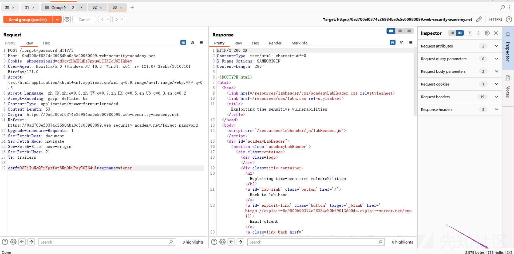
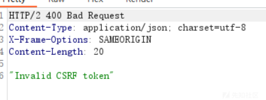
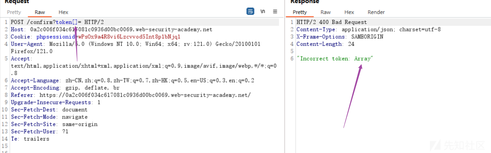

# 条件竞争的骚操作(二) - 先知社区

条件竞争的骚操作(二)

- - -

前言：延续上一篇文章 靶场依旧是bp的靶场入口：[https://portswigger.net/web-security/race-conditions#limit-overrun-race-conditions](https://portswigger.net/web-security/race-conditions#limit-overrun-race-conditions)

# 单端点条件竞争

靶场入口：[https://portswigger.net/web-security/race-conditions/lab-race-conditions-single-endpoint](https://portswigger.net/web-security/race-conditions/lab-race-conditions-single-endpoint)  
通关要求：更改账户的电子邮箱为任意邮箱地址，绕过邮箱验证  
一、题目让我们将carlos@ginandjuice.shop 绑定到我们的账户下，之后验证邮箱成为管理员用户（题目设定的）并删除carlos用户  
一开始我同时发送了两个绑定相同邮箱的地址之后在点击邮箱信息之后发现，该网站每次只存储一个待处理的电子邮件，其第二个若已绑定则会显示"This link is invalid."当提交更改邮件时，会对数据库中的邮件地址进行编辑，那么此刻就会出现竞争窗口

[](https://xzfile.aliyuncs.com/media/upload/picture/20240121210250-61f4c1fa-b85d-1.png)

[](https://xzfile.aliyuncs.com/media/upload/picture/20240121205751-afa69136-b85c-1.png)  
二、发送到repeater，由于我们需要将carlos@ginandjuice.shop绑定到当前账户，那么我们就需要利用条件竞争让原本转发到carlos@ginandjuice.shop的信息发到我们本身的邮箱（wiener%40exploit-0af200f804194d4080467fd8010f0002.exploit-server.net）

[](https://xzfile.aliyuncs.com/media/upload/picture/20240121210840-323b8b6e-b85e-1.png)  
三、构造两个数据包，第一个为向wiener%40exploit-0af200f804194d4080467fd8010f0002.exploit-server.net发送换绑信息的数据包（也就是我们自己的邮箱），第二个为管理员的邮箱（carlos@ginandjuice.shop）同样利用快捷键ctrl R复制出来即可 然后放到一个group里，如下图

[](https://xzfile.aliyuncs.com/media/upload/picture/20240121211228-b9fe44ce-b85e-1.png)

[](https://xzfile.aliyuncs.com/media/upload/picture/20240121211215-b2a5d6c4-b85e-1.png)

[](https://xzfile.aliyuncs.com/media/upload/picture/20240121211933-b7a15008-b85f-1.png)  
四、然后去邮箱看看

[](https://xzfile.aliyuncs.com/media/upload/picture/20240121212025-d6b15fc4-b85f-1.png)

[](https://xzfile.aliyuncs.com/media/upload/picture/20240121212052-e67f51ea-b85f-1.png)

[](https://xzfile.aliyuncs.com/media/upload/picture/20240121212221-1b7d0a4a-b860-1.png)

[](https://xzfile.aliyuncs.com/media/upload/picture/20240121212239-263df2c8-b860-1.png)

[](https://xzfile.aliyuncs.com/media/upload/picture/20240121212259-324c8980-b860-1.png)

[](https://xzfile.aliyuncs.com/media/upload/picture/20240121212315-3bb84c7a-b860-1.png)

# 绕过时间戳重置密码

入口：[https://portswigger.net/web-security/race-conditions/lab-race-conditions-exploiting-time-sensitive-vulnerabilities](https://portswigger.net/web-security/race-conditions/lab-race-conditions-exploiting-time-sensitive-vulnerabilities)  
通关条件：

-   识别网站生成密码重置令牌的方式中的漏洞。
-   获取用户的有效密码重置令牌carlos。
-   登录为carlos.
-   访问管理面板并删除用户carlos  
    该实验并不存在条件竞争问题但可以通过发送精心定时的请求来利用该机制的损坏的加密技术，毕竟都是跟时间相挂钩，因此我也归为一类。  
    一、首先正常进行密码重置并收到邮件，对多封邮箱进行比对发现其中带有token并且长度相同

[](https://xzfile.aliyuncs.com/media/upload/picture/20240121214627-7990b5c0-b863-1.png)  
这说明：

-   长度一致，说明它要么是某些数据散列、要么是某些字符串加密。
-   而token每次都不一样说明，在生成时包含了某些状态，比如计数器、时间戳  
    此时尝试了并发两个数据包，不过很显然肯定是失败了（题目已经提示了）每一次token都会变化，服务器并没有并行处理两个请求，依然是按顺序处理请求。

二、将重置密码的数据包发送到repeater然后复制一个出来，然后到数据包历史中将重置密码数据包中的get请求的cookies删除并发送出去，然后在响应中获取新的cookies和csrf（因为每一个csrf只能用一次）替换到新复制出来的数据包中，然后将它与原来的数据包加入同一个group 然后并发发送。

[](https://xzfile.aliyuncs.com/media/upload/picture/20240121222155-6e11d0a8-b868-1.png)

[](https://xzfile.aliyuncs.com/media/upload/picture/20240121221843-fb883afe-b867-1.png)  
此时就能发现bp相应包右下角的时间相同，也就绕过了时间戳，并且邮件中的token也是相同的，那么就印证了我们的猜想。

[](https://xzfile.aliyuncs.com/media/upload/picture/20240121222657-21ba18b8-b869-1.png)

[](https://xzfile.aliyuncs.com/media/upload/picture/20240121222712-2aef745a-b869-1.png)

[](https://xzfile.aliyuncs.com/media/upload/picture/20240121222005-2c67c43c-b868-1.png)  
三、那么接下来就是将其中一个数据包的user改为受害者即可修改受害者的密码

[](https://xzfile.aliyuncs.com/media/upload/picture/20240121223017-995753fe-b869-1.png)  
不过这个漏洞利用有点看运气，得反复尝试才能成功，得到邮件后修改密码即可登录受害者的账户啦

**问题1**：为什么要获取新的cookie和csrf？  
可以观察到数据包请求Cookie中包含了phpsessionid=xxx 说明网站后端使用了php语言，这意味着服务器处理时，对每个会话一次只处理一个请求，而我们从回显中可以看出每一个csrf也只能用一次

[](https://xzfile.aliyuncs.com/media/upload/picture/20240121223738-a01cd5dc-b86a-1.png)  
**问题2**：为什么一开始要确保邮件当中的token一致？  
这里先介绍一下token：Token（令牌）是一种用于表示身份、权限或访问令牌的数据结构。在用户中，Token通常用于验证用户的身份，并授予其访问资源或执行某些操作的权限。  
由于user参数是独立的，这表明token中的hash生成时并不将user加入其中，那么这就有可能导致两个不同的user理论上具有相同的token，既然token一样而token又与时间戳互相挂钩而时间戳我们又可以通过并发保证相同，那么实现相同token也就是可行的

**问题3**：什么通过get请求数据包得到的cookie和csrf替换到post数据包后就可以确保时间戳相同，而之前发同一个数据包时不行呢？  
由于cookie和scrf只能使用一次的限制，因此选择在get请求中获取，另外发包时采用了并发，因此时间戳相同，而之前发送同一个数据包时虽然也是并发，但是由于受到cookie和csrf的影响，它们其实是依次执行的，所以导致时间戳不同。

# 部分构造条件竞争

入口：[https://portswigger.net/web-security/race-conditions/lab-race-conditions-partial-construction](https://portswigger.net/web-security/race-conditions/lab-race-conditions-partial-construction)  
通过要求：靶场目的是绕过不存在的(无法登陆)邮箱注册账号  
一、首先我们正常注冊看看回显  
[](https://xzfile.aliyuncs.com/media/upload/picture/20240122060909-b3b6e274-b8a9-1.png)

[](https://xzfile.aliyuncs.com/media/upload/picture/20240122061039-e8ea2cda-b8a9-1.png)  
可以看到它就是要求必须是@ginandjuice.shop结尾的邮箱地址，（与真实的src里可能遇到的情况就是限制公司员工邮箱才允许注册类似）  
二、既然这样我们可以尝试两个包并发碰碰运气，通过回显判断并不可行

[](https://xzfile.aliyuncs.com/media/upload/picture/20240122061534-98d5b86c-b8aa-1.png)

[](https://xzfile.aliyuncs.com/media/upload/picture/20240122061544-9ed4c44c-b8aa-1.png)

[](https://xzfile.aliyuncs.com/media/upload/picture/20240122061629-b9e8c8e6-b8aa-1.png)  
三、观察流量，在get数据包中发现了user.js 访问看看怎么个事

[](https://xzfile.aliyuncs.com/media/upload/picture/20240122063221-f1018ba4-b8ac-1.png)

[](https://xzfile.aliyuncs.com/media/upload/picture/20240122063503-51c1c1d4-b8ad-1.png)

[](https://xzfile.aliyuncs.com/media/upload/picture/20240122063434-40aeaa24-b8ad-1.png)  
这里看似让我们以post方式请求/confirm 然后赋予token值，并且token值是通过？token传参的

[](https://xzfile.aliyuncs.com/media/upload/picture/20240122063732-aa73a842-b8ad-1.png)  
考虑到PHP的特性，尝试发送/confirm?token\[\]= ，返回"Incorrect token: Array”；由此可确认后端服务解析了token\[\]= 为数组，有一定可能与未初始化的token相匹配，也就是说当token一致时就可以注册成功了

[](https://xzfile.aliyuncs.com/media/upload/picture/20240122064201-4b0f4be4-b8ae-1.png)  
四、之后将POST /register数据包选中username的值发送到turdo intruder 替换以下脚本，注意脚本中的Host要改成当前数据包的host  
[](https://xzfile.aliyuncs.com/media/upload/picture/20240122064823-2e827202-b8af-1.png)

```plain
def queueRequests(target, wordlists):

        engine = RequestEngine(endpoint=target.endpoint,
                                concurrentConnections=1,
                                engine=Engine.BURP2
                                )

        confirmationReq = '''POST /confirm?token[]= HTTP/2
Host: 0a0f005704200d7b802b3a3c00da0084.web-security-academy.net
Cookie: phpsessionid=N7TCMvqWeGxy37t94UXs0WOxoetbsLHx
Content-Length: 0

    '''
        for attempt in range(20):
            currentAttempt = str(attempt)
            username = 'User' + currentAttempt

            # 队列化注册请求
            engine.queue(target.req, username, gate=currentAttempt)

            # 将50个确认请求排入队列 - 注意这可能会以两个独立数据包被发送
            for i in range(50):
                engine.queue(confirmationReq, gate=currentAttempt)

            # 把的所有队列中请求都发送出去(正确的是一次发51个包)
            engine.openGate(currentAttempt)

def handleResponse(req, interesting):
    table.add(req)
```

五、attack之后俺length排序就可以找到注册成功的账号啦，之后登录账号即为管理员权限最后删除carlos账号即可通关

[](https://xzfile.aliyuncs.com/media/upload/picture/20240122071647-2646e4fc-b8b3-1.png)

[](https://xzfile.aliyuncs.com/media/upload/picture/20240122071725-3c9a3b46-b8b3-1.png)

[](https://xzfile.aliyuncs.com/media/upload/picture/20240122071746-495f0d34-b8b3-1.png)

# 拓展内容：利用条件竞争上传webshell

入口：[https://portswigger.net/web-security/file-upload/lab-file-upload-web-shell-upload-via-race-condition](https://portswigger.net/web-security/file-upload/lab-file-upload-web-shell-upload-via-race-condition)  
通关要求：利用条件竞争上传一个 PHP Web shell，然后使用它来窃取文件的内容/home/carlos/secret  
源码：

```plain
<?php
$target_dir = "avatars/";
$target_file = $target_dir . $_FILES["avatar"]["name"];

// temporary move
move_uploaded_file($_FILES["avatar"]["tmp_name"], $target_file);

if (checkViruses($target_file) && checkFileType($target_file)) {
    echo "The file ". htmlspecialchars( $target_file). " has been uploaded.";
} else {
    unlink($target_file);
    echo "Sorry, there was an error uploading your file.";
    http_response_code(403);
}

function checkViruses($fileName) {
    // checking for viruses
    ...
}

function checkFileType($fileName) {
    $imageFileType = strtolower(pathinfo($fileName,PATHINFO_EXTENSION));
    if($imageFileType != "jpg" && $imageFileType != "png") {
        echo "Sorry, only JPG & PNG files are allowed\n";
        return false;
    } else {
        return true;
    }
}
?>
```

通过代码可以得知服务器接收到图片之后会转移到指定目录，接着才会对文件类型进行校验，如果类型不通过才对文件unlink删除，这意味着删除文件之前会拥有一个竞争窗口让我们访问文件。  
一、首先正常上传图片判断并没有对文件名进行修改，且路径已知/files/avatars/xxxx.png  
[](https://xzfile.aliyuncs.com/media/upload/picture/20240122073826-2c849212-b8b6-1.png)

[](https://xzfile.aliyuncs.com/media/upload/picture/20240122073856-3e1bf862-b8b6-1.png)  
二、在repeater中构造两个请求包，其中一个是访问头像，一个是上传头像然后并发send

[](https://xzfile.aliyuncs.com/media/upload/picture/20240122081335-157c849e-b8bb-1.png)

[](https://xzfile.aliyuncs.com/media/upload/picture/20240122081348-1d933bdc-b8bb-1.png)  
三、观察访问头像数据包的响应包，多尝试几次就成功了

[](https://xzfile.aliyuncs.com/media/upload/picture/20240122081518-52ddea1c-b8bb-1.png)

[](https://xzfile.aliyuncs.com/media/upload/picture/20240122081546-636b59e6-b8bb-1.png)

[](https://xzfile.aliyuncs.com/media/upload/picture/20240122081556-6998dd0c-b8bb-1.png)

下一篇：条件竞争的骚操作(san)  
内容：分享几个企业src关于条件竞争引起的案例（实战）
