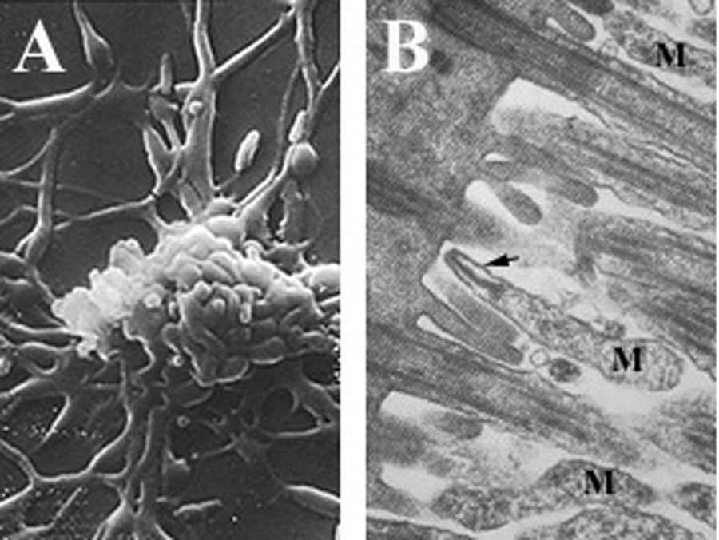
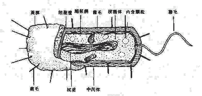
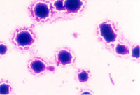
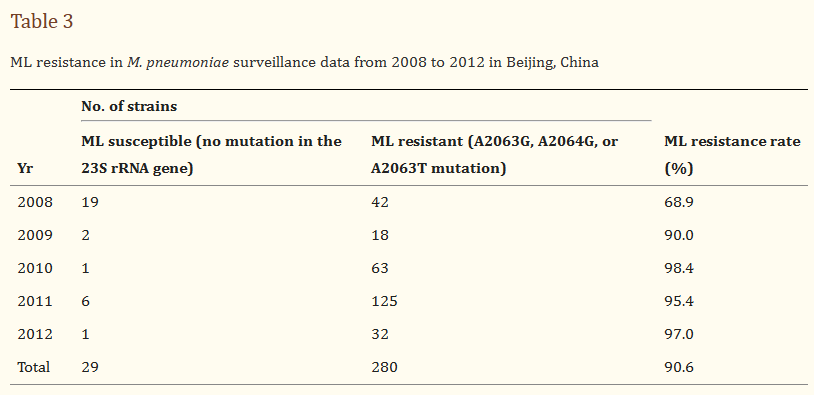

# 来势汹汹的支原体肺炎究竟是什么？我们又该如何应对？ - 少数派

#### TL;DR

-   支原体肺炎不是新鲜事物；
-   支原体肺炎不好确诊，但治疗方案相对完善；
-   成人与儿童均易感，没有有效疫苗，但大多是轻症；
-   发热先观察，不用过分紧张，具体怎么面对看最后一节。

- - -

`题图为肺炎支原体模拟图，图源 CDC。`

今年的异常气象让不少秋冬流行病都搭上了摆渡车，随着气温在夏秋冬反复横跳，它们也来回上班，造成了一波又一波聚集性感染。这一两个月，「支原体肺炎」屡屡成为热搜焦点，几乎成了困扰家长的第一大传染病——但你真的是第一次和它打交道吗？我们需要为这次季节性流行做什么准备吗？

这篇文章，我们聊几个简单的问题，顺便补一补年代有些久远的生物课。

## 什么是支原体？

首先需要明确一点，支原体（mycoplasma）是**一类微生物**。

说到支原体，不得不一起提一下和它名字相近，很容易搞混的「衣原体」。如果你见过早几年那些不太规范的男科妇科医药广告，可能对它们一边大呼小叫各种性传播疾病、一边跳着「支原体」「衣原体」之类的字幕有印象。有些朋友听懵了，就把支原体和衣原体也当成了病名。其实它们和为我们所熟知的细菌、病毒、真菌一样，都是能引起疾病的**病原体**。虽然常见于生殖系统疾病，但它们也能造成其他系统的感染，例如由肺炎支原体感染呼吸系统引起的肺炎，就叫「肺炎支原体肺炎」，通常说支原体肺炎大多都是这种，不仅常见，还相当高发。

图 A 里长成分枝状的一大坨，和图 B 中**标着 M 长得像炸虾的**，都是肺炎支原体. By Rottem et al. - Rottem, S., S., N., and D., J. (2012) in Biomedical Tissue Culture (Ceccherini-Nelli, L., ed.), [InTech](https://sspai.com/link?target=http%3A%2F%2Fwww.intechopen.com%2Fbooks%2Fbiomedical-tissue-culture%2Fcontamination-of-tissue-cultures-by-mycoplasmas) \[online\] (Accessed December 3, 2013)., [CC BY 3.0](https://sspai.com/link?target=https%3A%2F%2Fcommons.wikimedia.org%2Fw%2Findex.php%3Fcurid%3D29989585)

上面的两张图就是「肺炎支原体」（*M. pneumoniae*）的电镜照片。支原体这个名字也和它的形态特点有关。从图中我们就能看到，它可以是图 B 中 M 的丝状，也可以是 A 中的分枝状，由于这个「分枝」的形态特征，它在早期也有「枝原体」之名，后来统一规范为「支原体」。

## 支原体特别在哪里？

为什么支原体和衣原体会常常被拎出来单讲呢？

因为在很长一段时间里，到底怎么给它们在生物学上定分类都没个确定的说法。按现在的标准，支原体和衣原体都被放在了原核生物界/细菌域下。但至少在研究病原微生物的医学微生物学领域，支原体和衣原体都被拉出来单独介绍，因为它们的结构或功能与经典的细菌有点差别。

经典的细菌结构 [图源](https://sspai.com/link?target=http%3A%2F%2Fwww.a-hospital.com%2Fw%2F%25E5%258C%25BB%25E5%25AD%25A6%25E5%25BE%25AE%25E7%2594%259F%25E7%2589%25A9%25E5%25AD%25A6%2F%25E7%25BB%2586%25E8%258F%258C%25E7%259A%2584%25E7%25BB%2593%25E6%259E%2584)

一个典型的细菌至少由细胞壁、细胞膜、胞浆、核质组成。细菌虽然小，但它能利用上外部的营养物质，自身代谢来给自己供能。所以我们才可以做细菌培养，可以利用醋酸菌酿醋。衣原体的特别就在于这种功能上的缺失——它没有能代谢产生能量的酶，所以虽然它很像常规的细菌，但和病毒一样，必须寄生在其他活体细胞内才能正常生活。

**支原体**则不同，它的特别主要源自**结构**上的差别。支原体是目前发现的最小的原核生物，大概 0.2~0.3 μm，小到能通过细菌滤器，也是最简单的一种。比起一般的细菌，**它缺少了细胞壁**，最外层就是细胞膜，所以才会像上文所说，形态各异，常常变形。但即使是这样的支原体，也可以利用营养物质给自己供能。它会让人得病也是源自于此，它会粘附在呼吸道黏膜上，吃旁边的营养物质（对支原体来说，黏膜上皮细胞膜上的胆固醇就是大养料），顺便释放点过氧化氢和氧自由基之类的代谢产物，加上自己分泌的黏着剂等，造成细胞损伤。支原体肺炎主要就来源于这种损伤和它带来的局部免疫反应。

支原体 [图源](https://sspai.com/link?target=http%3A%2F%2Fwww.a-hospital.com%2Fw%2F%25E6%2594%25AF%25E5%258E%259F%25E4%25BD%2593)

## 支原体肺炎为什么是有点特殊的麻烦？

好，那既然这东西的本质还是接近细菌，我们就按细菌性感染，上抗菌药治不就行了吗？

先说结论：**确实**如此，**但**想一击入魂，实施起来有点困难。

这就要牵扯到抗菌药的作用机理和分类了。看到这里，你可以先想想，在没有医嘱的情况下，**说到抗生素，你能想到什么？**

平常说到「抗菌药」，大家的第一反应可能就是直接的「抗生素」。事实上抗生素只是抗菌药的一部分，它们是微生物或高等动植物代谢生成的一类干扰其他生活细胞发育的产物，还有一些是以这些天然提取的产物为基础改造出的半合成抗生素。除此之外，还有一些纯化学合成的抗菌药物。

从作用机制看，这些抗菌药物大多作用在以下几个方面：

-   抑制细菌**细胞壁**合成，让细菌因为渗透压差破裂；
-   影响**胞浆膜**通透性，让细菌内部有用的大小分子都漏出去；
-   抑制**蛋白质**合成，专门阻碍细菌的核糖体；
-   抑制**核酸**代谢，让细菌没法复制 / 转录 / 合成 DNA。

刚刚我们说过，支原体的一大结构特征，就是它和一般的细菌相比**缺乏细胞壁**。所以非常不幸地，作用在这一方向上的抗生素也就集体没用了。这一类抗生素主要是 **β-内酰胺类抗生素**。如果刚才那个问题，你的脑子里只有「青霉素 G」「阿莫西林」「头孢氨苄」等等带着「西林」「头孢」「培南」「曲南」的药物，恭喜你，这些全部都是 β-内酰胺类的抗生素。如果真的遇到支原体感染，吃这些**完全没用**。

根据国家卫生健康委办公厅在今年 2 月 15 日印发的《[儿童肺炎支原体肺炎诊疗指南（2023 年版）](http://www.nhc.gov.cn/yzygj/s7659/202302/8536e7db5cc7443eba13601e58d58861/files/b75c01f656c04653bfed27f0bb88b550.doc)》，支原体肺炎的首选药物是抑制蛋白质合成的大环内酯类抗生素，代表是阿奇霉素和罗红霉素。

这就解决问题了吗？**并没有**。

首先，支原体肺炎的症状并没有什么明确的特异性。它的症状是几乎所有轻症肺炎的表现：发热、疲倦、咽痛、咳嗽，有些感染甚至会没有明显症状，因人而异。影像学检查也常常没有明确的特征，表现得不甚典型。想要从这个季节同样流行的各种病毒性肺炎、轻症细菌性肺炎中区分出支原体肺炎，除了查核酸、抗体可以明确提示有（或者近期有过）感染，基本没什么能在临床起上作用的、能一锤定音的方法，更多靠的是结合**症状、影像检查、实验室检查和当地流行病状况**综合**推断**。而且，即使推断出患者大概率有肺炎支原体感染，也无法保证没有其他的病原体混合感染。更何况，比起其他病原体，支原体感染还不算是绝对的主流，一般也不会将它作为第一顺位怀疑。而且不少轻症肺炎在治疗途中就逐渐恢复了，没有进行病原体检定的必要，在还是「疑似」的阶段就结束了战斗。

其次，在诊疗指南中，还点出了一个不可忽视的现实状况：

> 国内大环内酯类抗菌药物耐药的支原体感染较普遍。

在一份 2013 年发表的基于 2008 至 2012 年北京地区肺炎支原体肺炎耐药性的[研究](https://sspai.com/link?target=https%3A%2F%2Fwww.ncbi.nlm.nih.gov%2Fpmc%2Farticles%2FPMC3591905%2F)显示，采集的来自 309 个案例的菌样中，带有对大环内酯类的耐药性突变的样本达到了 90.6%。一定程度上，这种普遍的耐药性可能也是重症肺炎支原体肺炎发生的主要原因之一。这可能是亚洲地区早期抗生素滥用造成的遗留问题，也是为什么现在会再三强调「不要滥用抗生素」，在很多时候，自主用药可能带来的后果是有效治疗的延迟，交给对替代方案、药物抗菌谱和不良反应更熟悉的医生显然是更好的选择。

[图源](https://sspai.com/link?target=https%3A%2F%2Fwww.ncbi.nlm.nih.gov%2Fpmc%2Farticles%2FPMC3591905%2F)

尤其是对儿童这样的易感群体，用药本身就会因为儿童的发育特点而有限制，如果遇到耐药感染，即使诊疗指南给出的替代药物也有明确的儿童不良反应，还有超说明书用药的情况，这些都需要临床医生根据实际情况研判。

## 我需要「特意」担心支原体肺炎吗？

和大家感觉到的一致，这几个月，支原体肺炎的患者确实是多了。与其说是多了，不如说是**过去几年里，支原体肺炎的患者太少了。**

很多人都在担心，是不是新冠的感染造成了本次支原体肺炎的大流行，让人群更易感。事实上，除了还处在新冠恢复期，黏膜尚未修复完全的个体，大多数感染者只是被卷进了支原体肺炎本身的流行规律。

在过去几年面向新冠的防疫里，口罩阻碍了大量呼吸系统传染病的主要传播途径，支原体肺炎也不例外。支原体肺炎主要依靠飞沫传播，本来也有稳定的流行期和一定的流行规律，每隔几年，就会因为普遍的体内抗体量下降而来一次流行。连续几年的低水平流行让群体抗体水平普遍走低。今年停止了集体口罩佩戴，再加上社交聚集的恢复，易感人群一下以低抗体量暴露在病原体面前，自然患病率就有提升，更别提还有大量首次感染的儿童，可它本质上还是一个普通的常见流行病。

目前正是支原体肺炎好发的秋冬季，2 月卫健委就发了新诊疗指南，9 月以来，多地的疾控部门就开始发布提醒。赶上今年的天气状况不大稳定，多地反复入秋入冬，晴雨不定，温湿度的波动也让人免疫力下降，更加易感。人体对抗支原体的主要武器是呼吸道黏膜表面分泌的黏液，以及里面的 IgA 抗体，过于不利的外部环境对呼吸道的这种局部免疫影响不小。另一方面，肺炎支原体现在也没有成功的疫苗，甚至有临床试验时受试者不但没产生有效抗体，还在下一次感染时出现病情加重的[状况](https://sspai.com/link?target=https%3A%2F%2Fpubmed.ncbi.nlm.nih.gov%2F33503845%2F)（疫苗增强型疾病，VED，vaccine enhanced disease）。

但我们目前仍然**不需要特意**为支原体肺炎担心。

首先，支原体肺炎年年有，虽然抗药性问题明显，今年状况也确实猛烈了些，但仍然没有脱离支原体肺炎的基本盘：**轻症居多，有自限性。**

轻症是说大部分人起病后的表现比较温和，其实还有更多人感染后甚至[发展不到](https://sspai.com/link?target=https%3A%2F%2Fwww.ncbi.nlm.nih.gov%2Fbooks%2FNBK7637%2F)临床上有明显肺炎的程度；自限性（self-limiting）指的是不经治疗也可自愈，免疫系统就能处理好（诊疗指南指出诊疗后儿童感染轻症的病程多在 7-10 天，且预后良好；成人完全自限的病程大概在 [4-6 周](https://sspai.com/link?target=https%3A%2F%2Fwww.ncbi.nlm.nih.gov%2Fbooks%2FNBK7637)），[临床医生](https://sspai.com/link?target=https%3A%2F%2Fwww.cdc.gov%2Fpneumonia%2Fatypical%2Fmycoplasma%2Fhcp%2Fantibiotic-treatment-resistance.html)习惯的抗生素治疗可以有效缩短病程。轻症不需住院，早期靠对症治疗即可，一边观察病情变化，充分休息，咳得太多就镇咳，不会咳痰就排痰，发烧太高就退热，但后面具体如何用药、用什么药，就要看医生的综合研判，优先考虑是什么病原体感染了。

这几年应该已经教给大家一个道理：发热是免疫系统有在工作时的正常现象，不是持续的高热一般问题不大。支原体肺炎的患儿发热常以**中高热**（约 38°C~40°C）为主，而且会**反复发热**，如果已经是学龄儿童，没必要刚一发烧就往医院送，很多时候没做好防护地去医院，比在家有看护地烧一会更危险。（如果是学龄前，建议尽早送医，尤其 1 岁以下婴儿。）

其次，就预防来讲，虽然没有什么疫苗，但普遍的「多通风、少聚集、勤洗手」仍然适用且有用。尽管轻症肺炎一般不影响生活，如果自己得了还要为生活所迫继续上班，或是家中有其他人，务必**做好个人防护**，戴口罩、勤洗手，打喷嚏和咳嗽时覆盖口腔，减少飞沫扩散，避免传染。同期还有其他会导致轻症肺炎的病原体流行，一套动作全面防御。

总体上看，面对支原体肺炎，我们能做的基本与其他呼吸系统流行病一致，没什么可特殊准备的。尤其大多数情况下，它都只会是一次小小的疾病，不必过分紧张。但我也能理解，现在关注这一方面的大多是家长。如果家里的小朋友（学龄儿童）出现了症状，一是可以参考一下最近身边是不是已经有聚集性感染，二也是更重要的，密切观察病情走向，记录每次发热温度。

根据诊疗指南，如果出现了：

-   持续高热（39°C 以上）大于 5 天；
-   或发热大于 7 天，体温**高峰无下降趋势**；
-   出现喘息、气促、呼吸困难、胸痛、咯血等症状；
-   出现呼吸系统以外的症状，比如皮疹、抽搐、尿液颜色异常等；

说明疾病有重症表现，或是出现了并发症，需要即刻就医。

一般在首次发热后 5⁠–7 天内，绝大多数患儿病情发展就已经到达高峰，所以诊疗指南把 5 天这个时间作为判断和治疗重症的窗口。

具体到个人，你可以观察发热状况一到三天，看能否发现规律或趋势，病情有何变化，服退烧药退热后精神状态如何，痰的颜色和性状有无改变；如果精神够好、病情稳定、没有其他系统的症状、体温高峰也有下降，就可以再多观察一下；如果有需要，也能在就诊时为医生多提供一些信息。记住，大人同样易感，注意室内防护，不要掉以轻心。

祝大家身体健康。

 > 关注 [少数派公众号](https://sspai.com/s/J71e)，解锁全新阅读体验 📰

\> 实用、好用的 [正版软件](https://sspai.com/mall)，少数派为你呈现 🚀
