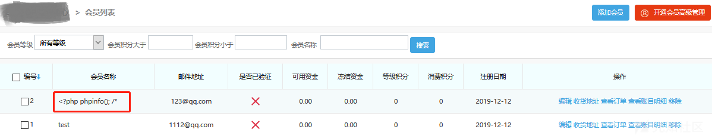

# 某CMS后台远程代码执行漏洞 - 先知社区

某CMS后台远程代码执行漏洞

- - -

## 前言

在审计某CMS代码时，发现后台存在一处比较有意思的远程代码执行漏洞，这里跟大家分享下

## 漏洞分析

漏洞触发点位于下图代码段中

见上图803行处，存在一处fwrite方法：

程序会将修改日志$log变量中的值保存到'/integrate\_' . $\_SESSION\['code'\] .'\_log.php'文件中

接下来看一下$log变量是如何拼接的：

$log变量是由如下一个或多个变量控制:$del\_list、$rename\_list以及$ignore\_list

当这个三个变量存在时，则将其值拼接到$log变量中

这里着重看一下$ignore\_list变量，分析代码可以发现，$ignore\_list变量由下述代码中赋值得来

由上图代码可见$ignore\_list变量由数据库中users表user\_name数据组成。其实$ignore\_list就是users表中flag等于4的所有user\_name字段组成的列表

见上图，当请求中act参数值为sync时，并且当users表中存在flag=4的行时，触发此处$ignore\_list赋值操作，将users表中flag等于4的所有行的user\_name字段值插入$ignore\_list列表

当$ignore\_list列表非空时，触发同样在此if分支(请求中act参数值为sync的这个分支)中的漏洞点

上图红框处，$ignore*list列表中的用户名被取出，用来拼接$log变量，随后$log变量被写入'/integrate*'. $\_SESSION\['code'\] . '\_log.php'文件中

程序并未对会员用户名进行严格过滤，导致可以写入含有payload的用户名，例如

当我们将含有恶意payload用户名的用户flag设置为4时，通过访问

[http://127.0.0.1/admin/integrate.php?act=sync](http://127.0.0.1/admin/integrate.php?act=sync)

即可将含有payload用户名写入'/integrate\_' . $\_SESSION\['code'\] . '\_log.php'文件中

接下来分析下被插入payload文件的位置与名字

可见上图，这个文件位置很好定位，位于ROOT\_PATH . DATA\_DIR路径，即为data文件夹中。

关于文件名，中间存在一个$\_SESSION\['code'\]变量，此处变量是可以设置的，但是如果我们不进行特殊设置的化，这个变量默认是空，因此我们并不需要额外的设置这个变量，默认让它为空就可以了，这样以来被插入后门的文件就变成

data/integrate\_\_log.php

接下来分析下，如何使users中我们构造的恶意用户flag为4

默认情况下，会员用户flag为0，当会员整合功能被使用时，其他应用商城的会员被整合合并到这个cms时，当存在一些问题需要忽略这个用户时，flag才会被设置为4

如果使用这种方法，则需要攻击者自行搭建一个此cms允许合并数据的商城程序，在这个商城程序中构造一个会员，当使用会员合并功能时，使之出现问题，从而使得被合并的会员flag为4

利用会员整合功能修改flag值是一种途径，然而有一种更简便的方法。此cms程序后台存在可以管理数据库的功能，我们可以通过这个功能直接把用户名为”<?php phpinfo(); /\*”的这条数据中flag字段设置为”4”，见下图

这样一来，当访问

[http://127.0.0.1/admin/integrate.php?act=sync](http://127.0.0.1/admin/integrate.php?act=sync)

时，该数据将会被取出，含有payload的用户名将会被写入日志文件中

文件被访问时，payload执行

