# 某云星空的前台反序列化和任意文件上传漏洞分析 - 先知社区

某云星空的前台反序列化和任意文件上传漏洞分析

* * *

## 搭建环境

参考链接：[https://www.heshuyun.com/265.html](https://www.heshuyun.com/265.html)

环境：WindowsServer 2012 + 金蝶云星空 7.6

（建议自己用一个云服务器或者纯净的虚拟机）

## 如果利用dnSpy远程调试环境

[https://github.com/dnSpy/dnSpy/releases/tag/v6.1.8](https://github.com/dnSpy/dnSpy/releases/tag/v6.1.8) (这个漏洞复现是利用win64版本)

1.  首先添加系统环境变量，**COMPLUS\_ZapDisable = 1**
2.  然后需要调试IIS进程，进入到`C:\Windows\System32\inetsrv`目录，利用cmd执行`appcmd list wp` 查看对应的应用程序池进程ID
3.  打开dnSpy，调试-->附加到进程-->选择相应的进程ID-->附加
4.  调试-->窗口-->模块-->搜索要调试的程序集-->双击
5.  在程序集资源管理器找到要调试的类打开，然后就可以打断点，发送payload进行调试

## 反序列化漏洞

### 开始

环境搭建起来后，有一个用户端和管理端，我们看website端

搭建起来的源码在`C:\Program Files (x86)\Kingdee\K3Cloud\WebSite`中

首先看web.config配置文件，发现对于我们`.kdsvc`后缀的文件我们是通过`KDServiceHandler`处理的

```plain
Kingdee.BOS.ServiceFacade.KDServiceFx.KDServiceHandler,Kingdee.BOS.ServiceFacade.KDServiceFx
```

[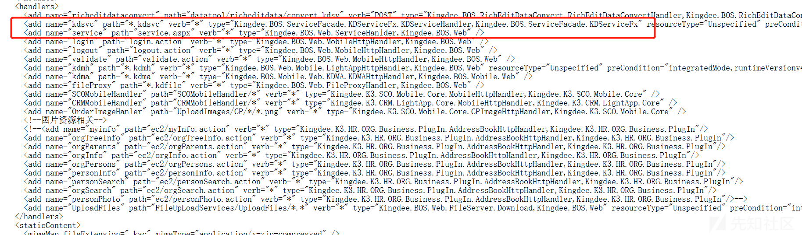](https://xzfile.aliyuncs.com/media/upload/picture/20231120163657-f75ee95a-877f-1.png)

对于这个handler就很类似于Spring中的controller，直接去处理我们的请求

在`KDServiceHandler`中，返回了一个`KSDVHandler`，所以就是`KSDVHandler`去处理的

[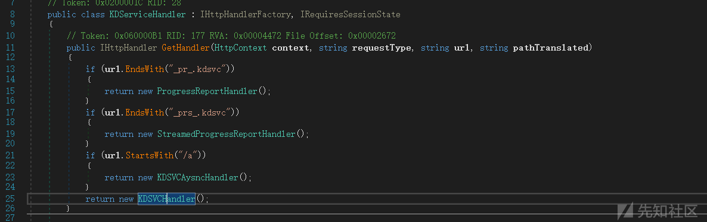](https://xzfile.aliyuncs.com/media/upload/picture/20231120163710-fecdb37e-877f-1.png)

而在`KSDVHandler`是在`ProcessRequest`方法中处理

[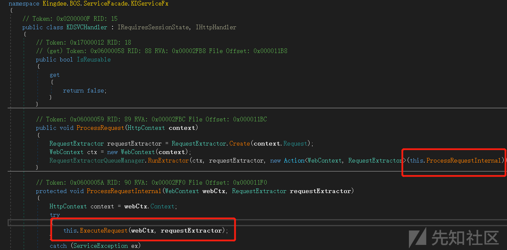](https://xzfile.aliyuncs.com/media/upload/picture/20231120163720-04e2c13c-8780-1.png)

通过一个Action类进入`ProcessRequestInternal`,然后再进入`ExecuteRequest`方法

[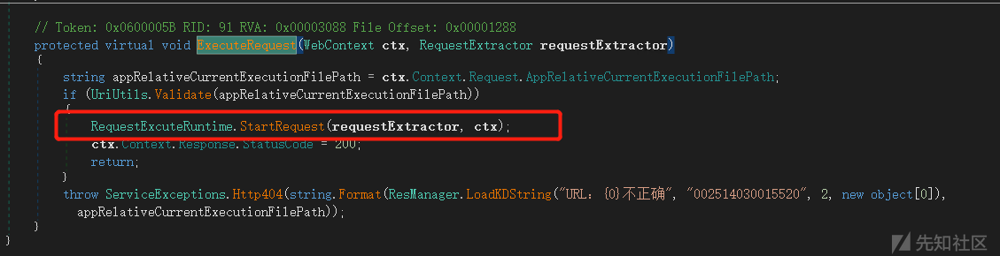](https://xzfile.aliyuncs.com/media/upload/picture/20231120163729-0a7323a8-8780-1.png)

进入`StartRequest`

[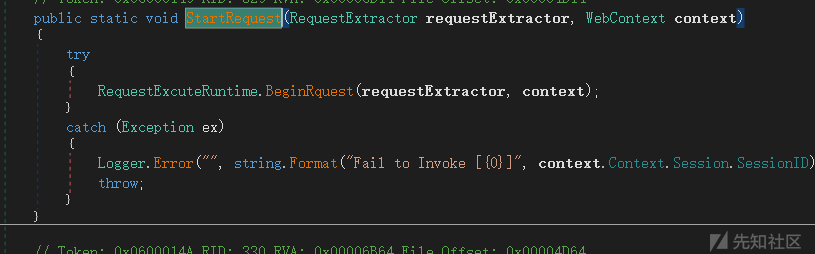](https://xzfile.aliyuncs.com/media/upload/picture/20231120163740-10fc901a-8780-1.png)

进入`BeginRquest`方法中，会先处理一些会话session的问题

[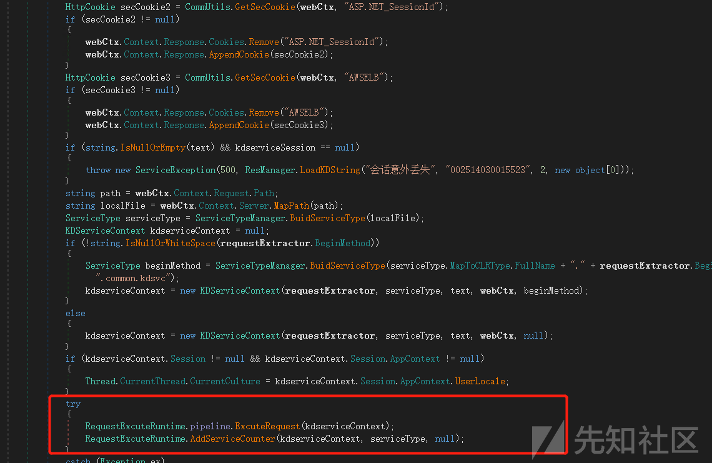](https://xzfile.aliyuncs.com/media/upload/picture/20231120163752-17fd2744-8780-1.png)

继续进入`RequestExcuteRuntime.pipeline.ExcuteRequest(kdserviceContext);`

[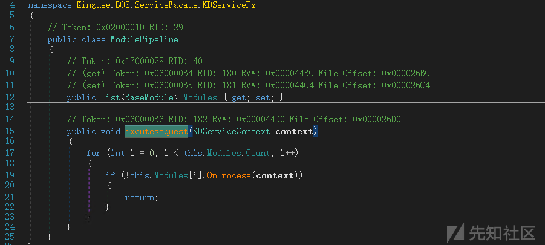](https://xzfile.aliyuncs.com/media/upload/picture/20231120163803-1e60e1de-8780-1.png)

最后调用了`ExecuteServiceModule`的`OnProcess`方法

在这个方法中有三个比较重要的地方

### 重点1--GetServiceParameters()

```plain
string[] serviceParameters = requestExtractor.GetServiceParameters((from **p** in kdservice.MapToMethod.GetParameters()
```

[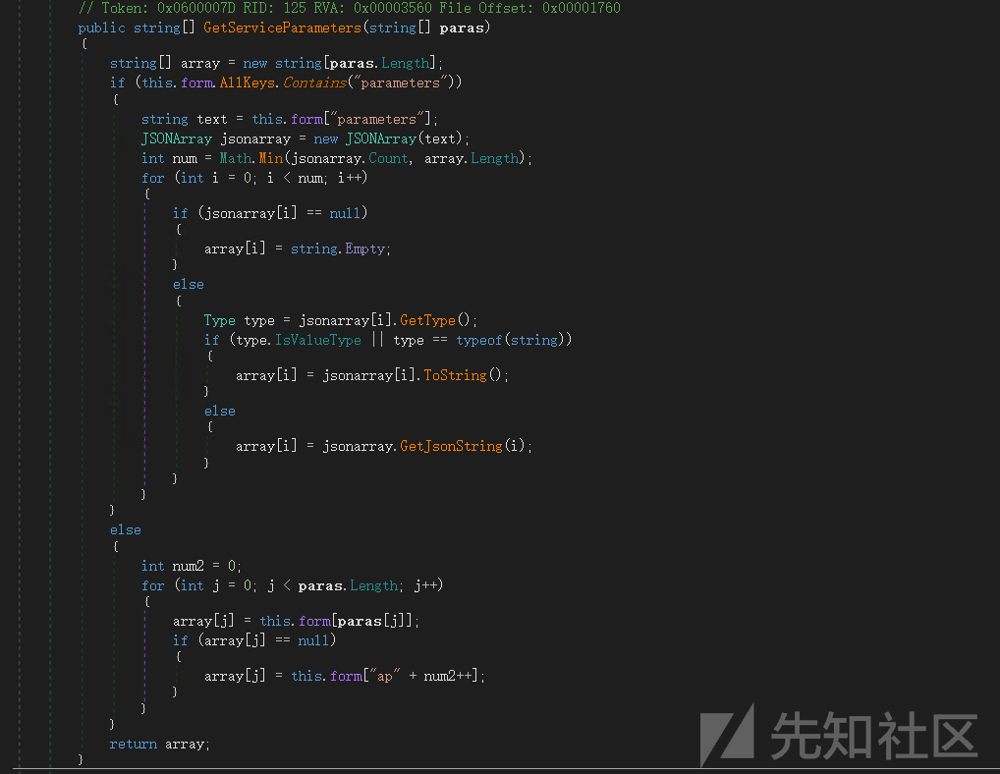](https://xzfile.aliyuncs.com/media/upload/picture/20231120163823-2ad3ec22-8780-1.png)

`this.form`： 在`KDSVCHandler#ProcessRequest` 中通过`Create()`方法，对 requestExtractor 进行了初始化，会将JSON body里面的参数变成一个key-value的form，如果`Content-Type：text/json`就会调用 JQueryRequestExtractor 将参数变成 form。如果不是JSON的格式，就直接是一个key-value的form

[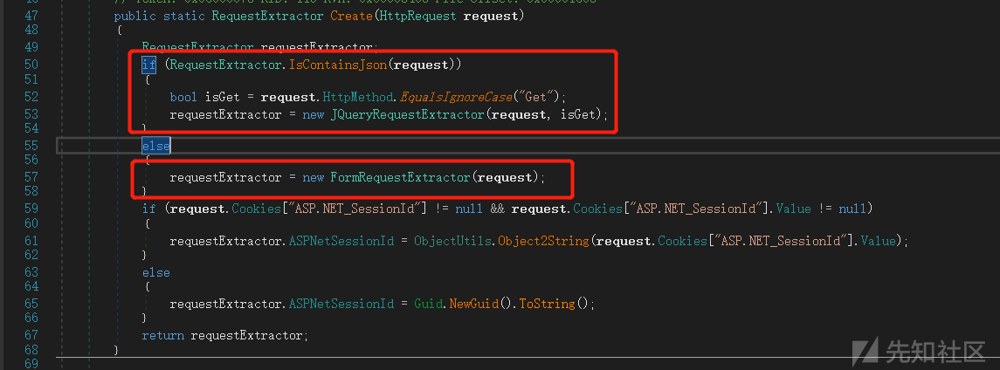](https://xzfile.aliyuncs.com/media/upload/picture/20231120163845-37811724-8780-1.png)

1.如果在我们的POST参数中有`parameters`,获取到后变成JSON数组，然后将数组里的值给Array返回回去。

所以在payload中，如果是含有`parameters`，就直接是`"parameters": "[\"gadget\"]"`的形式（字符串里有个数组形式）

```plain
{"format": 3,  "parameters": "[\"gadget\"]"}
```

2.如果我们走else，参数就可以为`pparams`（不固定的）或者`ap0`的形式

```plain
{"ap0":"gadget","format":"3"}
{"pparams":"gadget","format":"3"}
```

[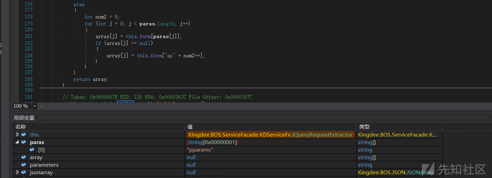](https://xzfile.aliyuncs.com/media/upload/picture/20231120163856-3e86f0f2-8780-1.png)

### 重点2-- new SerializerProxy()

根据我们传的format，然后选择对应的SerializerProxy（JSON or Binary）

[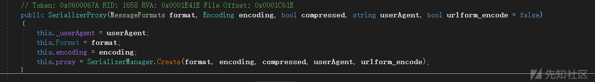](https://xzfile.aliyuncs.com/media/upload/picture/20231120163906-44515874-8780-1.png)

[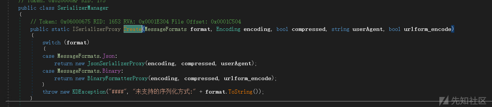](https://xzfile.aliyuncs.com/media/upload/picture/20231120163916-4a464b18-8780-1.png)

因为我们传入的format是3，所以直接跟`Binary`匹配到，利用的是`BinaryFormatterPorxy`

[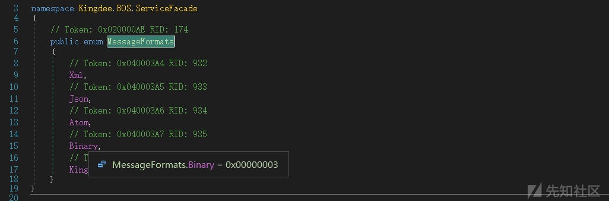](https://xzfile.aliyuncs.com/media/upload/picture/20231120163928-51912a1e-8780-1.png)

### 重点3--this.executor.Execute()

调用相应的serializer进行反序列化

[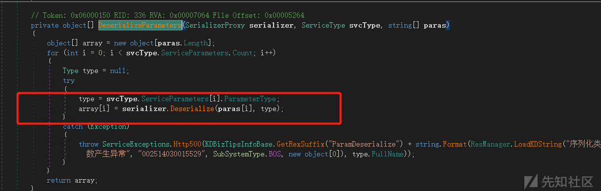](https://xzfile.aliyuncs.com/media/upload/picture/20231120163938-5744af80-8780-1.png)

调用了BinaryFormatterProxy。

对于`this.encoder.Decoding`就会根据对应的编码进行解析。所以在payload中，不仅可以利用Base64进行编码，我们还可以利用Hex进行编码

[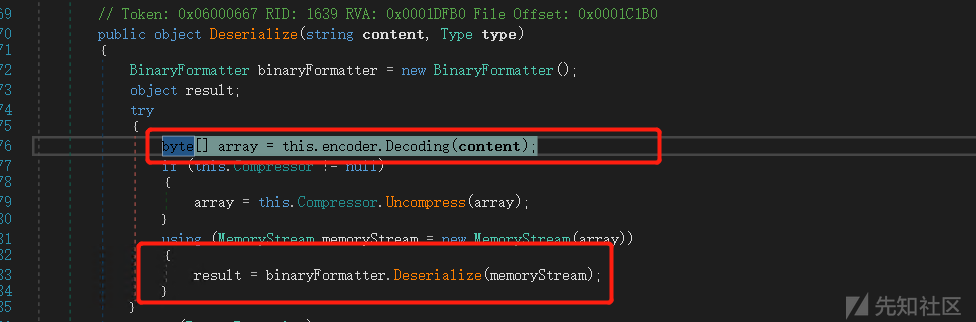](https://xzfile.aliyuncs.com/media/upload/picture/20231120163946-5c30d3ca-8780-1.png)

### 最后

对于整个的payload，一是我们的路由很多都可以通用的，只要可以进`KDSVCHandler`这个handler；二是和整体的JSON参数key可以有几种形式，但是format是必需的；三是payload的加密的方式，这个不仅可以利用JSON格式传入还可以直接是常规POST参数传入。

### 漏洞复现

直接利用`ysoserial.net`生成payload

```plain
ysoserial.exe -o base64 -f BinaryFormatter -g ClaimsIdentity -c "cmd /c \"ping xxxx\""
```

### 补丁

直接是把二进制序列化的形式给ban了

[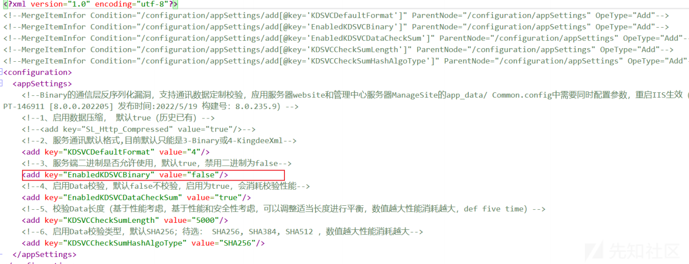](https://xzfile.aliyuncs.com/media/upload/picture/20231120164100-87e82ba8-8780-1.png)

## 任意文件上传漏洞

### 分析

问题出现在ScpSupRegHandler  
对于接口的配置文件，是在`\WebSite\App_Data\Common.config`中

[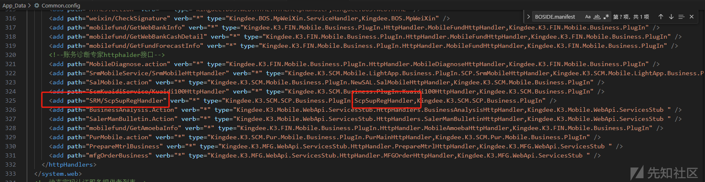](https://xzfile.aliyuncs.com/media/upload/picture/20231120164221-b8baff80-8780-1.png)

配置文件怎么去加载获取的，往上走

在`FileConfig.xml.deploy`，部署时加载了这个Common.config

[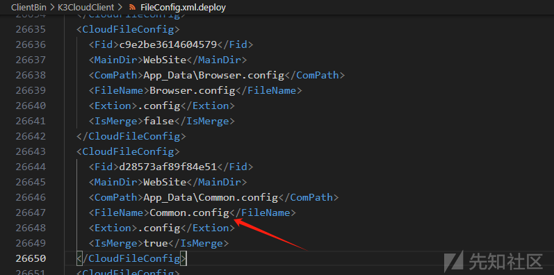](https://xzfile.aliyuncs.com/media/upload/picture/20231120164231-be5eb45e-8780-1.png)

利用DnSpy反编译后，查看`ScpSupRegHandler`

`ScpSupRegHandler`是继承了`IHttpHandler`接口的，所以默认处理路由的方法是`ProcessRequest`

如果有方法是POST，且是文件上传的格式，进入到`SavaAttach`方法中

[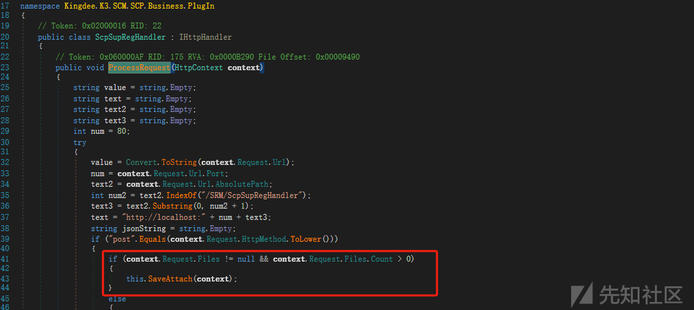](https://xzfile.aliyuncs.com/media/upload/picture/20231120164244-c64ddfc8-8780-1.png)

在`SavaAttach`方法中，

`context.Request.Files[0]` 获取 HTTP 请求中的文件集合，并选择第一个文件

`Path.GetExtension(httpPostedFile.FileName)`获取到文件名的扩展名，然后替代`.`为空，再变成小写

[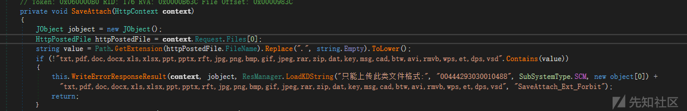](https://xzfile.aliyuncs.com/media/upload/picture/20231120164253-cbbe7800-8780-1.png)

如果是，`test.aspx.txt`，取到的扩展名是`.txt`，说明是取最后一个点后面的内容

那如果是`test.aspx.`,取到的扩展名就是`.`，替代后就是空

对于`"abc".Contains(value)`，value为空，字符串是肯定包含空的，从而实现绕过。

后面就是需要加个`FID`和`dbId_v`参数赋值

[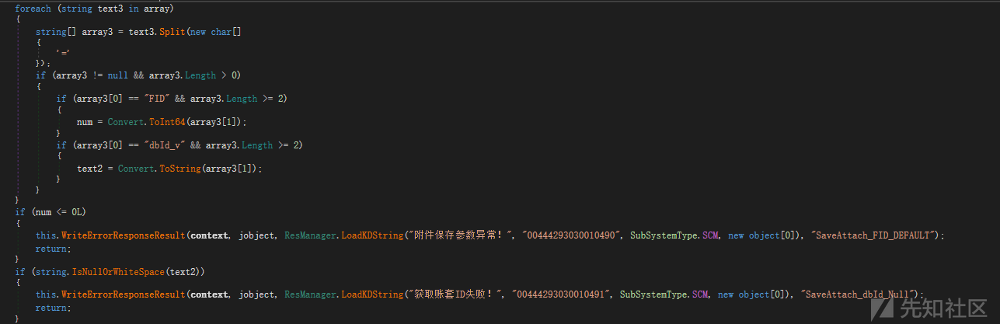](https://xzfile.aliyuncs.com/media/upload/picture/20231120164302-d0d245c4-8780-1.png)

最后就是文件上传，然后利用文件名中的`../`和windows的特性（会在文件上传时，对最后一个点会删除）

[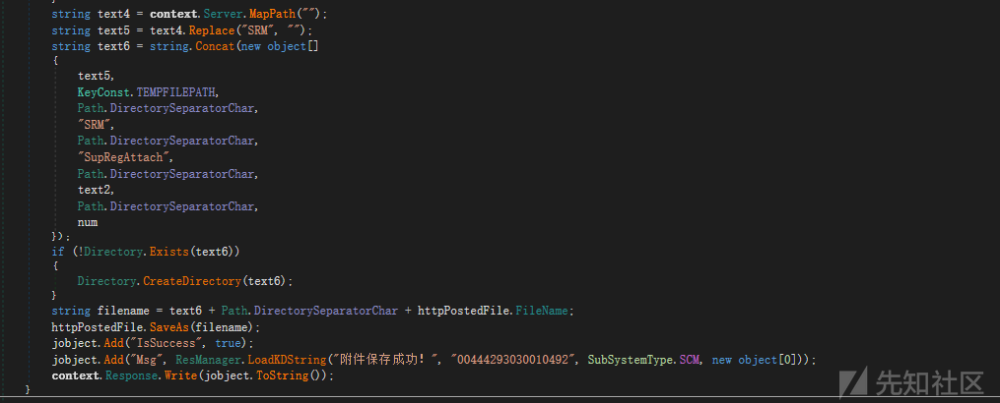](https://xzfile.aliyuncs.com/media/upload/picture/20231120164312-d6a32c34-8780-1.png)

[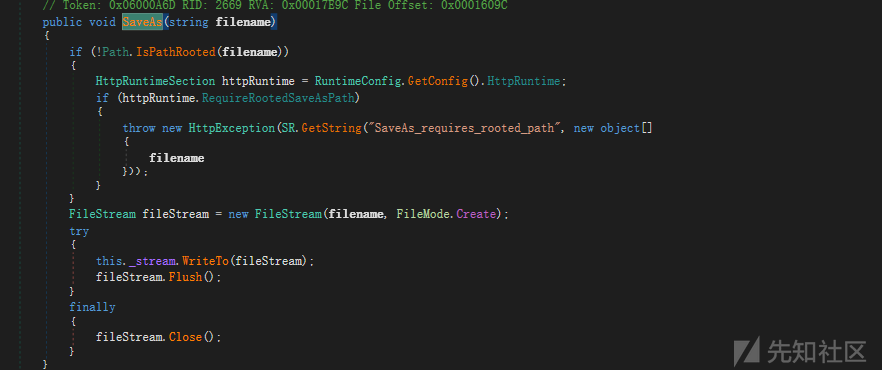](https://xzfile.aliyuncs.com/media/upload/picture/20231120164322-dcd517ac-8780-1.png)

### 总结

对于这个漏洞学到的trick就是，在文件上传的时候，对于文件名后缀的匹配利用到`Contains`,而当后缀为空时，依然可以绕过，同时利用到windows会处理掉最后的`.`点号。

### 最后的POC

[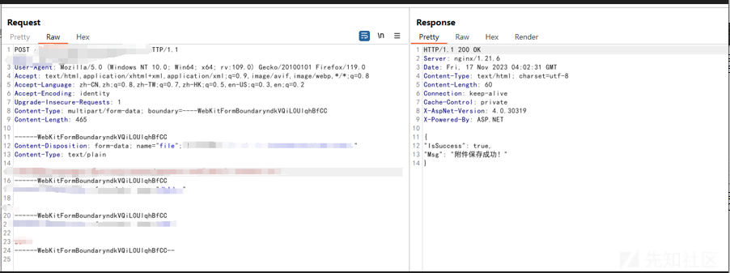](https://xzfile.aliyuncs.com/media/upload/picture/20231120164343-e9110224-8780-1.png)

[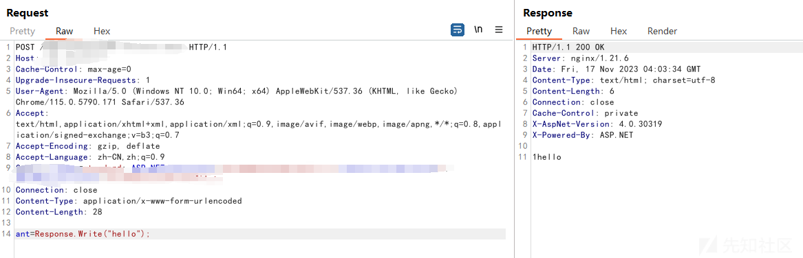](https://xzfile.aliyuncs.com/media/upload/picture/20231120164351-edf9cae6-8780-1.png)
